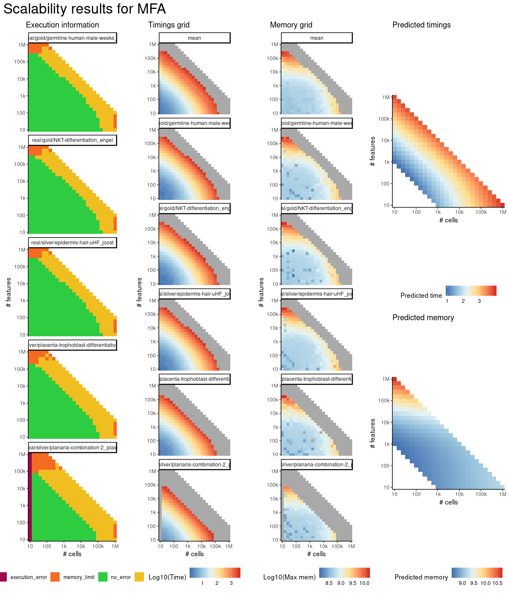
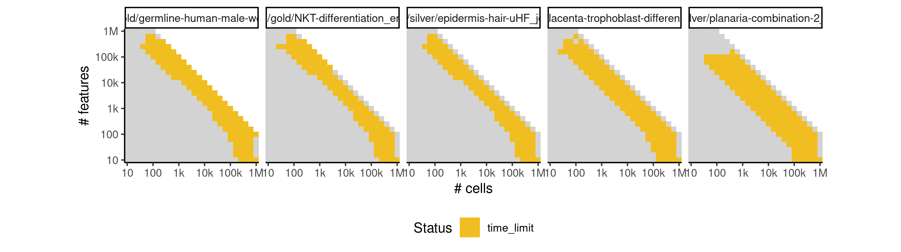

# mfa


## ERROR STATUS TIME_LIMIT

### ERROR CLUSTER TIME_LIMIT -- 1


 * Number of instances: 1
 * Dataset ids: scaling_1145

Last 10 lines of scaling_1145:
```
File: /home/rcannood/Workspace/dynverse/dynbenchmark//derived/05-scaling/suite/mfa/Cat2/r2gridengine/20181008_215048_mfa_Cat2_vGFiweR8ib/log/log.465.e.txt
```


