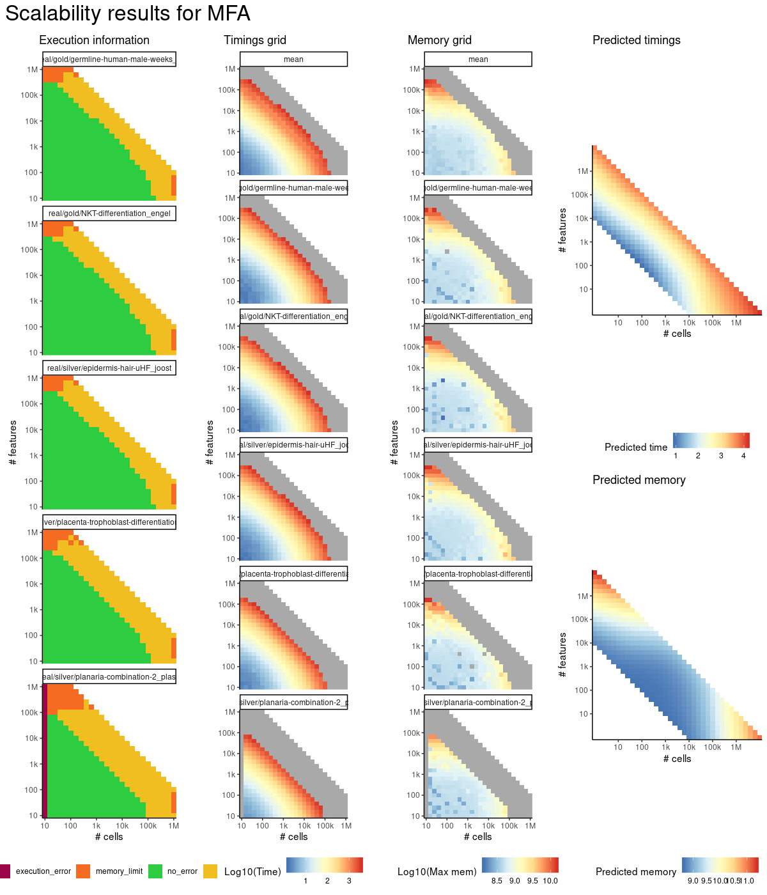
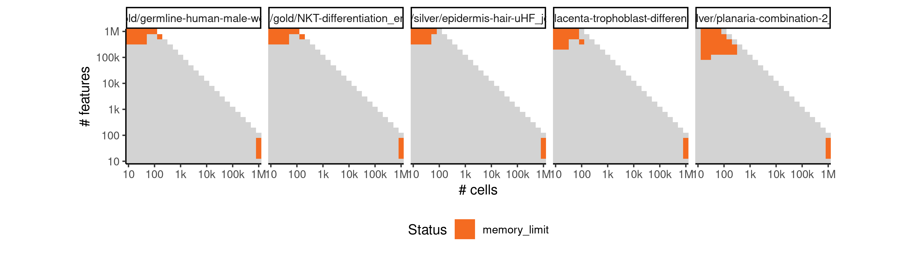

# mfa


## ERROR STATUS TIME_LIMIT

### ERROR CLUSTER TIME_LIMIT -- 1


 * Number of instances: 204
 * Dataset ids: scaling_1145, scaling_1229, scaling_1244, scaling_1245, scaling_1274, scaling_1275, scaling_1295, scaling_1296, scaling_1316, scaling_1317, scaling_1337, scaling_1338, scaling_1357, scaling_1358, scaling_1359, scaling_1363, scaling_1364, scaling_1365, scaling_1366, scaling_1367, scaling_1368, scaling_1369, scaling_1370, scaling_1371, scaling_1372, scaling_1373, scaling_1374, scaling_1375, scaling_1376, scaling_1377, scaling_1378, scaling_1379, scaling_1380, scaling_1392, scaling_1404, scaling_1416, scaling_1417, scaling_1427, scaling_1428, scaling_1430, scaling_1431, scaling_1432, scaling_1433, scaling_1434, scaling_1435, scaling_1436, scaling_1437, scaling_1438, scaling_1439, scaling_1440, scaling_1451, scaling_1452, scaling_1463, scaling_1464, scaling_1475, scaling_1476, scaling_1486, scaling_1487, scaling_1488, scaling_1491, scaling_1492, scaling_1493, scaling_1494, scaling_1495, scaling_1496, scaling_1497, scaling_1498, scaling_1499, scaling_1500, scaling_1506, scaling_1512, scaling_1518, scaling_1519, scaling_1520, scaling_1521, scaling_1522, scaling_1523, scaling_1524, scaling_1525, scaling_1526, scaling_1527, scaling_1528, scaling_1529, scaling_1530, scaling_1546, scaling_1547, scaling_1548, scaling_1549, scaling_1552, scaling_1565, scaling_1566, scaling_1567, scaling_1568, scaling_1584, scaling_1585, scaling_1586, scaling_1587, scaling_1591, scaling_1592, scaling_1593, scaling_1594, scaling_1595, scaling_1596, scaling_1597, scaling_1598, scaling_1599, scaling_1600, scaling_1601, scaling_1602, scaling_1603, scaling_1604, scaling_1605, scaling_1606, scaling_1611, scaling_1612, scaling_1613, scaling_1614, scaling_1615, scaling_1616, scaling_1617, scaling_1618, scaling_1619, scaling_1620, scaling_1621, scaling_1622, scaling_1623, scaling_1624, scaling_1625, scaling_1628, scaling_1629, scaling_1630, scaling_1631, scaling_1632, scaling_1633, scaling_1641, scaling_1642, scaling_1643, scaling_1644, scaling_1645, scaling_1646, scaling_1647, scaling_1650, scaling_1651, scaling_1652, scaling_1653, scaling_1654, scaling_1663, scaling_1664, scaling_1665, scaling_1666, scaling_1667, scaling_1668, scaling_1669, scaling_1672, scaling_1673, scaling_1674, scaling_1675, scaling_1676, scaling_1677, scaling_1685, scaling_1686, scaling_1687, scaling_1688, scaling_1689, scaling_1690, scaling_1691, scaling_1694, scaling_1695, scaling_1696, scaling_1697, scaling_1698, scaling_1699, scaling_1700, scaling_1701, scaling_1702, scaling_1703, scaling_1704, scaling_1705, scaling_1706, scaling_1707, scaling_1708, scaling_1709, scaling_1710, scaling_1711, scaling_1712, scaling_1713, scaling_1718, scaling_1719, scaling_1720, scaling_1721, scaling_1722, scaling_1723, scaling_1724, scaling_1725, scaling_1726, scaling_1727, scaling_1728, scaling_1729, scaling_1730, scaling_1731, scaling_1732, scaling_1733, scaling_1734, scaling_1735

Last 10 lines of scaling_1145:
```
File: /home/rcannood/Workspace/dynverse/dynbenchmark//derived/05-scaling/suite/mfa/Cat2/r2gridengine/20181008_215048_mfa_Cat2_vGFiweR8ib/log/log.465.e.txt
```

## ERROR STATUS MEMORY_LIMIT

### ERROR CLUSTER MEMORY_LIMIT -- 1


 * Number of instances: 34
 * Dataset ids: scaling_1231, scaling_1339, scaling_1361, scaling_1362, scaling_1429, scaling_1441, scaling_1453, scaling_1465, scaling_1477, scaling_1478, scaling_1490, scaling_1531, scaling_1532, scaling_1550, scaling_1551, scaling_1569, scaling_1570, scaling_1588, scaling_1589, scaling_1590, scaling_1608, scaling_1609, scaling_1610, scaling_1626, scaling_1627, scaling_1648, scaling_1649, scaling_1670, scaling_1671, scaling_1692, scaling_1693, scaling_1715, scaling_1716, scaling_1717

Last 10 lines of scaling_1231:
```
The following objects are masked from ‘package:stats’:
    filter, lag
The following objects are masked from ‘package:base’:
    intersect, setdiff, setequal, union
Attaching package: ‘purrr’
The following object is masked from ‘package:jsonlite’:
    flatten
Sampling for 16 cells and 100000 genes
Error: cannot allocate vector of size 7.5 Gb
Execution halted
```


