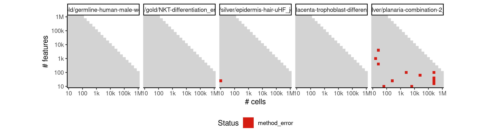
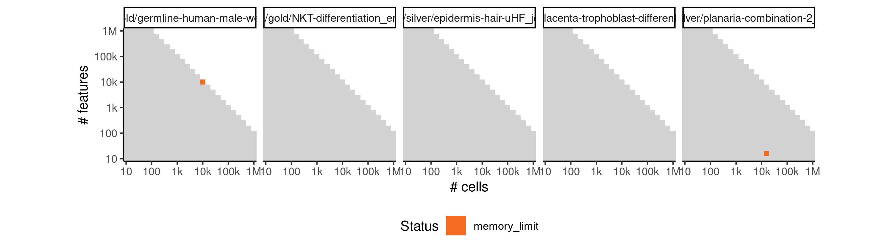

# monocle_ica


## ERROR STATUS METHOD_ERROR

### ERROR CLUSTER METHOD_ERROR -- 1


 * Number of instances: 50
 * Dataset ids: scaling_0007, scaling_0010, scaling_0041, scaling_0061, scaling_0121, scaling_0135, scaling_0150, scaling_0176, scaling_0224, scaling_0272, scaling_0326, scaling_0450, scaling_0455, scaling_0501, scaling_0505, scaling_0553, scaling_0680, scaling_0759, scaling_0760, scaling_0848, scaling_0849, scaling_0910, scaling_0947, scaling_0948, scaling_1045, scaling_0007, scaling_0010, scaling_0041, scaling_0061, scaling_0121, scaling_0135, scaling_0150, scaling_0176, scaling_0224, scaling_0272, scaling_0326, scaling_0450, scaling_0455, scaling_0501, scaling_0505, scaling_0553, scaling_0680, scaling_0759, scaling_0760, scaling_0848, scaling_0849, scaling_0910, scaling_0947, scaling_0948, scaling_1045

Last 10 lines of scaling_0007:
```
Loading required package: VGAM
Loading required package: stats4
Loading required package: splines
Loading required package: DDRTree
Loading required package: irlba
Removing 1 outliers
Error in parametricDispersionFit(disp_table[row.names(disp_table) %in%  : 
  Parametric dispersion fit failed. Try a local fit and/or a pooled estimation. (See '?estimateDispersions')
Calls: <Anonymous> ... estimateDispersionsForCellDataSet -> parametricDispersionFit
Execution halted
```

### ERROR CLUSTER METHOD_ERROR -- 2


 * Number of instances: 130
 * Dataset ids: scaling_0011, scaling_0045, scaling_0050, scaling_0051, scaling_0072, scaling_0101, scaling_0102, scaling_0103, scaling_0104, scaling_0105, scaling_0136, scaling_0139, scaling_0178, scaling_0213, scaling_0214, scaling_0225, scaling_0251, scaling_0255, scaling_0274, scaling_0321, scaling_0327, scaling_0330, scaling_0339, scaling_0371, scaling_0387, scaling_0388, scaling_0390, scaling_0444, scaling_0445, scaling_0452, scaling_0453, scaling_0498, scaling_0502, scaling_0503, scaling_0504, scaling_0522, scaling_0550, scaling_0554, scaling_0594, scaling_0598, scaling_0668, scaling_0676, scaling_0677, scaling_0751, scaling_0752, scaling_0762, scaling_0763, scaling_0764, scaling_0820, scaling_0840, scaling_0841, scaling_0851, scaling_0853, scaling_0889, scaling_0901, scaling_0907, scaling_0908, scaling_0909, scaling_0949, scaling_0979, scaling_1023, scaling_1038, scaling_1047, scaling_1048, scaling_1049, scaling_0011, scaling_0045, scaling_0050, scaling_0051, scaling_0072, scaling_0101, scaling_0102, scaling_0103, scaling_0104, scaling_0105, scaling_0136, scaling_0139, scaling_0178, scaling_0213, scaling_0214, scaling_0225, scaling_0251, scaling_0255, scaling_0274, scaling_0321, scaling_0327, scaling_0330, scaling_0339, scaling_0371, scaling_0387, scaling_0388, scaling_0390, scaling_0444, scaling_0445, scaling_0452, scaling_0453, scaling_0498, scaling_0502, scaling_0503, scaling_0504, scaling_0522, scaling_0550, scaling_0554, scaling_0594, scaling_0598, scaling_0668, scaling_0676, scaling_0677, scaling_0751, scaling_0752, scaling_0762, scaling_0763, scaling_0764, scaling_0820, scaling_0840, scaling_0841, scaling_0851, scaling_0853, scaling_0889, scaling_0901, scaling_0907, scaling_0908, scaling_0909, scaling_0949, scaling_0979, scaling_1023, scaling_1038, scaling_1047, scaling_1048, scaling_1049

Last 10 lines of scaling_0011:
```
Loading required package: ggplot2
Loading required package: VGAM
Loading required package: stats4
Loading required package: splines
Loading required package: DDRTree
Loading required package: irlba
Error in parametricDispersionFit(disp_table, verbose) : 
  Parametric dispersion fit failed. Try a local fit and/or a pooled estimation. (See '?estimateDispersions')
Calls: <Anonymous> ... estimateDispersionsForCellDataSet -> parametricDispersionFit
Execution halted
```

### ERROR CLUSTER METHOD_ERROR -- 3


 * Number of instances: 18
 * Dataset ids: scaling_0013, scaling_0015, scaling_0027, scaling_0029, scaling_0038, scaling_0039, scaling_0047, scaling_0070, scaling_0074, scaling_0013, scaling_0015, scaling_0027, scaling_0029, scaling_0038, scaling_0039, scaling_0047, scaling_0070, scaling_0074

Last 10 lines of scaling_0013:
```
Loading required package: VGAM
Loading required package: stats4
Loading required package: splines
Loading required package: DDRTree
Loading required package: irlba
Error in if (coefs[2] < 0) { : missing value where TRUE/FALSE needed
Calls: <Anonymous> ... estimateDispersionsForCellDataSet -> parametricDispersionFit
In addition: Warning message:
In dgamma(y, 1/disp, scale = mu * disp, log = TRUE) : NaNs produced
Execution halted
```

### ERROR CLUSTER METHOD_ERROR -- 4


 * Number of instances: 16
 * Dataset ids: scaling_0022, scaling_0075, scaling_0275, scaling_0322, scaling_0382, scaling_0600, scaling_0667, scaling_0850, scaling_0022, scaling_0075, scaling_0275, scaling_0322, scaling_0382, scaling_0600, scaling_0667, scaling_0850

Last 10 lines of scaling_0022:
```
Loading required package: splines
Loading required package: DDRTree
Loading required package: irlba
Removing 1 outliers
Error in parametricDispersionFit(disp_table[row.names(disp_table) %in%  : 
  Parametric dispersion fit failed. Try a local fit and/or a pooled estimation. (See '?estimateDispersions')
Calls: <Anonymous> ... estimateDispersionsForCellDataSet -> parametricDispersionFit
In addition: Warning message:
glm.fit: algorithm did not converge 
Execution halted
```

### ERROR CLUSTER METHOD_ERROR -- 5


 * Number of instances: 10
 * Dataset ids: scaling_0026, scaling_0037, scaling_0067, scaling_0068, scaling_0096, scaling_0026, scaling_0037, scaling_0067, scaling_0068, scaling_0096

Last 10 lines of scaling_0026:
```
Loading required package: DDRTree
Loading required package: irlba
Error in glm.fit(x = numeric(0), y = numeric(0), weights = NULL, start = c(1e-06,  : 
  object 'fit' not found
Calls: <Anonymous> ... parametricDispersionFit -> glm -> eval -> eval -> glm.fit
In addition: Warning messages:
1: In glm.fit(x = numeric(0), y = numeric(0), weights = NULL, start = c(1e-06,  :
  no observations informative at iteration 1
2: glm.fit: algorithm did not converge 
Execution halted
```

### ERROR CLUSTER METHOD_ERROR -- 6


 * Number of instances: 74
 * Dataset ids: scaling_0030, scaling_0132, scaling_0133, scaling_0138, scaling_0140, scaling_0174, scaling_0179, scaling_0201, scaling_0208, scaling_0223, scaling_0243, scaling_0248, scaling_0271, scaling_0308, scaling_0318, scaling_0338, scaling_0349, scaling_0350, scaling_0369, scaling_0370, scaling_0379, scaling_0402, scaling_0403, scaling_0428, scaling_0494, scaling_0509, scaling_0531, scaling_0543, scaling_0589, scaling_0615, scaling_0647, scaling_0675, scaling_0744, scaling_0745, scaling_0834, scaling_0941, scaling_1046, scaling_0030, scaling_0132, scaling_0133, scaling_0138, scaling_0140, scaling_0174, scaling_0179, scaling_0201, scaling_0208, scaling_0223, scaling_0243, scaling_0248, scaling_0271, scaling_0308, scaling_0318, scaling_0338, scaling_0349, scaling_0350, scaling_0369, scaling_0370, scaling_0379, scaling_0402, scaling_0403, scaling_0428, scaling_0494, scaling_0509, scaling_0531, scaling_0543, scaling_0589, scaling_0615, scaling_0647, scaling_0675, scaling_0744, scaling_0745, scaling_0834, scaling_0941, scaling_1046

Last 10 lines of scaling_0030:
```
Loading required package: stats4
Loading required package: splines
Loading required package: DDRTree
Loading required package: irlba
Removing 2 outliers
[1] 3
Error in vector("list", gamma(n + 1)) : 
  vector size specified is too large
Calls: <Anonymous> ... extract_good_ordering -> order_p_node -> <Anonymous>
Execution halted
```

### ERROR CLUSTER METHOD_ERROR -- 7


 * Number of instances: 2
 * Dataset ids: scaling_0040, scaling_0040

Last 10 lines of scaling_0040:
```
Loading required package: splines
Loading required package: DDRTree
Loading required package: irlba
Removing 2 outliers
Error in parametricDispersionFit(disp_table[row.names(disp_table) %in%  : 
  Parametric dispersion fit failed. Try a local fit and/or a pooled estimation. (See '?estimateDispersions')
Calls: <Anonymous> ... estimateDispersionsForCellDataSet -> parametricDispersionFit
In addition: Warning message:
In dgamma(y, 1/disp, scale = mu * disp, log = TRUE) : NaNs produced
Execution halted
```

### ERROR CLUSTER METHOD_ERROR -- 8


 * Number of instances: 4
 * Dataset ids: scaling_0069, scaling_0761, scaling_0069, scaling_0761

Last 10 lines of scaling_0069:
```
Loading required package: irlba
Error in parametricDispersionFit(disp_table, verbose) : 
  Parametric dispersion fit failed. Try a local fit and/or a pooled estimation. (See '?estimateDispersions')
Calls: <Anonymous> ... estimateDispersionsForCellDataSet -> parametricDispersionFit
In addition: Warning messages:
1: In log(ifelse(y == 0, 1, y/mu)) : NaNs produced
2: step size truncated due to divergence 
3: In log(ifelse(y == 0, 1, y/mu)) : NaNs produced
4: step size truncated due to divergence 
Execution halted
```

### ERROR CLUSTER METHOD_ERROR -- 9


 * Number of instances: 42
 * Dataset ids: scaling_0099, scaling_0173, scaling_0187, scaling_0285, scaling_0286, scaling_0317, scaling_0328, scaling_0329, scaling_0340, scaling_0377, scaling_0429, scaling_0438, scaling_0440, scaling_0465, scaling_0495, scaling_0555, scaling_0591, scaling_0596, scaling_0661, scaling_0833, scaling_0852, scaling_0099, scaling_0173, scaling_0187, scaling_0285, scaling_0286, scaling_0317, scaling_0328, scaling_0329, scaling_0340, scaling_0377, scaling_0429, scaling_0438, scaling_0440, scaling_0465, scaling_0495, scaling_0555, scaling_0591, scaling_0596, scaling_0661, scaling_0833, scaling_0852

Last 10 lines of scaling_0099:
```
Loading required package: irlba
Removing 1 outliers
[1] 5
 *** caught segfault ***
address 0xa1, cause 'memory not mapped'
Traceback:
 1: get.all.shortest.paths(mst, from = V(mst)[root_node])
 2: pq_helper(dp_mst, use_weights = FALSE, root_node = root_cell)
 3: monocle::orderCells(cds, num_paths = data$groups_n)
An irrecoverable exception occurred. R is aborting now ...
```

### ERROR CLUSTER METHOD_ERROR -- 10


 * Number of instances: 4
 * Dataset ids: scaling_0111, scaling_0125, scaling_0111, scaling_0125

Last 10 lines of scaling_0111:
```
Loading required package: DDRTree
Loading required package: irlba
Removing 1 outliers
Error in parametricDispersionFit(disp_table[row.names(disp_table) %in%  : 
  Parametric dispersion fit failed. Try a local fit and/or a pooled estimation. (See '?estimateDispersions')
Calls: <Anonymous> ... estimateDispersionsForCellDataSet -> parametricDispersionFit
In addition: Warning messages:
1: glm.fit: algorithm did not converge 
2: glm.fit: algorithm did not converge 
Execution halted
```

### ERROR CLUSTER METHOD_ERROR -- 11


 * Number of instances: 46
 * Dataset ids: scaling_0180, scaling_0215, scaling_0249, scaling_0254, scaling_0319, scaling_0380, scaling_0389, scaling_0441, scaling_0442, scaling_0454, scaling_0485, scaling_0521, scaling_0525, scaling_0549, scaling_0564, scaling_0582, scaling_0590, scaling_0599, scaling_0662, scaling_0663, scaling_0678, scaling_0679, scaling_0746, scaling_0180, scaling_0215, scaling_0249, scaling_0254, scaling_0319, scaling_0380, scaling_0389, scaling_0441, scaling_0442, scaling_0454, scaling_0485, scaling_0521, scaling_0525, scaling_0549, scaling_0564, scaling_0582, scaling_0590, scaling_0599, scaling_0662, scaling_0663, scaling_0678, scaling_0679, scaling_0746

Last 10 lines of scaling_0180:
```
Loading required package: DDRTree
Loading required package: irlba
Removing 2 outliers
[1] 4
Error in vector("list", gamma(n + 1)) : vector size cannot be infinite
Calls: <Anonymous> ... extract_good_ordering -> order_p_node -> <Anonymous>
In addition: Warning message:
In combinat::permn(q_level_list, fun = order_q_node, dist_matrix) :
  value out of range in 'gammafn'
Execution halted
```

### ERROR CLUSTER METHOD_ERROR -- 12


 * Number of instances: 2
 * Dataset ids: scaling_0451, scaling_0451

Last 10 lines of scaling_0451:
```
2: step size truncated due to divergence 
3: In log(ifelse(y == 0, 1, y/mu)) : NaNs produced
4: step size truncated due to divergence 
5: In log(ifelse(y == 0, 1, y/mu)) : NaNs produced
6: step size truncated due to divergence 
7: In log(ifelse(y == 0, 1, y/mu)) : NaNs produced
8: step size truncated due to divergence 
9: glm.fit: algorithm did not converge 
10: glm.fit: algorithm stopped at boundary value 
Execution halted
```

### ERROR CLUSTER METHOD_ERROR -- 13


 * Number of instances: 64
 * Dataset ids: scaling_0475, scaling_0537, scaling_0573, scaling_0614, scaling_0630, scaling_0631, scaling_0646, scaling_0694, scaling_0695, scaling_0711, scaling_0728, scaling_0729, scaling_0779, scaling_0780, scaling_0797, scaling_0798, scaling_0815, scaling_0816, scaling_0863, scaling_0874, scaling_0885, scaling_0896, scaling_0917, scaling_0925, scaling_0933, scaling_0990, scaling_0991, scaling_1004, scaling_1005, scaling_1018, scaling_1019, scaling_1032, scaling_0475, scaling_0537, scaling_0573, scaling_0614, scaling_0630, scaling_0631, scaling_0646, scaling_0694, scaling_0695, scaling_0711, scaling_0728, scaling_0729, scaling_0779, scaling_0780, scaling_0797, scaling_0798, scaling_0815, scaling_0816, scaling_0863, scaling_0874, scaling_0885, scaling_0896, scaling_0917, scaling_0925, scaling_0933, scaling_0990, scaling_0991, scaling_1004, scaling_1005, scaling_1018, scaling_1019, scaling_1032

Last 10 lines of scaling_0475:
```
Loading required package: ggplot2
Loading required package: VGAM
Loading required package: stats4
Loading required package: splines
Loading required package: DDRTree
Loading required package: irlba
Removing 1 outliers
[1] 10
Error: node stack overflow
Execution halted
```

### ERROR CLUSTER METHOD_ERROR -- 14


 * Number of instances: 10
 * Dataset ids: scaling_0666, scaling_0750, scaling_0839, scaling_0943, scaling_0975, scaling_0666, scaling_0750, scaling_0839, scaling_0943, scaling_0975

Last 10 lines of scaling_0666:
```
Loading required package: DDRTree
Loading required package: irlba
Error in parametricDispersionFit(disp_table, verbose) : 
  Parametric dispersion fit failed. Try a local fit and/or a pooled estimation. (See '?estimateDispersions')
Calls: <Anonymous> ... estimateDispersionsForCellDataSet -> parametricDispersionFit
In addition: Warning messages:
1: In log(ifelse(y == 0, 1, y/mu)) : NaNs produced
2: step size truncated due to divergence 
3: In log(ifelse(y == 0, 1, y/mu)) : NaNs produced
Execution halted
```

### ERROR CLUSTER METHOD_ERROR -- 15


 * Number of instances: 2
 * Dataset ids: scaling_0712, scaling_0712

Last 10 lines of scaling_0712:
```
Loading required package: stats4
Loading required package: splines
Loading required package: DDRTree
Loading required package: irlba
Removing 1 outliers
Warning message:
glm.fit: algorithm did not converge 
[1] 25
Error: node stack overflow
Execution halted
```

### ERROR CLUSTER METHOD_ERROR -- 16


 * Number of instances: 2
 * Dataset ids: scaling_0966, scaling_0966

Last 10 lines of scaling_0966:
```
Loading required package: VGAM
Loading required package: stats4
Loading required package: splines
Loading required package: DDRTree
Loading required package: irlba
Removing 20 outliers
[1] 517
Error in as.igraph.vs(e1, toadd) : Invalid vertex names
Calls: <Anonymous> ... +.igraph -> add_edges -> as.igraph.vs -> as.igraph.vs
Execution halted
```

## ERROR STATUS TIME_LIMIT

### ERROR CLUSTER TIME_LIMIT -- 1


 * Number of instances: 24
 * Dataset ids: scaling_0073, scaling_0131, scaling_0137, scaling_0148, scaling_0156, scaling_0168, scaling_0177, scaling_0253, scaling_0386, scaling_0517, scaling_0674, scaling_1033, scaling_0073, scaling_0131, scaling_0137, scaling_0148, scaling_0156, scaling_0168, scaling_0177, scaling_0253, scaling_0386, scaling_0517, scaling_0674, scaling_1033

Last 10 lines of scaling_0073:
```
File: /home/rcannood/Workspace/dynverse/dynbenchmark//derived/05-scaling/suite/monocle_ica/10/r2gridengine/20180924_185018_monocle_ica_10_M6zsnASPc8/log/log.73.e.txt
```

## ERROR STATUS MEMORY_LIMIT

### ERROR CLUSTER MEMORY_LIMIT -- 1


 * Number of instances: 90
 * Dataset ids: scaling_0048, scaling_0098, scaling_0207, scaling_0231, scaling_0307, scaling_0493, scaling_0660, scaling_0783, scaling_0801, scaling_0819, scaling_0837, scaling_0855, scaling_0856, scaling_0866, scaling_0867, scaling_0877, scaling_0878, scaling_0888, scaling_0899, scaling_0918, scaling_0926, scaling_0934, scaling_0942, scaling_0950, scaling_0951, scaling_0956, scaling_0957, scaling_0962, scaling_0963, scaling_0968, scaling_0969, scaling_0974, scaling_0980, scaling_0981, scaling_0993, scaling_0994, scaling_0995, scaling_1007, scaling_1008, scaling_1009, scaling_1021, scaling_1022, scaling_1035, scaling_1036, scaling_1050, scaling_0048, scaling_0098, scaling_0207, scaling_0231, scaling_0307, scaling_0493, scaling_0660, scaling_0783, scaling_0801, scaling_0819, scaling_0837, scaling_0855, scaling_0856, scaling_0866, scaling_0867, scaling_0877, scaling_0878, scaling_0888, scaling_0899, scaling_0918, scaling_0926, scaling_0934, scaling_0942, scaling_0950, scaling_0951, scaling_0956, scaling_0957, scaling_0962, scaling_0963, scaling_0968, scaling_0969, scaling_0974, scaling_0980, scaling_0981, scaling_0993, scaling_0994, scaling_0995, scaling_1007, scaling_1008, scaling_1009, scaling_1021, scaling_1022, scaling_1035, scaling_1036, scaling_1050

Last 10 lines of scaling_0048:
```
Loading required package: ggplot2
Loading required package: VGAM
Loading required package: stats4
Loading required package: splines
Loading required package: DDRTree
Loading required package: irlba
Removing 1 outliers
[1] 6
Error: cannot allocate vector of size 155886.9 Gb
Execution halted
```

### ERROR CLUSTER MEMORY_LIMIT -- 2


 * Number of instances: 42
 * Dataset ids: scaling_0616, scaling_0632, scaling_0648, scaling_0664, scaling_0696, scaling_0713, scaling_0730, scaling_0747, scaling_0765, scaling_0781, scaling_0799, scaling_0817, scaling_0835, scaling_0864, scaling_0875, scaling_0886, scaling_0897, scaling_0955, scaling_0961, scaling_0967, scaling_0973, scaling_0616, scaling_0632, scaling_0648, scaling_0664, scaling_0696, scaling_0713, scaling_0730, scaling_0747, scaling_0765, scaling_0781, scaling_0799, scaling_0817, scaling_0835, scaling_0864, scaling_0875, scaling_0886, scaling_0897, scaling_0955, scaling_0961, scaling_0967, scaling_0973

Last 10 lines of scaling_0616:
```
Loading required package: stats4
Loading required package: splines
Loading required package: DDRTree
Loading required package: irlba
Removing 1 outliers
[1] 10
Error in minimum.spanning.tree(gp) : 
  At heap.c:570 : d_indheap reserve failed, Out of memory
Calls: <Anonymous> -> minimum.spanning.tree
Execution halted
```

### ERROR CLUSTER MEMORY_LIMIT -- 3


 * Number of instances: 34
 * Dataset ids: scaling_0697, scaling_0714, scaling_0731, scaling_0748, scaling_0782, scaling_0800, scaling_0818, scaling_0836, scaling_0854, scaling_0865, scaling_0876, scaling_0887, scaling_0898, scaling_0992, scaling_1006, scaling_1020, scaling_1034, scaling_0697, scaling_0714, scaling_0731, scaling_0748, scaling_0782, scaling_0800, scaling_0818, scaling_0836, scaling_0854, scaling_0865, scaling_0876, scaling_0887, scaling_0898, scaling_0992, scaling_1006, scaling_1020, scaling_1034

Last 10 lines of scaling_0697:
```
Loading required package: stats4
Loading required package: splines
Loading required package: DDRTree
Loading required package: irlba
Removing 1 outliers
[1] 10
Error in graph.adjacency.dense(adjmatrix, mode = mode, weighted = weighted,  : 
  At type_indexededgelist.c:309 : cannot add edges, Out of memory
Calls: <Anonymous> -> graph.adjacency -> graph.adjacency.dense
Execution halted
```


