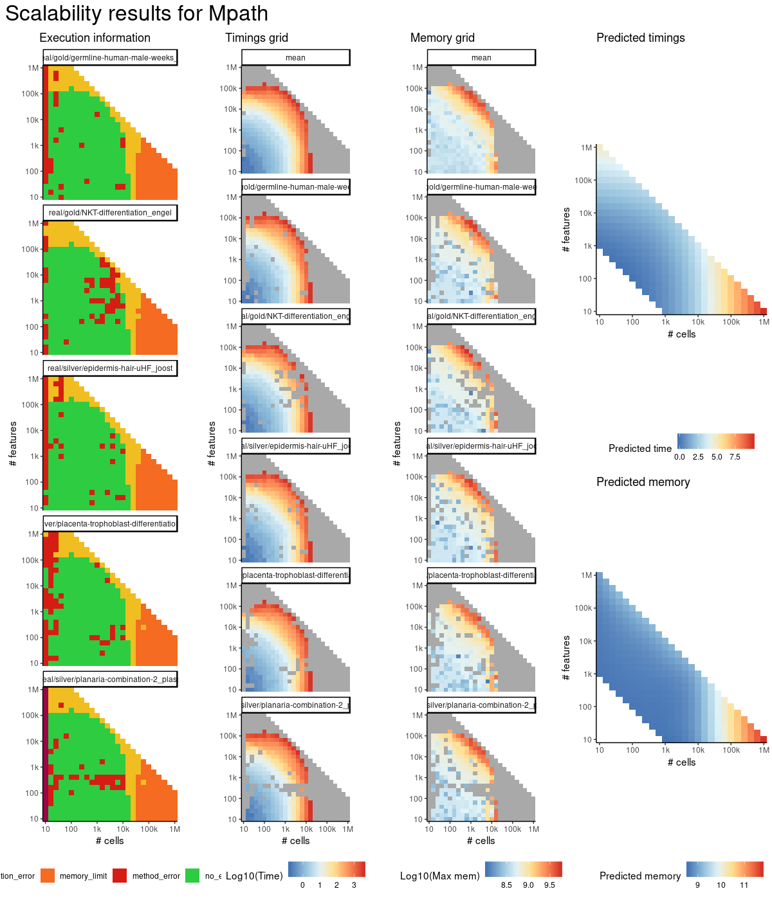
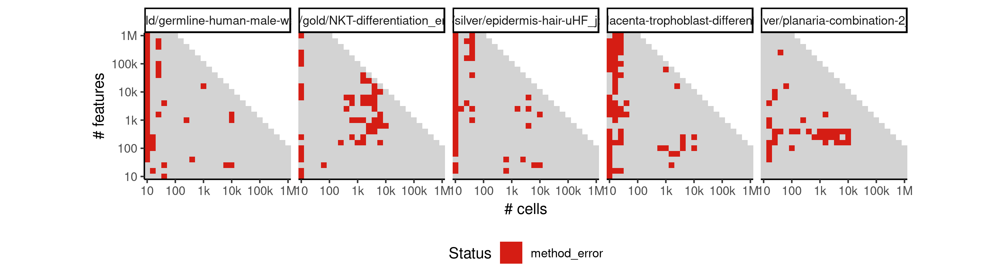
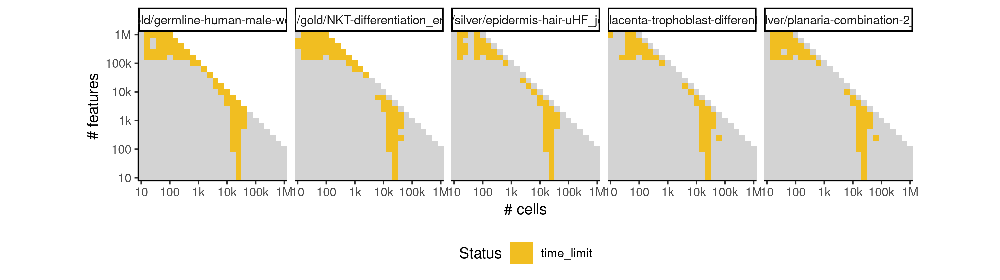
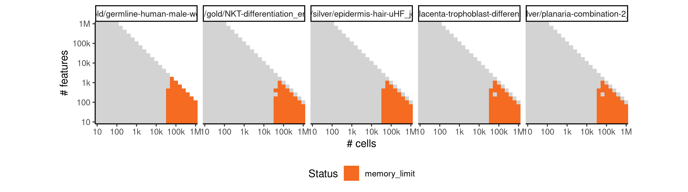

# mpath


## ERROR STATUS METHOD_ERROR

### ERROR CLUSTER METHOD_ERROR -- 1


 * Number of instances: 213
 * Dataset ids: scaling_0002, scaling_0004, scaling_0008, scaling_0010, scaling_0012, scaling_0017, scaling_0022, scaling_0025, scaling_0026, scaling_0038, scaling_0041, scaling_0042, scaling_0043, scaling_0047, scaling_0051, scaling_0056, scaling_0061, scaling_0066, scaling_0072, scaling_0076, scaling_0079, scaling_0082, scaling_0088, scaling_0094, scaling_0101, scaling_0106, scaling_0107, scaling_0117, scaling_0120, scaling_0127, scaling_0135, scaling_0151, scaling_0152, scaling_0157, scaling_0163, scaling_0169, scaling_0170, scaling_0176, scaling_0181, scaling_0195, scaling_0202, scaling_0203, scaling_0210, scaling_0216, scaling_0226, scaling_0238, scaling_0268, scaling_0272, scaling_0276, scaling_0298, scaling_0307, scaling_0311, scaling_0321, scaling_0322, scaling_0325, scaling_0341, scaling_0348, scaling_0361, scaling_0371, scaling_0372, scaling_0382, scaling_0383, scaling_0391, scaling_0417, scaling_0426, scaling_0430, scaling_0431, scaling_0456, scaling_0457, scaling_0476, scaling_0478, scaling_0486, scaling_0487, scaling_0494, scaling_0500, scaling_0512, scaling_0514, scaling_0518, scaling_0544, scaling_0547, scaling_0550, scaling_0556, scaling_0565, scaling_0574, scaling_0583, scaling_0584, scaling_0585, scaling_0595, scaling_0601, scaling_0617, scaling_0633, scaling_0635, scaling_0636, scaling_0645, scaling_0659, scaling_0660, scaling_0681, scaling_0684, scaling_0695, scaling_0698, scaling_0707, scaling_0708, scaling_0715, scaling_0729, scaling_0733, scaling_0735, scaling_0744, scaling_0751, scaling_0757, scaling_0758, scaling_0766, scaling_0773, scaling_0781, scaling_0795, scaling_0802, scaling_0817, scaling_0821, scaling_0840, scaling_0845, scaling_0848, scaling_0849, scaling_0856, scaling_0878, scaling_0896, scaling_0906, scaling_0923, scaling_0935, scaling_0947, scaling_0959, scaling_0969, scaling_0981, scaling_1009, scaling_1023, scaling_1032, scaling_1044, scaling_1045, scaling_1046, scaling_1051, scaling_1052, scaling_1070, scaling_1077, scaling_1079, scaling_1081, scaling_1083, scaling_1089, scaling_1108, scaling_1109, scaling_1120, scaling_1122, scaling_1130, scaling_1138, scaling_1139, scaling_1140, scaling_1152, scaling_1160, scaling_1166, scaling_1182, scaling_1190, scaling_1191, scaling_1192, scaling_1198, scaling_1214, scaling_1215, scaling_1240, scaling_1241, scaling_1246, scaling_1276, scaling_1278, scaling_1297, scaling_1304, scaling_1305, scaling_1309, scaling_1318, scaling_1330, scaling_1339, scaling_1340, scaling_1341, scaling_1353, scaling_1370, scaling_1373, scaling_1374, scaling_1397, scaling_1399, scaling_1400, scaling_1405, scaling_1437, scaling_1441, scaling_1465, scaling_1470, scaling_1477, scaling_1478, scaling_1510, scaling_1531, scaling_1558, scaling_1561, scaling_1569, scaling_1572, scaling_1588, scaling_1589, scaling_1590, scaling_1626, scaling_1627, scaling_1639, scaling_1648, scaling_1657, scaling_1658, scaling_1659, scaling_1660, scaling_1670, scaling_1672, scaling_1681, scaling_1693, scaling_1716

Last 10 lines of scaling_0002:
```
The following objects are masked from ‘package:base’:
    intersect, setdiff, setequal, union
Attaching package: ‘purrr’
The following object is masked from ‘package:jsonlite’:
    flatten
Warning message:
Mpath only detected one landmark 
output saved in /data/tmp//Rtmpn5Hgzs/file480e636df499/ti/output: 
	output.rds
all(progressions$from %in% milestone_ids) isn't true.
```

## ERROR STATUS TIME_LIMIT

### ERROR CLUSTER TIME_LIMIT -- 1


 * Number of instances: 109
 * Dataset ids: scaling_0783, scaling_0801, scaling_0819, scaling_0837, scaling_0855, scaling_0918, scaling_0926, scaling_0934, scaling_0942, scaling_0950, scaling_0993, scaling_1007, scaling_1021, scaling_1035, scaling_1049, scaling_1067, scaling_1086, scaling_1105, scaling_1124, scaling_1143, scaling_1178, scaling_1179, scaling_1194, scaling_1195, scaling_1210, scaling_1211, scaling_1226, scaling_1227, scaling_1242, scaling_1243, scaling_1277, scaling_1291, scaling_1292, scaling_1298, scaling_1312, scaling_1313, scaling_1319, scaling_1333, scaling_1334, scaling_1354, scaling_1355, scaling_1361, scaling_1375, scaling_1376, scaling_1381, scaling_1393, scaling_1417, scaling_1429, scaling_1442, scaling_1448, scaling_1449, scaling_1453, scaling_1454, scaling_1460, scaling_1461, scaling_1466, scaling_1472, scaling_1473, scaling_1484, scaling_1485, scaling_1490, scaling_1496, scaling_1497, scaling_1532, scaling_1533, scaling_1534, scaling_1543, scaling_1544, scaling_1550, scaling_1551, scaling_1552, scaling_1553, scaling_1562, scaling_1563, scaling_1570, scaling_1571, scaling_1581, scaling_1582, scaling_1591, scaling_1600, scaling_1601, scaling_1608, scaling_1609, scaling_1610, scaling_1619, scaling_1620, scaling_1628, scaling_1629, scaling_1640, scaling_1641, scaling_1649, scaling_1650, scaling_1651, scaling_1662, scaling_1663, scaling_1664, scaling_1671, scaling_1673, scaling_1684, scaling_1685, scaling_1692, scaling_1694, scaling_1695, scaling_1706, scaling_1707, scaling_1715, scaling_1717, scaling_1728, scaling_1729

Last 10 lines of scaling_0783:
```
File: /home/rcannood/Workspace/dynverse/dynbenchmark//derived/05-scaling/suite/mpath/Cat2/r2gridengine/20181008_214933_mpath_Cat2_BM4aydVq52/log/log.103.e.txt
```

## ERROR STATUS MEMORY_LIMIT

### ERROR CLUSTER MEMORY_LIMIT -- 1


 * Number of instances: 169
 * Dataset ids: scaling_0866, scaling_0877, scaling_0888, scaling_0899, scaling_0910, scaling_0956, scaling_0962, scaling_0968, scaling_0974, scaling_0980, scaling_0994, scaling_1008, scaling_1022, scaling_1036, scaling_1050, scaling_1068, scaling_1069, scaling_1087, scaling_1088, scaling_1106, scaling_1107, scaling_1125, scaling_1126, scaling_1144, scaling_1145, scaling_1147, scaling_1149, scaling_1151, scaling_1153, scaling_1155, scaling_1157, scaling_1159, scaling_1161, scaling_1163, scaling_1165, scaling_1180, scaling_1181, scaling_1196, scaling_1197, scaling_1212, scaling_1213, scaling_1228, scaling_1229, scaling_1244, scaling_1245, scaling_1249, scaling_1253, scaling_1257, scaling_1261, scaling_1265, scaling_1267, scaling_1269, scaling_1271, scaling_1273, scaling_1275, scaling_1293, scaling_1294, scaling_1295, scaling_1296, scaling_1314, scaling_1315, scaling_1316, scaling_1317, scaling_1335, scaling_1336, scaling_1337, scaling_1338, scaling_1356, scaling_1357, scaling_1358, scaling_1359, scaling_1377, scaling_1378, scaling_1379, scaling_1380, scaling_1390, scaling_1391, scaling_1392, scaling_1402, scaling_1403, scaling_1404, scaling_1414, scaling_1415, scaling_1416, scaling_1426, scaling_1427, scaling_1428, scaling_1438, scaling_1439, scaling_1440, scaling_1450, scaling_1451, scaling_1452, scaling_1462, scaling_1463, scaling_1464, scaling_1474, scaling_1475, scaling_1476, scaling_1486, scaling_1487, scaling_1488, scaling_1498, scaling_1499, scaling_1500, scaling_1505, scaling_1506, scaling_1511, scaling_1512, scaling_1517, scaling_1518, scaling_1523, scaling_1524, scaling_1529, scaling_1530, scaling_1545, scaling_1546, scaling_1547, scaling_1548, scaling_1549, scaling_1564, scaling_1565, scaling_1566, scaling_1567, scaling_1568, scaling_1583, scaling_1584, scaling_1585, scaling_1586, scaling_1587, scaling_1602, scaling_1603, scaling_1604, scaling_1605, scaling_1606, scaling_1621, scaling_1622, scaling_1623, scaling_1624, scaling_1625, scaling_1642, scaling_1643, scaling_1644, scaling_1645, scaling_1646, scaling_1647, scaling_1665, scaling_1666, scaling_1667, scaling_1668, scaling_1669, scaling_1686, scaling_1687, scaling_1688, scaling_1689, scaling_1690, scaling_1691, scaling_1708, scaling_1709, scaling_1710, scaling_1711, scaling_1712, scaling_1713, scaling_1730, scaling_1731, scaling_1732, scaling_1733, scaling_1734, scaling_1735

Last 10 lines of scaling_0866:
```
Attaching package: ‘dplyr’
The following objects are masked from ‘package:stats’:
    filter, lag
The following objects are masked from ‘package:base’:
    intersect, setdiff, setequal, union
Attaching package: ‘purrr’
The following object is masked from ‘package:jsonlite’:
    flatten
Error: cannot allocate vector of size 5.9 Gb
Execution halted
```


