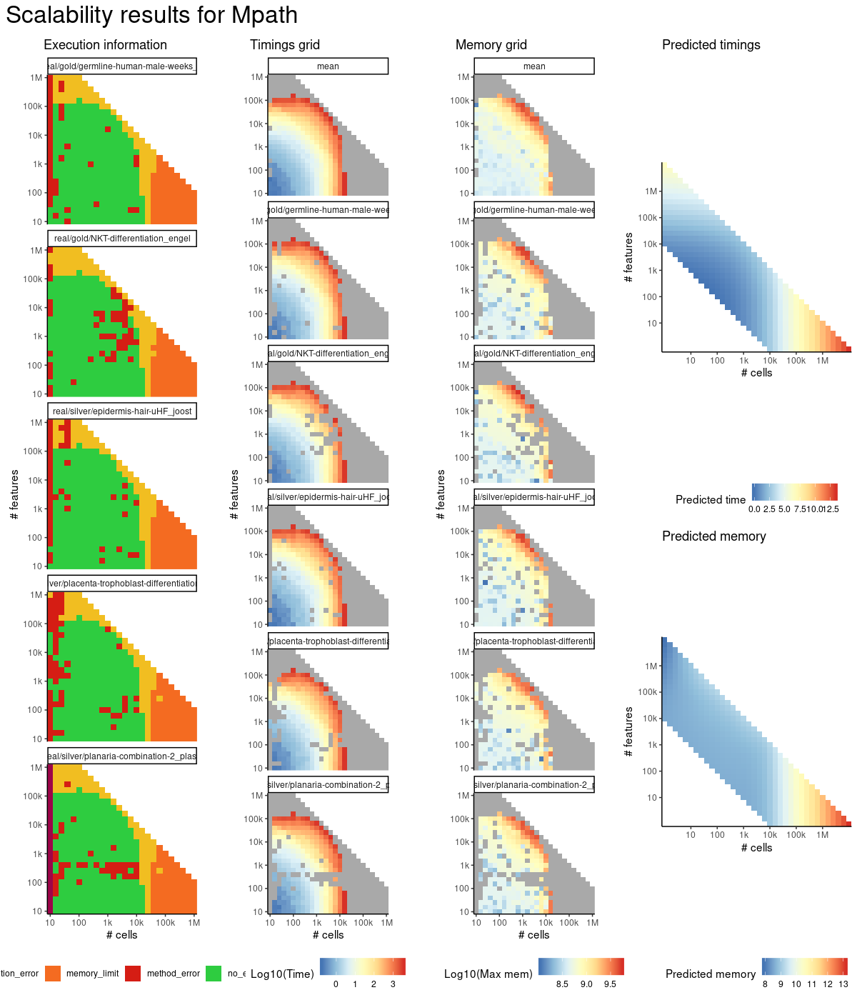

# mpath


## ERROR STATUS MEMORY_LIMIT

### ERROR CLUSTER MEMORY_LIMIT -- 1


 * Number of instances: 25
 * Dataset ids: scaling_0866, scaling_0877, scaling_0888, scaling_0899, scaling_0910, scaling_0956, scaling_0962, scaling_0968, scaling_0974, scaling_0980, scaling_0994, scaling_1008, scaling_1022, scaling_1036, scaling_1050, scaling_1068, scaling_1069, scaling_1087, scaling_1088, scaling_1106, scaling_1107, scaling_1125, scaling_1126, scaling_1144, scaling_1145

Last 10 lines of scaling_0866:
```
Attaching package: ‘dplyr’
The following objects are masked from ‘package:stats’:
    filter, lag
The following objects are masked from ‘package:base’:
    intersect, setdiff, setequal, union
Attaching package: ‘purrr’
The following object is masked from ‘package:jsonlite’:
    flatten
Error: cannot allocate vector of size 5.9 Gb
Execution halted
```

## ERROR STATUS METHOD_ERROR

### ERROR CLUSTER METHOD_ERROR -- 1


 * Number of instances: 153
 * Dataset ids: scaling_0002, scaling_0004, scaling_0008, scaling_0010, scaling_0012, scaling_0017, scaling_0022, scaling_0025, scaling_0026, scaling_0038, scaling_0041, scaling_0042, scaling_0043, scaling_0047, scaling_0051, scaling_0056, scaling_0061, scaling_0066, scaling_0072, scaling_0076, scaling_0079, scaling_0082, scaling_0088, scaling_0094, scaling_0101, scaling_0106, scaling_0107, scaling_0117, scaling_0120, scaling_0127, scaling_0135, scaling_0151, scaling_0152, scaling_0157, scaling_0163, scaling_0169, scaling_0170, scaling_0176, scaling_0181, scaling_0195, scaling_0202, scaling_0203, scaling_0210, scaling_0216, scaling_0226, scaling_0238, scaling_0268, scaling_0272, scaling_0276, scaling_0298, scaling_0307, scaling_0311, scaling_0321, scaling_0322, scaling_0325, scaling_0341, scaling_0348, scaling_0361, scaling_0371, scaling_0372, scaling_0382, scaling_0383, scaling_0391, scaling_0417, scaling_0426, scaling_0430, scaling_0431, scaling_0456, scaling_0457, scaling_0476, scaling_0478, scaling_0486, scaling_0487, scaling_0494, scaling_0500, scaling_0512, scaling_0514, scaling_0518, scaling_0544, scaling_0547, scaling_0550, scaling_0556, scaling_0565, scaling_0574, scaling_0583, scaling_0584, scaling_0585, scaling_0595, scaling_0601, scaling_0617, scaling_0633, scaling_0635, scaling_0636, scaling_0645, scaling_0659, scaling_0660, scaling_0681, scaling_0684, scaling_0695, scaling_0698, scaling_0707, scaling_0708, scaling_0715, scaling_0729, scaling_0733, scaling_0735, scaling_0744, scaling_0751, scaling_0757, scaling_0758, scaling_0766, scaling_0773, scaling_0781, scaling_0795, scaling_0802, scaling_0817, scaling_0821, scaling_0840, scaling_0845, scaling_0848, scaling_0849, scaling_0856, scaling_0878, scaling_0896, scaling_0906, scaling_0923, scaling_0935, scaling_0947, scaling_0959, scaling_0969, scaling_0981, scaling_1009, scaling_1023, scaling_1032, scaling_1044, scaling_1045, scaling_1046, scaling_1051, scaling_1052, scaling_1070, scaling_1077, scaling_1079, scaling_1081, scaling_1083, scaling_1089, scaling_1108, scaling_1109, scaling_1120, scaling_1122, scaling_1130, scaling_1138, scaling_1139, scaling_1140

Last 10 lines of scaling_0002:
```
The following objects are masked from ‘package:base’:
    intersect, setdiff, setequal, union
Attaching package: ‘purrr’
The following object is masked from ‘package:jsonlite’:
    flatten
Warning message:
Mpath only detected one landmark 
output saved in /data/tmp//Rtmpn5Hgzs/file480e636df499/ti/output: 
	output.rds
all(progressions$from %in% milestone_ids) isn't true.
```

## ERROR STATUS TIME_LIMIT

### ERROR CLUSTER TIME_LIMIT -- 1


 * Number of instances: 20
 * Dataset ids: scaling_0783, scaling_0801, scaling_0819, scaling_0837, scaling_0855, scaling_0918, scaling_0926, scaling_0934, scaling_0942, scaling_0950, scaling_0993, scaling_1007, scaling_1021, scaling_1035, scaling_1049, scaling_1067, scaling_1086, scaling_1105, scaling_1124, scaling_1143

Last 10 lines of scaling_0783:
```
File: /home/rcannood/Workspace/dynverse/dynbenchmark//derived/05-scaling/suite/mpath/Cat2/r2gridengine/20181008_214933_mpath_Cat2_BM4aydVq52/log/log.103.e.txt
```


