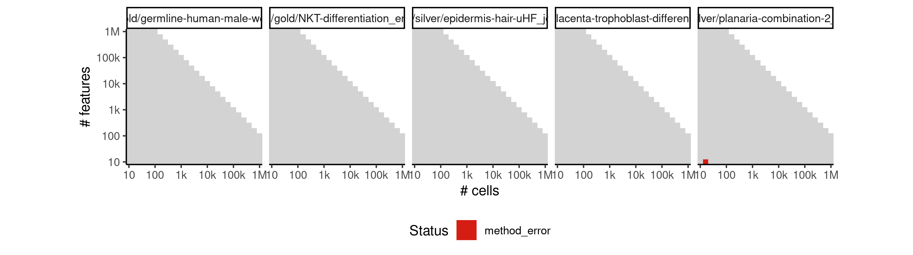

# mst


## ERROR STATUS METHOD_ERROR

### ERROR CLUSTER METHOD_ERROR -- 1


 * Number of instances: 1
 * Dataset ids: scaling_0015

Last 10 lines of scaling_0015:
```
Attaching package: ‘mclust’
The following object is masked from ‘package:purrr’:
    map
Loading required namespace: igraph
Warning message:
In pickBIC(object[as.character(G), modelNames, drop = FALSE], k = 3) :
  none of the selected models could be fitted
Error in t.default(clust$parameters$mean) : argument is not a matrix
Calls: t -> t.default
Execution halted
```

## ERROR STATUS TIME_LIMIT

### ERROR CLUSTER TIME_LIMIT -- 1


 * Number of instances: 29
 * Dataset ids: scaling_1549, scaling_1587, scaling_1605, scaling_1647, scaling_1669, scaling_1691, scaling_1713, scaling_1735, scaling_1739, scaling_1747, scaling_1751, scaling_1780, scaling_1810, scaling_1825, scaling_1912, scaling_1934, scaling_1978, scaling_2008, scaling_2024, scaling_2032, scaling_2040, scaling_2121, scaling_2127, scaling_2133, scaling_2139, scaling_2145, scaling_2209, scaling_2225, scaling_2246

Last 10 lines of scaling_1549:
```
File: /home/rcannood/Workspace/dynverse/dynbenchmark//derived/05-scaling/suite/mst/Cat3/r2gridengine/20181010_160922_mst_Cat3_NQArdj1zPw/log/log.404.e.txt
```


