# ouija
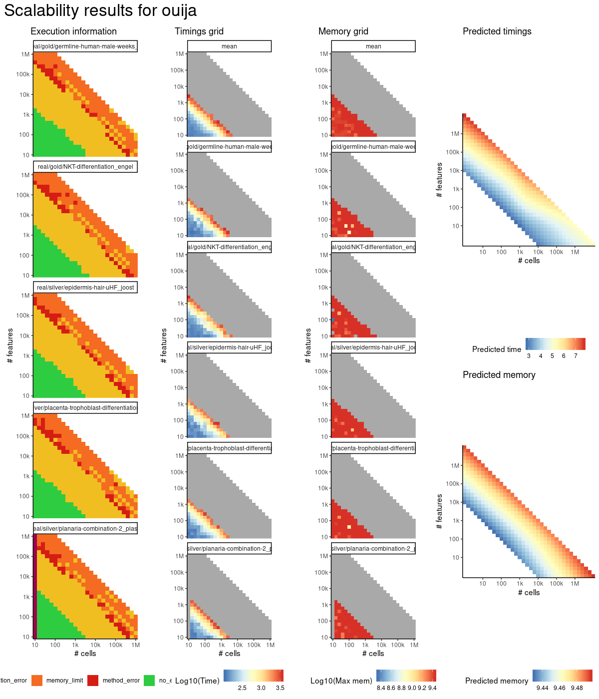

## ERROR STATUS METHOD_ERROR

### ERROR CLUSTER METHOD_ERROR -- 1
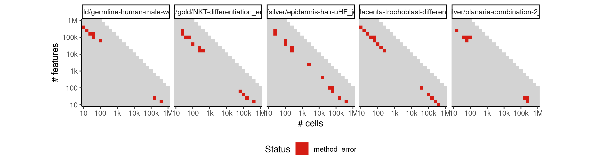

 * Number of instances: 55
 * Dataset ids: scaling_1381, scaling_1382, scaling_1392, scaling_1393, scaling_1394, scaling_1395, scaling_1403, scaling_1404, scaling_1405, scaling_1407, scaling_1414, scaling_1416, scaling_1417, scaling_1418, scaling_1419, scaling_1426, scaling_1427, scaling_1428, scaling_1430, scaling_1440, scaling_1441, scaling_1442, scaling_1457, scaling_1462, scaling_1469, scaling_1474, scaling_1477, scaling_1478, scaling_1479, scaling_1480, scaling_1481, scaling_1487, scaling_1488, scaling_1490, scaling_1491, scaling_1499, scaling_1507, scaling_1519, scaling_1525, scaling_1534, scaling_1535, scaling_1548, scaling_1552, scaling_1555, scaling_1556, scaling_1567, scaling_1571, scaling_1573, scaling_1574, scaling_1578, scaling_1581, scaling_1583, scaling_1586, scaling_1623, scaling_1718

Last 10 lines of scaling_1381:
```
/usr/local/lib/R/site-library/RcppEigen/include/Eigen/src/Core/MapBase.h:37:34:   required from ‘class Eigen::MapBase<Eigen::Block<Eigen::Transpose<Eigen::Matrix<double, 1, -1> >, -1, 1, true>, 0>’
/usr/local/lib/R/site-library/RcppEigen/include/Eigen/src/Core/MapBase.h:215:34:   [ skipping 20 instantiation contexts, use -ftemplate-backtrace-limit=0 to disable ]
/usr/local/lib/R/site-library/RcppEigen/include/Eigen/src/Core/ProductEvaluators.h:251:23:   required from ‘static void Eigen::internal::generic_product_impl<Lhs, Rhs, Eigen::DenseShape, Eigen::DenseShape, 6>::evalTo(Dst&, const Lhs&, const Rhs&) [with Dst = Eigen::Matrix<double, 1, 1, 0, 1, 1>; Lhs = Eigen::Product<Eigen::CwiseBinaryOp<Eigen::internal::scalar_product_op<double, double>, const Eigen::CwiseNullaryOp<Eigen::internal::scalar_constant_op<double>, const Eigen::Matrix<double, 1, -1> >, const Eigen::Transpose<Eigen::Matrix<double, -1, 1> > >, Eigen::Matrix<double, -1, -1>, 0>; Rhs = Eigen::Matrix<double, -1, 1>]’
/usr/local/lib/R/site-library/RcppEigen/include/Eigen/src/Core/ProductEvaluators.h:124:75:   required from ‘Eigen::internal::product_evaluator<Eigen::Product<Lhs, Rhs, Option>, ProductTag, LhsShape, RhsShape>::product_evaluator(const XprType&) [with Lhs = Eigen::Product<Eigen::CwiseBinaryOp<Eigen::internal::scalar_product_op<double, double>, const Eigen::CwiseNullaryOp<Eigen::internal::scalar_constant_op<double>, const Eigen::Matrix<double, 1, -1> >, const Eigen::Transpose<Eigen::Matrix<double, -1, 1> > >, Eigen::Matrix<double, -1, -1>, 0>; Rhs = Eigen::Matrix<double, -1, 1>; int Options = 0; int ProductTag = 6; LhsShape = Eigen::DenseShape; RhsShape = Eigen::DenseShape; typename Eigen::internal::traits<typename Eigen::Product<Lhs, Rhs, Option>::Rhs>::Scalar = double; typename Eigen::internal::traits<typename Eigen::Product<Lhs, Rhs, Option>::Lhs>::Scalar = double; Eigen::internal::product_evaluator<Eigen::Product<Lhs, Rhs, Option>, ProductTag, LhsShape, RhsShape>::XprType = Eigen::Product<Eigen::Product<Eigen::CwiseBinaryOp<Eigen::internal::scalar_product_op<double, double>, const Eigen::CwiseNullaryOp<Eigen::internal::scalar_constant_op<double>, const Eigen::Matrix<double, 1, -1> >, const Eigen::Transpose<Eigen::Matrix<double, -1, 1> > >, Eigen::Matrix<double, -1, -1>, 0>, Eigen::Matrix<double, -1, 1>, 0>]’
/usr/local/lib/R/site-library/RcppEigen/include/Eigen/src/Core/ProductEvaluators.h:35:70:   required from ‘Eigen::internal::evaluator<Eigen::Product<Lhs, Rhs, Option> >::evaluator(const XprType&) [with Lhs = Eigen::Product<Eigen::CwiseBinaryOp<Eigen::internal::scalar_product_op<double, double>, const Eigen::CwiseNullaryOp<Eigen::internal::scalar_constant_op<double>, const Eigen::Matrix<double, 1, -1> >, const Eigen::Transpose<Eigen::Matrix<double, -1, 1> > >, Eigen::Matrix<double, -1, -1>, 0>; Rhs = Eigen::Matrix<double, -1, 1>; int Options = 0; Eigen::internal::evaluator<Eigen::Product<Lhs, Rhs, Option> >::XprType = Eigen::Product<Eigen::Product<Eigen::CwiseBinaryOp<Eigen::internal::scalar_product_op<double, double>, const Eigen::CwiseNullaryOp<Eigen::internal::scalar_constant_op<double>, const Eigen::Matrix<double, 1, -1> >, const Eigen::Transpose<Eigen::Matrix<double, -1, 1> > >, Eigen::Matrix<double, -1, -1>, 0>, Eigen::Matrix<double, -1, 1>, 0>]’
/usr/local/lib/R/site-library/RcppEigen/include/Eigen/src/Core/Product.h:132:22:   required from ‘Eigen::internal::dense_product_base<Lhs, Rhs, Option, 6>::operator const Scalar() const [with Lhs = Eigen::Product<Eigen::CwiseBinaryOp<Eigen::internal::scalar_product_op<double, double>, const Eigen::CwiseNullaryOp<Eigen::internal::scalar_constant_op<double>, const Eigen::Matrix<double, 1, -1> >, const Eigen::Transpose<Eigen::Matrix<double, -1, 1> > >, Eigen::Matrix<double, -1, -1>, 0>; Rhs = Eigen::Matrix<double, -1, 1>; int Option = 0; Eigen::internal::dense_product_base<Lhs, Rhs, Option, 6>::Scalar = double]’
/usr/local/lib/R/site-library/StanHeaders/include/src/stan/mcmc/hmc/hamiltonians/dense_e_metric.hpp:24:60:   required from ‘double stan::mcmc::dense_e_metric<Model, BaseRNG>::T(stan::mcmc::dense_e_point&) [with Model = model7909342e6322_ouija_namespace::model7909342e6322_ouija; BaseRNG = boost::random::additive_combine_engine<boost::random::linear_congruential_engine<unsigned int, 40014u, 0u, 2147483563u>, boost::random::linear_congruential_engine<unsigned int, 40692u, 0u, 2147483399u> >]’
file79094d4b2822.cpp:1303:1:   required from here
/usr/local/lib/R/site-library/RcppEigen/include/Eigen/src/Core/DenseCoeffsBase.h:55:30: warning: ignoring attributes on template argument ‘Eigen::internal::packet_traits<double>::type {aka __vector(2) double}’ [-Wignored-attributes]
SAMPLING FOR MODEL 'ouija' NOW (CHAIN 1).
```

### ERROR CLUSTER METHOD_ERROR -- 2
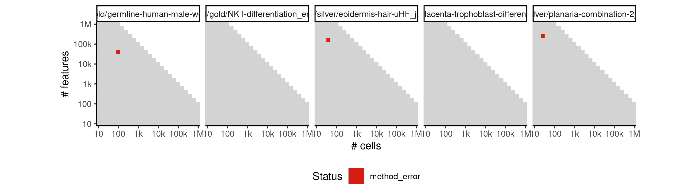

 * Number of instances: 3
 * Dataset ids: scaling_1383, scaling_1572, scaling_1609

Last 10 lines of scaling_1383:
```
/usr/local/lib/R/site-library/RcppEigen/include/Eigen/src/Core/MapBase.h:37:34:   required from ‘class Eigen::MapBase<Eigen::Block<Eigen::Transpose<Eigen::Matrix<double, 1, -1> >, -1, 1, true>, 0>’
/usr/local/lib/R/site-library/RcppEigen/include/Eigen/src/Core/MapBase.h:215:34:   [ skipping 20 instantiation contexts, use -ftemplate-backtrace-limit=0 to disable ]
/usr/local/lib/R/site-library/RcppEigen/include/Eigen/src/Core/ProductEvaluators.h:251:23:   required from ‘static void Eigen::internal::generic_product_impl<Lhs, Rhs, Eigen::DenseShape, Eigen::DenseShape, 6>::evalTo(Dst&, const Lhs&, const Rhs&) [with Dst = Eigen::Matrix<double, 1, 1, 0, 1, 1>; Lhs = Eigen::Product<Eigen::CwiseBinaryOp<Eigen::internal::scalar_product_op<double, double>, const Eigen::CwiseNullaryOp<Eigen::internal::scalar_constant_op<double>, const Eigen::Matrix<double, 1, -1> >, const Eigen::Transpose<Eigen::Matrix<double, -1, 1> > >, Eigen::Matrix<double, -1, -1>, 0>; Rhs = Eigen::Matrix<double, -1, 1>]’
/usr/local/lib/R/site-library/RcppEigen/include/Eigen/src/Core/ProductEvaluators.h:124:75:   required from ‘Eigen::internal::product_evaluator<Eigen::Product<Lhs, Rhs, Option>, ProductTag, LhsShape, RhsShape>::product_evaluator(const XprType&) [with Lhs = Eigen::Product<Eigen::CwiseBinaryOp<Eigen::internal::scalar_product_op<double, double>, const Eigen::CwiseNullaryOp<Eigen::internal::scalar_constant_op<double>, const Eigen::Matrix<double, 1, -1> >, const Eigen::Transpose<Eigen::Matrix<double, -1, 1> > >, Eigen::Matrix<double, -1, -1>, 0>; Rhs = Eigen::Matrix<double, -1, 1>; int Options = 0; int ProductTag = 6; LhsShape = Eigen::DenseShape; RhsShape = Eigen::DenseShape; typename Eigen::internal::traits<typename Eigen::Product<Lhs, Rhs, Option>::Rhs>::Scalar = double; typename Eigen::internal::traits<typename Eigen::Product<Lhs, Rhs, Option>::Lhs>::Scalar = double; Eigen::internal::product_evaluator<Eigen::Product<Lhs, Rhs, Option>, ProductTag, LhsShape, RhsShape>::XprType = Eigen::Product<Eigen::Product<Eigen::CwiseBinaryOp<Eigen::internal::scalar_product_op<double, double>, const Eigen::CwiseNullaryOp<Eigen::internal::scalar_constant_op<double>, const Eigen::Matrix<double, 1, -1> >, const Eigen::Transpose<Eigen::Matrix<double, -1, 1> > >, Eigen::Matrix<double, -1, -1>, 0>, Eigen::Matrix<double, -1, 1>, 0>]’
/usr/local/lib/R/site-library/RcppEigen/include/Eigen/src/Core/ProductEvaluators.h:35:70:   required from ‘Eigen::internal::evaluator<Eigen::Product<Lhs, Rhs, Option> >::evaluator(const XprType&) [with Lhs = Eigen::Product<Eigen::CwiseBinaryOp<Eigen::internal::scalar_product_op<double, double>, const Eigen::CwiseNullaryOp<Eigen::internal::scalar_constant_op<double>, const Eigen::Matrix<double, 1, -1> >, const Eigen::Transpose<Eigen::Matrix<double, -1, 1> > >, Eigen::Matrix<double, -1, -1>, 0>; Rhs = Eigen::Matrix<double, -1, 1>; int Options = 0; Eigen::internal::evaluator<Eigen::Product<Lhs, Rhs, Option> >::XprType = Eigen::Product<Eigen::Product<Eigen::CwiseBinaryOp<Eigen::internal::scalar_product_op<double, double>, const Eigen::CwiseNullaryOp<Eigen::internal::scalar_constant_op<double>, const Eigen::Matrix<double, 1, -1> >, const Eigen::Transpose<Eigen::Matrix<double, -1, 1> > >, Eigen::Matrix<double, -1, -1>, 0>, Eigen::Matrix<double, -1, 1>, 0>]’
/usr/local/lib/R/site-library/RcppEigen/include/Eigen/src/Core/Product.h:132:22:   required from ‘Eigen::internal::dense_product_base<Lhs, Rhs, Option, 6>::operator const Scalar() const [with Lhs = Eigen::Product<Eigen::CwiseBinaryOp<Eigen::internal::scalar_product_op<double, double>, const Eigen::CwiseNullaryOp<Eigen::internal::scalar_constant_op<double>, const Eigen::Matrix<double, 1, -1> >, const Eigen::Transpose<Eigen::Matrix<double, -1, 1> > >, Eigen::Matrix<double, -1, -1>, 0>; Rhs = Eigen::Matrix<double, -1, 1>; int Option = 0; Eigen::internal::dense_product_base<Lhs, Rhs, Option, 6>::Scalar = double]’
/usr/local/lib/R/site-library/StanHeaders/include/src/stan/mcmc/hmc/hamiltonians/dense_e_metric.hpp:24:60:   required from ‘double stan::mcmc::dense_e_metric<Model, BaseRNG>::T(stan::mcmc::dense_e_point&) [with Model = model1dad62b2b6e7d_ouija_namespace::model1dad62b2b6e7d_ouija; BaseRNG = boost::random::additive_combine_engine<boost::random::linear_congruential_engine<unsigned int, 40014u, 0u, 2147483563u>, boost::random::linear_congruential_engine<unsigned int, 40692u, 0u, 2147483399u> >]’
file1dad64166a209.cpp:1303:1:   required from here
/usr/local/lib/R/site-library/RcppEigen/include/Eigen/src/Core/DenseCoeffsBase.h:55:30: warning: ignoring attributes on template argument ‘Eigen::internal::packet_traits<double>::type {aka __vector(2) double}’ [-Wignored-attributes]
SAMPLING FOR MODEL 'ouija' NOW (CHAIN 1).
```

### ERROR CLUSTER METHOD_ERROR -- 3
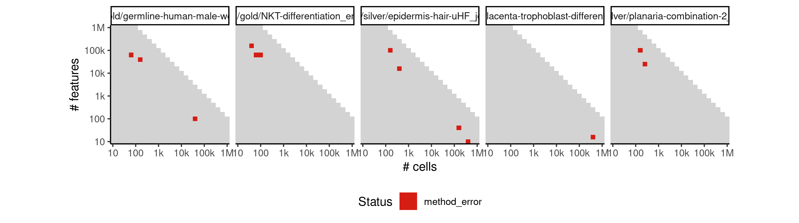

 * Number of instances: 13
 * Dataset ids: scaling_1390, scaling_1443, scaling_1455, scaling_1476, scaling_1502, scaling_1553, scaling_1554, scaling_1575, scaling_1584, scaling_1605, scaling_1612, scaling_1799, scaling_1829

Last 10 lines of scaling_1390:
```
/usr/local/lib/R/site-library/RcppEigen/include/Eigen/src/Core/MapBase.h:37:34:   required from ‘class Eigen::MapBase<Eigen::Block<Eigen::Transpose<Eigen::Matrix<double, 1, -1> >, -1, 1, true>, 0>’
/usr/local/lib/R/site-library/RcppEigen/include/Eigen/src/Core/MapBase.h:215:34:   [ skipping 20 instantiation contexts, use -ftemplate-backtrace-limit=0 to disable ]
/usr/local/lib/R/site-library/RcppEigen/include/Eigen/src/Core/ProductEvaluators.h:251:23:   required from ‘static void Eigen::internal::generic_product_impl<Lhs, Rhs, Eigen::DenseShape, Eigen::DenseShape, 6>::evalTo(Dst&, const Lhs&, const Rhs&) [with Dst = Eigen::Matrix<double, 1, 1, 0, 1, 1>; Lhs = Eigen::Product<Eigen::CwiseBinaryOp<Eigen::internal::scalar_product_op<double, double>, const Eigen::CwiseNullaryOp<Eigen::internal::scalar_constant_op<double>, const Eigen::Matrix<double, 1, -1> >, const Eigen::Transpose<Eigen::Matrix<double, -1, 1> > >, Eigen::Matrix<double, -1, -1>, 0>; Rhs = Eigen::Matrix<double, -1, 1>]’
/usr/local/lib/R/site-library/RcppEigen/include/Eigen/src/Core/ProductEvaluators.h:124:75:   required from ‘Eigen::internal::product_evaluator<Eigen::Product<Lhs, Rhs, Option>, ProductTag, LhsShape, RhsShape>::product_evaluator(const XprType&) [with Lhs = Eigen::Product<Eigen::CwiseBinaryOp<Eigen::internal::scalar_product_op<double, double>, const Eigen::CwiseNullaryOp<Eigen::internal::scalar_constant_op<double>, const Eigen::Matrix<double, 1, -1> >, const Eigen::Transpose<Eigen::Matrix<double, -1, 1> > >, Eigen::Matrix<double, -1, -1>, 0>; Rhs = Eigen::Matrix<double, -1, 1>; int Options = 0; int ProductTag = 6; LhsShape = Eigen::DenseShape; RhsShape = Eigen::DenseShape; typename Eigen::internal::traits<typename Eigen::Product<Lhs, Rhs, Option>::Rhs>::Scalar = double; typename Eigen::internal::traits<typename Eigen::Product<Lhs, Rhs, Option>::Lhs>::Scalar = double; Eigen::internal::product_evaluator<Eigen::Product<Lhs, Rhs, Option>, ProductTag, LhsShape, RhsShape>::XprType = Eigen::Product<Eigen::Product<Eigen::CwiseBinaryOp<Eigen::internal::scalar_product_op<double, double>, const Eigen::CwiseNullaryOp<Eigen::internal::scalar_constant_op<double>, const Eigen::Matrix<double, 1, -1> >, const Eigen::Transpose<Eigen::Matrix<double, -1, 1> > >, Eigen::Matrix<double, -1, -1>, 0>, Eigen::Matrix<double, -1, 1>, 0>]’
/usr/local/lib/R/site-library/RcppEigen/include/Eigen/src/Core/ProductEvaluators.h:35:70:   required from ‘Eigen::internal::evaluator<Eigen::Product<Lhs, Rhs, Option> >::evaluator(const XprType&) [with Lhs = Eigen::Product<Eigen::CwiseBinaryOp<Eigen::internal::scalar_product_op<double, double>, const Eigen::CwiseNullaryOp<Eigen::internal::scalar_constant_op<double>, const Eigen::Matrix<double, 1, -1> >, const Eigen::Transpose<Eigen::Matrix<double, -1, 1> > >, Eigen::Matrix<double, -1, -1>, 0>; Rhs = Eigen::Matrix<double, -1, 1>; int Options = 0; Eigen::internal::evaluator<Eigen::Product<Lhs, Rhs, Option> >::XprType = Eigen::Product<Eigen::Product<Eigen::CwiseBinaryOp<Eigen::internal::scalar_product_op<double, double>, const Eigen::CwiseNullaryOp<Eigen::internal::scalar_constant_op<double>, const Eigen::Matrix<double, 1, -1> >, const Eigen::Transpose<Eigen::Matrix<double, -1, 1> > >, Eigen::Matrix<double, -1, -1>, 0>, Eigen::Matrix<double, -1, 1>, 0>]’
/usr/local/lib/R/site-library/RcppEigen/include/Eigen/src/Core/Product.h:132:22:   required from ‘Eigen::internal::dense_product_base<Lhs, Rhs, Option, 6>::operator const Scalar() const [with Lhs = Eigen::Product<Eigen::CwiseBinaryOp<Eigen::internal::scalar_product_op<double, double>, const Eigen::CwiseNullaryOp<Eigen::internal::scalar_constant_op<double>, const Eigen::Matrix<double, 1, -1> >, const Eigen::Transpose<Eigen::Matrix<double, -1, 1> > >, Eigen::Matrix<double, -1, -1>, 0>; Rhs = Eigen::Matrix<double, -1, 1>; int Option = 0; Eigen::internal::dense_product_base<Lhs, Rhs, Option, 6>::Scalar = double]’
/usr/local/lib/R/site-library/StanHeaders/include/src/stan/mcmc/hmc/hamiltonians/dense_e_metric.hpp:24:60:   required from ‘double stan::mcmc::dense_e_metric<Model, BaseRNG>::T(stan::mcmc::dense_e_point&) [with Model = model1cca21b219523_ouija_namespace::model1cca21b219523_ouija; BaseRNG = boost::random::additive_combine_engine<boost::random::linear_congruential_engine<unsigned int, 40014u, 0u, 2147483563u>, boost::random::linear_congruential_engine<unsigned int, 40692u, 0u, 2147483399u> >]’
file1cca2606f5fa1.cpp:1303:1:   required from here
/usr/local/lib/R/site-library/RcppEigen/include/Eigen/src/Core/DenseCoeffsBase.h:55:30: warning: ignoring attributes on template argument ‘Eigen::internal::packet_traits<double>::type {aka __vector(2) double}’ [-Wignored-attributes]
SAMPLING FOR MODEL 'ouija' NOW (CHAIN 1).
```

### ERROR CLUSTER METHOD_ERROR -- 4
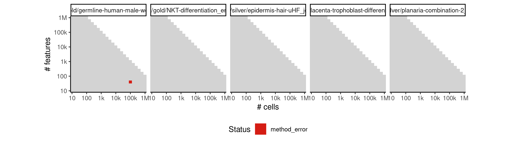

 * Number of instances: 1
 * Dataset ids: scaling_1391

Last 10 lines of scaling_1391:
```
/usr/local/lib/R/site-library/RcppEigen/include/Eigen/src/Core/MapBase.h:37:34:   required from ‘class Eigen::MapBase<Eigen::Block<Eigen::Transpose<Eigen::Matrix<double, 1, -1> >, -1, 1, true>, 0>’
/usr/local/lib/R/site-library/RcppEigen/include/Eigen/src/Core/MapBase.h:215:34:   [ skipping 20 instantiation contexts, use -ftemplate-backtrace-limit=0 to disable ]
/usr/local/lib/R/site-library/RcppEigen/include/Eigen/src/Core/ProductEvaluators.h:251:23:   required from ‘static void Eigen::internal::generic_product_impl<Lhs, Rhs, Eigen::DenseShape, Eigen::DenseShape, 6>::evalTo(Dst&, const Lhs&, const Rhs&) [with Dst = Eigen::Matrix<double, 1, 1, 0, 1, 1>; Lhs = Eigen::Product<Eigen::CwiseBinaryOp<Eigen::internal::scalar_product_op<double, double>, const Eigen::CwiseNullaryOp<Eigen::internal::scalar_constant_op<double>, const Eigen::Matrix<double, 1, -1> >, const Eigen::Transpose<Eigen::Matrix<double, -1, 1> > >, Eigen::Matrix<double, -1, -1>, 0>; Rhs = Eigen::Matrix<double, -1, 1>]’
/usr/local/lib/R/site-library/RcppEigen/include/Eigen/src/Core/ProductEvaluators.h:124:75:   required from ‘Eigen::internal::product_evaluator<Eigen::Product<Lhs, Rhs, Option>, ProductTag, LhsShape, RhsShape>::product_evaluator(const XprType&) [with Lhs = Eigen::Product<Eigen::CwiseBinaryOp<Eigen::internal::scalar_product_op<double, double>, const Eigen::CwiseNullaryOp<Eigen::internal::scalar_constant_op<double>, const Eigen::Matrix<double, 1, -1> >, const Eigen::Transpose<Eigen::Matrix<double, -1, 1> > >, Eigen::Matrix<double, -1, -1>, 0>; Rhs = Eigen::Matrix<double, -1, 1>; int Options = 0; int ProductTag = 6; LhsShape = Eigen::DenseShape; RhsShape = Eigen::DenseShape; typename Eigen::internal::traits<typename Eigen::Product<Lhs, Rhs, Option>::Rhs>::Scalar = double; typename Eigen::internal::traits<typename Eigen::Product<Lhs, Rhs, Option>::Lhs>::Scalar = double; Eigen::internal::product_evaluator<Eigen::Product<Lhs, Rhs, Option>, ProductTag, LhsShape, RhsShape>::XprType = Eigen::Product<Eigen::Product<Eigen::CwiseBinaryOp<Eigen::internal::scalar_product_op<double, double>, const Eigen::CwiseNullaryOp<Eigen::internal::scalar_constant_op<double>, const Eigen::Matrix<double, 1, -1> >, const Eigen::Transpose<Eigen::Matrix<double, -1, 1> > >, Eigen::Matrix<double, -1, -1>, 0>, Eigen::Matrix<double, -1, 1>, 0>]’
/usr/local/lib/R/site-library/RcppEigen/include/Eigen/src/Core/ProductEvaluators.h:35:70:   required from ‘Eigen::internal::evaluator<Eigen::Product<Lhs, Rhs, Option> >::evaluator(const XprType&) [with Lhs = Eigen::Product<Eigen::CwiseBinaryOp<Eigen::internal::scalar_product_op<double, double>, const Eigen::CwiseNullaryOp<Eigen::internal::scalar_constant_op<double>, const Eigen::Matrix<double, 1, -1> >, const Eigen::Transpose<Eigen::Matrix<double, -1, 1> > >, Eigen::Matrix<double, -1, -1>, 0>; Rhs = Eigen::Matrix<double, -1, 1>; int Options = 0; Eigen::internal::evaluator<Eigen::Product<Lhs, Rhs, Option> >::XprType = Eigen::Product<Eigen::Product<Eigen::CwiseBinaryOp<Eigen::internal::scalar_product_op<double, double>, const Eigen::CwiseNullaryOp<Eigen::internal::scalar_constant_op<double>, const Eigen::Matrix<double, 1, -1> >, const Eigen::Transpose<Eigen::Matrix<double, -1, 1> > >, Eigen::Matrix<double, -1, -1>, 0>, Eigen::Matrix<double, -1, 1>, 0>]’
/usr/local/lib/R/site-library/RcppEigen/include/Eigen/src/Core/Product.h:132:22:   required from ‘Eigen::internal::dense_product_base<Lhs, Rhs, Option, 6>::operator const Scalar() const [with Lhs = Eigen::Product<Eigen::CwiseBinaryOp<Eigen::internal::scalar_product_op<double, double>, const Eigen::CwiseNullaryOp<Eigen::internal::scalar_constant_op<double>, const Eigen::Matrix<double, 1, -1> >, const Eigen::Transpose<Eigen::Matrix<double, -1, 1> > >, Eigen::Matrix<double, -1, -1>, 0>; Rhs = Eigen::Matrix<double, -1, 1>; int Option = 0; Eigen::internal::dense_product_base<Lhs, Rhs, Option, 6>::Scalar = double]’
/usr/local/lib/R/site-library/StanHeaders/include/src/stan/mcmc/hmc/hamiltonians/dense_e_metric.hpp:24:60:   required from ‘double stan::mcmc::dense_e_metric<Model, BaseRNG>::T(stan::mcmc::dense_e_point&) [with Model = model1ccfd5d2487a_ouija_namespace::model1ccfd5d2487a_ouija; BaseRNG = boost::random::additive_combine_engine<boost::random::linear_congruential_engine<unsigned int, 40014u, 0u, 2147483563u>, boost::random::linear_congruential_engine<unsigned int, 40692u, 0u, 2147483399u> >]’
file1ccfd7735f7da.cpp:1303:1:   required from here
/usr/local/lib/R/site-library/RcppEigen/include/Eigen/src/Core/DenseCoeffsBase.h:55:30: warning: ignoring attributes on template argument ‘Eigen::internal::packet_traits<double>::type {aka __vector(2) double}’ [-Wignored-attributes]
SAMPLING FOR MODEL 'ouija' NOW (CHAIN 1).
```

### ERROR CLUSTER METHOD_ERROR -- 5
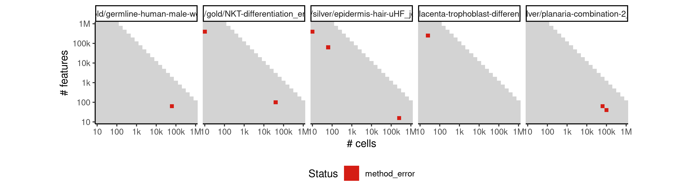

 * Number of instances: 9
 * Dataset ids: scaling_1402, scaling_1439, scaling_1450, scaling_1453, scaling_1465, scaling_1467, scaling_1475, scaling_1498, scaling_1590

Last 10 lines of scaling_1402:
```
/usr/local/lib/R/site-library/RcppEigen/include/Eigen/src/Core/MapBase.h:37:34:   required from ‘class Eigen::MapBase<Eigen::Block<Eigen::Transpose<Eigen::Matrix<double, 1, -1> >, -1, 1, true>, 0>’
/usr/local/lib/R/site-library/RcppEigen/include/Eigen/src/Core/MapBase.h:215:34:   [ skipping 20 instantiation contexts, use -ftemplate-backtrace-limit=0 to disable ]
/usr/local/lib/R/site-library/RcppEigen/include/Eigen/src/Core/ProductEvaluators.h:251:23:   required from ‘static void Eigen::internal::generic_product_impl<Lhs, Rhs, Eigen::DenseShape, Eigen::DenseShape, 6>::evalTo(Dst&, const Lhs&, const Rhs&) [with Dst = Eigen::Matrix<double, 1, 1, 0, 1, 1>; Lhs = Eigen::Product<Eigen::CwiseBinaryOp<Eigen::internal::scalar_product_op<double, double>, const Eigen::CwiseNullaryOp<Eigen::internal::scalar_constant_op<double>, const Eigen::Matrix<double, 1, -1> >, const Eigen::Transpose<Eigen::Matrix<double, -1, 1> > >, Eigen::Matrix<double, -1, -1>, 0>; Rhs = Eigen::Matrix<double, -1, 1>]’
/usr/local/lib/R/site-library/RcppEigen/include/Eigen/src/Core/ProductEvaluators.h:124:75:   required from ‘Eigen::internal::product_evaluator<Eigen::Product<Lhs, Rhs, Option>, ProductTag, LhsShape, RhsShape>::product_evaluator(const XprType&) [with Lhs = Eigen::Product<Eigen::CwiseBinaryOp<Eigen::internal::scalar_product_op<double, double>, const Eigen::CwiseNullaryOp<Eigen::internal::scalar_constant_op<double>, const Eigen::Matrix<double, 1, -1> >, const Eigen::Transpose<Eigen::Matrix<double, -1, 1> > >, Eigen::Matrix<double, -1, -1>, 0>; Rhs = Eigen::Matrix<double, -1, 1>; int Options = 0; int ProductTag = 6; LhsShape = Eigen::DenseShape; RhsShape = Eigen::DenseShape; typename Eigen::internal::traits<typename Eigen::Product<Lhs, Rhs, Option>::Rhs>::Scalar = double; typename Eigen::internal::traits<typename Eigen::Product<Lhs, Rhs, Option>::Lhs>::Scalar = double; Eigen::internal::product_evaluator<Eigen::Product<Lhs, Rhs, Option>, ProductTag, LhsShape, RhsShape>::XprType = Eigen::Product<Eigen::Product<Eigen::CwiseBinaryOp<Eigen::internal::scalar_product_op<double, double>, const Eigen::CwiseNullaryOp<Eigen::internal::scalar_constant_op<double>, const Eigen::Matrix<double, 1, -1> >, const Eigen::Transpose<Eigen::Matrix<double, -1, 1> > >, Eigen::Matrix<double, -1, -1>, 0>, Eigen::Matrix<double, -1, 1>, 0>]’
/usr/local/lib/R/site-library/RcppEigen/include/Eigen/src/Core/ProductEvaluators.h:35:70:   required from ‘Eigen::internal::evaluator<Eigen::Product<Lhs, Rhs, Option> >::evaluator(const XprType&) [with Lhs = Eigen::Product<Eigen::CwiseBinaryOp<Eigen::internal::scalar_product_op<double, double>, const Eigen::CwiseNullaryOp<Eigen::internal::scalar_constant_op<double>, const Eigen::Matrix<double, 1, -1> >, const Eigen::Transpose<Eigen::Matrix<double, -1, 1> > >, Eigen::Matrix<double, -1, -1>, 0>; Rhs = Eigen::Matrix<double, -1, 1>; int Options = 0; Eigen::internal::evaluator<Eigen::Product<Lhs, Rhs, Option> >::XprType = Eigen::Product<Eigen::Product<Eigen::CwiseBinaryOp<Eigen::internal::scalar_product_op<double, double>, const Eigen::CwiseNullaryOp<Eigen::internal::scalar_constant_op<double>, const Eigen::Matrix<double, 1, -1> >, const Eigen::Transpose<Eigen::Matrix<double, -1, 1> > >, Eigen::Matrix<double, -1, -1>, 0>, Eigen::Matrix<double, -1, 1>, 0>]’
/usr/local/lib/R/site-library/RcppEigen/include/Eigen/src/Core/Product.h:132:22:   required from ‘Eigen::internal::dense_product_base<Lhs, Rhs, Option, 6>::operator const Scalar() const [with Lhs = Eigen::Product<Eigen::CwiseBinaryOp<Eigen::internal::scalar_product_op<double, double>, const Eigen::CwiseNullaryOp<Eigen::internal::scalar_constant_op<double>, const Eigen::Matrix<double, 1, -1> >, const Eigen::Transpose<Eigen::Matrix<double, -1, 1> > >, Eigen::Matrix<double, -1, -1>, 0>; Rhs = Eigen::Matrix<double, -1, 1>; int Option = 0; Eigen::internal::dense_product_base<Lhs, Rhs, Option, 6>::Scalar = double]’
/usr/local/lib/R/site-library/StanHeaders/include/src/stan/mcmc/hmc/hamiltonians/dense_e_metric.hpp:24:60:   required from ‘double stan::mcmc::dense_e_metric<Model, BaseRNG>::T(stan::mcmc::dense_e_point&) [with Model = model18a817c9fd6e0_ouija_namespace::model18a817c9fd6e0_ouija; BaseRNG = boost::random::additive_combine_engine<boost::random::linear_congruential_engine<unsigned int, 40014u, 0u, 2147483563u>, boost::random::linear_congruential_engine<unsigned int, 40692u, 0u, 2147483399u> >]’
file18a8152fcfcb5.cpp:1303:1:   required from here
/usr/local/lib/R/site-library/RcppEigen/include/Eigen/src/Core/DenseCoeffsBase.h:55:30: warning: ignoring attributes on template argument ‘Eigen::internal::packet_traits<double>::type {aka __vector(2) double}’ [-Wignored-attributes]
SAMPLING FOR MODEL 'ouija' NOW (CHAIN 1).
```

### ERROR CLUSTER METHOD_ERROR -- 6


 * Number of instances: 3
 * Dataset ids: scaling_1406, scaling_1454, scaling_1533

Last 10 lines of scaling_1406:
```
/usr/local/lib/R/site-library/RcppEigen/include/Eigen/src/Core/MapBase.h:37:34:   required from ‘class Eigen::MapBase<Eigen::Block<Eigen::Transpose<Eigen::Matrix<double, 1, -1> >, -1, 1, true>, 0>’
/usr/local/lib/R/site-library/RcppEigen/include/Eigen/src/Core/MapBase.h:215:34:   [ skipping 20 instantiation contexts, use -ftemplate-backtrace-limit=0 to disable ]
/usr/local/lib/R/site-library/RcppEigen/include/Eigen/src/Core/ProductEvaluators.h:251:23:   required from ‘static void Eigen::internal::generic_product_impl<Lhs, Rhs, Eigen::DenseShape, Eigen::DenseShape, 6>::evalTo(Dst&, const Lhs&, const Rhs&) [with Dst = Eigen::Matrix<double, 1, 1, 0, 1, 1>; Lhs = Eigen::Product<Eigen::CwiseBinaryOp<Eigen::internal::scalar_product_op<double, double>, const Eigen::CwiseNullaryOp<Eigen::internal::scalar_constant_op<double>, const Eigen::Matrix<double, 1, -1> >, const Eigen::Transpose<Eigen::Matrix<double, -1, 1> > >, Eigen::Matrix<double, -1, -1>, 0>; Rhs = Eigen::Matrix<double, -1, 1>]’
/usr/local/lib/R/site-library/RcppEigen/include/Eigen/src/Core/ProductEvaluators.h:124:75:   required from ‘Eigen::internal::product_evaluator<Eigen::Product<Lhs, Rhs, Option>, ProductTag, LhsShape, RhsShape>::product_evaluator(const XprType&) [with Lhs = Eigen::Product<Eigen::CwiseBinaryOp<Eigen::internal::scalar_product_op<double, double>, const Eigen::CwiseNullaryOp<Eigen::internal::scalar_constant_op<double>, const Eigen::Matrix<double, 1, -1> >, const Eigen::Transpose<Eigen::Matrix<double, -1, 1> > >, Eigen::Matrix<double, -1, -1>, 0>; Rhs = Eigen::Matrix<double, -1, 1>; int Options = 0; int ProductTag = 6; LhsShape = Eigen::DenseShape; RhsShape = Eigen::DenseShape; typename Eigen::internal::traits<typename Eigen::Product<Lhs, Rhs, Option>::Rhs>::Scalar = double; typename Eigen::internal::traits<typename Eigen::Product<Lhs, Rhs, Option>::Lhs>::Scalar = double; Eigen::internal::product_evaluator<Eigen::Product<Lhs, Rhs, Option>, ProductTag, LhsShape, RhsShape>::XprType = Eigen::Product<Eigen::Product<Eigen::CwiseBinaryOp<Eigen::internal::scalar_product_op<double, double>, const Eigen::CwiseNullaryOp<Eigen::internal::scalar_constant_op<double>, const Eigen::Matrix<double, 1, -1> >, const Eigen::Transpose<Eigen::Matrix<double, -1, 1> > >, Eigen::Matrix<double, -1, -1>, 0>, Eigen::Matrix<double, -1, 1>, 0>]’
/usr/local/lib/R/site-library/RcppEigen/include/Eigen/src/Core/ProductEvaluators.h:35:70:   required from ‘Eigen::internal::evaluator<Eigen::Product<Lhs, Rhs, Option> >::evaluator(const XprType&) [with Lhs = Eigen::Product<Eigen::CwiseBinaryOp<Eigen::internal::scalar_product_op<double, double>, const Eigen::CwiseNullaryOp<Eigen::internal::scalar_constant_op<double>, const Eigen::Matrix<double, 1, -1> >, const Eigen::Transpose<Eigen::Matrix<double, -1, 1> > >, Eigen::Matrix<double, -1, -1>, 0>; Rhs = Eigen::Matrix<double, -1, 1>; int Options = 0; Eigen::internal::evaluator<Eigen::Product<Lhs, Rhs, Option> >::XprType = Eigen::Product<Eigen::Product<Eigen::CwiseBinaryOp<Eigen::internal::scalar_product_op<double, double>, const Eigen::CwiseNullaryOp<Eigen::internal::scalar_constant_op<double>, const Eigen::Matrix<double, 1, -1> >, const Eigen::Transpose<Eigen::Matrix<double, -1, 1> > >, Eigen::Matrix<double, -1, -1>, 0>, Eigen::Matrix<double, -1, 1>, 0>]’
/usr/local/lib/R/site-library/RcppEigen/include/Eigen/src/Core/Product.h:132:22:   required from ‘Eigen::internal::dense_product_base<Lhs, Rhs, Option, 6>::operator const Scalar() const [with Lhs = Eigen::Product<Eigen::CwiseBinaryOp<Eigen::internal::scalar_product_op<double, double>, const Eigen::CwiseNullaryOp<Eigen::internal::scalar_constant_op<double>, const Eigen::Matrix<double, 1, -1> >, const Eigen::Transpose<Eigen::Matrix<double, -1, 1> > >, Eigen::Matrix<double, -1, -1>, 0>; Rhs = Eigen::Matrix<double, -1, 1>; int Option = 0; Eigen::internal::dense_product_base<Lhs, Rhs, Option, 6>::Scalar = double]’
/usr/local/lib/R/site-library/StanHeaders/include/src/stan/mcmc/hmc/hamiltonians/dense_e_metric.hpp:24:60:   required from ‘double stan::mcmc::dense_e_metric<Model, BaseRNG>::T(stan::mcmc::dense_e_point&) [with Model = model1e76d333af2eb_ouija_namespace::model1e76d333af2eb_ouija; BaseRNG = boost::random::additive_combine_engine<boost::random::linear_congruential_engine<unsigned int, 40014u, 0u, 2147483563u>, boost::random::linear_congruential_engine<unsigned int, 40692u, 0u, 2147483399u> >]’
file1e76d2b6a2ed9.cpp:1303:1:   required from here
/usr/local/lib/R/site-library/RcppEigen/include/Eigen/src/Core/DenseCoeffsBase.h:55:30: warning: ignoring attributes on template argument ‘Eigen::internal::packet_traits<double>::type {aka __vector(2) double}’ [-Wignored-attributes]
SAMPLING FOR MODEL 'ouija' NOW (CHAIN 1).
```

### ERROR CLUSTER METHOD_ERROR -- 7
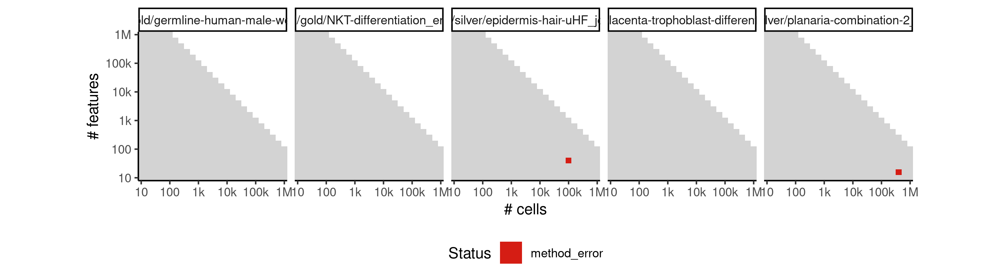

 * Number of instances: 2
 * Dataset ids: scaling_1415, scaling_1624

Last 10 lines of scaling_1415:
```
/usr/local/lib/R/site-library/RcppEigen/include/Eigen/src/Core/MapBase.h:37:34:   required from ‘class Eigen::MapBase<Eigen::Block<Eigen::Transpose<Eigen::Matrix<double, 1, -1> >, -1, 1, true>, 0>’
/usr/local/lib/R/site-library/RcppEigen/include/Eigen/src/Core/MapBase.h:215:34:   [ skipping 20 instantiation contexts, use -ftemplate-backtrace-limit=0 to disable ]
/usr/local/lib/R/site-library/RcppEigen/include/Eigen/src/Core/ProductEvaluators.h:251:23:   required from ‘static void Eigen::internal::generic_product_impl<Lhs, Rhs, Eigen::DenseShape, Eigen::DenseShape, 6>::evalTo(Dst&, const Lhs&, const Rhs&) [with Dst = Eigen::Matrix<double, 1, 1, 0, 1, 1>; Lhs = Eigen::Product<Eigen::CwiseBinaryOp<Eigen::internal::scalar_product_op<double, double>, const Eigen::CwiseNullaryOp<Eigen::internal::scalar_constant_op<double>, const Eigen::Matrix<double, 1, -1> >, const Eigen::Transpose<Eigen::Matrix<double, -1, 1> > >, Eigen::Matrix<double, -1, -1>, 0>; Rhs = Eigen::Matrix<double, -1, 1>]’
/usr/local/lib/R/site-library/RcppEigen/include/Eigen/src/Core/ProductEvaluators.h:124:75:   required from ‘Eigen::internal::product_evaluator<Eigen::Product<Lhs, Rhs, Option>, ProductTag, LhsShape, RhsShape>::product_evaluator(const XprType&) [with Lhs = Eigen::Product<Eigen::CwiseBinaryOp<Eigen::internal::scalar_product_op<double, double>, const Eigen::CwiseNullaryOp<Eigen::internal::scalar_constant_op<double>, const Eigen::Matrix<double, 1, -1> >, const Eigen::Transpose<Eigen::Matrix<double, -1, 1> > >, Eigen::Matrix<double, -1, -1>, 0>; Rhs = Eigen::Matrix<double, -1, 1>; int Options = 0; int ProductTag = 6; LhsShape = Eigen::DenseShape; RhsShape = Eigen::DenseShape; typename Eigen::internal::traits<typename Eigen::Product<Lhs, Rhs, Option>::Rhs>::Scalar = double; typename Eigen::internal::traits<typename Eigen::Product<Lhs, Rhs, Option>::Lhs>::Scalar = double; Eigen::internal::product_evaluator<Eigen::Product<Lhs, Rhs, Option>, ProductTag, LhsShape, RhsShape>::XprType = Eigen::Product<Eigen::Product<Eigen::CwiseBinaryOp<Eigen::internal::scalar_product_op<double, double>, const Eigen::CwiseNullaryOp<Eigen::internal::scalar_constant_op<double>, const Eigen::Matrix<double, 1, -1> >, const Eigen::Transpose<Eigen::Matrix<double, -1, 1> > >, Eigen::Matrix<double, -1, -1>, 0>, Eigen::Matrix<double, -1, 1>, 0>]’
/usr/local/lib/R/site-library/RcppEigen/include/Eigen/src/Core/ProductEvaluators.h:35:70:   required from ‘Eigen::internal::evaluator<Eigen::Product<Lhs, Rhs, Option> >::evaluator(const XprType&) [with Lhs = Eigen::Product<Eigen::CwiseBinaryOp<Eigen::internal::scalar_product_op<double, double>, const Eigen::CwiseNullaryOp<Eigen::internal::scalar_constant_op<double>, const Eigen::Matrix<double, 1, -1> >, const Eigen::Transpose<Eigen::Matrix<double, -1, 1> > >, Eigen::Matrix<double, -1, -1>, 0>; Rhs = Eigen::Matrix<double, -1, 1>; int Options = 0; Eigen::internal::evaluator<Eigen::Product<Lhs, Rhs, Option> >::XprType = Eigen::Product<Eigen::Product<Eigen::CwiseBinaryOp<Eigen::internal::scalar_product_op<double, double>, const Eigen::CwiseNullaryOp<Eigen::internal::scalar_constant_op<double>, const Eigen::Matrix<double, 1, -1> >, const Eigen::Transpose<Eigen::Matrix<double, -1, 1> > >, Eigen::Matrix<double, -1, -1>, 0>, Eigen::Matrix<double, -1, 1>, 0>]’
/usr/local/lib/R/site-library/RcppEigen/include/Eigen/src/Core/Product.h:132:22:   required from ‘Eigen::internal::dense_product_base<Lhs, Rhs, Option, 6>::operator const Scalar() const [with Lhs = Eigen::Product<Eigen::CwiseBinaryOp<Eigen::internal::scalar_product_op<double, double>, const Eigen::CwiseNullaryOp<Eigen::internal::scalar_constant_op<double>, const Eigen::Matrix<double, 1, -1> >, const Eigen::Transpose<Eigen::Matrix<double, -1, 1> > >, Eigen::Matrix<double, -1, -1>, 0>; Rhs = Eigen::Matrix<double, -1, 1>; int Option = 0; Eigen::internal::dense_product_base<Lhs, Rhs, Option, 6>::Scalar = double]’
/usr/local/lib/R/site-library/StanHeaders/include/src/stan/mcmc/hmc/hamiltonians/dense_e_metric.hpp:24:60:   required from ‘double stan::mcmc::dense_e_metric<Model, BaseRNG>::T(stan::mcmc::dense_e_point&) [with Model = model1d63e3aab7a28_ouija_namespace::model1d63e3aab7a28_ouija; BaseRNG = boost::random::additive_combine_engine<boost::random::linear_congruential_engine<unsigned int, 40014u, 0u, 2147483563u>, boost::random::linear_congruential_engine<unsigned int, 40692u, 0u, 2147483399u> >]’
file1d63e6dd9a0d7.cpp:1303:1:   required from here
/usr/local/lib/R/site-library/RcppEigen/include/Eigen/src/Core/DenseCoeffsBase.h:55:30: warning: ignoring attributes on template argument ‘Eigen::internal::packet_traits<double>::type {aka __vector(2) double}’ [-Wignored-attributes]
SAMPLING FOR MODEL 'ouija' NOW (CHAIN 1).
```

### ERROR CLUSTER METHOD_ERROR -- 8


 * Number of instances: 4
 * Dataset ids: scaling_1429, scaling_1451, scaling_1501, scaling_1696

Last 10 lines of scaling_1429:
```
/usr/local/lib/R/site-library/RcppEigen/include/Eigen/src/Core/MapBase.h:37:34:   required from ‘class Eigen::MapBase<Eigen::Block<Eigen::Transpose<Eigen::Matrix<double, 1, -1> >, -1, 1, true>, 0>’
/usr/local/lib/R/site-library/RcppEigen/include/Eigen/src/Core/MapBase.h:215:34:   [ skipping 20 instantiation contexts, use -ftemplate-backtrace-limit=0 to disable ]
/usr/local/lib/R/site-library/RcppEigen/include/Eigen/src/Core/ProductEvaluators.h:251:23:   required from ‘static void Eigen::internal::generic_product_impl<Lhs, Rhs, Eigen::DenseShape, Eigen::DenseShape, 6>::evalTo(Dst&, const Lhs&, const Rhs&) [with Dst = Eigen::Matrix<double, 1, 1, 0, 1, 1>; Lhs = Eigen::Product<Eigen::CwiseBinaryOp<Eigen::internal::scalar_product_op<double, double>, const Eigen::CwiseNullaryOp<Eigen::internal::scalar_constant_op<double>, const Eigen::Matrix<double, 1, -1> >, const Eigen::Transpose<Eigen::Matrix<double, -1, 1> > >, Eigen::Matrix<double, -1, -1>, 0>; Rhs = Eigen::Matrix<double, -1, 1>]’
/usr/local/lib/R/site-library/RcppEigen/include/Eigen/src/Core/ProductEvaluators.h:124:75:   required from ‘Eigen::internal::product_evaluator<Eigen::Product<Lhs, Rhs, Option>, ProductTag, LhsShape, RhsShape>::product_evaluator(const XprType&) [with Lhs = Eigen::Product<Eigen::CwiseBinaryOp<Eigen::internal::scalar_product_op<double, double>, const Eigen::CwiseNullaryOp<Eigen::internal::scalar_constant_op<double>, const Eigen::Matrix<double, 1, -1> >, const Eigen::Transpose<Eigen::Matrix<double, -1, 1> > >, Eigen::Matrix<double, -1, -1>, 0>; Rhs = Eigen::Matrix<double, -1, 1>; int Options = 0; int ProductTag = 6; LhsShape = Eigen::DenseShape; RhsShape = Eigen::DenseShape; typename Eigen::internal::traits<typename Eigen::Product<Lhs, Rhs, Option>::Rhs>::Scalar = double; typename Eigen::internal::traits<typename Eigen::Product<Lhs, Rhs, Option>::Lhs>::Scalar = double; Eigen::internal::product_evaluator<Eigen::Product<Lhs, Rhs, Option>, ProductTag, LhsShape, RhsShape>::XprType = Eigen::Product<Eigen::Product<Eigen::CwiseBinaryOp<Eigen::internal::scalar_product_op<double, double>, const Eigen::CwiseNullaryOp<Eigen::internal::scalar_constant_op<double>, const Eigen::Matrix<double, 1, -1> >, const Eigen::Transpose<Eigen::Matrix<double, -1, 1> > >, Eigen::Matrix<double, -1, -1>, 0>, Eigen::Matrix<double, -1, 1>, 0>]’
/usr/local/lib/R/site-library/RcppEigen/include/Eigen/src/Core/ProductEvaluators.h:35:70:   required from ‘Eigen::internal::evaluator<Eigen::Product<Lhs, Rhs, Option> >::evaluator(const XprType&) [with Lhs = Eigen::Product<Eigen::CwiseBinaryOp<Eigen::internal::scalar_product_op<double, double>, const Eigen::CwiseNullaryOp<Eigen::internal::scalar_constant_op<double>, const Eigen::Matrix<double, 1, -1> >, const Eigen::Transpose<Eigen::Matrix<double, -1, 1> > >, Eigen::Matrix<double, -1, -1>, 0>; Rhs = Eigen::Matrix<double, -1, 1>; int Options = 0; Eigen::internal::evaluator<Eigen::Product<Lhs, Rhs, Option> >::XprType = Eigen::Product<Eigen::Product<Eigen::CwiseBinaryOp<Eigen::internal::scalar_product_op<double, double>, const Eigen::CwiseNullaryOp<Eigen::internal::scalar_constant_op<double>, const Eigen::Matrix<double, 1, -1> >, const Eigen::Transpose<Eigen::Matrix<double, -1, 1> > >, Eigen::Matrix<double, -1, -1>, 0>, Eigen::Matrix<double, -1, 1>, 0>]’
/usr/local/lib/R/site-library/RcppEigen/include/Eigen/src/Core/Product.h:132:22:   required from ‘Eigen::internal::dense_product_base<Lhs, Rhs, Option, 6>::operator const Scalar() const [with Lhs = Eigen::Product<Eigen::CwiseBinaryOp<Eigen::internal::scalar_product_op<double, double>, const Eigen::CwiseNullaryOp<Eigen::internal::scalar_constant_op<double>, const Eigen::Matrix<double, 1, -1> >, const Eigen::Transpose<Eigen::Matrix<double, -1, 1> > >, Eigen::Matrix<double, -1, -1>, 0>; Rhs = Eigen::Matrix<double, -1, 1>; int Option = 0; Eigen::internal::dense_product_base<Lhs, Rhs, Option, 6>::Scalar = double]’
/usr/local/lib/R/site-library/StanHeaders/include/src/stan/mcmc/hmc/hamiltonians/dense_e_metric.hpp:24:60:   required from ‘double stan::mcmc::dense_e_metric<Model, BaseRNG>::T(stan::mcmc::dense_e_point&) [with Model = model62eea3ab5bc_ouija_namespace::model62eea3ab5bc_ouija; BaseRNG = boost::random::additive_combine_engine<boost::random::linear_congruential_engine<unsigned int, 40014u, 0u, 2147483563u>, boost::random::linear_congruential_engine<unsigned int, 40692u, 0u, 2147483399u> >]’
file62ee3b959b3c.cpp:1303:1:   required from here
/usr/local/lib/R/site-library/RcppEigen/include/Eigen/src/Core/DenseCoeffsBase.h:55:30: warning: ignoring attributes on template argument ‘Eigen::internal::packet_traits<double>::type {aka __vector(2) double}’ [-Wignored-attributes]
SAMPLING FOR MODEL 'ouija' NOW (CHAIN 1).
```

### ERROR CLUSTER METHOD_ERROR -- 9
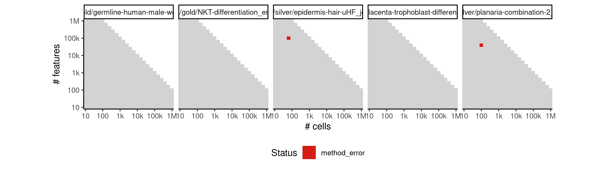

 * Number of instances: 2
 * Dataset ids: scaling_1431, scaling_1513

Last 10 lines of scaling_1431:
```
/usr/local/lib/R/site-library/RcppEigen/include/Eigen/src/Core/MapBase.h:37:34:   required from ‘class Eigen::MapBase<Eigen::Block<Eigen::Transpose<Eigen::Matrix<double, 1, -1> >, -1, 1, true>, 0>’
/usr/local/lib/R/site-library/RcppEigen/include/Eigen/src/Core/MapBase.h:215:34:   [ skipping 20 instantiation contexts, use -ftemplate-backtrace-limit=0 to disable ]
/usr/local/lib/R/site-library/RcppEigen/include/Eigen/src/Core/ProductEvaluators.h:251:23:   required from ‘static void Eigen::internal::generic_product_impl<Lhs, Rhs, Eigen::DenseShape, Eigen::DenseShape, 6>::evalTo(Dst&, const Lhs&, const Rhs&) [with Dst = Eigen::Matrix<double, 1, 1, 0, 1, 1>; Lhs = Eigen::Product<Eigen::CwiseBinaryOp<Eigen::internal::scalar_product_op<double, double>, const Eigen::CwiseNullaryOp<Eigen::internal::scalar_constant_op<double>, const Eigen::Matrix<double, 1, -1> >, const Eigen::Transpose<Eigen::Matrix<double, -1, 1> > >, Eigen::Matrix<double, -1, -1>, 0>; Rhs = Eigen::Matrix<double, -1, 1>]’
/usr/local/lib/R/site-library/RcppEigen/include/Eigen/src/Core/ProductEvaluators.h:124:75:   required from ‘Eigen::internal::product_evaluator<Eigen::Product<Lhs, Rhs, Option>, ProductTag, LhsShape, RhsShape>::product_evaluator(const XprType&) [with Lhs = Eigen::Product<Eigen::CwiseBinaryOp<Eigen::internal::scalar_product_op<double, double>, const Eigen::CwiseNullaryOp<Eigen::internal::scalar_constant_op<double>, const Eigen::Matrix<double, 1, -1> >, const Eigen::Transpose<Eigen::Matrix<double, -1, 1> > >, Eigen::Matrix<double, -1, -1>, 0>; Rhs = Eigen::Matrix<double, -1, 1>; int Options = 0; int ProductTag = 6; LhsShape = Eigen::DenseShape; RhsShape = Eigen::DenseShape; typename Eigen::internal::traits<typename Eigen::Product<Lhs, Rhs, Option>::Rhs>::Scalar = double; typename Eigen::internal::traits<typename Eigen::Product<Lhs, Rhs, Option>::Lhs>::Scalar = double; Eigen::internal::product_evaluator<Eigen::Product<Lhs, Rhs, Option>, ProductTag, LhsShape, RhsShape>::XprType = Eigen::Product<Eigen::Product<Eigen::CwiseBinaryOp<Eigen::internal::scalar_product_op<double, double>, const Eigen::CwiseNullaryOp<Eigen::internal::scalar_constant_op<double>, const Eigen::Matrix<double, 1, -1> >, const Eigen::Transpose<Eigen::Matrix<double, -1, 1> > >, Eigen::Matrix<double, -1, -1>, 0>, Eigen::Matrix<double, -1, 1>, 0>]’
/usr/local/lib/R/site-library/RcppEigen/include/Eigen/src/Core/ProductEvaluators.h:35:70:   required from ‘Eigen::internal::evaluator<Eigen::Product<Lhs, Rhs, Option> >::evaluator(const XprType&) [with Lhs = Eigen::Product<Eigen::CwiseBinaryOp<Eigen::internal::scalar_product_op<double, double>, const Eigen::CwiseNullaryOp<Eigen::internal::scalar_constant_op<double>, const Eigen::Matrix<double, 1, -1> >, const Eigen::Transpose<Eigen::Matrix<double, -1, 1> > >, Eigen::Matrix<double, -1, -1>, 0>; Rhs = Eigen::Matrix<double, -1, 1>; int Options = 0; Eigen::internal::evaluator<Eigen::Product<Lhs, Rhs, Option> >::XprType = Eigen::Product<Eigen::Product<Eigen::CwiseBinaryOp<Eigen::internal::scalar_product_op<double, double>, const Eigen::CwiseNullaryOp<Eigen::internal::scalar_constant_op<double>, const Eigen::Matrix<double, 1, -1> >, const Eigen::Transpose<Eigen::Matrix<double, -1, 1> > >, Eigen::Matrix<double, -1, -1>, 0>, Eigen::Matrix<double, -1, 1>, 0>]’
/usr/local/lib/R/site-library/RcppEigen/include/Eigen/src/Core/Product.h:132:22:   required from ‘Eigen::internal::dense_product_base<Lhs, Rhs, Option, 6>::operator const Scalar() const [with Lhs = Eigen::Product<Eigen::CwiseBinaryOp<Eigen::internal::scalar_product_op<double, double>, const Eigen::CwiseNullaryOp<Eigen::internal::scalar_constant_op<double>, const Eigen::Matrix<double, 1, -1> >, const Eigen::Transpose<Eigen::Matrix<double, -1, 1> > >, Eigen::Matrix<double, -1, -1>, 0>; Rhs = Eigen::Matrix<double, -1, 1>; int Option = 0; Eigen::internal::dense_product_base<Lhs, Rhs, Option, 6>::Scalar = double]’
/usr/local/lib/R/site-library/StanHeaders/include/src/stan/mcmc/hmc/hamiltonians/dense_e_metric.hpp:24:60:   required from ‘double stan::mcmc::dense_e_metric<Model, BaseRNG>::T(stan::mcmc::dense_e_point&) [with Model = modeldc00aadbc06_ouija_namespace::modeldc00aadbc06_ouija; BaseRNG = boost::random::additive_combine_engine<boost::random::linear_congruential_engine<unsigned int, 40014u, 0u, 2147483563u>, boost::random::linear_congruential_engine<unsigned int, 40692u, 0u, 2147483399u> >]’
filedc003f614853.cpp:1303:1:   required from here
/usr/local/lib/R/site-library/RcppEigen/include/Eigen/src/Core/DenseCoeffsBase.h:55:30: warning: ignoring attributes on template argument ‘Eigen::internal::packet_traits<double>::type {aka __vector(2) double}’ [-Wignored-attributes]
SAMPLING FOR MODEL 'ouija' NOW (CHAIN 1).
```

### ERROR CLUSTER METHOD_ERROR -- 10
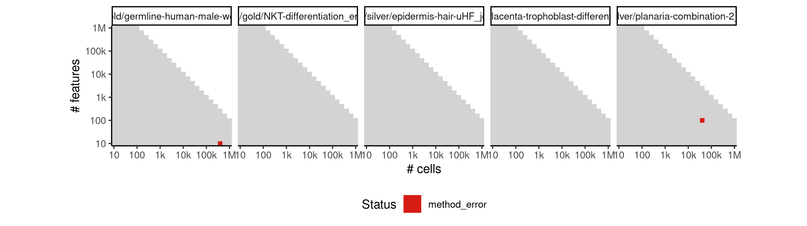

 * Number of instances: 2
 * Dataset ids: scaling_1438, scaling_1452

Last 10 lines of scaling_1438:
```
/usr/local/lib/R/site-library/RcppEigen/include/Eigen/src/Core/MapBase.h:37:34:   required from ‘class Eigen::MapBase<Eigen::Block<Eigen::Transpose<Eigen::Matrix<double, 1, -1> >, -1, 1, true>, 0>’
/usr/local/lib/R/site-library/RcppEigen/include/Eigen/src/Core/MapBase.h:215:34:   [ skipping 20 instantiation contexts, use -ftemplate-backtrace-limit=0 to disable ]
/usr/local/lib/R/site-library/RcppEigen/include/Eigen/src/Core/ProductEvaluators.h:251:23:   required from ‘static void Eigen::internal::generic_product_impl<Lhs, Rhs, Eigen::DenseShape, Eigen::DenseShape, 6>::evalTo(Dst&, const Lhs&, const Rhs&) [with Dst = Eigen::Matrix<double, 1, 1, 0, 1, 1>; Lhs = Eigen::Product<Eigen::CwiseBinaryOp<Eigen::internal::scalar_product_op<double, double>, const Eigen::CwiseNullaryOp<Eigen::internal::scalar_constant_op<double>, const Eigen::Matrix<double, 1, -1> >, const Eigen::Transpose<Eigen::Matrix<double, -1, 1> > >, Eigen::Matrix<double, -1, -1>, 0>; Rhs = Eigen::Matrix<double, -1, 1>]’
/usr/local/lib/R/site-library/RcppEigen/include/Eigen/src/Core/ProductEvaluators.h:124:75:   required from ‘Eigen::internal::product_evaluator<Eigen::Product<Lhs, Rhs, Option>, ProductTag, LhsShape, RhsShape>::product_evaluator(const XprType&) [with Lhs = Eigen::Product<Eigen::CwiseBinaryOp<Eigen::internal::scalar_product_op<double, double>, const Eigen::CwiseNullaryOp<Eigen::internal::scalar_constant_op<double>, const Eigen::Matrix<double, 1, -1> >, const Eigen::Transpose<Eigen::Matrix<double, -1, 1> > >, Eigen::Matrix<double, -1, -1>, 0>; Rhs = Eigen::Matrix<double, -1, 1>; int Options = 0; int ProductTag = 6; LhsShape = Eigen::DenseShape; RhsShape = Eigen::DenseShape; typename Eigen::internal::traits<typename Eigen::Product<Lhs, Rhs, Option>::Rhs>::Scalar = double; typename Eigen::internal::traits<typename Eigen::Product<Lhs, Rhs, Option>::Lhs>::Scalar = double; Eigen::internal::product_evaluator<Eigen::Product<Lhs, Rhs, Option>, ProductTag, LhsShape, RhsShape>::XprType = Eigen::Product<Eigen::Product<Eigen::CwiseBinaryOp<Eigen::internal::scalar_product_op<double, double>, const Eigen::CwiseNullaryOp<Eigen::internal::scalar_constant_op<double>, const Eigen::Matrix<double, 1, -1> >, const Eigen::Transpose<Eigen::Matrix<double, -1, 1> > >, Eigen::Matrix<double, -1, -1>, 0>, Eigen::Matrix<double, -1, 1>, 0>]’
/usr/local/lib/R/site-library/RcppEigen/include/Eigen/src/Core/ProductEvaluators.h:35:70:   required from ‘Eigen::internal::evaluator<Eigen::Product<Lhs, Rhs, Option> >::evaluator(const XprType&) [with Lhs = Eigen::Product<Eigen::CwiseBinaryOp<Eigen::internal::scalar_product_op<double, double>, const Eigen::CwiseNullaryOp<Eigen::internal::scalar_constant_op<double>, const Eigen::Matrix<double, 1, -1> >, const Eigen::Transpose<Eigen::Matrix<double, -1, 1> > >, Eigen::Matrix<double, -1, -1>, 0>; Rhs = Eigen::Matrix<double, -1, 1>; int Options = 0; Eigen::internal::evaluator<Eigen::Product<Lhs, Rhs, Option> >::XprType = Eigen::Product<Eigen::Product<Eigen::CwiseBinaryOp<Eigen::internal::scalar_product_op<double, double>, const Eigen::CwiseNullaryOp<Eigen::internal::scalar_constant_op<double>, const Eigen::Matrix<double, 1, -1> >, const Eigen::Transpose<Eigen::Matrix<double, -1, 1> > >, Eigen::Matrix<double, -1, -1>, 0>, Eigen::Matrix<double, -1, 1>, 0>]’
/usr/local/lib/R/site-library/RcppEigen/include/Eigen/src/Core/Product.h:132:22:   required from ‘Eigen::internal::dense_product_base<Lhs, Rhs, Option, 6>::operator const Scalar() const [with Lhs = Eigen::Product<Eigen::CwiseBinaryOp<Eigen::internal::scalar_product_op<double, double>, const Eigen::CwiseNullaryOp<Eigen::internal::scalar_constant_op<double>, const Eigen::Matrix<double, 1, -1> >, const Eigen::Transpose<Eigen::Matrix<double, -1, 1> > >, Eigen::Matrix<double, -1, -1>, 0>; Rhs = Eigen::Matrix<double, -1, 1>; int Option = 0; Eigen::internal::dense_product_base<Lhs, Rhs, Option, 6>::Scalar = double]’
/usr/local/lib/R/site-library/StanHeaders/include/src/stan/mcmc/hmc/hamiltonians/dense_e_metric.hpp:24:60:   required from ‘double stan::mcmc::dense_e_metric<Model, BaseRNG>::T(stan::mcmc::dense_e_point&) [with Model = model1dfc33cc4552f_ouija_namespace::model1dfc33cc4552f_ouija; BaseRNG = boost::random::additive_combine_engine<boost::random::linear_congruential_engine<unsigned int, 40014u, 0u, 2147483563u>, boost::random::linear_congruential_engine<unsigned int, 40692u, 0u, 2147483399u> >]’
file1dfc3580f253b.cpp:1303:1:   required from here
/usr/local/lib/R/site-library/RcppEigen/include/Eigen/src/Core/DenseCoeffsBase.h:55:30: warning: ignoring attributes on template argument ‘Eigen::internal::packet_traits<double>::type {aka __vector(2) double}’ [-Wignored-attributes]
SAMPLING FOR MODEL 'ouija' NOW (CHAIN 1).
```

### ERROR CLUSTER METHOD_ERROR -- 11
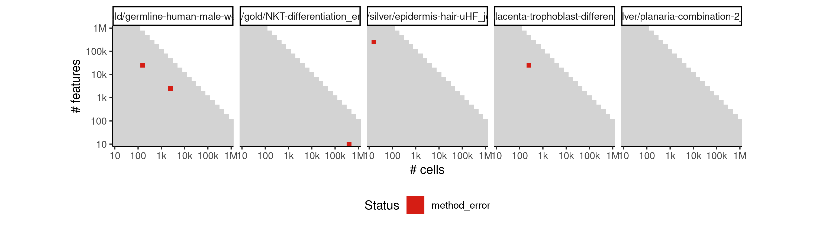

 * Number of instances: 5
 * Dataset ids: scaling_1444, scaling_1464, scaling_1466, scaling_1540, scaling_1593

Last 10 lines of scaling_1444:
```
/usr/local/lib/R/site-library/RcppEigen/include/Eigen/src/Core/MapBase.h:37:34:   required from ‘class Eigen::MapBase<Eigen::Block<Eigen::Transpose<Eigen::Matrix<double, 1, -1> >, -1, 1, true>, 0>’
/usr/local/lib/R/site-library/RcppEigen/include/Eigen/src/Core/MapBase.h:215:34:   [ skipping 20 instantiation contexts, use -ftemplate-backtrace-limit=0 to disable ]
/usr/local/lib/R/site-library/RcppEigen/include/Eigen/src/Core/ProductEvaluators.h:251:23:   required from ‘static void Eigen::internal::generic_product_impl<Lhs, Rhs, Eigen::DenseShape, Eigen::DenseShape, 6>::evalTo(Dst&, const Lhs&, const Rhs&) [with Dst = Eigen::Matrix<double, 1, 1, 0, 1, 1>; Lhs = Eigen::Product<Eigen::CwiseBinaryOp<Eigen::internal::scalar_product_op<double, double>, const Eigen::CwiseNullaryOp<Eigen::internal::scalar_constant_op<double>, const Eigen::Matrix<double, 1, -1> >, const Eigen::Transpose<Eigen::Matrix<double, -1, 1> > >, Eigen::Matrix<double, -1, -1>, 0>; Rhs = Eigen::Matrix<double, -1, 1>]’
/usr/local/lib/R/site-library/RcppEigen/include/Eigen/src/Core/ProductEvaluators.h:124:75:   required from ‘Eigen::internal::product_evaluator<Eigen::Product<Lhs, Rhs, Option>, ProductTag, LhsShape, RhsShape>::product_evaluator(const XprType&) [with Lhs = Eigen::Product<Eigen::CwiseBinaryOp<Eigen::internal::scalar_product_op<double, double>, const Eigen::CwiseNullaryOp<Eigen::internal::scalar_constant_op<double>, const Eigen::Matrix<double, 1, -1> >, const Eigen::Transpose<Eigen::Matrix<double, -1, 1> > >, Eigen::Matrix<double, -1, -1>, 0>; Rhs = Eigen::Matrix<double, -1, 1>; int Options = 0; int ProductTag = 6; LhsShape = Eigen::DenseShape; RhsShape = Eigen::DenseShape; typename Eigen::internal::traits<typename Eigen::Product<Lhs, Rhs, Option>::Rhs>::Scalar = double; typename Eigen::internal::traits<typename Eigen::Product<Lhs, Rhs, Option>::Lhs>::Scalar = double; Eigen::internal::product_evaluator<Eigen::Product<Lhs, Rhs, Option>, ProductTag, LhsShape, RhsShape>::XprType = Eigen::Product<Eigen::Product<Eigen::CwiseBinaryOp<Eigen::internal::scalar_product_op<double, double>, const Eigen::CwiseNullaryOp<Eigen::internal::scalar_constant_op<double>, const Eigen::Matrix<double, 1, -1> >, const Eigen::Transpose<Eigen::Matrix<double, -1, 1> > >, Eigen::Matrix<double, -1, -1>, 0>, Eigen::Matrix<double, -1, 1>, 0>]’
/usr/local/lib/R/site-library/RcppEigen/include/Eigen/src/Core/ProductEvaluators.h:35:70:   required from ‘Eigen::internal::evaluator<Eigen::Product<Lhs, Rhs, Option> >::evaluator(const XprType&) [with Lhs = Eigen::Product<Eigen::CwiseBinaryOp<Eigen::internal::scalar_product_op<double, double>, const Eigen::CwiseNullaryOp<Eigen::internal::scalar_constant_op<double>, const Eigen::Matrix<double, 1, -1> >, const Eigen::Transpose<Eigen::Matrix<double, -1, 1> > >, Eigen::Matrix<double, -1, -1>, 0>; Rhs = Eigen::Matrix<double, -1, 1>; int Options = 0; Eigen::internal::evaluator<Eigen::Product<Lhs, Rhs, Option> >::XprType = Eigen::Product<Eigen::Product<Eigen::CwiseBinaryOp<Eigen::internal::scalar_product_op<double, double>, const Eigen::CwiseNullaryOp<Eigen::internal::scalar_constant_op<double>, const Eigen::Matrix<double, 1, -1> >, const Eigen::Transpose<Eigen::Matrix<double, -1, 1> > >, Eigen::Matrix<double, -1, -1>, 0>, Eigen::Matrix<double, -1, 1>, 0>]’
/usr/local/lib/R/site-library/RcppEigen/include/Eigen/src/Core/Product.h:132:22:   required from ‘Eigen::internal::dense_product_base<Lhs, Rhs, Option, 6>::operator const Scalar() const [with Lhs = Eigen::Product<Eigen::CwiseBinaryOp<Eigen::internal::scalar_product_op<double, double>, const Eigen::CwiseNullaryOp<Eigen::internal::scalar_constant_op<double>, const Eigen::Matrix<double, 1, -1> >, const Eigen::Transpose<Eigen::Matrix<double, -1, 1> > >, Eigen::Matrix<double, -1, -1>, 0>; Rhs = Eigen::Matrix<double, -1, 1>; int Option = 0; Eigen::internal::dense_product_base<Lhs, Rhs, Option, 6>::Scalar = double]’
/usr/local/lib/R/site-library/StanHeaders/include/src/stan/mcmc/hmc/hamiltonians/dense_e_metric.hpp:24:60:   required from ‘double stan::mcmc::dense_e_metric<Model, BaseRNG>::T(stan::mcmc::dense_e_point&) [with Model = model6a636ac23a7a_ouija_namespace::model6a636ac23a7a_ouija; BaseRNG = boost::random::additive_combine_engine<boost::random::linear_congruential_engine<unsigned int, 40014u, 0u, 2147483563u>, boost::random::linear_congruential_engine<unsigned int, 40692u, 0u, 2147483399u> >]’
file6a633e298829.cpp:1303:1:   required from here
/usr/local/lib/R/site-library/RcppEigen/include/Eigen/src/Core/DenseCoeffsBase.h:55:30: warning: ignoring attributes on template argument ‘Eigen::internal::packet_traits<double>::type {aka __vector(2) double}’ [-Wignored-attributes]
SAMPLING FOR MODEL 'ouija' NOW (CHAIN 1).
```

### ERROR CLUSTER METHOD_ERROR -- 12
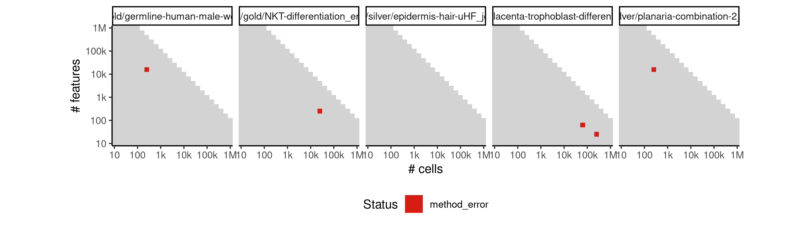

 * Number of instances: 5
 * Dataset ids: scaling_1445, scaling_1486, scaling_1493, scaling_1563, scaling_1604

Last 10 lines of scaling_1445:
```
/usr/local/lib/R/site-library/RcppEigen/include/Eigen/src/Core/MapBase.h:37:34:   required from ‘class Eigen::MapBase<Eigen::Block<Eigen::Transpose<Eigen::Matrix<double, 1, -1> >, -1, 1, true>, 0>’
/usr/local/lib/R/site-library/RcppEigen/include/Eigen/src/Core/MapBase.h:215:34:   [ skipping 20 instantiation contexts, use -ftemplate-backtrace-limit=0 to disable ]
/usr/local/lib/R/site-library/RcppEigen/include/Eigen/src/Core/ProductEvaluators.h:251:23:   required from ‘static void Eigen::internal::generic_product_impl<Lhs, Rhs, Eigen::DenseShape, Eigen::DenseShape, 6>::evalTo(Dst&, const Lhs&, const Rhs&) [with Dst = Eigen::Matrix<double, 1, 1, 0, 1, 1>; Lhs = Eigen::Product<Eigen::CwiseBinaryOp<Eigen::internal::scalar_product_op<double, double>, const Eigen::CwiseNullaryOp<Eigen::internal::scalar_constant_op<double>, const Eigen::Matrix<double, 1, -1> >, const Eigen::Transpose<Eigen::Matrix<double, -1, 1> > >, Eigen::Matrix<double, -1, -1>, 0>; Rhs = Eigen::Matrix<double, -1, 1>]’
/usr/local/lib/R/site-library/RcppEigen/include/Eigen/src/Core/ProductEvaluators.h:124:75:   required from ‘Eigen::internal::product_evaluator<Eigen::Product<Lhs, Rhs, Option>, ProductTag, LhsShape, RhsShape>::product_evaluator(const XprType&) [with Lhs = Eigen::Product<Eigen::CwiseBinaryOp<Eigen::internal::scalar_product_op<double, double>, const Eigen::CwiseNullaryOp<Eigen::internal::scalar_constant_op<double>, const Eigen::Matrix<double, 1, -1> >, const Eigen::Transpose<Eigen::Matrix<double, -1, 1> > >, Eigen::Matrix<double, -1, -1>, 0>; Rhs = Eigen::Matrix<double, -1, 1>; int Options = 0; int ProductTag = 6; LhsShape = Eigen::DenseShape; RhsShape = Eigen::DenseShape; typename Eigen::internal::traits<typename Eigen::Product<Lhs, Rhs, Option>::Rhs>::Scalar = double; typename Eigen::internal::traits<typename Eigen::Product<Lhs, Rhs, Option>::Lhs>::Scalar = double; Eigen::internal::product_evaluator<Eigen::Product<Lhs, Rhs, Option>, ProductTag, LhsShape, RhsShape>::XprType = Eigen::Product<Eigen::Product<Eigen::CwiseBinaryOp<Eigen::internal::scalar_product_op<double, double>, const Eigen::CwiseNullaryOp<Eigen::internal::scalar_constant_op<double>, const Eigen::Matrix<double, 1, -1> >, const Eigen::Transpose<Eigen::Matrix<double, -1, 1> > >, Eigen::Matrix<double, -1, -1>, 0>, Eigen::Matrix<double, -1, 1>, 0>]’
/usr/local/lib/R/site-library/RcppEigen/include/Eigen/src/Core/ProductEvaluators.h:35:70:   required from ‘Eigen::internal::evaluator<Eigen::Product<Lhs, Rhs, Option> >::evaluator(const XprType&) [with Lhs = Eigen::Product<Eigen::CwiseBinaryOp<Eigen::internal::scalar_product_op<double, double>, const Eigen::CwiseNullaryOp<Eigen::internal::scalar_constant_op<double>, const Eigen::Matrix<double, 1, -1> >, const Eigen::Transpose<Eigen::Matrix<double, -1, 1> > >, Eigen::Matrix<double, -1, -1>, 0>; Rhs = Eigen::Matrix<double, -1, 1>; int Options = 0; Eigen::internal::evaluator<Eigen::Product<Lhs, Rhs, Option> >::XprType = Eigen::Product<Eigen::Product<Eigen::CwiseBinaryOp<Eigen::internal::scalar_product_op<double, double>, const Eigen::CwiseNullaryOp<Eigen::internal::scalar_constant_op<double>, const Eigen::Matrix<double, 1, -1> >, const Eigen::Transpose<Eigen::Matrix<double, -1, 1> > >, Eigen::Matrix<double, -1, -1>, 0>, Eigen::Matrix<double, -1, 1>, 0>]’
/usr/local/lib/R/site-library/RcppEigen/include/Eigen/src/Core/Product.h:132:22:   required from ‘Eigen::internal::dense_product_base<Lhs, Rhs, Option, 6>::operator const Scalar() const [with Lhs = Eigen::Product<Eigen::CwiseBinaryOp<Eigen::internal::scalar_product_op<double, double>, const Eigen::CwiseNullaryOp<Eigen::internal::scalar_constant_op<double>, const Eigen::Matrix<double, 1, -1> >, const Eigen::Transpose<Eigen::Matrix<double, -1, 1> > >, Eigen::Matrix<double, -1, -1>, 0>; Rhs = Eigen::Matrix<double, -1, 1>; int Option = 0; Eigen::internal::dense_product_base<Lhs, Rhs, Option, 6>::Scalar = double]’
/usr/local/lib/R/site-library/StanHeaders/include/src/stan/mcmc/hmc/hamiltonians/dense_e_metric.hpp:24:60:   required from ‘double stan::mcmc::dense_e_metric<Model, BaseRNG>::T(stan::mcmc::dense_e_point&) [with Model = model9b5469a48da9_ouija_namespace::model9b5469a48da9_ouija; BaseRNG = boost::random::additive_combine_engine<boost::random::linear_congruential_engine<unsigned int, 40014u, 0u, 2147483563u>, boost::random::linear_congruential_engine<unsigned int, 40692u, 0u, 2147483399u> >]’
file9b5453ccdd27.cpp:1303:1:   required from here
/usr/local/lib/R/site-library/RcppEigen/include/Eigen/src/Core/DenseCoeffsBase.h:55:30: warning: ignoring attributes on template argument ‘Eigen::internal::packet_traits<double>::type {aka __vector(2) double}’ [-Wignored-attributes]
SAMPLING FOR MODEL 'ouija' NOW (CHAIN 1).
```

### ERROR CLUSTER METHOD_ERROR -- 13


 * Number of instances: 1
 * Dataset ids: scaling_1456

Last 10 lines of scaling_1456:
```
/usr/local/lib/R/site-library/RcppEigen/include/Eigen/src/Core/MapBase.h:37:34:   required from ‘class Eigen::MapBase<Eigen::Block<Eigen::Transpose<Eigen::Matrix<double, 1, -1> >, -1, 1, true>, 0>’
/usr/local/lib/R/site-library/RcppEigen/include/Eigen/src/Core/MapBase.h:215:34:   [ skipping 20 instantiation contexts, use -ftemplate-backtrace-limit=0 to disable ]
/usr/local/lib/R/site-library/RcppEigen/include/Eigen/src/Core/ProductEvaluators.h:251:23:   required from ‘static void Eigen::internal::generic_product_impl<Lhs, Rhs, Eigen::DenseShape, Eigen::DenseShape, 6>::evalTo(Dst&, const Lhs&, const Rhs&) [with Dst = Eigen::Matrix<double, 1, 1, 0, 1, 1>; Lhs = Eigen::Product<Eigen::CwiseBinaryOp<Eigen::internal::scalar_product_op<double, double>, const Eigen::CwiseNullaryOp<Eigen::internal::scalar_constant_op<double>, const Eigen::Matrix<double, 1, -1> >, const Eigen::Transpose<Eigen::Matrix<double, -1, 1> > >, Eigen::Matrix<double, -1, -1>, 0>; Rhs = Eigen::Matrix<double, -1, 1>]’
/usr/local/lib/R/site-library/RcppEigen/include/Eigen/src/Core/ProductEvaluators.h:124:75:   required from ‘Eigen::internal::product_evaluator<Eigen::Product<Lhs, Rhs, Option>, ProductTag, LhsShape, RhsShape>::product_evaluator(const XprType&) [with Lhs = Eigen::Product<Eigen::CwiseBinaryOp<Eigen::internal::scalar_product_op<double, double>, const Eigen::CwiseNullaryOp<Eigen::internal::scalar_constant_op<double>, const Eigen::Matrix<double, 1, -1> >, const Eigen::Transpose<Eigen::Matrix<double, -1, 1> > >, Eigen::Matrix<double, -1, -1>, 0>; Rhs = Eigen::Matrix<double, -1, 1>; int Options = 0; int ProductTag = 6; LhsShape = Eigen::DenseShape; RhsShape = Eigen::DenseShape; typename Eigen::internal::traits<typename Eigen::Product<Lhs, Rhs, Option>::Rhs>::Scalar = double; typename Eigen::internal::traits<typename Eigen::Product<Lhs, Rhs, Option>::Lhs>::Scalar = double; Eigen::internal::product_evaluator<Eigen::Product<Lhs, Rhs, Option>, ProductTag, LhsShape, RhsShape>::XprType = Eigen::Product<Eigen::Product<Eigen::CwiseBinaryOp<Eigen::internal::scalar_product_op<double, double>, const Eigen::CwiseNullaryOp<Eigen::internal::scalar_constant_op<double>, const Eigen::Matrix<double, 1, -1> >, const Eigen::Transpose<Eigen::Matrix<double, -1, 1> > >, Eigen::Matrix<double, -1, -1>, 0>, Eigen::Matrix<double, -1, 1>, 0>]’
/usr/local/lib/R/site-library/RcppEigen/include/Eigen/src/Core/ProductEvaluators.h:35:70:   required from ‘Eigen::internal::evaluator<Eigen::Product<Lhs, Rhs, Option> >::evaluator(const XprType&) [with Lhs = Eigen::Product<Eigen::CwiseBinaryOp<Eigen::internal::scalar_product_op<double, double>, const Eigen::CwiseNullaryOp<Eigen::internal::scalar_constant_op<double>, const Eigen::Matrix<double, 1, -1> >, const Eigen::Transpose<Eigen::Matrix<double, -1, 1> > >, Eigen::Matrix<double, -1, -1>, 0>; Rhs = Eigen::Matrix<double, -1, 1>; int Options = 0; Eigen::internal::evaluator<Eigen::Product<Lhs, Rhs, Option> >::XprType = Eigen::Product<Eigen::Product<Eigen::CwiseBinaryOp<Eigen::internal::scalar_product_op<double, double>, const Eigen::CwiseNullaryOp<Eigen::internal::scalar_constant_op<double>, const Eigen::Matrix<double, 1, -1> >, const Eigen::Transpose<Eigen::Matrix<double, -1, 1> > >, Eigen::Matrix<double, -1, -1>, 0>, Eigen::Matrix<double, -1, 1>, 0>]’
/usr/local/lib/R/site-library/RcppEigen/include/Eigen/src/Core/Product.h:132:22:   required from ‘Eigen::internal::dense_product_base<Lhs, Rhs, Option, 6>::operator const Scalar() const [with Lhs = Eigen::Product<Eigen::CwiseBinaryOp<Eigen::internal::scalar_product_op<double, double>, const Eigen::CwiseNullaryOp<Eigen::internal::scalar_constant_op<double>, const Eigen::Matrix<double, 1, -1> >, const Eigen::Transpose<Eigen::Matrix<double, -1, 1> > >, Eigen::Matrix<double, -1, -1>, 0>; Rhs = Eigen::Matrix<double, -1, 1>; int Option = 0; Eigen::internal::dense_product_base<Lhs, Rhs, Option, 6>::Scalar = double]’
/usr/local/lib/R/site-library/StanHeaders/include/src/stan/mcmc/hmc/hamiltonians/dense_e_metric.hpp:24:60:   required from ‘double stan::mcmc::dense_e_metric<Model, BaseRNG>::T(stan::mcmc::dense_e_point&) [with Model = model19fec1a0afa21_ouija_namespace::model19fec1a0afa21_ouija; BaseRNG = boost::random::additive_combine_engine<boost::random::linear_congruential_engine<unsigned int, 40014u, 0u, 2147483563u>, boost::random::linear_congruential_engine<unsigned int, 40692u, 0u, 2147483399u> >]’
file19fec3c436708.cpp:1303:1:   required from here
/usr/local/lib/R/site-library/RcppEigen/include/Eigen/src/Core/DenseCoeffsBase.h:55:30: warning: ignoring attributes on template argument ‘Eigen::internal::packet_traits<double>::type {aka __vector(2) double}’ [-Wignored-attributes]
SAMPLING FOR MODEL 'ouija' NOW (CHAIN 1).
```

### ERROR CLUSTER METHOD_ERROR -- 14
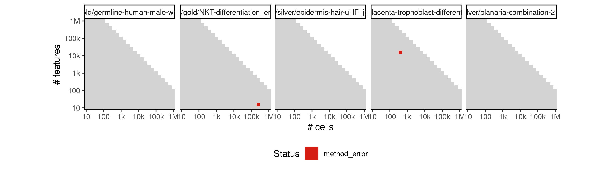

 * Number of instances: 2
 * Dataset ids: scaling_1463, scaling_1594

Last 10 lines of scaling_1463:
```
/usr/local/lib/R/site-library/RcppEigen/include/Eigen/src/Core/MapBase.h:37:34:   required from ‘class Eigen::MapBase<Eigen::Block<Eigen::Transpose<Eigen::Matrix<double, 1, -1> >, -1, 1, true>, 0>’
/usr/local/lib/R/site-library/RcppEigen/include/Eigen/src/Core/MapBase.h:215:34:   [ skipping 20 instantiation contexts, use -ftemplate-backtrace-limit=0 to disable ]
/usr/local/lib/R/site-library/RcppEigen/include/Eigen/src/Core/ProductEvaluators.h:251:23:   required from ‘static void Eigen::internal::generic_product_impl<Lhs, Rhs, Eigen::DenseShape, Eigen::DenseShape, 6>::evalTo(Dst&, const Lhs&, const Rhs&) [with Dst = Eigen::Matrix<double, 1, 1, 0, 1, 1>; Lhs = Eigen::Product<Eigen::CwiseBinaryOp<Eigen::internal::scalar_product_op<double, double>, const Eigen::CwiseNullaryOp<Eigen::internal::scalar_constant_op<double>, const Eigen::Matrix<double, 1, -1> >, const Eigen::Transpose<Eigen::Matrix<double, -1, 1> > >, Eigen::Matrix<double, -1, -1>, 0>; Rhs = Eigen::Matrix<double, -1, 1>]’
/usr/local/lib/R/site-library/RcppEigen/include/Eigen/src/Core/ProductEvaluators.h:124:75:   required from ‘Eigen::internal::product_evaluator<Eigen::Product<Lhs, Rhs, Option>, ProductTag, LhsShape, RhsShape>::product_evaluator(const XprType&) [with Lhs = Eigen::Product<Eigen::CwiseBinaryOp<Eigen::internal::scalar_product_op<double, double>, const Eigen::CwiseNullaryOp<Eigen::internal::scalar_constant_op<double>, const Eigen::Matrix<double, 1, -1> >, const Eigen::Transpose<Eigen::Matrix<double, -1, 1> > >, Eigen::Matrix<double, -1, -1>, 0>; Rhs = Eigen::Matrix<double, -1, 1>; int Options = 0; int ProductTag = 6; LhsShape = Eigen::DenseShape; RhsShape = Eigen::DenseShape; typename Eigen::internal::traits<typename Eigen::Product<Lhs, Rhs, Option>::Rhs>::Scalar = double; typename Eigen::internal::traits<typename Eigen::Product<Lhs, Rhs, Option>::Lhs>::Scalar = double; Eigen::internal::product_evaluator<Eigen::Product<Lhs, Rhs, Option>, ProductTag, LhsShape, RhsShape>::XprType = Eigen::Product<Eigen::Product<Eigen::CwiseBinaryOp<Eigen::internal::scalar_product_op<double, double>, const Eigen::CwiseNullaryOp<Eigen::internal::scalar_constant_op<double>, const Eigen::Matrix<double, 1, -1> >, const Eigen::Transpose<Eigen::Matrix<double, -1, 1> > >, Eigen::Matrix<double, -1, -1>, 0>, Eigen::Matrix<double, -1, 1>, 0>]’
/usr/local/lib/R/site-library/RcppEigen/include/Eigen/src/Core/ProductEvaluators.h:35:70:   required from ‘Eigen::internal::evaluator<Eigen::Product<Lhs, Rhs, Option> >::evaluator(const XprType&) [with Lhs = Eigen::Product<Eigen::CwiseBinaryOp<Eigen::internal::scalar_product_op<double, double>, const Eigen::CwiseNullaryOp<Eigen::internal::scalar_constant_op<double>, const Eigen::Matrix<double, 1, -1> >, const Eigen::Transpose<Eigen::Matrix<double, -1, 1> > >, Eigen::Matrix<double, -1, -1>, 0>; Rhs = Eigen::Matrix<double, -1, 1>; int Options = 0; Eigen::internal::evaluator<Eigen::Product<Lhs, Rhs, Option> >::XprType = Eigen::Product<Eigen::Product<Eigen::CwiseBinaryOp<Eigen::internal::scalar_product_op<double, double>, const Eigen::CwiseNullaryOp<Eigen::internal::scalar_constant_op<double>, const Eigen::Matrix<double, 1, -1> >, const Eigen::Transpose<Eigen::Matrix<double, -1, 1> > >, Eigen::Matrix<double, -1, -1>, 0>, Eigen::Matrix<double, -1, 1>, 0>]’
/usr/local/lib/R/site-library/RcppEigen/include/Eigen/src/Core/Product.h:132:22:   required from ‘Eigen::internal::dense_product_base<Lhs, Rhs, Option, 6>::operator const Scalar() const [with Lhs = Eigen::Product<Eigen::CwiseBinaryOp<Eigen::internal::scalar_product_op<double, double>, const Eigen::CwiseNullaryOp<Eigen::internal::scalar_constant_op<double>, const Eigen::Matrix<double, 1, -1> >, const Eigen::Transpose<Eigen::Matrix<double, -1, 1> > >, Eigen::Matrix<double, -1, -1>, 0>; Rhs = Eigen::Matrix<double, -1, 1>; int Option = 0; Eigen::internal::dense_product_base<Lhs, Rhs, Option, 6>::Scalar = double]’
/usr/local/lib/R/site-library/StanHeaders/include/src/stan/mcmc/hmc/hamiltonians/dense_e_metric.hpp:24:60:   required from ‘double stan::mcmc::dense_e_metric<Model, BaseRNG>::T(stan::mcmc::dense_e_point&) [with Model = model1ea7f3b5fe60c_ouija_namespace::model1ea7f3b5fe60c_ouija; BaseRNG = boost::random::additive_combine_engine<boost::random::linear_congruential_engine<unsigned int, 40014u, 0u, 2147483563u>, boost::random::linear_congruential_engine<unsigned int, 40692u, 0u, 2147483399u> >]’
file1ea7f10b813d9.cpp:1303:1:   required from here
/usr/local/lib/R/site-library/RcppEigen/include/Eigen/src/Core/DenseCoeffsBase.h:55:30: warning: ignoring attributes on template argument ‘Eigen::internal::packet_traits<double>::type {aka __vector(2) double}’ [-Wignored-attributes]
SAMPLING FOR MODEL 'ouija' NOW (CHAIN 1).
```

### ERROR CLUSTER METHOD_ERROR -- 15


 * Number of instances: 2
 * Dataset ids: scaling_1468, scaling_1527

Last 10 lines of scaling_1468:
```
/usr/local/lib/R/site-library/RcppEigen/include/Eigen/src/Core/MapBase.h:37:34:   required from ‘class Eigen::MapBase<Eigen::Block<Eigen::Transpose<Eigen::Matrix<double, 1, -1> >, -1, 1, true>, 0>’
/usr/local/lib/R/site-library/RcppEigen/include/Eigen/src/Core/MapBase.h:215:34:   [ skipping 20 instantiation contexts, use -ftemplate-backtrace-limit=0 to disable ]
/usr/local/lib/R/site-library/RcppEigen/include/Eigen/src/Core/ProductEvaluators.h:251:23:   required from ‘static void Eigen::internal::generic_product_impl<Lhs, Rhs, Eigen::DenseShape, Eigen::DenseShape, 6>::evalTo(Dst&, const Lhs&, const Rhs&) [with Dst = Eigen::Matrix<double, 1, 1, 0, 1, 1>; Lhs = Eigen::Product<Eigen::CwiseBinaryOp<Eigen::internal::scalar_product_op<double, double>, const Eigen::CwiseNullaryOp<Eigen::internal::scalar_constant_op<double>, const Eigen::Matrix<double, 1, -1> >, const Eigen::Transpose<Eigen::Matrix<double, -1, 1> > >, Eigen::Matrix<double, -1, -1>, 0>; Rhs = Eigen::Matrix<double, -1, 1>]’
/usr/local/lib/R/site-library/RcppEigen/include/Eigen/src/Core/ProductEvaluators.h:124:75:   required from ‘Eigen::internal::product_evaluator<Eigen::Product<Lhs, Rhs, Option>, ProductTag, LhsShape, RhsShape>::product_evaluator(const XprType&) [with Lhs = Eigen::Product<Eigen::CwiseBinaryOp<Eigen::internal::scalar_product_op<double, double>, const Eigen::CwiseNullaryOp<Eigen::internal::scalar_constant_op<double>, const Eigen::Matrix<double, 1, -1> >, const Eigen::Transpose<Eigen::Matrix<double, -1, 1> > >, Eigen::Matrix<double, -1, -1>, 0>; Rhs = Eigen::Matrix<double, -1, 1>; int Options = 0; int ProductTag = 6; LhsShape = Eigen::DenseShape; RhsShape = Eigen::DenseShape; typename Eigen::internal::traits<typename Eigen::Product<Lhs, Rhs, Option>::Rhs>::Scalar = double; typename Eigen::internal::traits<typename Eigen::Product<Lhs, Rhs, Option>::Lhs>::Scalar = double; Eigen::internal::product_evaluator<Eigen::Product<Lhs, Rhs, Option>, ProductTag, LhsShape, RhsShape>::XprType = Eigen::Product<Eigen::Product<Eigen::CwiseBinaryOp<Eigen::internal::scalar_product_op<double, double>, const Eigen::CwiseNullaryOp<Eigen::internal::scalar_constant_op<double>, const Eigen::Matrix<double, 1, -1> >, const Eigen::Transpose<Eigen::Matrix<double, -1, 1> > >, Eigen::Matrix<double, -1, -1>, 0>, Eigen::Matrix<double, -1, 1>, 0>]’
/usr/local/lib/R/site-library/RcppEigen/include/Eigen/src/Core/ProductEvaluators.h:35:70:   required from ‘Eigen::internal::evaluator<Eigen::Product<Lhs, Rhs, Option> >::evaluator(const XprType&) [with Lhs = Eigen::Product<Eigen::CwiseBinaryOp<Eigen::internal::scalar_product_op<double, double>, const Eigen::CwiseNullaryOp<Eigen::internal::scalar_constant_op<double>, const Eigen::Matrix<double, 1, -1> >, const Eigen::Transpose<Eigen::Matrix<double, -1, 1> > >, Eigen::Matrix<double, -1, -1>, 0>; Rhs = Eigen::Matrix<double, -1, 1>; int Options = 0; Eigen::internal::evaluator<Eigen::Product<Lhs, Rhs, Option> >::XprType = Eigen::Product<Eigen::Product<Eigen::CwiseBinaryOp<Eigen::internal::scalar_product_op<double, double>, const Eigen::CwiseNullaryOp<Eigen::internal::scalar_constant_op<double>, const Eigen::Matrix<double, 1, -1> >, const Eigen::Transpose<Eigen::Matrix<double, -1, 1> > >, Eigen::Matrix<double, -1, -1>, 0>, Eigen::Matrix<double, -1, 1>, 0>]’
/usr/local/lib/R/site-library/RcppEigen/include/Eigen/src/Core/Product.h:132:22:   required from ‘Eigen::internal::dense_product_base<Lhs, Rhs, Option, 6>::operator const Scalar() const [with Lhs = Eigen::Product<Eigen::CwiseBinaryOp<Eigen::internal::scalar_product_op<double, double>, const Eigen::CwiseNullaryOp<Eigen::internal::scalar_constant_op<double>, const Eigen::Matrix<double, 1, -1> >, const Eigen::Transpose<Eigen::Matrix<double, -1, 1> > >, Eigen::Matrix<double, -1, -1>, 0>; Rhs = Eigen::Matrix<double, -1, 1>; int Option = 0; Eigen::internal::dense_product_base<Lhs, Rhs, Option, 6>::Scalar = double]’
/usr/local/lib/R/site-library/StanHeaders/include/src/stan/mcmc/hmc/hamiltonians/dense_e_metric.hpp:24:60:   required from ‘double stan::mcmc::dense_e_metric<Model, BaseRNG>::T(stan::mcmc::dense_e_point&) [with Model = model1ec286a3ec75d_ouija_namespace::model1ec286a3ec75d_ouija; BaseRNG = boost::random::additive_combine_engine<boost::random::linear_congruential_engine<unsigned int, 40014u, 0u, 2147483563u>, boost::random::linear_congruential_engine<unsigned int, 40692u, 0u, 2147483399u> >]’
file1ec283725e0d1.cpp:1303:1:   required from here
/usr/local/lib/R/site-library/RcppEigen/include/Eigen/src/Core/DenseCoeffsBase.h:55:30: warning: ignoring attributes on template argument ‘Eigen::internal::packet_traits<double>::type {aka __vector(2) double}’ [-Wignored-attributes]
SAMPLING FOR MODEL 'ouija' NOW (CHAIN 1).
```

### ERROR CLUSTER METHOD_ERROR -- 16


 * Number of instances: 1
 * Dataset ids: scaling_1492

Last 10 lines of scaling_1492:
```
/usr/local/lib/R/site-library/RcppEigen/include/Eigen/src/Core/MapBase.h:37:34:   required from ‘class Eigen::MapBase<Eigen::Block<Eigen::Transpose<Eigen::Matrix<double, 1, -1> >, -1, 1, true>, 0>’
/usr/local/lib/R/site-library/RcppEigen/include/Eigen/src/Core/MapBase.h:215:34:   [ skipping 20 instantiation contexts, use -ftemplate-backtrace-limit=0 to disable ]
/usr/local/lib/R/site-library/RcppEigen/include/Eigen/src/Core/ProductEvaluators.h:251:23:   required from ‘static void Eigen::internal::generic_product_impl<Lhs, Rhs, Eigen::DenseShape, Eigen::DenseShape, 6>::evalTo(Dst&, const Lhs&, const Rhs&) [with Dst = Eigen::Matrix<double, 1, 1, 0, 1, 1>; Lhs = Eigen::Product<Eigen::CwiseBinaryOp<Eigen::internal::scalar_product_op<double, double>, const Eigen::CwiseNullaryOp<Eigen::internal::scalar_constant_op<double>, const Eigen::Matrix<double, 1, -1> >, const Eigen::Transpose<Eigen::Matrix<double, -1, 1> > >, Eigen::Matrix<double, -1, -1>, 0>; Rhs = Eigen::Matrix<double, -1, 1>]’
/usr/local/lib/R/site-library/RcppEigen/include/Eigen/src/Core/ProductEvaluators.h:124:75:   required from ‘Eigen::internal::product_evaluator<Eigen::Product<Lhs, Rhs, Option>, ProductTag, LhsShape, RhsShape>::product_evaluator(const XprType&) [with Lhs = Eigen::Product<Eigen::CwiseBinaryOp<Eigen::internal::scalar_product_op<double, double>, const Eigen::CwiseNullaryOp<Eigen::internal::scalar_constant_op<double>, const Eigen::Matrix<double, 1, -1> >, const Eigen::Transpose<Eigen::Matrix<double, -1, 1> > >, Eigen::Matrix<double, -1, -1>, 0>; Rhs = Eigen::Matrix<double, -1, 1>; int Options = 0; int ProductTag = 6; LhsShape = Eigen::DenseShape; RhsShape = Eigen::DenseShape; typename Eigen::internal::traits<typename Eigen::Product<Lhs, Rhs, Option>::Rhs>::Scalar = double; typename Eigen::internal::traits<typename Eigen::Product<Lhs, Rhs, Option>::Lhs>::Scalar = double; Eigen::internal::product_evaluator<Eigen::Product<Lhs, Rhs, Option>, ProductTag, LhsShape, RhsShape>::XprType = Eigen::Product<Eigen::Product<Eigen::CwiseBinaryOp<Eigen::internal::scalar_product_op<double, double>, const Eigen::CwiseNullaryOp<Eigen::internal::scalar_constant_op<double>, const Eigen::Matrix<double, 1, -1> >, const Eigen::Transpose<Eigen::Matrix<double, -1, 1> > >, Eigen::Matrix<double, -1, -1>, 0>, Eigen::Matrix<double, -1, 1>, 0>]’
/usr/local/lib/R/site-library/RcppEigen/include/Eigen/src/Core/ProductEvaluators.h:35:70:   required from ‘Eigen::internal::evaluator<Eigen::Product<Lhs, Rhs, Option> >::evaluator(const XprType&) [with Lhs = Eigen::Product<Eigen::CwiseBinaryOp<Eigen::internal::scalar_product_op<double, double>, const Eigen::CwiseNullaryOp<Eigen::internal::scalar_constant_op<double>, const Eigen::Matrix<double, 1, -1> >, const Eigen::Transpose<Eigen::Matrix<double, -1, 1> > >, Eigen::Matrix<double, -1, -1>, 0>; Rhs = Eigen::Matrix<double, -1, 1>; int Options = 0; Eigen::internal::evaluator<Eigen::Product<Lhs, Rhs, Option> >::XprType = Eigen::Product<Eigen::Product<Eigen::CwiseBinaryOp<Eigen::internal::scalar_product_op<double, double>, const Eigen::CwiseNullaryOp<Eigen::internal::scalar_constant_op<double>, const Eigen::Matrix<double, 1, -1> >, const Eigen::Transpose<Eigen::Matrix<double, -1, 1> > >, Eigen::Matrix<double, -1, -1>, 0>, Eigen::Matrix<double, -1, 1>, 0>]’
/usr/local/lib/R/site-library/RcppEigen/include/Eigen/src/Core/Product.h:132:22:   required from ‘Eigen::internal::dense_product_base<Lhs, Rhs, Option, 6>::operator const Scalar() const [with Lhs = Eigen::Product<Eigen::CwiseBinaryOp<Eigen::internal::scalar_product_op<double, double>, const Eigen::CwiseNullaryOp<Eigen::internal::scalar_constant_op<double>, const Eigen::Matrix<double, 1, -1> >, const Eigen::Transpose<Eigen::Matrix<double, -1, 1> > >, Eigen::Matrix<double, -1, -1>, 0>; Rhs = Eigen::Matrix<double, -1, 1>; int Option = 0; Eigen::internal::dense_product_base<Lhs, Rhs, Option, 6>::Scalar = double]’
/usr/local/lib/R/site-library/StanHeaders/include/src/stan/mcmc/hmc/hamiltonians/dense_e_metric.hpp:24:60:   required from ‘double stan::mcmc::dense_e_metric<Model, BaseRNG>::T(stan::mcmc::dense_e_point&) [with Model = model94a6fabf420_ouija_namespace::model94a6fabf420_ouija; BaseRNG = boost::random::additive_combine_engine<boost::random::linear_congruential_engine<unsigned int, 40014u, 0u, 2147483563u>, boost::random::linear_congruential_engine<unsigned int, 40692u, 0u, 2147483399u> >]’
file94a69b7e2ec.cpp:1303:1:   required from here
/usr/local/lib/R/site-library/RcppEigen/include/Eigen/src/Core/DenseCoeffsBase.h:55:30: warning: ignoring attributes on template argument ‘Eigen::internal::packet_traits<double>::type {aka __vector(2) double}’ [-Wignored-attributes]
SAMPLING FOR MODEL 'ouija' NOW (CHAIN 1).
```

### ERROR CLUSTER METHOD_ERROR -- 17
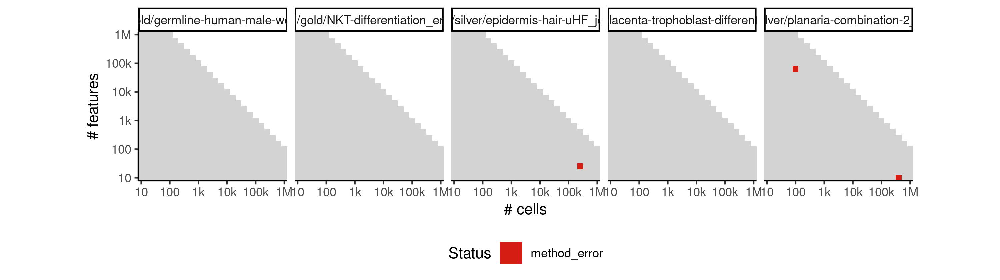

 * Number of instances: 3
 * Dataset ids: scaling_1500, scaling_1585, scaling_1611

Last 10 lines of scaling_1500:
```
/usr/local/lib/R/site-library/RcppEigen/include/Eigen/src/Core/MapBase.h:37:34:   required from ‘class Eigen::MapBase<Eigen::Block<Eigen::Transpose<Eigen::Matrix<double, 1, -1> >, -1, 1, true>, 0>’
/usr/local/lib/R/site-library/RcppEigen/include/Eigen/src/Core/MapBase.h:215:34:   [ skipping 20 instantiation contexts, use -ftemplate-backtrace-limit=0 to disable ]
/usr/local/lib/R/site-library/RcppEigen/include/Eigen/src/Core/ProductEvaluators.h:251:23:   required from ‘static void Eigen::internal::generic_product_impl<Lhs, Rhs, Eigen::DenseShape, Eigen::DenseShape, 6>::evalTo(Dst&, const Lhs&, const Rhs&) [with Dst = Eigen::Matrix<double, 1, 1, 0, 1, 1>; Lhs = Eigen::Product<Eigen::CwiseBinaryOp<Eigen::internal::scalar_product_op<double, double>, const Eigen::CwiseNullaryOp<Eigen::internal::scalar_constant_op<double>, const Eigen::Matrix<double, 1, -1> >, const Eigen::Transpose<Eigen::Matrix<double, -1, 1> > >, Eigen::Matrix<double, -1, -1>, 0>; Rhs = Eigen::Matrix<double, -1, 1>]’
/usr/local/lib/R/site-library/RcppEigen/include/Eigen/src/Core/ProductEvaluators.h:124:75:   required from ‘Eigen::internal::product_evaluator<Eigen::Product<Lhs, Rhs, Option>, ProductTag, LhsShape, RhsShape>::product_evaluator(const XprType&) [with Lhs = Eigen::Product<Eigen::CwiseBinaryOp<Eigen::internal::scalar_product_op<double, double>, const Eigen::CwiseNullaryOp<Eigen::internal::scalar_constant_op<double>, const Eigen::Matrix<double, 1, -1> >, const Eigen::Transpose<Eigen::Matrix<double, -1, 1> > >, Eigen::Matrix<double, -1, -1>, 0>; Rhs = Eigen::Matrix<double, -1, 1>; int Options = 0; int ProductTag = 6; LhsShape = Eigen::DenseShape; RhsShape = Eigen::DenseShape; typename Eigen::internal::traits<typename Eigen::Product<Lhs, Rhs, Option>::Rhs>::Scalar = double; typename Eigen::internal::traits<typename Eigen::Product<Lhs, Rhs, Option>::Lhs>::Scalar = double; Eigen::internal::product_evaluator<Eigen::Product<Lhs, Rhs, Option>, ProductTag, LhsShape, RhsShape>::XprType = Eigen::Product<Eigen::Product<Eigen::CwiseBinaryOp<Eigen::internal::scalar_product_op<double, double>, const Eigen::CwiseNullaryOp<Eigen::internal::scalar_constant_op<double>, const Eigen::Matrix<double, 1, -1> >, const Eigen::Transpose<Eigen::Matrix<double, -1, 1> > >, Eigen::Matrix<double, -1, -1>, 0>, Eigen::Matrix<double, -1, 1>, 0>]’
/usr/local/lib/R/site-library/RcppEigen/include/Eigen/src/Core/ProductEvaluators.h:35:70:   required from ‘Eigen::internal::evaluator<Eigen::Product<Lhs, Rhs, Option> >::evaluator(const XprType&) [with Lhs = Eigen::Product<Eigen::CwiseBinaryOp<Eigen::internal::scalar_product_op<double, double>, const Eigen::CwiseNullaryOp<Eigen::internal::scalar_constant_op<double>, const Eigen::Matrix<double, 1, -1> >, const Eigen::Transpose<Eigen::Matrix<double, -1, 1> > >, Eigen::Matrix<double, -1, -1>, 0>; Rhs = Eigen::Matrix<double, -1, 1>; int Options = 0; Eigen::internal::evaluator<Eigen::Product<Lhs, Rhs, Option> >::XprType = Eigen::Product<Eigen::Product<Eigen::CwiseBinaryOp<Eigen::internal::scalar_product_op<double, double>, const Eigen::CwiseNullaryOp<Eigen::internal::scalar_constant_op<double>, const Eigen::Matrix<double, 1, -1> >, const Eigen::Transpose<Eigen::Matrix<double, -1, 1> > >, Eigen::Matrix<double, -1, -1>, 0>, Eigen::Matrix<double, -1, 1>, 0>]’
/usr/local/lib/R/site-library/RcppEigen/include/Eigen/src/Core/Product.h:132:22:   required from ‘Eigen::internal::dense_product_base<Lhs, Rhs, Option, 6>::operator const Scalar() const [with Lhs = Eigen::Product<Eigen::CwiseBinaryOp<Eigen::internal::scalar_product_op<double, double>, const Eigen::CwiseNullaryOp<Eigen::internal::scalar_constant_op<double>, const Eigen::Matrix<double, 1, -1> >, const Eigen::Transpose<Eigen::Matrix<double, -1, 1> > >, Eigen::Matrix<double, -1, -1>, 0>; Rhs = Eigen::Matrix<double, -1, 1>; int Option = 0; Eigen::internal::dense_product_base<Lhs, Rhs, Option, 6>::Scalar = double]’
/usr/local/lib/R/site-library/StanHeaders/include/src/stan/mcmc/hmc/hamiltonians/dense_e_metric.hpp:24:60:   required from ‘double stan::mcmc::dense_e_metric<Model, BaseRNG>::T(stan::mcmc::dense_e_point&) [with Model = modelf6fd5305fd92_ouija_namespace::modelf6fd5305fd92_ouija; BaseRNG = boost::random::additive_combine_engine<boost::random::linear_congruential_engine<unsigned int, 40014u, 0u, 2147483563u>, boost::random::linear_congruential_engine<unsigned int, 40692u, 0u, 2147483399u> >]’
filef6fd70620922.cpp:1303:1:   required from here
/usr/local/lib/R/site-library/RcppEigen/include/Eigen/src/Core/DenseCoeffsBase.h:55:30: warning: ignoring attributes on template argument ‘Eigen::internal::packet_traits<double>::type {aka __vector(2) double}’ [-Wignored-attributes]
SAMPLING FOR MODEL 'ouija' NOW (CHAIN 1).
```

### ERROR CLUSTER METHOD_ERROR -- 18


 * Number of instances: 11
 * Dataset ids: scaling_1516, scaling_1541, scaling_1542, scaling_1560, scaling_1579, scaling_1580, scaling_1596, scaling_1598, scaling_1617, scaling_1618, scaling_1619

Last 10 lines of scaling_1516:
```
/usr/local/lib/R/site-library/RcppEigen/include/Eigen/src/Core/ProductEvaluators.h:251:23:   required from ‘static void Eigen::internal::generic_product_impl<Lhs, Rhs, Eigen::DenseShape, Eigen::DenseShape, 6>::evalTo(Dst&, const Lhs&, const Rhs&) [with Dst = Eigen::Matrix<double, 1, 1, 0, 1, 1>; Lhs = Eigen::Product<Eigen::CwiseBinaryOp<Eigen::internal::scalar_product_op<double, double>, const Eigen::CwiseNullaryOp<Eigen::internal::scalar_constant_op<double>, const Eigen::Matrix<double, 1, -1> >, const Eigen::Transpose<Eigen::Matrix<double, -1, 1> > >, Eigen::Matrix<double, -1, -1>, 0>; Rhs = Eigen::Matrix<double, -1, 1>]’
/usr/local/lib/R/site-library/RcppEigen/include/Eigen/src/Core/ProductEvaluators.h:124:75:   required from ‘Eigen::internal::product_evaluator<Eigen::Product<Lhs, Rhs, Option>, ProductTag, LhsShape, RhsShape>::product_evaluator(const XprType&) [with Lhs = Eigen::Product<Eigen::CwiseBinaryOp<Eigen::internal::scalar_product_op<double, double>, const Eigen::CwiseNullaryOp<Eigen::internal::scalar_constant_op<double>, const Eigen::Matrix<double, 1, -1> >, const Eigen::Transpose<Eigen::Matrix<double, -1, 1> > >, Eigen::Matrix<double, -1, -1>, 0>; Rhs = Eigen::Matrix<double, -1, 1>; int Options = 0; int ProductTag = 6; LhsShape = Eigen::DenseShape; RhsShape = Eigen::DenseShape; typename Eigen::internal::traits<typename Eigen::Product<Lhs, Rhs, Option>::Rhs>::Scalar = double; typename Eigen::internal::traits<typename Eigen::Product<Lhs, Rhs, Option>::Lhs>::Scalar = double; Eigen::internal::product_evaluator<Eigen::Product<Lhs, Rhs, Option>, ProductTag, LhsShape, RhsShape>::XprType = Eigen::Product<Eigen::Product<Eigen::CwiseBinaryOp<Eigen::internal::scalar_product_op<double, double>, const Eigen::CwiseNullaryOp<Eigen::internal::scalar_constant_op<double>, const Eigen::Matrix<double, 1, -1> >, const Eigen::Transpose<Eigen::Matrix<double, -1, 1> > >, Eigen::Matrix<double, -1, -1>, 0>, Eigen::Matrix<double, -1, 1>, 0>]’
/usr/local/lib/R/site-library/RcppEigen/include/Eigen/src/Core/ProductEvaluators.h:35:70:   required from ‘Eigen::internal::evaluator<Eigen::Product<Lhs, Rhs, Option> >::evaluator(const XprType&) [with Lhs = Eigen::Product<Eigen::CwiseBinaryOp<Eigen::internal::scalar_product_op<double, double>, const Eigen::CwiseNullaryOp<Eigen::internal::scalar_constant_op<double>, const Eigen::Matrix<double, 1, -1> >, const Eigen::Transpose<Eigen::Matrix<double, -1, 1> > >, Eigen::Matrix<double, -1, -1>, 0>; Rhs = Eigen::Matrix<double, -1, 1>; int Options = 0; Eigen::internal::evaluator<Eigen::Product<Lhs, Rhs, Option> >::XprType = Eigen::Product<Eigen::Product<Eigen::CwiseBinaryOp<Eigen::internal::scalar_product_op<double, double>, const Eigen::CwiseNullaryOp<Eigen::internal::scalar_constant_op<double>, const Eigen::Matrix<double, 1, -1> >, const Eigen::Transpose<Eigen::Matrix<double, -1, 1> > >, Eigen::Matrix<double, -1, -1>, 0>, Eigen::Matrix<double, -1, 1>, 0>]’
/usr/local/lib/R/site-library/RcppEigen/include/Eigen/src/Core/Product.h:132:22:   required from ‘Eigen::internal::dense_product_base<Lhs, Rhs, Option, 6>::operator const Scalar() const [with Lhs = Eigen::Product<Eigen::CwiseBinaryOp<Eigen::internal::scalar_product_op<double, double>, const Eigen::CwiseNullaryOp<Eigen::internal::scalar_constant_op<double>, const Eigen::Matrix<double, 1, -1> >, const Eigen::Transpose<Eigen::Matrix<double, -1, 1> > >, Eigen::Matrix<double, -1, -1>, 0>; Rhs = Eigen::Matrix<double, -1, 1>; int Option = 0; Eigen::internal::dense_product_base<Lhs, Rhs, Option, 6>::Scalar = double]’
/usr/local/lib/R/site-library/StanHeaders/include/src/stan/mcmc/hmc/hamiltonians/dense_e_metric.hpp:24:60:   required from ‘double stan::mcmc::dense_e_metric<Model, BaseRNG>::T(stan::mcmc::dense_e_point&) [with Model = model1ffe317fc1bb4_ouija_namespace::model1ffe317fc1bb4_ouija; BaseRNG = boost::random::additive_combine_engine<boost::random::linear_congruential_engine<unsigned int, 40014u, 0u, 2147483563u>, boost::random::linear_congruential_engine<unsigned int, 40692u, 0u, 2147483399u> >]’
file1ffe376f2c48f.cpp:1303:1:   required from here
/usr/local/lib/R/site-library/RcppEigen/include/Eigen/src/Core/DenseCoeffsBase.h:55:30: warning: ignoring attributes on template argument ‘Eigen::internal::packet_traits<double>::type {aka __vector(2) double}’ [-Wignored-attributes]
SAMPLING FOR MODEL 'ouija' NOW (CHAIN 1).
Error: memory exhausted (limit reached?)
Execution halted
```

### ERROR CLUSTER METHOD_ERROR -- 19
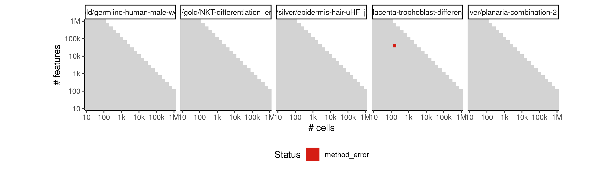

 * Number of instances: 1
 * Dataset ids: scaling_1520

Last 10 lines of scaling_1520:
```
/usr/local/lib/R/site-library/RcppEigen/include/Eigen/src/Core/MapBase.h:37:34:   required from ‘class Eigen::MapBase<Eigen::Block<Eigen::Transpose<Eigen::Matrix<double, 1, -1> >, -1, 1, true>, 0>’
/usr/local/lib/R/site-library/RcppEigen/include/Eigen/src/Core/MapBase.h:215:34:   [ skipping 20 instantiation contexts, use -ftemplate-backtrace-limit=0 to disable ]
/usr/local/lib/R/site-library/RcppEigen/include/Eigen/src/Core/ProductEvaluators.h:251:23:   required from ‘static void Eigen::internal::generic_product_impl<Lhs, Rhs, Eigen::DenseShape, Eigen::DenseShape, 6>::evalTo(Dst&, const Lhs&, const Rhs&) [with Dst = Eigen::Matrix<double, 1, 1, 0, 1, 1>; Lhs = Eigen::Product<Eigen::CwiseBinaryOp<Eigen::internal::scalar_product_op<double, double>, const Eigen::CwiseNullaryOp<Eigen::internal::scalar_constant_op<double>, const Eigen::Matrix<double, 1, -1> >, const Eigen::Transpose<Eigen::Matrix<double, -1, 1> > >, Eigen::Matrix<double, -1, -1>, 0>; Rhs = Eigen::Matrix<double, -1, 1>]’
/usr/local/lib/R/site-library/RcppEigen/include/Eigen/src/Core/ProductEvaluators.h:124:75:   required from ‘Eigen::internal::product_evaluator<Eigen::Product<Lhs, Rhs, Option>, ProductTag, LhsShape, RhsShape>::product_evaluator(const XprType&) [with Lhs = Eigen::Product<Eigen::CwiseBinaryOp<Eigen::internal::scalar_product_op<double, double>, const Eigen::CwiseNullaryOp<Eigen::internal::scalar_constant_op<double>, const Eigen::Matrix<double, 1, -1> >, const Eigen::Transpose<Eigen::Matrix<double, -1, 1> > >, Eigen::Matrix<double, -1, -1>, 0>; Rhs = Eigen::Matrix<double, -1, 1>; int Options = 0; int ProductTag = 6; LhsShape = Eigen::DenseShape; RhsShape = Eigen::DenseShape; typename Eigen::internal::traits<typename Eigen::Product<Lhs, Rhs, Option>::Rhs>::Scalar = double; typename Eigen::internal::traits<typename Eigen::Product<Lhs, Rhs, Option>::Lhs>::Scalar = double; Eigen::internal::product_evaluator<Eigen::Product<Lhs, Rhs, Option>, ProductTag, LhsShape, RhsShape>::XprType = Eigen::Product<Eigen::Product<Eigen::CwiseBinaryOp<Eigen::internal::scalar_product_op<double, double>, const Eigen::CwiseNullaryOp<Eigen::internal::scalar_constant_op<double>, const Eigen::Matrix<double, 1, -1> >, const Eigen::Transpose<Eigen::Matrix<double, -1, 1> > >, Eigen::Matrix<double, -1, -1>, 0>, Eigen::Matrix<double, -1, 1>, 0>]’
/usr/local/lib/R/site-library/RcppEigen/include/Eigen/src/Core/ProductEvaluators.h:35:70:   required from ‘Eigen::internal::evaluator<Eigen::Product<Lhs, Rhs, Option> >::evaluator(const XprType&) [with Lhs = Eigen::Product<Eigen::CwiseBinaryOp<Eigen::internal::scalar_product_op<double, double>, const Eigen::CwiseNullaryOp<Eigen::internal::scalar_constant_op<double>, const Eigen::Matrix<double, 1, -1> >, const Eigen::Transpose<Eigen::Matrix<double, -1, 1> > >, Eigen::Matrix<double, -1, -1>, 0>; Rhs = Eigen::Matrix<double, -1, 1>; int Options = 0; Eigen::internal::evaluator<Eigen::Product<Lhs, Rhs, Option> >::XprType = Eigen::Product<Eigen::Product<Eigen::CwiseBinaryOp<Eigen::internal::scalar_product_op<double, double>, const Eigen::CwiseNullaryOp<Eigen::internal::scalar_constant_op<double>, const Eigen::Matrix<double, 1, -1> >, const Eigen::Transpose<Eigen::Matrix<double, -1, 1> > >, Eigen::Matrix<double, -1, -1>, 0>, Eigen::Matrix<double, -1, 1>, 0>]’
/usr/local/lib/R/site-library/RcppEigen/include/Eigen/src/Core/Product.h:132:22:   required from ‘Eigen::internal::dense_product_base<Lhs, Rhs, Option, 6>::operator const Scalar() const [with Lhs = Eigen::Product<Eigen::CwiseBinaryOp<Eigen::internal::scalar_product_op<double, double>, const Eigen::CwiseNullaryOp<Eigen::internal::scalar_constant_op<double>, const Eigen::Matrix<double, 1, -1> >, const Eigen::Transpose<Eigen::Matrix<double, -1, 1> > >, Eigen::Matrix<double, -1, -1>, 0>; Rhs = Eigen::Matrix<double, -1, 1>; int Option = 0; Eigen::internal::dense_product_base<Lhs, Rhs, Option, 6>::Scalar = double]’
/usr/local/lib/R/site-library/StanHeaders/include/src/stan/mcmc/hmc/hamiltonians/dense_e_metric.hpp:24:60:   required from ‘double stan::mcmc::dense_e_metric<Model, BaseRNG>::T(stan::mcmc::dense_e_point&) [with Model = model156c79dfcfa5_ouija_namespace::model156c79dfcfa5_ouija; BaseRNG = boost::random::additive_combine_engine<boost::random::linear_congruential_engine<unsigned int, 40014u, 0u, 2147483563u>, boost::random::linear_congruential_engine<unsigned int, 40692u, 0u, 2147483399u> >]’
file156c4ed5a1f4.cpp:1303:1:   required from here
/usr/local/lib/R/site-library/RcppEigen/include/Eigen/src/Core/DenseCoeffsBase.h:55:30: warning: ignoring attributes on template argument ‘Eigen::internal::packet_traits<double>::type {aka __vector(2) double}’ [-Wignored-attributes]
SAMPLING FOR MODEL 'ouija' NOW (CHAIN 1).
```

### ERROR CLUSTER METHOD_ERROR -- 20
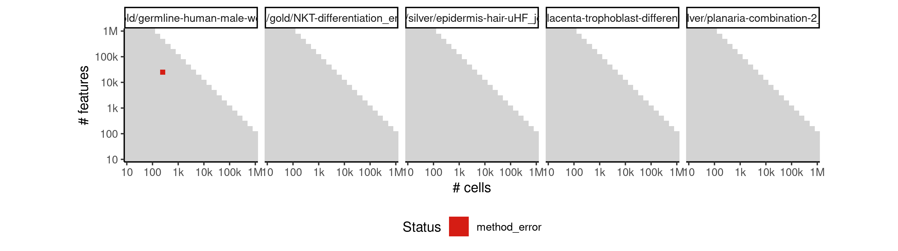

 * Number of instances: 1
 * Dataset ids: scaling_1536

Last 10 lines of scaling_1536:
```
/usr/local/lib/R/site-library/RcppEigen/include/Eigen/src/Core/MapBase.h:37:34:   required from ‘class Eigen::MapBase<Eigen::Block<Eigen::Transpose<Eigen::Matrix<double, 1, -1> >, -1, 1, true>, 0>’
/usr/local/lib/R/site-library/RcppEigen/include/Eigen/src/Core/MapBase.h:215:34:   [ skipping 20 instantiation contexts, use -ftemplate-backtrace-limit=0 to disable ]
/usr/local/lib/R/site-library/RcppEigen/include/Eigen/src/Core/ProductEvaluators.h:251:23:   required from ‘static void Eigen::internal::generic_product_impl<Lhs, Rhs, Eigen::DenseShape, Eigen::DenseShape, 6>::evalTo(Dst&, const Lhs&, const Rhs&) [with Dst = Eigen::Matrix<double, 1, 1, 0, 1, 1>; Lhs = Eigen::Product<Eigen::CwiseBinaryOp<Eigen::internal::scalar_product_op<double, double>, const Eigen::CwiseNullaryOp<Eigen::internal::scalar_constant_op<double>, const Eigen::Matrix<double, 1, -1> >, const Eigen::Transpose<Eigen::Matrix<double, -1, 1> > >, Eigen::Matrix<double, -1, -1>, 0>; Rhs = Eigen::Matrix<double, -1, 1>]’
/usr/local/lib/R/site-library/RcppEigen/include/Eigen/src/Core/ProductEvaluators.h:124:75:   required from ‘Eigen::internal::product_evaluator<Eigen::Product<Lhs, Rhs, Option>, ProductTag, LhsShape, RhsShape>::product_evaluator(const XprType&) [with Lhs = Eigen::Product<Eigen::CwiseBinaryOp<Eigen::internal::scalar_product_op<double, double>, const Eigen::CwiseNullaryOp<Eigen::internal::scalar_constant_op<double>, const Eigen::Matrix<double, 1, -1> >, const Eigen::Transpose<Eigen::Matrix<double, -1, 1> > >, Eigen::Matrix<double, -1, -1>, 0>; Rhs = Eigen::Matrix<double, -1, 1>; int Options = 0; int ProductTag = 6; LhsShape = Eigen::DenseShape; RhsShape = Eigen::DenseShape; typename Eigen::internal::traits<typename Eigen::Product<Lhs, Rhs, Option>::Rhs>::Scalar = double; typename Eigen::internal::traits<typename Eigen::Product<Lhs, Rhs, Option>::Lhs>::Scalar = double; Eigen::internal::product_evaluator<Eigen::Product<Lhs, Rhs, Option>, ProductTag, LhsShape, RhsShape>::XprType = Eigen::Product<Eigen::Product<Eigen::CwiseBinaryOp<Eigen::internal::scalar_product_op<double, double>, const Eigen::CwiseNullaryOp<Eigen::internal::scalar_constant_op<double>, const Eigen::Matrix<double, 1, -1> >, const Eigen::Transpose<Eigen::Matrix<double, -1, 1> > >, Eigen::Matrix<double, -1, -1>, 0>, Eigen::Matrix<double, -1, 1>, 0>]’
/usr/local/lib/R/site-library/RcppEigen/include/Eigen/src/Core/ProductEvaluators.h:35:70:   required from ‘Eigen::internal::evaluator<Eigen::Product<Lhs, Rhs, Option> >::evaluator(const XprType&) [with Lhs = Eigen::Product<Eigen::CwiseBinaryOp<Eigen::internal::scalar_product_op<double, double>, const Eigen::CwiseNullaryOp<Eigen::internal::scalar_constant_op<double>, const Eigen::Matrix<double, 1, -1> >, const Eigen::Transpose<Eigen::Matrix<double, -1, 1> > >, Eigen::Matrix<double, -1, -1>, 0>; Rhs = Eigen::Matrix<double, -1, 1>; int Options = 0; Eigen::internal::evaluator<Eigen::Product<Lhs, Rhs, Option> >::XprType = Eigen::Product<Eigen::Product<Eigen::CwiseBinaryOp<Eigen::internal::scalar_product_op<double, double>, const Eigen::CwiseNullaryOp<Eigen::internal::scalar_constant_op<double>, const Eigen::Matrix<double, 1, -1> >, const Eigen::Transpose<Eigen::Matrix<double, -1, 1> > >, Eigen::Matrix<double, -1, -1>, 0>, Eigen::Matrix<double, -1, 1>, 0>]’
/usr/local/lib/R/site-library/RcppEigen/include/Eigen/src/Core/Product.h:132:22:   required from ‘Eigen::internal::dense_product_base<Lhs, Rhs, Option, 6>::operator const Scalar() const [with Lhs = Eigen::Product<Eigen::CwiseBinaryOp<Eigen::internal::scalar_product_op<double, double>, const Eigen::CwiseNullaryOp<Eigen::internal::scalar_constant_op<double>, const Eigen::Matrix<double, 1, -1> >, const Eigen::Transpose<Eigen::Matrix<double, -1, 1> > >, Eigen::Matrix<double, -1, -1>, 0>; Rhs = Eigen::Matrix<double, -1, 1>; int Option = 0; Eigen::internal::dense_product_base<Lhs, Rhs, Option, 6>::Scalar = double]’
/usr/local/lib/R/site-library/StanHeaders/include/src/stan/mcmc/hmc/hamiltonians/dense_e_metric.hpp:24:60:   required from ‘double stan::mcmc::dense_e_metric<Model, BaseRNG>::T(stan::mcmc::dense_e_point&) [with Model = modelbae22c4c7d9e_ouija_namespace::modelbae22c4c7d9e_ouija; BaseRNG = boost::random::additive_combine_engine<boost::random::linear_congruential_engine<unsigned int, 40014u, 0u, 2147483563u>, boost::random::linear_congruential_engine<unsigned int, 40692u, 0u, 2147483399u> >]’
filebae24e0674f6.cpp:1303:1:   required from here
/usr/local/lib/R/site-library/RcppEigen/include/Eigen/src/Core/DenseCoeffsBase.h:55:30: warning: ignoring attributes on template argument ‘Eigen::internal::packet_traits<double>::type {aka __vector(2) double}’ [-Wignored-attributes]
SAMPLING FOR MODEL 'ouija' NOW (CHAIN 1).
```

### ERROR CLUSTER METHOD_ERROR -- 21


 * Number of instances: 1
 * Dataset ids: scaling_1568

Last 10 lines of scaling_1568:
```
/usr/local/lib/R/site-library/RcppEigen/include/Eigen/src/Core/MapBase.h:37:34:   required from ‘class Eigen::MapBase<Eigen::Block<Eigen::Transpose<Eigen::Matrix<double, 1, -1> >, -1, 1, true>, 0>’
/usr/local/lib/R/site-library/RcppEigen/include/Eigen/src/Core/MapBase.h:215:34:   [ skipping 20 instantiation contexts, use -ftemplate-backtrace-limit=0 to disable ]
/usr/local/lib/R/site-library/RcppEigen/include/Eigen/src/Core/ProductEvaluators.h:251:23:   required from ‘static void Eigen::internal::generic_product_impl<Lhs, Rhs, Eigen::DenseShape, Eigen::DenseShape, 6>::evalTo(Dst&, const Lhs&, const Rhs&) [with Dst = Eigen::Matrix<double, 1, 1, 0, 1, 1>; Lhs = Eigen::Product<Eigen::CwiseBinaryOp<Eigen::internal::scalar_product_op<double, double>, const Eigen::CwiseNullaryOp<Eigen::internal::scalar_constant_op<double>, const Eigen::Matrix<double, 1, -1> >, const Eigen::Transpose<Eigen::Matrix<double, -1, 1> > >, Eigen::Matrix<double, -1, -1>, 0>; Rhs = Eigen::Matrix<double, -1, 1>]’
/usr/local/lib/R/site-library/RcppEigen/include/Eigen/src/Core/ProductEvaluators.h:124:75:   required from ‘Eigen::internal::product_evaluator<Eigen::Product<Lhs, Rhs, Option>, ProductTag, LhsShape, RhsShape>::product_evaluator(const XprType&) [with Lhs = Eigen::Product<Eigen::CwiseBinaryOp<Eigen::internal::scalar_product_op<double, double>, const Eigen::CwiseNullaryOp<Eigen::internal::scalar_constant_op<double>, const Eigen::Matrix<double, 1, -1> >, const Eigen::Transpose<Eigen::Matrix<double, -1, 1> > >, Eigen::Matrix<double, -1, -1>, 0>; Rhs = Eigen::Matrix<double, -1, 1>; int Options = 0; int ProductTag = 6; LhsShape = Eigen::DenseShape; RhsShape = Eigen::DenseShape; typename Eigen::internal::traits<typename Eigen::Product<Lhs, Rhs, Option>::Rhs>::Scalar = double; typename Eigen::internal::traits<typename Eigen::Product<Lhs, Rhs, Option>::Lhs>::Scalar = double; Eigen::internal::product_evaluator<Eigen::Product<Lhs, Rhs, Option>, ProductTag, LhsShape, RhsShape>::XprType = Eigen::Product<Eigen::Product<Eigen::CwiseBinaryOp<Eigen::internal::scalar_product_op<double, double>, const Eigen::CwiseNullaryOp<Eigen::internal::scalar_constant_op<double>, const Eigen::Matrix<double, 1, -1> >, const Eigen::Transpose<Eigen::Matrix<double, -1, 1> > >, Eigen::Matrix<double, -1, -1>, 0>, Eigen::Matrix<double, -1, 1>, 0>]’
/usr/local/lib/R/site-library/RcppEigen/include/Eigen/src/Core/ProductEvaluators.h:35:70:   required from ‘Eigen::internal::evaluator<Eigen::Product<Lhs, Rhs, Option> >::evaluator(const XprType&) [with Lhs = Eigen::Product<Eigen::CwiseBinaryOp<Eigen::internal::scalar_product_op<double, double>, const Eigen::CwiseNullaryOp<Eigen::internal::scalar_constant_op<double>, const Eigen::Matrix<double, 1, -1> >, const Eigen::Transpose<Eigen::Matrix<double, -1, 1> > >, Eigen::Matrix<double, -1, -1>, 0>; Rhs = Eigen::Matrix<double, -1, 1>; int Options = 0; Eigen::internal::evaluator<Eigen::Product<Lhs, Rhs, Option> >::XprType = Eigen::Product<Eigen::Product<Eigen::CwiseBinaryOp<Eigen::internal::scalar_product_op<double, double>, const Eigen::CwiseNullaryOp<Eigen::internal::scalar_constant_op<double>, const Eigen::Matrix<double, 1, -1> >, const Eigen::Transpose<Eigen::Matrix<double, -1, 1> > >, Eigen::Matrix<double, -1, -1>, 0>, Eigen::Matrix<double, -1, 1>, 0>]’
/usr/local/lib/R/site-library/RcppEigen/include/Eigen/src/Core/Product.h:132:22:   required from ‘Eigen::internal::dense_product_base<Lhs, Rhs, Option, 6>::operator const Scalar() const [with Lhs = Eigen::Product<Eigen::CwiseBinaryOp<Eigen::internal::scalar_product_op<double, double>, const Eigen::CwiseNullaryOp<Eigen::internal::scalar_constant_op<double>, const Eigen::Matrix<double, 1, -1> >, const Eigen::Transpose<Eigen::Matrix<double, -1, 1> > >, Eigen::Matrix<double, -1, -1>, 0>; Rhs = Eigen::Matrix<double, -1, 1>; int Option = 0; Eigen::internal::dense_product_base<Lhs, Rhs, Option, 6>::Scalar = double]’
/usr/local/lib/R/site-library/StanHeaders/include/src/stan/mcmc/hmc/hamiltonians/dense_e_metric.hpp:24:60:   required from ‘double stan::mcmc::dense_e_metric<Model, BaseRNG>::T(stan::mcmc::dense_e_point&) [with Model = modelc4cc2c2e1ef5_ouija_namespace::modelc4cc2c2e1ef5_ouija; BaseRNG = boost::random::additive_combine_engine<boost::random::linear_congruential_engine<unsigned int, 40014u, 0u, 2147483563u>, boost::random::linear_congruential_engine<unsigned int, 40692u, 0u, 2147483399u> >]’
filec4cc1dc510fa.cpp:1303:1:   required from here
/usr/local/lib/R/site-library/RcppEigen/include/Eigen/src/Core/DenseCoeffsBase.h:55:30: warning: ignoring attributes on template argument ‘Eigen::internal::packet_traits<double>::type {aka __vector(2) double}’ [-Wignored-attributes]
SAMPLING FOR MODEL 'ouija' NOW (CHAIN 1).
```

### ERROR CLUSTER METHOD_ERROR -- 22
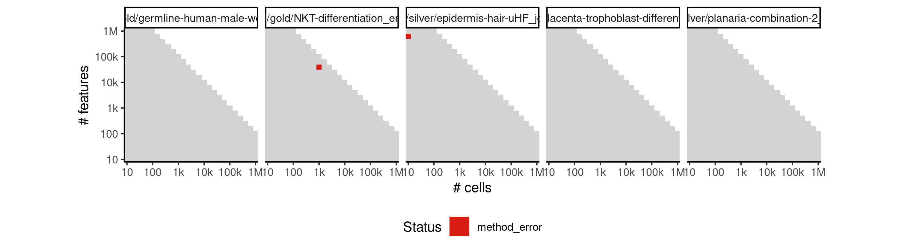

 * Number of instances: 2
 * Dataset ids: scaling_1569, scaling_2011

Last 10 lines of scaling_1569:
```
SAMPLING FOR MODEL 'ouija' NOW (CHAIN 1).
[1] " *** caught segfault ***"                         
[2] "address 0x7fff27d36ff8, cause 'memory not mapped'"
[3] "Error : memory exhausted (limit reached?)"        
error occurred during calling the sampler; sampling not done
Stan model 'ouija' does not contain samples.
Error in attr(data, "mcpar") <- c(start, end, thin) : 
  attempt to set an attribute on NULL
Calls: %>% ... eval -> <Anonymous> -> posterior.mode -> is.mcmc -> mcmc
Execution halted
```

### ERROR CLUSTER METHOD_ERROR -- 23
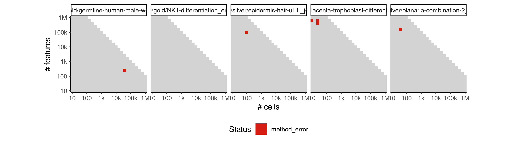

 * Number of instances: 6
 * Dataset ids: scaling_1588, scaling_1610, scaling_1642, scaling_1674, scaling_1693, scaling_1865

Last 10 lines of scaling_1588:
```
                 from /usr/local/lib/R/site-library/StanHeaders/include/stan/math/rev/core.hpp:14,
                 from /usr/local/lib/R/site-library/StanHeaders/include/stan/math/rev/mat.hpp:4,
                 from /usr/local/lib/R/site-library/StanHeaders/include/stan/math.hpp:4,
                 from /usr/local/lib/R/site-library/StanHeaders/include/src/stan/model/model_header.hpp:4,
                 from filec9bdeef87c
Calls: <Anonymous> ... stan_model -> cxxfunctionplus -> cxxfunction -> compileCode
In addition: Warning message:
In system(cmd, intern = !verbose) :
  running command '/usr/local/lib/R/bin/R CMD SHLIB filec9bdeef87cb.cpp 2> filec9bdeef87cb.cpp.err.txt' had status 1
Execution halted
```

### ERROR CLUSTER METHOD_ERROR -- 24
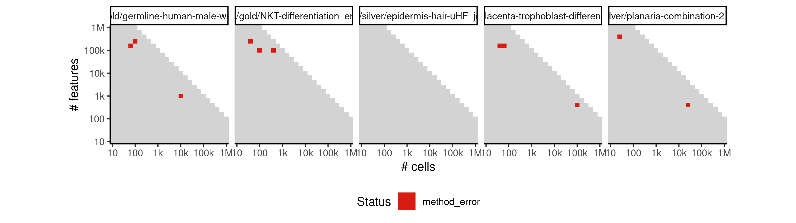

 * Number of instances: 11
 * Dataset ids: scaling_1591, scaling_1629, scaling_1639, scaling_1650, scaling_1652, scaling_1695, scaling_1715, scaling_1729, scaling_1894, scaling_2010, scaling_2031

Last 10 lines of scaling_1591:
```
                 from /usr/local/lib/R/site-library/StanHeaders/include/stan/math/rev/core.hpp:14,
                 from /usr/local/lib/R/site-library/StanHeaders/include/stan/math/rev/mat.hpp:4,
                 from /usr/local/lib/R/site-library/StanHeaders/include/stan/math.hpp:4,
                 from /usr/local/lib/R/site-library/StanHeaders/include/src/stan/model/model_header.hpp:4,
                 from file1aa82ab551
Calls: <Anonymous> ... stan_model -> cxxfunctionplus -> cxxfunction -> compileCode
In addition: Warning message:
In system(cmd, intern = !verbose) :
  running command '/usr/local/lib/R/bin/R CMD SHLIB file1aa82ab55114.cpp 2> file1aa82ab55114.cpp.err.txt' had status 1
Execution halted
```

### ERROR CLUSTER METHOD_ERROR -- 25


 * Number of instances: 1
 * Dataset ids: scaling_1602

Last 10 lines of scaling_1602:
```
/usr/local/lib/R/site-library/RcppEigen/include/Eigen/src/Core/MapBase.h:37:34:   required from ‘class Eigen::MapBase<Eigen::Block<Eigen::Transpose<Eigen::Matrix<double, 1, -1> >, -1, 1, true>, 0>’
/usr/local/lib/R/site-library/RcppEigen/include/Eigen/src/Core/MapBase.h:215:34:   [ skipping 20 instantiation contexts, use -ftemplate-backtrace-limit=0 to disable ]
/usr/local/lib/R/site-library/RcppEigen/include/Eigen/src/Core/ProductEvaluators.h:251:23:   required from ‘static void Eigen::internal::generic_product_impl<Lhs, Rhs, Eigen::DenseShape, Eigen::DenseShape, 6>::evalTo(Dst&, const Lhs&, const Rhs&) [with Dst = Eigen::Matrix<double, 1, 1, 0, 1, 1>; Lhs = Eigen::Product<Eigen::CwiseBinaryOp<Eigen::internal::scalar_product_op<double, double>, const Eigen::CwiseNullaryOp<Eigen::internal::scalar_constant_op<double>, const Eigen::Matrix<double, 1, -1> >, const Eigen::Transpose<Eigen::Matrix<double, -1, 1> > >, Eigen::Matrix<double, -1, -1>, 0>; Rhs = Eigen::Matrix<double, -1, 1>]’
/usr/local/lib/R/site-library/RcppEigen/include/Eigen/src/Core/ProductEvaluators.h:124:75:   required from ‘Eigen::internal::product_evaluator<Eigen::Product<Lhs, Rhs, Option>, ProductTag, LhsShape, RhsShape>::product_evaluator(const XprType&) [with Lhs = Eigen::Product<Eigen::CwiseBinaryOp<Eigen::internal::scalar_product_op<double, double>, const Eigen::CwiseNullaryOp<Eigen::internal::scalar_constant_op<double>, const Eigen::Matrix<double, 1, -1> >, const Eigen::Transpose<Eigen::Matrix<double, -1, 1> > >, Eigen::Matrix<double, -1, -1>, 0>; Rhs = Eigen::Matrix<double, -1, 1>; int Options = 0; int ProductTag = 6; LhsShape = Eigen::DenseShape; RhsShape = Eigen::DenseShape; typename Eigen::internal::traits<typename Eigen::Product<Lhs, Rhs, Option>::Rhs>::Scalar = double; typename Eigen::internal::traits<typename Eigen::Product<Lhs, Rhs, Option>::Lhs>::Scalar = double; Eigen::internal::product_evaluator<Eigen::Product<Lhs, Rhs, Option>, ProductTag, LhsShape, RhsShape>::XprType = Eigen::Product<Eigen::Product<Eigen::CwiseBinaryOp<Eigen::internal::scalar_product_op<double, double>, const Eigen::CwiseNullaryOp<Eigen::internal::scalar_constant_op<double>, const Eigen::Matrix<double, 1, -1> >, const Eigen::Transpose<Eigen::Matrix<double, -1, 1> > >, Eigen::Matrix<double, -1, -1>, 0>, Eigen::Matrix<double, -1, 1>, 0>]’
/usr/local/lib/R/site-library/RcppEigen/include/Eigen/src/Core/ProductEvaluators.h:35:70:   required from ‘Eigen::internal::evaluator<Eigen::Product<Lhs, Rhs, Option> >::evaluator(const XprType&) [with Lhs = Eigen::Product<Eigen::CwiseBinaryOp<Eigen::internal::scalar_product_op<double, double>, const Eigen::CwiseNullaryOp<Eigen::internal::scalar_constant_op<double>, const Eigen::Matrix<double, 1, -1> >, const Eigen::Transpose<Eigen::Matrix<double, -1, 1> > >, Eigen::Matrix<double, -1, -1>, 0>; Rhs = Eigen::Matrix<double, -1, 1>; int Options = 0; Eigen::internal::evaluator<Eigen::Product<Lhs, Rhs, Option> >::XprType = Eigen::Product<Eigen::Product<Eigen::CwiseBinaryOp<Eigen::internal::scalar_product_op<double, double>, const Eigen::CwiseNullaryOp<Eigen::internal::scalar_constant_op<double>, const Eigen::Matrix<double, 1, -1> >, const Eigen::Transpose<Eigen::Matrix<double, -1, 1> > >, Eigen::Matrix<double, -1, -1>, 0>, Eigen::Matrix<double, -1, 1>, 0>]’
/usr/local/lib/R/site-library/RcppEigen/include/Eigen/src/Core/Product.h:132:22:   required from ‘Eigen::internal::dense_product_base<Lhs, Rhs, Option, 6>::operator const Scalar() const [with Lhs = Eigen::Product<Eigen::CwiseBinaryOp<Eigen::internal::scalar_product_op<double, double>, const Eigen::CwiseNullaryOp<Eigen::internal::scalar_constant_op<double>, const Eigen::Matrix<double, 1, -1> >, const Eigen::Transpose<Eigen::Matrix<double, -1, 1> > >, Eigen::Matrix<double, -1, -1>, 0>; Rhs = Eigen::Matrix<double, -1, 1>; int Option = 0; Eigen::internal::dense_product_base<Lhs, Rhs, Option, 6>::Scalar = double]’
/usr/local/lib/R/site-library/StanHeaders/include/src/stan/mcmc/hmc/hamiltonians/dense_e_metric.hpp:24:60:   required from ‘double stan::mcmc::dense_e_metric<Model, BaseRNG>::T(stan::mcmc::dense_e_point&) [with Model = modelccd7fa9ee1b_ouija_namespace::modelccd7fa9ee1b_ouija; BaseRNG = boost::random::additive_combine_engine<boost::random::linear_congruential_engine<unsigned int, 40014u, 0u, 2147483563u>, boost::random::linear_congruential_engine<unsigned int, 40692u, 0u, 2147483399u> >]’
fileccd7439d8755.cpp:1303:1:   required from here
/usr/local/lib/R/site-library/RcppEigen/include/Eigen/src/Core/DenseCoeffsBase.h:55:30: warning: ignoring attributes on template argument ‘Eigen::internal::packet_traits<double>::type {aka __vector(2) double}’ [-Wignored-attributes]
SAMPLING FOR MODEL 'ouija' NOW (CHAIN 1).
```

### ERROR CLUSTER METHOD_ERROR -- 26
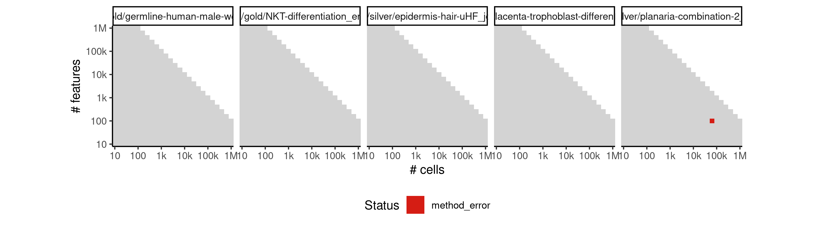

 * Number of instances: 1
 * Dataset ids: scaling_1621

Last 10 lines of scaling_1621:
```
/usr/local/lib/R/site-library/RcppEigen/include/Eigen/src/Core/MapBase.h:37:34:   required from ‘class Eigen::MapBase<Eigen::Block<Eigen::Transpose<Eigen::Matrix<double, 1, -1> >, -1, 1, true>, 0>’
/usr/local/lib/R/site-library/RcppEigen/include/Eigen/src/Core/MapBase.h:215:34:   [ skipping 20 instantiation contexts, use -ftemplate-backtrace-limit=0 to disable ]
/usr/local/lib/R/site-library/RcppEigen/include/Eigen/src/Core/ProductEvaluators.h:251:23:   required from ‘static void Eigen::internal::generic_product_impl<Lhs, Rhs, Eigen::DenseShape, Eigen::DenseShape, 6>::evalTo(Dst&, const Lhs&, const Rhs&) [with Dst = Eigen::Matrix<double, 1, 1, 0, 1, 1>; Lhs = Eigen::Product<Eigen::CwiseBinaryOp<Eigen::internal::scalar_product_op<double, double>, const Eigen::CwiseNullaryOp<Eigen::internal::scalar_constant_op<double>, const Eigen::Matrix<double, 1, -1> >, const Eigen::Transpose<Eigen::Matrix<double, -1, 1> > >, Eigen::Matrix<double, -1, -1>, 0>; Rhs = Eigen::Matrix<double, -1, 1>]’
/usr/local/lib/R/site-library/RcppEigen/include/Eigen/src/Core/ProductEvaluators.h:124:75:   required from ‘Eigen::internal::product_evaluator<Eigen::Product<Lhs, Rhs, Option>, ProductTag, LhsShape, RhsShape>::product_evaluator(const XprType&) [with Lhs = Eigen::Product<Eigen::CwiseBinaryOp<Eigen::internal::scalar_product_op<double, double>, const Eigen::CwiseNullaryOp<Eigen::internal::scalar_constant_op<double>, const Eigen::Matrix<double, 1, -1> >, const Eigen::Transpose<Eigen::Matrix<double, -1, 1> > >, Eigen::Matrix<double, -1, -1>, 0>; Rhs = Eigen::Matrix<double, -1, 1>; int Options = 0; int ProductTag = 6; LhsShape = Eigen::DenseShape; RhsShape = Eigen::DenseShape; typename Eigen::internal::traits<typename Eigen::Product<Lhs, Rhs, Option>::Rhs>::Scalar = double; typename Eigen::internal::traits<typename Eigen::Product<Lhs, Rhs, Option>::Lhs>::Scalar = double; Eigen::internal::product_evaluator<Eigen::Product<Lhs, Rhs, Option>, ProductTag, LhsShape, RhsShape>::XprType = Eigen::Product<Eigen::Product<Eigen::CwiseBinaryOp<Eigen::internal::scalar_product_op<double, double>, const Eigen::CwiseNullaryOp<Eigen::internal::scalar_constant_op<double>, const Eigen::Matrix<double, 1, -1> >, const Eigen::Transpose<Eigen::Matrix<double, -1, 1> > >, Eigen::Matrix<double, -1, -1>, 0>, Eigen::Matrix<double, -1, 1>, 0>]’
/usr/local/lib/R/site-library/RcppEigen/include/Eigen/src/Core/ProductEvaluators.h:35:70:   required from ‘Eigen::internal::evaluator<Eigen::Product<Lhs, Rhs, Option> >::evaluator(const XprType&) [with Lhs = Eigen::Product<Eigen::CwiseBinaryOp<Eigen::internal::scalar_product_op<double, double>, const Eigen::CwiseNullaryOp<Eigen::internal::scalar_constant_op<double>, const Eigen::Matrix<double, 1, -1> >, const Eigen::Transpose<Eigen::Matrix<double, -1, 1> > >, Eigen::Matrix<double, -1, -1>, 0>; Rhs = Eigen::Matrix<double, -1, 1>; int Options = 0; Eigen::internal::evaluator<Eigen::Product<Lhs, Rhs, Option> >::XprType = Eigen::Product<Eigen::Product<Eigen::CwiseBinaryOp<Eigen::internal::scalar_product_op<double, double>, const Eigen::CwiseNullaryOp<Eigen::internal::scalar_constant_op<double>, const Eigen::Matrix<double, 1, -1> >, const Eigen::Transpose<Eigen::Matrix<double, -1, 1> > >, Eigen::Matrix<double, -1, -1>, 0>, Eigen::Matrix<double, -1, 1>, 0>]’
/usr/local/lib/R/site-library/RcppEigen/include/Eigen/src/Core/Product.h:132:22:   required from ‘Eigen::internal::dense_product_base<Lhs, Rhs, Option, 6>::operator const Scalar() const [with Lhs = Eigen::Product<Eigen::CwiseBinaryOp<Eigen::internal::scalar_product_op<double, double>, const Eigen::CwiseNullaryOp<Eigen::internal::scalar_constant_op<double>, const Eigen::Matrix<double, 1, -1> >, const Eigen::Transpose<Eigen::Matrix<double, -1, 1> > >, Eigen::Matrix<double, -1, -1>, 0>; Rhs = Eigen::Matrix<double, -1, 1>; int Option = 0; Eigen::internal::dense_product_base<Lhs, Rhs, Option, 6>::Scalar = double]’
/usr/local/lib/R/site-library/StanHeaders/include/src/stan/mcmc/hmc/hamiltonians/dense_e_metric.hpp:24:60:   required from ‘double stan::mcmc::dense_e_metric<Model, BaseRNG>::T(stan::mcmc::dense_e_point&) [with Model = model1d61c5cfdbae3_ouija_namespace::model1d61c5cfdbae3_ouija; BaseRNG = boost::random::additive_combine_engine<boost::random::linear_congruential_engine<unsigned int, 40014u, 0u, 2147483563u>, boost::random::linear_congruential_engine<unsigned int, 40692u, 0u, 2147483399u> >]’
file1d61c1e6e94d6.cpp:1303:1:   required from here
/usr/local/lib/R/site-library/RcppEigen/include/Eigen/src/Core/DenseCoeffsBase.h:55:30: warning: ignoring attributes on template argument ‘Eigen::internal::packet_traits<double>::type {aka __vector(2) double}’ [-Wignored-attributes]
SAMPLING FOR MODEL 'ouija' NOW (CHAIN 1).
```

### ERROR CLUSTER METHOD_ERROR -- 27


 * Number of instances: 1
 * Dataset ids: scaling_1622

Last 10 lines of scaling_1622:
```
/usr/local/lib/R/site-library/RcppEigen/include/Eigen/src/Core/MapBase.h:37:34:   required from ‘class Eigen::MapBase<Eigen::Block<Eigen::Transpose<Eigen::Matrix<double, 1, -1> >, -1, 1, true>, 0>’
/usr/local/lib/R/site-library/RcppEigen/include/Eigen/src/Core/MapBase.h:215:34:   [ skipping 20 instantiation contexts, use -ftemplate-backtrace-limit=0 to disable ]
/usr/local/lib/R/site-library/RcppEigen/include/Eigen/src/Core/ProductEvaluators.h:251:23:   required from ‘static void Eigen::internal::generic_product_impl<Lhs, Rhs, Eigen::DenseShape, Eigen::DenseShape, 6>::evalTo(Dst&, const Lhs&, const Rhs&) [with Dst = Eigen::Matrix<double, 1, 1, 0, 1, 1>; Lhs = Eigen::Product<Eigen::CwiseBinaryOp<Eigen::internal::scalar_product_op<double, double>, const Eigen::CwiseNullaryOp<Eigen::internal::scalar_constant_op<double>, const Eigen::Matrix<double, 1, -1> >, const Eigen::Transpose<Eigen::Matrix<double, -1, 1> > >, Eigen::Matrix<double, -1, -1>, 0>; Rhs = Eigen::Matrix<double, -1, 1>]’
/usr/local/lib/R/site-library/RcppEigen/include/Eigen/src/Core/ProductEvaluators.h:124:75:   required from ‘Eigen::internal::product_evaluator<Eigen::Product<Lhs, Rhs, Option>, ProductTag, LhsShape, RhsShape>::product_evaluator(const XprType&) [with Lhs = Eigen::Product<Eigen::CwiseBinaryOp<Eigen::internal::scalar_product_op<double, double>, const Eigen::CwiseNullaryOp<Eigen::internal::scalar_constant_op<double>, const Eigen::Matrix<double, 1, -1> >, const Eigen::Transpose<Eigen::Matrix<double, -1, 1> > >, Eigen::Matrix<double, -1, -1>, 0>; Rhs = Eigen::Matrix<double, -1, 1>; int Options = 0; int ProductTag = 6; LhsShape = Eigen::DenseShape; RhsShape = Eigen::DenseShape; typename Eigen::internal::traits<typename Eigen::Product<Lhs, Rhs, Option>::Rhs>::Scalar = double; typename Eigen::internal::traits<typename Eigen::Product<Lhs, Rhs, Option>::Lhs>::Scalar = double; Eigen::internal::product_evaluator<Eigen::Product<Lhs, Rhs, Option>, ProductTag, LhsShape, RhsShape>::XprType = Eigen::Product<Eigen::Product<Eigen::CwiseBinaryOp<Eigen::internal::scalar_product_op<double, double>, const Eigen::CwiseNullaryOp<Eigen::internal::scalar_constant_op<double>, const Eigen::Matrix<double, 1, -1> >, const Eigen::Transpose<Eigen::Matrix<double, -1, 1> > >, Eigen::Matrix<double, -1, -1>, 0>, Eigen::Matrix<double, -1, 1>, 0>]’
/usr/local/lib/R/site-library/RcppEigen/include/Eigen/src/Core/ProductEvaluators.h:35:70:   required from ‘Eigen::internal::evaluator<Eigen::Product<Lhs, Rhs, Option> >::evaluator(const XprType&) [with Lhs = Eigen::Product<Eigen::CwiseBinaryOp<Eigen::internal::scalar_product_op<double, double>, const Eigen::CwiseNullaryOp<Eigen::internal::scalar_constant_op<double>, const Eigen::Matrix<double, 1, -1> >, const Eigen::Transpose<Eigen::Matrix<double, -1, 1> > >, Eigen::Matrix<double, -1, -1>, 0>; Rhs = Eigen::Matrix<double, -1, 1>; int Options = 0; Eigen::internal::evaluator<Eigen::Product<Lhs, Rhs, Option> >::XprType = Eigen::Product<Eigen::Product<Eigen::CwiseBinaryOp<Eigen::internal::scalar_product_op<double, double>, const Eigen::CwiseNullaryOp<Eigen::internal::scalar_constant_op<double>, const Eigen::Matrix<double, 1, -1> >, const Eigen::Transpose<Eigen::Matrix<double, -1, 1> > >, Eigen::Matrix<double, -1, -1>, 0>, Eigen::Matrix<double, -1, 1>, 0>]’
/usr/local/lib/R/site-library/RcppEigen/include/Eigen/src/Core/Product.h:132:22:   required from ‘Eigen::internal::dense_product_base<Lhs, Rhs, Option, 6>::operator const Scalar() const [with Lhs = Eigen::Product<Eigen::CwiseBinaryOp<Eigen::internal::scalar_product_op<double, double>, const Eigen::CwiseNullaryOp<Eigen::internal::scalar_constant_op<double>, const Eigen::Matrix<double, 1, -1> >, const Eigen::Transpose<Eigen::Matrix<double, -1, 1> > >, Eigen::Matrix<double, -1, -1>, 0>; Rhs = Eigen::Matrix<double, -1, 1>; int Option = 0; Eigen::internal::dense_product_base<Lhs, Rhs, Option, 6>::Scalar = double]’
/usr/local/lib/R/site-library/StanHeaders/include/src/stan/mcmc/hmc/hamiltonians/dense_e_metric.hpp:24:60:   required from ‘double stan::mcmc::dense_e_metric<Model, BaseRNG>::T(stan::mcmc::dense_e_point&) [with Model = model1d75d7f04c595_ouija_namespace::model1d75d7f04c595_ouija; BaseRNG = boost::random::additive_combine_engine<boost::random::linear_congruential_engine<unsigned int, 40014u, 0u, 2147483563u>, boost::random::linear_congruential_engine<unsigned int, 40692u, 0u, 2147483399u> >]’
file1d75d1c0fa6e.cpp:1303:1:   required from here
/usr/local/lib/R/site-library/RcppEigen/include/Eigen/src/Core/DenseCoeffsBase.h:55:30: warning: ignoring attributes on template argument ‘Eigen::internal::packet_traits<double>::type {aka __vector(2) double}’ [-Wignored-attributes]
SAMPLING FOR MODEL 'ouija' NOW (CHAIN 1).
```

### ERROR CLUSTER METHOD_ERROR -- 28


 * Number of instances: 2
 * Dataset ids: scaling_1784, scaling_1814

Last 10 lines of scaling_1784:
```
/usr/local/lib/R/site-library/RcppEigen/include/Eigen/src/Core/DenseCoeffsBase.h:55:30: warning: ignoring attributes on template argument ‘Eigen::internal::packet_traits<double>::type {aka __vector(2) double}’ [-Wignored-attributes]
SAMPLING FOR MODEL 'ouija' NOW (CHAIN 1).
Execution halted
Error in (function (e)  : 
  lazy-load database '/usr/local/lib/R/library/parallel/R/parallel.rdb' is corrupt
In addition: Warning message:
In (function (e)  : internal error -4 in R_decompress1
 *** caught segfault ***
address 0x7ffe219aaff8, cause 'memory not mapped'
An irrecoverable exception occurred. R is aborting now ...
```

## ERROR STATUS TIME_LIMIT

### ERROR CLUSTER TIME_LIMIT -- 1


 * Number of instances: 1116
 * Dataset ids: scaling_0391, scaling_0392, scaling_0393, scaling_0394, scaling_0417, scaling_0418, scaling_0419, scaling_0420, scaling_0430, scaling_0431, scaling_0432, scaling_0433, scaling_0438, scaling_0456, scaling_0457, scaling_0458, scaling_0459, scaling_0460, scaling_0461, scaling_0462, scaling_0463, scaling_0465, scaling_0466, scaling_0467, scaling_0468, scaling_0469, scaling_0470, scaling_0471, scaling_0472, scaling_0476, scaling_0477, scaling_0478, scaling_0479, scaling_0480, scaling_0481, scaling_0483, scaling_0484, scaling_0485, scaling_0486, scaling_0487, scaling_0488, scaling_0489, scaling_0490, scaling_0491, scaling_0492, scaling_0493, scaling_0494, scaling_0495, scaling_0497, scaling_0498, scaling_0499, scaling_0500, scaling_0501, scaling_0502, scaling_0503, scaling_0504, scaling_0505, scaling_0506, scaling_0507, scaling_0510, scaling_0511, scaling_0512, scaling_0513, scaling_0514, scaling_0515, scaling_0516, scaling_0517, scaling_0518, scaling_0519, scaling_0520, scaling_0521, scaling_0522, scaling_0523, scaling_0524, scaling_0525, scaling_0526, scaling_0527, scaling_0528, scaling_0529, scaling_0530, scaling_0531, scaling_0532, scaling_0533, scaling_0534, scaling_0535, scaling_0536, scaling_0537, scaling_0538, scaling_0539, scaling_0540, scaling_0541, scaling_0542, scaling_0543, scaling_0544, scaling_0545, scaling_0546, scaling_0547, scaling_0548, scaling_0549, scaling_0550, scaling_0551, scaling_0552, scaling_0553, scaling_0554, scaling_0555, scaling_0556, scaling_0557, scaling_0558, scaling_0559, scaling_0560, scaling_0561, scaling_0562, scaling_0563, scaling_0564, scaling_0565, scaling_0566, scaling_0567, scaling_0568, scaling_0569, scaling_0570, scaling_0571, scaling_0572, scaling_0573, scaling_0574, scaling_0575, scaling_0576, scaling_0577, scaling_0578, scaling_0579, scaling_0580, scaling_0581, scaling_0582, scaling_0583, scaling_0584, scaling_0585, scaling_0586, scaling_0587, scaling_0588, scaling_0589, scaling_0590, scaling_0591, scaling_0593, scaling_0594, scaling_0595, scaling_0596, scaling_0597, scaling_0598, scaling_0599, scaling_0600, scaling_0601, scaling_0602, scaling_0603, scaling_0604, scaling_0605, scaling_0606, scaling_0607, scaling_0608, scaling_0609, scaling_0610, scaling_0611, scaling_0612, scaling_0613, scaling_0614, scaling_0615, scaling_0616, scaling_0617, scaling_0618, scaling_0619, scaling_0620, scaling_0621, scaling_0622, scaling_0623, scaling_0624, scaling_0625, scaling_0626, scaling_0627, scaling_0628, scaling_0629, scaling_0630, scaling_0631, scaling_0632, scaling_0633, scaling_0634, scaling_0635, scaling_0636, scaling_0637, scaling_0638, scaling_0639, scaling_0640, scaling_0641, scaling_0642, scaling_0643, scaling_0644, scaling_0645, scaling_0646, scaling_0647, scaling_0648, scaling_0649, scaling_0650, scaling_0651, scaling_0652, scaling_0653, scaling_0654, scaling_0655, scaling_0656, scaling_0657, scaling_0658, scaling_0659, scaling_0660, scaling_0661, scaling_0662, scaling_0663, scaling_0664, scaling_0666, scaling_0667, scaling_0668, scaling_0669, scaling_0670, scaling_0671, scaling_0672, scaling_0673, scaling_0674, scaling_0675, scaling_0676, scaling_0677, scaling_0678, scaling_0679, scaling_0680, scaling_0681, scaling_0682, scaling_0683, scaling_0684, scaling_0685, scaling_0686, scaling_0687, scaling_0688, scaling_0689, scaling_0690, scaling_0691, scaling_0692, scaling_0693, scaling_0694, scaling_0695, scaling_0696, scaling_0697, scaling_0698, scaling_0699, scaling_0700, scaling_0701, scaling_0702, scaling_0703, scaling_0704, scaling_0705, scaling_0706, scaling_0707, scaling_0708, scaling_0709, scaling_0710, scaling_0711, scaling_0712, scaling_0713, scaling_0714, scaling_0715, scaling_0716, scaling_0717, scaling_0718, scaling_0719, scaling_0720, scaling_0721, scaling_0722, scaling_0723, scaling_0724, scaling_0725, scaling_0726, scaling_0727, scaling_0728, scaling_0729, scaling_0730, scaling_0731, scaling_0732, scaling_0733, scaling_0734, scaling_0735, scaling_0736, scaling_0737, scaling_0738, scaling_0739, scaling_0740, scaling_0741, scaling_0742, scaling_0743, scaling_0744, scaling_0745, scaling_0746, scaling_0747, scaling_0748, scaling_0750, scaling_0751, scaling_0752, scaling_0753, scaling_0754, scaling_0755, scaling_0756, scaling_0757, scaling_0758, scaling_0759, scaling_0760, scaling_0761, scaling_0762, scaling_0763, scaling_0764, scaling_0765, scaling_0766, scaling_0767, scaling_0768, scaling_0769, scaling_0770, scaling_0771, scaling_0772, scaling_0773, scaling_0774, scaling_0775, scaling_0776, scaling_0777, scaling_0778, scaling_0779, scaling_0780, scaling_0781, scaling_0782, scaling_0783, scaling_0784, scaling_0785, scaling_0786, scaling_0787, scaling_0788, scaling_0789, scaling_0790, scaling_0791, scaling_0792, scaling_0793, scaling_0794, scaling_0795, scaling_0796, scaling_0797, scaling_0798, scaling_0799, scaling_0800, scaling_0801, scaling_0802, scaling_0803, scaling_0804, scaling_0805, scaling_0806, scaling_0807, scaling_0808, scaling_0809, scaling_0810, scaling_0811, scaling_0812, scaling_0813, scaling_0814, scaling_0815, scaling_0816, scaling_0817, scaling_0818, scaling_0819, scaling_0820, scaling_0821, scaling_0822, scaling_0823, scaling_0824, scaling_0825, scaling_0826, scaling_0827, scaling_0828, scaling_0829, scaling_0830, scaling_0831, scaling_0832, scaling_0833, scaling_0834, scaling_0835, scaling_0836, scaling_0837, scaling_0839, scaling_0840, scaling_0841, scaling_0842, scaling_0843, scaling_0844, scaling_0845, scaling_0846, scaling_0847, scaling_0848, scaling_0849, scaling_0850, scaling_0851, scaling_0852, scaling_0853, scaling_0854, scaling_0855, scaling_0856, scaling_0857, scaling_0858, scaling_0859, scaling_0860, scaling_0861, scaling_0862, scaling_0863, scaling_0864, scaling_0865, scaling_0866, scaling_0867, scaling_0868, scaling_0869, scaling_0870, scaling_0871, scaling_0872, scaling_0873, scaling_0874, scaling_0875, scaling_0876, scaling_0877, scaling_0878, scaling_0879, scaling_0880, scaling_0881, scaling_0882, scaling_0883, scaling_0884, scaling_0885, scaling_0886, scaling_0887, scaling_0888, scaling_0889, scaling_0890, scaling_0891, scaling_0892, scaling_0893, scaling_0894, scaling_0895, scaling_0896, scaling_0897, scaling_0898, scaling_0899, scaling_0901, scaling_0902, scaling_0903, scaling_0904, scaling_0905, scaling_0906, scaling_0907, scaling_0908, scaling_0909, scaling_0910, scaling_0911, scaling_0912, scaling_0913, scaling_0914, scaling_0915, scaling_0916, scaling_0917, scaling_0918, scaling_0919, scaling_0920, scaling_0921, scaling_0922, scaling_0923, scaling_0924, scaling_0925, scaling_0926, scaling_0927, scaling_0928, scaling_0929, scaling_0930, scaling_0931, scaling_0932, scaling_0933, scaling_0934, scaling_0935, scaling_0936, scaling_0937, scaling_0938, scaling_0939, scaling_0940, scaling_0941, scaling_0942, scaling_0943, scaling_0944, scaling_0945, scaling_0946, scaling_0947, scaling_0948, scaling_0949, scaling_0950, scaling_0951, scaling_0952, scaling_0953, scaling_0954, scaling_0955, scaling_0956, scaling_0957, scaling_0958, scaling_0959, scaling_0960, scaling_0961, scaling_0962, scaling_0963, scaling_0964, scaling_0965, scaling_0966, scaling_0967, scaling_0968, scaling_0969, scaling_0970, scaling_0971, scaling_0972, scaling_0973, scaling_0974, scaling_0975, scaling_0976, scaling_0977, scaling_0978, scaling_0979, scaling_0980, scaling_0981, scaling_0982, scaling_0983, scaling_0984, scaling_0985, scaling_0986, scaling_0987, scaling_0988, scaling_0989, scaling_0990, scaling_0991, scaling_0992, scaling_0993, scaling_0994, scaling_0995, scaling_0996, scaling_0997, scaling_0998, scaling_0999, scaling_1000, scaling_1001, scaling_1002, scaling_1003, scaling_1004, scaling_1005, scaling_1006, scaling_1007, scaling_1008, scaling_1009, scaling_1010, scaling_1011, scaling_1012, scaling_1013, scaling_1014, scaling_1015, scaling_1016, scaling_1017, scaling_1018, scaling_1019, scaling_1020, scaling_1021, scaling_1022, scaling_1023, scaling_1024, scaling_1025, scaling_1026, scaling_1027, scaling_1028, scaling_1029, scaling_1030, scaling_1031, scaling_1032, scaling_1033, scaling_1034, scaling_1035, scaling_1036, scaling_1038, scaling_1039, scaling_1040, scaling_1041, scaling_1042, scaling_1043, scaling_1044, scaling_1045, scaling_1046, scaling_1047, scaling_1048, scaling_1049, scaling_1050, scaling_1051, scaling_1052, scaling_1053, scaling_1054, scaling_1055, scaling_1056, scaling_1057, scaling_1058, scaling_1059, scaling_1060, scaling_1061, scaling_1062, scaling_1063, scaling_1064, scaling_1065, scaling_1066, scaling_1067, scaling_1068, scaling_1069, scaling_1070, scaling_1071, scaling_1072, scaling_1073, scaling_1074, scaling_1075, scaling_1076, scaling_1077, scaling_1078, scaling_1079, scaling_1080, scaling_1081, scaling_1082, scaling_1083, scaling_1084, scaling_1085, scaling_1086, scaling_1087, scaling_1088, scaling_1089, scaling_1090, scaling_1091, scaling_1092, scaling_1093, scaling_1094, scaling_1095, scaling_1096, scaling_1097, scaling_1098, scaling_1099, scaling_1100, scaling_1101, scaling_1102, scaling_1103, scaling_1104, scaling_1105, scaling_1106, scaling_1107, scaling_1108, scaling_1109, scaling_1110, scaling_1111, scaling_1112, scaling_1113, scaling_1114, scaling_1115, scaling_1116, scaling_1117, scaling_1118, scaling_1119, scaling_1120, scaling_1121, scaling_1122, scaling_1123, scaling_1124, scaling_1125, scaling_1126, scaling_1128, scaling_1129, scaling_1130, scaling_1131, scaling_1132, scaling_1133, scaling_1134, scaling_1135, scaling_1136, scaling_1137, scaling_1138, scaling_1139, scaling_1140, scaling_1141, scaling_1142, scaling_1143, scaling_1144, scaling_1145, scaling_1146, scaling_1147, scaling_1148, scaling_1149, scaling_1150, scaling_1151, scaling_1152, scaling_1153, scaling_1154, scaling_1155, scaling_1156, scaling_1157, scaling_1158, scaling_1159, scaling_1160, scaling_1161, scaling_1162, scaling_1163, scaling_1164, scaling_1165, scaling_1166, scaling_1167, scaling_1168, scaling_1169, scaling_1170, scaling_1171, scaling_1172, scaling_1173, scaling_1174, scaling_1175, scaling_1176, scaling_1177, scaling_1178, scaling_1179, scaling_1180, scaling_1181, scaling_1182, scaling_1183, scaling_1184, scaling_1185, scaling_1186, scaling_1187, scaling_1188, scaling_1189, scaling_1190, scaling_1191, scaling_1192, scaling_1193, scaling_1194, scaling_1195, scaling_1196, scaling_1197, scaling_1198, scaling_1199, scaling_1200, scaling_1201, scaling_1202, scaling_1203, scaling_1204, scaling_1205, scaling_1206, scaling_1207, scaling_1208, scaling_1209, scaling_1210, scaling_1211, scaling_1212, scaling_1213, scaling_1214, scaling_1215, scaling_1216, scaling_1217, scaling_1218, scaling_1219, scaling_1220, scaling_1221, scaling_1222, scaling_1223, scaling_1224, scaling_1225, scaling_1226, scaling_1227, scaling_1228, scaling_1229, scaling_1231, scaling_1232, scaling_1233, scaling_1234, scaling_1235, scaling_1236, scaling_1237, scaling_1238, scaling_1239, scaling_1240, scaling_1241, scaling_1242, scaling_1243, scaling_1244, scaling_1245, scaling_1246, scaling_1247, scaling_1248, scaling_1249, scaling_1250, scaling_1251, scaling_1252, scaling_1253, scaling_1254, scaling_1255, scaling_1256, scaling_1257, scaling_1258, scaling_1259, scaling_1260, scaling_1261, scaling_1262, scaling_1263, scaling_1264, scaling_1265, scaling_1266, scaling_1267, scaling_1268, scaling_1269, scaling_1270, scaling_1271, scaling_1272, scaling_1273, scaling_1274, scaling_1275, scaling_1276, scaling_1277, scaling_1278, scaling_1279, scaling_1280, scaling_1281, scaling_1282, scaling_1283, scaling_1284, scaling_1285, scaling_1286, scaling_1287, scaling_1288, scaling_1289, scaling_1290, scaling_1291, scaling_1292, scaling_1293, scaling_1294, scaling_1295, scaling_1296, scaling_1297, scaling_1298, scaling_1299, scaling_1300, scaling_1301, scaling_1302, scaling_1303, scaling_1304, scaling_1305, scaling_1306, scaling_1307, scaling_1308, scaling_1309, scaling_1310, scaling_1311, scaling_1312, scaling_1313, scaling_1314, scaling_1315, scaling_1316, scaling_1317, scaling_1318, scaling_1319, scaling_1320, scaling_1321, scaling_1322, scaling_1323, scaling_1324, scaling_1325, scaling_1326, scaling_1327, scaling_1328, scaling_1329, scaling_1330, scaling_1331, scaling_1332, scaling_1333, scaling_1334, scaling_1335, scaling_1336, scaling_1337, scaling_1338, scaling_1339, scaling_1340, scaling_1341, scaling_1342, scaling_1343, scaling_1344, scaling_1345, scaling_1346, scaling_1347, scaling_1348, scaling_1349, scaling_1350, scaling_1351, scaling_1352, scaling_1353, scaling_1354, scaling_1355, scaling_1356, scaling_1357, scaling_1358, scaling_1359, scaling_1361, scaling_1362, scaling_1363, scaling_1364, scaling_1365, scaling_1366, scaling_1367, scaling_1368, scaling_1369, scaling_1370, scaling_1371, scaling_1372, scaling_1373, scaling_1374, scaling_1375, scaling_1376, scaling_1377, scaling_1378, scaling_1379, scaling_1380, scaling_1384, scaling_1385, scaling_1386, scaling_1387, scaling_1388, scaling_1389, scaling_1396, scaling_1397, scaling_1398, scaling_1399, scaling_1400, scaling_1401, scaling_1408, scaling_1409, scaling_1410, scaling_1411, scaling_1412, scaling_1413, scaling_1420, scaling_1421, scaling_1422, scaling_1423, scaling_1424, scaling_1425, scaling_1432, scaling_1433, scaling_1434, scaling_1435, scaling_1436, scaling_1437, scaling_1446, scaling_1447, scaling_1448, scaling_1449, scaling_1458, scaling_1459, scaling_1460, scaling_1461, scaling_1470, scaling_1471, scaling_1472, scaling_1473, scaling_1482, scaling_1483, scaling_1484, scaling_1485, scaling_1494, scaling_1495, scaling_1496, scaling_1497, scaling_1503, scaling_1504, scaling_1505, scaling_1506, scaling_1508, scaling_1509, scaling_1510, scaling_1512, scaling_1514, scaling_1515, scaling_1517, scaling_1518, scaling_1521, scaling_1522, scaling_1524, scaling_1526, scaling_1528, scaling_1529, scaling_1530, scaling_1537, scaling_1539, scaling_1543, scaling_1544, scaling_1545, scaling_1546, scaling_1547, scaling_1549, scaling_1558, scaling_1559, scaling_1564, scaling_1565, scaling_1566, scaling_1576, scaling_1582, scaling_1587, scaling_1592, scaling_1599, scaling_1600, scaling_1603, scaling_1606, scaling_1613, scaling_1614, scaling_1615, scaling_1616, scaling_1625, scaling_1756, scaling_1757, scaling_1759, scaling_1760, scaling_1761, scaling_1764, scaling_1765, scaling_1769, scaling_1770, scaling_1771, scaling_1772, scaling_1773, scaling_1776, scaling_1777, scaling_1778, scaling_1779, scaling_1780, scaling_1785, scaling_1787, scaling_1788, scaling_1789, scaling_1790, scaling_1791, scaling_1792, scaling_1793, scaling_1794, scaling_1800, scaling_1801, scaling_1802, scaling_1803, scaling_1804, scaling_1805, scaling_1807, scaling_1808, scaling_1809, scaling_1816, scaling_1817, scaling_1819, scaling_1820, scaling_1821, scaling_1822, scaling_1823, scaling_1824, scaling_1825, scaling_1831, scaling_1832, scaling_1835, scaling_1836, scaling_1837, scaling_1838, scaling_1839, scaling_1840, scaling_1844, scaling_1846, scaling_1852, scaling_1853, scaling_1855, scaling_1859, scaling_1862, scaling_1864, scaling_1869, scaling_1870, scaling_1871, scaling_1872, scaling_1876, scaling_1878, scaling_1879, scaling_1880, scaling_2121, scaling_2138, scaling_2139, scaling_2143, scaling_2144, scaling_2158, scaling_2176, scaling_2182, scaling_2192, scaling_2206, scaling_2208, scaling_2209, scaling_2214, scaling_2221, scaling_2224, scaling_2225, scaling_2240, scaling_2243, scaling_2244, scaling_2245, scaling_2246, scaling_2265, scaling_2266, scaling_2286, scaling_2287, scaling_2303, scaling_2304, scaling_2305, scaling_2306, scaling_2307, scaling_2308, scaling_2329

Last 10 lines of scaling_0391:
```
File: /home/rcannood/Workspace/dynverse/dynbenchmark//derived/05-scaling/suite/ouija/Cat1/r2gridengine/20181008_142141_ouija_Cat1_qls4uLnpux/log/log.391.e.txt
```

## ERROR STATUS MEMORY_LIMIT

### ERROR CLUSTER MEMORY_LIMIT -- 1


 * Number of instances: 8
 * Dataset ids: scaling_1511, scaling_1523, scaling_1538, scaling_1561, scaling_1562, scaling_1595, scaling_1601, scaling_1620

Last 10 lines of scaling_1511:
```
[1] " *** caught segfault ***"                         
[2] "address 0x7fffe5480ff8, cause 'memory not mapped'"
[3] "Error : cannot allocate vector of size 9.3 Mb"    
error occurred during calling the sampler; sampling not done
Error: memory exhausted (limit reached?)
Execution halted
Error in (function (e)  : 
  lazy-load database '/usr/local/lib/R/library/parallel/R/parallel.rdb' is corrupt
In addition: Warning message:
In (function (e)  : internal error -4 in R_decompress1
```

### ERROR CLUSTER MEMORY_LIMIT -- 2


 * Number of instances: 1
 * Dataset ids: scaling_1531

Last 10 lines of scaling_1531:
```
/usr/local/lib/R/site-library/RcppEigen/include/Eigen/src/Core/ProductEvaluators.h:35:70:   required from ‘Eigen::internal::evaluator<Eigen::Product<Lhs, Rhs, Option> >::evaluator(const XprType&) [with Lhs = Eigen::Product<Eigen::CwiseBinaryOp<Eigen::internal::scalar_product_op<double, double>, const Eigen::CwiseNullaryOp<Eigen::internal::scalar_constant_op<double>, const Eigen::Matrix<double, 1, -1> >, const Eigen::Transpose<Eigen::Matrix<double, -1, 1> > >, Eigen::Matrix<double, -1, -1>, 0>; Rhs = Eigen::Matrix<double, -1, 1>; int Options = 0; Eigen::internal::evaluator<Eigen::Product<Lhs, Rhs, Option> >::XprType = Eigen::Product<Eigen::Product<Eigen::CwiseBinaryOp<Eigen::internal::scalar_product_op<double, double>, const Eigen::CwiseNullaryOp<Eigen::internal::scalar_constant_op<double>, const Eigen::Matrix<double, 1, -1> >, const Eigen::Transpose<Eigen::Matrix<double, -1, 1> > >, Eigen::Matrix<double, -1, -1>, 0>, Eigen::Matrix<double, -1, 1>, 0>]’
/usr/local/lib/R/site-library/RcppEigen/include/Eigen/src/Core/Product.h:132:22:   required from ‘Eigen::internal::dense_product_base<Lhs, Rhs, Option, 6>::operator const Scalar() const [with Lhs = Eigen::Product<Eigen::CwiseBinaryOp<Eigen::internal::scalar_product_op<double, double>, const Eigen::CwiseNullaryOp<Eigen::internal::scalar_constant_op<double>, const Eigen::Matrix<double, 1, -1> >, const Eigen::Transpose<Eigen::Matrix<double, -1, 1> > >, Eigen::Matrix<double, -1, -1>, 0>; Rhs = Eigen::Matrix<double, -1, 1>; int Option = 0; Eigen::internal::dense_product_base<Lhs, Rhs, Option, 6>::Scalar = double]’
/usr/local/lib/R/site-library/StanHeaders/include/src/stan/mcmc/hmc/hamiltonians/dense_e_metric.hpp:24:60:   required from ‘double stan::mcmc::dense_e_metric<Model, BaseRNG>::T(stan::mcmc::dense_e_point&) [with Model = model101922ed1bbcd_ouija_namespace::model101922ed1bbcd_ouija; BaseRNG = boost::random::additive_combine_engine<boost::random::linear_congruential_engine<unsigned int, 40014u, 0u, 2147483563u>, boost::random::linear_congruential_engine<unsigned int, 40692u, 0u, 2147483399u> >]’
file10192695163d5.cpp:1303:1:   required from here
/usr/local/lib/R/site-library/RcppEigen/include/Eigen/src/Core/DenseCoeffsBase.h:55:30: warning: ignoring attributes on template argument ‘Eigen::internal::packet_traits<double>::type {aka __vector(2) double}’ [-Wignored-attributes]
SAMPLING FOR MODEL 'ouija' NOW (CHAIN 1).
Error in scan(file = messages, what = character(), sep = "\n", quiet = TRUE) : 
  could not allocate memory (0 Mb) in C function 'R_AllocStringBuffer'
Calls: <Anonymous> ... <Anonymous> -> sampling -> sampling -> .local -> scan
Execution halted
```

### ERROR CLUSTER MEMORY_LIMIT -- 3
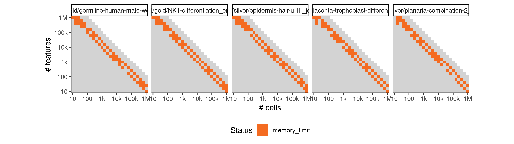

 * Number of instances: 291
 * Dataset ids: scaling_1532, scaling_1551, scaling_1570, scaling_1589, scaling_1608, scaling_1626, scaling_1627, scaling_1628, scaling_1630, scaling_1631, scaling_1632, scaling_1633, scaling_1634, scaling_1635, scaling_1636, scaling_1637, scaling_1638, scaling_1640, scaling_1641, scaling_1643, scaling_1644, scaling_1645, scaling_1646, scaling_1647, scaling_1648, scaling_1649, scaling_1651, scaling_1653, scaling_1654, scaling_1655, scaling_1656, scaling_1657, scaling_1658, scaling_1659, scaling_1660, scaling_1661, scaling_1662, scaling_1663, scaling_1664, scaling_1665, scaling_1666, scaling_1667, scaling_1668, scaling_1669, scaling_1670, scaling_1671, scaling_1672, scaling_1673, scaling_1675, scaling_1676, scaling_1677, scaling_1678, scaling_1679, scaling_1680, scaling_1681, scaling_1682, scaling_1683, scaling_1684, scaling_1685, scaling_1686, scaling_1687, scaling_1688, scaling_1689, scaling_1690, scaling_1691, scaling_1692, scaling_1694, scaling_1697, scaling_1698, scaling_1700, scaling_1701, scaling_1702, scaling_1703, scaling_1704, scaling_1705, scaling_1706, scaling_1707, scaling_1708, scaling_1709, scaling_1710, scaling_1711, scaling_1712, scaling_1713, scaling_1716, scaling_1717, scaling_1719, scaling_1720, scaling_1721, scaling_1722, scaling_1723, scaling_1724, scaling_1725, scaling_1726, scaling_1727, scaling_1728, scaling_1730, scaling_1732, scaling_1733, scaling_1734, scaling_1735, scaling_1736, scaling_1737, scaling_1738, scaling_1739, scaling_1740, scaling_1741, scaling_1742, scaling_1743, scaling_1744, scaling_1745, scaling_1746, scaling_1747, scaling_1748, scaling_1749, scaling_1750, scaling_1751, scaling_1752, scaling_1753, scaling_1754, scaling_1755, scaling_1758, scaling_1762, scaling_1763, scaling_1766, scaling_1767, scaling_1768, scaling_1774, scaling_1775, scaling_1781, scaling_1782, scaling_1783, scaling_1786, scaling_1795, scaling_1796, scaling_1797, scaling_1798, scaling_1806, scaling_1810, scaling_1811, scaling_1812, scaling_1813, scaling_1815, scaling_1818, scaling_1826, scaling_1827, scaling_1828, scaling_1830, scaling_1833, scaling_1834, scaling_1841, scaling_1842, scaling_1843, scaling_1845, scaling_1847, scaling_1848, scaling_1849, scaling_1850, scaling_1851, scaling_1854, scaling_1856, scaling_1857, scaling_1858, scaling_1860, scaling_1861, scaling_1863, scaling_1866, scaling_1867, scaling_1868, scaling_1873, scaling_1874, scaling_1875, scaling_1877, scaling_1881, scaling_1882, scaling_1883, scaling_1884, scaling_1885, scaling_1886, scaling_1887, scaling_1888, scaling_1889, scaling_1890, scaling_1891, scaling_1892, scaling_1893, scaling_1895, scaling_1896, scaling_1897, scaling_1898, scaling_1899, scaling_1900, scaling_1901, scaling_1902, scaling_1903, scaling_1904, scaling_1905, scaling_1906, scaling_1907, scaling_1908, scaling_1909, scaling_1910, scaling_1911, scaling_1912, scaling_1913, scaling_1914, scaling_1915, scaling_1916, scaling_1917, scaling_1918, scaling_1919, scaling_1920, scaling_1921, scaling_1922, scaling_1923, scaling_1924, scaling_1925, scaling_1926, scaling_1927, scaling_1928, scaling_1929, scaling_1930, scaling_1931, scaling_1932, scaling_1933, scaling_1934, scaling_1935, scaling_1936, scaling_1937, scaling_1938, scaling_1939, scaling_1940, scaling_1941, scaling_1942, scaling_1943, scaling_1944, scaling_1945, scaling_1946, scaling_1947, scaling_1948, scaling_1949, scaling_1950, scaling_1951, scaling_1952, scaling_1953, scaling_1954, scaling_1955, scaling_1956, scaling_1957, scaling_1958, scaling_1959, scaling_1960, scaling_1961, scaling_1962, scaling_1963, scaling_1964, scaling_1965, scaling_1966, scaling_1967, scaling_1968, scaling_1969, scaling_1970, scaling_1971, scaling_1972, scaling_1973, scaling_1974, scaling_1975, scaling_1976, scaling_1977, scaling_1978, scaling_1979, scaling_1980, scaling_1981, scaling_1982, scaling_1983, scaling_1984, scaling_1985, scaling_1986, scaling_1987, scaling_1988, scaling_1989, scaling_1990, scaling_1991, scaling_1992, scaling_1993, scaling_1994, scaling_1995, scaling_1996, scaling_1997, scaling_1998, scaling_1999, scaling_2000

Last 10 lines of scaling_1532:
```
Error in scan(file = messages, what = character(), sep = "\n", quiet = TRUE) : 
  could not allocate memory (0 Mb) in C function 'R_AllocStringBuffer'
Calls: <Anonymous> ... <Anonymous> -> sampling -> sampling -> .local -> scan
Execution halted
Error in (function (e)  : 
  lazy-load database '/usr/local/lib/R/library/parallel/R/parallel.rdb' is corrupt
In addition: Warning message:
In (function (e)  : internal error -4 in R_decompress1
Error: segfault from C stack overflow
Fatal error: error during cleanup
```

### ERROR CLUSTER MEMORY_LIMIT -- 4
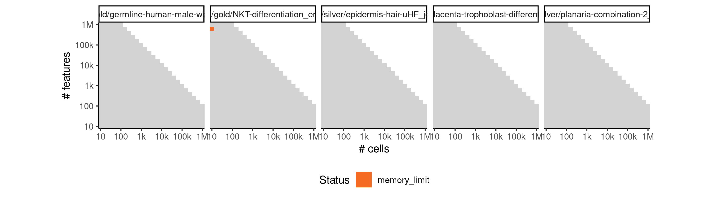

 * Number of instances: 1
 * Dataset ids: scaling_1550

Last 10 lines of scaling_1550:
```
/usr/local/lib/R/site-library/RcppEigen/include/Eigen/src/Core/ProductEvaluators.h:124:75:   required from ‘Eigen::internal::product_evaluator<Eigen::Product<Lhs, Rhs, Option>, ProductTag, LhsShape, RhsShape>::product_evaluator(const XprType&) [with Lhs = Eigen::Product<Eigen::CwiseBinaryOp<Eigen::internal::scalar_product_op<double, double>, const Eigen::CwiseNullaryOp<Eigen::internal::scalar_constant_op<double>, const Eigen::Matrix<double, 1, -1> >, const Eigen::Transpose<Eigen::Matrix<double, -1, 1> > >, Eigen::Matrix<double, -1, -1>, 0>; Rhs = Eigen::Matrix<double, -1, 1>; int Options = 0; int ProductTag = 6; LhsShape = Eigen::DenseShape; RhsShape = Eigen::DenseShape; typename Eigen::internal::traits<typename Eigen::Product<Lhs, Rhs, Option>::Rhs>::Scalar = double; typename Eigen::internal::traits<typename Eigen::Product<Lhs, Rhs, Option>::Lhs>::Scalar = double; Eigen::internal::product_evaluator<Eigen::Product<Lhs, Rhs, Option>, ProductTag, LhsShape, RhsShape>::XprType = Eigen::Product<Eigen::Product<Eigen::CwiseBinaryOp<Eigen::internal::scalar_product_op<double, double>, const Eigen::CwiseNullaryOp<Eigen::internal::scalar_constant_op<double>, const Eigen::Matrix<double, 1, -1> >, const Eigen::Transpose<Eigen::Matrix<double, -1, 1> > >, Eigen::Matrix<double, -1, -1>, 0>, Eigen::Matrix<double, -1, 1>, 0>]’
/usr/local/lib/R/site-library/RcppEigen/include/Eigen/src/Core/ProductEvaluators.h:35:70:   required from ‘Eigen::internal::evaluator<Eigen::Product<Lhs, Rhs, Option> >::evaluator(const XprType&) [with Lhs = Eigen::Product<Eigen::CwiseBinaryOp<Eigen::internal::scalar_product_op<double, double>, const Eigen::CwiseNullaryOp<Eigen::internal::scalar_constant_op<double>, const Eigen::Matrix<double, 1, -1> >, const Eigen::Transpose<Eigen::Matrix<double, -1, 1> > >, Eigen::Matrix<double, -1, -1>, 0>; Rhs = Eigen::Matrix<double, -1, 1>; int Options = 0; Eigen::internal::evaluator<Eigen::Product<Lhs, Rhs, Option> >::XprType = Eigen::Product<Eigen::Product<Eigen::CwiseBinaryOp<Eigen::internal::scalar_product_op<double, double>, const Eigen::CwiseNullaryOp<Eigen::internal::scalar_constant_op<double>, const Eigen::Matrix<double, 1, -1> >, const Eigen::Transpose<Eigen::Matrix<double, -1, 1> > >, Eigen::Matrix<double, -1, -1>, 0>, Eigen::Matrix<double, -1, 1>, 0>]’
/usr/local/lib/R/site-library/RcppEigen/include/Eigen/src/Core/Product.h:132:22:   required from ‘Eigen::internal::dense_product_base<Lhs, Rhs, Option, 6>::operator const Scalar() const [with Lhs = Eigen::Product<Eigen::CwiseBinaryOp<Eigen::internal::scalar_product_op<double, double>, const Eigen::CwiseNullaryOp<Eigen::internal::scalar_constant_op<double>, const Eigen::Matrix<double, 1, -1> >, const Eigen::Transpose<Eigen::Matrix<double, -1, 1> > >, Eigen::Matrix<double, -1, -1>, 0>; Rhs = Eigen::Matrix<double, -1, 1>; int Option = 0; Eigen::internal::dense_product_base<Lhs, Rhs, Option, 6>::Scalar = double]’
/usr/local/lib/R/site-library/StanHeaders/include/src/stan/mcmc/hmc/hamiltonians/dense_e_metric.hpp:24:60:   required from ‘double stan::mcmc::dense_e_metric<Model, BaseRNG>::T(stan::mcmc::dense_e_point&) [with Model = model1c6a276a17405_ouija_namespace::model1c6a276a17405_ouija; BaseRNG = boost::random::additive_combine_engine<boost::random::linear_congruential_engine<unsigned int, 40014u, 0u, 2147483563u>, boost::random::linear_congruential_engine<unsigned int, 40692u, 0u, 2147483399u> >]’
file1c6a24fcf4543.cpp:1303:1:   required from here
/usr/local/lib/R/site-library/RcppEigen/include/Eigen/src/Core/DenseCoeffsBase.h:55:30: warning: ignoring attributes on template argument ‘Eigen::internal::packet_traits<double>::type {aka __vector(2) double}’ [-Wignored-attributes]
Error in saveRDS(obj, file = gsub("stan$", "rds", file)) : 
  error writing to connection
Calls: <Anonymous> -> do.call -> <Anonymous> -> stan_model -> saveRDS
Execution halted
```

### ERROR CLUSTER MEMORY_LIMIT -- 5
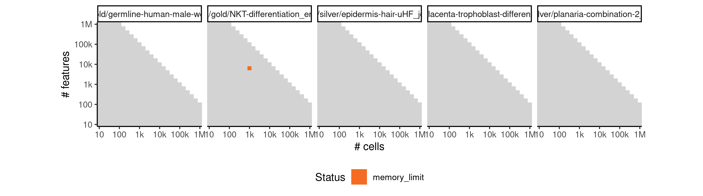

 * Number of instances: 1
 * Dataset ids: scaling_1557

Last 10 lines of scaling_1557:
```
/usr/local/lib/R/site-library/RcppEigen/include/Eigen/src/Core/ProductEvaluators.h:251:23:   required from ‘static void Eigen::internal::generic_product_impl<Lhs, Rhs, Eigen::DenseShape, Eigen::DenseShape, 6>::evalTo(Dst&, const Lhs&, const Rhs&) [with Dst = Eigen::Matrix<double, 1, 1, 0, 1, 1>; Lhs = Eigen::Product<Eigen::CwiseBinaryOp<Eigen::internal::scalar_product_op<double, double>, const Eigen::CwiseNullaryOp<Eigen::internal::scalar_constant_op<double>, const Eigen::Matrix<double, 1, -1> >, const Eigen::Transpose<Eigen::Matrix<double, -1, 1> > >, Eigen::Matrix<double, -1, -1>, 0>; Rhs = Eigen::Matrix<double, -1, 1>]’
/usr/local/lib/R/site-library/RcppEigen/include/Eigen/src/Core/ProductEvaluators.h:124:75:   required from ‘Eigen::internal::product_evaluator<Eigen::Product<Lhs, Rhs, Option>, ProductTag, LhsShape, RhsShape>::product_evaluator(const XprType&) [with Lhs = Eigen::Product<Eigen::CwiseBinaryOp<Eigen::internal::scalar_product_op<double, double>, const Eigen::CwiseNullaryOp<Eigen::internal::scalar_constant_op<double>, const Eigen::Matrix<double, 1, -1> >, const Eigen::Transpose<Eigen::Matrix<double, -1, 1> > >, Eigen::Matrix<double, -1, -1>, 0>; Rhs = Eigen::Matrix<double, -1, 1>; int Options = 0; int ProductTag = 6; LhsShape = Eigen::DenseShape; RhsShape = Eigen::DenseShape; typename Eigen::internal::traits<typename Eigen::Product<Lhs, Rhs, Option>::Rhs>::Scalar = double; typename Eigen::internal::traits<typename Eigen::Product<Lhs, Rhs, Option>::Lhs>::Scalar = double; Eigen::internal::product_evaluator<Eigen::Product<Lhs, Rhs, Option>, ProductTag, LhsShape, RhsShape>::XprType = Eigen::Product<Eigen::Product<Eigen::CwiseBinaryOp<Eigen::internal::scalar_product_op<double, double>, const Eigen::CwiseNullaryOp<Eigen::internal::scalar_constant_op<double>, const Eigen::Matrix<double, 1, -1> >, const Eigen::Transpose<Eigen::Matrix<double, -1, 1> > >, Eigen::Matrix<double, -1, -1>, 0>, Eigen::Matrix<double, -1, 1>, 0>]’
/usr/local/lib/R/site-library/RcppEigen/include/Eigen/src/Core/ProductEvaluators.h:35:70:   required from ‘Eigen::internal::evaluator<Eigen::Product<Lhs, Rhs, Option> >::evaluator(const XprType&) [with Lhs = Eigen::Product<Eigen::CwiseBinaryOp<Eigen::internal::scalar_product_op<double, double>, const Eigen::CwiseNullaryOp<Eigen::internal::scalar_constant_op<double>, const Eigen::Matrix<double, 1, -1> >, const Eigen::Transpose<Eigen::Matrix<double, -1, 1> > >, Eigen::Matrix<double, -1, -1>, 0>; Rhs = Eigen::Matrix<double, -1, 1>; int Options = 0; Eigen::internal::evaluator<Eigen::Product<Lhs, Rhs, Option> >::XprType = Eigen::Product<Eigen::Product<Eigen::CwiseBinaryOp<Eigen::internal::scalar_product_op<double, double>, const Eigen::CwiseNullaryOp<Eigen::internal::scalar_constant_op<double>, const Eigen::Matrix<double, 1, -1> >, const Eigen::Transpose<Eigen::Matrix<double, -1, 1> > >, Eigen::Matrix<double, -1, -1>, 0>, Eigen::Matrix<double, -1, 1>, 0>]’
/usr/local/lib/R/site-library/RcppEigen/include/Eigen/src/Core/Product.h:132:22:   required from ‘Eigen::internal::dense_product_base<Lhs, Rhs, Option, 6>::operator const Scalar() const [with Lhs = Eigen::Product<Eigen::CwiseBinaryOp<Eigen::internal::scalar_product_op<double, double>, const Eigen::CwiseNullaryOp<Eigen::internal::scalar_constant_op<double>, const Eigen::Matrix<double, 1, -1> >, const Eigen::Transpose<Eigen::Matrix<double, -1, 1> > >, Eigen::Matrix<double, -1, -1>, 0>; Rhs = Eigen::Matrix<double, -1, 1>; int Option = 0; Eigen::internal::dense_product_base<Lhs, Rhs, Option, 6>::Scalar = double]’
/usr/local/lib/R/site-library/StanHeaders/include/src/stan/mcmc/hmc/hamiltonians/dense_e_metric.hpp:24:60:   required from ‘double stan::mcmc::dense_e_metric<Model, BaseRNG>::T(stan::mcmc::dense_e_point&) [with Model = model1097bf713cdd_ouija_namespace::model1097bf713cdd_ouija; BaseRNG = boost::random::additive_combine_engine<boost::random::linear_congruential_engine<unsigned int, 40014u, 0u, 2147483563u>, boost::random::linear_congruential_engine<unsigned int, 40692u, 0u, 2147483399u> >]’
file1097b29c1fd09.cpp:1303:1:   required from here
/usr/local/lib/R/site-library/RcppEigen/include/Eigen/src/Core/DenseCoeffsBase.h:55:30: warning: ignoring attributes on template argument ‘Eigen::internal::packet_traits<double>::type {aka __vector(2) double}’ [-Wignored-attributes]
SAMPLING FOR MODEL 'ouija' NOW (CHAIN 1).
Error: cannot allocate vector of size 8 Kb
Execution halted
```

### ERROR CLUSTER MEMORY_LIMIT -- 6
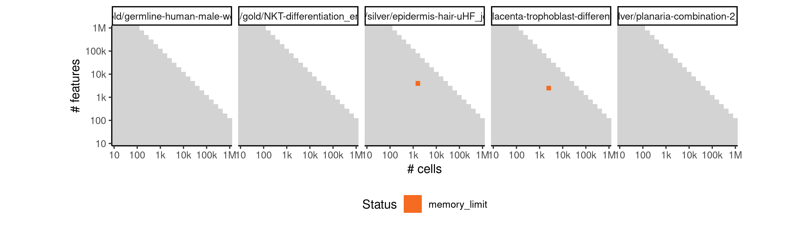

 * Number of instances: 2
 * Dataset ids: scaling_1577, scaling_1597

Last 10 lines of scaling_1577:
```
/usr/local/lib/R/site-library/StanHeaders/include/src/stan/mcmc/hmc/hamiltonians/dense_e_metric.hpp:24:60:   required from ‘double stan::mcmc::dense_e_metric<Model, BaseRNG>::T(stan::mcmc::dense_e_point&) [with Model = model1c6596281f56f_ouija_namespace::model1c6596281f56f_ouija; BaseRNG = boost::random::additive_combine_engine<boost::random::linear_congruential_engine<unsigned int, 40014u, 0u, 2147483563u>, boost::random::linear_congruential_engine<unsigned int, 40692u, 0u, 2147483399u> >]’
file1c6591307742d.cpp:1303:1:   required from here
/usr/local/lib/R/site-library/RcppEigen/include/Eigen/src/Core/DenseCoeffsBase.h:55:30: warning: ignoring attributes on template argument ‘Eigen::internal::packet_traits<double>::type {aka __vector(2) double}’ [-Wignored-attributes]
SAMPLING FOR MODEL 'ouija' NOW (CHAIN 1).
[1] " *** caught segfault ***"                         
[2] "address 0x7fff1dcd9ff8, cause 'memory not mapped'"
[3] "Error : cannot allocate vector of size 5.1 Mb"    
error occurred during calling the sampler; sampling not done
Error: memory exhausted (limit reached?)
Execution halted
```

### ERROR CLUSTER MEMORY_LIMIT -- 7
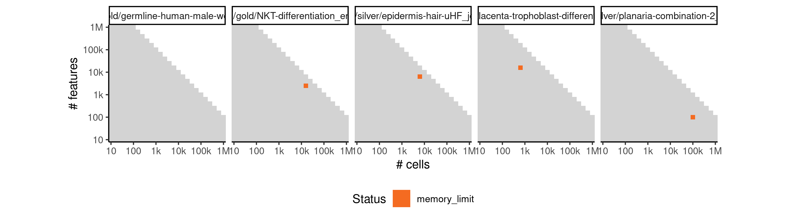

 * Number of instances: 4
 * Dataset ids: scaling_1699, scaling_1731, scaling_2064, scaling_2078

Last 10 lines of scaling_1699:
```
error writing to connection
```

### ERROR CLUSTER MEMORY_LIMIT -- 8
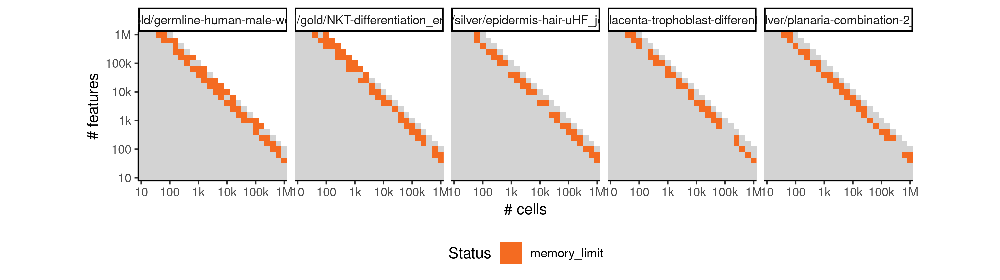

 * Number of instances: 248
 * Dataset ids: scaling_2001, scaling_2002, scaling_2003, scaling_2004, scaling_2005, scaling_2006, scaling_2007, scaling_2008, scaling_2009, scaling_2012, scaling_2013, scaling_2014, scaling_2015, scaling_2016, scaling_2018, scaling_2019, scaling_2020, scaling_2021, scaling_2022, scaling_2023, scaling_2024, scaling_2025, scaling_2026, scaling_2027, scaling_2029, scaling_2030, scaling_2032, scaling_2033, scaling_2034, scaling_2035, scaling_2036, scaling_2037, scaling_2038, scaling_2039, scaling_2040, scaling_2041, scaling_2043, scaling_2044, scaling_2045, scaling_2046, scaling_2047, scaling_2048, scaling_2049, scaling_2050, scaling_2052, scaling_2053, scaling_2054, scaling_2055, scaling_2056, scaling_2057, scaling_2059, scaling_2060, scaling_2061, scaling_2063, scaling_2066, scaling_2067, scaling_2068, scaling_2070, scaling_2071, scaling_2072, scaling_2073, scaling_2074, scaling_2076, scaling_2077, scaling_2080, scaling_2081, scaling_2082, scaling_2083, scaling_2084, scaling_2085, scaling_2086, scaling_2087, scaling_2089, scaling_2092, scaling_2093, scaling_2094, scaling_2095, scaling_2096, scaling_2098, scaling_2099, scaling_2100, scaling_2101, scaling_2102, scaling_2103, scaling_2104, scaling_2105, scaling_2106, scaling_2107, scaling_2108, scaling_2109, scaling_2110, scaling_2111, scaling_2112, scaling_2115, scaling_2116, scaling_2118, scaling_2119, scaling_2120, scaling_2123, scaling_2125, scaling_2126, scaling_2127, scaling_2128, scaling_2129, scaling_2130, scaling_2131, scaling_2132, scaling_2133, scaling_2134, scaling_2135, scaling_2136, scaling_2137, scaling_2140, scaling_2141, scaling_2142, scaling_2145, scaling_2146, scaling_2147, scaling_2148, scaling_2149, scaling_2150, scaling_2151, scaling_2152, scaling_2153, scaling_2155, scaling_2156, scaling_2157, scaling_2159, scaling_2160, scaling_2161, scaling_2162, scaling_2163, scaling_2164, scaling_2165, scaling_2166, scaling_2167, scaling_2168, scaling_2169, scaling_2170, scaling_2171, scaling_2172, scaling_2173, scaling_2174, scaling_2175, scaling_2177, scaling_2180, scaling_2181, scaling_2183, scaling_2184, scaling_2185, scaling_2187, scaling_2190, scaling_2191, scaling_2193, scaling_2194, scaling_2196, scaling_2197, scaling_2198, scaling_2199, scaling_2200, scaling_2201, scaling_2203, scaling_2204, scaling_2205, scaling_2207, scaling_2212, scaling_2215, scaling_2216, scaling_2217, scaling_2218, scaling_2219, scaling_2220, scaling_2222, scaling_2223, scaling_2227, scaling_2230, scaling_2232, scaling_2234, scaling_2235, scaling_2236, scaling_2237, scaling_2241, scaling_2242, scaling_2247, scaling_2248, scaling_2249, scaling_2250, scaling_2251, scaling_2252, scaling_2253, scaling_2254, scaling_2255, scaling_2256, scaling_2257, scaling_2258, scaling_2259, scaling_2260, scaling_2261, scaling_2262, scaling_2263, scaling_2267, scaling_2268, scaling_2269, scaling_2270, scaling_2271, scaling_2272, scaling_2273, scaling_2274, scaling_2275, scaling_2276, scaling_2277, scaling_2278, scaling_2279, scaling_2281, scaling_2282, scaling_2283, scaling_2284, scaling_2285, scaling_2288, scaling_2289, scaling_2290, scaling_2291, scaling_2292, scaling_2293, scaling_2294, scaling_2295, scaling_2296, scaling_2297, scaling_2298, scaling_2299, scaling_2301, scaling_2309, scaling_2310, scaling_2311, scaling_2312, scaling_2313, scaling_2315, scaling_2316, scaling_2317, scaling_2318, scaling_2321, scaling_2322, scaling_2323, scaling_2324, scaling_2325, scaling_2326, scaling_2328, scaling_2330

Last 10 lines of scaling_2001:
```
file1e9b9363f01d7.cpp:1303:1:   required from here
/usr/local/lib/R/site-library/RcppEigen/include/Eigen/src/Core/DenseCoeffsBase.h:55:30: warning: ignoring attributes on template argument ‘Eigen::internal::packet_traits<double>::type {aka __vector(2) double}’ [-Wignored-attributes]
SAMPLING FOR MODEL 'ouija' NOW (CHAIN 1).
[1] "Error in sampler$call_sampler(args_list[[i]]) : std::bad_alloc"
error occurred during calling the sampler; sampling not done
Stan model 'ouija' does not contain samples.
Error in attr(data, "mcpar") <- c(start, end, thin) : 
  attempt to set an attribute on NULL
Calls: %>% ... eval -> <Anonymous> -> posterior.mode -> is.mcmc -> mcmc
Execution halted
```

### ERROR CLUSTER MEMORY_LIMIT -- 9
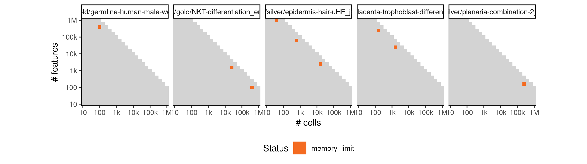

 * Number of instances: 9
 * Dataset ids: scaling_2017, scaling_2042, scaling_2065, scaling_2069, scaling_2075, scaling_2079, scaling_2088, scaling_2091, scaling_2113

Last 10 lines of scaling_2017:
```
file6381395366fe.cpp:1303:1:   required from here
/usr/local/lib/R/site-library/RcppEigen/include/Eigen/src/Core/DenseCoeffsBase.h:55:30: warning: ignoring attributes on template argument ‘Eigen::internal::packet_traits<double>::type {aka __vector(2) double}’ [-Wignored-attributes]
SAMPLING FOR MODEL 'ouija' NOW (CHAIN 1).
[1]error occurred during calling the sampler; sampling not done
 "Error in sampler$call_sampler(args_list[[i]]) : std::bad_alloc"
Error in attr(data, "mcpar") <- c(start, end, thin) : 
  attempt to set an attribute on NULL
Calls: %>% ... eval -> <Anonymous> -> posterior.mode -> is.mcmc -> mcmc
Execution halted
Stan model 'ouija' does not contain samples.
```

### ERROR CLUSTER MEMORY_LIMIT -- 10
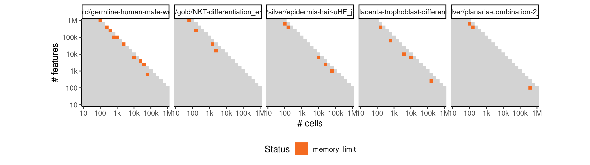

 * Number of instances: 35
 * Dataset ids: scaling_2028, scaling_2051, scaling_2058, scaling_2062, scaling_2090, scaling_2097, scaling_2114, scaling_2117, scaling_2122, scaling_2124, scaling_2154, scaling_2178, scaling_2179, scaling_2186, scaling_2188, scaling_2189, scaling_2195, scaling_2202, scaling_2210, scaling_2211, scaling_2226, scaling_2228, scaling_2229, scaling_2231, scaling_2233, scaling_2238, scaling_2239, scaling_2264, scaling_2280, scaling_2300, scaling_2302, scaling_2314, scaling_2319, scaling_2320, scaling_2327

Last 10 lines of scaling_2028:
```
file1f0d964004238.cpp:1303:1:   required from here
/usr/local/lib/R/site-library/RcppEigen/include/Eigen/src/Core/DenseCoeffsBase.h:55:30: warning: ignoring attributes on template argument ‘Eigen::internal::packet_traits<double>::type {aka __vector(2) double}’ [-Wignored-attributes]
SAMPLING FOR MODEL 'ouija' NOW (CHAIN 1).
[1] "Error in sampler$call_sampler(args_list[[i]]) : std::bad_alloc"
error occurred during calling the sampler; sampling not done
Stan model 'Error in attr(data, "mcpar") <- c(start, end, thin) : 
  attempt to set an attribute on NULL
Calls: %>% ... eval -> <Anonymous> -> posterior.mode -> is.mcmc -> mcmc
Execution halted
ouija' does not contain samples.
```

### ERROR CLUSTER MEMORY_LIMIT -- 11


 * Number of instances: 1
 * Dataset ids: scaling_2213

Last 10 lines of scaling_2213:
```
file1334d352e2bd8.cpp:1303:1:   required from here
/usr/local/lib/R/site-library/RcppEigen/include/Eigen/src/Core/DenseCoeffsBase.h:55:30: warning: ignoring attributes on template argument ‘Eigen::internal::packet_traits<double>::type {aka __vector(2) double}’ [-Wignored-attributes]
Error in new_CppObject_xp(fields$.module, fields$.pointer, ...) : 
  std::bad_alloc
Stan model 'ouija' does not contain samples.
failed to create the sampler; sampling not done
Error in attr(data, "mcpar") <- c(start, end, thin) : 
  attempt to set an attribute on NULL
Calls: %>% ... eval -> <Anonymous> -> posterior.mode -> is.mcmc -> mcmc
Execution halted
```


