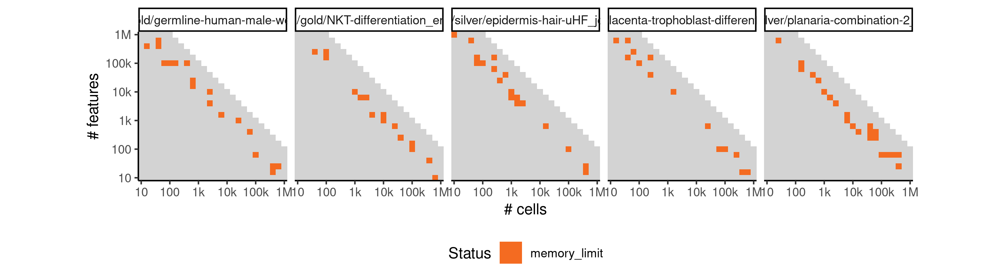
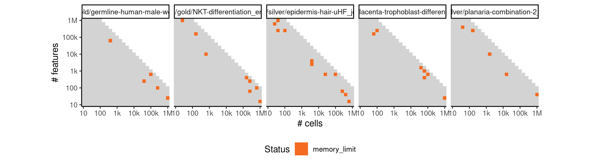
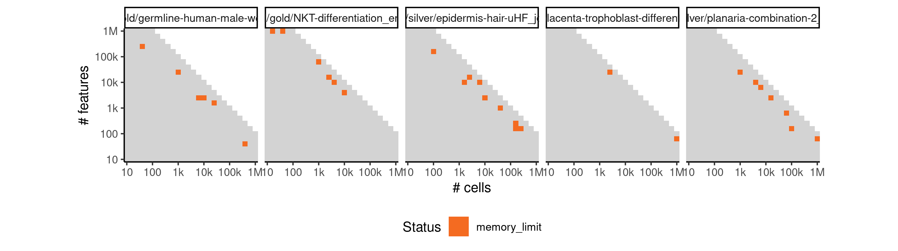
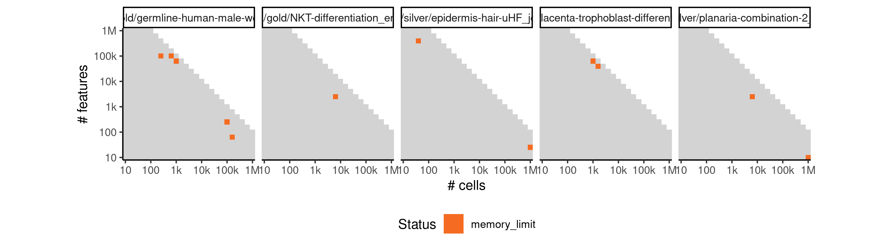
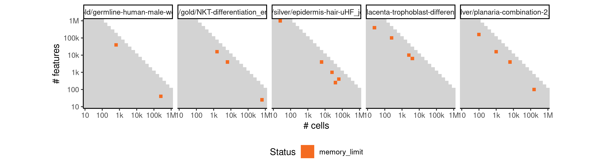
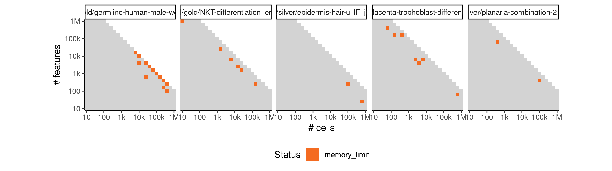
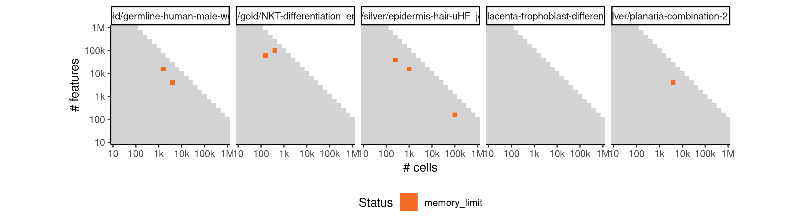
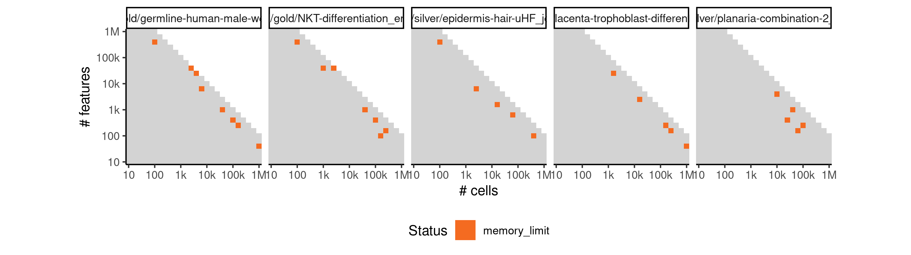

# ouijaflow


## ERROR STATUS METHOD_ERROR

### ERROR CLUSTER METHOD_ERROR -- 1


 * Number of instances: 333
 * Dataset ids: scaling_0298, scaling_0337, scaling_0416, scaling_0417, scaling_0419, scaling_0475, scaling_0476, scaling_0514, scaling_0531, scaling_0536, scaling_0566, scaling_0582, scaling_0591, scaling_0613, scaling_0616, scaling_0617, scaling_0618, scaling_0623, scaling_0664, scaling_0668, scaling_0678, scaling_0684, scaling_0698, scaling_0701, scaling_0715, scaling_0718, scaling_0724, scaling_0726, scaling_0728, scaling_0731, scaling_0750, scaling_0763, scaling_0764, scaling_0766, scaling_0782, scaling_0784, scaling_0800, scaling_0803, scaling_0806, scaling_0817, scaling_0820, scaling_0821, scaling_0823, scaling_0824, scaling_0825, scaling_0832, scaling_0836, scaling_0837, scaling_0841, scaling_0853, scaling_0854, scaling_0855, scaling_0856, scaling_0857, scaling_0866, scaling_0867, scaling_0868, scaling_0869, scaling_0870, scaling_0876, scaling_0877, scaling_0878, scaling_0879, scaling_0881, scaling_0887, scaling_0888, scaling_0889, scaling_0891, scaling_0898, scaling_0899, scaling_0902, scaling_0910, scaling_0912, scaling_0918, scaling_0919, scaling_0928, scaling_0936, scaling_0942, scaling_0951, scaling_0957, scaling_0961, scaling_0963, scaling_0964, scaling_0965, scaling_0968, scaling_0969, scaling_0978, scaling_0980, scaling_0981, scaling_0982, scaling_0989, scaling_0993, scaling_0994, scaling_0995, scaling_1008, scaling_1009, scaling_1010, scaling_1022, scaling_1023, scaling_1026, scaling_1036, scaling_1039, scaling_1042, scaling_1048, scaling_1049, scaling_1050, scaling_1051, scaling_1052, scaling_1053, scaling_1055, scaling_1066, scaling_1067, scaling_1068, scaling_1069, scaling_1070, scaling_1071, scaling_1072, scaling_1073, scaling_1074, scaling_1082, scaling_1084, scaling_1085, scaling_1086, scaling_1088, scaling_1089, scaling_1090, scaling_1091, scaling_1093, scaling_1094, scaling_1097, scaling_1103, scaling_1106, scaling_1107, scaling_1108, scaling_1109, scaling_1110, scaling_1112, scaling_1125, scaling_1126, scaling_1129, scaling_1130, scaling_1133, scaling_1145, scaling_1146, scaling_1147, scaling_1149, scaling_1150, scaling_1151, scaling_1152, scaling_1153, scaling_1154, scaling_1157, scaling_1158, scaling_1161, scaling_1166, scaling_1167, scaling_1168, scaling_1172, scaling_1179, scaling_1180, scaling_1181, scaling_1182, scaling_1183, scaling_1184, scaling_1189, scaling_1190, scaling_1196, scaling_1197, scaling_1198, scaling_1199, scaling_1202, scaling_1212, scaling_1213, scaling_1214, scaling_1215, scaling_1216, scaling_1217, scaling_1218, scaling_1225, scaling_1227, scaling_1228, scaling_1229, scaling_1231, scaling_1232, scaling_1233, scaling_1242, scaling_1243, scaling_1244, scaling_1245, scaling_1249, scaling_1250, scaling_1253, scaling_1254, scaling_1257, scaling_1258, scaling_1261, scaling_1262, scaling_1265, scaling_1266, scaling_1267, scaling_1268, scaling_1270, scaling_1272, scaling_1273, scaling_1274, scaling_1276, scaling_1277, scaling_1278, scaling_1279, scaling_1280, scaling_1282, scaling_1283, scaling_1285, scaling_1289, scaling_1293, scaling_1294, scaling_1295, scaling_1296, scaling_1297, scaling_1298, scaling_1299, scaling_1300, scaling_1302, scaling_1304, scaling_1315, scaling_1316, scaling_1317, scaling_1318, scaling_1319, scaling_1320, scaling_1321, scaling_1322, scaling_1323, scaling_1324, scaling_1328, scaling_1331, scaling_1334, scaling_1335, scaling_1336, scaling_1337, scaling_1338, scaling_1339, scaling_1340, scaling_1341, scaling_1342, scaling_1344, scaling_1349, scaling_1350, scaling_1355, scaling_1357, scaling_1358, scaling_1359, scaling_1361, scaling_1362, scaling_1363, scaling_1364, scaling_1365, scaling_1374, scaling_1375, scaling_1376, scaling_1377, scaling_1378, scaling_1379, scaling_1380, scaling_1381, scaling_1382, scaling_1383, scaling_1384, scaling_1386, scaling_1391, scaling_1392, scaling_1393, scaling_1394, scaling_1395, scaling_1398, scaling_1402, scaling_1403, scaling_1404, scaling_1405, scaling_1406, scaling_1407, scaling_1412, scaling_1416, scaling_1417, scaling_1418, scaling_1419, scaling_1424, scaling_1425, scaling_1427, scaling_1428, scaling_1429, scaling_1430, scaling_1438, scaling_1439, scaling_1440, scaling_1441, scaling_1442, scaling_1443, scaling_1444, scaling_1449, scaling_1450, scaling_1451, scaling_1452, scaling_1453, scaling_1454, scaling_1455, scaling_1456, scaling_1463, scaling_1464, scaling_1465, scaling_1466, scaling_1467, scaling_1469, scaling_1471, scaling_1472, scaling_1473, scaling_1474, scaling_1475, scaling_1476, scaling_1477, scaling_1478, scaling_1479, scaling_1480, scaling_1484, scaling_1485, scaling_1486, scaling_1487, scaling_1488, scaling_1490, scaling_1493, scaling_1498, scaling_1499, scaling_1500

Last 10 lines of scaling_0298:
```
  /group/irc/shared/dynverse/dynbenchmark/derived/singularity_images/dynverse/ti_ouijaflow.simg

   1/1000 [  0%]                                ETA: 2984s | Loss: 37241.809
  10/1000 [  1%]                                ETA: 299s | Loss: 33574.777 
  20/1000 [  2%]                                ETA: 150s | Loss: 26042.598
  30/1000 [  3%]                                ETA: 100s | Loss: 20708.703
  40/1000 [  4%] █                              ETA: 75s | Loss: 23336.438 
  50/1000 [  5%] █                              ETA: 60s | Loss: nan      
  60/1000 [  6%] █                              ETA: 50s | Loss: nan
  70/1000 [  7%] ██                             ETA: 43s | Loss: nan
  80/1000 [  8%] ██                             ETA: 38s | Loss: nan
  90/1000 [  9%] ██                             ETA: 34s | Loss: nan
 100/1000 [ 10%] ███                            ETA: 30s | Loss: nan
 110/1000 [ 11%] ███                            ETA: 27s | Loss: nan
 120/1000 [ 12%] ███                            ETA: 25s | Loss: nan
 130/1000 [ 13%] ███                            ETA: 23s | Loss: nan
 140/1000 [ 14%] ████                           ETA: 22s | Loss: nan
 150/1000 [ 15%] ████                           ETA: 20s | Loss: nan
 160/1000 [ 16%] ████                           ETA: 19s | Loss: nan
 170/1000 [ 17%] █████                          ETA: 18s | Loss: nan
 180/1000 [ 18%] █████                          ETA: 17s | Loss: nan
 190/1000 [ 19%] █████                          ETA: 16s | Loss: nan
 200/1000 [ 20%] ██████                         ETA: 15s | Loss: nan
 210/1000 [ 21%] ██████                         ETA: 15s | Loss: nan
 220/1000 [ 22%] ██████                         ETA: 14s | Loss: nan
 230/1000 [ 23%] ██████                         ETA: 13s | Loss: nan
 240/1000 [ 24%] ███████                        ETA: 13s | Loss: nan
 250/1000 [ 25%] ███████                        ETA: 12s | Loss: nan
 260/1000 [ 26%] ███████                        ETA: 12s | Loss: nan
 270/1000 [ 27%] ████████                       ETA: 11s | Loss: nan
 280/1000 [ 28%] ████████                       ETA: 11s | Loss: nan
 290/1000 [ 28%] ████████                       ETA: 10s | Loss: nan
 300/1000 [ 30%] █████████                      ETA: 10s | Loss: nan
 310/1000 [ 31%] █████████                      ETA: 10s | Loss: nan
 320/1000 [ 32%] █████████                      ETA: 9s | Loss: nan 
 330/1000 [ 33%] █████████                      ETA: 9s | Loss: nan
 340/1000 [ 34%] ██████████                     ETA: 9s | Loss: nan
 350/1000 [ 35%] ██████████                     ETA: 8s | Loss: nan
 360/1000 [ 36%] ██████████                     ETA: 8s | Loss: nan
 370/1000 [ 37%] ███████████                    ETA: 8s | Loss: nan
 380/1000 [ 38%] ███████████                    ETA: 8s | Loss: nan
 390/1000 [ 39%] ███████████                    ETA: 7s | Loss: nan
 400/1000 [ 40%] ████████████                   ETA: 7s | Loss: nan
 410/1000 [ 41%] ████████████                   ETA: 7s | Loss: nan
 420/1000 [ 42%] ████████████                   ETA: 7s | Loss: nan
 430/1000 [ 43%] ████████████                   ETA: 6s | Loss: nan
 440/1000 [ 44%] █████████████                  ETA: 6s | Loss: nan
 450/1000 [ 45%] █████████████                  ETA: 6s | Loss: nan
 460/1000 [ 46%] █████████████                  ETA: 6s | Loss: nan
 470/1000 [ 47%] ██████████████                 ETA: 6s | Loss: nan
 480/1000 [ 48%] ██████████████                 ETA: 5s | Loss: nan
 490/1000 [ 49%] ██████████████                 ETA: 5s | Loss: nan
 500/1000 [ 50%] ███████████████                ETA: 5s | Loss: nan
 510/1000 [ 51%] ███████████████                ETA: 5s | Loss: nan
 520/1000 [ 52%] ███████████████                ETA: 5s | Loss: nan
 530/1000 [ 53%] ███████████████                ETA: 5s | Loss: nan
 540/1000 [ 54%] ████████████████               ETA: 4s | Loss: nan
 550/1000 [ 55%] ████████████████               ETA: 4s | Loss: nan
 560/1000 [ 56%] ████████████████               ETA: 4s | Loss: nan
 570/1000 [ 56%] █████████████████              ETA: 4s | Loss: nan
 580/1000 [ 57%] █████████████████              ETA: 4s | Loss: nan
 590/1000 [ 59%] █████████████████              ETA: 4s | Loss: nan
 600/1000 [ 60%] ██████████████████             ETA: 3s | Loss: nan
 610/1000 [ 61%] ██████████████████             ETA: 3s | Loss: nan
 620/1000 [ 62%] ██████████████████             ETA: 3s | Loss: nan
 630/1000 [ 63%] ██████████████████             ETA: 3s | Loss: nan
 640/1000 [ 64%] ███████████████████            ETA: 3s | Loss: nan
 650/1000 [ 65%] ███████████████████            ETA: 3s | Loss: nan
 660/1000 [ 66%] ███████████████████            ETA: 3s | Loss: nan
 670/1000 [ 67%] ████████████████████           ETA: 3s | Loss: nan
 680/1000 [ 68%] ████████████████████           ETA: 2s | Loss: nan
 690/1000 [ 69%] ████████████████████           ETA: 2s | Loss: nan
 700/1000 [ 70%] █████████████████████          ETA: 2s | Loss: nan
 710/1000 [ 71%] █████████████████████          ETA: 2s | Loss: nan
 720/1000 [ 72%] █████████████████████          ETA: 2s | Loss: nan
 730/1000 [ 73%] █████████████████████          ETA: 2s | Loss: nan
 740/1000 [ 74%] ██████████████████████         ETA: 2s | Loss: nan
 750/1000 [ 75%] ██████████████████████         ETA: 2s | Loss: nan
 760/1000 [ 76%] ██████████████████████         ETA: 2s | Loss: nan
 770/1000 [ 77%] ███████████████████████        ETA: 2s | Loss: nan
 780/1000 [ 78%] ███████████████████████        ETA: 1s | Loss: nan
 790/1000 [ 79%] ███████████████████████        ETA: 1s | Loss: nan
 800/1000 [ 80%] ████████████████████████       ETA: 1s | Loss: nan
 810/1000 [ 81%] ████████████████████████       ETA: 1s | Loss: nan
 820/1000 [ 82%] ████████████████████████       ETA: 1s | Loss: nan
 830/1000 [ 83%] ████████████████████████       ETA: 1s | Loss: nan
 840/1000 [ 84%] █████████████████████████      ETA: 1s | Loss: nan
 850/1000 [ 85%] █████████████████████████      ETA: 1s | Loss: nan
 860/1000 [ 86%] █████████████████████████      ETA: 1s | Loss: nan
 870/1000 [ 87%] ██████████████████████████     ETA: 1s | Loss: nan
 880/1000 [ 88%] ██████████████████████████     ETA: 0s | Loss: nan
 890/1000 [ 89%] ██████████████████████████     ETA: 0s | Loss: nan
 900/1000 [ 90%] ███████████████████████████    ETA: 0s | Loss: nan
 910/1000 [ 91%] ███████████████████████████    ETA: 0s | Loss: nan
 920/1000 [ 92%] ███████████████████████████    ETA: 0s | Loss: nan
 930/1000 [ 93%] ███████████████████████████    ETA: 0s | Loss: nan
 940/1000 [ 94%] ████████████████████████████   ETA: 0s | Loss: nan
 950/1000 [ 95%] ████████████████████████████   ETA: 0s | Loss: nan
 960/1000 [ 96%] ████████████████████████████   ETA: 0s | Loss: nan
 970/1000 [ 97%] █████████████████████████████  ETA: 0s | Loss: nan
 980/1000 [ 98%] █████████████████████████████  ETA: 0s | Loss: nan
 990/1000 [ 99%] █████████████████████████████  ETA: 0s | Loss: nan
1000/1000 [100%] ██████████████████████████████ Elapsed: 7s | Loss: nan
/usr/local/lib/python3.6/site-packages/edward/util/random_variables.py:52: FutureWarning: Conversion of the second argument of issubdtype from `float` to `np.floating` is deprecated. In future, it will be treated as `np.float64 == np.dtype(float).type`.
  not np.issubdtype(value.dtype, np.float) and \
output saved in /data/tmp//Rtmp9OeXJY/filed4c6b4ad73c/ti/output: 
	cell_ids.csv
	pseudotime.csv
	timings.json
all(pg_check >= 0 & pg_check < (1 + 1e-06)) isn't true.
Sum of progressions per cell_id should be exactly one
```

## ERROR STATUS MEMORY_LIMIT

### ERROR CLUSTER MEMORY_LIMIT -- 1


 * Number of instances: 48
 * Dataset ids: scaling_1501, scaling_1506, scaling_1513, scaling_1528, scaling_1530, scaling_1532, scaling_1548, scaling_1560, scaling_1568, scaling_1576, scaling_1577, scaling_1586, scaling_1591, scaling_1602, scaling_1605, scaling_1618, scaling_1619, scaling_1630, scaling_1633, scaling_1636, scaling_1638, scaling_1646, scaling_1650, scaling_1656, scaling_1657, scaling_1661, scaling_1664, scaling_1665, scaling_1670, scaling_1673, scaling_1674, scaling_1676, scaling_1678, scaling_1679, scaling_1680, scaling_1684, scaling_1687, scaling_1690, scaling_1696, scaling_1697, scaling_1709, scaling_1722, scaling_1723, scaling_1724, scaling_1726, scaling_1730, scaling_1732, scaling_1734

Last 10 lines of scaling_1501:
```
    "Pack", values=values, axis=axis, name=name)
  File "/usr/local/lib/python3.6/site-packages/tensorflow/python/framework/op_def_library.py", line 787, in _apply_op_helper
    op_def=op_def)
  File "/usr/local/lib/python3.6/site-packages/tensorflow/python/framework/ops.py", line 3271, in create_op
    op_def=op_def)
  File "/usr/local/lib/python3.6/site-packages/tensorflow/python/framework/ops.py", line 1650, in __init__
    self._traceback = self._graph._extract_stack()  # pylint: disable=protected-access
ResourceExhaustedError (see above for traceback): OOM when allocating tensor with shape[2,63,100000] and type float on /job:localhost/replica:0/task:0/device:CPU:0 by allocator cpu
	 [[Node: inference/sample/DropoutNormal_1/log_prob/stack = Pack[N=2, T=DT_FLOAT, axis=0, _device="/job:localhost/replica:0/task:0/device:CPU:0"](inference/sample/DropoutNormal_1/log_prob/LogSigmoid_1, inference/sample/DropoutNormal_1/log_prob/add_2)]]
Hint: If you want to see a list of allocated tensors when OOM happens, add report_tensor_allocations_upon_oom to RunOptions for current allocation info.
```

### ERROR CLUSTER MEMORY_LIMIT -- 2


 * Number of instances: 78
 * Dataset ids: scaling_1502, scaling_1503, scaling_1504, scaling_1505, scaling_1507, scaling_1508, scaling_1512, scaling_1517, scaling_1519, scaling_1520, scaling_1521, scaling_1524, scaling_1525, scaling_1526, scaling_1529, scaling_1533, scaling_1534, scaling_1536, scaling_1537, scaling_1539, scaling_1540, scaling_1541, scaling_1544, scaling_1545, scaling_1546, scaling_1547, scaling_1549, scaling_1553, scaling_1556, scaling_1557, scaling_1558, scaling_1561, scaling_1562, scaling_1564, scaling_1565, scaling_1567, scaling_1574, scaling_1575, scaling_1578, scaling_1579, scaling_1584, scaling_1585, scaling_1589, scaling_1590, scaling_1592, scaling_1593, scaling_1594, scaling_1595, scaling_1596, scaling_1598, scaling_1599, scaling_1604, scaling_1609, scaling_1610, scaling_1611, scaling_1613, scaling_1615, scaling_1620, scaling_1621, scaling_1623, scaling_1625, scaling_1637, scaling_1639, scaling_1643, scaling_1663, scaling_1669, scaling_1671, scaling_1682, scaling_1685, scaling_1689, scaling_1692, scaling_1694, scaling_1704, scaling_1705, scaling_1708, scaling_1712, scaling_1727, scaling_1731

Last 10 lines of scaling_1502:
```
    reduction_indices=reduction_indices))
  File "/usr/local/lib/python3.6/site-packages/tensorflow/python/util/deprecation.py", line 432, in new_func
    return func(*args, **kwargs)
  File "/usr/local/lib/python3.6/site-packages/tensorflow/python/ops/math_ops.py", line 1373, in reduce_sum
    name=name))
  File "/usr/local/lib/python3.6/site-packages/tensorflow/python/ops/gen_math_ops.py", line 4864, in _sum
    name=name)
ResourceExhaustedError (see above for traceback): OOM when allocating tensor with shape[2,158,39811] and type float on /job:localhost/replica:0/task:0/device:CPU:0 by allocator cpu
	 [[Node: gradients/inference/sample/DropoutNormal_1/log_prob/ReduceLogSumExp/Sum_grad/Tile = Tile[T=DT_FLOAT, Tmultiples=DT_INT32, _device="/job:localhost/replica:0/task:0/device:CPU:0"](gradients/inference/sample/DropoutNormal_1/log_prob/ReduceLogSumExp/Sum_grad/Reshape, gradients/inference/sample/DropoutNormal_1/log_prob/ReduceLogSumExp/Sum_grad/floordiv)]]
Hint: If you want to see a list of allocated tensors when OOM happens, add report_tensor_allocations_upon_oom to RunOptions for current allocation info.
```

### ERROR CLUSTER MEMORY_LIMIT -- 3


 * Number of instances: 6
 * Dataset ids: scaling_1509, scaling_1642, scaling_1672, scaling_1681, scaling_1695, scaling_1728

Last 10 lines of scaling_1509:
```
    return 0.5 * math.log(2. * math.pi) + math_ops.log(self.scale)
  File "/usr/local/lib/python3.6/site-packages/tensorflow/python/ops/gen_math_ops.py", line 2326, in log
    "Log", x=x, name=name)
  File "/usr/local/lib/python3.6/site-packages/tensorflow/python/framework/op_def_library.py", line 787, in _apply_op_helper
    op_def=op_def)
  File "/usr/local/lib/python3.6/site-packages/tensorflow/python/framework/ops.py", line 3271, in create_op
    op_def=op_def)
ResourceExhaustedError (see above for traceback): OOM when allocating tensor with shape[631,10000] and type float on /job:localhost/replica:0/task:0/device:CPU:0 by allocator cpu
	 [[Node: gradients/inference/sample/DropoutNormal_1/log_prob/Log_grad/Reciprocal = Reciprocal[T=DT_FLOAT, _device="/job:localhost/replica:0/task:0/device:CPU:0"](inference/sample/DropoutNormal_1/log_prob/Normal/scale, ^gradients/inference/sample/DropoutNormal_1/log_prob/add_1_grad/Reshape_1)]]
Hint: If you want to see a list of allocated tensors when OOM happens, add report_tensor_allocations_upon_oom to RunOptions for current allocation info.
```

### ERROR CLUSTER MEMORY_LIMIT -- 4


 * Number of instances: 34
 * Dataset ids: scaling_1510, scaling_1511, scaling_1518, scaling_1522, scaling_1523, scaling_1527, scaling_1538, scaling_1551, scaling_1559, scaling_1563, scaling_1569, scaling_1570, scaling_1571, scaling_1572, scaling_1573, scaling_1580, scaling_1582, scaling_1583, scaling_1597, scaling_1600, scaling_1601, scaling_1614, scaling_1616, scaling_1617, scaling_1624, scaling_1629, scaling_1635, scaling_1653, scaling_1659, scaling_1662, scaling_1702, scaling_1706, scaling_1711, scaling_1733

Last 10 lines of scaling_1510:
```
    reduction_indices=reduction_indices))
  File "/usr/local/lib/python3.6/site-packages/tensorflow/python/ops/gen_math_ops.py", line 2326, in log
    "Log", x=x, name=name)
  File "/usr/local/lib/python3.6/site-packages/tensorflow/python/framework/op_def_library.py", line 787, in _apply_op_helper
    op_def=op_def)
  File "/usr/local/lib/python3.6/site-packages/tensorflow/python/framework/ops.py", line 3271, in create_op
    op_def=op_def)
ResourceExhaustedError (see above for traceback): OOM when allocating tensor with shape[10000,631] and type float on /job:localhost/replica:0/task:0/device:CPU:0 by allocator cpu
	 [[Node: gradients/inference/sample/DropoutNormal_1/log_prob/ReduceLogSumExp/Log_grad/Reciprocal = Reciprocal[T=DT_FLOAT, _device="/job:localhost/replica:0/task:0/device:CPU:0"](inference/sample/DropoutNormal_1/log_prob/ReduceLogSumExp/Sum, ^gradients/inference/sample/DropoutNormal_1/log_prob/Select_grad/Select)]]
Hint: If you want to see a list of allocated tensors when OOM happens, add report_tensor_allocations_upon_oom to RunOptions for current allocation info.
```

### ERROR CLUSTER MEMORY_LIMIT -- 5


 * Number of instances: 4
 * Dataset ids: scaling_1514, scaling_1587, scaling_1612, scaling_1649

Last 10 lines of scaling_1514:
```
    ret = conversion_func(value, dtype=dtype, name=name, as_ref=as_ref)
  File "/usr/local/lib/python3.6/site-packages/tensorflow/python/ops/array_ops.py", line 1020, in _autopacking_conversion_function
    return _autopacking_helper(v, inferred_dtype, name or "packed")
  File "/usr/local/lib/python3.6/site-packages/tensorflow/python/ops/array_ops.py", line 983, in _autopacking_helper
    return gen_array_ops._pack(elems_as_tensors, name=scope)
  File "/usr/local/lib/python3.6/site-packages/tensorflow/python/ops/gen_array_ops.py", line 2839, in _pack
    "Pack", values=values, axis=axis, name=name)
ResourceExhaustedError (see above for traceback): OOM when allocating tensor with shape[158,39811] and type float on /job:localhost/replica:0/task:0/device:CPU:0 by allocator cpu
	 [[Node: gradients/inference/sample/DropoutNormal_1/log_prob/stack_grad/unstack = Unpack[T=DT_FLOAT, axis=0, num=2, _device="/job:localhost/replica:0/task:0/device:CPU:0"](gradients/inference/sample/DropoutNormal_1/log_prob/ReduceLogSumExp/sub_grad/Reshape)]]
Hint: If you want to see a list of allocated tensors when OOM happens, add report_tensor_allocations_upon_oom to RunOptions for current allocation info.
```

### ERROR CLUSTER MEMORY_LIMIT -- 6


 * Number of instances: 10
 * Dataset ids: scaling_1515, scaling_1516, scaling_1543, scaling_1550, scaling_1552, scaling_1566, scaling_1652, scaling_1654, scaling_1660, scaling_1720

Last 10 lines of scaling_1515:
```
    name=name)
  File "/usr/local/lib/python3.6/site-packages/tensorflow/python/framework/op_def_library.py", line 787, in _apply_op_helper
    op_def=op_def)
  File "/usr/local/lib/python3.6/site-packages/tensorflow/python/framework/ops.py", line 3271, in create_op
    op_def=op_def)
  File "/usr/local/lib/python3.6/site-packages/tensorflow/python/framework/ops.py", line 1650, in __init__
    self._traceback = self._graph._extract_stack()  # pylint: disable=protected-access
ResourceExhaustedError (see above for traceback): OOM when allocating tensor with shape[6310000] and type float on /job:localhost/replica:0/task:0/device:CPU:0 by allocator cpu
	 [[Node: inference/sample/DropoutNormal_1/log_prob/ReduceLogSumExp/Sum = Sum[T=DT_FLOAT, Tidx=DT_INT32, keep_dims=false, _device="/job:localhost/replica:0/task:0/device:CPU:0"](inference/sample/DropoutNormal_1/log_prob/ReduceLogSumExp/Exp, inference/sample/DropoutNormal_1/log_prob/ReduceLogSumExp/Sum/reduction_indices)]]
Hint: If you want to see a list of allocated tensors when OOM happens, add report_tensor_allocations_upon_oom to RunOptions for current allocation info.
```

### ERROR CLUSTER MEMORY_LIMIT -- 7


 * Number of instances: 5
 * Dataset ids: scaling_1531, scaling_1631, scaling_1691, scaling_1703, scaling_1710

Last 10 lines of scaling_1531:
```
    return gen_math_ops.square(x, name=name)
  File "/usr/local/lib/python3.6/site-packages/tensorflow/python/ops/gen_math_ops.py", line 4751, in square
    "Square", x=x, name=name)
  File "/usr/local/lib/python3.6/site-packages/tensorflow/python/framework/op_def_library.py", line 787, in _apply_op_helper
    op_def=op_def)
  File "/usr/local/lib/python3.6/site-packages/tensorflow/python/framework/ops.py", line 3271, in create_op
    op_def=op_def)
ResourceExhaustedError (see above for traceback): OOM when allocating tensor with shape[10,630957] and type float on /job:localhost/replica:0/task:0/device:CPU:0 by allocator cpu
	 [[Node: gradients/inference/sample/DropoutNormal_1/log_prob/Square_1_grad/Mul = Mul[T=DT_FLOAT, _device="/job:localhost/replica:0/task:0/device:CPU:0"](inference/sample/DropoutNormal_1/log_prob/standardize_1/truediv, gradients/inference/sample/DropoutNormal_1/log_prob/Square_1_grad/Mul/y)]]
Hint: If you want to see a list of allocated tensors when OOM happens, add report_tensor_allocations_upon_oom to RunOptions for current allocation info.
```

### ERROR CLUSTER MEMORY_LIMIT -- 8


 * Number of instances: 9
 * Dataset ids: scaling_1535, scaling_1555, scaling_1588, scaling_1608, scaling_1622, scaling_1641, scaling_1667, scaling_1707, scaling_1725

Last 10 lines of scaling_1535:
```
    "Log", x=x, name=name)
  File "/usr/local/lib/python3.6/site-packages/tensorflow/python/framework/op_def_library.py", line 787, in _apply_op_helper
    op_def=op_def)
  File "/usr/local/lib/python3.6/site-packages/tensorflow/python/framework/ops.py", line 3271, in create_op
    op_def=op_def)
  File "/usr/local/lib/python3.6/site-packages/tensorflow/python/framework/ops.py", line 1650, in __init__
    self._traceback = self._graph._extract_stack()  # pylint: disable=protected-access
ResourceExhaustedError (see above for traceback): OOM when allocating tensor with shape[100,63096] and type float on /job:localhost/replica:0/task:0/device:CPU:0 by allocator cpu
	 [[Node: inference/sample/DropoutNormal_1/log_prob/ReduceLogSumExp/Log = Log[T=DT_FLOAT, _device="/job:localhost/replica:0/task:0/device:CPU:0"](inference/sample/DropoutNormal_1/log_prob/ReduceLogSumExp/Sum)]]
Hint: If you want to see a list of allocated tensors when OOM happens, add report_tensor_allocations_upon_oom to RunOptions for current allocation info.
```

### ERROR CLUSTER MEMORY_LIMIT -- 9


 * Number of instances: 2
 * Dataset ids: scaling_1542, scaling_1554

Last 10 lines of scaling_1542:
```
    "IsFinite", x=x, name=name)
  File "/usr/local/lib/python3.6/site-packages/tensorflow/python/framework/op_def_library.py", line 787, in _apply_op_helper
    op_def=op_def)
  File "/usr/local/lib/python3.6/site-packages/tensorflow/python/framework/ops.py", line 3271, in create_op
    op_def=op_def)
  File "/usr/local/lib/python3.6/site-packages/tensorflow/python/framework/ops.py", line 1650, in __init__
    self._traceback = self._graph._extract_stack()  # pylint: disable=protected-access
ResourceExhaustedError (see above for traceback): OOM when allocating tensor with shape[1,6310,1000] and type bool on /job:localhost/replica:0/task:0/device:CPU:0 by allocator cpu
	 [[Node: inference/sample/DropoutNormal_1/log_prob/ReduceLogSumExp/IsFinite = IsFinite[T=DT_FLOAT, _device="/job:localhost/replica:0/task:0/device:CPU:0"](inference/sample/DropoutNormal_1/log_prob/ReduceLogSumExp/Max)]]
Hint: If you want to see a list of allocated tensors when OOM happens, add report_tensor_allocations_upon_oom to RunOptions for current allocation info.
```

### ERROR CLUSTER MEMORY_LIMIT -- 10


 * Number of instances: 4
 * Dataset ids: scaling_1581, scaling_1647, scaling_1651, scaling_1688

Last 10 lines of scaling_1581:
```
    "Add", x=x, y=y, name=name)
  File "/usr/local/lib/python3.6/site-packages/tensorflow/python/framework/op_def_library.py", line 787, in _apply_op_helper
    op_def=op_def)
  File "/usr/local/lib/python3.6/site-packages/tensorflow/python/framework/ops.py", line 3271, in create_op
    op_def=op_def)
  File "/usr/local/lib/python3.6/site-packages/tensorflow/python/framework/ops.py", line 1650, in __init__
    self._traceback = self._graph._extract_stack()  # pylint: disable=protected-access
ResourceExhaustedError (see above for traceback): OOM when allocating tensor with shape[15849,398] and type float on /job:localhost/replica:0/task:0/device:CPU:0 by allocator cpu
	 [[Node: inference/sample/DropoutNormal_1/log_prob/add_2 = Add[T=DT_FLOAT, _device="/job:localhost/replica:0/task:0/device:CPU:0"](inference/sample/DropoutNormal_1/log_prob/add, inference/sample/DropoutNormal_1/log_prob/sub)]]
Hint: If you want to see a list of allocated tensors when OOM happens, add report_tensor_allocations_upon_oom to RunOptions for current allocation info.
```

### ERROR CLUSTER MEMORY_LIMIT -- 11


 * Number of instances: 2
 * Dataset ids: scaling_1603, scaling_1713

Last 10 lines of scaling_1603:
```
    return gen_math_ops._mul(x, y, name=name)
  File "/usr/local/lib/python3.6/site-packages/tensorflow/python/ops/gen_math_ops.py", line 2789, in _mul
    "Mul", x=x, y=y, name=name)
  File "/usr/local/lib/python3.6/site-packages/tensorflow/python/framework/op_def_library.py", line 787, in _apply_op_helper
    op_def=op_def)
  File "/usr/local/lib/python3.6/site-packages/tensorflow/python/framework/ops.py", line 3271, in create_op
    op_def=op_def)
ResourceExhaustedError (see above for traceback): OOM when allocating tensor with shape[158489,40] and type float on /job:localhost/replica:0/task:0/device:CPU:0 by allocator cpu
	 [[Node: gradients/inference/sample/DropoutNormal_1/log_prob/mul_grad/mul_1 = Mul[T=DT_FLOAT, _device="/job:localhost/replica:0/task:0/device:CPU:0"](inference/sample/DropoutNormal_1/log_prob/mul/x, gradients/inference/sample/DropoutNormal_1/log_prob/stack_grad/unstack:1)]]
Hint: If you want to see a list of allocated tensors when OOM happens, add report_tensor_allocations_upon_oom to RunOptions for current allocation info.
```

### ERROR CLUSTER MEMORY_LIMIT -- 12


 * Number of instances: 1
 * Dataset ids: scaling_1606

Last 10 lines of scaling_1606:
```
    "Log", x=x, name=name)
  File "/usr/local/lib/python3.6/site-packages/tensorflow/python/framework/op_def_library.py", line 787, in _apply_op_helper
    op_def=op_def)
  File "/usr/local/lib/python3.6/site-packages/tensorflow/python/framework/ops.py", line 3271, in create_op
    op_def=op_def)
  File "/usr/local/lib/python3.6/site-packages/tensorflow/python/framework/ops.py", line 1650, in __init__
    self._traceback = self._graph._extract_stack()  # pylint: disable=protected-access
ResourceExhaustedError (see above for traceback): OOM when allocating tensor with shape[630957,10] and type float on /job:localhost/replica:0/task:0/device:CPU:0 by allocator cpu
	 [[Node: inference/sample/DropoutNormal_1/log_prob/Log = Log[T=DT_FLOAT, _device="/job:localhost/replica:0/task:0/device:CPU:0"](inference/sample/DropoutNormal_1/log_prob/Normal/scale)]]
Hint: If you want to see a list of allocated tensors when OOM happens, add report_tensor_allocations_upon_oom to RunOptions for current allocation info.
```

### ERROR CLUSTER MEMORY_LIMIT -- 13


 * Number of instances: 4
 * Dataset ids: scaling_1626, scaling_1634, scaling_1655, scaling_1700

Last 10 lines of scaling_1626:
```
    return -0.5 * math_ops.square(self._z(x))
  File "/usr/local/lib/python3.6/site-packages/tensorflow/python/ops/distributions/normal.py", line 232, in _z
    return (x - self.loc) / self.scale
  File "/usr/local/lib/python3.6/site-packages/tensorflow/python/ops/math_ops.py", line 934, in binary_op_wrapper
    return func(x, y, name=name)
  File "/usr/local/lib/python3.6/site-packages/tensorflow/python/ops/math_ops.py", line 1030, in _truediv_python3
    return gen_math_ops._real_div(x, y, name=name)
ResourceExhaustedError (see above for traceback): OOM when allocating tensor with shape[10,1000000] and type float on /job:localhost/replica:0/task:0/device:CPU:0 by allocator cpu
	 [[Node: gradients/inference/sample/DropoutNormal_1/log_prob/standardize/truediv_grad/Neg = Neg[T=DT_FLOAT, _device="/job:localhost/replica:0/task:0/device:CPU:0"](inference/sample/DropoutNormal_1/log_prob/standardize/sub)]]
Hint: If you want to see a list of allocated tensors when OOM happens, add report_tensor_allocations_upon_oom to RunOptions for current allocation info.
```

### ERROR CLUSTER MEMORY_LIMIT -- 14


 * Number of instances: 5
 * Dataset ids: scaling_1627, scaling_1666, scaling_1668, scaling_1698, scaling_1719

Last 10 lines of scaling_1627:
```
    "Softplus", features=features, name=name)
  File "/usr/local/lib/python3.6/site-packages/tensorflow/python/framework/op_def_library.py", line 787, in _apply_op_helper
    op_def=op_def)
  File "/usr/local/lib/python3.6/site-packages/tensorflow/python/framework/ops.py", line 3271, in create_op
    op_def=op_def)
  File "/usr/local/lib/python3.6/site-packages/tensorflow/python/framework/ops.py", line 1650, in __init__
    self._traceback = self._graph._extract_stack()  # pylint: disable=protected-access
ResourceExhaustedError (see above for traceback): OOM when allocating tensor with shape[25,398107] and type float on /job:localhost/replica:0/task:0/device:CPU:0 by allocator cpu
	 [[Node: inference/sample/DropoutNormal_1/log_prob/LogSigmoid/Softplus = Softplus[T=DT_FLOAT, _device="/job:localhost/replica:0/task:0/device:CPU:0"](inference/sample/DropoutNormal_1/log_prob/LogSigmoid/Neg)]]
Hint: If you want to see a list of allocated tensors when OOM happens, add report_tensor_allocations_upon_oom to RunOptions for current allocation info.
```

### ERROR CLUSTER MEMORY_LIMIT -- 15


 * Number of instances: 1
 * Dataset ids: scaling_1628

Last 10 lines of scaling_1628:
```
    elem = copy(x, dict_swap, scope, True, copy_q, False)
  File "/usr/local/lib/python3.6/site-packages/edward/util/random_variables.py", line 270, in copy
    new_op = copy(op, dict_swap, scope, True, copy_q, False)
  File "/usr/local/lib/python3.6/site-packages/edward/util/random_variables.py", line 316, in copy
    op_def)
  File "/usr/local/lib/python3.6/site-packages/tensorflow/python/framework/ops.py", line 1650, in __init__
    self._traceback = self._graph._extract_stack()  # pylint: disable=protected-access
ResourceExhaustedError (see above for traceback): OOM when allocating tensor with shape[40,251189] and type float on /job:localhost/replica:0/task:0/device:CPU:0 by allocator cpu
	 [[Node: inference/sample/mul_7 = Mul[T=DT_FLOAT, _device="/job:localhost/replica:0/task:0/device:CPU:0"](inference/sample/qmu0/sample/exp/forward/Exp, inference/sample/Sigmoid)]]
Hint: If you want to see a list of allocated tensors when OOM happens, add report_tensor_allocations_upon_oom to RunOptions for current allocation info.
```

### ERROR CLUSTER MEMORY_LIMIT -- 16


 * Number of instances: 1
 * Dataset ids: scaling_1632

Last 10 lines of scaling_1632:
```
    return func(x, y, name=name)
  File "/usr/local/lib/python3.6/site-packages/tensorflow/python/ops/gen_math_ops.py", line 4819, in _sub
    "Sub", x=x, y=y, name=name)
  File "/usr/local/lib/python3.6/site-packages/tensorflow/python/framework/op_def_library.py", line 787, in _apply_op_helper
    op_def=op_def)
  File "/usr/local/lib/python3.6/site-packages/tensorflow/python/framework/ops.py", line 3271, in create_op
    op_def=op_def)
ResourceExhaustedError (see above for traceback): OOM when allocating tensor with shape[398,25119] and type float on /job:localhost/replica:0/task:0/device:CPU:0 by allocator cpu
	 [[Node: gradients/inference/sample/DropoutNormal_1/log_prob/sub_grad/Neg = Neg[T=DT_FLOAT, _device="/job:localhost/replica:0/task:0/device:CPU:0"](gradients/inference/sample/DropoutNormal_1/log_prob/stack_grad/unstack:1)]]
Hint: If you want to see a list of allocated tensors when OOM happens, add report_tensor_allocations_upon_oom to RunOptions for current allocation info.
```

### ERROR CLUSTER MEMORY_LIMIT -- 17


 * Number of instances: 2
 * Dataset ids: scaling_1640, scaling_1683

Last 10 lines of scaling_1640:
```
    "Fill", dims=dims, value=value, name=name)
  File "/usr/local/lib/python3.6/site-packages/tensorflow/python/framework/op_def_library.py", line 787, in _apply_op_helper
    op_def=op_def)
  File "/usr/local/lib/python3.6/site-packages/tensorflow/python/framework/ops.py", line 3271, in create_op
    op_def=op_def)
  File "/usr/local/lib/python3.6/site-packages/tensorflow/python/framework/ops.py", line 1650, in __init__
    self._traceback = self._graph._extract_stack()  # pylint: disable=protected-access
ResourceExhaustedError (see above for traceback): OOM when allocating tensor with shape[1,15849,631] and type float on /job:localhost/replica:0/task:0/device:CPU:0 by allocator cpu
	 [[Node: inference/sample/DropoutNormal_1/log_prob/ReduceLogSumExp/zeros_like = Fill[T=DT_FLOAT, index_type=DT_INT32, _device="/job:localhost/replica:0/task:0/device:CPU:0"](inference/sample/DropoutNormal_1/log_prob/ReduceLogSumExp/zeros_like/shape_as_tensor, inference/sample/DropoutNormal_1/log_prob/ReduceLogSumExp/zeros_like/Const)]]
Hint: If you want to see a list of allocated tensors when OOM happens, add report_tensor_allocations_upon_oom to RunOptions for current allocation info.
```

### ERROR CLUSTER MEMORY_LIMIT -- 18


 * Number of instances: 2
 * Dataset ids: scaling_1644, scaling_1735

Last 10 lines of scaling_1644:
```
    "Sub", x=x, y=y, name=name)
  File "/usr/local/lib/python3.6/site-packages/tensorflow/python/framework/op_def_library.py", line 787, in _apply_op_helper
    op_def=op_def)
  File "/usr/local/lib/python3.6/site-packages/tensorflow/python/framework/ops.py", line 3271, in create_op
    op_def=op_def)
  File "/usr/local/lib/python3.6/site-packages/tensorflow/python/framework/ops.py", line 1650, in __init__
    self._traceback = self._graph._extract_stack()  # pylint: disable=protected-access
ResourceExhaustedError (see above for traceback): OOM when allocating tensor with shape[158489,63] and type float on /job:localhost/replica:0/task:0/device:CPU:0 by allocator cpu
	 [[Node: inference/sample/DropoutNormal_1/log_prob/standardize/sub = Sub[T=DT_FLOAT, _device="/job:localhost/replica:0/task:0/device:CPU:0"](data/Variable/read, inference/sample/DropoutNormal_1/log_prob/Normal/loc)]]
Hint: If you want to see a list of allocated tensors when OOM happens, add report_tensor_allocations_upon_oom to RunOptions for current allocation info.
```

### ERROR CLUSTER MEMORY_LIMIT -- 19


 * Number of instances: 3
 * Dataset ids: scaling_1645, scaling_1686, scaling_1693

Last 10 lines of scaling_1645:
```
    "Square", x=x, name=name)
  File "/usr/local/lib/python3.6/site-packages/tensorflow/python/framework/op_def_library.py", line 787, in _apply_op_helper
    op_def=op_def)
  File "/usr/local/lib/python3.6/site-packages/tensorflow/python/framework/ops.py", line 3271, in create_op
    op_def=op_def)
  File "/usr/local/lib/python3.6/site-packages/tensorflow/python/framework/ops.py", line 1650, in __init__
    self._traceback = self._graph._extract_stack()  # pylint: disable=protected-access
ResourceExhaustedError (see above for traceback): OOM when allocating tensor with shape[251189,40] and type float on /job:localhost/replica:0/task:0/device:CPU:0 by allocator cpu
	 [[Node: inference/sample/DropoutNormal_1/log_prob/Square = Square[T=DT_FLOAT, _device="/job:localhost/replica:0/task:0/device:CPU:0"](inference/sample/DropoutNormal_1/log_prob/standardize/truediv)]]
Hint: If you want to see a list of allocated tensors when OOM happens, add report_tensor_allocations_upon_oom to RunOptions for current allocation info.
```

### ERROR CLUSTER MEMORY_LIMIT -- 20


 * Number of instances: 1
 * Dataset ids: scaling_1648

Last 10 lines of scaling_1648:
```
    elem = copy(x, dict_swap, scope, True, copy_q, False)
  File "/usr/local/lib/python3.6/site-packages/edward/util/random_variables.py", line 270, in copy
    new_op = copy(op, dict_swap, scope, True, copy_q, False)
  File "/usr/local/lib/python3.6/site-packages/edward/util/random_variables.py", line 316, in copy
    op_def)
  File "/usr/local/lib/python3.6/site-packages/tensorflow/python/framework/ops.py", line 1650, in __init__
    self._traceback = self._graph._extract_stack()  # pylint: disable=protected-access
ResourceExhaustedError (see above for traceback): OOM when allocating tensor with shape[10,1000000] and type float on /job:localhost/replica:0/task:0/device:CPU:0 by allocator cpu
	 [[Node: inference/sample/MatMul = MatMul[T=DT_FLOAT, transpose_a=false, transpose_b=true, _device="/job:localhost/replica:0/task:0/device:CPU:0"](inference/sample/stack, inference/sample/stack_1)]]
Hint: If you want to see a list of allocated tensors when OOM happens, add report_tensor_allocations_upon_oom to RunOptions for current allocation info.
```

### ERROR CLUSTER MEMORY_LIMIT -- 21


 * Number of instances: 1
 * Dataset ids: scaling_1658

Last 10 lines of scaling_1658:
```
    "Select", condition=condition, t=x, e=y, name=name)
  File "/usr/local/lib/python3.6/site-packages/tensorflow/python/framework/op_def_library.py", line 787, in _apply_op_helper
    op_def=op_def)
  File "/usr/local/lib/python3.6/site-packages/tensorflow/python/framework/ops.py", line 3271, in create_op
    op_def=op_def)
  File "/usr/local/lib/python3.6/site-packages/tensorflow/python/framework/ops.py", line 1650, in __init__
    self._traceback = self._graph._extract_stack()  # pylint: disable=protected-access
ResourceExhaustedError (see above for traceback): OOM when allocating tensor with shape[2512,3981] and type float on /job:localhost/replica:0/task:0/device:CPU:0 by allocator cpu
	 [[Node: gradients/inference/sample/DropoutNormal_1/log_prob/Select_grad/Select = Select[T=DT_FLOAT, _device="/job:localhost/replica:0/task:0/device:CPU:0"](inference/sample/DropoutNormal_1/log_prob/Equal, gradients/mul_22_grad/Reshape_1, gradients/inference/sample/DropoutNormal_1/log_prob/Select_grad/zeros_like)]]
Hint: If you want to see a list of allocated tensors when OOM happens, add report_tensor_allocations_upon_oom to RunOptions for current allocation info.
```

### ERROR CLUSTER MEMORY_LIMIT -- 22


 * Number of instances: 1
 * Dataset ids: scaling_1675

Last 10 lines of scaling_1675:
```
    return -0.5 * math_ops.square(self._z(x))
  File "/usr/local/lib/python3.6/site-packages/tensorflow/python/ops/distributions/normal.py", line 232, in _z
    return (x - self.loc) / self.scale
  File "/usr/local/lib/python3.6/site-packages/tensorflow/python/ops/math_ops.py", line 934, in binary_op_wrapper
    return func(x, y, name=name)
  File "/usr/local/lib/python3.6/site-packages/tensorflow/python/ops/math_ops.py", line 1030, in _truediv_python3
    return gen_math_ops._real_div(x, y, name=name)
ResourceExhaustedError (see above for traceback): OOM when allocating tensor with shape[251,39811] and type float on /job:localhost/replica:0/task:0/device:CPU:0 by allocator cpu
	 [[Node: gradients/inference/sample/DropoutNormal_1/log_prob/standardize_1/truediv_grad/RealDiv = RealDiv[T=DT_FLOAT, _device="/job:localhost/replica:0/task:0/device:CPU:0"](gradients/inference/sample/DropoutNormal_1/log_prob/Square_1_grad/Mul_1, inference/sample/DropoutNormal_1/log_prob/Normal_1/scale)]]
Hint: If you want to see a list of allocated tensors when OOM happens, add report_tensor_allocations_upon_oom to RunOptions for current allocation info.
```

### ERROR CLUSTER MEMORY_LIMIT -- 23


 * Number of instances: 1
 * Dataset ids: scaling_1677

Last 10 lines of scaling_1677:
```
    return func(x, y, name=name)
  File "/usr/local/lib/python3.6/site-packages/tensorflow/python/ops/gen_math_ops.py", line 4819, in _sub
    "Sub", x=x, y=y, name=name)
  File "/usr/local/lib/python3.6/site-packages/tensorflow/python/framework/op_def_library.py", line 787, in _apply_op_helper
    op_def=op_def)
  File "/usr/local/lib/python3.6/site-packages/tensorflow/python/framework/ops.py", line 3271, in create_op
    op_def=op_def)
ResourceExhaustedError (see above for traceback): OOM when allocating tensor with shape[631,15849] and type float on /job:localhost/replica:0/task:0/device:CPU:0 by allocator cpu
	 [[Node: gradients/inference/sample/DropoutNormal_1/log_prob/sub_1_grad/Neg = Neg[T=DT_FLOAT, _device="/job:localhost/replica:0/task:0/device:CPU:0"](gradients/inference/sample/DropoutNormal_1/log_prob/Select_grad/Select_1)]]
Hint: If you want to see a list of allocated tensors when OOM happens, add report_tensor_allocations_upon_oom to RunOptions for current allocation info.
```

### ERROR CLUSTER MEMORY_LIMIT -- 24


 * Number of instances: 2
 * Dataset ids: scaling_1699, scaling_1701

Last 10 lines of scaling_1699:
```
    "Add", x=x, y=y, name=name)
  File "/usr/local/lib/python3.6/site-packages/tensorflow/python/framework/op_def_library.py", line 787, in _apply_op_helper
    op_def=op_def)
  File "/usr/local/lib/python3.6/site-packages/tensorflow/python/framework/ops.py", line 3271, in create_op
    op_def=op_def)
  File "/usr/local/lib/python3.6/site-packages/tensorflow/python/framework/ops.py", line 1650, in __init__
    self._traceback = self._graph._extract_stack()  # pylint: disable=protected-access
ResourceExhaustedError (see above for traceback): OOM when allocating tensor with shape[631,15849] and type float on /job:localhost/replica:0/task:0/device:CPU:0 by allocator cpu
	 [[Node: inference/sample/DropoutNormal_1/log_prob/add = Add[T=DT_FLOAT, _device="/job:localhost/replica:0/task:0/device:CPU:0"](inference/sample/DropoutNormal_1/log_prob/Neg, inference/sample/DropoutNormal_1/log_prob/LogSigmoid)]]
Hint: If you want to see a list of allocated tensors when OOM happens, add report_tensor_allocations_upon_oom to RunOptions for current allocation info.
```

### ERROR CLUSTER MEMORY_LIMIT -- 25


 * Number of instances: 1
 * Dataset ids: scaling_1715

Last 10 lines of scaling_1715:
```
    return gen_math_ops._mul(x, y, name=name)
  File "/usr/local/lib/python3.6/site-packages/tensorflow/python/ops/gen_math_ops.py", line 2789, in _mul
    "Mul", x=x, y=y, name=name)
  File "/usr/local/lib/python3.6/site-packages/tensorflow/python/framework/op_def_library.py", line 787, in _apply_op_helper
    op_def=op_def)
  File "/usr/local/lib/python3.6/site-packages/tensorflow/python/framework/ops.py", line 3271, in create_op
    op_def=op_def)
ResourceExhaustedError (see above for traceback): OOM when allocating tensor with shape[25,398107] and type float on /job:localhost/replica:0/task:0/device:CPU:0 by allocator cpu
	 [[Node: gradients/inference/sample/DropoutNormal_1/log_prob/mul_1_grad/mul_1 = Mul[T=DT_FLOAT, _device="/job:localhost/replica:0/task:0/device:CPU:0"](inference/sample/DropoutNormal_1/log_prob/mul_1/x, gradients/inference/sample/DropoutNormal_1/log_prob/Select_grad/Select_1)]]
Hint: If you want to see a list of allocated tensors when OOM happens, add report_tensor_allocations_upon_oom to RunOptions for current allocation info.
```

### ERROR CLUSTER MEMORY_LIMIT -- 26


 * Number of instances: 2
 * Dataset ids: scaling_1716, scaling_1718

Last 10 lines of scaling_1716:
```
    "RealDiv", x=x, y=y, name=name)
  File "/usr/local/lib/python3.6/site-packages/tensorflow/python/framework/op_def_library.py", line 787, in _apply_op_helper
    op_def=op_def)
  File "/usr/local/lib/python3.6/site-packages/tensorflow/python/framework/ops.py", line 3271, in create_op
    op_def=op_def)
  File "/usr/local/lib/python3.6/site-packages/tensorflow/python/framework/ops.py", line 1650, in __init__
    self._traceback = self._graph._extract_stack()  # pylint: disable=protected-access
ResourceExhaustedError (see above for traceback): OOM when allocating tensor with shape[40,251189] and type float on /job:localhost/replica:0/task:0/device:CPU:0 by allocator cpu
	 [[Node: inference/sample/DropoutNormal_1/log_prob/standardize/truediv = RealDiv[T=DT_FLOAT, _device="/job:localhost/replica:0/task:0/device:CPU:0"](inference/sample/DropoutNormal_1/log_prob/standardize/sub, inference/sample/DropoutNormal_1/log_prob/Normal/scale)]]
Hint: If you want to see a list of allocated tensors when OOM happens, add report_tensor_allocations_upon_oom to RunOptions for current allocation info.
```

### ERROR CLUSTER MEMORY_LIMIT -- 27


 * Number of instances: 1
 * Dataset ids: scaling_1717

Last 10 lines of scaling_1717:
```
    "Select", condition=condition, t=x, e=y, name=name)
  File "/usr/local/lib/python3.6/site-packages/tensorflow/python/framework/op_def_library.py", line 787, in _apply_op_helper
    op_def=op_def)
  File "/usr/local/lib/python3.6/site-packages/tensorflow/python/framework/ops.py", line 3271, in create_op
    op_def=op_def)
  File "/usr/local/lib/python3.6/site-packages/tensorflow/python/framework/ops.py", line 1650, in __init__
    self._traceback = self._graph._extract_stack()  # pylint: disable=protected-access
ResourceExhaustedError (see above for traceback): OOM when allocating tensor with shape[63,158489] and type float on /job:localhost/replica:0/task:0/device:CPU:0 by allocator cpu
	 [[Node: gradients/inference/sample/DropoutNormal_1/log_prob/Select_grad/Select_1 = Select[T=DT_FLOAT, _device="/job:localhost/replica:0/task:0/device:CPU:0"](inference/sample/DropoutNormal_1/log_prob/Equal, gradients/inference/sample/DropoutNormal_1/log_prob/Select_grad/zeros_like, gradients/mul_22_grad/Reshape_1)]]
Hint: If you want to see a list of allocated tensors when OOM happens, add report_tensor_allocations_upon_oom to RunOptions for current allocation info.
```

### ERROR CLUSTER MEMORY_LIMIT -- 28


 * Number of instances: 1
 * Dataset ids: scaling_1721

Last 10 lines of scaling_1721:
```
    elem = copy(x, dict_swap, scope, True, copy_q, False)
  File "/usr/local/lib/python3.6/site-packages/edward/util/random_variables.py", line 270, in copy
    new_op = copy(op, dict_swap, scope, True, copy_q, False)
  File "/usr/local/lib/python3.6/site-packages/edward/util/random_variables.py", line 316, in copy
    op_def)
  File "/usr/local/lib/python3.6/site-packages/tensorflow/python/framework/ops.py", line 1650, in __init__
    self._traceback = self._graph._extract_stack()  # pylint: disable=protected-access
ResourceExhaustedError (see above for traceback): OOM when allocating tensor with shape[631,15849] and type float on /job:localhost/replica:0/task:0/device:CPU:0 by allocator cpu
	 [[Node: inference/sample/mul_8 = Mul[T=DT_FLOAT, _device="/job:localhost/replica:0/task:0/device:CPU:0"](inference/sample/strided_slice_1, inference/sample/mul_7)]]
Hint: If you want to see a list of allocated tensors when OOM happens, add report_tensor_allocations_upon_oom to RunOptions for current allocation info.
```

### ERROR CLUSTER MEMORY_LIMIT -- 29


 * Number of instances: 1
 * Dataset ids: scaling_1729

Last 10 lines of scaling_1729:
```
    name=name)
  File "/usr/local/lib/python3.6/site-packages/tensorflow/python/framework/op_def_library.py", line 787, in _apply_op_helper
    op_def=op_def)
  File "/usr/local/lib/python3.6/site-packages/tensorflow/python/framework/ops.py", line 3271, in create_op
    op_def=op_def)
  File "/usr/local/lib/python3.6/site-packages/tensorflow/python/framework/ops.py", line 1650, in __init__
    self._traceback = self._graph._extract_stack()  # pylint: disable=protected-access
ResourceExhaustedError (see above for traceback): OOM when allocating tensor with shape[25119,398] and type float on /job:localhost/replica:0/task:0/device:CPU:0 by allocator cpu
	 [[Node: gradients/Sum_12_grad/Tile = Tile[T=DT_FLOAT, Tmultiples=DT_INT32, _device="/job:localhost/replica:0/task:0/device:CPU:0"](gradients/Sum_12_grad/Reshape, gradients/Sum_12_grad/Tile/multiples)]]
Hint: If you want to see a list of allocated tensors when OOM happens, add report_tensor_allocations_upon_oom to RunOptions for current allocation info.
```


