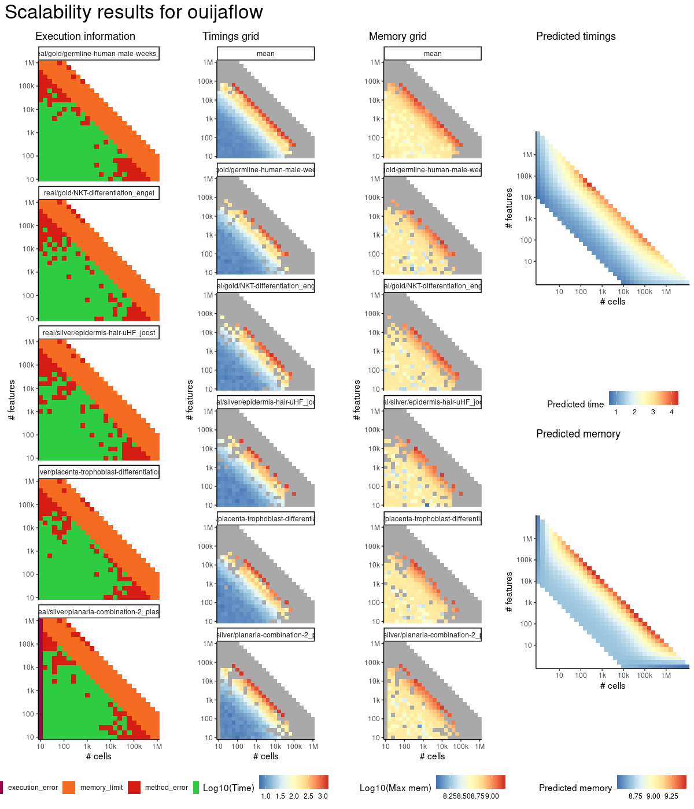
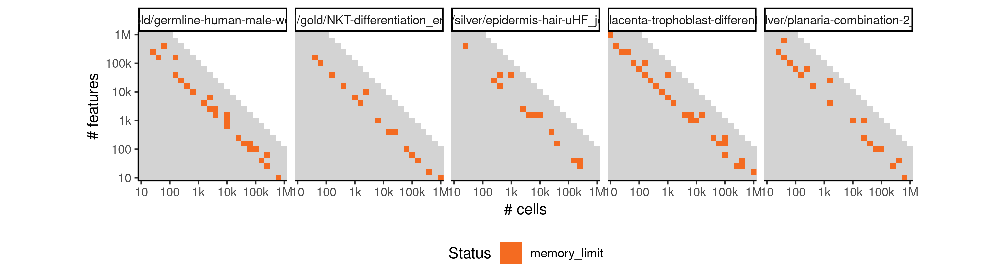
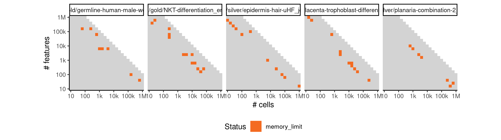
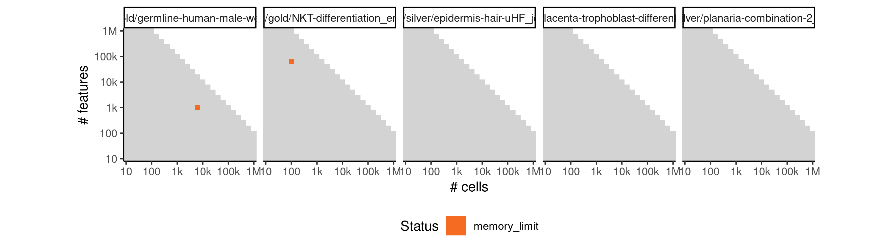
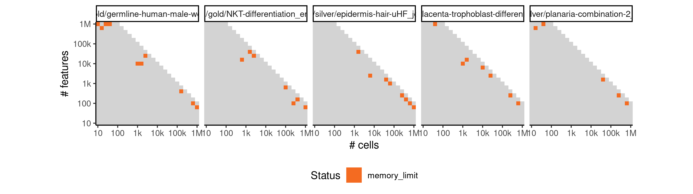
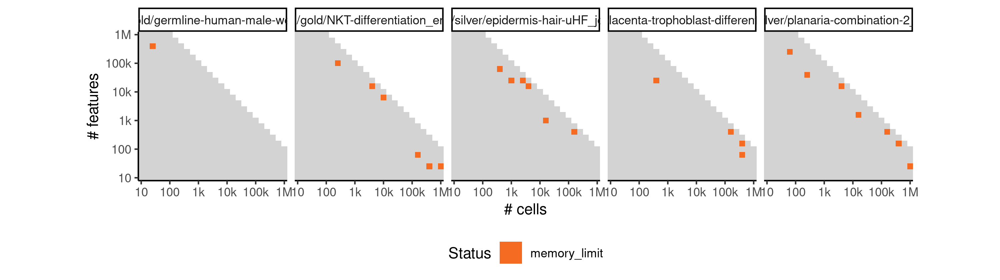
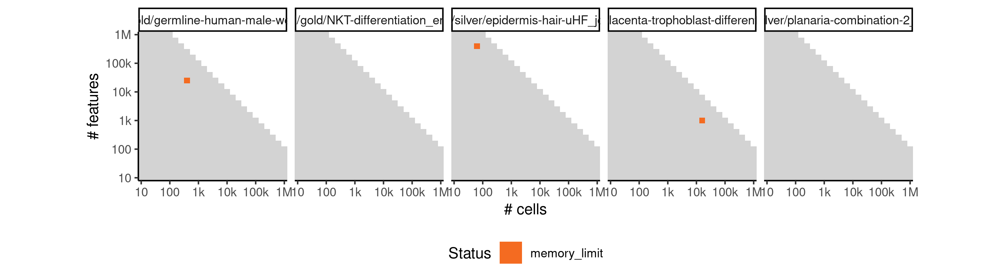
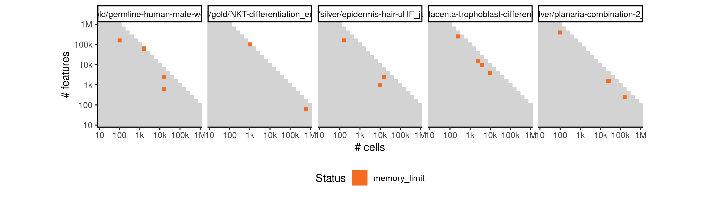

# ouijaflow


## ERROR STATUS METHOD_ERROR

### ERROR CLUSTER METHOD_ERROR -- 1


 * Number of instances: 58
 * Dataset ids: scaling_0169, scaling_0244, scaling_0306, scaling_0367, scaling_0386, scaling_0405, scaling_0414, scaling_0417, scaling_0419, scaling_0482, scaling_0485, scaling_0489, scaling_0506, scaling_0510, scaling_0526, scaling_0527, scaling_0564, scaling_0565, scaling_0566, scaling_0573, scaling_0574, scaling_0579, scaling_0591, scaling_0602, scaling_0605, scaling_0616, scaling_0647, scaling_0664, scaling_0675, scaling_0681, scaling_0682, scaling_0697, scaling_0713, scaling_0714, scaling_0715, scaling_0717, scaling_0719, scaling_0722, scaling_0724, scaling_0732, scaling_0766, scaling_0767, scaling_0779, scaling_0782, scaling_0783, scaling_0784, scaling_0789, scaling_0799, scaling_0801, scaling_0804, scaling_0806, scaling_0808, scaling_0820, scaling_0835, scaling_0837, scaling_0840, scaling_0844, scaling_0855

Last 10 lines of scaling_0169:
```
  '/data/tmp//Rtmp4elbjR/file1e8f77a5373b4/ti:/ti,/data/tmp//Rtmp4elbjR/file1e8f737da6288/tmp:/tmp2' \
  /group/irc/shared/dynverse/dynbenchmark/derived/singularity_images/dynverse/ti_ouijaflow.simg

   1/1000 [  0%]                                ETA: 6168s | Loss: 7117.907
  10/1000 [  1%]                                ETA: 615s | Loss: 7138.239 
  20/1000 [  2%]                                ETA: 307s | Loss: 4689.680
  30/1000 [  3%]                                ETA: 204s | Loss: 4261.214
  40/1000 [  4%] █                              ETA: 153s | Loss: 3957.076
  50/1000 [  5%] █                              ETA: 122s | Loss: 3970.838
  60/1000 [  6%] █                              ETA: 102s | Loss: 3891.077
  70/1000 [  7%] ██                             ETA: 88s | Loss: 3876.937 
  80/1000 [  8%] ██                             ETA: 76s | Loss: 3855.437
  90/1000 [  9%] ██                             ETA: 68s | Loss: 3847.179
 100/1000 [ 10%] ███                            ETA: 61s | Loss: 3822.257
 110/1000 [ 11%] ███                            ETA: 55s | Loss: 3765.819
 120/1000 [ 12%] ███                            ETA: 50s | Loss: 3736.076
 130/1000 [ 13%] ███                            ETA: 46s | Loss: 3710.077
 140/1000 [ 14%] ████                           ETA: 43s | Loss: 3725.122
 150/1000 [ 15%] ████                           ETA: 40s | Loss: 3703.555
 160/1000 [ 16%] ████                           ETA: 37s | Loss: 3691.901
 170/1000 [ 17%] █████                          ETA: 35s | Loss: 3725.995
 180/1000 [ 18%] █████                          ETA: 32s | Loss: 3654.241
 190/1000 [ 19%] █████                          ETA: 31s | Loss: 3625.609
 200/1000 [ 20%] ██████                         ETA: 29s | Loss: 3563.352
 210/1000 [ 21%] ██████                         ETA: 27s | Loss: 3612.641
 220/1000 [ 22%] ██████                         ETA: 26s | Loss: nan     
 230/1000 [ 23%] ██████                         ETA: 25s | Loss: nan
 240/1000 [ 24%] ███████                        ETA: 23s | Loss: nan
 250/1000 [ 25%] ███████                        ETA: 22s | Loss: nan
 260/1000 [ 26%] ███████                        ETA: 21s | Loss: nan
 270/1000 [ 27%] ████████                       ETA: 20s | Loss: nan
 280/1000 [ 28%] ████████                       ETA: 19s | Loss: nan
 290/1000 [ 28%] ████████                       ETA: 18s | Loss: nan
 300/1000 [ 30%] █████████                      ETA: 18s | Loss: nan
 310/1000 [ 31%] █████████                      ETA: 17s | Loss: nan
 320/1000 [ 32%] █████████                      ETA: 16s | Loss: nan
 330/1000 [ 33%] █████████                      ETA: 16s | Loss: nan
 340/1000 [ 34%] ██████████                     ETA: 15s | Loss: nan
 350/1000 [ 35%] ██████████                     ETA: 14s | Loss: nan
 360/1000 [ 36%] ██████████                     ETA: 14s | Loss: nan
 370/1000 [ 37%] ███████████                    ETA: 13s | Loss: nan
 380/1000 [ 38%] ███████████                    ETA: 13s | Loss: nan
 390/1000 [ 39%] ███████████                    ETA: 12s | Loss: nan
 400/1000 [ 40%] ████████████                   ETA: 12s | Loss: nan
 410/1000 [ 41%] ████████████                   ETA: 11s | Loss: nan
 420/1000 [ 42%] ████████████                   ETA: 11s | Loss: nan
 430/1000 [ 43%] ████████████                   ETA: 11s | Loss: nan
 440/1000 [ 44%] █████████████                  ETA: 10s | Loss: nan
 450/1000 [ 45%] █████████████                  ETA: 10s | Loss: nan
 460/1000 [ 46%] █████████████                  ETA: 10s | Loss: nan
 470/1000 [ 47%] ██████████████                 ETA: 9s | Loss: nan 
 480/1000 [ 48%] ██████████████                 ETA: 9s | Loss: nan
 490/1000 [ 49%] ██████████████                 ETA: 9s | Loss: nan
 500/1000 [ 50%] ███████████████                ETA: 8s | Loss: nan
 510/1000 [ 51%] ███████████████                ETA: 8s | Loss: nan
 520/1000 [ 52%] ███████████████                ETA: 8s | Loss: nan
 530/1000 [ 53%] ███████████████                ETA: 7s | Loss: nan
 540/1000 [ 54%] ████████████████               ETA: 7s | Loss: nan
 550/1000 [ 55%] ████████████████               ETA: 7s | Loss: nan
 560/1000 [ 56%] ████████████████               ETA: 7s | Loss: nan
 570/1000 [ 56%] █████████████████              ETA: 6s | Loss: nan
 580/1000 [ 57%] █████████████████              ETA: 6s | Loss: nan
 590/1000 [ 59%] █████████████████              ETA: 6s | Loss: nan
 600/1000 [ 60%] ██████████████████             ETA: 6s | Loss: nan
 610/1000 [ 61%] ██████████████████             ETA: 5s | Loss: nan
 620/1000 [ 62%] ██████████████████             ETA: 5s | Loss: nan
 630/1000 [ 63%] ██████████████████             ETA: 5s | Loss: nan
 640/1000 [ 64%] ███████████████████            ETA: 5s | Loss: nan
 650/1000 [ 65%] ███████████████████            ETA: 5s | Loss: nan
 660/1000 [ 66%] ███████████████████            ETA: 4s | Loss: nan
 670/1000 [ 67%] ████████████████████           ETA: 4s | Loss: nan
 680/1000 [ 68%] ████████████████████           ETA: 4s | Loss: nan
 690/1000 [ 69%] ████████████████████           ETA: 4s | Loss: nan
 700/1000 [ 70%] █████████████████████          ETA: 4s | Loss: nan
 710/1000 [ 71%] █████████████████████          ETA: 4s | Loss: nan
 720/1000 [ 72%] █████████████████████          ETA: 3s | Loss: nan
 730/1000 [ 73%] █████████████████████          ETA: 3s | Loss: nan
 740/1000 [ 74%] ██████████████████████         ETA: 3s | Loss: nan
 750/1000 [ 75%] ██████████████████████         ETA: 3s | Loss: nan
 760/1000 [ 76%] ██████████████████████         ETA: 3s | Loss: nan
 770/1000 [ 77%] ███████████████████████        ETA: 3s | Loss: nan
 780/1000 [ 78%] ███████████████████████        ETA: 2s | Loss: nan
 790/1000 [ 79%] ███████████████████████        ETA: 2s | Loss: nan
 800/1000 [ 80%] ████████████████████████       ETA: 2s | Loss: nan
 810/1000 [ 81%] ████████████████████████       ETA: 2s | Loss: nan
 820/1000 [ 82%] ████████████████████████       ETA: 2s | Loss: nan
 830/1000 [ 83%] ████████████████████████       ETA: 2s | Loss: nan
 840/1000 [ 84%] █████████████████████████      ETA: 2s | Loss: nan
 850/1000 [ 85%] █████████████████████████      ETA: 1s | Loss: nan
 860/1000 [ 86%] █████████████████████████      ETA: 1s | Loss: nan
 870/1000 [ 87%] ██████████████████████████     ETA: 1s | Loss: nan
 880/1000 [ 88%] ██████████████████████████     ETA: 1s | Loss: nan
 890/1000 [ 89%] ██████████████████████████     ETA: 1s | Loss: nan
 900/1000 [ 90%] ███████████████████████████    ETA: 1s | Loss: nan
 910/1000 [ 91%] ███████████████████████████    ETA: 1s | Loss: nan
 920/1000 [ 92%] ███████████████████████████    ETA: 0s | Loss: nan
 930/1000 [ 93%] ███████████████████████████    ETA: 0s | Loss: nan
 940/1000 [ 94%] ████████████████████████████   ETA: 0s | Loss: nan
 950/1000 [ 95%] ████████████████████████████   ETA: 0s | Loss: nan
 960/1000 [ 96%] ████████████████████████████   ETA: 0s | Loss: nan
 970/1000 [ 97%] █████████████████████████████  ETA: 0s | Loss: nan
 980/1000 [ 98%] █████████████████████████████  ETA: 0s | Loss: nan
 990/1000 [ 99%] █████████████████████████████  ETA: 0s | Loss: nan
1000/1000 [100%] ██████████████████████████████ Elapsed: 11s | Loss: nan/usr/local/lib/python3.6/site-packages/edward/util/random_variables.py:52: FutureWarning: Conversion of the second argument of issubdtype from `float` to `np.floating` is deprecated. In future, it will be treated as `np.float64 == np.dtype(float).type`.
  not np.issubdtype(value.dtype, np.float) and \
output saved in /data/tmp//Rtmp4elbjR/file1e8f77a5373b4/ti/output: 
	cell_ids.csv
	pseudotime.csv
	timings.json
all(pg_check >= 0 & pg_check < (1 + 1e-06)) isn't true.
Sum of progressions per cell_id should be exactly one
```

## ERROR STATUS MEMORY_LIMIT

### ERROR CLUSTER MEMORY_LIMIT -- 1


 * Number of instances: 85
 * Dataset ids: scaling_0856, scaling_0857, scaling_0858, scaling_0859, scaling_0860, scaling_0862, scaling_0863, scaling_0864, scaling_0866, scaling_0867, scaling_0868, scaling_0869, scaling_0870, scaling_0871, scaling_0872, scaling_0873, scaling_0875, scaling_0876, scaling_0877, scaling_0878, scaling_0879, scaling_0882, scaling_0883, scaling_0884, scaling_0885, scaling_0887, scaling_0888, scaling_0889, scaling_0890, scaling_0892, scaling_0893, scaling_0894, scaling_0895, scaling_0896, scaling_0898, scaling_0899, scaling_0903, scaling_0904, scaling_0907, scaling_0908, scaling_0909, scaling_0910, scaling_0912, scaling_0913, scaling_0914, scaling_0915, scaling_0916, scaling_0917, scaling_0918, scaling_0919, scaling_0920, scaling_0921, scaling_0923, scaling_0924, scaling_0925, scaling_0927, scaling_0928, scaling_0929, scaling_0930, scaling_0931, scaling_0932, scaling_0933, scaling_0935, scaling_0936, scaling_0937, scaling_0938, scaling_0939, scaling_0940, scaling_0941, scaling_0943, scaling_0944, scaling_0945, scaling_0947, scaling_0948, scaling_0949, scaling_0950, scaling_0958, scaling_0962, scaling_0969, scaling_0977, scaling_0982, scaling_0984, scaling_1025, scaling_1031, scaling_1045

Last 10 lines of scaling_0856:
```
    reduction_indices=reduction_indices))
  File "/usr/local/lib/python3.6/site-packages/tensorflow/python/util/deprecation.py", line 432, in new_func
    return func(*args, **kwargs)
  File "/usr/local/lib/python3.6/site-packages/tensorflow/python/ops/math_ops.py", line 1373, in reduce_sum
    name=name))
  File "/usr/local/lib/python3.6/site-packages/tensorflow/python/ops/gen_math_ops.py", line 4864, in _sum
    name=name)
ResourceExhaustedError (see above for traceback): OOM when allocating tensor with shape[2,10,39811] and type float on /job:localhost/replica:0/task:0/device:CPU:0 by allocator cpu
	 [[Node: gradients/inference/sample/DropoutNormal_1/log_prob/ReduceLogSumExp/Sum_grad/Tile = Tile[T=DT_FLOAT, Tmultiples=DT_INT32, _device="/job:localhost/replica:0/task:0/device:CPU:0"](gradients/inference/sample/DropoutNormal_1/log_prob/ReduceLogSumExp/Sum_grad/Reshape, gradients/inference/sample/DropoutNormal_1/log_prob/ReduceLogSumExp/Sum_grad/floordiv)]]
Hint: If you want to see a list of allocated tensors when OOM happens, add report_tensor_allocations_upon_oom to RunOptions for current allocation info.
```

### ERROR CLUSTER MEMORY_LIMIT -- 2


 * Number of instances: 11
 * Dataset ids: scaling_0861, scaling_0874, scaling_0880, scaling_0886, scaling_0902, scaling_0911, scaling_0922, scaling_0926, scaling_0971, scaling_0980, scaling_1013

Last 10 lines of scaling_0861:
```
    reduction_indices=reduction_indices))
  File "/usr/local/lib/python3.6/site-packages/tensorflow/python/ops/gen_math_ops.py", line 2326, in log
    "Log", x=x, name=name)
  File "/usr/local/lib/python3.6/site-packages/tensorflow/python/framework/op_def_library.py", line 787, in _apply_op_helper
    op_def=op_def)
  File "/usr/local/lib/python3.6/site-packages/tensorflow/python/framework/ops.py", line 3271, in create_op
    op_def=op_def)
ResourceExhaustedError (see above for traceback): OOM when allocating tensor with shape[631,631] and type float on /job:localhost/replica:0/task:0/device:CPU:0 by allocator cpu
	 [[Node: gradients/inference/sample/DropoutNormal_1/log_prob/ReduceLogSumExp/Log_grad/Reciprocal = Reciprocal[T=DT_FLOAT, _device="/job:localhost/replica:0/task:0/device:CPU:0"](inference/sample/DropoutNormal_1/log_prob/ReduceLogSumExp/Sum, ^gradients/inference/sample/DropoutNormal_1/log_prob/Select_grad/Select)]]
Hint: If you want to see a list of allocated tensors when OOM happens, add report_tensor_allocations_upon_oom to RunOptions for current allocation info.
```

### ERROR CLUSTER MEMORY_LIMIT -- 3


 * Number of instances: 5
 * Dataset ids: scaling_0865, scaling_0897, scaling_0905, scaling_0993, scaling_1005

Last 10 lines of scaling_0865:
```
    "Log", x=x, name=name)
  File "/usr/local/lib/python3.6/site-packages/tensorflow/python/framework/op_def_library.py", line 787, in _apply_op_helper
    op_def=op_def)
  File "/usr/local/lib/python3.6/site-packages/tensorflow/python/framework/ops.py", line 3271, in create_op
    op_def=op_def)
  File "/usr/local/lib/python3.6/site-packages/tensorflow/python/framework/ops.py", line 1650, in __init__
    self._traceback = self._graph._extract_stack()  # pylint: disable=protected-access
ResourceExhaustedError (see above for traceback): OOM when allocating tensor with shape[15849,25] and type float on /job:localhost/replica:0/task:0/device:CPU:0 by allocator cpu
	 [[Node: inference/sample/DropoutNormal_1/log_prob/ReduceLogSumExp/Log = Log[T=DT_FLOAT, _device="/job:localhost/replica:0/task:0/device:CPU:0"](inference/sample/DropoutNormal_1/log_prob/ReduceLogSumExp/Sum)]]
Hint: If you want to see a list of allocated tensors when OOM happens, add report_tensor_allocations_upon_oom to RunOptions for current allocation info.
```

### ERROR CLUSTER MEMORY_LIMIT -- 4


 * Number of instances: 5
 * Dataset ids: scaling_0881, scaling_0957, scaling_1006, scaling_1024, scaling_1032

Last 10 lines of scaling_0881:
```
    "Add", x=x, y=y, name=name)
  File "/usr/local/lib/python3.6/site-packages/tensorflow/python/framework/op_def_library.py", line 787, in _apply_op_helper
    op_def=op_def)
  File "/usr/local/lib/python3.6/site-packages/tensorflow/python/framework/ops.py", line 3271, in create_op
    op_def=op_def)
  File "/usr/local/lib/python3.6/site-packages/tensorflow/python/framework/ops.py", line 1650, in __init__
    self._traceback = self._graph._extract_stack()  # pylint: disable=protected-access
ResourceExhaustedError (see above for traceback): OOM when allocating tensor with shape[100,3981] and type float on /job:localhost/replica:0/task:0/device:CPU:0 by allocator cpu
	 [[Node: inference/sample/DropoutNormal_1/log_prob/add = Add[T=DT_FLOAT, _device="/job:localhost/replica:0/task:0/device:CPU:0"](inference/sample/DropoutNormal_1/log_prob/Neg, inference/sample/DropoutNormal_1/log_prob/LogSigmoid)]]
Hint: If you want to see a list of allocated tensors when OOM happens, add report_tensor_allocations_upon_oom to RunOptions for current allocation info.
```

### ERROR CLUSTER MEMORY_LIMIT -- 5


 * Number of instances: 2
 * Dataset ids: scaling_0891, scaling_1023

Last 10 lines of scaling_0891:
```
    return gen_math_ops._mul(x, y, name=name)
  File "/usr/local/lib/python3.6/site-packages/tensorflow/python/ops/gen_math_ops.py", line 2789, in _mul
    "Mul", x=x, y=y, name=name)
  File "/usr/local/lib/python3.6/site-packages/tensorflow/python/framework/op_def_library.py", line 787, in _apply_op_helper
    op_def=op_def)
  File "/usr/local/lib/python3.6/site-packages/tensorflow/python/framework/ops.py", line 3271, in create_op
    op_def=op_def)
ResourceExhaustedError (see above for traceback): OOM when allocating tensor with shape[40,10000] and type float on /job:localhost/replica:0/task:0/device:CPU:0 by allocator cpu
	 [[Node: gradients/inference/sample/DropoutNormal_1/log_prob/mul_grad/mul_1 = Mul[T=DT_FLOAT, _device="/job:localhost/replica:0/task:0/device:CPU:0"](inference/sample/DropoutNormal_1/log_prob/mul/x, gradients/inference/sample/DropoutNormal_1/log_prob/stack_grad/unstack:1)]]
Hint: If you want to see a list of allocated tensors when OOM happens, add report_tensor_allocations_upon_oom to RunOptions for current allocation info.
```

### ERROR CLUSTER MEMORY_LIMIT -- 6


 * Number of instances: 19
 * Dataset ids: scaling_0901, scaling_0906, scaling_0934, scaling_0942, scaling_0946, scaling_0954, scaling_0964, scaling_0975, scaling_0983, scaling_0985, scaling_0989, scaling_1000, scaling_1011, scaling_1014, scaling_1015, scaling_1018, scaling_1021, scaling_1040, scaling_1050

Last 10 lines of scaling_0901:
```
    "Pack", values=values, axis=axis, name=name)
  File "/usr/local/lib/python3.6/site-packages/tensorflow/python/framework/op_def_library.py", line 787, in _apply_op_helper
    op_def=op_def)
  File "/usr/local/lib/python3.6/site-packages/tensorflow/python/framework/ops.py", line 3271, in create_op
    op_def=op_def)
  File "/usr/local/lib/python3.6/site-packages/tensorflow/python/framework/ops.py", line 1650, in __init__
    self._traceback = self._graph._extract_stack()  # pylint: disable=protected-access
ResourceExhaustedError (see above for traceback): OOM when allocating tensor with shape[2,25,15849] and type float on /job:localhost/replica:0/task:0/device:CPU:0 by allocator cpu
	 [[Node: inference/sample/DropoutNormal_1/log_prob/stack = Pack[N=2, T=DT_FLOAT, axis=0, _device="/job:localhost/replica:0/task:0/device:CPU:0"](inference/sample/DropoutNormal_1/log_prob/LogSigmoid_1, inference/sample/DropoutNormal_1/log_prob/add_2)]]
Hint: If you want to see a list of allocated tensors when OOM happens, add report_tensor_allocations_upon_oom to RunOptions for current allocation info.
```

### ERROR CLUSTER MEMORY_LIMIT -- 7


 * Number of instances: 6
 * Dataset ids: scaling_0951, scaling_0968, scaling_1003, scaling_1027, scaling_1036, scaling_1038

Last 10 lines of scaling_0951:
```
    return gen_math_ops._mul(x, y, name=name)
  File "/usr/local/lib/python3.6/site-packages/tensorflow/python/ops/gen_math_ops.py", line 2789, in _mul
    "Mul", x=x, y=y, name=name)
  File "/usr/local/lib/python3.6/site-packages/tensorflow/python/framework/op_def_library.py", line 787, in _apply_op_helper
    op_def=op_def)
  File "/usr/local/lib/python3.6/site-packages/tensorflow/python/framework/ops.py", line 3271, in create_op
    op_def=op_def)
ResourceExhaustedError (see above for traceback): OOM when allocating tensor with shape[16,39811] and type float on /job:localhost/replica:0/task:0/device:CPU:0 by allocator cpu
	 [[Node: gradients/inference/sample/DropoutNormal_1/log_prob/mul_1_grad/mul_1 = Mul[T=DT_FLOAT, _device="/job:localhost/replica:0/task:0/device:CPU:0"](inference/sample/DropoutNormal_1/log_prob/mul_1/x, gradients/inference/sample/DropoutNormal_1/log_prob/Select_grad/Select_1)]]
Hint: If you want to see a list of allocated tensors when OOM happens, add report_tensor_allocations_upon_oom to RunOptions for current allocation info.
```

### ERROR CLUSTER MEMORY_LIMIT -- 8


 * Number of instances: 11
 * Dataset ids: scaling_0952, scaling_0965, scaling_0966, scaling_0967, scaling_0973, scaling_0994, scaling_1020, scaling_1026, scaling_1029, scaling_1044, scaling_1048

Last 10 lines of scaling_0952:
```
    "Add", x=x, y=y, name=name)
  File "/usr/local/lib/python3.6/site-packages/tensorflow/python/framework/op_def_library.py", line 787, in _apply_op_helper
    op_def=op_def)
  File "/usr/local/lib/python3.6/site-packages/tensorflow/python/framework/ops.py", line 3271, in create_op
    op_def=op_def)
  File "/usr/local/lib/python3.6/site-packages/tensorflow/python/framework/ops.py", line 1650, in __init__
    self._traceback = self._graph._extract_stack()  # pylint: disable=protected-access
ResourceExhaustedError (see above for traceback): OOM when allocating tensor with shape[63,10000] and type float on /job:localhost/replica:0/task:0/device:CPU:0 by allocator cpu
	 [[Node: inference/sample/DropoutNormal_1/log_prob/add_2 = Add[T=DT_FLOAT, _device="/job:localhost/replica:0/task:0/device:CPU:0"](inference/sample/DropoutNormal_1/log_prob/add, inference/sample/DropoutNormal_1/log_prob/sub)]]
Hint: If you want to see a list of allocated tensors when OOM happens, add report_tensor_allocations_upon_oom to RunOptions for current allocation info.
```

### ERROR CLUSTER MEMORY_LIMIT -- 9


 * Number of instances: 3
 * Dataset ids: scaling_0953, scaling_0998, scaling_1035

Last 10 lines of scaling_0953:
```
    "Log", x=x, name=name)
  File "/usr/local/lib/python3.6/site-packages/tensorflow/python/framework/op_def_library.py", line 787, in _apply_op_helper
    op_def=op_def)
  File "/usr/local/lib/python3.6/site-packages/tensorflow/python/framework/ops.py", line 3271, in create_op
    op_def=op_def)
  File "/usr/local/lib/python3.6/site-packages/tensorflow/python/framework/ops.py", line 1650, in __init__
    self._traceback = self._graph._extract_stack()  # pylint: disable=protected-access
ResourceExhaustedError (see above for traceback): OOM when allocating tensor with shape[631,1000] and type float on /job:localhost/replica:0/task:0/device:CPU:0 by allocator cpu
	 [[Node: inference/sample/DropoutNormal_1/log_prob/Log = Log[T=DT_FLOAT, _device="/job:localhost/replica:0/task:0/device:CPU:0"](inference/sample/DropoutNormal_1/log_prob/Normal/scale)]]
Hint: If you want to see a list of allocated tensors when OOM happens, add report_tensor_allocations_upon_oom to RunOptions for current allocation info.
```

### ERROR CLUSTER MEMORY_LIMIT -- 10


 * Number of instances: 5
 * Dataset ids: scaling_0955, scaling_0974, scaling_0987, scaling_1010, scaling_1041

Last 10 lines of scaling_0955:
```
    return gen_math_ops.square(x, name=name)
  File "/usr/local/lib/python3.6/site-packages/tensorflow/python/ops/gen_math_ops.py", line 4751, in square
    "Square", x=x, name=name)
  File "/usr/local/lib/python3.6/site-packages/tensorflow/python/framework/op_def_library.py", line 787, in _apply_op_helper
    op_def=op_def)
  File "/usr/local/lib/python3.6/site-packages/tensorflow/python/framework/ops.py", line 3271, in create_op
    op_def=op_def)
ResourceExhaustedError (see above for traceback): OOM when allocating tensor with shape[10000,63] and type float on /job:localhost/replica:0/task:0/device:CPU:0 by allocator cpu
	 [[Node: gradients/inference/sample/DropoutNormal_1/log_prob/Square_1_grad/Mul = Mul[T=DT_FLOAT, _device="/job:localhost/replica:0/task:0/device:CPU:0"](inference/sample/DropoutNormal_1/log_prob/standardize_1/truediv, gradients/inference/sample/DropoutNormal_1/log_prob/Square_1_grad/Mul/y)]]
Hint: If you want to see a list of allocated tensors when OOM happens, add report_tensor_allocations_upon_oom to RunOptions for current allocation info.
```

### ERROR CLUSTER MEMORY_LIMIT -- 11


 * Number of instances: 4
 * Dataset ids: scaling_0956, scaling_0992, scaling_0995, scaling_1008

Last 10 lines of scaling_0956:
```
    return 0.5 * math.log(2. * math.pi) + math_ops.log(self.scale)
  File "/usr/local/lib/python3.6/site-packages/tensorflow/python/ops/gen_math_ops.py", line 2326, in log
    "Log", x=x, name=name)
  File "/usr/local/lib/python3.6/site-packages/tensorflow/python/framework/op_def_library.py", line 787, in _apply_op_helper
    op_def=op_def)
  File "/usr/local/lib/python3.6/site-packages/tensorflow/python/framework/ops.py", line 3271, in create_op
    op_def=op_def)
ResourceExhaustedError (see above for traceback): OOM when allocating tensor with shape[39811,16] and type float on /job:localhost/replica:0/task:0/device:CPU:0 by allocator cpu
	 [[Node: gradients/inference/sample/DropoutNormal_1/log_prob/Log_1_grad/Reciprocal = Reciprocal[T=DT_FLOAT, _device="/job:localhost/replica:0/task:0/device:CPU:0"](inference/sample/DropoutNormal_1/log_prob/Normal_1/scale, ^gradients/inference/sample/DropoutNormal_1/log_prob/add_3_grad/Reshape_1)]]
Hint: If you want to see a list of allocated tensors when OOM happens, add report_tensor_allocations_upon_oom to RunOptions for current allocation info.
```

### ERROR CLUSTER MEMORY_LIMIT -- 12


 * Number of instances: 2
 * Dataset ids: scaling_0959, scaling_0978

Last 10 lines of scaling_0959:
```
    "Select", condition=condition, t=x, e=y, name=name)
  File "/usr/local/lib/python3.6/site-packages/tensorflow/python/framework/op_def_library.py", line 787, in _apply_op_helper
    op_def=op_def)
  File "/usr/local/lib/python3.6/site-packages/tensorflow/python/framework/ops.py", line 3271, in create_op
    op_def=op_def)
  File "/usr/local/lib/python3.6/site-packages/tensorflow/python/framework/ops.py", line 1650, in __init__
    self._traceback = self._graph._extract_stack()  # pylint: disable=protected-access
ResourceExhaustedError (see above for traceback): OOM when allocating tensor with shape[631,1000] and type float on /job:localhost/replica:0/task:0/device:CPU:0 by allocator cpu
	 [[Node: gradients/inference/sample/DropoutNormal_1/log_prob/Select_grad/Select_1 = Select[T=DT_FLOAT, _device="/job:localhost/replica:0/task:0/device:CPU:0"](inference/sample/DropoutNormal_1/log_prob/Equal, gradients/inference/sample/DropoutNormal_1/log_prob/Select_grad/zeros_like, gradients/mul_22_grad/Reshape_1)]]
Hint: If you want to see a list of allocated tensors when OOM happens, add report_tensor_allocations_upon_oom to RunOptions for current allocation info.
```

### ERROR CLUSTER MEMORY_LIMIT -- 13


 * Number of instances: 6
 * Dataset ids: scaling_0960, scaling_0981, scaling_0986, scaling_1012, scaling_1017, scaling_1042

Last 10 lines of scaling_0960:
```
    return -0.5 * math_ops.square(self._z(x))
  File "/usr/local/lib/python3.6/site-packages/tensorflow/python/ops/distributions/normal.py", line 232, in _z
    return (x - self.loc) / self.scale
  File "/usr/local/lib/python3.6/site-packages/tensorflow/python/ops/math_ops.py", line 934, in binary_op_wrapper
    return func(x, y, name=name)
  File "/usr/local/lib/python3.6/site-packages/tensorflow/python/ops/math_ops.py", line 1030, in _truediv_python3
    return gen_math_ops._real_div(x, y, name=name)
ResourceExhaustedError (see above for traceback): OOM when allocating tensor with shape[1000,631] and type float on /job:localhost/replica:0/task:0/device:CPU:0 by allocator cpu
	 [[Node: gradients/inference/sample/DropoutNormal_1/log_prob/standardize/truediv_grad/Neg = Neg[T=DT_FLOAT, _device="/job:localhost/replica:0/task:0/device:CPU:0"](inference/sample/DropoutNormal_1/log_prob/standardize/sub)]]
Hint: If you want to see a list of allocated tensors when OOM happens, add report_tensor_allocations_upon_oom to RunOptions for current allocation info.
```

### ERROR CLUSTER MEMORY_LIMIT -- 14


 * Number of instances: 5
 * Dataset ids: scaling_0961, scaling_1007, scaling_1019, scaling_1022, scaling_1043

Last 10 lines of scaling_0961:
```
    return -0.5 * math_ops.square(self._z(x))
  File "/usr/local/lib/python3.6/site-packages/tensorflow/python/ops/distributions/normal.py", line 232, in _z
    return (x - self.loc) / self.scale
  File "/usr/local/lib/python3.6/site-packages/tensorflow/python/ops/math_ops.py", line 934, in binary_op_wrapper
    return func(x, y, name=name)
  File "/usr/local/lib/python3.6/site-packages/tensorflow/python/ops/math_ops.py", line 1030, in _truediv_python3
    return gen_math_ops._real_div(x, y, name=name)
ResourceExhaustedError (see above for traceback): OOM when allocating tensor with shape[10000,63] and type float on /job:localhost/replica:0/task:0/device:CPU:0 by allocator cpu
	 [[Node: gradients/inference/sample/DropoutNormal_1/log_prob/standardize_1/truediv_grad/RealDiv = RealDiv[T=DT_FLOAT, _device="/job:localhost/replica:0/task:0/device:CPU:0"](gradients/inference/sample/DropoutNormal_1/log_prob/Square_1_grad/Mul_1, inference/sample/DropoutNormal_1/log_prob/Normal_1/scale)]]
Hint: If you want to see a list of allocated tensors when OOM happens, add report_tensor_allocations_upon_oom to RunOptions for current allocation info.
```

### ERROR CLUSTER MEMORY_LIMIT -- 15


 * Number of instances: 5
 * Dataset ids: scaling_0963, scaling_0970, scaling_1004, scaling_1028, scaling_1033

Last 10 lines of scaling_0963:
```
    "Softplus", features=features, name=name)
  File "/usr/local/lib/python3.6/site-packages/tensorflow/python/framework/op_def_library.py", line 787, in _apply_op_helper
    op_def=op_def)
  File "/usr/local/lib/python3.6/site-packages/tensorflow/python/framework/ops.py", line 3271, in create_op
    op_def=op_def)
  File "/usr/local/lib/python3.6/site-packages/tensorflow/python/framework/ops.py", line 1650, in __init__
    self._traceback = self._graph._extract_stack()  # pylint: disable=protected-access
ResourceExhaustedError (see above for traceback): OOM when allocating tensor with shape[16,39811] and type float on /job:localhost/replica:0/task:0/device:CPU:0 by allocator cpu
	 [[Node: inference/sample/DropoutNormal_1/log_prob/LogSigmoid/Softplus = Softplus[T=DT_FLOAT, _device="/job:localhost/replica:0/task:0/device:CPU:0"](inference/sample/DropoutNormal_1/log_prob/LogSigmoid/Neg)]]
Hint: If you want to see a list of allocated tensors when OOM happens, add report_tensor_allocations_upon_oom to RunOptions for current allocation info.
```

### ERROR CLUSTER MEMORY_LIMIT -- 16


 * Number of instances: 2
 * Dataset ids: scaling_0972, scaling_0997

Last 10 lines of scaling_0972:
```
    return func(x, y, name=name)
  File "/usr/local/lib/python3.6/site-packages/tensorflow/python/ops/gen_math_ops.py", line 4819, in _sub
    "Sub", x=x, y=y, name=name)
  File "/usr/local/lib/python3.6/site-packages/tensorflow/python/framework/op_def_library.py", line 787, in _apply_op_helper
    op_def=op_def)
  File "/usr/local/lib/python3.6/site-packages/tensorflow/python/framework/ops.py", line 3271, in create_op
    op_def=op_def)
ResourceExhaustedError (see above for traceback): OOM when allocating tensor with shape[1000,631] and type float on /job:localhost/replica:0/task:0/device:CPU:0 by allocator cpu
	 [[Node: gradients/inference/sample/DropoutNormal_1/log_prob/sub_1_grad/Neg = Neg[T=DT_FLOAT, _device="/job:localhost/replica:0/task:0/device:CPU:0"](gradients/inference/sample/DropoutNormal_1/log_prob/Select_grad/Select_1)]]
Hint: If you want to see a list of allocated tensors when OOM happens, add report_tensor_allocations_upon_oom to RunOptions for current allocation info.
```

### ERROR CLUSTER MEMORY_LIMIT -- 17


 * Number of instances: 1
 * Dataset ids: scaling_0976

Last 10 lines of scaling_0976:
```
    elem = copy(x, dict_swap, scope, True, copy_q, False)
  File "/usr/local/lib/python3.6/site-packages/edward/util/random_variables.py", line 270, in copy
    new_op = copy(op, dict_swap, scope, True, copy_q, False)
  File "/usr/local/lib/python3.6/site-packages/edward/util/random_variables.py", line 316, in copy
    op_def)
  File "/usr/local/lib/python3.6/site-packages/tensorflow/python/framework/ops.py", line 1650, in __init__
    self._traceback = self._graph._extract_stack()  # pylint: disable=protected-access
ResourceExhaustedError (see above for traceback): OOM when allocating tensor with shape[63,10000] and type float on /job:localhost/replica:0/task:0/device:CPU:0 by allocator cpu
	 [[Node: gradients/inference/sample/mul_7_grad/mul_1 = Mul[T=DT_FLOAT, _device="/job:localhost/replica:0/task:0/device:CPU:0"](inference/sample/qmu0/sample/exp/forward/Exp, gradients/AddN_9)]]
Hint: If you want to see a list of allocated tensors when OOM happens, add report_tensor_allocations_upon_oom to RunOptions for current allocation info.
```

### ERROR CLUSTER MEMORY_LIMIT -- 18


 * Number of instances: 4
 * Dataset ids: scaling_0979, scaling_0988, scaling_0991, scaling_1016

Last 10 lines of scaling_0979:
```
    elem = copy(x, dict_swap, scope, True, copy_q, False)
  File "/usr/local/lib/python3.6/site-packages/edward/util/random_variables.py", line 270, in copy
    new_op = copy(op, dict_swap, scope, True, copy_q, False)
  File "/usr/local/lib/python3.6/site-packages/edward/util/random_variables.py", line 316, in copy
    op_def)
  File "/usr/local/lib/python3.6/site-packages/tensorflow/python/framework/ops.py", line 1650, in __init__
    self._traceback = self._graph._extract_stack()  # pylint: disable=protected-access
ResourceExhaustedError (see above for traceback): OOM when allocating tensor with shape[10000,63] and type float on /job:localhost/replica:0/task:0/device:CPU:0 by allocator cpu
	 [[Node: inference/sample/mul_7 = Mul[T=DT_FLOAT, _device="/job:localhost/replica:0/task:0/device:CPU:0"](inference/sample/qmu0/sample/exp/forward/Exp, inference/sample/Sigmoid)]]
Hint: If you want to see a list of allocated tensors when OOM happens, add report_tensor_allocations_upon_oom to RunOptions for current allocation info.
```

### ERROR CLUSTER MEMORY_LIMIT -- 19


 * Number of instances: 2
 * Dataset ids: scaling_0990, scaling_1030

Last 10 lines of scaling_0990:
```
    "Sub", x=x, y=y, name=name)
  File "/usr/local/lib/python3.6/site-packages/tensorflow/python/framework/op_def_library.py", line 787, in _apply_op_helper
    op_def=op_def)
  File "/usr/local/lib/python3.6/site-packages/tensorflow/python/framework/ops.py", line 3271, in create_op
    op_def=op_def)
  File "/usr/local/lib/python3.6/site-packages/tensorflow/python/framework/ops.py", line 1650, in __init__
    self._traceback = self._graph._extract_stack()  # pylint: disable=protected-access
ResourceExhaustedError (see above for traceback): OOM when allocating tensor with shape[3981,158] and type float on /job:localhost/replica:0/task:0/device:CPU:0 by allocator cpu
	 [[Node: inference/sample/DropoutNormal_1/log_prob/standardize/sub = Sub[T=DT_FLOAT, _device="/job:localhost/replica:0/task:0/device:CPU:0"](data/Variable/read, inference/sample/DropoutNormal_1/log_prob/Normal/loc)]]
Hint: If you want to see a list of allocated tensors when OOM happens, add report_tensor_allocations_upon_oom to RunOptions for current allocation info.
```

### ERROR CLUSTER MEMORY_LIMIT -- 20


 * Number of instances: 2
 * Dataset ids: scaling_0996, scaling_1039

Last 10 lines of scaling_0996:
```
    elem = copy(x, dict_swap, scope, True, copy_q, False)
  File "/usr/local/lib/python3.6/site-packages/edward/util/random_variables.py", line 270, in copy
    new_op = copy(op, dict_swap, scope, True, copy_q, False)
  File "/usr/local/lib/python3.6/site-packages/edward/util/random_variables.py", line 316, in copy
    op_def)
  File "/usr/local/lib/python3.6/site-packages/tensorflow/python/framework/ops.py", line 1650, in __init__
    self._traceback = self._graph._extract_stack()  # pylint: disable=protected-access
ResourceExhaustedError (see above for traceback): OOM when allocating tensor with shape[25,25119] and type float on /job:localhost/replica:0/task:0/device:CPU:0 by allocator cpu
	 [[Node: inference/sample/mul_8 = Mul[T=DT_FLOAT, _device="/job:localhost/replica:0/task:0/device:CPU:0"](inference/sample/strided_slice_1, inference/sample/mul_7)]]
Hint: If you want to see a list of allocated tensors when OOM happens, add report_tensor_allocations_upon_oom to RunOptions for current allocation info.
```

### ERROR CLUSTER MEMORY_LIMIT -- 21


 * Number of instances: 1
 * Dataset ids: scaling_0999

Last 10 lines of scaling_0999:
```
    "Square", x=x, name=name)
  File "/usr/local/lib/python3.6/site-packages/tensorflow/python/framework/op_def_library.py", line 787, in _apply_op_helper
    op_def=op_def)
  File "/usr/local/lib/python3.6/site-packages/tensorflow/python/framework/ops.py", line 3271, in create_op
    op_def=op_def)
  File "/usr/local/lib/python3.6/site-packages/tensorflow/python/framework/ops.py", line 1650, in __init__
    self._traceback = self._graph._extract_stack()  # pylint: disable=protected-access
ResourceExhaustedError (see above for traceback): OOM when allocating tensor with shape[158,3981] and type float on /job:localhost/replica:0/task:0/device:CPU:0 by allocator cpu
	 [[Node: inference/sample/DropoutNormal_1/log_prob/Square = Square[T=DT_FLOAT, _device="/job:localhost/replica:0/task:0/device:CPU:0"](inference/sample/DropoutNormal_1/log_prob/standardize/truediv)]]
Hint: If you want to see a list of allocated tensors when OOM happens, add report_tensor_allocations_upon_oom to RunOptions for current allocation info.
```

### ERROR CLUSTER MEMORY_LIMIT -- 22


 * Number of instances: 2
 * Dataset ids: scaling_1001, scaling_1046

Last 10 lines of scaling_1001:
```
    lp_amp = -prob_dropout_logit + tf.log_sigmoid(prob_dropout_logit)
  File "/usr/local/lib/python3.6/site-packages/tensorflow/python/ops/math_ops.py", line 2301, in log_sigmoid
    return gen_math_ops._neg(gen_nn_ops.softplus(-x), name=name)
  File "/usr/local/lib/python3.6/site-packages/tensorflow/python/ops/gen_nn_ops.py", line 4607, in softplus
    "Softplus", features=features, name=name)
  File "/usr/local/lib/python3.6/site-packages/tensorflow/python/framework/op_def_library.py", line 787, in _apply_op_helper
    op_def=op_def)
ResourceExhaustedError (see above for traceback): OOM when allocating tensor with shape[398,1585] and type float on /job:localhost/replica:0/task:0/device:CPU:0 by allocator cpu
	 [[Node: gradients/inference/sample/DropoutNormal_1/log_prob/LogSigmoid/Softplus_grad/SoftplusGrad = SoftplusGrad[T=DT_FLOAT, _device="/job:localhost/replica:0/task:0/device:CPU:0"](gradients/inference/sample/DropoutNormal_1/log_prob/LogSigmoid_grad/Neg, inference/sample/DropoutNormal_1/log_prob/LogSigmoid/Neg)]]
Hint: If you want to see a list of allocated tensors when OOM happens, add report_tensor_allocations_upon_oom to RunOptions for current allocation info.
```

### ERROR CLUSTER MEMORY_LIMIT -- 23


 * Number of instances: 1
 * Dataset ids: scaling_1002

Last 10 lines of scaling_1002:
```
    return func(x, y, name=name)
  File "/usr/local/lib/python3.6/site-packages/tensorflow/python/ops/math_ops.py", line 1030, in _truediv_python3
    return gen_math_ops._real_div(x, y, name=name)
  File "/usr/local/lib/python3.6/site-packages/tensorflow/python/ops/gen_math_ops.py", line 3390, in _real_div
    "RealDiv", x=x, y=y, name=name)
  File "/usr/local/lib/python3.6/site-packages/tensorflow/python/framework/op_def_library.py", line 787, in _apply_op_helper
    op_def=op_def)
ResourceExhaustedError (see above for traceback): OOM when allocating tensor with shape[1585,398] and type float on /job:localhost/replica:0/task:0/device:CPU:0 by allocator cpu
	 [[Node: gradients/inference/sample/DropoutNormal_1/log_prob/standardize_1/truediv_grad/mul = Mul[T=DT_FLOAT, _device="/job:localhost/replica:0/task:0/device:CPU:0"](gradients/inference/sample/DropoutNormal_1/log_prob/Square_1_grad/Mul_1, gradients/inference/sample/DropoutNormal_1/log_prob/standardize_1/truediv_grad/RealDiv_2)]]
Hint: If you want to see a list of allocated tensors when OOM happens, add report_tensor_allocations_upon_oom to RunOptions for current allocation info.
```

### ERROR CLUSTER MEMORY_LIMIT -- 24


 * Number of instances: 1
 * Dataset ids: scaling_1009

Last 10 lines of scaling_1009:
```
    name=name)
  File "/usr/local/lib/python3.6/site-packages/tensorflow/python/framework/op_def_library.py", line 787, in _apply_op_helper
    op_def=op_def)
  File "/usr/local/lib/python3.6/site-packages/tensorflow/python/framework/ops.py", line 3271, in create_op
    op_def=op_def)
  File "/usr/local/lib/python3.6/site-packages/tensorflow/python/framework/ops.py", line 1650, in __init__
    self._traceback = self._graph._extract_stack()  # pylint: disable=protected-access
ResourceExhaustedError (see above for traceback): OOM when allocating tensor with shape[630960] and type float on /job:localhost/replica:0/task:0/device:CPU:0 by allocator cpu
	 [[Node: inference/sample/DropoutNormal_1/log_prob/ReduceLogSumExp/Sum = Sum[T=DT_FLOAT, Tidx=DT_INT32, keep_dims=false, _device="/job:localhost/replica:0/task:0/device:CPU:0"](inference/sample/DropoutNormal_1/log_prob/ReduceLogSumExp/Exp, inference/sample/DropoutNormal_1/log_prob/ReduceLogSumExp/Sum/reduction_indices)]]
Hint: If you want to see a list of allocated tensors when OOM happens, add report_tensor_allocations_upon_oom to RunOptions for current allocation info.
```

### ERROR CLUSTER MEMORY_LIMIT -- 25


 * Number of instances: 1
 * Dataset ids: scaling_1034

Last 10 lines of scaling_1034:
```
    "Select", condition=condition, t=x, e=y, name=name)
  File "/usr/local/lib/python3.6/site-packages/tensorflow/python/framework/op_def_library.py", line 787, in _apply_op_helper
    op_def=op_def)
  File "/usr/local/lib/python3.6/site-packages/tensorflow/python/framework/ops.py", line 3271, in create_op
    op_def=op_def)
  File "/usr/local/lib/python3.6/site-packages/tensorflow/python/framework/ops.py", line 1650, in __init__
    self._traceback = self._graph._extract_stack()  # pylint: disable=protected-access
ResourceExhaustedError (see above for traceback): OOM when allocating tensor with shape[15849,40] and type float on /job:localhost/replica:0/task:0/device:CPU:0 by allocator cpu
	 [[Node: gradients/inference/sample/DropoutNormal_1/log_prob/Select_grad/Select = Select[T=DT_FLOAT, _device="/job:localhost/replica:0/task:0/device:CPU:0"](inference/sample/DropoutNormal_1/log_prob/Equal, gradients/mul_22_grad/Reshape_1, gradients/inference/sample/DropoutNormal_1/log_prob/Select_grad/zeros_like)]]
Hint: If you want to see a list of allocated tensors when OOM happens, add report_tensor_allocations_upon_oom to RunOptions for current allocation info.
```

### ERROR CLUSTER MEMORY_LIMIT -- 26


 * Number of instances: 1
 * Dataset ids: scaling_1047

Last 10 lines of scaling_1047:
```
    elem = copy(x, dict_swap, scope, True, copy_q, False)
  File "/usr/local/lib/python3.6/site-packages/edward/util/random_variables.py", line 270, in copy
    new_op = copy(op, dict_swap, scope, True, copy_q, False)
  File "/usr/local/lib/python3.6/site-packages/edward/util/random_variables.py", line 316, in copy
    op_def)
  File "/usr/local/lib/python3.6/site-packages/tensorflow/python/framework/ops.py", line 1650, in __init__
    self._traceback = self._graph._extract_stack()  # pylint: disable=protected-access
ResourceExhaustedError (see above for traceback): OOM when allocating tensor with shape[6310,100] and type float on /job:localhost/replica:0/task:0/device:CPU:0 by allocator cpu
	 [[Node: inference/sample/MatMul = MatMul[T=DT_FLOAT, transpose_a=false, transpose_b=true, _device="/job:localhost/replica:0/task:0/device:CPU:0"](inference/sample/stack, inference/sample/stack_1)]]
Hint: If you want to see a list of allocated tensors when OOM happens, add report_tensor_allocations_upon_oom to RunOptions for current allocation info.
```

### ERROR CLUSTER MEMORY_LIMIT -- 27


 * Number of instances: 1
 * Dataset ids: scaling_1049

Last 10 lines of scaling_1049:
```
    "RealDiv", x=x, y=y, name=name)
  File "/usr/local/lib/python3.6/site-packages/tensorflow/python/framework/op_def_library.py", line 787, in _apply_op_helper
    op_def=op_def)
  File "/usr/local/lib/python3.6/site-packages/tensorflow/python/framework/ops.py", line 3271, in create_op
    op_def=op_def)
  File "/usr/local/lib/python3.6/site-packages/tensorflow/python/framework/ops.py", line 1650, in __init__
    self._traceback = self._graph._extract_stack()  # pylint: disable=protected-access
ResourceExhaustedError (see above for traceback): OOM when allocating tensor with shape[25119,25] and type float on /job:localhost/replica:0/task:0/device:CPU:0 by allocator cpu
	 [[Node: inference/sample/DropoutNormal_1/log_prob/standardize/truediv = RealDiv[T=DT_FLOAT, _device="/job:localhost/replica:0/task:0/device:CPU:0"](inference/sample/DropoutNormal_1/log_prob/standardize/sub, inference/sample/DropoutNormal_1/log_prob/Normal/scale)]]
Hint: If you want to see a list of allocated tensors when OOM happens, add report_tensor_allocations_upon_oom to RunOptions for current allocation info.
```


