# paga


## ERROR STATUS EXECUTION_ERROR

### ERROR CLUSTER EXECUTION_ERROR -- 1


 * Number of instances: 7
 * Dataset ids: scaling_0573, scaling_0748, scaling_0910, scaling_1107, scaling_1265, scaling_1357, scaling_1392

Last 10 lines of scaling_0573:
```
File: /home/rcannood/Workspace/dynverse/dynbenchmark//derived/05-scaling/suite/paga/Cat1/r2gridengine/20181008_135237_paga_Cat1_W3hjsPcnT5/log/log.573.e.txt
  Trajectory simplification: some edges that are in the progressions are not present in the milestone network! This indicates a bug with edge flipping.
Calls: lapply ... <Anonymous> -> lapply -> FUN -> calculate_metrics -> <Anonymous>
Execution halted
```

### ERROR CLUSTER EXECUTION_ERROR -- 2
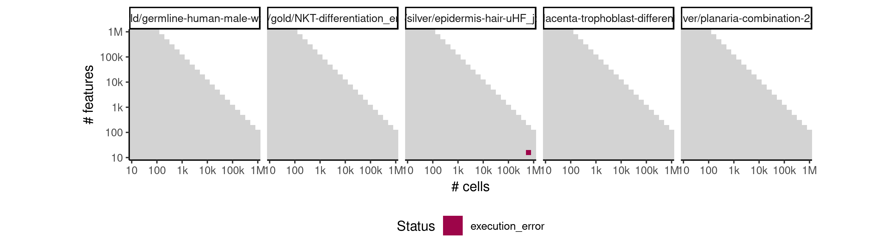

 * Number of instances: 1
 * Dataset ids: scaling_1747

Last 10 lines of scaling_1747:
```
File: /home/rcannood/Workspace/dynverse/dynbenchmark//derived/05-scaling/suite/paga/Cat4/r2gridengine/20181012_214234_paga_Cat4_v19hsjTNis/log/log.12.e.txt
Execution halted
```

### ERROR CLUSTER EXECUTION_ERROR -- 3


 * Number of instances: 40
 * Dataset ids: scaling_1759, scaling_1764, scaling_1775, scaling_1779, scaling_1795, scaling_1804, scaling_1805, scaling_1806, scaling_1807, scaling_1823, scaling_1824, scaling_1862, scaling_1867, scaling_1874, scaling_1961, scaling_1994, scaling_2019, scaling_2022, scaling_2026, scaling_2029, scaling_2030, scaling_2031, scaling_2034, scaling_2095, scaling_2096, scaling_2107, scaling_2108, scaling_2109, scaling_2135, scaling_2164, scaling_2171, scaling_2195, scaling_2203, scaling_2206, scaling_2207, scaling_2214, scaling_2284, scaling_2307, scaling_2309, scaling_2314

Last 10 lines of scaling_1759:
```
File: /home/rcannood/Workspace/dynverse/dynbenchmark//derived/05-scaling/suite/paga/Cat4/r2gridengine/20181012_214234_paga_Cat4_v19hsjTNis/log/log.24.e.txt
In addition: There were 49 warnings (use warnings() to see them)
Execution halted
```

## ERROR STATUS METHOD_ERROR

### ERROR CLUSTER METHOD_ERROR -- 1


 * Number of instances: 26
 * Dataset ids: scaling_0380, scaling_0549, scaling_0680, scaling_0866, scaling_0942, scaling_1003, scaling_1050, scaling_1069, scaling_1081, scaling_1082, scaling_1083, scaling_1123, scaling_1144, scaling_1226, scaling_1269, scaling_1310, scaling_1439, scaling_1511, scaling_1618, scaling_1654, scaling_1656, scaling_1663, scaling_1732, scaling_2020, scaling_2204, scaling_2257

Last 10 lines of scaling_0380:
```
	branch_progressions.feather
	branches.feather
	cell_ids.feather
	dimred.feather
	grouping.feather
	milestone_network.feather
	timings.feather
Loading required namespace: hdf5r
Loading required namespace: feather
any(duplicated(milestone_network %>% select(from, to))) isn't false.
```

### ERROR CLUSTER METHOD_ERROR -- 2


 * Number of instances: 70
 * Dataset ids: scaling_0765, scaling_0854, scaling_0994, scaling_1022, scaling_1126, scaling_1145, scaling_1147, scaling_1151, scaling_1244, scaling_1249, scaling_1257, scaling_1378, scaling_1452, scaling_1476, scaling_1486, scaling_1488, scaling_1500, scaling_1505, scaling_1517, scaling_1523, scaling_1529, scaling_1548, scaling_1549, scaling_1586, scaling_1587, scaling_1602, scaling_1605, scaling_1606, scaling_1624, scaling_1625, scaling_1642, scaling_1646, scaling_1686, scaling_1690, scaling_1708, scaling_1712, scaling_1730, scaling_1734, scaling_1739, scaling_1746, scaling_1750, scaling_1763, scaling_1765, scaling_1846, scaling_1847, scaling_1863, scaling_1864, scaling_1872, scaling_1880, scaling_1888, scaling_1911, scaling_1998, scaling_1999, scaling_2053, scaling_2068, scaling_2083, scaling_2098, scaling_2099, scaling_2113, scaling_2114, scaling_2143, scaling_2176, scaling_2191, scaling_2205, scaling_2208, scaling_2223, scaling_2225, scaling_2285, scaling_2303, scaling_2327

Last 10 lines of scaling_0765:
```
  File "/usr/local/lib/python3.6/site-packages/sklearn/decomposition/pca.py", line 348, in fit_transform
    U, S, V = self._fit(X)
  File "/usr/local/lib/python3.6/site-packages/sklearn/decomposition/pca.py", line 370, in _fit
    copy=self.copy)
  File "/usr/local/lib/python3.6/site-packages/sklearn/utils/validation.py", line 453, in check_array
    _assert_all_finite(array)
  File "/usr/local/lib/python3.6/site-packages/sklearn/utils/validation.py", line 44, in _assert_all_finite
    " or a value too large for %r." % X.dtype)
ValueError: Input contains NaN, infinity or a value too large for dtype('float32').
Loading required namespace: hdf5r
```

### ERROR CLUSTER METHOD_ERROR -- 3


 * Number of instances: 228
 * Dataset ids: scaling_1738, scaling_1742, scaling_1743, scaling_1744, scaling_1745, scaling_1752, scaling_1755, scaling_1756, scaling_1766, scaling_1767, scaling_1780, scaling_1781, scaling_1787, scaling_1788, scaling_1792, scaling_1793, scaling_1797, scaling_1815, scaling_1816, scaling_1817, scaling_1818, scaling_1821, scaling_1822, scaling_1833, scaling_1840, scaling_1841, scaling_1842, scaling_1843, scaling_1844, scaling_1848, scaling_1849, scaling_1851, scaling_1852, scaling_1869, scaling_1876, scaling_1879, scaling_1881, scaling_1882, scaling_1883, scaling_1884, scaling_1885, scaling_1887, scaling_1889, scaling_1891, scaling_1892, scaling_1897, scaling_1898, scaling_1899, scaling_1902, scaling_1907, scaling_1908, scaling_1909, scaling_1914, scaling_1915, scaling_1919, scaling_1920, scaling_1921, scaling_1923, scaling_1924, scaling_1926, scaling_1930, scaling_1931, scaling_1933, scaling_1937, scaling_1940, scaling_1941, scaling_1943, scaling_1946, scaling_1952, scaling_1953, scaling_1955, scaling_1956, scaling_1960, scaling_1962, scaling_1963, scaling_1965, scaling_1966, scaling_1967, scaling_1968, scaling_1970, scaling_1973, scaling_1976, scaling_1977, scaling_1978, scaling_1980, scaling_1984, scaling_1985, scaling_1987, scaling_1996, scaling_1997, scaling_2001, scaling_2002, scaling_2004, scaling_2005, scaling_2007, scaling_2008, scaling_2010, scaling_2014, scaling_2016, scaling_2025, scaling_2032, scaling_2040, scaling_2041, scaling_2043, scaling_2047, scaling_2048, scaling_2049, scaling_2050, scaling_2052, scaling_2054, scaling_2055, scaling_2056, scaling_2057, scaling_2059, scaling_2065, scaling_2066, scaling_2067, scaling_2069, scaling_2072, scaling_2073, scaling_2077, scaling_2078, scaling_2081, scaling_2086, scaling_2087, scaling_2088, scaling_2093, scaling_2100, scaling_2110, scaling_2112, scaling_2115, scaling_2116, scaling_2117, scaling_2119, scaling_2121, scaling_2125, scaling_2126, scaling_2127, scaling_2128, scaling_2130, scaling_2132, scaling_2133, scaling_2136, scaling_2138, scaling_2139, scaling_2144, scaling_2145, scaling_2147, scaling_2149, scaling_2150, scaling_2151, scaling_2155, scaling_2158, scaling_2159, scaling_2165, scaling_2167, scaling_2168, scaling_2169, scaling_2172, scaling_2173, scaling_2175, scaling_2186, scaling_2187, scaling_2192, scaling_2193, scaling_2196, scaling_2201, scaling_2209, scaling_2210, scaling_2211, scaling_2212, scaling_2213, scaling_2215, scaling_2216, scaling_2217, scaling_2220, scaling_2228, scaling_2232, scaling_2233, scaling_2236, scaling_2239, scaling_2243, scaling_2244, scaling_2245, scaling_2246, scaling_2247, scaling_2249, scaling_2250, scaling_2251, scaling_2252, scaling_2253, scaling_2256, scaling_2259, scaling_2260, scaling_2262, scaling_2263, scaling_2264, scaling_2265, scaling_2266, scaling_2268, scaling_2270, scaling_2272, scaling_2273, scaling_2274, scaling_2277, scaling_2278, scaling_2283, scaling_2286, scaling_2290, scaling_2297, scaling_2298, scaling_2299, scaling_2302, scaling_2304, scaling_2305, scaling_2306, scaling_2308, scaling_2312, scaling_2313, scaling_2315, scaling_2316, scaling_2317, scaling_2318, scaling_2319, scaling_2323, scaling_2324, scaling_2325, scaling_2329

Last 10 lines of scaling_1738:
```
    error #003: ../../src/H5Dchunk.c in H5D__chunk_write(): line 1968: unable to read raw data chunk
        class: HDF5
        major: Low-level I/O
        minor: Read failed
    error #004: ../../src/H5Dchunk.c in H5D__chunk_lock(): line 2953: unable to preempt chunk(s) from cache
        class: HDF5
        major: Low-level I/O
        minor: Unable to initialize object
    error #005: ../../src/H5Dchunk.c in H5D__chunk_cache_prune(): line 2739: unable to preempt one or more raw data cache entry
        c
```

### ERROR CLUSTER METHOD_ERROR -- 4
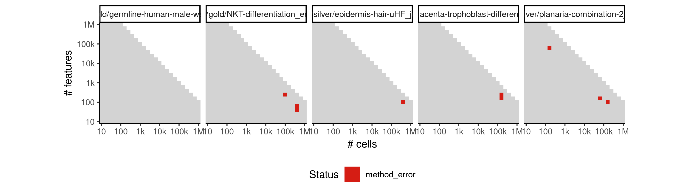

 * Number of instances: 9
 * Dataset ids: scaling_1753, scaling_1754, scaling_1838, scaling_1855, scaling_1929, scaling_1932, scaling_1974, scaling_2084, scaling_2097

Last 10 lines of scaling_1753:
```
  File "/usr/local/lib/python3.6/site-packages/pandas/io/feather_format.py", line 83, in to_feather
    feather.write_dataframe(df, path)
  File "/usr/local/lib/python3.6/site-packages/pyarrow/feather.py", line 181, in write_feather
    writer.write(df)
  File "/usr/local/lib/python3.6/site-packages/pyarrow/feather.py", line 96, in write
    self.writer.write_array(name, col)
  File "pyarrow/types.pxi", line 67, in pyarrow.lib._datatype_to_pep3118
  File "pyarrow/error.pxi", line 83, in pyarrow.lib.check_status
pyarrow.lib.ArrowIOError: Error writing bytes from file: No space left on device
Loading required namespace: hdf5r
```

### ERROR CLUSTER METHOD_ERROR -- 5
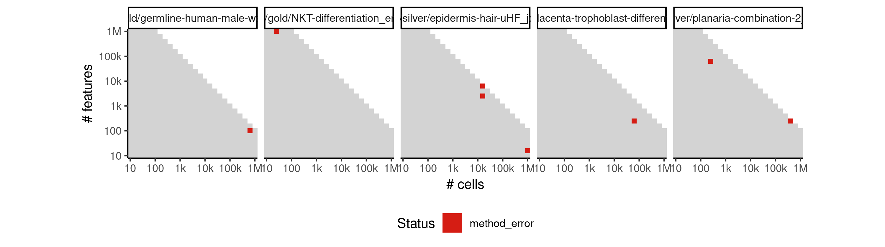

 * Number of instances: 8
 * Dataset ids: scaling_1810, scaling_1870, scaling_1875, scaling_1913, scaling_2079, scaling_2161, scaling_2279, scaling_2328

Last 10 lines of scaling_1810:
```
error reading from connection
```

### ERROR CLUSTER METHOD_ERROR -- 6
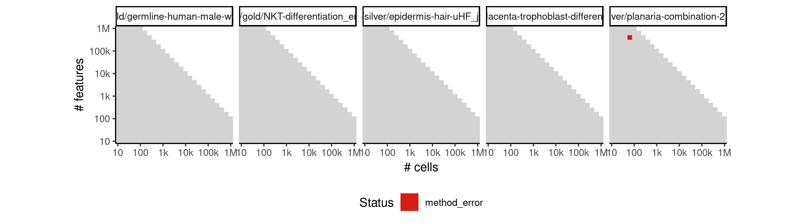

 * Number of instances: 1
 * Dataset ids: scaling_1981

Last 10 lines of scaling_1981:
```
        class: HDF5
        major: Dataset
        minor: Write failed
    error #003: ../../src/H5Fio.c in H5F_block_write(): line 158: write through metadata accumulator failed
        class: HDF5
        major: Low-level I/O
        minor: Write failed
    error #004: ../../src/H5Faccum.c in H5F_accum_write(): line 816: file write failed
        cla
Calls: <Anonymous> -> <Anonymous> -> <Anonymous> -> .Call
```

### ERROR CLUSTER METHOD_ERROR -- 7
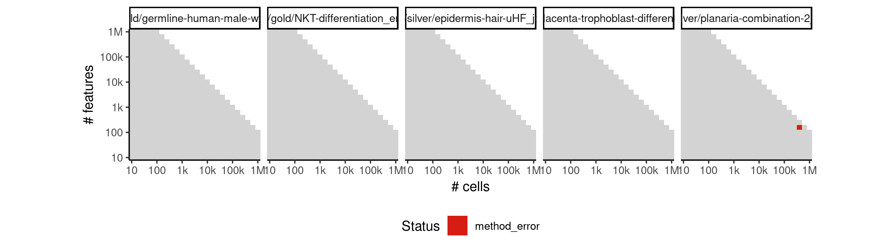

 * Number of instances: 1
 * Dataset ids: scaling_2224

Last 10 lines of scaling_2224:
```
        minor: Unable to flush data from cache
    error #003: ../../src/H5C.c in H5C_flush_cache(): line 1841: Can't flush entry.
        class: HDF5
        major: Object cache
        minor: Unable to flush data from cache
    error #004: ../../src/H5C.c in H5C_flush_single_entry(): line 7753: unable to flush entry
        class: HDF5
        major: Object cache
        minor: Unable to flush data from cache
    error #005: ../../src/H5HGcache.c in H5HG_flus
```

### ERROR CLUSTER METHOD_ERROR -- 8
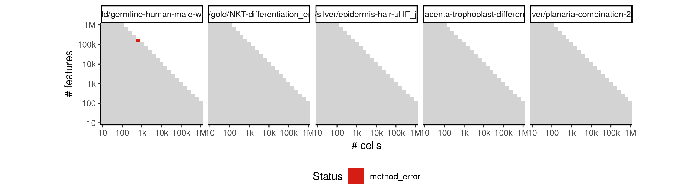

 * Number of instances: 1
 * Dataset ids: scaling_2230

Last 10 lines of scaling_2230:
```
        class: HDF5
        major: Low-level I/O
        minor: Read failed
    error #004: ../../src/H5Dchunk.c in H5D__chunk_lock(): line 2950: unable to preempt chunk from cache
        class: HDF5
        major: Low-level I/O
        minor: Unable to initialize object
    error #005: ../../src/H5Dchunk.c in H5D__chunk_cache_evict(): line 2606: cannot flush indexed storage buffer
        class: HDF5
       
```

### ERROR CLUSTER METHOD_ERROR -- 9
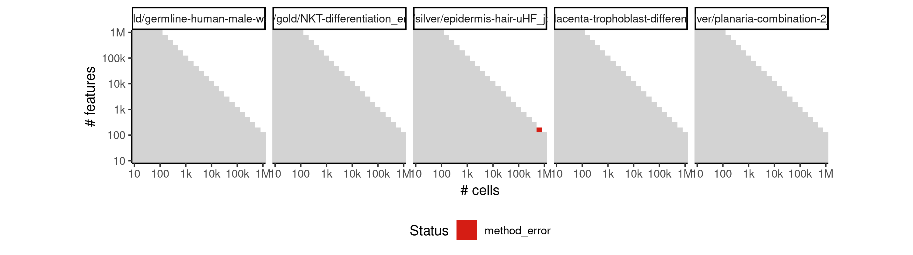

 * Number of instances: 1
 * Dataset ids: scaling_2287

Last 10 lines of scaling_2287:
```
        major: Dataset
        minor: Read failed
    error #004: ../../src/H5Dscatgath.c in H5D__scatgath_write(): line 678: datatype conversion failed
        class: HDF5
        major: Dataset
        minor: Can't convert datatypes
    error #005: ../../src/H5T.c in H5T_convert(): line 4816: data type conversion failed
        class: HDF5
        major: Attribute
        minor: Unable to encode v
```

### ERROR CLUSTER METHOD_ERROR -- 10


 * Number of instances: 1
 * Dataset ids: scaling_2289

Last 10 lines of scaling_2289:
```
  File "/usr/local/lib/python3.6/site-packages/pandas/core/frame.py", line 348, in __init__
    mgr = self._init_dict(data, index, columns, dtype=dtype)
  File "/usr/local/lib/python3.6/site-packages/pandas/core/frame.py", line 459, in _init_dict
    return _arrays_to_mgr(arrays, data_names, index, columns, dtype=dtype)
  File "/usr/local/lib/python3.6/site-packages/pandas/core/frame.py", line 7356, in _arrays_to_mgr
    index = extract_index(arrays)
  File "/usr/local/lib/python3.6/site-packages/pandas/core/frame.py", line 7412, in extract_index
    raise ValueError(msg)
ValueError: array length 100 does not match index length 61
Loading required namespace: hdf5r
```

## ERROR STATUS TIME_LIMIT

### ERROR CLUSTER TIME_LIMIT -- 1
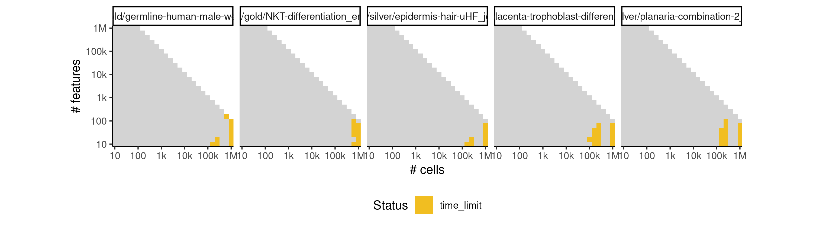

 * Number of instances: 41
 * Dataset ids: scaling_1181, scaling_1213, scaling_1228, scaling_1229, scaling_1245, scaling_1296, scaling_1338, scaling_1358, scaling_1359, scaling_1379, scaling_1380, scaling_1428, scaling_1440, scaling_1451, scaling_1475, scaling_1487, scaling_1499, scaling_1568, scaling_1603, scaling_1604, scaling_1622, scaling_1623, scaling_1647, scaling_1669, scaling_1691, scaling_1711, scaling_1713, scaling_1733, scaling_1735, scaling_1825, scaling_1839, scaling_1856, scaling_1912, scaling_1934, scaling_2000, scaling_2024, scaling_2070, scaling_2177, scaling_2267, scaling_2288, scaling_2330

Last 10 lines of scaling_1181:
```
File: /home/rcannood/Workspace/dynverse/dynbenchmark//derived/05-scaling/suite/paga/Cat3/r2gridengine/20181010_161005_paga_Cat3_LKleQW6Cba/log/log.36.e.txt
```

## ERROR STATUS MEMORY_LIMIT

### ERROR CLUSTER MEMORY_LIMIT -- 1
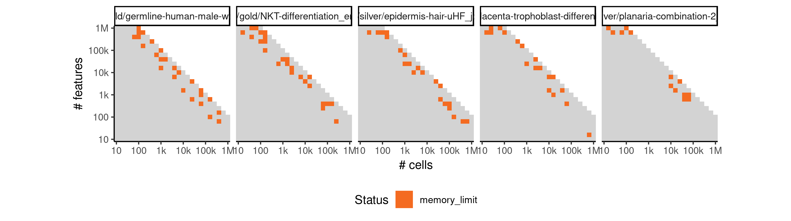

 * Number of instances: 102
 * Dataset ids: scaling_1740, scaling_1748, scaling_1751, scaling_1771, scaling_1774, scaling_1776, scaling_1778, scaling_1784, scaling_1785, scaling_1794, scaling_1808, scaling_1819, scaling_1820, scaling_1826, scaling_1850, scaling_1854, scaling_1857, scaling_1865, scaling_1873, scaling_1886, scaling_1890, scaling_1893, scaling_1895, scaling_1901, scaling_1906, scaling_1910, scaling_1916, scaling_1922, scaling_1928, scaling_1942, scaling_1944, scaling_1950, scaling_1951, scaling_1954, scaling_1957, scaling_1964, scaling_1972, scaling_1991, scaling_1992, scaling_2003, scaling_2009, scaling_2011, scaling_2013, scaling_2015, scaling_2023, scaling_2038, scaling_2042, scaling_2045, scaling_2058, scaling_2061, scaling_2062, scaling_2063, scaling_2064, scaling_2071, scaling_2076, scaling_2085, scaling_2092, scaling_2101, scaling_2111, scaling_2118, scaling_2122, scaling_2124, scaling_2129, scaling_2134, scaling_2137, scaling_2146, scaling_2152, scaling_2153, scaling_2157, scaling_2160, scaling_2162, scaling_2163, scaling_2174, scaling_2178, scaling_2179, scaling_2182, scaling_2184, scaling_2185, scaling_2194, scaling_2200, scaling_2202, scaling_2218, scaling_2221, scaling_2226, scaling_2227, scaling_2229, scaling_2231, scaling_2238, scaling_2240, scaling_2242, scaling_2248, scaling_2258, scaling_2269, scaling_2280, scaling_2281, scaling_2292, scaling_2293, scaling_2296, scaling_2300, scaling_2310, scaling_2311, scaling_2322

Last 10 lines of scaling_1740:
```
    error #003: ../../src/H5Dchunk.c in H5D__chunk_write(): line 1968: unable to read raw data chunk
        class: HDF5
        major: Low-level I/O
        minor: Read failed
    error #004: ../../src/H5Dchunk.c in H5D__chunk_lock(): line 2953: unable to preempt chunk(s) from cache
        class: HDF5
        major: Low-level I/O
        minor: Unable to initialize object
    error #005: ../../src/H5Dchunk.c in H5D__chunk_cache_prune(): line 2739: unable to preempt one or more raw data cache entry
        c
```

### ERROR CLUSTER MEMORY_LIMIT -- 2


 * Number of instances: 3
 * Dataset ids: scaling_1871, scaling_1995, scaling_2039

Last 10 lines of scaling_1871:
```
        major: Dataset
        minor: Read failed
    error #004: ../../src/H5Dscatgath.c in H5D__scatgath_write(): line 678: datatype conversion failed
        class: HDF5
        major: Dataset
        minor: Can't convert datatypes
    error #005: ../../src/H5T.c in H5T_convert(): line 4816: data type conversion failed
        class: HDF5
        major: Attribute
        minor: Unable to encode v
```

### ERROR CLUSTER MEMORY_LIMIT -- 3


 * Number of instances: 1
 * Dataset ids: scaling_1959

Last 10 lines of scaling_1959:
```
        minor: Unable to flush data from cache
    error #003: ../../src/H5C.c in H5C_flush_cache(): line 1841: Can't flush entry.
        class: HDF5
        major: Object cache
        minor: Unable to flush data from cache
    error #004: ../../src/H5C.c in H5C_flush_single_entry(): line 7753: unable to flush entry
        class: HDF5
        major: Object cache
        minor: Unable to flush data from cache
    error #005: ../../src/H5HGcache.c in H5HG_flus
```

### ERROR CLUSTER MEMORY_LIMIT -- 4
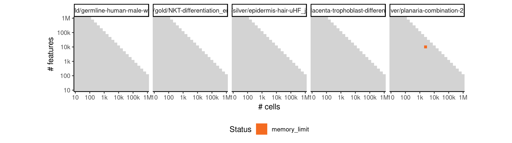

 * Number of instances: 1
 * Dataset ids: scaling_1988

Last 10 lines of scaling_1988:
```
    error #002: ../../src/H5Faccum.c in H5F_accum_flush(): line 1010: file write failed
        class: HDF5
        major: Low-level I/O
        minor: Write failed
    error #003: ../../src/H5FDint.c in H5FD_write(): line 185: driver write request failed
        class: HDF5
        major: Virtual File Layer
        minor: Write failed
    error #004: ../../src/H5FDsec2.c in H5FD_sec2_write(): line 822: file write failed: time = Sun Oct 14 10:25:15 2018
, filename = '/data/tmp//Rtmpo3sKUO/file1580deca4903/ti/input/data.h5', file descriptor = 8, errno = 28, error message = 'No spa
```

### ERROR CLUSTER MEMORY_LIMIT -- 5
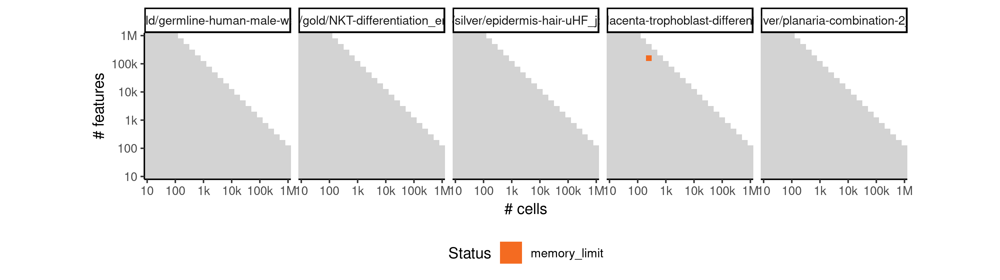

 * Number of instances: 1
 * Dataset ids: scaling_2089

Last 10 lines of scaling_2089:
```
        class: HDF5
        major: Low-level I/O
        minor: Read failed
    error #004: ../../src/H5Dchunk.c in H5D__chunk_lock(): line 2950: unable to preempt chunk from cache
        class: HDF5
        major: Low-level I/O
        minor: Unable to initialize object
    error #005: ../../src/H5Dchunk.c in H5D__chunk_cache_evict(): line 2606: cannot flush indexed storage buffer
        class: HDF5
       
```


