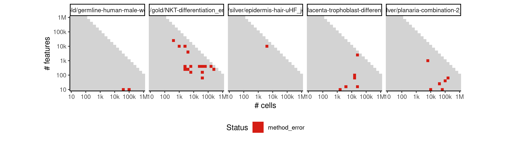

# paga


## ERROR STATUS EXECUTION_ERROR

### ERROR CLUSTER EXECUTION_ERROR -- 1


 * Number of instances: 4
 * Dataset ids: scaling_0573, scaling_0748, scaling_0910, scaling_1107

Last 10 lines of scaling_0573:
```
File: /home/rcannood/Workspace/dynverse/dynbenchmark//derived/05-scaling/suite/paga/Cat1/r2gridengine/20181008_135237_paga_Cat1_W3hjsPcnT5/log/log.573.e.txt
  Trajectory simplification: some edges that are in the progressions are not present in the milestone network! This indicates a bug with edge flipping.
Calls: lapply ... <Anonymous> -> lapply -> FUN -> calculate_metrics -> <Anonymous>
Execution halted
```

## ERROR STATUS METHOD_ERROR

### ERROR CLUSTER METHOD_ERROR -- 1


 * Number of instances: 13
 * Dataset ids: scaling_0380, scaling_0549, scaling_0680, scaling_0866, scaling_0942, scaling_1003, scaling_1050, scaling_1069, scaling_1081, scaling_1082, scaling_1083, scaling_1123, scaling_1144

Last 10 lines of scaling_0380:
```
	branch_progressions.feather
	branches.feather
	cell_ids.feather
	dimred.feather
	grouping.feather
	milestone_network.feather
	timings.feather
Loading required namespace: hdf5r
Loading required namespace: feather
any(duplicated(milestone_network %>% select(from, to))) isn't false.
```

### ERROR CLUSTER METHOD_ERROR -- 2


 * Number of instances: 6
 * Dataset ids: scaling_0765, scaling_0854, scaling_0994, scaling_1022, scaling_1126, scaling_1145

Last 10 lines of scaling_0765:
```
  File "/usr/local/lib/python3.6/site-packages/sklearn/decomposition/pca.py", line 348, in fit_transform
    U, S, V = self._fit(X)
  File "/usr/local/lib/python3.6/site-packages/sklearn/decomposition/pca.py", line 370, in _fit
    copy=self.copy)
  File "/usr/local/lib/python3.6/site-packages/sklearn/utils/validation.py", line 453, in check_array
    _assert_all_finite(array)
  File "/usr/local/lib/python3.6/site-packages/sklearn/utils/validation.py", line 44, in _assert_all_finite
    " or a value too large for %r." % X.dtype)
ValueError: Input contains NaN, infinity or a value too large for dtype('float32').
Loading required namespace: hdf5r
```


