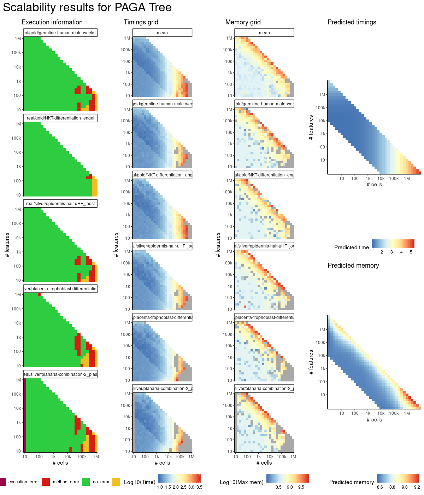

# paga_tree


## ERROR STATUS METHOD_ERROR

### ERROR CLUSTER METHOD_ERROR -- 1


 * Number of instances: 4
 * Dataset ids: scaling_0765, scaling_0854, scaling_0994, scaling_1022

Last 10 lines of scaling_0765:
```
  File "/usr/local/lib/python3.6/site-packages/sklearn/decomposition/pca.py", line 348, in fit_transform
    U, S, V = self._fit(X)
  File "/usr/local/lib/python3.6/site-packages/sklearn/decomposition/pca.py", line 370, in _fit
    copy=self.copy)
  File "/usr/local/lib/python3.6/site-packages/sklearn/utils/validation.py", line 453, in check_array
    _assert_all_finite(array)
  File "/usr/local/lib/python3.6/site-packages/sklearn/utils/validation.py", line 44, in _assert_all_finite
    " or a value too large for %r." % X.dtype)
ValueError: Input contains NaN, infinity or a value too large for dtype('float32').
Loading required namespace: hdf5r
```


