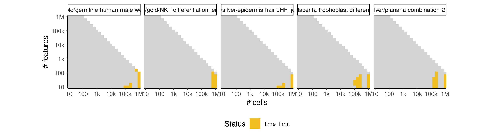

# paga_tree


## ERROR STATUS METHOD_ERROR

### ERROR CLUSTER METHOD_ERROR -- 1


 * Number of instances: 103
 * Dataset ids: scaling_0765, scaling_0854, scaling_0994, scaling_1022, scaling_1126, scaling_1145, scaling_1147, scaling_1151, scaling_1244, scaling_1249, scaling_1257, scaling_1378, scaling_1452, scaling_1476, scaling_1486, scaling_1488, scaling_1500, scaling_1505, scaling_1517, scaling_1523, scaling_1529, scaling_1548, scaling_1549, scaling_1586, scaling_1587, scaling_1602, scaling_1605, scaling_1606, scaling_1624, scaling_1625, scaling_1642, scaling_1646, scaling_1686, scaling_1690, scaling_1708, scaling_1712, scaling_1730, scaling_1734, scaling_1738, scaling_1739, scaling_1746, scaling_1747, scaling_1750, scaling_1751, scaling_1755, scaling_1763, scaling_1765, scaling_1846, scaling_1847, scaling_1848, scaling_1862, scaling_1863, scaling_1864, scaling_1870, scaling_1871, scaling_1872, scaling_1879, scaling_1880, scaling_1888, scaling_1890, scaling_1906, scaling_1911, scaling_1950, scaling_1955, scaling_1972, scaling_1976, scaling_1977, scaling_1994, scaling_1998, scaling_1999, scaling_2030, scaling_2038, scaling_2053, scaling_2055, scaling_2068, scaling_2083, scaling_2085, scaling_2096, scaling_2098, scaling_2099, scaling_2100, scaling_2111, scaling_2113, scaling_2114, scaling_2115, scaling_2143, scaling_2159, scaling_2160, scaling_2161, scaling_2176, scaling_2191, scaling_2192, scaling_2193, scaling_2205, scaling_2207, scaling_2208, scaling_2209, scaling_2221, scaling_2223, scaling_2224, scaling_2225, scaling_2243, scaling_2244

Last 10 lines of scaling_0765:
```
  File "/usr/local/lib/python3.6/site-packages/sklearn/decomposition/pca.py", line 348, in fit_transform
    U, S, V = self._fit(X)
  File "/usr/local/lib/python3.6/site-packages/sklearn/decomposition/pca.py", line 370, in _fit
    copy=self.copy)
  File "/usr/local/lib/python3.6/site-packages/sklearn/utils/validation.py", line 453, in check_array
    _assert_all_finite(array)
  File "/usr/local/lib/python3.6/site-packages/sklearn/utils/validation.py", line 44, in _assert_all_finite
    " or a value too large for %r." % X.dtype)
ValueError: Input contains NaN, infinity or a value too large for dtype('float32').
Loading required namespace: hdf5r
```

## ERROR STATUS TIME_LIMIT

### ERROR CLUSTER TIME_LIMIT -- 1


 * Number of instances: 62
 * Dataset ids: scaling_1069, scaling_1107, scaling_1181, scaling_1213, scaling_1228, scaling_1229, scaling_1245, scaling_1296, scaling_1338, scaling_1357, scaling_1358, scaling_1359, scaling_1379, scaling_1380, scaling_1428, scaling_1440, scaling_1451, scaling_1475, scaling_1487, scaling_1499, scaling_1568, scaling_1603, scaling_1604, scaling_1622, scaling_1623, scaling_1647, scaling_1669, scaling_1691, scaling_1711, scaling_1713, scaling_1733, scaling_1735, scaling_1743, scaling_1780, scaling_1795, scaling_1810, scaling_1824, scaling_1825, scaling_1839, scaling_1840, scaling_1856, scaling_1912, scaling_1933, scaling_1934, scaling_1956, scaling_1978, scaling_1997, scaling_2000, scaling_2008, scaling_2016, scaling_2024, scaling_2032, scaling_2040, scaling_2070, scaling_2121, scaling_2127, scaling_2133, scaling_2139, scaling_2145, scaling_2177, scaling_2245, scaling_2246

Last 10 lines of scaling_1069:
```
File: /home/rcannood/Workspace/dynverse/dynbenchmark//derived/05-scaling/suite/paga_tree/Cat2/r2gridengine/20181008_214930_paga_tree_Cat2_NNIZUgvHrL/log/log.389.e.txt
```


