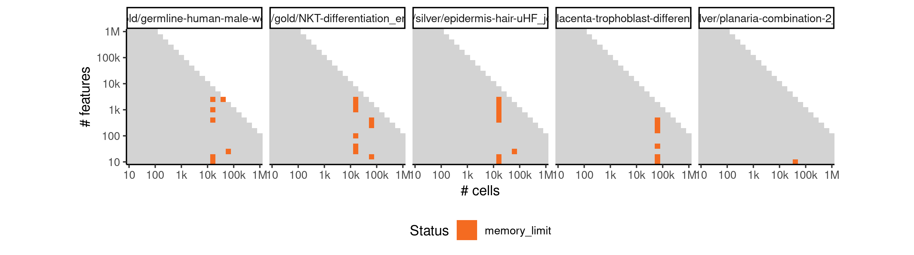
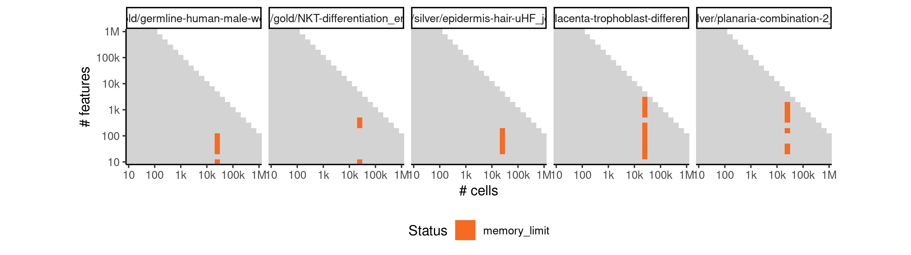
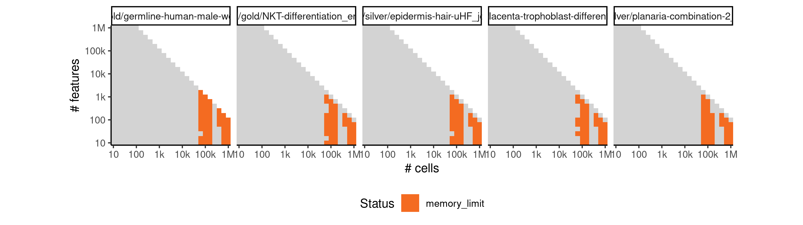
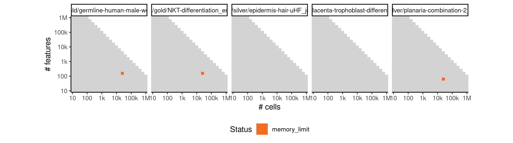
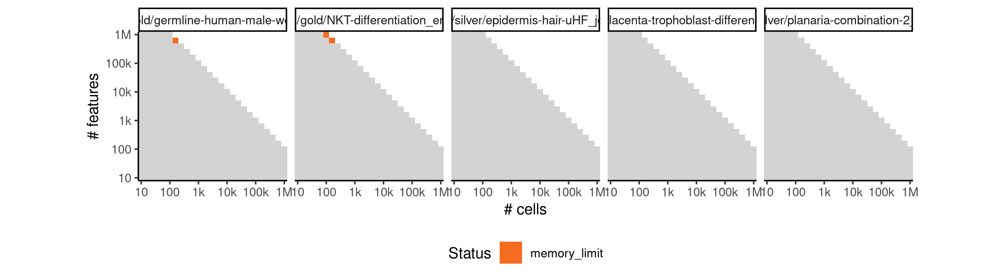
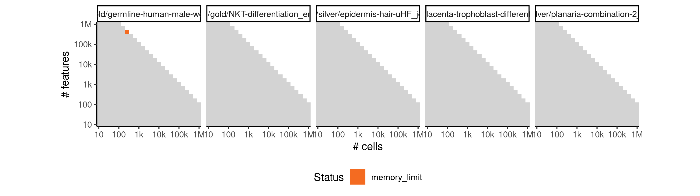

# pcreode


## ERROR STATUS METHOD_ERROR

### ERROR CLUSTER METHOD_ERROR -- 1


 * Number of instances: 355
 * Dataset ids: scaling_0001, scaling_0002, scaling_0003, scaling_0004, scaling_0006, scaling_0007, scaling_0008, scaling_0009, scaling_0010, scaling_0011, scaling_0012, scaling_0013, scaling_0015, scaling_0016, scaling_0017, scaling_0018, scaling_0019, scaling_0020, scaling_0021, scaling_0022, scaling_0023, scaling_0024, scaling_0025, scaling_0026, scaling_0027, scaling_0029, scaling_0030, scaling_0031, scaling_0032, scaling_0033, scaling_0035, scaling_0036, scaling_0037, scaling_0038, scaling_0039, scaling_0040, scaling_0041, scaling_0043, scaling_0047, scaling_0051, scaling_0052, scaling_0053, scaling_0056, scaling_0057, scaling_0062, scaling_0063, scaling_0066, scaling_0067, scaling_0068, scaling_0072, scaling_0073, scaling_0076, scaling_0077, scaling_0078, scaling_0082, scaling_0083, scaling_0084, scaling_0088, scaling_0089, scaling_0090, scaling_0094, scaling_0095, scaling_0096, scaling_0101, scaling_0102, scaling_0106, scaling_0107, scaling_0108, scaling_0113, scaling_0114, scaling_0115, scaling_0120, scaling_0121, scaling_0122, scaling_0128, scaling_0129, scaling_0135, scaling_0136, scaling_0141, scaling_0145, scaling_0147, scaling_0149, scaling_0151, scaling_0152, scaling_0157, scaling_0158, scaling_0163, scaling_0164, scaling_0169, scaling_0170, scaling_0176, scaling_0181, scaling_0182, scaling_0188, scaling_0189, scaling_0195, scaling_0196, scaling_0202, scaling_0203, scaling_0210, scaling_0216, scaling_0218, scaling_0220, scaling_0222, scaling_0224, scaling_0226, scaling_0227, scaling_0232, scaling_0233, scaling_0238, scaling_0239, scaling_0244, scaling_0245, scaling_0251, scaling_0256, scaling_0264, scaling_0268, scaling_0272, scaling_0276, scaling_0277, scaling_0278, scaling_0287, scaling_0288, scaling_0298, scaling_0299, scaling_0300, scaling_0310, scaling_0311, scaling_0321, scaling_0322, scaling_0331, scaling_0335, scaling_0337, scaling_0339, scaling_0341, scaling_0342, scaling_0351, scaling_0352, scaling_0361, scaling_0362, scaling_0372, scaling_0382, scaling_0391, scaling_0392, scaling_0393, scaling_0404, scaling_0405, scaling_0406, scaling_0417, scaling_0418, scaling_0419, scaling_0431, scaling_0432, scaling_0444, scaling_0445, scaling_0446, scaling_0456, scaling_0457, scaling_0458, scaling_0466, scaling_0467, scaling_0476, scaling_0477, scaling_0487, scaling_0497, scaling_0498, scaling_0506, scaling_0510, scaling_0514, scaling_0518, scaling_0522, scaling_0526, scaling_0532, scaling_0538, scaling_0544, scaling_0550, scaling_0556, scaling_0557, scaling_0565, scaling_0566, scaling_0574, scaling_0575, scaling_0584, scaling_0593, scaling_0594, scaling_0602, scaling_0603, scaling_0604, scaling_0617, scaling_0618, scaling_0619, scaling_0633, scaling_0634, scaling_0635, scaling_0650, scaling_0651, scaling_0666, scaling_0667, scaling_0668, scaling_0681, scaling_0682, scaling_0683, scaling_0698, scaling_0699, scaling_0700, scaling_0715, scaling_0716, scaling_0717, scaling_0733, scaling_0734, scaling_0750, scaling_0751, scaling_0752, scaling_0766, scaling_0767, scaling_0768, scaling_0784, scaling_0785, scaling_0786, scaling_0802, scaling_0803, scaling_0804, scaling_0821, scaling_0822, scaling_0839, scaling_0840, scaling_0841, scaling_0856, scaling_0857, scaling_0867, scaling_0868, scaling_0878, scaling_0879, scaling_0890, scaling_0901, scaling_0902, scaling_0911, scaling_0919, scaling_0927, scaling_0935, scaling_0943, scaling_0951, scaling_0957, scaling_0963, scaling_0969, scaling_0975, scaling_0981, scaling_0982, scaling_0983, scaling_0995, scaling_0996, scaling_1009, scaling_1010, scaling_1024, scaling_1038, scaling_1039, scaling_1051, scaling_1052, scaling_1071, scaling_1089, scaling_1090, scaling_1109, scaling_1128, scaling_1129, scaling_1146, scaling_1148, scaling_1150, scaling_1152, scaling_1154, scaling_1164, scaling_1166, scaling_1167, scaling_1182, scaling_1183, scaling_1198, scaling_1199, scaling_1215, scaling_1231, scaling_1246, scaling_1250, scaling_1254, scaling_1258, scaling_1262, scaling_1277, scaling_1278, scaling_1297, scaling_1298, scaling_1299, scaling_1319, scaling_1320, scaling_1340, scaling_1341, scaling_1361, scaling_1362, scaling_1381, scaling_1382, scaling_1393, scaling_1405, scaling_1406, scaling_1417, scaling_1429, scaling_1430, scaling_1442, scaling_1453, scaling_1454, scaling_1465, scaling_1466, scaling_1478, scaling_1490, scaling_1531, scaling_1532, scaling_1533, scaling_1550, scaling_1551, scaling_1552, scaling_1569, scaling_1570, scaling_1571, scaling_1589, scaling_1590, scaling_1608, scaling_1609, scaling_1610, scaling_1627, scaling_1648, scaling_1649, scaling_1670, scaling_1671, scaling_1693, scaling_1715, scaling_1716, scaling_1736, scaling_1740, scaling_1744, scaling_1748, scaling_1752, scaling_1766, scaling_1781, scaling_1796, scaling_1811, scaling_1826, scaling_1841, scaling_1849, scaling_1857, scaling_1865, scaling_1873, scaling_1874, scaling_1891, scaling_1913, scaling_1935, scaling_1957, scaling_1979, scaling_1980, scaling_2001, scaling_2033

Last 10 lines of scaling_0001:
```
    mute = True
  File "/usr/local/lib/python2.7/site-packages/pcreode/functions.py", line 642, in pCreode
    sil_score[ss] = metrics.silhouette_score( low_cls, labels=label, metric='l2')
  File "/usr/local/lib/python2.7/site-packages/sklearn/metrics/cluster/unsupervised.py", line 101, in silhouette_score
    return np.mean(silhouette_samples(X, labels, metric=metric, **kwds))
  File "/usr/local/lib/python2.7/site-packages/sklearn/metrics/cluster/unsupervised.py", line 167, in silhouette_samples
    check_number_of_labels(len(le.classes_), X.shape[0])
  File "/usr/local/lib/python2.7/site-packages/sklearn/metrics/cluster/unsupervised.py", line 19, in check_number_of_labels
    "to n_samples - 1 (inclusive)" % n_labels)
ValueError: Number of labels is 4. Valid values are 2 to n_samples - 1 (inclusive)
```

### ERROR CLUSTER METHOD_ERROR -- 2


 * Number of instances: 25
 * Dataset ids: scaling_0045, scaling_0061, scaling_0127, scaling_0309, scaling_0371, scaling_0430, scaling_0486, scaling_0583, scaling_0601, scaling_0649, scaling_0732, scaling_0820, scaling_0889, scaling_1023, scaling_1070, scaling_1108, scaling_1214, scaling_1276, scaling_1318, scaling_1339, scaling_1441, scaling_1477, scaling_1588, scaling_1626, scaling_1692

Last 10 lines of scaling_0045:
```
Traceback (most recent call last):
  File "/code/run.py", line 43, in <module>
    mute = True
  File "/usr/local/lib/python2.7/site-packages/pcreode/functions.py", line 640, in pCreode
    kmeans_model  = _KMeans( n_clusters=ss+2, random_state=10).fit( low_cls)
  File "/usr/local/lib/python2.7/site-packages/sklearn/cluster/k_means_.py", line 887, in fit
    X = self._check_fit_data(X)
  File "/usr/local/lib/python2.7/site-packages/sklearn/cluster/k_means_.py", line 861, in _check_fit_data
    X.shape[0], self.n_clusters))
ValueError: n_samples=1 should be >= n_clusters=2
```

### ERROR CLUSTER METHOD_ERROR -- 3


 * Number of instances: 1
 * Dataset ids: scaling_0260

Last 10 lines of scaling_0260:
```
  '/data/tmp//RtmpB33HPG/file636d9cce0c0/ti:/ti,/data/tmp//RtmpB33HPG/file636d88cce2c/tmp:/tmp2' \
  /group/irc/shared/dynverse/dynbenchmark/derived/singularity_images/dynverse/ti_pcreode.simg
Traceback (most recent call last):
  File "/code/run.py", line 43, in <module>
    mute = True
  File "/usr/local/lib/python2.7/site-packages/pcreode/functions.py", line 701, in pCreode
    aligned_ind = consensus_alignment( down, hi_pl_ind.copy(), data, density, noise)
  File "/usr/local/lib/python2.7/site-packages/pcreode/functions.py", line 391, in consensus_alignment
    new_nodes[jj] = np.median( no_noise[chunks[ss][node_ind==hi_pl_ind[jj]]], axis=0)
IndexError: index 13 is out of bounds for axis 0 with size 13
```

### ERROR CLUSTER METHOD_ERROR -- 4


 * Number of instances: 4
 * Dataset ids: scaling_0286, scaling_1557, scaling_1801, scaling_1923

Last 10 lines of scaling_0286:
```
Traceback (most recent call last):
  File "/code/run.py", line 43, in <module>
    mute = True
  File "/usr/local/lib/python2.7/site-packages/pcreode/functions.py", line 698, in pCreode
    hi_pl, hi_pl_ind = hierarchical_placement( dens_knn, cen_ind)
  File "/usr/local/lib/python2.7/site-packages/pcreode/functions.py", line 284, in hierarchical_placement
    run_dist = get_graph_distance( end_ind, to_ind, graph)
  File "/usr/local/lib/python2.7/site-packages/pcreode/functions.py", line 120, in get_graph_distance
    d[ii,:] = graph.shortest_paths( from_ind[ii], to_ind, weights="weight")[0]
igraph._igraph.InternalError: Error at structural_properties.c:5200: cannot run Bellman-Ford algorithm, Negative loop detected while calculating shortest paths
```

### ERROR CLUSTER METHOD_ERROR -- 5


 * Number of instances: 3
 * Dataset ids: scaling_2155, scaling_2171, scaling_2226

Last 10 lines of scaling_2155:
```
Input saved to /data/tmp//RtmpmfHlJl/file12b2d62fe0246/ti/input: 
	expression.csv
	params.json
Running /bin/singularity run --pwd /ti/workspace -B \
  '/data/tmp//RtmpmfHlJl/file12b2d62fe0246/ti:/ti,/data/tmp//RtmpmfHlJl/file12b2d7994d692/tmp:/tmp2' \
  /group/irc/shared/dynverse/dynbenchmark/derived/singularity_images/dynverse/ti_pcreode.simg
```

### ERROR CLUSTER METHOD_ERROR -- 6


 * Number of instances: 1
 * Dataset ids: scaling_2249

Last 10 lines of scaling_2249:
```
  File "/usr/local/lib/python2.7/site-packages/pandas/io/parsers.py", line 446, in _read
    data = parser.read(nrows)
  File "/usr/local/lib/python2.7/site-packages/pandas/io/parsers.py", line 1036, in read
    ret = self._engine.read(nrows)
  File "/usr/local/lib/python2.7/site-packages/pandas/io/parsers.py", line 1848, in read
    data = self._reader.read(nrows)
  File "pandas/_libs/parsers.pyx", line 876, in pandas._libs.parsers.TextReader.read
  File "pandas/_libs/parsers.pyx", line 891, in pandas._libs.parsers.TextReader._read_low_memory
  File "pandas/_libs/parsers.pyx", line 968, in pandas._libs.parsers.TextReader._read_rows
SystemError: NULL result without error in PyObject_Call
```

## ERROR STATUS TIME_LIMIT

### ERROR CLUSTER TIME_LIMIT -- 1


 * Number of instances: 138
 * Dataset ids: scaling_0330, scaling_0389, scaling_0390, scaling_0442, scaling_0454, scaling_0455, scaling_0495, scaling_0505, scaling_0525, scaling_0549, scaling_0555, scaling_0591, scaling_0599, scaling_0600, scaling_0616, scaling_0632, scaling_0648, scaling_0663, scaling_0664, scaling_0678, scaling_0679, scaling_0680, scaling_0747, scaling_0748, scaling_0762, scaling_0763, scaling_0764, scaling_0800, scaling_0835, scaling_0852, scaling_0853, scaling_0854, scaling_0865, scaling_0875, scaling_0887, scaling_0897, scaling_0908, scaling_0909, scaling_0949, scaling_0961, scaling_0973, scaling_0979, scaling_0992, scaling_1020, scaling_1034, scaling_1047, scaling_1048, scaling_1084, scaling_1122, scaling_1123, scaling_1141, scaling_1142, scaling_1177, scaling_1193, scaling_1209, scaling_1225, scaling_1241, scaling_1242, scaling_1289, scaling_1290, scaling_1311, scaling_1331, scaling_1332, scaling_1333, scaling_1353, scaling_1354, scaling_1374, scaling_1375, scaling_1389, scaling_1401, scaling_1413, scaling_1424, scaling_1425, scaling_1437, scaling_1460, scaling_1484, scaling_1504, scaling_1510, scaling_1516, scaling_1522, scaling_1528, scaling_1542, scaling_1562, scaling_1580, scaling_1599, scaling_1600, scaling_1618, scaling_1638, scaling_1639, scaling_1661, scaling_1682, scaling_1683, scaling_1704, scaling_1705, scaling_1706, scaling_1727, scaling_1774, scaling_1789, scaling_1804, scaling_1819, scaling_1820, scaling_1834, scaling_1845, scaling_1861, scaling_1869, scaling_1902, scaling_1903, scaling_1904, scaling_1924, scaling_1925, scaling_1946, scaling_1947, scaling_1968, scaling_1969, scaling_1970, scaling_1991, scaling_2005, scaling_2013, scaling_2021, scaling_2029, scaling_2037, scaling_2063, scaling_2078, scaling_2093, scaling_2094, scaling_2112, scaling_2154, scaling_2169, scaling_2170, scaling_2186, scaling_2187, scaling_2201, scaling_2202, scaling_2218, scaling_2222, scaling_2235, scaling_2236, scaling_2237

Last 10 lines of scaling_0330:
```
File: /home/rcannood/Workspace/dynverse/dynbenchmark//derived/05-scaling/suite/pcreode/Cat1/r2gridengine/20181008_142058_pcreode_Cat1_PbkoO07k8G/log/log.330.e.txt
```

## ERROR STATUS MEMORY_LIMIT

### ERROR CLUSTER MEMORY_LIMIT -- 1


 * Number of instances: 31
 * Dataset ids: scaling_0697, scaling_0731, scaling_0782, scaling_0818, scaling_0876, scaling_0910, scaling_1006, scaling_1036, scaling_1149, scaling_1153, scaling_1194, scaling_1249, scaling_1257, scaling_1356, scaling_1543, scaling_1581, scaling_1684, scaling_1750, scaling_1775, scaling_1790, scaling_1805, scaling_1854, scaling_1870, scaling_1926, scaling_1928, scaling_1948, scaling_1972, scaling_2049, scaling_2064, scaling_2079, scaling_2239

Last 10 lines of scaling_0697:
```
	params.json
Running /bin/singularity run --pwd /ti/workspace -B \
  '/data/tmp//RtmpOgsmre/file57025f073bf8/ti:/ti,/data/tmp//RtmpOgsmre/file5702f559302/tmp:/tmp2' \
  /group/irc/shared/dynverse/dynbenchmark/derived/singularity_images/dynverse/ti_pcreode.simg
Traceback (most recent call last):
  File "/code/run.py", line 43, in <module>
    mute = True
  File "/usr/local/lib/python2.7/site-packages/pcreode/functions.py", line 575, in pCreode
    Dist = np.array( pairwise_distances( down, down, n_jobs=1))
MemoryError
```

### ERROR CLUSTER MEMORY_LIMIT -- 2


 * Number of instances: 20
 * Dataset ids: scaling_0714, scaling_0836, scaling_0855, scaling_0898, scaling_1066, scaling_1104, scaling_1226, scaling_1291, scaling_1312, scaling_1448, scaling_1472, scaling_1496, scaling_1619, scaling_1835, scaling_1992, scaling_2109, scaling_2172, scaling_2203, scaling_2219, scaling_2238

Last 10 lines of scaling_0714:
```
    Dist_csr = csr_matrix( np.triu(Dist))
  File "/usr/local/lib/python2.7/site-packages/scipy/sparse/compressed.py", line 79, in __init__
    self._set_self(self.__class__(coo_matrix(arg1, dtype=dtype)))
  File "/usr/local/lib/python2.7/site-packages/scipy/sparse/coo.py", line 192, in __init__
    self._check()
  File "/usr/local/lib/python2.7/site-packages/scipy/sparse/coo.py", line 266, in _check
    self.row = np.asarray(self.row, dtype=idx_dtype)
  File "/usr/local/lib/python2.7/site-packages/numpy/core/numeric.py", line 501, in asarray
    return array(a, dtype, copy=False, order=order)
MemoryError
```

### ERROR CLUSTER MEMORY_LIMIT -- 3


 * Number of instances: 1
 * Dataset ids: scaling_0765

Last 10 lines of scaling_0765:
```
	params.json
Running /bin/singularity run --pwd /ti/workspace -B \
  '/data/tmp//Rtmp9Xa9ch/file1ec6812a10169/ti:/ti,/data/tmp//Rtmp9Xa9ch/file1ec683360819d/tmp:/tmp2' \
  /group/irc/shared/dynverse/dynbenchmark/derived/singularity_images/dynverse/ti_pcreode.simg
Traceback (most recent call last):
  File "/code/run.py", line 43, in <module>
    mute = True
  File "/usr/local/lib/python2.7/site-packages/pcreode/functions.py", line 625, in pCreode
    d_knn = _igraph.Graph.Weighted_Adjacency( dist_weighted_adj.tolist(), loops=False, mode=ADJ_UNDIRECTED)
MemoryError
```

### ERROR CLUSTER MEMORY_LIMIT -- 4


 * Number of instances: 31
 * Dataset ids: scaling_0783, scaling_0801, scaling_0942, scaling_0993, scaling_1021, scaling_1035, scaling_1049, scaling_1067, scaling_1105, scaling_1124, scaling_1143, scaling_1179, scaling_1211, scaling_1227, scaling_1292, scaling_1334, scaling_1355, scaling_1473, scaling_1485, scaling_1497, scaling_1563, scaling_1601, scaling_1663, scaling_1729, scaling_1821, scaling_1836, scaling_1971, scaling_1993, scaling_2095, scaling_2110, scaling_2204

Last 10 lines of scaling_0783:
```
  '/data/tmp//RtmpZEbMT8/file5e504f9c591/ti:/ti,/data/tmp//RtmpZEbMT8/file5e5044336b15/tmp:/tmp2' \
  /group/irc/shared/dynverse/dynbenchmark/derived/singularity_images/dynverse/ti_pcreode.simg
Traceback (most recent call last):
  File "/code/run.py", line 43, in <module>
    mute = True
  File "/usr/local/lib/python2.7/site-packages/pcreode/functions.py", line 614, in pCreode
    adj_coords = np.nonzero( np.triu( adj))
  File "/usr/local/lib/python2.7/site-packages/numpy/lib/twodim_base.py", line 439, in triu
    return where(mask, zeros(1, m.dtype), m)
MemoryError
```

### ERROR CLUSTER MEMORY_LIMIT -- 5


 * Number of instances: 26
 * Dataset ids: scaling_0819, scaling_0918, scaling_0934, scaling_0950, scaling_1007, scaling_1086, scaling_1195, scaling_1313, scaling_1376, scaling_1544, scaling_1582, scaling_1620, scaling_1641, scaling_1685, scaling_1776, scaling_1791, scaling_1806, scaling_1905, scaling_1927, scaling_1949, scaling_2050, scaling_2065, scaling_2080, scaling_2156, scaling_2188, scaling_2220

Last 10 lines of scaling_0819:
```
	params.json
Running /bin/singularity run --pwd /ti/workspace -B \
  '/data/tmp//RtmpYxX8Vm/file33eb337b5df9/ti:/ti,/data/tmp//RtmpYxX8Vm/file33eb76dd3aa1/tmp:/tmp2' \
  /group/irc/shared/dynverse/dynbenchmark/derived/singularity_images/dynverse/ti_pcreode.simg
Traceback (most recent call last):
  File "/code/run.py", line 43, in <module>
    mute = True
  File "/usr/local/lib/python2.7/site-packages/pcreode/functions.py", line 611, in pCreode
    den_adj = np.zeros( ( n_down, n_down), dtype=float)
MemoryError
```

### ERROR CLUSTER MEMORY_LIMIT -- 6


 * Number of instances: 3
 * Dataset ids: scaling_0837, scaling_0926, scaling_1707

Last 10 lines of scaling_0837:
```
	params.json
Running /bin/singularity run --pwd /ti/workspace -B \
  '/data/tmp//RtmpFhcdb0/fileed281494dbbb/ti:/ti,/data/tmp//RtmpFhcdb0/fileed2848a96905/tmp:/tmp2' \
  /group/irc/shared/dynverse/dynbenchmark/derived/singularity_images/dynverse/ti_pcreode.simg
Traceback (most recent call last):
  File "/code/run.py", line 43, in <module>
    mute = True
  File "/usr/local/lib/python2.7/site-packages/pcreode/functions.py", line 623, in pCreode
    dens_weighted_adj = np.multiply( Dist, den_adj)
MemoryError
```

### ERROR CLUSTER MEMORY_LIMIT -- 7


 * Number of instances: 59
 * Dataset ids: scaling_0866, scaling_0877, scaling_0888, scaling_0899, scaling_0956, scaling_0962, scaling_0968, scaling_0974, scaling_0980, scaling_1068, scaling_1087, scaling_1106, scaling_1125, scaling_1144, scaling_1157, scaling_1159, scaling_1161, scaling_1163, scaling_1165, scaling_1267, scaling_1269, scaling_1271, scaling_1273, scaling_1275, scaling_1390, scaling_1402, scaling_1414, scaling_1426, scaling_1438, scaling_1505, scaling_1511, scaling_1517, scaling_1523, scaling_1529, scaling_1642, scaling_1664, scaling_1686, scaling_1708, scaling_1730, scaling_1757, scaling_1759, scaling_1761, scaling_1763, scaling_1765, scaling_1882, scaling_1884, scaling_1886, scaling_1888, scaling_1890, scaling_2006, scaling_2014, scaling_2022, scaling_2030, scaling_2038, scaling_2119, scaling_2125, scaling_2131, scaling_2137, scaling_2143

Last 10 lines of scaling_0866:
```
	params.json
Running /bin/singularity run --pwd /ti/workspace -B \
  '/data/tmp//Rtmp2XYUrI/file193c84be61bab/ti:/ti,/data/tmp//Rtmp2XYUrI/file193c820864b0d/tmp:/tmp2' \
  /group/irc/shared/dynverse/dynbenchmark/derived/singularity_images/dynverse/ti_pcreode.simg
Traceback (most recent call last):
  File "/code/run.py", line 43, in <module>
    mute = True
  File "/usr/local/lib/python2.7/site-packages/pcreode/functions.py", line 592, in pCreode
    knn_adj = np.add( knn_adj, knn_adj.T)
MemoryError
```

### ERROR CLUSTER MEMORY_LIMIT -- 8


 * Number of instances: 213
 * Dataset ids: scaling_0994, scaling_1008, scaling_1022, scaling_1050, scaling_1069, scaling_1088, scaling_1107, scaling_1126, scaling_1145, scaling_1147, scaling_1151, scaling_1155, scaling_1180, scaling_1181, scaling_1196, scaling_1197, scaling_1212, scaling_1213, scaling_1228, scaling_1229, scaling_1244, scaling_1245, scaling_1253, scaling_1261, scaling_1265, scaling_1293, scaling_1294, scaling_1295, scaling_1314, scaling_1315, scaling_1316, scaling_1335, scaling_1336, scaling_1337, scaling_1357, scaling_1358, scaling_1377, scaling_1378, scaling_1379, scaling_1391, scaling_1392, scaling_1403, scaling_1404, scaling_1415, scaling_1416, scaling_1427, scaling_1428, scaling_1439, scaling_1440, scaling_1450, scaling_1462, scaling_1474, scaling_1486, scaling_1498, scaling_1506, scaling_1512, scaling_1518, scaling_1524, scaling_1530, scaling_1545, scaling_1546, scaling_1549, scaling_1564, scaling_1565, scaling_1568, scaling_1583, scaling_1584, scaling_1587, scaling_1602, scaling_1603, scaling_1606, scaling_1621, scaling_1622, scaling_1625, scaling_1643, scaling_1644, scaling_1647, scaling_1665, scaling_1666, scaling_1669, scaling_1687, scaling_1688, scaling_1691, scaling_1709, scaling_1710, scaling_1713, scaling_1731, scaling_1732, scaling_1735, scaling_1738, scaling_1739, scaling_1742, scaling_1743, scaling_1746, scaling_1747, scaling_1751, scaling_1754, scaling_1755, scaling_1777, scaling_1778, scaling_1780, scaling_1792, scaling_1793, scaling_1795, scaling_1807, scaling_1808, scaling_1810, scaling_1822, scaling_1823, scaling_1825, scaling_1837, scaling_1838, scaling_1840, scaling_1846, scaling_1848, scaling_1856, scaling_1862, scaling_1864, scaling_1872, scaling_1878, scaling_1880, scaling_1906, scaling_1907, scaling_1908, scaling_1910, scaling_1911, scaling_1912, scaling_1929, scaling_1930, scaling_1932, scaling_1933, scaling_1934, scaling_1950, scaling_1951, scaling_1952, scaling_1954, scaling_1955, scaling_1956, scaling_1973, scaling_1974, scaling_1976, scaling_1977, scaling_1978, scaling_1994, scaling_1995, scaling_1996, scaling_1998, scaling_1999, scaling_2000, scaling_2007, scaling_2008, scaling_2015, scaling_2016, scaling_2023, scaling_2024, scaling_2031, scaling_2032, scaling_2039, scaling_2040, scaling_2051, scaling_2052, scaling_2054, scaling_2055, scaling_2066, scaling_2067, scaling_2069, scaling_2070, scaling_2081, scaling_2082, scaling_2084, scaling_2085, scaling_2096, scaling_2097, scaling_2099, scaling_2100, scaling_2111, scaling_2114, scaling_2115, scaling_2120, scaling_2121, scaling_2126, scaling_2127, scaling_2132, scaling_2133, scaling_2138, scaling_2139, scaling_2144, scaling_2145, scaling_2157, scaling_2158, scaling_2160, scaling_2161, scaling_2173, scaling_2174, scaling_2176, scaling_2177, scaling_2189, scaling_2190, scaling_2192, scaling_2193, scaling_2205, scaling_2206, scaling_2208, scaling_2209, scaling_2221, scaling_2224, scaling_2225, scaling_2240, scaling_2241, scaling_2242, scaling_2244, scaling_2245, scaling_2246

Last 10 lines of scaling_0994:
```
    Dist = np.array( pairwise_distances( down, down, n_jobs=1))
  File "/usr/local/lib/python2.7/site-packages/sklearn/metrics/pairwise.py", line 1247, in pairwise_distances
    return _parallel_pairwise(X, Y, func, n_jobs, **kwds)
  File "/usr/local/lib/python2.7/site-packages/sklearn/metrics/pairwise.py", line 1090, in _parallel_pairwise
    return func(X, Y, **kwds)
  File "/usr/local/lib/python2.7/site-packages/sklearn/metrics/pairwise.py", line 246, in euclidean_distances
    distances = safe_sparse_dot(X, Y.T, dense_output=True)
  File "/usr/local/lib/python2.7/site-packages/sklearn/utils/extmath.py", line 140, in safe_sparse_dot
    return np.dot(a, b)
MemoryError
```

### ERROR CLUSTER MEMORY_LIMIT -- 9


 * Number of instances: 6
 * Dataset ids: scaling_1085, scaling_1178, scaling_1210, scaling_1640, scaling_1662, scaling_1728

Last 10 lines of scaling_1085:
```
Traceback (most recent call last):
  File "/code/run.py", line 43, in <module>
    mute = True
  File "/usr/local/lib/python2.7/site-packages/pcreode/functions.py", line 595, in pCreode
    Dist_csr = csr_matrix( np.triu(Dist))
  File "/usr/local/lib/python2.7/site-packages/scipy/sparse/compressed.py", line 79, in __init__
    self._set_self(self.__class__(coo_matrix(arg1, dtype=dtype)))
  File "/usr/local/lib/python2.7/site-packages/scipy/sparse/coo.py", line 186, in __init__
    self.data = M[self.row, self.col]
MemoryError
```

### ERROR CLUSTER MEMORY_LIMIT -- 10


 * Number of instances: 3
 * Dataset ids: scaling_1243, scaling_1449, scaling_1461

Last 10 lines of scaling_1243:
```
Traceback (most recent call last):
  File "/code/run.py", line 43, in <module>
    mute = True
  File "/usr/local/lib/python2.7/site-packages/pcreode/functions.py", line 614, in pCreode
    adj_coords = np.nonzero( np.triu( adj))
  File "/usr/local/lib/python2.7/site-packages/numpy/lib/twodim_base.py", line 437, in triu
    mask = tri(*m.shape[-2:], k=k-1, dtype=bool)
  File "/usr/local/lib/python2.7/site-packages/numpy/lib/twodim_base.py", line 368, in tri
    arange(-k, M-k, dtype=_min_int(-k, M - k)))
MemoryError
```

### ERROR CLUSTER MEMORY_LIMIT -- 11


 * Number of instances: 61
 * Dataset ids: scaling_1296, scaling_1317, scaling_1338, scaling_1359, scaling_1380, scaling_1451, scaling_1452, scaling_1463, scaling_1464, scaling_1475, scaling_1476, scaling_1487, scaling_1488, scaling_1499, scaling_1500, scaling_1547, scaling_1548, scaling_1566, scaling_1567, scaling_1585, scaling_1586, scaling_1604, scaling_1605, scaling_1623, scaling_1624, scaling_1645, scaling_1646, scaling_1667, scaling_1668, scaling_1689, scaling_1690, scaling_1711, scaling_1712, scaling_1733, scaling_1734, scaling_1779, scaling_1794, scaling_1809, scaling_1824, scaling_1839, scaling_1847, scaling_1855, scaling_1863, scaling_1871, scaling_1879, scaling_1909, scaling_1931, scaling_1953, scaling_1975, scaling_1997, scaling_2053, scaling_2068, scaling_2083, scaling_2098, scaling_2113, scaling_2159, scaling_2175, scaling_2191, scaling_2207, scaling_2223, scaling_2243

Last 10 lines of scaling_1296:
```
  '/data/tmp//Rtmp9w7eBx/file151f148424b03/ti:/ti,/data/tmp//Rtmp9w7eBx/file151f152d2c7d/tmp:/tmp2' \
  /group/irc/shared/dynverse/dynbenchmark/derived/singularity_images/dynverse/ti_pcreode.simg
Traceback (most recent call last):
  File "/code/run.py", line 29, in <module>
    best_guess = dens.radius_best_guess()
  File "/usr/local/lib/python2.7/site-packages/pcreode/pcreode.py", line 151, in radius_best_guess
    dists_sort = np.sort( dists, axis=1)
  File "/usr/local/lib/python2.7/site-packages/numpy/core/fromnumeric.py", line 877, in sort
    a = asanyarray(a).copy(order="K")
MemoryError
```

### ERROR CLUSTER MEMORY_LIMIT -- 12


 * Number of instances: 3
 * Dataset ids: scaling_2227, scaling_2247, scaling_2248

Last 10 lines of scaling_2227:
```
  File "/usr/local/lib/python2.7/site-packages/pandas/io/parsers.py", line 1848, in read
    data = self._reader.read(nrows)
  File "pandas/_libs/parsers.pyx", line 876, in pandas._libs.parsers.TextReader.read
  File "pandas/_libs/parsers.pyx", line 891, in pandas._libs.parsers.TextReader._read_low_memory
  File "pandas/_libs/parsers.pyx", line 968, in pandas._libs.parsers.TextReader._read_rows
  File "pandas/_libs/parsers.pyx", line 1094, in pandas._libs.parsers.TextReader._convert_column_data
  File "pandas/_libs/parsers.pyx", line 1134, in pandas._libs.parsers.TextReader._convert_tokens
  File "pandas/_libs/parsers.pyx", line 1182, in pandas._libs.parsers.TextReader._convert_with_dtype
  File "pandas/_libs/parsers.pyx", line 1877, in pandas._libs.parsers._try_int64
MemoryError
```

### ERROR CLUSTER MEMORY_LIMIT -- 13


 * Number of instances: 1
 * Dataset ids: scaling_2228

Last 10 lines of scaling_2228:
```
    data = parser.read(nrows)
  File "/usr/local/lib/python2.7/site-packages/pandas/io/parsers.py", line 1036, in read
    ret = self._engine.read(nrows)
  File "/usr/local/lib/python2.7/site-packages/pandas/io/parsers.py", line 1848, in read
    data = self._reader.read(nrows)
  File "pandas/_libs/parsers.pyx", line 876, in pandas._libs.parsers.TextReader.read
  File "pandas/_libs/parsers.pyx", line 891, in pandas._libs.parsers.TextReader._read_low_memory
  File "pandas/_libs/parsers.pyx", line 968, in pandas._libs.parsers.TextReader._read_rows
  File "pandas/_libs/parsers.pyx", line 1877, in pandas._libs.parsers._try_int64
MemoryError
```


