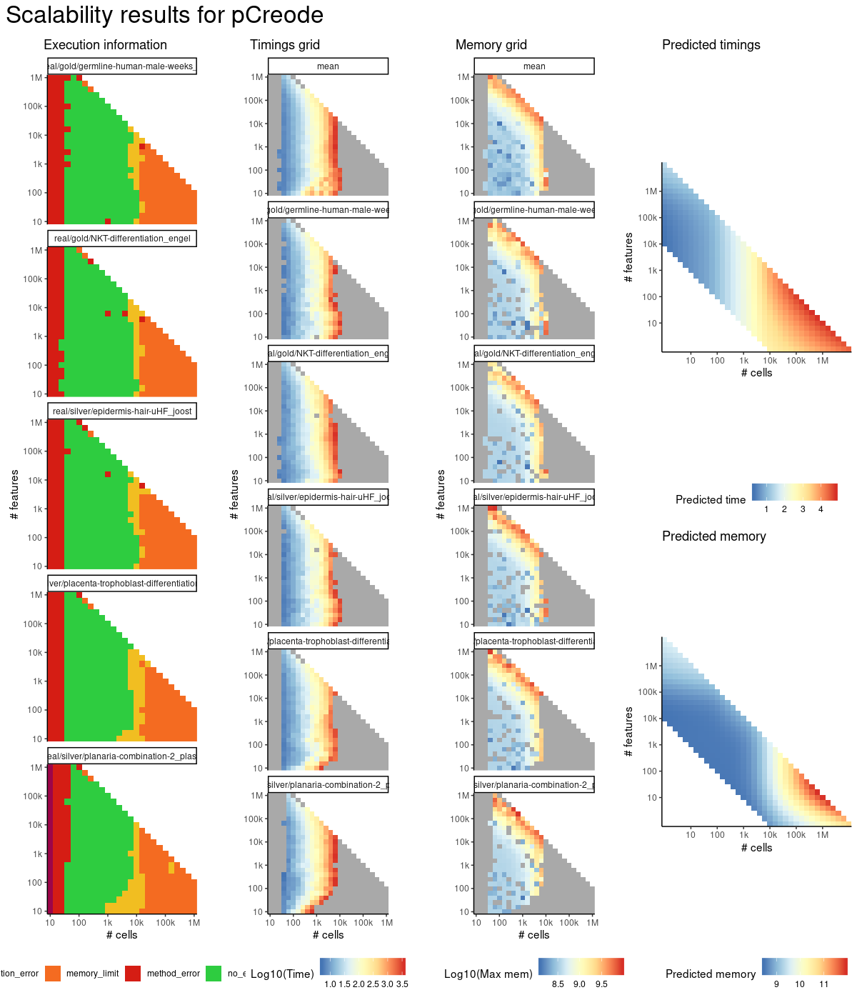
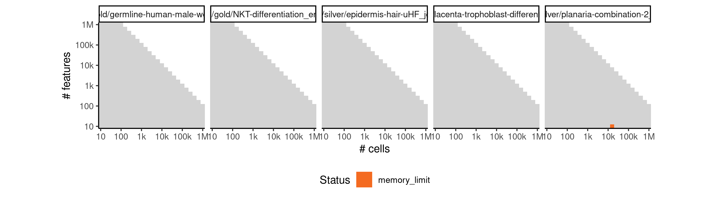

# pcreode


## ERROR STATUS MEMORY_LIMIT

### ERROR CLUSTER MEMORY_LIMIT -- 1


 * Number of instances: 8
 * Dataset ids: scaling_0697, scaling_0731, scaling_0782, scaling_0818, scaling_0876, scaling_0910, scaling_1006, scaling_1036

Last 10 lines of scaling_0697:
```
	params.json
Running /bin/singularity run --pwd /ti/workspace -B \
  '/data/tmp//RtmpOgsmre/file57025f073bf8/ti:/ti,/data/tmp//RtmpOgsmre/file5702f559302/tmp:/tmp2' \
  /group/irc/shared/dynverse/dynbenchmark/derived/singularity_images/dynverse/ti_pcreode.simg
Traceback (most recent call last):
  File "/code/run.py", line 43, in <module>
    mute = True
  File "/usr/local/lib/python2.7/site-packages/pcreode/functions.py", line 575, in pCreode
    Dist = np.array( pairwise_distances( down, down, n_jobs=1))
MemoryError
```

### ERROR CLUSTER MEMORY_LIMIT -- 2


 * Number of instances: 6
 * Dataset ids: scaling_0714, scaling_0836, scaling_0855, scaling_0898, scaling_1066, scaling_1104

Last 10 lines of scaling_0714:
```
    Dist_csr = csr_matrix( np.triu(Dist))
  File "/usr/local/lib/python2.7/site-packages/scipy/sparse/compressed.py", line 79, in __init__
    self._set_self(self.__class__(coo_matrix(arg1, dtype=dtype)))
  File "/usr/local/lib/python2.7/site-packages/scipy/sparse/coo.py", line 192, in __init__
    self._check()
  File "/usr/local/lib/python2.7/site-packages/scipy/sparse/coo.py", line 266, in _check
    self.row = np.asarray(self.row, dtype=idx_dtype)
  File "/usr/local/lib/python2.7/site-packages/numpy/core/numeric.py", line 501, in asarray
    return array(a, dtype, copy=False, order=order)
MemoryError
```

### ERROR CLUSTER MEMORY_LIMIT -- 3


 * Number of instances: 1
 * Dataset ids: scaling_0765

Last 10 lines of scaling_0765:
```
	params.json
Running /bin/singularity run --pwd /ti/workspace -B \
  '/data/tmp//Rtmp9Xa9ch/file1ec6812a10169/ti:/ti,/data/tmp//Rtmp9Xa9ch/file1ec683360819d/tmp:/tmp2' \
  /group/irc/shared/dynverse/dynbenchmark/derived/singularity_images/dynverse/ti_pcreode.simg
Traceback (most recent call last):
  File "/code/run.py", line 43, in <module>
    mute = True
  File "/usr/local/lib/python2.7/site-packages/pcreode/functions.py", line 625, in pCreode
    d_knn = _igraph.Graph.Weighted_Adjacency( dist_weighted_adj.tolist(), loops=False, mode=ADJ_UNDIRECTED)
MemoryError
```

### ERROR CLUSTER MEMORY_LIMIT -- 4


 * Number of instances: 11
 * Dataset ids: scaling_0783, scaling_0801, scaling_0942, scaling_0993, scaling_1021, scaling_1035, scaling_1049, scaling_1067, scaling_1105, scaling_1124, scaling_1143

Last 10 lines of scaling_0783:
```
  '/data/tmp//RtmpZEbMT8/file5e504f9c591/ti:/ti,/data/tmp//RtmpZEbMT8/file5e5044336b15/tmp:/tmp2' \
  /group/irc/shared/dynverse/dynbenchmark/derived/singularity_images/dynverse/ti_pcreode.simg
Traceback (most recent call last):
  File "/code/run.py", line 43, in <module>
    mute = True
  File "/usr/local/lib/python2.7/site-packages/pcreode/functions.py", line 614, in pCreode
    adj_coords = np.nonzero( np.triu( adj))
  File "/usr/local/lib/python2.7/site-packages/numpy/lib/twodim_base.py", line 439, in triu
    return where(mask, zeros(1, m.dtype), m)
MemoryError
```

### ERROR CLUSTER MEMORY_LIMIT -- 5


 * Number of instances: 6
 * Dataset ids: scaling_0819, scaling_0918, scaling_0934, scaling_0950, scaling_1007, scaling_1086

Last 10 lines of scaling_0819:
```
	params.json
Running /bin/singularity run --pwd /ti/workspace -B \
  '/data/tmp//RtmpYxX8Vm/file33eb337b5df9/ti:/ti,/data/tmp//RtmpYxX8Vm/file33eb76dd3aa1/tmp:/tmp2' \
  /group/irc/shared/dynverse/dynbenchmark/derived/singularity_images/dynverse/ti_pcreode.simg
Traceback (most recent call last):
  File "/code/run.py", line 43, in <module>
    mute = True
  File "/usr/local/lib/python2.7/site-packages/pcreode/functions.py", line 611, in pCreode
    den_adj = np.zeros( ( n_down, n_down), dtype=float)
MemoryError
```

### ERROR CLUSTER MEMORY_LIMIT -- 6


 * Number of instances: 2
 * Dataset ids: scaling_0837, scaling_0926

Last 10 lines of scaling_0837:
```
	params.json
Running /bin/singularity run --pwd /ti/workspace -B \
  '/data/tmp//RtmpFhcdb0/fileed281494dbbb/ti:/ti,/data/tmp//RtmpFhcdb0/fileed2848a96905/tmp:/tmp2' \
  /group/irc/shared/dynverse/dynbenchmark/derived/singularity_images/dynverse/ti_pcreode.simg
Traceback (most recent call last):
  File "/code/run.py", line 43, in <module>
    mute = True
  File "/usr/local/lib/python2.7/site-packages/pcreode/functions.py", line 623, in pCreode
    dens_weighted_adj = np.multiply( Dist, den_adj)
MemoryError
```

### ERROR CLUSTER MEMORY_LIMIT -- 7


 * Number of instances: 14
 * Dataset ids: scaling_0866, scaling_0877, scaling_0888, scaling_0899, scaling_0956, scaling_0962, scaling_0968, scaling_0974, scaling_0980, scaling_1068, scaling_1087, scaling_1106, scaling_1125, scaling_1144

Last 10 lines of scaling_0866:
```
	params.json
Running /bin/singularity run --pwd /ti/workspace -B \
  '/data/tmp//Rtmp2XYUrI/file193c84be61bab/ti:/ti,/data/tmp//Rtmp2XYUrI/file193c820864b0d/tmp:/tmp2' \
  /group/irc/shared/dynverse/dynbenchmark/derived/singularity_images/dynverse/ti_pcreode.simg
Traceback (most recent call last):
  File "/code/run.py", line 43, in <module>
    mute = True
  File "/usr/local/lib/python2.7/site-packages/pcreode/functions.py", line 592, in pCreode
    knn_adj = np.add( knn_adj, knn_adj.T)
MemoryError
```

### ERROR CLUSTER MEMORY_LIMIT -- 8


 * Number of instances: 9
 * Dataset ids: scaling_0994, scaling_1008, scaling_1022, scaling_1050, scaling_1069, scaling_1088, scaling_1107, scaling_1126, scaling_1145

Last 10 lines of scaling_0994:
```
    Dist = np.array( pairwise_distances( down, down, n_jobs=1))
  File "/usr/local/lib/python2.7/site-packages/sklearn/metrics/pairwise.py", line 1247, in pairwise_distances
    return _parallel_pairwise(X, Y, func, n_jobs, **kwds)
  File "/usr/local/lib/python2.7/site-packages/sklearn/metrics/pairwise.py", line 1090, in _parallel_pairwise
    return func(X, Y, **kwds)
  File "/usr/local/lib/python2.7/site-packages/sklearn/metrics/pairwise.py", line 246, in euclidean_distances
    distances = safe_sparse_dot(X, Y.T, dense_output=True)
  File "/usr/local/lib/python2.7/site-packages/sklearn/utils/extmath.py", line 140, in safe_sparse_dot
    return np.dot(a, b)
MemoryError
```

### ERROR CLUSTER MEMORY_LIMIT -- 9


 * Number of instances: 1
 * Dataset ids: scaling_1085

Last 10 lines of scaling_1085:
```
Traceback (most recent call last):
  File "/code/run.py", line 43, in <module>
    mute = True
  File "/usr/local/lib/python2.7/site-packages/pcreode/functions.py", line 595, in pCreode
    Dist_csr = csr_matrix( np.triu(Dist))
  File "/usr/local/lib/python2.7/site-packages/scipy/sparse/compressed.py", line 79, in __init__
    self._set_self(self.__class__(coo_matrix(arg1, dtype=dtype)))
  File "/usr/local/lib/python2.7/site-packages/scipy/sparse/coo.py", line 186, in __init__
    self.data = M[self.row, self.col]
MemoryError
```

## ERROR STATUS METHOD_ERROR

### ERROR CLUSTER METHOD_ERROR -- 1


 * Number of instances: 264
 * Dataset ids: scaling_0001, scaling_0002, scaling_0003, scaling_0004, scaling_0006, scaling_0007, scaling_0008, scaling_0009, scaling_0010, scaling_0011, scaling_0012, scaling_0013, scaling_0015, scaling_0016, scaling_0017, scaling_0018, scaling_0019, scaling_0020, scaling_0021, scaling_0022, scaling_0023, scaling_0024, scaling_0025, scaling_0026, scaling_0027, scaling_0029, scaling_0030, scaling_0031, scaling_0032, scaling_0033, scaling_0035, scaling_0036, scaling_0037, scaling_0038, scaling_0039, scaling_0040, scaling_0041, scaling_0043, scaling_0047, scaling_0051, scaling_0052, scaling_0053, scaling_0056, scaling_0057, scaling_0062, scaling_0063, scaling_0066, scaling_0067, scaling_0068, scaling_0072, scaling_0073, scaling_0076, scaling_0077, scaling_0078, scaling_0082, scaling_0083, scaling_0084, scaling_0088, scaling_0089, scaling_0090, scaling_0094, scaling_0095, scaling_0096, scaling_0101, scaling_0102, scaling_0106, scaling_0107, scaling_0108, scaling_0113, scaling_0114, scaling_0115, scaling_0120, scaling_0121, scaling_0122, scaling_0128, scaling_0129, scaling_0135, scaling_0136, scaling_0141, scaling_0145, scaling_0147, scaling_0149, scaling_0151, scaling_0152, scaling_0157, scaling_0158, scaling_0163, scaling_0164, scaling_0169, scaling_0170, scaling_0176, scaling_0181, scaling_0182, scaling_0188, scaling_0189, scaling_0195, scaling_0196, scaling_0202, scaling_0203, scaling_0210, scaling_0216, scaling_0218, scaling_0220, scaling_0222, scaling_0224, scaling_0226, scaling_0227, scaling_0232, scaling_0233, scaling_0238, scaling_0239, scaling_0244, scaling_0245, scaling_0251, scaling_0256, scaling_0264, scaling_0268, scaling_0272, scaling_0276, scaling_0277, scaling_0278, scaling_0287, scaling_0288, scaling_0298, scaling_0299, scaling_0300, scaling_0310, scaling_0311, scaling_0321, scaling_0322, scaling_0331, scaling_0335, scaling_0337, scaling_0339, scaling_0341, scaling_0342, scaling_0351, scaling_0352, scaling_0361, scaling_0362, scaling_0372, scaling_0382, scaling_0391, scaling_0392, scaling_0393, scaling_0404, scaling_0405, scaling_0406, scaling_0417, scaling_0418, scaling_0419, scaling_0431, scaling_0432, scaling_0444, scaling_0445, scaling_0446, scaling_0456, scaling_0457, scaling_0458, scaling_0466, scaling_0467, scaling_0476, scaling_0477, scaling_0487, scaling_0497, scaling_0498, scaling_0506, scaling_0510, scaling_0514, scaling_0518, scaling_0522, scaling_0526, scaling_0532, scaling_0538, scaling_0544, scaling_0550, scaling_0556, scaling_0557, scaling_0565, scaling_0566, scaling_0574, scaling_0575, scaling_0584, scaling_0593, scaling_0594, scaling_0602, scaling_0603, scaling_0604, scaling_0617, scaling_0618, scaling_0619, scaling_0633, scaling_0634, scaling_0635, scaling_0650, scaling_0651, scaling_0666, scaling_0667, scaling_0668, scaling_0681, scaling_0682, scaling_0683, scaling_0698, scaling_0699, scaling_0700, scaling_0715, scaling_0716, scaling_0717, scaling_0733, scaling_0734, scaling_0750, scaling_0751, scaling_0752, scaling_0766, scaling_0767, scaling_0768, scaling_0784, scaling_0785, scaling_0786, scaling_0802, scaling_0803, scaling_0804, scaling_0821, scaling_0822, scaling_0839, scaling_0840, scaling_0841, scaling_0856, scaling_0857, scaling_0867, scaling_0868, scaling_0878, scaling_0879, scaling_0890, scaling_0901, scaling_0902, scaling_0911, scaling_0919, scaling_0927, scaling_0935, scaling_0943, scaling_0951, scaling_0957, scaling_0963, scaling_0969, scaling_0975, scaling_0981, scaling_0982, scaling_0983, scaling_0995, scaling_0996, scaling_1009, scaling_1010, scaling_1024, scaling_1038, scaling_1039, scaling_1051, scaling_1052, scaling_1071, scaling_1089, scaling_1090, scaling_1109, scaling_1128, scaling_1129

Last 10 lines of scaling_0001:
```
    mute = True
  File "/usr/local/lib/python2.7/site-packages/pcreode/functions.py", line 642, in pCreode
    sil_score[ss] = metrics.silhouette_score( low_cls, labels=label, metric='l2')
  File "/usr/local/lib/python2.7/site-packages/sklearn/metrics/cluster/unsupervised.py", line 101, in silhouette_score
    return np.mean(silhouette_samples(X, labels, metric=metric, **kwds))
  File "/usr/local/lib/python2.7/site-packages/sklearn/metrics/cluster/unsupervised.py", line 167, in silhouette_samples
    check_number_of_labels(len(le.classes_), X.shape[0])
  File "/usr/local/lib/python2.7/site-packages/sklearn/metrics/cluster/unsupervised.py", line 19, in check_number_of_labels
    "to n_samples - 1 (inclusive)" % n_labels)
ValueError: Number of labels is 4. Valid values are 2 to n_samples - 1 (inclusive)
```

### ERROR CLUSTER METHOD_ERROR -- 2


 * Number of instances: 16
 * Dataset ids: scaling_0045, scaling_0061, scaling_0127, scaling_0309, scaling_0371, scaling_0430, scaling_0486, scaling_0583, scaling_0601, scaling_0649, scaling_0732, scaling_0820, scaling_0889, scaling_1023, scaling_1070, scaling_1108

Last 10 lines of scaling_0045:
```
Traceback (most recent call last):
  File "/code/run.py", line 43, in <module>
    mute = True
  File "/usr/local/lib/python2.7/site-packages/pcreode/functions.py", line 640, in pCreode
    kmeans_model  = _KMeans( n_clusters=ss+2, random_state=10).fit( low_cls)
  File "/usr/local/lib/python2.7/site-packages/sklearn/cluster/k_means_.py", line 887, in fit
    X = self._check_fit_data(X)
  File "/usr/local/lib/python2.7/site-packages/sklearn/cluster/k_means_.py", line 861, in _check_fit_data
    X.shape[0], self.n_clusters))
ValueError: n_samples=1 should be >= n_clusters=2
```

### ERROR CLUSTER METHOD_ERROR -- 3


 * Number of instances: 1
 * Dataset ids: scaling_0260

Last 10 lines of scaling_0260:
```
  '/data/tmp//RtmpB33HPG/file636d9cce0c0/ti:/ti,/data/tmp//RtmpB33HPG/file636d88cce2c/tmp:/tmp2' \
  /group/irc/shared/dynverse/dynbenchmark/derived/singularity_images/dynverse/ti_pcreode.simg
Traceback (most recent call last):
  File "/code/run.py", line 43, in <module>
    mute = True
  File "/usr/local/lib/python2.7/site-packages/pcreode/functions.py", line 701, in pCreode
    aligned_ind = consensus_alignment( down, hi_pl_ind.copy(), data, density, noise)
  File "/usr/local/lib/python2.7/site-packages/pcreode/functions.py", line 391, in consensus_alignment
    new_nodes[jj] = np.median( no_noise[chunks[ss][node_ind==hi_pl_ind[jj]]], axis=0)
IndexError: index 13 is out of bounds for axis 0 with size 13
```

### ERROR CLUSTER METHOD_ERROR -- 4


 * Number of instances: 1
 * Dataset ids: scaling_0286

Last 10 lines of scaling_0286:
```
Traceback (most recent call last):
  File "/code/run.py", line 43, in <module>
    mute = True
  File "/usr/local/lib/python2.7/site-packages/pcreode/functions.py", line 698, in pCreode
    hi_pl, hi_pl_ind = hierarchical_placement( dens_knn, cen_ind)
  File "/usr/local/lib/python2.7/site-packages/pcreode/functions.py", line 284, in hierarchical_placement
    run_dist = get_graph_distance( end_ind, to_ind, graph)
  File "/usr/local/lib/python2.7/site-packages/pcreode/functions.py", line 120, in get_graph_distance
    d[ii,:] = graph.shortest_paths( from_ind[ii], to_ind, weights="weight")[0]
igraph._igraph.InternalError: Error at structural_properties.c:5200: cannot run Bellman-Ford algorithm, Negative loop detected while calculating shortest paths
```

## ERROR STATUS TIME_LIMIT

### ERROR CLUSTER TIME_LIMIT -- 1


 * Number of instances: 52
 * Dataset ids: scaling_0330, scaling_0389, scaling_0390, scaling_0442, scaling_0454, scaling_0455, scaling_0495, scaling_0505, scaling_0525, scaling_0549, scaling_0555, scaling_0591, scaling_0599, scaling_0600, scaling_0616, scaling_0632, scaling_0648, scaling_0663, scaling_0664, scaling_0678, scaling_0679, scaling_0680, scaling_0747, scaling_0748, scaling_0762, scaling_0763, scaling_0764, scaling_0800, scaling_0835, scaling_0852, scaling_0853, scaling_0854, scaling_0865, scaling_0875, scaling_0887, scaling_0897, scaling_0908, scaling_0909, scaling_0949, scaling_0961, scaling_0973, scaling_0979, scaling_0992, scaling_1020, scaling_1034, scaling_1047, scaling_1048, scaling_1084, scaling_1122, scaling_1123, scaling_1141, scaling_1142

Last 10 lines of scaling_0330:
```
File: /home/rcannood/Workspace/dynverse/dynbenchmark//derived/05-scaling/suite/pcreode/Cat1/r2gridengine/20181008_142058_pcreode_Cat1_PbkoO07k8G/log/log.330.e.txt
```


