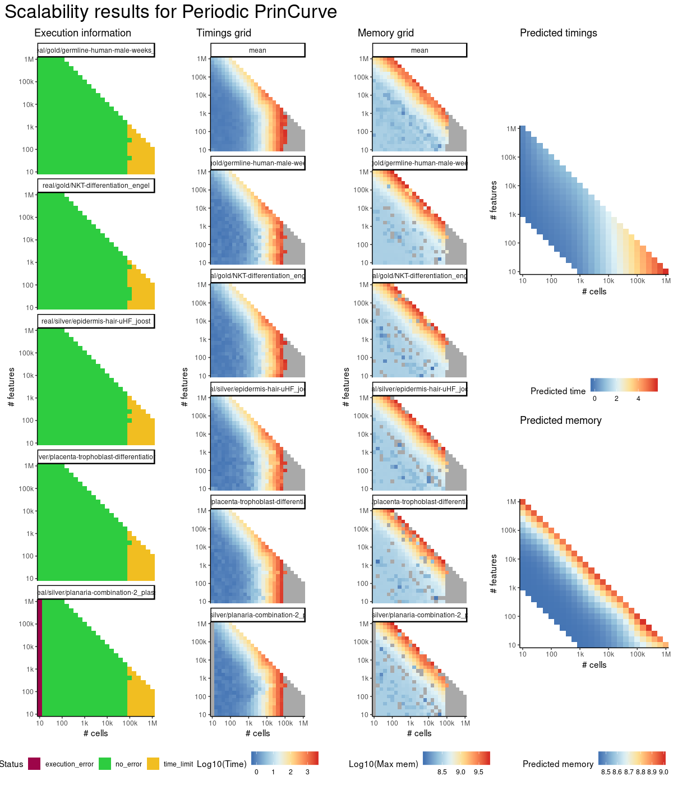
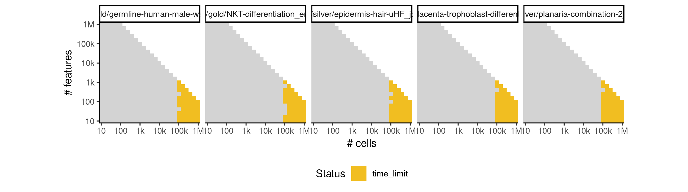

# periodpc


## ERROR STATUS TIME_LIMIT

### ERROR CLUSTER TIME_LIMIT -- 1


 * Number of instances: 5
 * Dataset ids: scaling_0994, scaling_1008, scaling_1022, scaling_1036, scaling_1050

Last 10 lines of scaling_0994:
```
File: /home/rcannood/Workspace/dynverse/dynbenchmark//derived/05-scaling/suite/periodpc/10/r2gridengine/20180924_184946_periodpc_10_WRC45MezjI/log/log.994.e.txt
```


