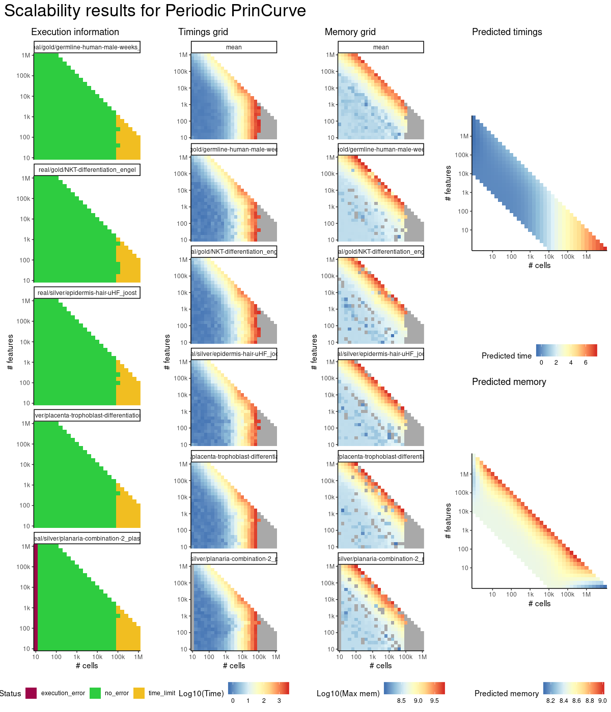
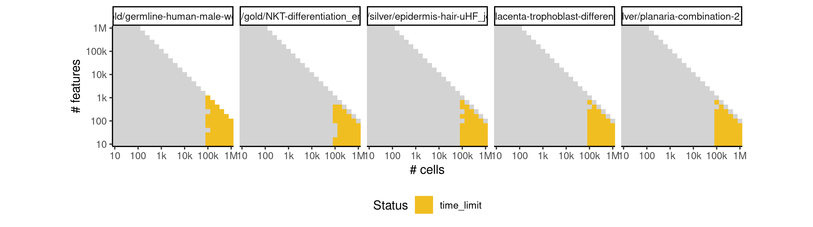

# periodpc


## ERROR STATUS TIME_LIMIT

### ERROR CLUSTER TIME_LIMIT -- 1


 * Number of instances: 95
 * Dataset ids: scaling_1069, scaling_1088, scaling_1107, scaling_1126, scaling_1145, scaling_1180, scaling_1181, scaling_1196, scaling_1197, scaling_1212, scaling_1213, scaling_1228, scaling_1229, scaling_1244, scaling_1245, scaling_1294, scaling_1295, scaling_1296, scaling_1316, scaling_1317, scaling_1336, scaling_1337, scaling_1338, scaling_1357, scaling_1358, scaling_1359, scaling_1378, scaling_1379, scaling_1380, scaling_1392, scaling_1404, scaling_1415, scaling_1416, scaling_1427, scaling_1428, scaling_1439, scaling_1440, scaling_1451, scaling_1452, scaling_1463, scaling_1464, scaling_1475, scaling_1476, scaling_1487, scaling_1488, scaling_1499, scaling_1500, scaling_1506, scaling_1518, scaling_1524, scaling_1530, scaling_1546, scaling_1547, scaling_1548, scaling_1549, scaling_1565, scaling_1566, scaling_1567, scaling_1568, scaling_1584, scaling_1585, scaling_1586, scaling_1587, scaling_1603, scaling_1604, scaling_1605, scaling_1606, scaling_1622, scaling_1623, scaling_1624, scaling_1625, scaling_1643, scaling_1644, scaling_1645, scaling_1646, scaling_1647, scaling_1665, scaling_1666, scaling_1667, scaling_1668, scaling_1669, scaling_1688, scaling_1689, scaling_1690, scaling_1691, scaling_1709, scaling_1710, scaling_1711, scaling_1712, scaling_1713, scaling_1731, scaling_1732, scaling_1733, scaling_1734, scaling_1735

Last 10 lines of scaling_1069:
```
File: /home/rcannood/Workspace/dynverse/dynbenchmark//derived/05-scaling/suite/periodpc/Cat2/r2gridengine/20181008_214530_periodpc_Cat2_kzjNm2d9Dq/log/log.389.e.txt
```


