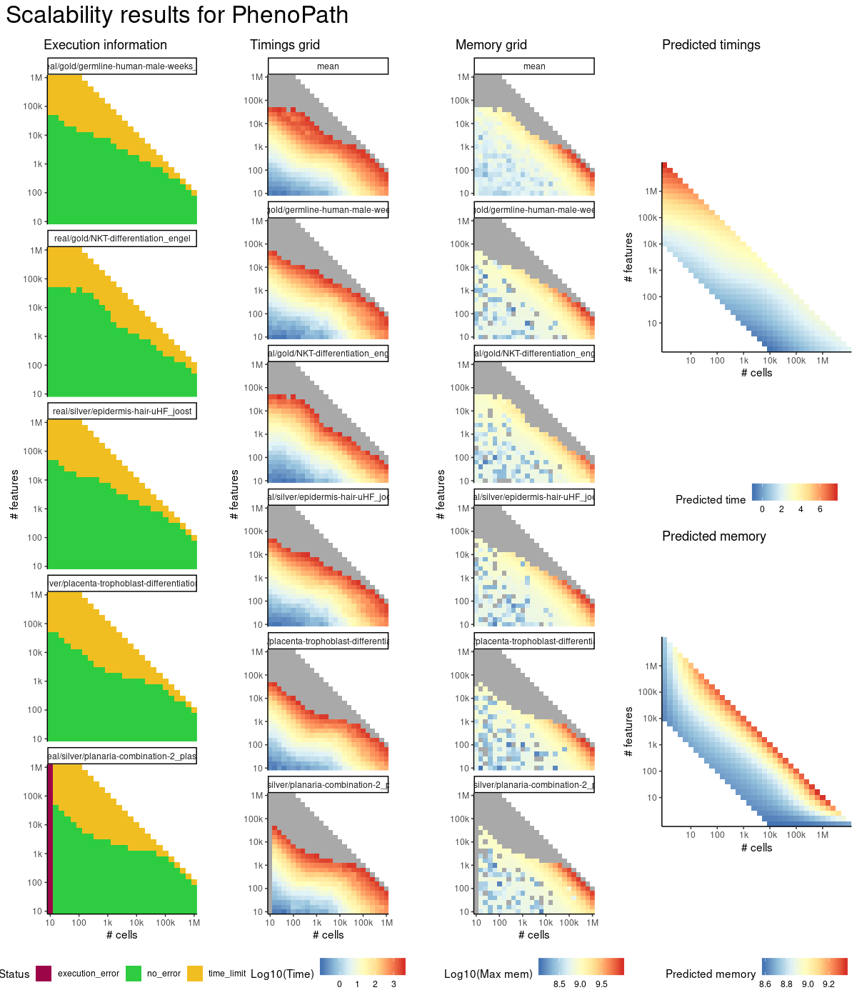

# phenopath


## ERROR STATUS EXECUTION_ERROR

### ERROR CLUSTER EXECUTION_ERROR -- 1


 * Number of instances: 1
 * Dataset ids: scaling_0693

Last 10 lines of scaling_0693:
```
File: /home/rcannood/Workspace/dynverse/dynbenchmark//derived/05-scaling/suite/phenopath/10/r2gridengine/20180924_185042_phenopath_10_xKMe6IJX0N/log/log.693.e.txt
Execution halted
```

## ERROR STATUS TIME_LIMIT

### ERROR CLUSTER TIME_LIMIT -- 1


 * Number of instances: 10
 * Dataset ids: scaling_0951, scaling_0963, scaling_0969, scaling_0975, scaling_0981, scaling_0995, scaling_1009, scaling_1023, scaling_1024, scaling_1038

Last 10 lines of scaling_0951:
```
File: /home/rcannood/Workspace/dynverse/dynbenchmark//derived/05-scaling/suite/phenopath/10/r2gridengine/20180924_185042_phenopath_10_xKMe6IJX0N/log/log.951.e.txt
```


