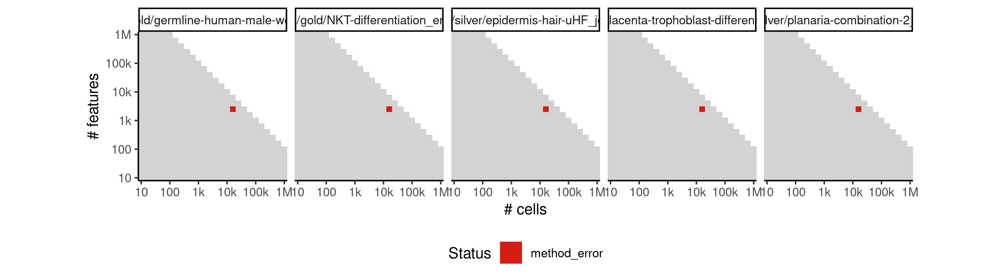
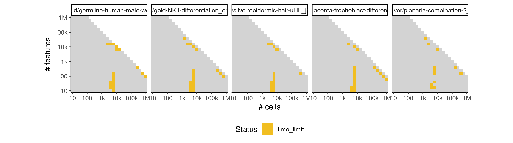
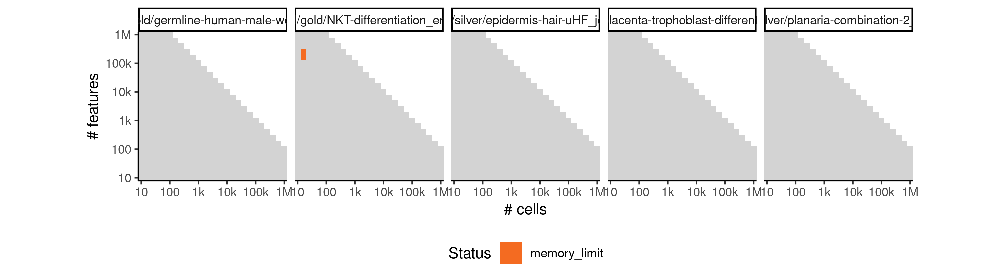

# projected_monocle


## ERROR STATUS METHOD_ERROR

### ERROR CLUSTER METHOD_ERROR -- 1


 * Number of instances: 27
 * Dataset ids: scaling_0007, scaling_0010, scaling_0041, scaling_0061, scaling_0121, scaling_0135, scaling_0150, scaling_0176, scaling_0224, scaling_0272, scaling_0326, scaling_0450, scaling_0455, scaling_0501, scaling_0505, scaling_0553, scaling_0680, scaling_0759, scaling_0760, scaling_0848, scaling_0849, scaling_0910, scaling_0947, scaling_0948, scaling_1045, scaling_1145, scaling_1380

Last 10 lines of scaling_0007:
```
Loading required package: VGAM
Loading required package: stats4
Loading required package: splines
Loading required package: DDRTree
Loading required package: irlba
Removing 1 outliers
Error in parametricDispersionFit(disp_table[row.names(disp_table) %in%  : 
  Parametric dispersion fit failed. Try a local fit and/or a pooled estimation. (See '?estimateDispersions')
Calls: <Anonymous> ... estimateDispersionsForCellDataSet -> parametricDispersionFit
Execution halted
```

### ERROR CLUSTER METHOD_ERROR -- 2


 * Number of instances: 119
 * Dataset ids: scaling_0011, scaling_0045, scaling_0050, scaling_0051, scaling_0072, scaling_0101, scaling_0102, scaling_0103, scaling_0104, scaling_0105, scaling_0136, scaling_0139, scaling_0178, scaling_0213, scaling_0214, scaling_0225, scaling_0251, scaling_0255, scaling_0274, scaling_0321, scaling_0327, scaling_0330, scaling_0339, scaling_0371, scaling_0387, scaling_0388, scaling_0390, scaling_0444, scaling_0445, scaling_0452, scaling_0453, scaling_0498, scaling_0502, scaling_0503, scaling_0504, scaling_0522, scaling_0550, scaling_0554, scaling_0594, scaling_0598, scaling_0668, scaling_0676, scaling_0677, scaling_0751, scaling_0752, scaling_0762, scaling_0763, scaling_0764, scaling_0820, scaling_0840, scaling_0841, scaling_0851, scaling_0853, scaling_0889, scaling_0901, scaling_0907, scaling_0908, scaling_0909, scaling_0949, scaling_0979, scaling_1023, scaling_1038, scaling_1047, scaling_1048, scaling_1049, scaling_1108, scaling_1128, scaling_1129, scaling_1141, scaling_1142, scaling_1143, scaling_1144, scaling_1164, scaling_1165, scaling_1214, scaling_1242, scaling_1262, scaling_1265, scaling_1275, scaling_1339, scaling_1362, scaling_1363, scaling_1376, scaling_1378, scaling_1429, scaling_1430, scaling_1438, scaling_1440, scaling_1477, scaling_1498, scaling_1500, scaling_1530, scaling_1588, scaling_1609, scaling_1610, scaling_1621, scaling_1622, scaling_1624, scaling_1625, scaling_1692, scaling_1713, scaling_1715, scaling_1716, scaling_1731, scaling_1732, scaling_1838, scaling_1839, scaling_1873, scaling_1874, scaling_1879, scaling_1979, scaling_1980, scaling_1998, scaling_2000, scaling_2033, scaling_2113, scaling_2114, scaling_2225, scaling_2329

Last 10 lines of scaling_0011:
```
Loading required package: ggplot2
Loading required package: VGAM
Loading required package: stats4
Loading required package: splines
Loading required package: DDRTree
Loading required package: irlba
Error in parametricDispersionFit(disp_table, verbose) : 
  Parametric dispersion fit failed. Try a local fit and/or a pooled estimation. (See '?estimateDispersions')
Calls: <Anonymous> ... estimateDispersionsForCellDataSet -> parametricDispersionFit
Execution halted
```

### ERROR CLUSTER METHOD_ERROR -- 3


 * Number of instances: 9
 * Dataset ids: scaling_0013, scaling_0015, scaling_0027, scaling_0029, scaling_0038, scaling_0039, scaling_0047, scaling_0070, scaling_0074

Last 10 lines of scaling_0013:
```
Loading required package: VGAM
Loading required package: stats4
Loading required package: splines
Loading required package: DDRTree
Loading required package: irlba
Error in if (coefs[2] < 0) { : missing value where TRUE/FALSE needed
Calls: <Anonymous> ... estimateDispersionsForCellDataSet -> parametricDispersionFit
In addition: Warning message:
In dgamma(y, 1/disp, scale = mu * disp, log = TRUE) : NaNs produced
Execution halted
```

### ERROR CLUSTER METHOD_ERROR -- 4


 * Number of instances: 13
 * Dataset ids: scaling_0022, scaling_0075, scaling_0275, scaling_0322, scaling_0382, scaling_0600, scaling_0667, scaling_0850, scaling_1243, scaling_1499, scaling_1623, scaling_1733, scaling_1997

Last 10 lines of scaling_0022:
```
Loading required package: splines
Loading required package: DDRTree
Loading required package: irlba
Removing 1 outliers
Error in parametricDispersionFit(disp_table[row.names(disp_table) %in%  : 
  Parametric dispersion fit failed. Try a local fit and/or a pooled estimation. (See '?estimateDispersions')
Calls: <Anonymous> ... estimateDispersionsForCellDataSet -> parametricDispersionFit
In addition: Warning message:
glm.fit: algorithm did not converge 
Execution halted
```

### ERROR CLUSTER METHOD_ERROR -- 5


 * Number of instances: 5
 * Dataset ids: scaling_0026, scaling_0037, scaling_0067, scaling_0068, scaling_0096

Last 10 lines of scaling_0026:
```
Loading required package: DDRTree
Loading required package: irlba
Error in glm.fit(x = numeric(0), y = numeric(0), weights = NULL, start = c(1e-06,  : 
  object 'fit' not found
Calls: <Anonymous> ... parametricDispersionFit -> glm -> eval -> eval -> glm.fit
In addition: Warning messages:
1: In glm.fit(x = numeric(0), y = numeric(0), weights = NULL, start = c(1e-06,  :
  no observations informative at iteration 1
2: glm.fit: algorithm did not converge 
Execution halted
```

### ERROR CLUSTER METHOD_ERROR -- 6


 * Number of instances: 1
 * Dataset ids: scaling_0040

Last 10 lines of scaling_0040:
```
Loading required package: splines
Loading required package: DDRTree
Loading required package: irlba
Removing 2 outliers
Error in parametricDispersionFit(disp_table[row.names(disp_table) %in%  : 
  Parametric dispersion fit failed. Try a local fit and/or a pooled estimation. (See '?estimateDispersions')
Calls: <Anonymous> ... estimateDispersionsForCellDataSet -> parametricDispersionFit
In addition: Warning message:
In dgamma(y, 1/disp, scale = mu * disp, log = TRUE) : NaNs produced
Execution halted
```

### ERROR CLUSTER METHOD_ERROR -- 7


 * Number of instances: 2
 * Dataset ids: scaling_0069, scaling_0761

Last 10 lines of scaling_0069:
```
Loading required package: irlba
Error in parametricDispersionFit(disp_table, verbose) : 
  Parametric dispersion fit failed. Try a local fit and/or a pooled estimation. (See '?estimateDispersions')
Calls: <Anonymous> ... estimateDispersionsForCellDataSet -> parametricDispersionFit
In addition: Warning messages:
1: In log(ifelse(y == 0, 1, y/mu)) : NaNs produced
2: step size truncated due to divergence 
3: In log(ifelse(y == 0, 1, y/mu)) : NaNs produced
4: step size truncated due to divergence 
Execution halted
```

### ERROR CLUSTER METHOD_ERROR -- 8


 * Number of instances: 3
 * Dataset ids: scaling_0111, scaling_0125, scaling_1245

Last 10 lines of scaling_0111:
```
Loading required package: DDRTree
Loading required package: irlba
Removing 1 outliers
Error in parametricDispersionFit(disp_table[row.names(disp_table) %in%  : 
  Parametric dispersion fit failed. Try a local fit and/or a pooled estimation. (See '?estimateDispersions')
Calls: <Anonymous> ... estimateDispersionsForCellDataSet -> parametricDispersionFit
In addition: Warning messages:
1: glm.fit: algorithm did not converge 
2: glm.fit: algorithm did not converge 
Execution halted
```

### ERROR CLUSTER METHOD_ERROR -- 9


 * Number of instances: 1
 * Dataset ids: scaling_0451

Last 10 lines of scaling_0451:
```
2: step size truncated due to divergence 
3: In log(ifelse(y == 0, 1, y/mu)) : NaNs produced
4: step size truncated due to divergence 
5: In log(ifelse(y == 0, 1, y/mu)) : NaNs produced
6: step size truncated due to divergence 
7: In log(ifelse(y == 0, 1, y/mu)) : NaNs produced
8: step size truncated due to divergence 
9: glm.fit: algorithm did not converge 
10: glm.fit: algorithm stopped at boundary value 
Execution halted
```

### ERROR CLUSTER METHOD_ERROR -- 10


 * Number of instances: 7
 * Dataset ids: scaling_0666, scaling_0750, scaling_0839, scaling_0943, scaling_0975, scaling_1154, scaling_1361

Last 10 lines of scaling_0666:
```
Loading required package: DDRTree
Loading required package: irlba
Error in parametricDispersionFit(disp_table, verbose) : 
  Parametric dispersion fit failed. Try a local fit and/or a pooled estimation. (See '?estimateDispersions')
Calls: <Anonymous> ... estimateDispersionsForCellDataSet -> parametricDispersionFit
In addition: Warning messages:
1: In log(ifelse(y == 0, 1, y/mu)) : NaNs produced
2: step size truncated due to divergence 
3: In log(ifelse(y == 0, 1, y/mu)) : NaNs produced
Execution halted
```

### ERROR CLUSTER METHOD_ERROR -- 11


 * Number of instances: 2
 * Dataset ids: scaling_1231, scaling_1490

Last 10 lines of scaling_1231:
```
Loading required package: irlba
Error in parametricDispersionFit(disp_table, verbose) : 
  Parametric dispersion fit failed. Try a local fit and/or a pooled estimation. (See '?estimateDispersions')
Calls: <Anonymous> ... estimateDispersionsForCellDataSet -> parametricDispersionFit
In addition: Warning messages:
1: In log(ifelse(y == 0, 1, y/mu)) : NaNs produced
2: step size truncated due to divergence 
3: In log(ifelse(y == 0, 1, y/mu)) : NaNs produced
4: glm.fit: algorithm did not converge 
Execution halted
```

### ERROR CLUSTER METHOD_ERROR -- 12


 * Number of instances: 3
 * Dataset ids: scaling_1608, scaling_1752, scaling_1826

Last 10 lines of scaling_1608:
```
Loading required package: irlba
Error in parametricDispersionFit(disp_table, verbose) : 
  Parametric dispersion fit failed. Try a local fit and/or a pooled estimation. (See '?estimateDispersions')
Calls: <Anonymous> ... estimateDispersionsForCellDataSet -> parametricDispersionFit
In addition: Warning messages:
1: In log(ifelse(y == 0, 1, y/mu)) : NaNs produced
2: step size truncated due to divergence 
3: In log(ifelse(y == 0, 1, y/mu)) : NaNs produced
4: In log(ifelse(y == 0, 1, y/mu)) : NaNs produced
Execution halted
```

### ERROR CLUSTER METHOD_ERROR -- 13


 * Number of instances: 1
 * Dataset ids: scaling_1735

Last 10 lines of scaling_1735:
```
Loading required package: irlba
Removing 1 outliers
Error in parametricDispersionFit(disp_table[row.names(disp_table) %in%  : 
  Parametric dispersion fit failed. Try a local fit and/or a pooled estimation. (See '?estimateDispersions')
Calls: <Anonymous> ... estimateDispersionsForCellDataSet -> parametricDispersionFit
In addition: Warning messages:
1: glm.fit: algorithm did not converge 
2: glm.fit: algorithm did not converge 
3: glm.fit: algorithm did not converge 
Execution halted
```

### ERROR CLUSTER METHOD_ERROR -- 14


 * Number of instances: 5
 * Dataset ids: scaling_2049, scaling_2064, scaling_2079, scaling_2094, scaling_2109

Last 10 lines of scaling_2049:
```
Loading required package: ggplot2
Loading required package: VGAM
Loading required package: stats4
Loading required package: splines
Loading required package: DDRTree
Loading required package: irlba
Removing 60 outliers
[1] 2201
Error: memory exhausted (limit reached?)
Execution halted
```

## ERROR STATUS TIME_LIMIT

### ERROR CLUSTER TIME_LIMIT -- 1


 * Number of instances: 105
 * Dataset ids: scaling_0475, scaling_0485, scaling_0495, scaling_0531, scaling_0537, scaling_0543, scaling_0549, scaling_0555, scaling_0564, scaling_0573, scaling_0582, scaling_0591, scaling_0614, scaling_0615, scaling_0630, scaling_0631, scaling_0646, scaling_0647, scaling_0663, scaling_0678, scaling_0679, scaling_0694, scaling_0695, scaling_0711, scaling_0712, scaling_0728, scaling_0729, scaling_0746, scaling_0780, scaling_0798, scaling_0816, scaling_0834, scaling_0852, scaling_0917, scaling_0925, scaling_0933, scaling_0941, scaling_0991, scaling_1005, scaling_1019, scaling_1033, scaling_1064, scaling_1083, scaling_1102, scaling_1121, scaling_1140, scaling_1252, scaling_1260, scaling_1264, scaling_1352, scaling_1373, scaling_2047, scaling_2062, scaling_2077, scaling_2092, scaling_2107, scaling_2124, scaling_2139, scaling_2142, scaling_2152, scaling_2154, scaling_2168, scaling_2169, scaling_2170, scaling_2175, scaling_2176, scaling_2177, scaling_2184, scaling_2185, scaling_2186, scaling_2192, scaling_2201, scaling_2202, scaling_2206, scaling_2207, scaling_2208, scaling_2209, scaling_2218, scaling_2222, scaling_2224, scaling_2235, scaling_2236, scaling_2237, scaling_2243, scaling_2245, scaling_2246, scaling_2256, scaling_2257, scaling_2258, scaling_2259, scaling_2266, scaling_2277, scaling_2278, scaling_2279, scaling_2285, scaling_2286, scaling_2287, scaling_2288, scaling_2298, scaling_2307, scaling_2319, scaling_2321, scaling_2322, scaling_2328, scaling_2330

Last 10 lines of scaling_0475:
```
File: /home/rcannood/Workspace/dynverse/dynbenchmark//derived/05-scaling/suite/projected_monocle/Cat1/r2gridengine/20181008_142053_projected_monocle_Cat1_WDa86jaQx3/log/log.475.e.txt
```

## ERROR STATUS MEMORY_LIMIT

### ERROR CLUSTER MEMORY_LIMIT -- 1


 * Number of instances: 434
 * Dataset ids: scaling_0616, scaling_0632, scaling_0648, scaling_0664, scaling_0696, scaling_0697, scaling_0713, scaling_0714, scaling_0730, scaling_0731, scaling_0747, scaling_0748, scaling_0765, scaling_0781, scaling_0782, scaling_0783, scaling_0799, scaling_0800, scaling_0801, scaling_0817, scaling_0818, scaling_0819, scaling_0835, scaling_0836, scaling_0837, scaling_0854, scaling_0855, scaling_0856, scaling_0864, scaling_0865, scaling_0866, scaling_0867, scaling_0875, scaling_0876, scaling_0877, scaling_0878, scaling_0886, scaling_0887, scaling_0888, scaling_0897, scaling_0898, scaling_0899, scaling_0918, scaling_0926, scaling_0934, scaling_0942, scaling_0950, scaling_0951, scaling_0955, scaling_0956, scaling_0957, scaling_0961, scaling_0962, scaling_0963, scaling_0967, scaling_0968, scaling_0969, scaling_0973, scaling_0974, scaling_0980, scaling_0992, scaling_0993, scaling_0994, scaling_1006, scaling_1007, scaling_1008, scaling_1020, scaling_1021, scaling_1022, scaling_1034, scaling_1035, scaling_1036, scaling_1050, scaling_1052, scaling_1065, scaling_1066, scaling_1067, scaling_1068, scaling_1069, scaling_1071, scaling_1084, scaling_1085, scaling_1086, scaling_1087, scaling_1088, scaling_1090, scaling_1103, scaling_1104, scaling_1105, scaling_1106, scaling_1107, scaling_1109, scaling_1122, scaling_1123, scaling_1124, scaling_1125, scaling_1126, scaling_1147, scaling_1149, scaling_1151, scaling_1153, scaling_1155, scaling_1156, scaling_1157, scaling_1158, scaling_1159, scaling_1160, scaling_1161, scaling_1162, scaling_1163, scaling_1177, scaling_1178, scaling_1179, scaling_1180, scaling_1181, scaling_1193, scaling_1194, scaling_1195, scaling_1196, scaling_1197, scaling_1209, scaling_1210, scaling_1211, scaling_1212, scaling_1213, scaling_1225, scaling_1226, scaling_1227, scaling_1228, scaling_1229, scaling_1241, scaling_1244, scaling_1249, scaling_1253, scaling_1257, scaling_1261, scaling_1266, scaling_1267, scaling_1268, scaling_1269, scaling_1270, scaling_1271, scaling_1272, scaling_1273, scaling_1274, scaling_1290, scaling_1291, scaling_1292, scaling_1293, scaling_1294, scaling_1295, scaling_1296, scaling_1311, scaling_1312, scaling_1313, scaling_1314, scaling_1315, scaling_1316, scaling_1317, scaling_1332, scaling_1333, scaling_1334, scaling_1335, scaling_1336, scaling_1337, scaling_1338, scaling_1353, scaling_1354, scaling_1355, scaling_1356, scaling_1357, scaling_1358, scaling_1359, scaling_1374, scaling_1375, scaling_1377, scaling_1379, scaling_1383, scaling_1389, scaling_1390, scaling_1391, scaling_1392, scaling_1395, scaling_1401, scaling_1402, scaling_1403, scaling_1404, scaling_1407, scaling_1413, scaling_1414, scaling_1415, scaling_1416, scaling_1419, scaling_1425, scaling_1426, scaling_1427, scaling_1428, scaling_1431, scaling_1437, scaling_1439, scaling_1448, scaling_1449, scaling_1450, scaling_1451, scaling_1452, scaling_1460, scaling_1461, scaling_1462, scaling_1463, scaling_1464, scaling_1472, scaling_1473, scaling_1474, scaling_1475, scaling_1476, scaling_1484, scaling_1485, scaling_1486, scaling_1487, scaling_1488, scaling_1496, scaling_1497, scaling_1502, scaling_1505, scaling_1506, scaling_1508, scaling_1511, scaling_1512, scaling_1514, scaling_1517, scaling_1518, scaling_1520, scaling_1523, scaling_1524, scaling_1526, scaling_1529, scaling_1543, scaling_1544, scaling_1545, scaling_1546, scaling_1547, scaling_1548, scaling_1549, scaling_1562, scaling_1563, scaling_1564, scaling_1565, scaling_1566, scaling_1567, scaling_1568, scaling_1581, scaling_1582, scaling_1583, scaling_1584, scaling_1585, scaling_1586, scaling_1587, scaling_1600, scaling_1601, scaling_1602, scaling_1603, scaling_1604, scaling_1605, scaling_1606, scaling_1619, scaling_1620, scaling_1631, scaling_1641, scaling_1642, scaling_1643, scaling_1644, scaling_1645, scaling_1646, scaling_1647, scaling_1653, scaling_1663, scaling_1664, scaling_1665, scaling_1666, scaling_1667, scaling_1668, scaling_1669, scaling_1675, scaling_1685, scaling_1686, scaling_1687, scaling_1688, scaling_1689, scaling_1690, scaling_1691, scaling_1697, scaling_1707, scaling_1708, scaling_1709, scaling_1710, scaling_1711, scaling_1712, scaling_1719, scaling_1729, scaling_1730, scaling_1734, scaling_1738, scaling_1739, scaling_1742, scaling_1743, scaling_1746, scaling_1747, scaling_1750, scaling_1751, scaling_1754, scaling_1755, scaling_1756, scaling_1757, scaling_1758, scaling_1759, scaling_1760, scaling_1761, scaling_1762, scaling_1763, scaling_1764, scaling_1765, scaling_1777, scaling_1778, scaling_1779, scaling_1780, scaling_1792, scaling_1793, scaling_1794, scaling_1795, scaling_1807, scaling_1808, scaling_1809, scaling_1810, scaling_1822, scaling_1823, scaling_1824, scaling_1825, scaling_1837, scaling_1840, scaling_1846, scaling_1847, scaling_1848, scaling_1854, scaling_1855, scaling_1856, scaling_1862, scaling_1863, scaling_1864, scaling_1870, scaling_1871, scaling_1872, scaling_1878, scaling_1880, scaling_1906, scaling_1907, scaling_1908, scaling_1909, scaling_1910, scaling_1911, scaling_1912, scaling_1928, scaling_1929, scaling_1930, scaling_1931, scaling_1932, scaling_1933, scaling_1934, scaling_1950, scaling_1951, scaling_1952, scaling_1953, scaling_1954, scaling_1955, scaling_1956, scaling_1972, scaling_1973, scaling_1974, scaling_1975, scaling_1976, scaling_1977, scaling_1978, scaling_1994, scaling_1995, scaling_1996, scaling_1999, scaling_2007, scaling_2008, scaling_2015, scaling_2016, scaling_2023, scaling_2024, scaling_2031, scaling_2032, scaling_2039, scaling_2040, scaling_2052, scaling_2053, scaling_2054, scaling_2055, scaling_2067, scaling_2068, scaling_2069, scaling_2070, scaling_2082, scaling_2083, scaling_2084, scaling_2085, scaling_2097, scaling_2098, scaling_2099, scaling_2100, scaling_2112, scaling_2115, scaling_2121, scaling_2127, scaling_2133, scaling_2145, scaling_2158, scaling_2159, scaling_2160, scaling_2161, scaling_2174, scaling_2190, scaling_2191, scaling_2193, scaling_2223, scaling_2244, scaling_2264, scaling_2265, scaling_2267, scaling_2306, scaling_2308, scaling_2309, scaling_2327

Last 10 lines of scaling_0616:
```
Loading required package: stats4
Loading required package: splines
Loading required package: DDRTree
Loading required package: irlba
Removing 1 outliers
[1] 10
Error in DDRTree_reduce_dim(X, Z, Y, W, dimensions, maxIter, K, sigma,  : 
  std::bad_alloc
Calls: <Anonymous> -> DDRTree -> DDRTree_reduce_dim
Execution halted
```

### ERROR CLUSTER MEMORY_LIMIT -- 2


 * Number of instances: 340
 * Dataset ids: scaling_0981, scaling_0995, scaling_1009, scaling_1051, scaling_1070, scaling_1089, scaling_1146, scaling_1148, scaling_1150, scaling_1152, scaling_1166, scaling_1167, scaling_1182, scaling_1198, scaling_1199, scaling_1215, scaling_1246, scaling_1250, scaling_1254, scaling_1258, scaling_1276, scaling_1277, scaling_1278, scaling_1279, scaling_1297, scaling_1299, scaling_1300, scaling_1318, scaling_1319, scaling_1320, scaling_1321, scaling_1340, scaling_1341, scaling_1342, scaling_1381, scaling_1382, scaling_1393, scaling_1394, scaling_1405, scaling_1406, scaling_1417, scaling_1418, scaling_1441, scaling_1442, scaling_1443, scaling_1453, scaling_1455, scaling_1465, scaling_1466, scaling_1467, scaling_1478, scaling_1479, scaling_1491, scaling_1501, scaling_1507, scaling_1513, scaling_1519, scaling_1525, scaling_1531, scaling_1532, scaling_1533, scaling_1534, scaling_1535, scaling_1550, scaling_1552, scaling_1553, scaling_1554, scaling_1569, scaling_1570, scaling_1571, scaling_1572, scaling_1573, scaling_1589, scaling_1590, scaling_1591, scaling_1592, scaling_1611, scaling_1626, scaling_1627, scaling_1628, scaling_1629, scaling_1630, scaling_1648, scaling_1649, scaling_1650, scaling_1651, scaling_1652, scaling_1670, scaling_1671, scaling_1672, scaling_1673, scaling_1674, scaling_1693, scaling_1694, scaling_1695, scaling_1696, scaling_1717, scaling_1718, scaling_1736, scaling_1737, scaling_1741, scaling_1744, scaling_1745, scaling_1748, scaling_1749, scaling_1753, scaling_1766, scaling_1767, scaling_1768, scaling_1769, scaling_1776, scaling_1781, scaling_1782, scaling_1783, scaling_1784, scaling_1791, scaling_1796, scaling_1797, scaling_1798, scaling_1799, scaling_1806, scaling_1811, scaling_1812, scaling_1813, scaling_1814, scaling_1821, scaling_1827, scaling_1828, scaling_1829, scaling_1836, scaling_1841, scaling_1842, scaling_1843, scaling_1849, scaling_1850, scaling_1851, scaling_1857, scaling_1858, scaling_1859, scaling_1865, scaling_1866, scaling_1867, scaling_1875, scaling_1882, scaling_1884, scaling_1886, scaling_1888, scaling_1890, scaling_1891, scaling_1892, scaling_1893, scaling_1894, scaling_1895, scaling_1896, scaling_1897, scaling_1905, scaling_1913, scaling_1914, scaling_1915, scaling_1916, scaling_1917, scaling_1918, scaling_1919, scaling_1927, scaling_1935, scaling_1936, scaling_1937, scaling_1938, scaling_1939, scaling_1940, scaling_1941, scaling_1949, scaling_1957, scaling_1958, scaling_1959, scaling_1960, scaling_1961, scaling_1962, scaling_1963, scaling_1971, scaling_1981, scaling_1982, scaling_1983, scaling_1984, scaling_1985, scaling_1993, scaling_2001, scaling_2002, scaling_2006, scaling_2009, scaling_2010, scaling_2014, scaling_2017, scaling_2018, scaling_2022, scaling_2025, scaling_2026, scaling_2030, scaling_2034, scaling_2041, scaling_2042, scaling_2043, scaling_2044, scaling_2045, scaling_2050, scaling_2051, scaling_2056, scaling_2057, scaling_2058, scaling_2059, scaling_2060, scaling_2065, scaling_2066, scaling_2071, scaling_2072, scaling_2073, scaling_2074, scaling_2075, scaling_2080, scaling_2081, scaling_2086, scaling_2087, scaling_2088, scaling_2089, scaling_2090, scaling_2095, scaling_2101, scaling_2102, scaling_2103, scaling_2104, scaling_2105, scaling_2110, scaling_2116, scaling_2117, scaling_2119, scaling_2122, scaling_2123, scaling_2125, scaling_2126, scaling_2128, scaling_2129, scaling_2131, scaling_2134, scaling_2135, scaling_2137, scaling_2140, scaling_2141, scaling_2143, scaling_2144, scaling_2146, scaling_2147, scaling_2148, scaling_2149, scaling_2150, scaling_2156, scaling_2157, scaling_2162, scaling_2163, scaling_2164, scaling_2165, scaling_2166, scaling_2172, scaling_2173, scaling_2178, scaling_2179, scaling_2180, scaling_2181, scaling_2182, scaling_2188, scaling_2194, scaling_2195, scaling_2196, scaling_2197, scaling_2198, scaling_2204, scaling_2205, scaling_2210, scaling_2211, scaling_2212, scaling_2213, scaling_2214, scaling_2220, scaling_2221, scaling_2226, scaling_2227, scaling_2228, scaling_2229, scaling_2230, scaling_2231, scaling_2232, scaling_2233, scaling_2238, scaling_2239, scaling_2240, scaling_2241, scaling_2247, scaling_2248, scaling_2249, scaling_2250, scaling_2251, scaling_2252, scaling_2253, scaling_2254, scaling_2260, scaling_2261, scaling_2262, scaling_2268, scaling_2269, scaling_2270, scaling_2271, scaling_2272, scaling_2273, scaling_2274, scaling_2275, scaling_2280, scaling_2281, scaling_2282, scaling_2283, scaling_2289, scaling_2290, scaling_2291, scaling_2292, scaling_2293, scaling_2294, scaling_2295, scaling_2296, scaling_2301, scaling_2302, scaling_2303, scaling_2304, scaling_2310, scaling_2311, scaling_2312, scaling_2313, scaling_2314, scaling_2315, scaling_2316, scaling_2317, scaling_2323, scaling_2324

Last 10 lines of scaling_0981:
```
Loading required package: ggplot2
Loading required package: VGAM
Loading required package: stats4
Loading required package: splines
Loading required package: DDRTree
Loading required package: irlba
Removing 1663 outliers
[1] 48309
Error: cannot allocate vector of size 29.7 Gb
Execution halted
```

### ERROR CLUSTER MEMORY_LIMIT -- 3


 * Number of instances: 3
 * Dataset ids: scaling_1183, scaling_1551, scaling_1740

Last 10 lines of scaling_1183:
```
Loading required package: DDRTree
Loading required package: irlba
Removing 3903 outliers
Warning messages:
1: In log(ifelse(y == 0, 1, y/mu)) : NaNs produced
2: step size truncated due to divergence 
3: In log(ifelse(y == 0, 1, y/mu)) : NaNs produced
[1] 96841
Error: cannot allocate vector of size 74.5 Gb
Execution halted
```

### ERROR CLUSTER MEMORY_LIMIT -- 4


 * Number of instances: 2
 * Dataset ids: scaling_1298, scaling_1454

Last 10 lines of scaling_1298:
```
Loading required package: splines
Loading required package: DDRTree
Loading required package: irlba
Removing 6185 outliers
Warning messages:
1: In log(ifelse(y == 0, 1, y/mu)) : NaNs produced
2: step size truncated due to divergence 
[1] 153551
Error: cannot allocate vector of size 187.1 Gb
Execution halted
```

### ERROR CLUSTER MEMORY_LIMIT -- 5


 * Number of instances: 21
 * Dataset ids: scaling_1640, scaling_1662, scaling_1684, scaling_1706, scaling_1728, scaling_1775, scaling_1790, scaling_1805, scaling_1820, scaling_1835, scaling_1904, scaling_1926, scaling_1948, scaling_1970, scaling_1992, scaling_2155, scaling_2171, scaling_2187, scaling_2203, scaling_2219, scaling_2300

Last 10 lines of scaling_1640:
```
Loading required package: stats4
Loading required package: splines
Loading required package: DDRTree
Loading required package: irlba
Removing 17 outliers
[1] 569
Error in graph.adjacency.dense(adjmatrix, mode = mode, weighted = weighted,  : 
  At type_indexededgelist.c:309 : cannot add edges, Out of memory
Calls: <Anonymous> ... project2MST -> graph.adjacency -> graph.adjacency.dense
Execution halted
```

### ERROR CLUSTER MEMORY_LIMIT -- 6


 * Number of instances: 36
 * Dataset ids: scaling_1785, scaling_1815, scaling_1830, scaling_1881, scaling_1883, scaling_1885, scaling_1887, scaling_1889, scaling_1898, scaling_1920, scaling_1942, scaling_1964, scaling_1986, scaling_2003, scaling_2011, scaling_2019, scaling_2027, scaling_2035, scaling_2046, scaling_2061, scaling_2076, scaling_2091, scaling_2106, scaling_2118, scaling_2130, scaling_2136, scaling_2151, scaling_2167, scaling_2183, scaling_2199, scaling_2215, scaling_2234, scaling_2255, scaling_2276, scaling_2297, scaling_2318

Last 10 lines of scaling_1785:
```
Loading required package: stats4
Loading required package: splines
Loading required package: DDRTree
Loading required package: irlba
Removing 850 outliers
[1] 25119
Error in DDRTree_reduce_dim(X, Z, Y, W, dimensions, maxIter, K, sigma,  : 
  std::bad_alloc
Calls: <Anonymous> -> do.call -> <Anonymous> -> DDRTree_reduce_dim
Execution halted
```

### ERROR CLUSTER MEMORY_LIMIT -- 7


 * Number of instances: 13
 * Dataset ids: scaling_2038, scaling_2096, scaling_2111, scaling_2120, scaling_2132, scaling_2138, scaling_2189, scaling_2242, scaling_2263, scaling_2284, scaling_2305, scaling_2325, scaling_2326

Last 10 lines of scaling_2038:
```
Loading required package: stats4
Loading required package: splines
Loading required package: DDRTree
Loading required package: irlba
Removing 10 outliers
[1] 257
Warning message:
Quick-TRANSfer stage steps exceeded maximum (= 1990550) 
Error: cannot allocate vector of size 11.8 Gb
Execution halted
```


