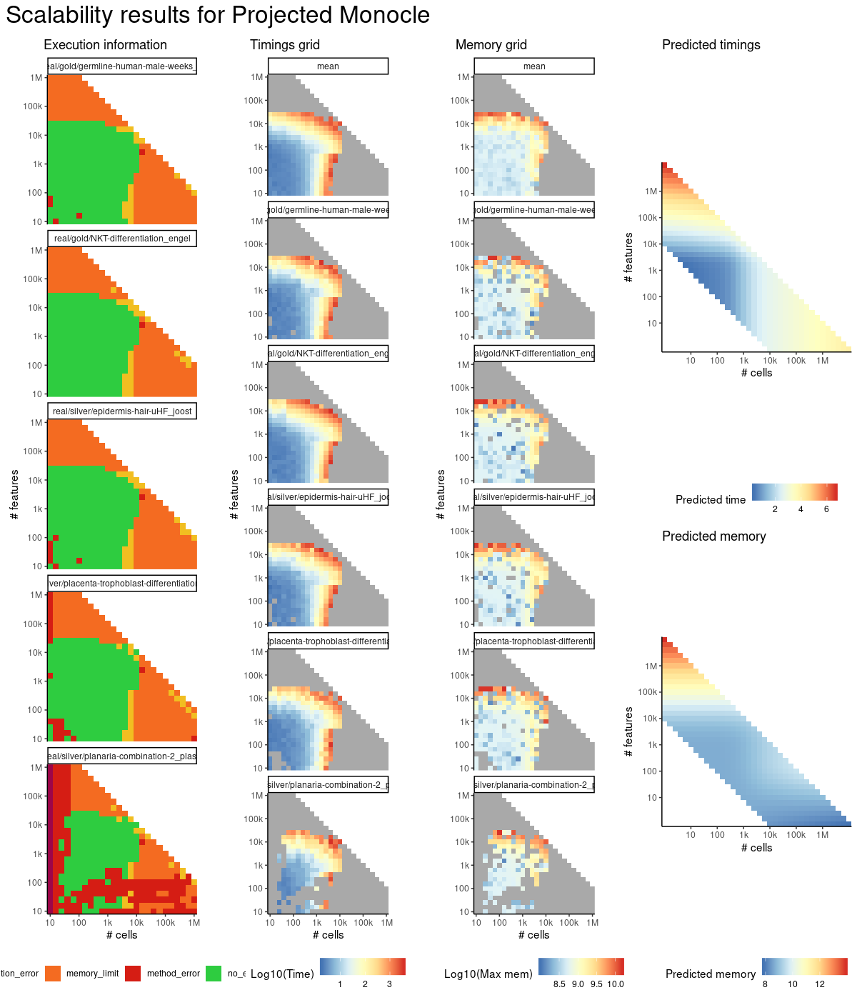

# projected_monocle


## ERROR STATUS METHOD_ERROR

### ERROR CLUSTER METHOD_ERROR -- 1


 * Number of instances: 2
 * Dataset ids: scaling_0002, scaling_0050

Last 10 lines of scaling_0002:
```
Loading required package: splines
Loading required package: DDRTree
Loading required package: irlba
Removing 1 outliers
Error in parametricDispersionFit(disp_table[row.names(disp_table) %in%  : 
  Parametric dispersion fit failed. Try a local fit and/or a pooled estimation. (See '?estimateDispersions')
Calls: <Anonymous> ... estimateDispersionsForCellDataSet -> parametricDispersionFit
In addition: Warning message:
In dgamma(y, 1/disp, scale = mu * disp, log = TRUE) : NaNs produced
Execution halted
```

### ERROR CLUSTER METHOD_ERROR -- 2


 * Number of instances: 4
 * Dataset ids: scaling_0003, scaling_0029, scaling_0030, scaling_0040

Last 10 lines of scaling_0003:
```
Loading required package: stats4
Loading required package: splines
Loading required package: DDRTree
Loading required package: irlba
Removing 2 outliers
Error in if (coefs[2] < 0) { : missing value where TRUE/FALSE needed
Calls: <Anonymous> ... estimateDispersionsForCellDataSet -> parametricDispersionFit
In addition: Warning message:
In dgamma(y, 1/disp, scale = mu * disp, log = TRUE) : NaNs produced
Execution halted
```

### ERROR CLUSTER METHOD_ERROR -- 3


 * Number of instances: 2
 * Dataset ids: scaling_0011, scaling_0015

Last 10 lines of scaling_0011:
```
Loading required package: DDRTree
Loading required package: irlba
Error in glm.fit(x = numeric(0), y = numeric(0), weights = NULL, start = c(1e-06,  : 
  object 'fit' not found
Calls: <Anonymous> ... parametricDispersionFit -> glm -> eval -> eval -> glm.fit
In addition: Warning messages:
1: In glm.fit(x = numeric(0), y = numeric(0), weights = NULL, start = c(1e-06,  :
  no observations informative at iteration 1
2: glm.fit: algorithm did not converge 
Execution halted
```

### ERROR CLUSTER METHOD_ERROR -- 4


 * Number of instances: 100
 * Dataset ids: scaling_0024, scaling_0036, scaling_0039, scaling_0041, scaling_0051, scaling_0052, scaling_0065, scaling_0073, scaling_0074, scaling_0075, scaling_0076, scaling_0077, scaling_0088, scaling_0093, scaling_0102, scaling_0103, scaling_0105, scaling_0106, scaling_0107, scaling_0121, scaling_0138, scaling_0139, scaling_0146, scaling_0150, scaling_0151, scaling_0152, scaling_0163, scaling_0181, scaling_0195, scaling_0213, scaling_0214, scaling_0216, scaling_0226, scaling_0227, scaling_0238, scaling_0251, scaling_0255, scaling_0274, scaling_0277, scaling_0298, scaling_0327, scaling_0330, scaling_0339, scaling_0341, scaling_0361, scaling_0382, scaling_0387, scaling_0388, scaling_0390, scaling_0391, scaling_0417, scaling_0444, scaling_0451, scaling_0452, scaling_0453, scaling_0456, scaling_0476, scaling_0502, scaling_0503, scaling_0504, scaling_0506, scaling_0522, scaling_0526, scaling_0550, scaling_0554, scaling_0556, scaling_0594, scaling_0598, scaling_0601, scaling_0602, scaling_0666, scaling_0676, scaling_0677, scaling_0681, scaling_0682, scaling_0750, scaling_0762, scaling_0763, scaling_0764, scaling_0766, scaling_0767, scaling_0839, scaling_0841, scaling_0850, scaling_0851, scaling_0853, scaling_0856, scaling_0907, scaling_0908, scaling_0909, scaling_0911, scaling_0943, scaling_0949, scaling_0951, scaling_0975, scaling_0979, scaling_0981, scaling_1047, scaling_1048, scaling_1049

Last 10 lines of scaling_0024:
```
Loading required package: ggplot2
Loading required package: VGAM
Loading required package: stats4
Loading required package: splines
Loading required package: DDRTree
Loading required package: irlba
Error in parametricDispersionFit(disp_table, verbose) : 
  Parametric dispersion fit failed. Try a local fit and/or a pooled estimation. (See '?estimateDispersions')
Calls: <Anonymous> ... estimateDispersionsForCellDataSet -> parametricDispersionFit
Execution halted
```

### ERROR CLUSTER METHOD_ERROR -- 5


 * Number of instances: 6
 * Dataset ids: scaling_0031, scaling_0149, scaling_0225, scaling_0275, scaling_0321, scaling_0600

Last 10 lines of scaling_0031:
```
Loading required package: stats4
Loading required package: splines
Loading required package: DDRTree
Loading required package: irlba
Error in parametricDispersionFit(disp_table, verbose) : 
  Parametric dispersion fit failed. Try a local fit and/or a pooled estimation. (See '?estimateDispersions')
Calls: <Anonymous> ... estimateDispersionsForCellDataSet -> parametricDispersionFit
In addition: Warning message:
glm.fit: algorithm did not converge 
Execution halted
```

### ERROR CLUSTER METHOD_ERROR -- 6


 * Number of instances: 21
 * Dataset ids: scaling_0035, scaling_0063, scaling_0135, scaling_0177, scaling_0211, scaling_0217, scaling_0272, scaling_0326, scaling_0450, scaling_0455, scaling_0501, scaling_0505, scaling_0553, scaling_0680, scaling_0760, scaling_0848, scaling_0849, scaling_0910, scaling_0947, scaling_0948, scaling_1045

Last 10 lines of scaling_0035:
```
Loading required package: VGAM
Loading required package: stats4
Loading required package: splines
Loading required package: DDRTree
Loading required package: irlba
Removing 1 outliers
Error in parametricDispersionFit(disp_table[row.names(disp_table) %in%  : 
  Parametric dispersion fit failed. Try a local fit and/or a pooled estimation. (See '?estimateDispersions')
Calls: <Anonymous> ... estimateDispersionsForCellDataSet -> parametricDispersionFit
Execution halted
```

### ERROR CLUSTER METHOD_ERROR -- 7


 * Number of instances: 1
 * Dataset ids: scaling_0145

Last 10 lines of scaling_0145:
```
Loading required package: splines
Loading required package: DDRTree
Loading required package: irlba
Error in parametricDispersionFit(disp_table, verbose) : 
  Parametric dispersion fit failed. Try a local fit and/or a pooled estimation. (See '?estimateDispersions')
Calls: <Anonymous> ... estimateDispersionsForCellDataSet -> parametricDispersionFit
In addition: Warning messages:
1: glm.fit: algorithm did not converge 
2: glm.fit: algorithm did not converge 
Execution halted
```

### ERROR CLUSTER METHOD_ERROR -- 8


 * Number of instances: 1
 * Dataset ids: scaling_0276

Last 10 lines of scaling_0276:
```
Loading required package: irlba
Error in parametricDispersionFit(disp_table, verbose) : 
  Parametric dispersion fit failed. Try a local fit and/or a pooled estimation. (See '?estimateDispersions')
Calls: <Anonymous> ... estimateDispersionsForCellDataSet -> parametricDispersionFit
In addition: Warning messages:
1: In log(ifelse(y == 0, 1, y/mu)) : NaNs produced
2: step size truncated due to divergence 
3: In log(ifelse(y == 0, 1, y/mu)) : NaNs produced
4: In log(ifelse(y == 0, 1, y/mu)) : NaNs produced
Execution halted
```

### ERROR CLUSTER METHOD_ERROR -- 9


 * Number of instances: 6
 * Dataset ids: scaling_0574, scaling_0633, scaling_0715, scaling_0802, scaling_0878, scaling_1009

Last 10 lines of scaling_0574:
```
Loading required package: splines
Loading required package: DDRTree
Loading required package: irlba
Error in parametricDispersionFit(disp_table, verbose) : 
  Parametric dispersion fit failed. Try a local fit and/or a pooled estimation. (See '?estimateDispersions')
Calls: <Anonymous> ... estimateDispersionsForCellDataSet -> parametricDispersionFit
In addition: Warning messages:
1: In log(ifelse(y == 0, 1, y/mu)) : NaNs produced
2: step size truncated due to divergence 
Execution halted
```

### ERROR CLUSTER METHOD_ERROR -- 10


 * Number of instances: 1
 * Dataset ids: scaling_0761

Last 10 lines of scaling_0761:
```
Loading required package: irlba
Error in parametricDispersionFit(disp_table, verbose) : 
  Parametric dispersion fit failed. Try a local fit and/or a pooled estimation. (See '?estimateDispersions')
Calls: <Anonymous> ... estimateDispersionsForCellDataSet -> parametricDispersionFit
In addition: Warning messages:
1: In log(ifelse(y == 0, 1, y/mu)) : NaNs produced
2: step size truncated due to divergence 
3: In log(ifelse(y == 0, 1, y/mu)) : NaNs produced
4: step size truncated due to divergence 
Execution halted
```

### ERROR CLUSTER METHOD_ERROR -- 11


 * Number of instances: 1
 * Dataset ids: scaling_0803

Last 10 lines of scaling_0803:
```
Input saved to /data/tmp//RtmpsTcfQT/file1a2c77b51565c/ti/input: 
	data.rds
	params.json
Running singularity exec --pwd /ti/workspace -B \
  '/data/tmp//RtmpsTcfQT/file1a2c77b51565c/ti:/ti,/data/tmp//RtmpsTcfQT/file1a2c7167270ab/tmp:/tmp2' \
  /group/irc/shared/dynverse/dynbenchmark/derived/03-method_characterisation/singularity_images/dynverse/projected_monocle.simg \
  /code/run.sh
ERROR  : Home directory is not owned by calling user: /home/robrechtc
ABORT  : Retval = 255

```

## ERROR STATUS TIME_LIMIT

### ERROR CLUSTER TIME_LIMIT -- 1


 * Number of instances: 23
 * Dataset ids: scaling_0465, scaling_0475, scaling_0485, scaling_0495, scaling_0531, scaling_0543, scaling_0549, scaling_0555, scaling_0614, scaling_0646, scaling_0662, scaling_0678, scaling_0694, scaling_0728, scaling_0745, scaling_0779, scaling_0797, scaling_0815, scaling_0833, scaling_0885, scaling_0896, scaling_1018, scaling_1032

Last 10 lines of scaling_0465:
```
File: /home/rcannood/Workspace/dynverse/dynbenchmark//derived/05-scaling/suite/projected_monocle/10/r2gridengine/20180825_051057_projected_monocle_10_NFXUyaj1y5/log/log.465.e.txt
```

## ERROR STATUS MEMORY_LIMIT

### ERROR CLUSTER MEMORY_LIMIT -- 1


 * Number of instances: 102
 * Dataset ids: scaling_0564, scaling_0573, scaling_0582, scaling_0591, scaling_0615, scaling_0616, scaling_0631, scaling_0632, scaling_0647, scaling_0648, scaling_0663, scaling_0664, scaling_0679, scaling_0695, scaling_0696, scaling_0697, scaling_0712, scaling_0713, scaling_0714, scaling_0729, scaling_0730, scaling_0731, scaling_0746, scaling_0747, scaling_0748, scaling_0765, scaling_0780, scaling_0781, scaling_0782, scaling_0783, scaling_0784, scaling_0798, scaling_0799, scaling_0800, scaling_0801, scaling_0816, scaling_0817, scaling_0818, scaling_0819, scaling_0820, scaling_0834, scaling_0835, scaling_0836, scaling_0837, scaling_0852, scaling_0854, scaling_0855, scaling_0864, scaling_0865, scaling_0866, scaling_0875, scaling_0876, scaling_0877, scaling_0886, scaling_0887, scaling_0888, scaling_0897, scaling_0898, scaling_0899, scaling_0917, scaling_0918, scaling_0919, scaling_0925, scaling_0926, scaling_0927, scaling_0933, scaling_0934, scaling_0935, scaling_0941, scaling_0942, scaling_0950, scaling_0955, scaling_0956, scaling_0961, scaling_0962, scaling_0967, scaling_0968, scaling_0973, scaling_0974, scaling_0980, scaling_0982, scaling_0991, scaling_0992, scaling_0993, scaling_0994, scaling_0996, scaling_1005, scaling_1006, scaling_1007, scaling_1008, scaling_1010, scaling_1019, scaling_1020, scaling_1021, scaling_1022, scaling_1024, scaling_1033, scaling_1034, scaling_1035, scaling_1036, scaling_1038, scaling_1050

Last 10 lines of scaling_0564:
```
Loading required package: stats4
Loading required package: splines
Loading required package: DDRTree
Loading required package: irlba
Removing 2 outliers
[1] 10
Error in DDRTree_reduce_dim(X, Z, Y, W, dimensions, maxIter, K, sigma,  : 
  std::bad_alloc
Calls: <Anonymous> -> DDRTree -> DDRTree_reduce_dim
Execution halted
```

### ERROR CLUSTER MEMORY_LIMIT -- 2


 * Number of instances: 1
 * Dataset ids: scaling_0796

Last 10 lines of scaling_0796:
```
12: lapply(X = X, FUN = FUN, ...)
13: parallel::mclapply(seq_len(nrow(dataset)), mc.cores = mc_cores,     function(i) {        dataseti <- dynutils::extract_row_to_list(dataset, i)        model <- method_outputs$model[[i]]        if (!is.null(model)) {            time0 <- Sys.time()            model <- model %>% dynwrap::add_cell_waypoints(num_cells_selected = length(dataseti$waypoint_cells))            time1 <- Sys.time()            time_cellwaypoints <- as.numeric(difftime(time1,                 time0, units = "sec"))            df_cellwaypoints <- data_frame(time_cellwaypoints)        }        else {            df_cellwaypoints <- NULL        }        metrics_summary <- calculate_metrics(dataseti, model,             metrics)        summary <- bind_cols(method_outputs$summary[[i]], df_cellwaypoints,             metrics_summary)        if (!output_model && !is.null(model)) {            model <- TRUE        }        lst(summary, model)    })
14: evaluate_ti_method(dataset = dataset, method = method, parameters = params,     metrics = metrics, give_priors = priors, output_model = output_models,     mc_cores = 1, verbose = verbose)
15: benchmark_run_evaluation(i = i, subdesign = subdesign, metrics = metrics,     verbose = verbose, error_mode = FALSE, output_models = output_models)
16: (function (i) {    benchmark_run_evaluation(i = i, subdesign = subdesign, metrics = metrics,         verbose = verbose, error_mode = FALSE, output_models = output_models)})(796L)
17: do.call(PitSoL_params$FUN, c(list(PitSoL_params$X[[PitSoL_data]]),     PitSoL_params$DOTPARAMS))
18: FUN(X[[i]], ...)
19: lapply(seq(PitSoL_params$QSUB_START[[PitSoL_index]], PitSoL_params$QSUB_STOP[[PitSoL_index]]),     function(PitSoL_data) {        do.call(PitSoL_params$FUN, c(list(PitSoL_params$X[[PitSoL_data]]),             PitSoL_params$DOTPARAMS))    })
An irrecoverable exception occurred. R is aborting now ...
/var/spool/sge/prismcls01/job_scripts/8663: line 11:  6379 Segmentation fault      (core dumped) Rscript --default-packages=methods,stats,utils,graphics,grDevices script.R $SGE_TASK_ID
```

### ERROR CLUSTER MEMORY_LIMIT -- 3


 * Number of instances: 6
 * Dataset ids: scaling_0867, scaling_0889, scaling_0957, scaling_0969, scaling_0995, scaling_1023

Last 10 lines of scaling_0867:
```
Loading required package: ggplot2
Loading required package: VGAM
Loading required package: stats4
Loading required package: splines
Loading required package: DDRTree
Loading required package: irlba
Removing 384 outliers
[1] 21958
Error: cannot allocate vector of size 11.8 Gb
Execution halted
```

### ERROR CLUSTER MEMORY_LIMIT -- 4


 * Number of instances: 1
 * Dataset ids: scaling_0963

Last 10 lines of scaling_0963:
```
Loading required package: splines
Loading required package: DDRTree
Loading required package: irlba
Removing 958 outliers
Warning messages:
1: In log(ifelse(y == 0, 1, y/mu)) : NaNs produced
2: step size truncated due to divergence 
[1] 16802
Error: cannot allocate vector of size 11.8 Gb
Execution halted
```


