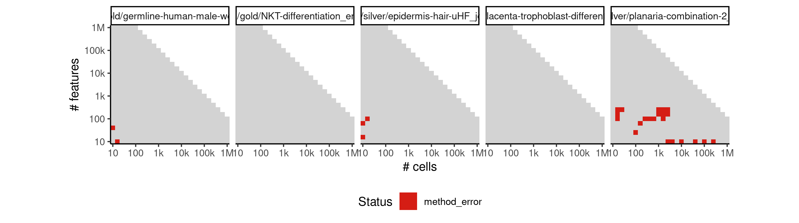
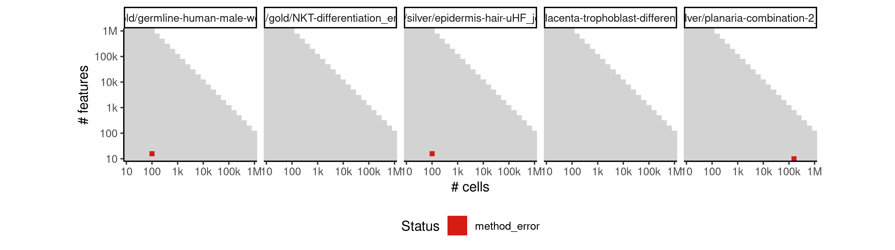
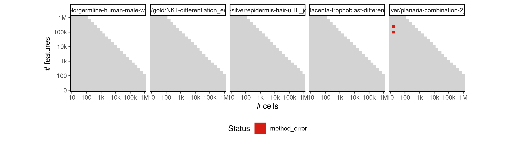
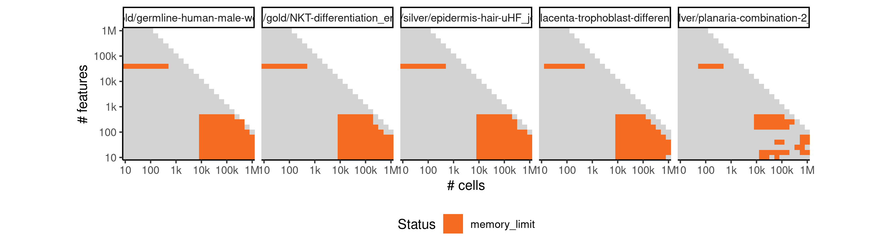

# projected_monocle


## ERROR STATUS METHOD_ERROR

### ERROR CLUSTER METHOD_ERROR -- 1


 * Number of instances: 27
 * Dataset ids: scaling_0007, scaling_0010, scaling_0041, scaling_0061, scaling_0121, scaling_0135, scaling_0150, scaling_0176, scaling_0224, scaling_0272, scaling_0326, scaling_0450, scaling_0455, scaling_0501, scaling_0505, scaling_0553, scaling_0680, scaling_0759, scaling_0760, scaling_0848, scaling_0849, scaling_0910, scaling_0947, scaling_0948, scaling_1045, scaling_1145, scaling_1380

Last 10 lines of scaling_0007:
```
Loading required package: VGAM
Loading required package: stats4
Loading required package: splines
Loading required package: DDRTree
Loading required package: irlba
Removing 1 outliers
Error in parametricDispersionFit(disp_table[row.names(disp_table) %in%  : 
  Parametric dispersion fit failed. Try a local fit and/or a pooled estimation. (See '?estimateDispersions')
Calls: <Anonymous> ... estimateDispersionsForCellDataSet -> parametricDispersionFit
Execution halted
```

### ERROR CLUSTER METHOD_ERROR -- 2


 * Number of instances: 105
 * Dataset ids: scaling_0011, scaling_0045, scaling_0050, scaling_0051, scaling_0072, scaling_0101, scaling_0102, scaling_0103, scaling_0104, scaling_0105, scaling_0136, scaling_0139, scaling_0178, scaling_0213, scaling_0214, scaling_0225, scaling_0251, scaling_0255, scaling_0274, scaling_0321, scaling_0327, scaling_0330, scaling_0339, scaling_0371, scaling_0387, scaling_0388, scaling_0390, scaling_0444, scaling_0445, scaling_0452, scaling_0453, scaling_0498, scaling_0502, scaling_0503, scaling_0504, scaling_0522, scaling_0550, scaling_0554, scaling_0594, scaling_0598, scaling_0668, scaling_0676, scaling_0677, scaling_0751, scaling_0752, scaling_0762, scaling_0763, scaling_0764, scaling_0820, scaling_0840, scaling_0841, scaling_0851, scaling_0853, scaling_0889, scaling_0901, scaling_0907, scaling_0908, scaling_0909, scaling_0949, scaling_0979, scaling_1023, scaling_1038, scaling_1047, scaling_1048, scaling_1049, scaling_1108, scaling_1128, scaling_1129, scaling_1141, scaling_1142, scaling_1143, scaling_1144, scaling_1164, scaling_1165, scaling_1214, scaling_1242, scaling_1262, scaling_1265, scaling_1275, scaling_1339, scaling_1362, scaling_1363, scaling_1376, scaling_1378, scaling_1429, scaling_1430, scaling_1438, scaling_1440, scaling_1477, scaling_1498, scaling_1500, scaling_1530, scaling_1588, scaling_1609, scaling_1610, scaling_1621, scaling_1622, scaling_1624, scaling_1625, scaling_1692, scaling_1713, scaling_1715, scaling_1716, scaling_1731, scaling_1732

Last 10 lines of scaling_0011:
```
Loading required package: ggplot2
Loading required package: VGAM
Loading required package: stats4
Loading required package: splines
Loading required package: DDRTree
Loading required package: irlba
Error in parametricDispersionFit(disp_table, verbose) : 
  Parametric dispersion fit failed. Try a local fit and/or a pooled estimation. (See '?estimateDispersions')
Calls: <Anonymous> ... estimateDispersionsForCellDataSet -> parametricDispersionFit
Execution halted
```

### ERROR CLUSTER METHOD_ERROR -- 3


 * Number of instances: 9
 * Dataset ids: scaling_0013, scaling_0015, scaling_0027, scaling_0029, scaling_0038, scaling_0039, scaling_0047, scaling_0070, scaling_0074

Last 10 lines of scaling_0013:
```
Loading required package: VGAM
Loading required package: stats4
Loading required package: splines
Loading required package: DDRTree
Loading required package: irlba
Error in if (coefs[2] < 0) { : missing value where TRUE/FALSE needed
Calls: <Anonymous> ... estimateDispersionsForCellDataSet -> parametricDispersionFit
In addition: Warning message:
In dgamma(y, 1/disp, scale = mu * disp, log = TRUE) : NaNs produced
Execution halted
```

### ERROR CLUSTER METHOD_ERROR -- 4


 * Number of instances: 12
 * Dataset ids: scaling_0022, scaling_0075, scaling_0275, scaling_0322, scaling_0382, scaling_0600, scaling_0667, scaling_0850, scaling_1243, scaling_1499, scaling_1623, scaling_1733

Last 10 lines of scaling_0022:
```
Loading required package: splines
Loading required package: DDRTree
Loading required package: irlba
Removing 1 outliers
Error in parametricDispersionFit(disp_table[row.names(disp_table) %in%  : 
  Parametric dispersion fit failed. Try a local fit and/or a pooled estimation. (See '?estimateDispersions')
Calls: <Anonymous> ... estimateDispersionsForCellDataSet -> parametricDispersionFit
In addition: Warning message:
glm.fit: algorithm did not converge 
Execution halted
```

### ERROR CLUSTER METHOD_ERROR -- 5


 * Number of instances: 5
 * Dataset ids: scaling_0026, scaling_0037, scaling_0067, scaling_0068, scaling_0096

Last 10 lines of scaling_0026:
```
Loading required package: DDRTree
Loading required package: irlba
Error in glm.fit(x = numeric(0), y = numeric(0), weights = NULL, start = c(1e-06,  : 
  object 'fit' not found
Calls: <Anonymous> ... parametricDispersionFit -> glm -> eval -> eval -> glm.fit
In addition: Warning messages:
1: In glm.fit(x = numeric(0), y = numeric(0), weights = NULL, start = c(1e-06,  :
  no observations informative at iteration 1
2: glm.fit: algorithm did not converge 
Execution halted
```

### ERROR CLUSTER METHOD_ERROR -- 6


 * Number of instances: 1
 * Dataset ids: scaling_0040

Last 10 lines of scaling_0040:
```
Loading required package: splines
Loading required package: DDRTree
Loading required package: irlba
Removing 2 outliers
Error in parametricDispersionFit(disp_table[row.names(disp_table) %in%  : 
  Parametric dispersion fit failed. Try a local fit and/or a pooled estimation. (See '?estimateDispersions')
Calls: <Anonymous> ... estimateDispersionsForCellDataSet -> parametricDispersionFit
In addition: Warning message:
In dgamma(y, 1/disp, scale = mu * disp, log = TRUE) : NaNs produced
Execution halted
```

### ERROR CLUSTER METHOD_ERROR -- 7


 * Number of instances: 2
 * Dataset ids: scaling_0069, scaling_0761

Last 10 lines of scaling_0069:
```
Loading required package: irlba
Error in parametricDispersionFit(disp_table, verbose) : 
  Parametric dispersion fit failed. Try a local fit and/or a pooled estimation. (See '?estimateDispersions')
Calls: <Anonymous> ... estimateDispersionsForCellDataSet -> parametricDispersionFit
In addition: Warning messages:
1: In log(ifelse(y == 0, 1, y/mu)) : NaNs produced
2: step size truncated due to divergence 
3: In log(ifelse(y == 0, 1, y/mu)) : NaNs produced
4: step size truncated due to divergence 
Execution halted
```

### ERROR CLUSTER METHOD_ERROR -- 8


 * Number of instances: 3
 * Dataset ids: scaling_0111, scaling_0125, scaling_1245

Last 10 lines of scaling_0111:
```
Loading required package: DDRTree
Loading required package: irlba
Removing 1 outliers
Error in parametricDispersionFit(disp_table[row.names(disp_table) %in%  : 
  Parametric dispersion fit failed. Try a local fit and/or a pooled estimation. (See '?estimateDispersions')
Calls: <Anonymous> ... estimateDispersionsForCellDataSet -> parametricDispersionFit
In addition: Warning messages:
1: glm.fit: algorithm did not converge 
2: glm.fit: algorithm did not converge 
Execution halted
```

### ERROR CLUSTER METHOD_ERROR -- 9


 * Number of instances: 1
 * Dataset ids: scaling_0451

Last 10 lines of scaling_0451:
```
2: step size truncated due to divergence 
3: In log(ifelse(y == 0, 1, y/mu)) : NaNs produced
4: step size truncated due to divergence 
5: In log(ifelse(y == 0, 1, y/mu)) : NaNs produced
6: step size truncated due to divergence 
7: In log(ifelse(y == 0, 1, y/mu)) : NaNs produced
8: step size truncated due to divergence 
9: glm.fit: algorithm did not converge 
10: glm.fit: algorithm stopped at boundary value 
Execution halted
```

### ERROR CLUSTER METHOD_ERROR -- 10


 * Number of instances: 7
 * Dataset ids: scaling_0666, scaling_0750, scaling_0839, scaling_0943, scaling_0975, scaling_1154, scaling_1361

Last 10 lines of scaling_0666:
```
Loading required package: DDRTree
Loading required package: irlba
Error in parametricDispersionFit(disp_table, verbose) : 
  Parametric dispersion fit failed. Try a local fit and/or a pooled estimation. (See '?estimateDispersions')
Calls: <Anonymous> ... estimateDispersionsForCellDataSet -> parametricDispersionFit
In addition: Warning messages:
1: In log(ifelse(y == 0, 1, y/mu)) : NaNs produced
2: step size truncated due to divergence 
3: In log(ifelse(y == 0, 1, y/mu)) : NaNs produced
Execution halted
```

### ERROR CLUSTER METHOD_ERROR -- 11


 * Number of instances: 2
 * Dataset ids: scaling_1231, scaling_1490

Last 10 lines of scaling_1231:
```
Loading required package: irlba
Error in parametricDispersionFit(disp_table, verbose) : 
  Parametric dispersion fit failed. Try a local fit and/or a pooled estimation. (See '?estimateDispersions')
Calls: <Anonymous> ... estimateDispersionsForCellDataSet -> parametricDispersionFit
In addition: Warning messages:
1: In log(ifelse(y == 0, 1, y/mu)) : NaNs produced
2: step size truncated due to divergence 
3: In log(ifelse(y == 0, 1, y/mu)) : NaNs produced
4: glm.fit: algorithm did not converge 
Execution halted
```

### ERROR CLUSTER METHOD_ERROR -- 12


 * Number of instances: 1
 * Dataset ids: scaling_1608

Last 10 lines of scaling_1608:
```
Loading required package: irlba
Error in parametricDispersionFit(disp_table, verbose) : 
  Parametric dispersion fit failed. Try a local fit and/or a pooled estimation. (See '?estimateDispersions')
Calls: <Anonymous> ... estimateDispersionsForCellDataSet -> parametricDispersionFit
In addition: Warning messages:
1: In log(ifelse(y == 0, 1, y/mu)) : NaNs produced
2: step size truncated due to divergence 
3: In log(ifelse(y == 0, 1, y/mu)) : NaNs produced
4: In log(ifelse(y == 0, 1, y/mu)) : NaNs produced
Execution halted
```

### ERROR CLUSTER METHOD_ERROR -- 13


 * Number of instances: 1
 * Dataset ids: scaling_1735

Last 10 lines of scaling_1735:
```
Loading required package: irlba
Removing 1 outliers
Error in parametricDispersionFit(disp_table[row.names(disp_table) %in%  : 
  Parametric dispersion fit failed. Try a local fit and/or a pooled estimation. (See '?estimateDispersions')
Calls: <Anonymous> ... estimateDispersionsForCellDataSet -> parametricDispersionFit
In addition: Warning messages:
1: glm.fit: algorithm did not converge 
2: glm.fit: algorithm did not converge 
3: glm.fit: algorithm did not converge 
Execution halted
```

## ERROR STATUS TIME_LIMIT

### ERROR CLUSTER TIME_LIMIT -- 1


 * Number of instances: 51
 * Dataset ids: scaling_0475, scaling_0485, scaling_0495, scaling_0531, scaling_0537, scaling_0543, scaling_0549, scaling_0555, scaling_0564, scaling_0573, scaling_0582, scaling_0591, scaling_0614, scaling_0615, scaling_0630, scaling_0631, scaling_0646, scaling_0647, scaling_0663, scaling_0678, scaling_0679, scaling_0694, scaling_0695, scaling_0711, scaling_0712, scaling_0728, scaling_0729, scaling_0746, scaling_0780, scaling_0798, scaling_0816, scaling_0834, scaling_0852, scaling_0917, scaling_0925, scaling_0933, scaling_0941, scaling_0991, scaling_1005, scaling_1019, scaling_1033, scaling_1064, scaling_1083, scaling_1102, scaling_1121, scaling_1140, scaling_1252, scaling_1260, scaling_1264, scaling_1352, scaling_1373

Last 10 lines of scaling_0475:
```
File: /home/rcannood/Workspace/dynverse/dynbenchmark//derived/05-scaling/suite/projected_monocle/Cat1/r2gridengine/20181008_142053_projected_monocle_Cat1_WDa86jaQx3/log/log.475.e.txt
```

## ERROR STATUS MEMORY_LIMIT

### ERROR CLUSTER MEMORY_LIMIT -- 1


 * Number of instances: 301
 * Dataset ids: scaling_0616, scaling_0632, scaling_0648, scaling_0664, scaling_0696, scaling_0697, scaling_0713, scaling_0714, scaling_0730, scaling_0731, scaling_0747, scaling_0748, scaling_0765, scaling_0781, scaling_0782, scaling_0783, scaling_0799, scaling_0800, scaling_0801, scaling_0817, scaling_0818, scaling_0819, scaling_0835, scaling_0836, scaling_0837, scaling_0854, scaling_0855, scaling_0856, scaling_0864, scaling_0865, scaling_0866, scaling_0867, scaling_0875, scaling_0876, scaling_0877, scaling_0878, scaling_0886, scaling_0887, scaling_0888, scaling_0897, scaling_0898, scaling_0899, scaling_0918, scaling_0926, scaling_0934, scaling_0942, scaling_0950, scaling_0951, scaling_0955, scaling_0956, scaling_0957, scaling_0961, scaling_0962, scaling_0963, scaling_0967, scaling_0968, scaling_0969, scaling_0973, scaling_0974, scaling_0980, scaling_0992, scaling_0993, scaling_0994, scaling_1006, scaling_1007, scaling_1008, scaling_1020, scaling_1021, scaling_1022, scaling_1034, scaling_1035, scaling_1036, scaling_1050, scaling_1052, scaling_1065, scaling_1066, scaling_1067, scaling_1068, scaling_1069, scaling_1071, scaling_1084, scaling_1085, scaling_1086, scaling_1087, scaling_1088, scaling_1090, scaling_1103, scaling_1104, scaling_1105, scaling_1106, scaling_1107, scaling_1109, scaling_1122, scaling_1123, scaling_1124, scaling_1125, scaling_1126, scaling_1147, scaling_1149, scaling_1151, scaling_1153, scaling_1155, scaling_1156, scaling_1157, scaling_1158, scaling_1159, scaling_1160, scaling_1161, scaling_1162, scaling_1163, scaling_1177, scaling_1178, scaling_1179, scaling_1180, scaling_1181, scaling_1193, scaling_1194, scaling_1195, scaling_1196, scaling_1197, scaling_1209, scaling_1210, scaling_1211, scaling_1212, scaling_1213, scaling_1225, scaling_1226, scaling_1227, scaling_1228, scaling_1229, scaling_1241, scaling_1244, scaling_1249, scaling_1253, scaling_1257, scaling_1261, scaling_1266, scaling_1267, scaling_1268, scaling_1269, scaling_1270, scaling_1271, scaling_1272, scaling_1273, scaling_1274, scaling_1290, scaling_1291, scaling_1292, scaling_1293, scaling_1294, scaling_1295, scaling_1296, scaling_1311, scaling_1312, scaling_1313, scaling_1314, scaling_1315, scaling_1316, scaling_1317, scaling_1332, scaling_1333, scaling_1334, scaling_1335, scaling_1336, scaling_1337, scaling_1338, scaling_1353, scaling_1354, scaling_1355, scaling_1356, scaling_1357, scaling_1358, scaling_1359, scaling_1374, scaling_1375, scaling_1377, scaling_1379, scaling_1383, scaling_1389, scaling_1390, scaling_1391, scaling_1392, scaling_1395, scaling_1401, scaling_1402, scaling_1403, scaling_1404, scaling_1407, scaling_1413, scaling_1414, scaling_1415, scaling_1416, scaling_1419, scaling_1425, scaling_1426, scaling_1427, scaling_1428, scaling_1431, scaling_1437, scaling_1439, scaling_1448, scaling_1449, scaling_1450, scaling_1451, scaling_1452, scaling_1460, scaling_1461, scaling_1462, scaling_1463, scaling_1464, scaling_1472, scaling_1473, scaling_1474, scaling_1475, scaling_1476, scaling_1484, scaling_1485, scaling_1486, scaling_1487, scaling_1488, scaling_1496, scaling_1497, scaling_1502, scaling_1505, scaling_1506, scaling_1508, scaling_1511, scaling_1512, scaling_1514, scaling_1517, scaling_1518, scaling_1520, scaling_1523, scaling_1524, scaling_1526, scaling_1529, scaling_1543, scaling_1544, scaling_1545, scaling_1546, scaling_1547, scaling_1548, scaling_1549, scaling_1562, scaling_1563, scaling_1564, scaling_1565, scaling_1566, scaling_1567, scaling_1568, scaling_1581, scaling_1582, scaling_1583, scaling_1584, scaling_1585, scaling_1586, scaling_1587, scaling_1600, scaling_1601, scaling_1602, scaling_1603, scaling_1604, scaling_1605, scaling_1606, scaling_1619, scaling_1620, scaling_1631, scaling_1641, scaling_1642, scaling_1643, scaling_1644, scaling_1645, scaling_1646, scaling_1647, scaling_1653, scaling_1663, scaling_1664, scaling_1665, scaling_1666, scaling_1667, scaling_1668, scaling_1669, scaling_1675, scaling_1685, scaling_1686, scaling_1687, scaling_1688, scaling_1689, scaling_1690, scaling_1691, scaling_1697, scaling_1707, scaling_1708, scaling_1709, scaling_1710, scaling_1711, scaling_1712, scaling_1719, scaling_1729, scaling_1730, scaling_1734

Last 10 lines of scaling_0616:
```
Loading required package: stats4
Loading required package: splines
Loading required package: DDRTree
Loading required package: irlba
Removing 1 outliers
[1] 10
Error in DDRTree_reduce_dim(X, Z, Y, W, dimensions, maxIter, K, sigma,  : 
  std::bad_alloc
Calls: <Anonymous> -> DDRTree -> DDRTree_reduce_dim
Execution halted
```

### ERROR CLUSTER MEMORY_LIMIT -- 2


 * Number of instances: 98
 * Dataset ids: scaling_0981, scaling_0995, scaling_1009, scaling_1051, scaling_1070, scaling_1089, scaling_1146, scaling_1148, scaling_1150, scaling_1152, scaling_1166, scaling_1167, scaling_1182, scaling_1198, scaling_1199, scaling_1215, scaling_1246, scaling_1250, scaling_1254, scaling_1258, scaling_1276, scaling_1277, scaling_1278, scaling_1279, scaling_1297, scaling_1299, scaling_1300, scaling_1318, scaling_1319, scaling_1320, scaling_1321, scaling_1340, scaling_1341, scaling_1342, scaling_1381, scaling_1382, scaling_1393, scaling_1394, scaling_1405, scaling_1406, scaling_1417, scaling_1418, scaling_1441, scaling_1442, scaling_1443, scaling_1453, scaling_1455, scaling_1465, scaling_1466, scaling_1467, scaling_1478, scaling_1479, scaling_1491, scaling_1501, scaling_1507, scaling_1513, scaling_1519, scaling_1525, scaling_1531, scaling_1532, scaling_1533, scaling_1534, scaling_1535, scaling_1550, scaling_1552, scaling_1553, scaling_1554, scaling_1569, scaling_1570, scaling_1571, scaling_1572, scaling_1573, scaling_1589, scaling_1590, scaling_1591, scaling_1592, scaling_1611, scaling_1626, scaling_1627, scaling_1628, scaling_1629, scaling_1630, scaling_1648, scaling_1649, scaling_1650, scaling_1651, scaling_1652, scaling_1670, scaling_1671, scaling_1672, scaling_1673, scaling_1674, scaling_1693, scaling_1694, scaling_1695, scaling_1696, scaling_1717, scaling_1718

Last 10 lines of scaling_0981:
```
Loading required package: ggplot2
Loading required package: VGAM
Loading required package: stats4
Loading required package: splines
Loading required package: DDRTree
Loading required package: irlba
Removing 1663 outliers
[1] 48309
Error: cannot allocate vector of size 29.7 Gb
Execution halted
```

### ERROR CLUSTER MEMORY_LIMIT -- 3


 * Number of instances: 2
 * Dataset ids: scaling_1183, scaling_1551

Last 10 lines of scaling_1183:
```
Loading required package: DDRTree
Loading required package: irlba
Removing 3903 outliers
Warning messages:
1: In log(ifelse(y == 0, 1, y/mu)) : NaNs produced
2: step size truncated due to divergence 
3: In log(ifelse(y == 0, 1, y/mu)) : NaNs produced
[1] 96841
Error: cannot allocate vector of size 74.5 Gb
Execution halted
```

### ERROR CLUSTER MEMORY_LIMIT -- 4


 * Number of instances: 2
 * Dataset ids: scaling_1298, scaling_1454

Last 10 lines of scaling_1298:
```
Loading required package: splines
Loading required package: DDRTree
Loading required package: irlba
Removing 6185 outliers
Warning messages:
1: In log(ifelse(y == 0, 1, y/mu)) : NaNs produced
2: step size truncated due to divergence 
[1] 153551
Error: cannot allocate vector of size 187.1 Gb
Execution halted
```

### ERROR CLUSTER MEMORY_LIMIT -- 5


 * Number of instances: 5
 * Dataset ids: scaling_1640, scaling_1662, scaling_1684, scaling_1706, scaling_1728

Last 10 lines of scaling_1640:
```
Loading required package: stats4
Loading required package: splines
Loading required package: DDRTree
Loading required package: irlba
Removing 17 outliers
[1] 569
Error in graph.adjacency.dense(adjmatrix, mode = mode, weighted = weighted,  : 
  At type_indexededgelist.c:309 : cannot add edges, Out of memory
Calls: <Anonymous> ... project2MST -> graph.adjacency -> graph.adjacency.dense
Execution halted
```


