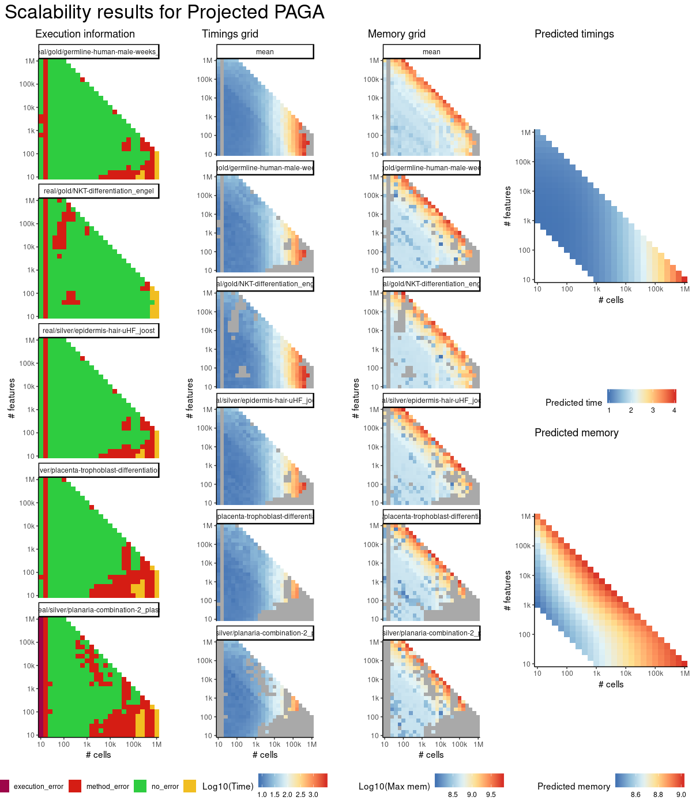
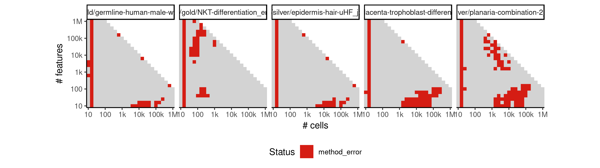
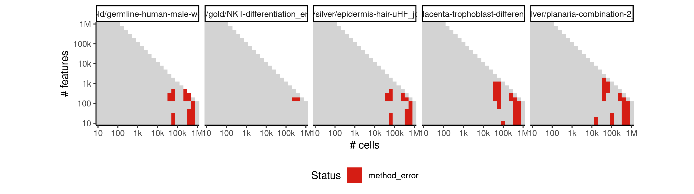
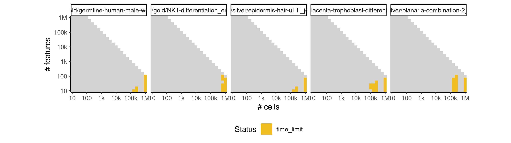

# projected_paga


## ERROR STATUS METHOD_ERROR

### ERROR CLUSTER METHOD_ERROR -- 1


 * Number of instances: 323
 * Dataset ids: scaling_0007, scaling_0009, scaling_0011, scaling_0013, scaling_0015, scaling_0017, scaling_0020, scaling_0023, scaling_0026, scaling_0029, scaling_0031, scaling_0033, scaling_0035, scaling_0037, scaling_0039, scaling_0052, scaling_0057, scaling_0062, scaling_0066, scaling_0067, scaling_0072, scaling_0077, scaling_0083, scaling_0089, scaling_0095, scaling_0101, scaling_0107, scaling_0114, scaling_0121, scaling_0128, scaling_0135, scaling_0149, scaling_0152, scaling_0158, scaling_0164, scaling_0170, scaling_0176, scaling_0192, scaling_0216, scaling_0218, scaling_0220, scaling_0222, scaling_0224, scaling_0226, scaling_0227, scaling_0233, scaling_0239, scaling_0245, scaling_0251, scaling_0262, scaling_0277, scaling_0288, scaling_0293, scaling_0294, scaling_0299, scaling_0310, scaling_0321, scaling_0342, scaling_0352, scaling_0356, scaling_0357, scaling_0358, scaling_0362, scaling_0372, scaling_0380, scaling_0382, scaling_0390, scaling_0391, scaling_0392, scaling_0405, scaling_0411, scaling_0418, scaling_0431, scaling_0441, scaling_0442, scaling_0444, scaling_0454, scaling_0455, scaling_0456, scaling_0465, scaling_0485, scaling_0495, scaling_0497, scaling_0504, scaling_0505, scaling_0506, scaling_0510, scaling_0514, scaling_0518, scaling_0521, scaling_0522, scaling_0525, scaling_0526, scaling_0532, scaling_0538, scaling_0544, scaling_0549, scaling_0550, scaling_0564, scaling_0582, scaling_0590, scaling_0591, scaling_0599, scaling_0600, scaling_0602, scaling_0616, scaling_0618, scaling_0634, scaling_0648, scaling_0650, scaling_0662, scaling_0663, scaling_0664, scaling_0666, scaling_0677, scaling_0678, scaling_0679, scaling_0680, scaling_0682, scaling_0696, scaling_0697, scaling_0699, scaling_0716, scaling_0730, scaling_0731, scaling_0733, scaling_0746, scaling_0747, scaling_0748, scaling_0750, scaling_0763, scaling_0764, scaling_0767, scaling_0782, scaling_0783, scaling_0785, scaling_0788, scaling_0803, scaling_0818, scaling_0819, scaling_0821, scaling_0835, scaling_0836, scaling_0837, scaling_0839, scaling_0852, scaling_0853, scaling_0855, scaling_0866, scaling_0869, scaling_0888, scaling_0898, scaling_0899, scaling_0908, scaling_0909, scaling_0910, scaling_0911, scaling_0918, scaling_0919, scaling_0927, scaling_0934, scaling_0935, scaling_0942, scaling_0943, scaling_0950, scaling_0951, scaling_0956, scaling_0957, scaling_0958, scaling_0963, scaling_0968, scaling_0969, scaling_0973, scaling_0974, scaling_0975, scaling_0979, scaling_0980, scaling_0997, scaling_1034, scaling_1035, scaling_1036, scaling_1048, scaling_1049, scaling_1050, scaling_1069, scaling_1072, scaling_1073, scaling_1074, scaling_1106, scaling_1107, scaling_1123, scaling_1124, scaling_1125, scaling_1142, scaling_1143, scaling_1144, scaling_1146, scaling_1148, scaling_1150, scaling_1152, scaling_1153, scaling_1154, scaling_1155, scaling_1163, scaling_1165, scaling_1167, scaling_1180, scaling_1183, scaling_1184, scaling_1185, scaling_1199, scaling_1212, scaling_1215, scaling_1227, scaling_1231, scaling_1242, scaling_1243, scaling_1261, scaling_1265, scaling_1268, scaling_1273, scaling_1275, scaling_1277, scaling_1295, scaling_1298, scaling_1301, scaling_1319, scaling_1337, scaling_1340, scaling_1356, scaling_1361, scaling_1370, scaling_1376, scaling_1377, scaling_1395, scaling_1427, scaling_1439, scaling_1442, scaling_1454, scaling_1455, scaling_1466, scaling_1478, scaling_1490, scaling_1498, scaling_1507, scaling_1524, scaling_1527, scaling_1530, scaling_1532, scaling_1547, scaling_1551, scaling_1554, scaling_1570, scaling_1585, scaling_1589, scaling_1603, scaling_1608, scaling_1616, scaling_1617, scaling_1621, scaling_1652, scaling_1709, scaling_1710, scaling_1720, scaling_1723, scaling_1724, scaling_1725, scaling_1726, scaling_1731, scaling_1736, scaling_1740, scaling_1744, scaling_1748, scaling_1752, scaling_1754, scaling_1766, scaling_1781, scaling_1783, scaling_1796, scaling_1811, scaling_1823, scaling_1824, scaling_1826, scaling_1830, scaling_1831, scaling_1832, scaling_1833, scaling_1834, scaling_1837, scaling_1838, scaling_1876, scaling_1916, scaling_1917, scaling_1975, scaling_1985, scaling_1987, scaling_1988, scaling_1996, scaling_2011, scaling_2034, scaling_2035, scaling_2037, scaling_2058, scaling_2059, scaling_2105, scaling_2106, scaling_2122, scaling_2142, scaling_2163, scaling_2164, scaling_2166, scaling_2215, scaling_2217, scaling_2230, scaling_2237, scaling_2245, scaling_2248, scaling_2272, scaling_2279, scaling_2287, scaling_2295, scaling_2314, scaling_2316

Last 10 lines of scaling_0007:
```
	cell_ids.feather
	dimred_milestones.feather
	dimred.feather
	grouping.feather
	milestone_network.feather
	timings.feather
Loading required namespace: hdf5r
Loading required namespace: feather
`milestone_ids` not set-equal to rownames(dimred_milestones).
Lengths differ: 0 is not 1
```

### ERROR CLUSTER METHOD_ERROR -- 2


 * Number of instances: 113
 * Dataset ids: scaling_0765, scaling_0854, scaling_0994, scaling_1022, scaling_1126, scaling_1145, scaling_1147, scaling_1151, scaling_1244, scaling_1249, scaling_1257, scaling_1378, scaling_1452, scaling_1476, scaling_1486, scaling_1488, scaling_1500, scaling_1505, scaling_1517, scaling_1523, scaling_1529, scaling_1548, scaling_1549, scaling_1586, scaling_1587, scaling_1602, scaling_1605, scaling_1606, scaling_1624, scaling_1625, scaling_1642, scaling_1646, scaling_1686, scaling_1690, scaling_1708, scaling_1712, scaling_1730, scaling_1734, scaling_1738, scaling_1739, scaling_1746, scaling_1747, scaling_1750, scaling_1751, scaling_1755, scaling_1763, scaling_1765, scaling_1846, scaling_1847, scaling_1848, scaling_1862, scaling_1863, scaling_1864, scaling_1870, scaling_1871, scaling_1872, scaling_1879, scaling_1880, scaling_1888, scaling_1890, scaling_1906, scaling_1911, scaling_1950, scaling_1955, scaling_1972, scaling_1976, scaling_1977, scaling_1994, scaling_1998, scaling_1999, scaling_2030, scaling_2038, scaling_2053, scaling_2055, scaling_2068, scaling_2083, scaling_2085, scaling_2096, scaling_2098, scaling_2099, scaling_2100, scaling_2111, scaling_2113, scaling_2114, scaling_2115, scaling_2143, scaling_2159, scaling_2160, scaling_2161, scaling_2176, scaling_2191, scaling_2192, scaling_2193, scaling_2205, scaling_2207, scaling_2208, scaling_2209, scaling_2221, scaling_2223, scaling_2224, scaling_2225, scaling_2243, scaling_2244, scaling_2265, scaling_2285, scaling_2286, scaling_2303, scaling_2306, scaling_2307, scaling_2323, scaling_2324, scaling_2327, scaling_2328

Last 10 lines of scaling_0765:
```
  File "/usr/local/lib/python3.6/site-packages/sklearn/decomposition/pca.py", line 348, in fit_transform
    U, S, V = self._fit(X)
  File "/usr/local/lib/python3.6/site-packages/sklearn/decomposition/pca.py", line 370, in _fit
    copy=self.copy)
  File "/usr/local/lib/python3.6/site-packages/sklearn/utils/validation.py", line 453, in check_array
    _assert_all_finite(array)
  File "/usr/local/lib/python3.6/site-packages/sklearn/utils/validation.py", line 44, in _assert_all_finite
    " or a value too large for %r." % X.dtype)
ValueError: Input contains NaN, infinity or a value too large for dtype('float32').
Loading required namespace: hdf5r
```

### ERROR CLUSTER METHOD_ERROR -- 3


 * Number of instances: 1
 * Dataset ids: scaling_2289

Last 10 lines of scaling_2289:
```
  File "/usr/local/lib/python3.6/site-packages/pandas/core/frame.py", line 348, in __init__
    mgr = self._init_dict(data, index, columns, dtype=dtype)
  File "/usr/local/lib/python3.6/site-packages/pandas/core/frame.py", line 459, in _init_dict
    return _arrays_to_mgr(arrays, data_names, index, columns, dtype=dtype)
  File "/usr/local/lib/python3.6/site-packages/pandas/core/frame.py", line 7356, in _arrays_to_mgr
    index = extract_index(arrays)
  File "/usr/local/lib/python3.6/site-packages/pandas/core/frame.py", line 7412, in extract_index
    raise ValueError(msg)
ValueError: array length 100 does not match index length 61
Loading required namespace: hdf5r
```

## ERROR STATUS TIME_LIMIT

### ERROR CLUSTER TIME_LIMIT -- 1


 * Number of instances: 64
 * Dataset ids: scaling_1181, scaling_1213, scaling_1228, scaling_1229, scaling_1245, scaling_1296, scaling_1338, scaling_1357, scaling_1358, scaling_1359, scaling_1379, scaling_1380, scaling_1428, scaling_1440, scaling_1451, scaling_1475, scaling_1487, scaling_1499, scaling_1568, scaling_1604, scaling_1622, scaling_1623, scaling_1647, scaling_1669, scaling_1691, scaling_1711, scaling_1713, scaling_1732, scaling_1733, scaling_1735, scaling_1743, scaling_1780, scaling_1795, scaling_1810, scaling_1825, scaling_1839, scaling_1840, scaling_1856, scaling_1912, scaling_1934, scaling_1956, scaling_1978, scaling_1997, scaling_2000, scaling_2008, scaling_2016, scaling_2024, scaling_2032, scaling_2040, scaling_2070, scaling_2121, scaling_2127, scaling_2133, scaling_2139, scaling_2145, scaling_2177, scaling_2246, scaling_2266, scaling_2267, scaling_2288, scaling_2308, scaling_2309, scaling_2329, scaling_2330

Last 10 lines of scaling_1181:
```
File: /home/rcannood/Workspace/dynverse/dynbenchmark//derived/05-scaling/suite/projected_paga/Cat3/r2gridengine/20181010_161015_projected_paga_Cat3_2p0e3UbXOy/log/log.36.e.txt
```


