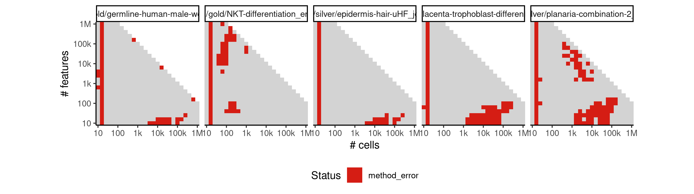
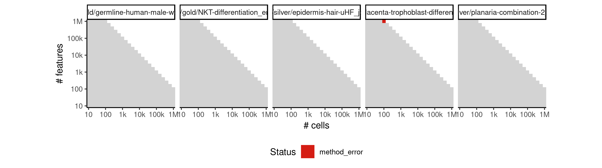

# projected_paga


## ERROR STATUS EXECUTION_ERROR

### ERROR CLUSTER EXECUTION_ERROR -- 1


 * Number of instances: 53
 * Dataset ids: scaling_1747, scaling_1778, scaling_1779, scaling_1788, scaling_1807, scaling_1841, scaling_1856, scaling_1860, scaling_1861, scaling_1873, scaling_1906, scaling_1909, scaling_1924, scaling_1934, scaling_1935, scaling_1938, scaling_1942, scaling_1966, scaling_1994, scaling_1995, scaling_2013, scaling_2016, scaling_2024, scaling_2027, scaling_2052, scaling_2064, scaling_2077, scaling_2081, scaling_2083, scaling_2097, scaling_2100, scaling_2113, scaling_2114, scaling_2136, scaling_2145, scaling_2169, scaling_2176, scaling_2202, scaling_2203, scaling_2205, scaling_2244, scaling_2248, scaling_2249, scaling_2251, scaling_2270, scaling_2271, scaling_2272, scaling_2273, scaling_2296, scaling_2311, scaling_2312, scaling_2313, scaling_2314

Last 10 lines of scaling_1747:
```
File: /home/rcannood/Workspace/dynverse/dynbenchmark//derived/05-scaling/suite/projected_paga/Cat4/r2gridengine/20181012_214244_projected_paga_Cat4_mER6RNxUW4/log/log.12.e.txt
In addition: There were 49 warnings (use warnings() to see them)
Execution halted
```

### ERROR CLUSTER EXECUTION_ERROR -- 2


 * Number of instances: 4
 * Dataset ids: scaling_1880, scaling_1913, scaling_2128, scaling_2287

Last 10 lines of scaling_1880:
```
File: /home/rcannood/Workspace/dynverse/dynbenchmark//derived/05-scaling/suite/projected_paga/Cat4/r2gridengine/20181012_214244_projected_paga_Cat4_mER6RNxUW4/log/log.145.e.txt
Execution halted
```

## ERROR STATUS METHOD_ERROR

### ERROR CLUSTER METHOD_ERROR -- 1


 * Number of instances: 286
 * Dataset ids: scaling_0007, scaling_0009, scaling_0011, scaling_0013, scaling_0015, scaling_0017, scaling_0020, scaling_0023, scaling_0026, scaling_0029, scaling_0031, scaling_0033, scaling_0035, scaling_0037, scaling_0039, scaling_0052, scaling_0057, scaling_0062, scaling_0066, scaling_0067, scaling_0072, scaling_0077, scaling_0083, scaling_0089, scaling_0095, scaling_0101, scaling_0107, scaling_0114, scaling_0121, scaling_0128, scaling_0135, scaling_0149, scaling_0152, scaling_0158, scaling_0164, scaling_0170, scaling_0176, scaling_0192, scaling_0216, scaling_0218, scaling_0220, scaling_0222, scaling_0224, scaling_0226, scaling_0227, scaling_0233, scaling_0239, scaling_0245, scaling_0251, scaling_0262, scaling_0277, scaling_0288, scaling_0293, scaling_0294, scaling_0299, scaling_0310, scaling_0321, scaling_0342, scaling_0352, scaling_0356, scaling_0357, scaling_0358, scaling_0362, scaling_0372, scaling_0380, scaling_0382, scaling_0390, scaling_0391, scaling_0392, scaling_0405, scaling_0411, scaling_0418, scaling_0431, scaling_0441, scaling_0442, scaling_0444, scaling_0454, scaling_0455, scaling_0456, scaling_0465, scaling_0485, scaling_0495, scaling_0497, scaling_0504, scaling_0505, scaling_0506, scaling_0510, scaling_0514, scaling_0518, scaling_0521, scaling_0522, scaling_0525, scaling_0526, scaling_0532, scaling_0538, scaling_0544, scaling_0549, scaling_0550, scaling_0564, scaling_0582, scaling_0590, scaling_0591, scaling_0599, scaling_0600, scaling_0602, scaling_0616, scaling_0618, scaling_0634, scaling_0648, scaling_0650, scaling_0662, scaling_0663, scaling_0664, scaling_0666, scaling_0677, scaling_0678, scaling_0679, scaling_0680, scaling_0682, scaling_0696, scaling_0697, scaling_0699, scaling_0716, scaling_0730, scaling_0731, scaling_0733, scaling_0746, scaling_0747, scaling_0748, scaling_0750, scaling_0763, scaling_0764, scaling_0767, scaling_0782, scaling_0783, scaling_0785, scaling_0788, scaling_0803, scaling_0818, scaling_0819, scaling_0821, scaling_0835, scaling_0836, scaling_0837, scaling_0839, scaling_0852, scaling_0853, scaling_0855, scaling_0866, scaling_0869, scaling_0888, scaling_0898, scaling_0899, scaling_0908, scaling_0909, scaling_0910, scaling_0911, scaling_0918, scaling_0919, scaling_0927, scaling_0934, scaling_0935, scaling_0942, scaling_0943, scaling_0950, scaling_0951, scaling_0956, scaling_0957, scaling_0958, scaling_0963, scaling_0968, scaling_0969, scaling_0973, scaling_0974, scaling_0975, scaling_0979, scaling_0980, scaling_0997, scaling_1034, scaling_1035, scaling_1036, scaling_1048, scaling_1049, scaling_1050, scaling_1069, scaling_1072, scaling_1073, scaling_1074, scaling_1106, scaling_1107, scaling_1123, scaling_1124, scaling_1125, scaling_1142, scaling_1143, scaling_1144, scaling_1146, scaling_1148, scaling_1150, scaling_1152, scaling_1153, scaling_1154, scaling_1155, scaling_1163, scaling_1165, scaling_1167, scaling_1180, scaling_1183, scaling_1184, scaling_1185, scaling_1199, scaling_1212, scaling_1215, scaling_1227, scaling_1231, scaling_1242, scaling_1243, scaling_1261, scaling_1265, scaling_1268, scaling_1273, scaling_1275, scaling_1277, scaling_1295, scaling_1298, scaling_1301, scaling_1319, scaling_1337, scaling_1340, scaling_1356, scaling_1361, scaling_1370, scaling_1376, scaling_1377, scaling_1395, scaling_1427, scaling_1439, scaling_1442, scaling_1454, scaling_1455, scaling_1466, scaling_1478, scaling_1490, scaling_1498, scaling_1507, scaling_1524, scaling_1527, scaling_1530, scaling_1532, scaling_1547, scaling_1551, scaling_1554, scaling_1570, scaling_1585, scaling_1589, scaling_1603, scaling_1608, scaling_1616, scaling_1617, scaling_1621, scaling_1652, scaling_1709, scaling_1710, scaling_1720, scaling_1723, scaling_1724, scaling_1725, scaling_1726, scaling_1731, scaling_1740, scaling_1744, scaling_1752, scaling_1783, scaling_1824, scaling_1831, scaling_1832, scaling_1833, scaling_1834, scaling_1837, scaling_1876, scaling_1975, scaling_1985, scaling_1996, scaling_2034, scaling_2215, scaling_2217

Last 10 lines of scaling_0007:
```
	cell_ids.feather
	dimred_milestones.feather
	dimred.feather
	grouping.feather
	milestone_network.feather
	timings.feather
Loading required namespace: hdf5r
Loading required namespace: feather
`milestone_ids` not set-equal to rownames(dimred_milestones).
Lengths differ: 0 is not 1
```

### ERROR CLUSTER METHOD_ERROR -- 2


 * Number of instances: 59
 * Dataset ids: scaling_0765, scaling_0854, scaling_0994, scaling_1022, scaling_1126, scaling_1145, scaling_1147, scaling_1151, scaling_1244, scaling_1249, scaling_1257, scaling_1378, scaling_1452, scaling_1476, scaling_1486, scaling_1488, scaling_1500, scaling_1505, scaling_1517, scaling_1523, scaling_1529, scaling_1548, scaling_1549, scaling_1586, scaling_1587, scaling_1602, scaling_1605, scaling_1606, scaling_1624, scaling_1625, scaling_1642, scaling_1646, scaling_1686, scaling_1690, scaling_1708, scaling_1712, scaling_1730, scaling_1734, scaling_1739, scaling_1746, scaling_1750, scaling_1751, scaling_1763, scaling_1765, scaling_1847, scaling_1848, scaling_1879, scaling_1888, scaling_1972, scaling_1977, scaling_1998, scaling_2030, scaling_2055, scaling_2085, scaling_2098, scaling_2143, scaling_2159, scaling_2224, scaling_2327

Last 10 lines of scaling_0765:
```
  File "/usr/local/lib/python3.6/site-packages/sklearn/decomposition/pca.py", line 348, in fit_transform
    U, S, V = self._fit(X)
  File "/usr/local/lib/python3.6/site-packages/sklearn/decomposition/pca.py", line 370, in _fit
    copy=self.copy)
  File "/usr/local/lib/python3.6/site-packages/sklearn/utils/validation.py", line 453, in check_array
    _assert_all_finite(array)
  File "/usr/local/lib/python3.6/site-packages/sklearn/utils/validation.py", line 44, in _assert_all_finite
    " or a value too large for %r." % X.dtype)
ValueError: Input contains NaN, infinity or a value too large for dtype('float32').
Loading required namespace: hdf5r
```

### ERROR CLUSTER METHOD_ERROR -- 3


 * Number of instances: 248
 * Dataset ids: scaling_1736, scaling_1738, scaling_1753, scaling_1754, scaling_1755, scaling_1756, scaling_1758, scaling_1759, scaling_1767, scaling_1769, scaling_1773, scaling_1775, scaling_1782, scaling_1792, scaling_1793, scaling_1794, scaling_1795, scaling_1796, scaling_1798, scaling_1804, scaling_1808, scaling_1809, scaling_1810, scaling_1823, scaling_1825, scaling_1827, scaling_1842, scaling_1851, scaling_1858, scaling_1862, scaling_1871, scaling_1883, scaling_1885, scaling_1891, scaling_1892, scaling_1894, scaling_1895, scaling_1901, scaling_1903, scaling_1911, scaling_1915, scaling_1917, scaling_1918, scaling_1920, scaling_1923, scaling_1925, scaling_1926, scaling_1928, scaling_1930, scaling_1931, scaling_1932, scaling_1936, scaling_1937, scaling_1939, scaling_1940, scaling_1950, scaling_1952, scaling_1953, scaling_1954, scaling_1955, scaling_1958, scaling_1961, scaling_1962, scaling_1963, scaling_1964, scaling_1965, scaling_1967, scaling_1976, scaling_1979, scaling_1980, scaling_1982, scaling_1987, scaling_1988, scaling_1989, scaling_1990, scaling_1991, scaling_1999, scaling_2002, scaling_2003, scaling_2006, scaling_2007, scaling_2008, scaling_2009, scaling_2015, scaling_2018, scaling_2019, scaling_2020, scaling_2022, scaling_2023, scaling_2025, scaling_2031, scaling_2033, scaling_2037, scaling_2038, scaling_2040, scaling_2041, scaling_2043, scaling_2045, scaling_2046, scaling_2047, scaling_2048, scaling_2049, scaling_2050, scaling_2051, scaling_2053, scaling_2054, scaling_2059, scaling_2060, scaling_2062, scaling_2063, scaling_2066, scaling_2067, scaling_2068, scaling_2069, scaling_2071, scaling_2072, scaling_2073, scaling_2074, scaling_2075, scaling_2078, scaling_2079, scaling_2082, scaling_2087, scaling_2088, scaling_2091, scaling_2093, scaling_2094, scaling_2095, scaling_2096, scaling_2103, scaling_2104, scaling_2106, scaling_2107, scaling_2111, scaling_2115, scaling_2116, scaling_2118, scaling_2120, scaling_2121, scaling_2123, scaling_2125, scaling_2129, scaling_2130, scaling_2131, scaling_2132, scaling_2133, scaling_2134, scaling_2135, scaling_2137, scaling_2138, scaling_2142, scaling_2146, scaling_2151, scaling_2153, scaling_2156, scaling_2157, scaling_2158, scaling_2160, scaling_2161, scaling_2162, scaling_2163, scaling_2164, scaling_2167, scaling_2168, scaling_2171, scaling_2174, scaling_2175, scaling_2179, scaling_2181, scaling_2183, scaling_2185, scaling_2186, scaling_2187, scaling_2189, scaling_2190, scaling_2191, scaling_2193, scaling_2194, scaling_2196, scaling_2197, scaling_2198, scaling_2204, scaling_2206, scaling_2207, scaling_2208, scaling_2209, scaling_2211, scaling_2212, scaling_2223, scaling_2227, scaling_2229, scaling_2230, scaling_2231, scaling_2234, scaling_2235, scaling_2236, scaling_2237, scaling_2238, scaling_2240, scaling_2241, scaling_2243, scaling_2250, scaling_2253, scaling_2255, scaling_2256, scaling_2260, scaling_2261, scaling_2263, scaling_2264, scaling_2265, scaling_2266, scaling_2267, scaling_2274, scaling_2275, scaling_2276, scaling_2278, scaling_2279, scaling_2280, scaling_2281, scaling_2282, scaling_2283, scaling_2284, scaling_2285, scaling_2288, scaling_2291, scaling_2293, scaling_2294, scaling_2297, scaling_2299, scaling_2300, scaling_2303, scaling_2304, scaling_2305, scaling_2306, scaling_2307, scaling_2308, scaling_2309, scaling_2310, scaling_2316, scaling_2317, scaling_2318, scaling_2319, scaling_2320, scaling_2322, scaling_2323, scaling_2324, scaling_2328, scaling_2330

Last 10 lines of scaling_1736:
```
    error #003: ../../src/H5Dchunk.c in H5D__chunk_write(): line 1968: unable to read raw data chunk
        class: HDF5
        major: Low-level I/O
        minor: Read failed
    error #004: ../../src/H5Dchunk.c in H5D__chunk_lock(): line 2953: unable to preempt chunk(s) from cache
        class: HDF5
        major: Low-level I/O
        minor: Unable to initialize object
    error #005: ../../src/H5Dchunk.c in H5D__chunk_cache_prune(): line 2739: unable to preempt one or more raw data cache entry
        c
```

### ERROR CLUSTER METHOD_ERROR -- 4


 * Number of instances: 16
 * Dataset ids: scaling_1741, scaling_1742, scaling_1749, scaling_1791, scaling_1805, scaling_1830, scaling_1836, scaling_1943, scaling_1971, scaling_1973, scaling_1974, scaling_2026, scaling_2036, scaling_2144, scaling_2184, scaling_2219

Last 10 lines of scaling_1741:
```
  File "/usr/local/lib/python3.6/site-packages/pandas/io/feather_format.py", line 83, in to_feather
    feather.write_dataframe(df, path)
  File "/usr/local/lib/python3.6/site-packages/pyarrow/feather.py", line 181, in write_feather
    writer.write(df)
  File "/usr/local/lib/python3.6/site-packages/pyarrow/feather.py", line 96, in write
    self.writer.write_array(name, col)
  File "pyarrow/types.pxi", line 67, in pyarrow.lib._datatype_to_pep3118
  File "pyarrow/error.pxi", line 83, in pyarrow.lib.check_status
pyarrow.lib.ArrowIOError: Error writing bytes from file: No space left on device
Loading required namespace: hdf5r
```

### ERROR CLUSTER METHOD_ERROR -- 5


 * Number of instances: 28
 * Dataset ids: scaling_1743, scaling_1776, scaling_1777, scaling_1785, scaling_1801, scaling_1811, scaling_1844, scaling_1846, scaling_1853, scaling_1865, scaling_1869, scaling_1870, scaling_1884, scaling_1890, scaling_1914, scaling_1921, scaling_1933, scaling_1983, scaling_2032, scaling_2061, scaling_2065, scaling_2070, scaling_2084, scaling_2112, scaling_2139, scaling_2154, scaling_2155, scaling_2225

Last 10 lines of scaling_1743:
```
error reading from connection
```

### ERROR CLUSTER METHOD_ERROR -- 6


 * Number of instances: 2
 * Dataset ids: scaling_1757, scaling_2220

Last 10 lines of scaling_1757:
```
        minor: Unable to flush data from cache
    error #003: ../../src/H5C.c in H5C_flush_cache(): line 1841: Can't flush entry.
        class: HDF5
        major: Object cache
        minor: Unable to flush data from cache
    error #004: ../../src/H5C.c in H5C_flush_single_entry(): line 7753: unable to flush entry
        class: HDF5
        major: Object cache
        minor: Unable to flush data from cache
    error #005: ../../src/H5HGcache.c in H5HG_flus
```

### ERROR CLUSTER METHOD_ERROR -- 7


 * Number of instances: 1
 * Dataset ids: scaling_1766

Last 10 lines of scaling_1766:
```
        class: HDF5
        major: Dataset
        minor: Write failed
    error #003: ../../src/H5Fio.c in H5F_block_write(): line 158: write through metadata accumulator failed
        class: HDF5
        major: Low-level I/O
        minor: Write failed
    error #004: ../../src/H5Faccum.c in H5F_accum_write(): line 816: file write failed
        cla
Calls: <Anonymous> -> <Anonymous> -> <Anonymous> -> .Call
```

### ERROR CLUSTER METHOD_ERROR -- 8


 * Number of instances: 2
 * Dataset ids: scaling_1886, scaling_1908

Last 10 lines of scaling_1886:
```
        major: Dataset
        minor: Read failed
    error #004: ../../src/H5Dscatgath.c in H5D__scatgath_write(): line 678: datatype conversion failed
        class: HDF5
        major: Dataset
        minor: Can't convert datatypes
    error #005: ../../src/H5T.c in H5T_convert(): line 4816: data type conversion failed
        class: HDF5
        major: Attribute
        minor: Unable to encode v
```

### ERROR CLUSTER METHOD_ERROR -- 9


 * Number of instances: 1
 * Dataset ids: scaling_1902

Last 10 lines of scaling_1902:
```
        major: Dataset
        minor: Write failed
    error #003: ../../src/H5Fio.c in H5F_block_write(): line 158: write through metadata accumulator failed
        class: HDF5
        major: Low-level I/O
        minor: Write failed
    error #004: ../../src/H5Faccum.c in H5F_accum_write(): line 816: file write failed
        cla
Calls: <Anonymous> -> <Anonymous> -> <Anonymous> -> .Call
argument 2 (type 'environment') cannot be handled by 'cat'
```

### ERROR CLUSTER METHOD_ERROR -- 10


 * Number of instances: 1
 * Dataset ids: scaling_2148

Last 10 lines of scaling_2148:
```
        class: HDF5
        major: Low-level I/O
        minor: Read failed
    error #004: ../../src/H5Dchunk.c in H5D__chunk_lock(): line 2950: unable to preempt chunk from cache
        class: HDF5
        major: Low-level I/O
        minor: Unable to initialize object
    error #005: ../../src/H5Dchunk.c in H5D__chunk_cache_evict(): line 2606: cannot flush indexed storage buffer
        class: HDF5
       
```

### ERROR CLUSTER METHOD_ERROR -- 11


 * Number of instances: 1
 * Dataset ids: scaling_2289

Last 10 lines of scaling_2289:
```
  File "/usr/local/lib/python3.6/site-packages/pandas/core/frame.py", line 348, in __init__
    mgr = self._init_dict(data, index, columns, dtype=dtype)
  File "/usr/local/lib/python3.6/site-packages/pandas/core/frame.py", line 459, in _init_dict
    return _arrays_to_mgr(arrays, data_names, index, columns, dtype=dtype)
  File "/usr/local/lib/python3.6/site-packages/pandas/core/frame.py", line 7356, in _arrays_to_mgr
    index = extract_index(arrays)
  File "/usr/local/lib/python3.6/site-packages/pandas/core/frame.py", line 7412, in extract_index
    raise ValueError(msg)
ValueError: array length 100 does not match index length 61
Loading required namespace: hdf5r
```

## ERROR STATUS TIME_LIMIT

### ERROR CLUSTER TIME_LIMIT -- 1


 * Number of instances: 40
 * Dataset ids: scaling_1181, scaling_1213, scaling_1228, scaling_1229, scaling_1245, scaling_1296, scaling_1338, scaling_1357, scaling_1358, scaling_1359, scaling_1379, scaling_1380, scaling_1428, scaling_1440, scaling_1451, scaling_1475, scaling_1487, scaling_1499, scaling_1568, scaling_1604, scaling_1622, scaling_1623, scaling_1647, scaling_1669, scaling_1691, scaling_1711, scaling_1713, scaling_1732, scaling_1733, scaling_1735, scaling_1780, scaling_1839, scaling_1840, scaling_1912, scaling_1978, scaling_1997, scaling_2000, scaling_2245, scaling_2246, scaling_2329

Last 10 lines of scaling_1181:
```
File: /home/rcannood/Workspace/dynverse/dynbenchmark//derived/05-scaling/suite/projected_paga/Cat3/r2gridengine/20181010_161015_projected_paga_Cat3_2p0e3UbXOy/log/log.36.e.txt
```

## ERROR STATUS MEMORY_LIMIT

### ERROR CLUSTER MEMORY_LIMIT -- 1


 * Number of instances: 85
 * Dataset ids: scaling_1748, scaling_1772, scaling_1774, scaling_1781, scaling_1803, scaling_1813, scaling_1826, scaling_1838, scaling_1849, scaling_1857, scaling_1863, scaling_1864, scaling_1872, scaling_1887, scaling_1900, scaling_1907, scaling_1916, scaling_1922, scaling_1927, scaling_1948, scaling_1956, scaling_1957, scaling_1960, scaling_1969, scaling_1981, scaling_1992, scaling_2001, scaling_2005, scaling_2010, scaling_2011, scaling_2012, scaling_2014, scaling_2017, scaling_2035, scaling_2042, scaling_2044, scaling_2056, scaling_2057, scaling_2058, scaling_2076, scaling_2086, scaling_2089, scaling_2105, scaling_2117, scaling_2119, scaling_2122, scaling_2124, scaling_2126, scaling_2127, scaling_2140, scaling_2147, scaling_2149, scaling_2150, scaling_2152, scaling_2165, scaling_2166, scaling_2173, scaling_2177, scaling_2178, scaling_2180, scaling_2188, scaling_2192, scaling_2195, scaling_2199, scaling_2201, scaling_2210, scaling_2226, scaling_2228, scaling_2233, scaling_2239, scaling_2242, scaling_2247, scaling_2252, scaling_2257, scaling_2259, scaling_2268, scaling_2269, scaling_2286, scaling_2290, scaling_2292, scaling_2295, scaling_2298, scaling_2301, scaling_2302, scaling_2321

Last 10 lines of scaling_1748:
```
    error #003: ../../src/H5Dchunk.c in H5D__chunk_write(): line 1968: unable to read raw data chunk
        class: HDF5
        major: Low-level I/O
        minor: Read failed
    error #004: ../../src/H5Dchunk.c in H5D__chunk_lock(): line 2953: unable to preempt chunk(s) from cache
        class: HDF5
        major: Low-level I/O
        minor: Unable to initialize object
    error #005: ../../src/H5Dchunk.c in H5D__chunk_cache_prune(): line 2739: unable to preempt one or more raw data cache entry
        c
```

### ERROR CLUSTER MEMORY_LIMIT -- 2


 * Number of instances: 1
 * Dataset ids: scaling_1786

Last 10 lines of scaling_1786:
```
        minor: Unable to flush data from cache
    error #003: ../../src/H5C.c in H5C_flush_cache(): line 1841: Can't flush entry.
        class: HDF5
        major: Object cache
        minor: Unable to flush data from cache
    error #004: ../../src/H5C.c in H5C_flush_single_entry(): line 7753: unable to flush entry
        class: HDF5
        major: Object cache
        minor: Unable to flush data from cache
    error #005: ../../src/H5HGcache.c in H5HG_flus
```

### ERROR CLUSTER MEMORY_LIMIT -- 3


 * Number of instances: 5
 * Dataset ids: scaling_1910, scaling_2092, scaling_2099, scaling_2101, scaling_2221

Last 10 lines of scaling_1910:
```
        major: Dataset
        minor: Read failed
    error #004: ../../src/H5Dscatgath.c in H5D__scatgath_write(): line 678: datatype conversion failed
        class: HDF5
        major: Dataset
        minor: Can't convert datatypes
    error #005: ../../src/H5T.c in H5T_convert(): line 4816: data type conversion failed
        class: HDF5
        major: Attribute
        minor: Unable to encode v
```


