# projected_slingshot


## ERROR STATUS EXECUTION_ERROR

### ERROR CLUSTER EXECUTION_ERROR -- 1
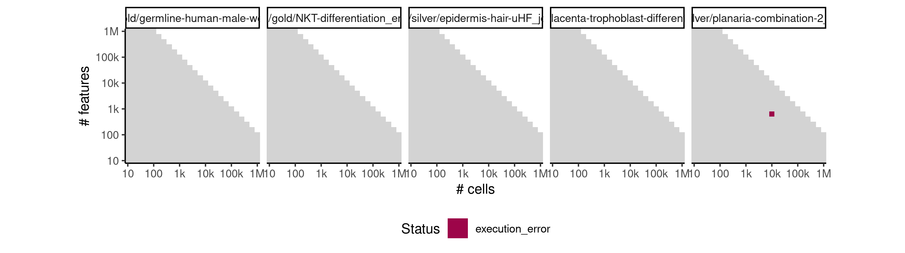

 * Number of instances: 1
 * Dataset ids: scaling_1528

Last 10 lines of scaling_1528:
```
File: /home/rcannood/Workspace/dynverse/dynbenchmark//derived/05-scaling/suite/projected_slingshot/Cat3/r2gridengine/20181010_160925_projected_slingshot_Cat3_SudrzKU8v5/log/log.383.e.txt
Execution halted
```

## ERROR STATUS METHOD_ERROR

### ERROR CLUSTER METHOD_ERROR -- 1
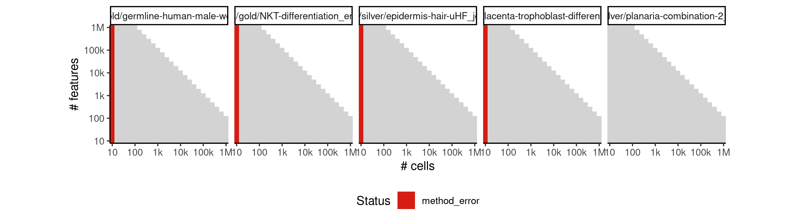

 * Number of instances: 104
 * Dataset ids: scaling_0001, scaling_0002, scaling_0003, scaling_0004, scaling_0006, scaling_0008, scaling_0010, scaling_0012, scaling_0016, scaling_0019, scaling_0022, scaling_0025, scaling_0041, scaling_0043, scaling_0045, scaling_0047, scaling_0051, scaling_0056, scaling_0061, scaling_0066, scaling_0076, scaling_0082, scaling_0088, scaling_0094, scaling_0106, scaling_0113, scaling_0120, scaling_0127, scaling_0151, scaling_0157, scaling_0163, scaling_0169, scaling_0181, scaling_0188, scaling_0195, scaling_0202, scaling_0226, scaling_0232, scaling_0238, scaling_0244, scaling_0276, scaling_0287, scaling_0298, scaling_0309, scaling_0341, scaling_0351, scaling_0361, scaling_0371, scaling_0391, scaling_0404, scaling_0417, scaling_0430, scaling_0456, scaling_0466, scaling_0476, scaling_0486, scaling_0556, scaling_0565, scaling_0574, scaling_0583, scaling_0601, scaling_0617, scaling_0633, scaling_0649, scaling_0681, scaling_0698, scaling_0715, scaling_0732, scaling_0766, scaling_0784, scaling_0802, scaling_0820, scaling_0856, scaling_0867, scaling_0878, scaling_0889, scaling_0981, scaling_0995, scaling_1009, scaling_1023, scaling_1051, scaling_1070, scaling_1089, scaling_1108, scaling_1166, scaling_1182, scaling_1198, scaling_1214, scaling_1276, scaling_1297, scaling_1318, scaling_1339, scaling_1441, scaling_1453, scaling_1465, scaling_1477, scaling_1531, scaling_1550, scaling_1569, scaling_1588, scaling_1626, scaling_1648, scaling_1670, scaling_1692

Last 10 lines of scaling_0001:
```
Attaching package: ‘purrr’
The following object is masked from ‘package:jsonlite’:
    flatten
Warning messages:
1: In rgl.init(initValue, onlyNULL) : RGL: unable to open X11 display
2: 'rgl_init' failed, running with rgl.useNULL = TRUE 
Error in pam(dimred, K) : 
  Number of clusters 'k' must be in {1,2, .., n-1}; hence n >= 2
Calls: lapply -> lapply -> FUN -> pam
Execution halted
```

### ERROR CLUSTER METHOD_ERROR -- 2
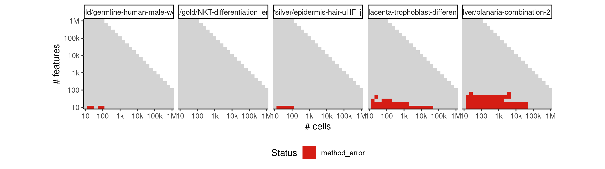

 * Number of instances: 105
 * Dataset ids: scaling_0007, scaling_0011, scaling_0013, scaling_0015, scaling_0018, scaling_0024, scaling_0026, scaling_0027, scaling_0029, scaling_0030, scaling_0037, scaling_0038, scaling_0039, scaling_0040, scaling_0046, scaling_0048, scaling_0050, scaling_0055, scaling_0065, scaling_0069, scaling_0070, scaling_0072, scaling_0073, scaling_0074, scaling_0075, scaling_0081, scaling_0093, scaling_0096, scaling_0098, scaling_0099, scaling_0102, scaling_0103, scaling_0104, scaling_0105, scaling_0131, scaling_0132, scaling_0133, scaling_0136, scaling_0137, scaling_0138, scaling_0139, scaling_0140, scaling_0148, scaling_0150, scaling_0173, scaling_0174, scaling_0178, scaling_0179, scaling_0180, scaling_0207, scaling_0208, scaling_0213, scaling_0214, scaling_0215, scaling_0223, scaling_0225, scaling_0248, scaling_0249, scaling_0254, scaling_0255, scaling_0274, scaling_0275, scaling_0318, scaling_0319, scaling_0327, scaling_0328, scaling_0329, scaling_0330, scaling_0340, scaling_0379, scaling_0380, scaling_0388, scaling_0389, scaling_0390, scaling_0441, scaling_0442, scaling_0452, scaling_0453, scaling_0454, scaling_0455, scaling_0495, scaling_0503, scaling_0504, scaling_0505, scaling_0525, scaling_0555, scaling_0591, scaling_0598, scaling_0600, scaling_0664, scaling_0677, scaling_0679, scaling_0680, scaling_0748, scaling_0762, scaling_0764, scaling_0765, scaling_0837, scaling_0851, scaling_0854, scaling_0855, scaling_0899, scaling_0910, scaling_0950, scaling_0980

Last 10 lines of scaling_0007:
```
The following object is masked from ‘package:jsonlite’:
    flatten
Warning messages:
1: In rgl.init(initValue, onlyNULL) : RGL: unable to open X11 display
2: 'rgl_init' failed, running with rgl.useNULL = TRUE 
Using diagonal covariance matrix
Error in solve.default(s1 + s2) : 
  Lapack routine dgesv: system is exactly singular: U[1,1] = 0
Calls: slingshot ... dist.fun -> .dist_clusters_diag -> solve -> solve.default
Execution halted
```

### ERROR CLUSTER METHOD_ERROR -- 3
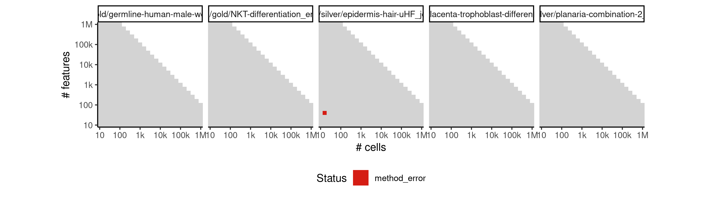

 * Number of instances: 1
 * Dataset ids: scaling_0062

Last 10 lines of scaling_0062:
```
  longer object length is not a multiple of shorter object length
8: In lm(pca$sdev[1:20] ~ x + x2)$residuals^2 * rep(1:2, each = 10) :
  longer object length is not a multiple of shorter object length
9: In lm(pca$sdev[1:20] ~ x + x2)$residuals^2 * rep(1:2, each = 10) :
  longer object length is not a multiple of shorter object length
Using diagonal covariance matrix
Error in if (box.vals[1] == box.vals[5]) { : 
  missing value where TRUE/FALSE needed
Calls: slingshot ... getCurves -> .local -> lapply -> FUN -> .percent_shrinkage
Execution halted
```

### ERROR CLUSTER METHOD_ERROR -- 4
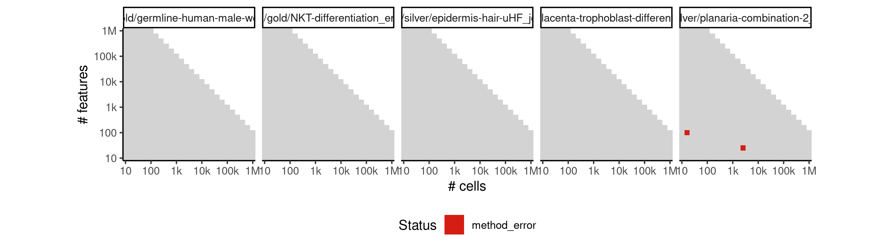

 * Number of instances: 2
 * Dataset ids: scaling_0135, scaling_0599

Last 10 lines of scaling_0135:
```
  longer object length is not a multiple of shorter object length
8: In lm(pca$sdev[1:20] ~ x + x2)$residuals^2 * rep(1:2, each = 10) :
  longer object length is not a multiple of shorter object length
9: In lm(pca$sdev[1:20] ~ x + x2)$residuals^2 * rep(1:2, each = 10) :
  longer object length is not a multiple of shorter object length
Using diagonal covariance matrix
Error in solve.default(s1 + s2) : 
  system is computationally singular: reciprocal condition number = 7.52545e-30
Calls: slingshot ... dist.fun -> .dist_clusters_diag -> solve -> solve.default
Execution halted
```

### ERROR CLUSTER METHOD_ERROR -- 5


 * Number of instances: 12
 * Dataset ids: scaling_0201, scaling_0350, scaling_0370, scaling_0678, scaling_0763, scaling_0852, scaling_0853, scaling_0908, scaling_0909, scaling_1048, scaling_1049, scaling_1143

Last 10 lines of scaling_0201:
```
The following object is masked from ‘package:jsonlite’:
    flatten
Warning messages:
1: In rgl.init(initValue, onlyNULL) : RGL: unable to open X11 display
2: 'rgl_init' failed, running with rgl.useNULL = TRUE 
Using full covariance matrix
Error in solve.default(s1 + s2) : 
  system is computationally singular: reciprocal condition number = 8.74368e-17
Calls: slingshot ... dist.fun -> .dist_clusters_full -> solve -> solve.default
Execution halted
```

### ERROR CLUSTER METHOD_ERROR -- 6
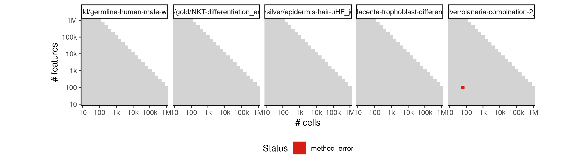

 * Number of instances: 1
 * Dataset ids: scaling_0252

Last 10 lines of scaling_0252:
```
The following object is masked from ‘package:jsonlite’:
    flatten
Warning messages:
1: In rgl.init(initValue, onlyNULL) : RGL: unable to open X11 display
2: 'rgl_init' failed, running with rgl.useNULL = TRUE 
Using diagonal covariance matrix
Error in smooth.spline(lambda, xj, w = w, ..., df = df, tol = tol, keep.data = FALSE,  : 
  need at least four unique 'x' values
Calls: slingshot ... tryCatchList -> tryCatchOne -> <Anonymous> -> smooth.spline
Execution halted
```

### ERROR CLUSTER METHOD_ERROR -- 7
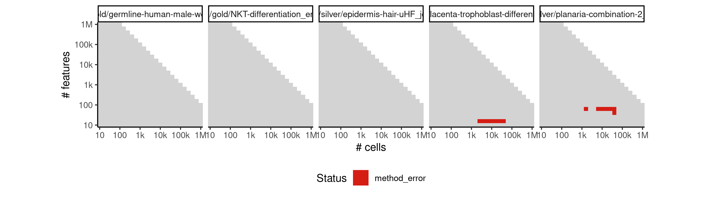

 * Number of instances: 14
 * Dataset ids: scaling_0521, scaling_0549, scaling_0663, scaling_0676, scaling_0747, scaling_0836, scaling_0942, scaling_0949, scaling_0974, scaling_0979, scaling_1142, scaling_1165, scaling_1243, scaling_1275

Last 10 lines of scaling_0521:
```
  longer object length is not a multiple of shorter object length
8: In lm(pca$sdev[1:20] ~ x + x2)$residuals^2 * rep(1:2, each = 10) :
  longer object length is not a multiple of shorter object length
9: In lm(pca$sdev[1:20] ~ x + x2)$residuals^2 * rep(1:2, each = 10) :
  longer object length is not a multiple of shorter object length
Using full covariance matrix
Error in solve.default(s1 + s2) : 
  Lapack routine dgesv: system is exactly singular: U[2,2] = 0
Calls: slingshot ... dist.fun -> .dist_clusters_full -> solve -> solve.default
Execution halted
```

### ERROR CLUSTER METHOD_ERROR -- 8
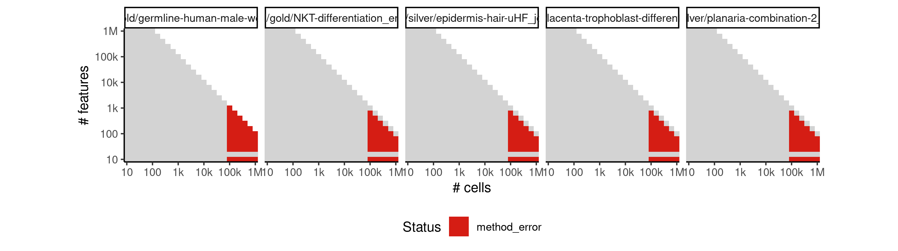

 * Number of instances: 225
 * Dataset ids: scaling_1069, scaling_1088, scaling_1107, scaling_1126, scaling_1145, scaling_1181, scaling_1197, scaling_1213, scaling_1229, scaling_1245, scaling_1294, scaling_1296, scaling_1315, scaling_1317, scaling_1336, scaling_1338, scaling_1357, scaling_1359, scaling_1378, scaling_1380, scaling_1391, scaling_1392, scaling_1403, scaling_1404, scaling_1415, scaling_1416, scaling_1427, scaling_1428, scaling_1439, scaling_1440, scaling_1452, scaling_1464, scaling_1476, scaling_1488, scaling_1500, scaling_1506, scaling_1512, scaling_1518, scaling_1524, scaling_1530, scaling_1546, scaling_1547, scaling_1549, scaling_1565, scaling_1566, scaling_1568, scaling_1584, scaling_1585, scaling_1587, scaling_1603, scaling_1604, scaling_1606, scaling_1622, scaling_1623, scaling_1625, scaling_1643, scaling_1644, scaling_1645, scaling_1646, scaling_1647, scaling_1665, scaling_1666, scaling_1667, scaling_1668, scaling_1669, scaling_1687, scaling_1688, scaling_1689, scaling_1690, scaling_1691, scaling_1709, scaling_1710, scaling_1711, scaling_1712, scaling_1713, scaling_1731, scaling_1732, scaling_1733, scaling_1734, scaling_1735, scaling_1777, scaling_1778, scaling_1779, scaling_1792, scaling_1793, scaling_1794, scaling_1807, scaling_1808, scaling_1809, scaling_1822, scaling_1823, scaling_1824, scaling_1837, scaling_1838, scaling_1839, scaling_1847, scaling_1848, scaling_1855, scaling_1856, scaling_1863, scaling_1864, scaling_1871, scaling_1872, scaling_1879, scaling_1880, scaling_1907, scaling_1908, scaling_1909, scaling_1910, scaling_1911, scaling_1912, scaling_1929, scaling_1930, scaling_1931, scaling_1932, scaling_1933, scaling_1934, scaling_1951, scaling_1952, scaling_1953, scaling_1954, scaling_1955, scaling_1956, scaling_1973, scaling_1974, scaling_1975, scaling_1976, scaling_1977, scaling_1978, scaling_1995, scaling_1996, scaling_1997, scaling_1998, scaling_1999, scaling_2000, scaling_2007, scaling_2008, scaling_2015, scaling_2016, scaling_2023, scaling_2024, scaling_2031, scaling_2032, scaling_2039, scaling_2040, scaling_2052, scaling_2053, scaling_2054, scaling_2055, scaling_2067, scaling_2068, scaling_2069, scaling_2070, scaling_2082, scaling_2083, scaling_2084, scaling_2085, scaling_2097, scaling_2098, scaling_2099, scaling_2100, scaling_2112, scaling_2113, scaling_2114, scaling_2115, scaling_2120, scaling_2121, scaling_2126, scaling_2127, scaling_2132, scaling_2133, scaling_2138, scaling_2139, scaling_2144, scaling_2145, scaling_2158, scaling_2159, scaling_2160, scaling_2161, scaling_2174, scaling_2175, scaling_2176, scaling_2177, scaling_2190, scaling_2191, scaling_2192, scaling_2193, scaling_2206, scaling_2207, scaling_2208, scaling_2209, scaling_2222, scaling_2223, scaling_2224, scaling_2225, scaling_2241, scaling_2242, scaling_2243, scaling_2244, scaling_2245, scaling_2246, scaling_2262, scaling_2263, scaling_2264, scaling_2265, scaling_2266, scaling_2267, scaling_2283, scaling_2284, scaling_2285, scaling_2286, scaling_2287, scaling_2288, scaling_2304, scaling_2305, scaling_2306, scaling_2307, scaling_2308, scaling_2309, scaling_2325, scaling_2326, scaling_2327, scaling_2328, scaling_2329, scaling_2330

Last 10 lines of scaling_1069:
```
Attaching package: ‘purrr’
The following object is masked from ‘package:jsonlite’:
    flatten
Warning messages:
1: In rgl.init(initValue, onlyNULL) : RGL: unable to open X11 display
2: 'rgl_init' failed, running with rgl.useNULL = TRUE 
Error in pam(dimred, K) : 
  have 100000 observations, but not more than 65536 are allowed
Calls: lapply -> lapply -> FUN -> pam
Execution halted
```

### ERROR CLUSTER METHOD_ERROR -- 9
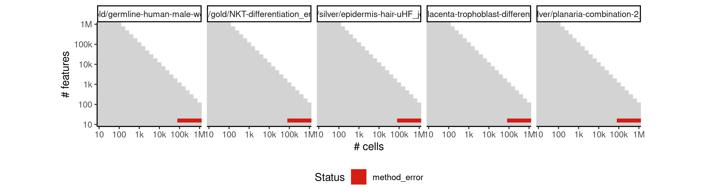

 * Number of instances: 30
 * Dataset ids: scaling_1180, scaling_1196, scaling_1212, scaling_1228, scaling_1244, scaling_1295, scaling_1316, scaling_1337, scaling_1358, scaling_1379, scaling_1451, scaling_1463, scaling_1475, scaling_1487, scaling_1499, scaling_1548, scaling_1567, scaling_1586, scaling_1605, scaling_1624, scaling_1739, scaling_1743, scaling_1747, scaling_1751, scaling_1755, scaling_1780, scaling_1795, scaling_1810, scaling_1825, scaling_1840

Last 10 lines of scaling_1180:
```
7: In lm(pca$sdev[1:20] ~ x + x2)$residuals^2 * rep(1:2, each = 10) :
  longer object length is not a multiple of shorter object length
8: In lm(pca$sdev[1:20] ~ x + x2)$residuals^2 * rep(1:2, each = 10) :
  longer object length is not a multiple of shorter object length
9: In lm(pca$sdev[1:20] ~ x + x2)$residuals^2 * rep(1:2, each = 10) :
  longer object length is not a multiple of shorter object length
Error in pam(dimred, K) : 
  have 100000 observations, but not more than 65536 are allowed
Calls: lapply -> lapply -> FUN -> pam
Execution halted
```

## ERROR STATUS TIME_LIMIT

### ERROR CLUSTER TIME_LIMIT -- 1
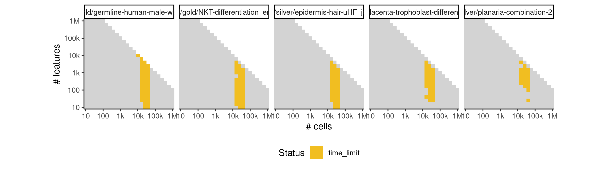

 * Number of instances: 178
 * Dataset ids: scaling_0783, scaling_0800, scaling_0801, scaling_0819, scaling_0865, scaling_0866, scaling_0876, scaling_0877, scaling_0887, scaling_0888, scaling_0918, scaling_0926, scaling_0934, scaling_0956, scaling_0962, scaling_0968, scaling_0992, scaling_0993, scaling_1006, scaling_1007, scaling_1020, scaling_1021, scaling_1034, scaling_1035, scaling_1066, scaling_1067, scaling_1068, scaling_1085, scaling_1086, scaling_1087, scaling_1104, scaling_1105, scaling_1106, scaling_1124, scaling_1125, scaling_1144, scaling_1157, scaling_1159, scaling_1161, scaling_1163, scaling_1178, scaling_1179, scaling_1194, scaling_1195, scaling_1210, scaling_1211, scaling_1227, scaling_1267, scaling_1269, scaling_1271, scaling_1273, scaling_1291, scaling_1292, scaling_1312, scaling_1313, scaling_1333, scaling_1334, scaling_1354, scaling_1355, scaling_1390, scaling_1402, scaling_1414, scaling_1426, scaling_1438, scaling_1448, scaling_1449, scaling_1460, scaling_1461, scaling_1472, scaling_1473, scaling_1484, scaling_1485, scaling_1496, scaling_1497, scaling_1505, scaling_1511, scaling_1517, scaling_1523, scaling_1529, scaling_1543, scaling_1544, scaling_1562, scaling_1563, scaling_1581, scaling_1582, scaling_1600, scaling_1601, scaling_1619, scaling_1620, scaling_1640, scaling_1641, scaling_1642, scaling_1663, scaling_1664, scaling_1684, scaling_1685, scaling_1686, scaling_1706, scaling_1707, scaling_1708, scaling_1728, scaling_1729, scaling_1730, scaling_1757, scaling_1759, scaling_1761, scaling_1763, scaling_1765, scaling_1775, scaling_1776, scaling_1790, scaling_1791, scaling_1805, scaling_1806, scaling_1820, scaling_1821, scaling_1835, scaling_1836, scaling_1882, scaling_1884, scaling_1886, scaling_1888, scaling_1890, scaling_1904, scaling_1905, scaling_1926, scaling_1927, scaling_1948, scaling_1949, scaling_1970, scaling_1971, scaling_1992, scaling_1993, scaling_2006, scaling_2014, scaling_2022, scaling_2030, scaling_2038, scaling_2049, scaling_2050, scaling_2064, scaling_2065, scaling_2079, scaling_2080, scaling_2094, scaling_2095, scaling_2110, scaling_2119, scaling_2125, scaling_2131, scaling_2137, scaling_2143, scaling_2155, scaling_2156, scaling_2171, scaling_2172, scaling_2187, scaling_2188, scaling_2203, scaling_2204, scaling_2219, scaling_2220, scaling_2236, scaling_2237, scaling_2238, scaling_2239, scaling_2258, scaling_2259, scaling_2260, scaling_2279, scaling_2280, scaling_2281, scaling_2300, scaling_2301, scaling_2302, scaling_2321, scaling_2322, scaling_2323

Last 10 lines of scaling_0783:
```
File: /home/rcannood/Workspace/dynverse/dynbenchmark//derived/05-scaling/suite/projected_slingshot/Cat2/r2gridengine/20181008_214520_projected_slingshot_Cat2_ywSnD0ur1P/log/log.103.e.txt
```

## ERROR STATUS MEMORY_LIMIT

### ERROR CLUSTER MEMORY_LIMIT -- 1


 * Number of instances: 55
 * Dataset ids: scaling_0994, scaling_1008, scaling_1022, scaling_1036, scaling_1050, scaling_1249, scaling_1253, scaling_1257, scaling_1261, scaling_1265, scaling_1293, scaling_1314, scaling_1335, scaling_1356, scaling_1377, scaling_1450, scaling_1462, scaling_1474, scaling_1486, scaling_1498, scaling_1545, scaling_1564, scaling_1583, scaling_1602, scaling_1621, scaling_1738, scaling_1742, scaling_1746, scaling_1750, scaling_1754, scaling_1846, scaling_1854, scaling_1862, scaling_1870, scaling_1878, scaling_1906, scaling_1928, scaling_1950, scaling_1972, scaling_1994, scaling_2051, scaling_2066, scaling_2081, scaling_2096, scaling_2111, scaling_2157, scaling_2173, scaling_2189, scaling_2205, scaling_2221, scaling_2240, scaling_2261, scaling_2282, scaling_2303, scaling_2324

Last 10 lines of scaling_0994:
```
The following objects are masked from ‘package:base’:
    intersect, setdiff, setequal, union
Attaching package: ‘purrr’
The following object is masked from ‘package:jsonlite’:
    flatten
Warning messages:
1: In rgl.init(initValue, onlyNULL) : RGL: unable to open X11 display
2: 'rgl_init' failed, running with rgl.useNULL = TRUE 
Error: cannot allocate vector of size 14.8 Gb
Execution halted
```

### ERROR CLUSTER MEMORY_LIMIT -- 2
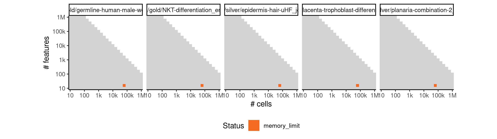

 * Number of instances: 5
 * Dataset ids: scaling_1147, scaling_1149, scaling_1151, scaling_1153, scaling_1155

Last 10 lines of scaling_1147:
```
6: In lm(pca$sdev[1:20] ~ x + x2)$residuals^2 * rep(1:2, each = 10) :
  longer object length is not a multiple of shorter object length
7: In lm(pca$sdev[1:20] ~ x + x2)$residuals^2 * rep(1:2, each = 10) :
  longer object length is not a multiple of shorter object length
8: In lm(pca$sdev[1:20] ~ x + x2)$residuals^2 * rep(1:2, each = 10) :
  longer object length is not a multiple of shorter object length
9: In lm(pca$sdev[1:20] ~ x + x2)$residuals^2 * rep(1:2, each = 10) :
  longer object length is not a multiple of shorter object length
Error: cannot allocate vector of size 14.8 Gb
Execution halted
```


