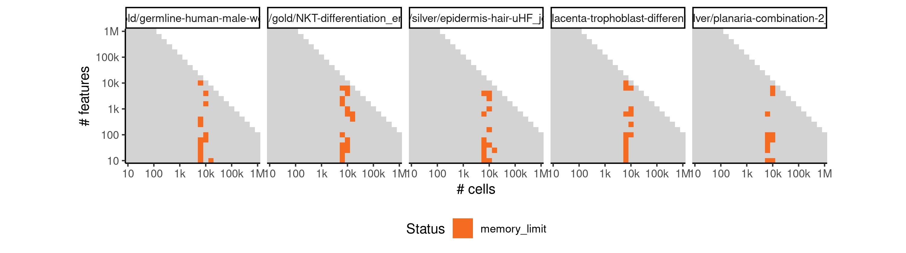
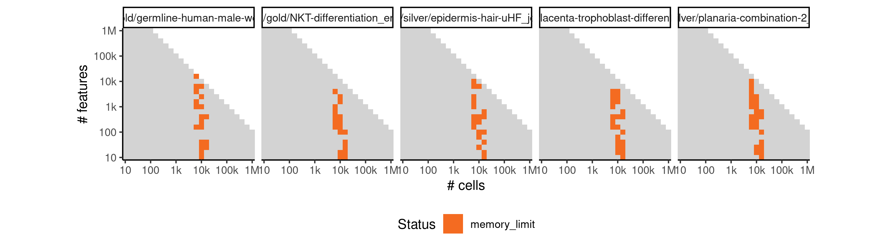
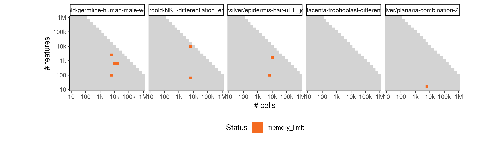

# pseudogp


## ERROR STATUS TIME_LIMIT

### ERROR CLUSTER TIME_LIMIT -- 1


 * Number of instances: 326
 * Dataset ids: scaling_0187, scaling_0194, scaling_0201, scaling_0208, scaling_0215, scaling_0230, scaling_0231, scaling_0236, scaling_0237, scaling_0242, scaling_0243, scaling_0248, scaling_0249, scaling_0254, scaling_0255, scaling_0284, scaling_0285, scaling_0286, scaling_0295, scaling_0296, scaling_0297, scaling_0306, scaling_0307, scaling_0308, scaling_0317, scaling_0318, scaling_0319, scaling_0328, scaling_0329, scaling_0330, scaling_0332, scaling_0334, scaling_0336, scaling_0338, scaling_0340, scaling_0348, scaling_0349, scaling_0350, scaling_0358, scaling_0359, scaling_0360, scaling_0368, scaling_0369, scaling_0370, scaling_0378, scaling_0379, scaling_0380, scaling_0388, scaling_0389, scaling_0390, scaling_0399, scaling_0400, scaling_0401, scaling_0402, scaling_0403, scaling_0411, scaling_0412, scaling_0413, scaling_0414, scaling_0415, scaling_0416, scaling_0425, scaling_0426, scaling_0427, scaling_0428, scaling_0429, scaling_0438, scaling_0439, scaling_0440, scaling_0441, scaling_0442, scaling_0451, scaling_0452, scaling_0453, scaling_0454, scaling_0455, scaling_0461, scaling_0462, scaling_0463, scaling_0464, scaling_0465, scaling_0471, scaling_0472, scaling_0473, scaling_0474, scaling_0475, scaling_0481, scaling_0482, scaling_0483, scaling_0484, scaling_0485, scaling_0491, scaling_0492, scaling_0493, scaling_0494, scaling_0495, scaling_0501, scaling_0502, scaling_0503, scaling_0504, scaling_0505, scaling_0509, scaling_0513, scaling_0517, scaling_0521, scaling_0525, scaling_0529, scaling_0530, scaling_0531, scaling_0535, scaling_0536, scaling_0537, scaling_0541, scaling_0542, scaling_0543, scaling_0547, scaling_0548, scaling_0549, scaling_0553, scaling_0554, scaling_0555, scaling_0561, scaling_0562, scaling_0563, scaling_0570, scaling_0571, scaling_0572, scaling_0579, scaling_0580, scaling_0581, scaling_0588, scaling_0589, scaling_0590, scaling_0597, scaling_0598, scaling_0599, scaling_0609, scaling_0610, scaling_0611, scaling_0612, scaling_0613, scaling_0614, scaling_0625, scaling_0626, scaling_0627, scaling_0628, scaling_0629, scaling_0630, scaling_0641, scaling_0642, scaling_0643, scaling_0644, scaling_0645, scaling_0646, scaling_0657, scaling_0658, scaling_0659, scaling_0660, scaling_0661, scaling_0662, scaling_0673, scaling_0674, scaling_0675, scaling_0676, scaling_0677, scaling_0678, scaling_0689, scaling_0690, scaling_0691, scaling_0692, scaling_0693, scaling_0694, scaling_0706, scaling_0707, scaling_0708, scaling_0709, scaling_0710, scaling_0711, scaling_0723, scaling_0724, scaling_0725, scaling_0726, scaling_0727, scaling_0728, scaling_0740, scaling_0741, scaling_0742, scaling_0743, scaling_0744, scaling_0745, scaling_0757, scaling_0758, scaling_0759, scaling_0760, scaling_0761, scaling_0762, scaling_0774, scaling_0775, scaling_0776, scaling_0777, scaling_0778, scaling_0779, scaling_0791, scaling_0792, scaling_0793, scaling_0794, scaling_0795, scaling_0796, scaling_0797, scaling_0810, scaling_0811, scaling_0812, scaling_0813, scaling_0814, scaling_0815, scaling_0828, scaling_0829, scaling_0830, scaling_0831, scaling_0832, scaling_0833, scaling_0846, scaling_0847, scaling_0848, scaling_0849, scaling_0850, scaling_0851, scaling_0860, scaling_0861, scaling_0862, scaling_0863, scaling_0871, scaling_0872, scaling_0873, scaling_0874, scaling_0882, scaling_0883, scaling_0884, scaling_0885, scaling_0893, scaling_0894, scaling_0895, scaling_0896, scaling_0904, scaling_0905, scaling_0906, scaling_0907, scaling_0915, scaling_0916, scaling_0922, scaling_0923, scaling_0924, scaling_0931, scaling_0932, scaling_0939, scaling_0940, scaling_0947, scaling_0948, scaling_0953, scaling_0954, scaling_0959, scaling_0960, scaling_0965, scaling_0966, scaling_0971, scaling_0972, scaling_0977, scaling_0978, scaling_0987, scaling_0988, scaling_0989, scaling_0990, scaling_1000, scaling_1001, scaling_1002, scaling_1003, scaling_1004, scaling_1015, scaling_1016, scaling_1017, scaling_1018, scaling_1029, scaling_1030, scaling_1031, scaling_1032, scaling_1043, scaling_1044, scaling_1045, scaling_1046, scaling_1058, scaling_1059, scaling_1060, scaling_1061, scaling_1062, scaling_1063, scaling_1066, scaling_1076, scaling_1077, scaling_1078, scaling_1079, scaling_1080, scaling_1081, scaling_1082, scaling_1085, scaling_1096, scaling_1097, scaling_1098, scaling_1099, scaling_1100, scaling_1101, scaling_1104, scaling_1114, scaling_1115, scaling_1116, scaling_1117, scaling_1118, scaling_1119, scaling_1120, scaling_1123, scaling_1134, scaling_1135, scaling_1136, scaling_1137, scaling_1138, scaling_1139, scaling_1142

Last 10 lines of scaling_0187:
```
File: /home/rcannood/Workspace/dynverse/dynbenchmark//derived/05-scaling/suite/pseudogp/Cat1/r2gridengine/20181008_142138_pseudogp_Cat1_zuYabFgW03/log/log.187.e.txt
```

## ERROR STATUS MEMORY_LIMIT

### ERROR CLUSTER MEMORY_LIMIT -- 1


 * Number of instances: 39
 * Dataset ids: scaling_0564, scaling_0573, scaling_0582, scaling_0591, scaling_0600, scaling_0615, scaling_0631, scaling_0647, scaling_0648, scaling_0663, scaling_0680, scaling_0695, scaling_0697, scaling_0712, scaling_0729, scaling_0746, scaling_0763, scaling_0780, scaling_0798, scaling_0799, scaling_0816, scaling_0834, scaling_0852, scaling_0875, scaling_0886, scaling_0887, scaling_0917, scaling_0933, scaling_0941, scaling_0949, scaling_0955, scaling_0961, scaling_0979, scaling_1005, scaling_1033, scaling_1047, scaling_1065, scaling_1122, scaling_1141

Last 10 lines of scaling_0564:
```
 [origin: bad_alloc]
[1] "Error in sampler$call_sampler(args_list[[i]]) : "                         
[2] "  Exception: std::bad_alloc  (in 'model50d25edc5734_pseudogp' at line 42)"
[3] " [origin: bad_alloc]"                                                     
error occurred during calling the sampler; sampling not done
Stan model 'pseudogp' does not contain samples.
Error in attr(data, "mcpar") <- c(start, end, thin) : 
  attempt to set an attribute on NULL
Calls: <Anonymous>
Execution halted
```

### ERROR CLUSTER MEMORY_LIMIT -- 2


 * Number of instances: 38
 * Dataset ids: scaling_0616, scaling_0632, scaling_0696, scaling_0713, scaling_0714, scaling_0731, scaling_0747, scaling_0748, scaling_0764, scaling_0765, scaling_0781, scaling_0800, scaling_0817, scaling_0818, scaling_0835, scaling_0836, scaling_0853, scaling_0854, scaling_0864, scaling_0865, scaling_0876, scaling_0897, scaling_0898, scaling_0909, scaling_0967, scaling_0973, scaling_0992, scaling_1006, scaling_1020, scaling_1034, scaling_1048, scaling_1064, scaling_1083, scaling_1084, scaling_1102, scaling_1103, scaling_1121, scaling_1140

Last 10 lines of scaling_0616:
```
 [origin: bad_alloc]
[1] "Error in sampler$call_sampler(args_list[[i]]) : "                         
[2] "  Exception: std::bad_alloc  (in 'model46107a64e81a_pseudogp' at line 42)"
[3] " [origin: bad_alloc]"                                                     
error occurred during calling the sampler; sampling not done
Error in attr(data, "mcpar") <- c(start, end, thin) : 
  attempt to set an attribute on NULL
Calls: <Anonymous>
Execution halted
Stan model 'pseudogp' does not contain samples.
```

### ERROR CLUSTER MEMORY_LIMIT -- 3


 * Number of instances: 4
 * Dataset ids: scaling_0664, scaling_0730, scaling_0782, scaling_0908

Last 10 lines of scaling_0664:
```
 [origin: bad_alloc]
[1]error occurred during calling the sampler; sampling not done
Error in attr(data, "mcpar") <- c(start, end, thin) : 
  attempt to set an attribute on NULL
Calls: <Anonymous>
Execution halted
 "Error in sampler$call_sampler(args_list[[i]]) : "                         
[2] "  Exception: std::bad_alloc  (in 'model313950fd571c_pseudogp' at line 42)"
[3] " [origin: bad_alloc]"                                                     
Stan model 'pseudogp' does not contain samples.
```

### ERROR CLUSTER MEMORY_LIMIT -- 4


 * Number of instances: 4
 * Dataset ids: scaling_0679, scaling_0925, scaling_0991, scaling_1019

Last 10 lines of scaling_0679:
```
 [origin: bad_alloc]
[1] "Error in sampler$call_sampler(args_list[[i]]) : "                         
[2] "  Exception: std::bad_alloc  (in 'model32b670d99ff3_pseudogp' at line 42)"
[3] " [origin: bad_alloc]"                                                     
error occurred during calling the sampler; sampling not done
Stan model 'Error in attr(data, "mcpar") <- c(start, end, thin) : 
  attempt to set an attribute on NULL
Calls: <Anonymous>
Execution halted
pseudogp' does not contain samples.
```

### ERROR CLUSTER MEMORY_LIMIT -- 5


 * Number of instances: 45
 * Dataset ids: scaling_0783, scaling_0801, scaling_0819, scaling_0837, scaling_0855, scaling_0866, scaling_0877, scaling_0888, scaling_0899, scaling_0910, scaling_0918, scaling_0926, scaling_0934, scaling_0942, scaling_0950, scaling_0956, scaling_0962, scaling_0968, scaling_0974, scaling_0980, scaling_0993, scaling_0994, scaling_1007, scaling_1008, scaling_1021, scaling_1022, scaling_1035, scaling_1036, scaling_1049, scaling_1050, scaling_1067, scaling_1068, scaling_1069, scaling_1086, scaling_1087, scaling_1088, scaling_1105, scaling_1106, scaling_1107, scaling_1124, scaling_1125, scaling_1126, scaling_1143, scaling_1144, scaling_1145

Last 10 lines of scaling_0783:
```
To avoid recompilation of unchanged Stan programs, we recommend calling
rstan_options(auto_write = TRUE)
Attaching package: ‘coda’
The following object is masked from ‘package:rstan’:
    traceplot
Loading required package: Matrix
Loading required package: ape
Loading required package: dynutils
Error: cannot allocate vector of size 4.7 Gb
Execution halted
```


