# raceid_stemid


## ERROR STATUS METHOD_ERROR

### ERROR CLUSTER METHOD_ERROR -- 1
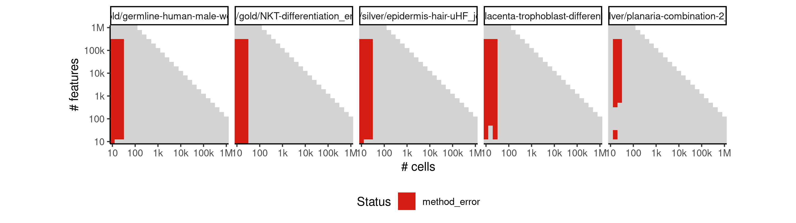

 * Number of instances: 297
 * Dataset ids: scaling_0001, scaling_0002, scaling_0003, scaling_0006, scaling_0008, scaling_0009, scaling_0010, scaling_0012, scaling_0016, scaling_0017, scaling_0019, scaling_0020, scaling_0021, scaling_0022, scaling_0023, scaling_0025, scaling_0029, scaling_0031, scaling_0032, scaling_0033, scaling_0034, scaling_0035, scaling_0036, scaling_0038, scaling_0039, scaling_0041, scaling_0043, scaling_0045, scaling_0047, scaling_0051, scaling_0052, scaling_0053, scaling_0056, scaling_0057, scaling_0058, scaling_0061, scaling_0062, scaling_0063, scaling_0066, scaling_0068, scaling_0076, scaling_0077, scaling_0078, scaling_0082, scaling_0083, scaling_0084, scaling_0088, scaling_0089, scaling_0090, scaling_0094, scaling_0095, scaling_0096, scaling_0106, scaling_0107, scaling_0108, scaling_0113, scaling_0114, scaling_0115, scaling_0120, scaling_0121, scaling_0122, scaling_0127, scaling_0128, scaling_0129, scaling_0141, scaling_0143, scaling_0145, scaling_0147, scaling_0151, scaling_0152, scaling_0157, scaling_0158, scaling_0163, scaling_0164, scaling_0169, scaling_0170, scaling_0181, scaling_0182, scaling_0188, scaling_0189, scaling_0195, scaling_0196, scaling_0202, scaling_0203, scaling_0216, scaling_0218, scaling_0220, scaling_0222, scaling_0226, scaling_0227, scaling_0232, scaling_0233, scaling_0238, scaling_0239, scaling_0244, scaling_0245, scaling_0251, scaling_0256, scaling_0260, scaling_0264, scaling_0268, scaling_0276, scaling_0277, scaling_0278, scaling_0287, scaling_0288, scaling_0289, scaling_0298, scaling_0299, scaling_0300, scaling_0309, scaling_0310, scaling_0311, scaling_0321, scaling_0331, scaling_0333, scaling_0335, scaling_0337, scaling_0339, scaling_0341, scaling_0342, scaling_0351, scaling_0352, scaling_0361, scaling_0362, scaling_0371, scaling_0372, scaling_0382, scaling_0391, scaling_0392, scaling_0393, scaling_0404, scaling_0405, scaling_0406, scaling_0417, scaling_0418, scaling_0419, scaling_0430, scaling_0431, scaling_0432, scaling_0444, scaling_0445, scaling_0456, scaling_0457, scaling_0466, scaling_0467, scaling_0476, scaling_0477, scaling_0486, scaling_0487, scaling_0497, scaling_0506, scaling_0510, scaling_0514, scaling_0518, scaling_0522, scaling_0526, scaling_0532, scaling_0538, scaling_0544, scaling_0550, scaling_0556, scaling_0557, scaling_0565, scaling_0566, scaling_0574, scaling_0575, scaling_0583, scaling_0584, scaling_0593, scaling_0601, scaling_0602, scaling_0603, scaling_0617, scaling_0618, scaling_0619, scaling_0633, scaling_0634, scaling_0635, scaling_0649, scaling_0650, scaling_0651, scaling_0666, scaling_0667, scaling_0681, scaling_0682, scaling_0683, scaling_0698, scaling_0699, scaling_0700, scaling_0715, scaling_0716, scaling_0717, scaling_0732, scaling_0733, scaling_0734, scaling_0750, scaling_0751, scaling_0766, scaling_0767, scaling_0768, scaling_0784, scaling_0785, scaling_0786, scaling_0802, scaling_0803, scaling_0804, scaling_0820, scaling_0821, scaling_0822, scaling_0839, scaling_0840, scaling_0856, scaling_0857, scaling_0867, scaling_0868, scaling_0878, scaling_0879, scaling_0889, scaling_0890, scaling_0901, scaling_0911, scaling_0919, scaling_0927, scaling_0935, scaling_0943, scaling_0951, scaling_0957, scaling_0963, scaling_0969, scaling_0975, scaling_0981, scaling_0982, scaling_0995, scaling_0996, scaling_1009, scaling_1010, scaling_1023, scaling_1024, scaling_1038, scaling_1051, scaling_1052, scaling_1070, scaling_1071, scaling_1089, scaling_1090, scaling_1108, scaling_1109, scaling_1128, scaling_1146, scaling_1148, scaling_1150, scaling_1152, scaling_1154, scaling_1166, scaling_1167, scaling_1182, scaling_1183, scaling_1198, scaling_1199, scaling_1214, scaling_1215, scaling_1231, scaling_1246, scaling_1250, scaling_1254, scaling_1258, scaling_1262, scaling_1276, scaling_1277, scaling_1278, scaling_1297, scaling_1298, scaling_1299, scaling_1318, scaling_1319, scaling_1320, scaling_1339, scaling_1340, scaling_1341, scaling_1361, scaling_1362, scaling_1381, scaling_1393, scaling_1405, scaling_1417, scaling_1429, scaling_1442, scaling_1454, scaling_1466, scaling_1478, scaling_1490, scaling_1533, scaling_1552, scaling_1571, scaling_1590, scaling_1609

Last 10 lines of scaling_0001:
```
Attaching package: ‘purrr’
The following object is masked from ‘package:jsonlite’:
    flatten
Warning messages:
1: In rgl.init(initValue, onlyNULL) : RGL: unable to open X11 display
2: 'rgl_init' failed, running with rgl.useNULL = TRUE 
Error in cluster::pam(as.dist(sdata), k, diss = TRUE) : 
  Number of clusters 'k' must be in {1,2, .., n-1}; hence n >= 2
Calls: %>% ... <Anonymous> -> clustermethod -> pamk -> <Anonymous>
Execution halted
```

### ERROR CLUSTER METHOD_ERROR -- 2
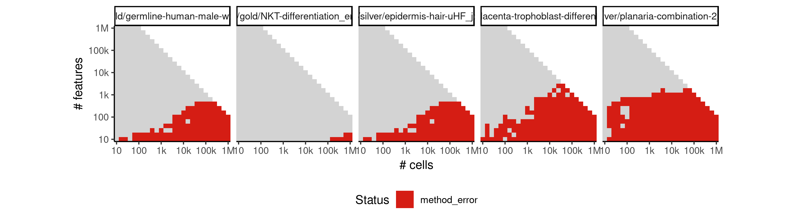

 * Number of instances: 528
 * Dataset ids: scaling_0004, scaling_0007, scaling_0011, scaling_0013, scaling_0015, scaling_0018, scaling_0024, scaling_0026, scaling_0027, scaling_0030, scaling_0037, scaling_0040, scaling_0048, scaling_0050, scaling_0055, scaling_0065, scaling_0067, scaling_0069, scaling_0070, scaling_0072, scaling_0073, scaling_0074, scaling_0075, scaling_0080, scaling_0081, scaling_0092, scaling_0093, scaling_0097, scaling_0098, scaling_0101, scaling_0102, scaling_0103, scaling_0104, scaling_0105, scaling_0111, scaling_0112, scaling_0125, scaling_0126, scaling_0131, scaling_0132, scaling_0133, scaling_0135, scaling_0136, scaling_0137, scaling_0138, scaling_0139, scaling_0140, scaling_0148, scaling_0149, scaling_0150, scaling_0155, scaling_0156, scaling_0167, scaling_0168, scaling_0172, scaling_0173, scaling_0174, scaling_0176, scaling_0177, scaling_0179, scaling_0180, scaling_0187, scaling_0201, scaling_0206, scaling_0208, scaling_0210, scaling_0211, scaling_0212, scaling_0213, scaling_0214, scaling_0215, scaling_0217, scaling_0221, scaling_0224, scaling_0225, scaling_0230, scaling_0231, scaling_0242, scaling_0243, scaling_0247, scaling_0248, scaling_0249, scaling_0252, scaling_0253, scaling_0254, scaling_0255, scaling_0270, scaling_0271, scaling_0272, scaling_0273, scaling_0274, scaling_0275, scaling_0284, scaling_0285, scaling_0286, scaling_0306, scaling_0307, scaling_0308, scaling_0314, scaling_0315, scaling_0316, scaling_0317, scaling_0318, scaling_0319, scaling_0322, scaling_0323, scaling_0326, scaling_0327, scaling_0328, scaling_0329, scaling_0330, scaling_0338, scaling_0340, scaling_0349, scaling_0350, scaling_0369, scaling_0370, scaling_0377, scaling_0378, scaling_0379, scaling_0380, scaling_0383, scaling_0386, scaling_0387, scaling_0388, scaling_0389, scaling_0390, scaling_0401, scaling_0402, scaling_0403, scaling_0427, scaling_0428, scaling_0429, scaling_0439, scaling_0440, scaling_0441, scaling_0442, scaling_0447, scaling_0449, scaling_0450, scaling_0451, scaling_0452, scaling_0453, scaling_0454, scaling_0455, scaling_0465, scaling_0485, scaling_0492, scaling_0493, scaling_0494, scaling_0495, scaling_0499, scaling_0500, scaling_0501, scaling_0502, scaling_0503, scaling_0504, scaling_0505, scaling_0509, scaling_0517, scaling_0521, scaling_0523, scaling_0524, scaling_0525, scaling_0531, scaling_0543, scaling_0548, scaling_0549, scaling_0552, scaling_0553, scaling_0554, scaling_0555, scaling_0562, scaling_0564, scaling_0580, scaling_0582, scaling_0589, scaling_0590, scaling_0591, scaling_0595, scaling_0596, scaling_0597, scaling_0598, scaling_0599, scaling_0600, scaling_0613, scaling_0614, scaling_0615, scaling_0616, scaling_0645, scaling_0646, scaling_0647, scaling_0648, scaling_0660, scaling_0661, scaling_0662, scaling_0663, scaling_0664, scaling_0671, scaling_0672, scaling_0673, scaling_0674, scaling_0675, scaling_0676, scaling_0677, scaling_0678, scaling_0679, scaling_0680, scaling_0694, scaling_0695, scaling_0696, scaling_0697, scaling_0728, scaling_0729, scaling_0730, scaling_0731, scaling_0742, scaling_0744, scaling_0745, scaling_0746, scaling_0747, scaling_0748, scaling_0756, scaling_0757, scaling_0758, scaling_0759, scaling_0760, scaling_0761, scaling_0762, scaling_0763, scaling_0764, scaling_0765, scaling_0779, scaling_0780, scaling_0781, scaling_0782, scaling_0783, scaling_0815, scaling_0816, scaling_0817, scaling_0818, scaling_0819, scaling_0830, scaling_0831, scaling_0832, scaling_0833, scaling_0834, scaling_0835, scaling_0836, scaling_0837, scaling_0846, scaling_0847, scaling_0848, scaling_0849, scaling_0850, scaling_0851, scaling_0852, scaling_0853, scaling_0854, scaling_0855, scaling_0863, scaling_0864, scaling_0865, scaling_0866, scaling_0885, scaling_0886, scaling_0887, scaling_0888, scaling_0896, scaling_0897, scaling_0898, scaling_0899, scaling_0905, scaling_0906, scaling_0907, scaling_0908, scaling_0909, scaling_0910, scaling_0917, scaling_0918, scaling_0933, scaling_0934, scaling_0940, scaling_0941, scaling_0942, scaling_0947, scaling_0948, scaling_0949, scaling_0950, scaling_0955, scaling_0956, scaling_0967, scaling_0968, scaling_0973, scaling_0974, scaling_0978, scaling_0979, scaling_0980, scaling_0991, scaling_0992, scaling_0993, scaling_0994, scaling_1019, scaling_1020, scaling_1021, scaling_1022, scaling_1031, scaling_1032, scaling_1033, scaling_1034, scaling_1035, scaling_1036, scaling_1044, scaling_1045, scaling_1046, scaling_1047, scaling_1048, scaling_1049, scaling_1050, scaling_1065, scaling_1067, scaling_1068, scaling_1069, scaling_1103, scaling_1105, scaling_1106, scaling_1107, scaling_1119, scaling_1120, scaling_1121, scaling_1122, scaling_1123, scaling_1124, scaling_1125, scaling_1126, scaling_1137, scaling_1138, scaling_1139, scaling_1140, scaling_1141, scaling_1142, scaling_1143, scaling_1144, scaling_1145, scaling_1147, scaling_1151, scaling_1153, scaling_1155, scaling_1157, scaling_1161, scaling_1163, scaling_1165, scaling_1177, scaling_1178, scaling_1179, scaling_1180, scaling_1181, scaling_1197, scaling_1209, scaling_1210, scaling_1211, scaling_1212, scaling_1213, scaling_1223, scaling_1224, scaling_1225, scaling_1226, scaling_1227, scaling_1228, scaling_1229, scaling_1238, scaling_1239, scaling_1240, scaling_1241, scaling_1242, scaling_1243, scaling_1244, scaling_1245, scaling_1249, scaling_1257, scaling_1260, scaling_1261, scaling_1264, scaling_1265, scaling_1267, scaling_1271, scaling_1273, scaling_1275, scaling_1291, scaling_1292, scaling_1293, scaling_1294, scaling_1295, scaling_1296, scaling_1317, scaling_1333, scaling_1334, scaling_1335, scaling_1336, scaling_1337, scaling_1338, scaling_1351, scaling_1352, scaling_1353, scaling_1354, scaling_1355, scaling_1356, scaling_1357, scaling_1358, scaling_1359, scaling_1371, scaling_1372, scaling_1373, scaling_1374, scaling_1375, scaling_1376, scaling_1377, scaling_1378, scaling_1379, scaling_1380, scaling_1390, scaling_1391, scaling_1392, scaling_1414, scaling_1415, scaling_1416, scaling_1424, scaling_1425, scaling_1426, scaling_1427, scaling_1428, scaling_1435, scaling_1436, scaling_1437, scaling_1438, scaling_1439, scaling_1440, scaling_1448, scaling_1449, scaling_1450, scaling_1451, scaling_1452, scaling_1464, scaling_1472, scaling_1473, scaling_1474, scaling_1475, scaling_1476, scaling_1484, scaling_1485, scaling_1486, scaling_1487, scaling_1488, scaling_1496, scaling_1497, scaling_1498, scaling_1499, scaling_1500, scaling_1505, scaling_1506, scaling_1517, scaling_1518, scaling_1522, scaling_1523, scaling_1524, scaling_1528, scaling_1529, scaling_1530, scaling_1544, scaling_1545, scaling_1546, scaling_1547, scaling_1548, scaling_1549, scaling_1568, scaling_1582, scaling_1583, scaling_1584, scaling_1585, scaling_1586, scaling_1587, scaling_1600, scaling_1601, scaling_1602, scaling_1603, scaling_1604, scaling_1605, scaling_1606, scaling_1617, scaling_1618, scaling_1619, scaling_1620, scaling_1621, scaling_1622, scaling_1623, scaling_1624, scaling_1625, scaling_1642, scaling_1643, scaling_1644, scaling_1645, scaling_1646, scaling_1647, scaling_1669, scaling_1686, scaling_1687, scaling_1688, scaling_1689, scaling_1690, scaling_1691, scaling_1705, scaling_1706, scaling_1707, scaling_1708, scaling_1709, scaling_1710, scaling_1711, scaling_1712, scaling_1713, scaling_1727, scaling_1728, scaling_1729, scaling_1730, scaling_1731, scaling_1732, scaling_1733, scaling_1734, scaling_1735

Last 10 lines of scaling_0004:
```
Attaching package: ‘purrr’
The following object is masked from ‘package:jsonlite’:
    flatten
Warning messages:
1: In rgl.init(initValue, onlyNULL) : RGL: unable to open X11 display
2: 'rgl_init' failed, running with rgl.useNULL = TRUE 
Error in if (coef(fit)[3] >= 0 | mm >= mthr) { : 
  missing value where TRUE/FALSE needed
Calls: %>% ... withVisible -> <Anonymous> -> filterdata -> fitbackground
Execution halted
```

### ERROR CLUSTER METHOD_ERROR -- 3
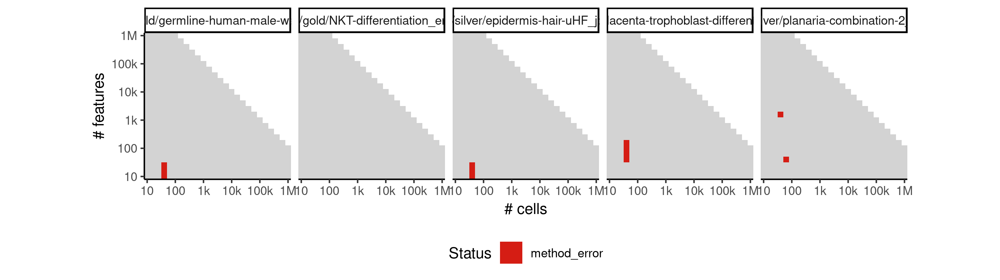

 * Number of instances: 12
 * Dataset ids: scaling_0042, scaling_0046, scaling_0054, scaling_0064, scaling_0079, scaling_0091, scaling_0130, scaling_0171, scaling_0178, scaling_0204, scaling_0269, scaling_0594

Last 10 lines of scaling_0042:
```
subset 45 
subset 46 
subset 47 
subset 48 
subset 49 
subset 50 
find outliers in cluster 1 
find outliers in cluster 2 
find outliers in cluster 3 
find outliers in cluster 4 
Error in apply(fdata, 1, function(x) { : 
  dim(X) must have a positive length
Calls: %>% ... withVisible -> <Anonymous> -> findoutliers -> t -> apply
Execution halted
```

### ERROR CLUSTER METHOD_ERROR -- 4
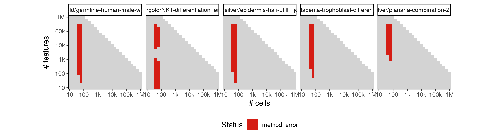

 * Number of instances: 169
 * Dataset ids: scaling_0044, scaling_0059, scaling_0060, scaling_0085, scaling_0086, scaling_0110, scaling_0116, scaling_0117, scaling_0124, scaling_0154, scaling_0159, scaling_0160, scaling_0166, scaling_0183, scaling_0184, scaling_0190, scaling_0191, scaling_0198, scaling_0205, scaling_0228, scaling_0234, scaling_0240, scaling_0246, scaling_0257, scaling_0261, scaling_0265, scaling_0279, scaling_0280, scaling_0290, scaling_0291, scaling_0301, scaling_0302, scaling_0312, scaling_0313, scaling_0343, scaling_0344, scaling_0353, scaling_0354, scaling_0363, scaling_0364, scaling_0373, scaling_0374, scaling_0394, scaling_0395, scaling_0407, scaling_0408, scaling_0420, scaling_0421, scaling_0433, scaling_0434, scaling_0458, scaling_0459, scaling_0468, scaling_0469, scaling_0478, scaling_0479, scaling_0488, scaling_0489, scaling_0527, scaling_0539, scaling_0545, scaling_0551, scaling_0558, scaling_0576, scaling_0585, scaling_0604, scaling_0605, scaling_0636, scaling_0637, scaling_0652, scaling_0653, scaling_0668, scaling_0669, scaling_0684, scaling_0685, scaling_0718, scaling_0719, scaling_0735, scaling_0736, scaling_0752, scaling_0753, scaling_0769, scaling_0770, scaling_0787, scaling_0805, scaling_0806, scaling_0823, scaling_0824, scaling_0841, scaling_0842, scaling_0858, scaling_0869, scaling_0880, scaling_0891, scaling_0902, scaling_0912, scaling_0928, scaling_0936, scaling_0944, scaling_0952, scaling_0958, scaling_0964, scaling_0970, scaling_0976, scaling_0983, scaling_0997, scaling_1011, scaling_1025, scaling_1039, scaling_1053, scaling_1054, scaling_1072, scaling_1073, scaling_1091, scaling_1092, scaling_1110, scaling_1111, scaling_1129, scaling_1130, scaling_1156, scaling_1158, scaling_1160, scaling_1162, scaling_1164, scaling_1168, scaling_1184, scaling_1200, scaling_1216, scaling_1232, scaling_1266, scaling_1268, scaling_1270, scaling_1272, scaling_1274, scaling_1279, scaling_1300, scaling_1321, scaling_1342, scaling_1363, scaling_1382, scaling_1394, scaling_1406, scaling_1418, scaling_1430, scaling_1443, scaling_1455, scaling_1467, scaling_1479, scaling_1491, scaling_1501, scaling_1507, scaling_1513, scaling_1519, scaling_1525, scaling_1534, scaling_1553, scaling_1572, scaling_1591, scaling_1610, scaling_1628, scaling_1629, scaling_1650, scaling_1651, scaling_1672, scaling_1673, scaling_1694, scaling_1695, scaling_1716, scaling_1717

Last 10 lines of scaling_0044:
```
subset 47 
subset 48 
subset 49 
subset 50 
find outliers in cluster 1 
find outliers in cluster 2 
find outliers in cluster 3 
find outliers in cluster 4 
find outliers in cluster 5 
find outliers in cluster 6 
find outliers in cluster 7 
find outliers in cluster 8 
find outliers in cluster 9 
find outliers in cluster 10 
find outliers in cluster 11 
find outliers in cluster 12 
find outliers in cluster 13 
find outliers in cluster 14 
find outliers in cluster 15 
find outliers in cluster 16 
find outliers in cluster 17 
find outliers in cluster 18 
find outliers in cluster 19 
find outliers in cluster 20 
find outliers in cluster 21 
find outliers in cluster 22 
find outliers in cluster 23 
find outliers in cluster 24 
find outliers in cluster 25 
find outliers in cluster 26 
find outliers in cluster 27 
find outliers in cluster 28 
find outliers in cluster 29 
find outliers in cluster 30 
determine final clustering partition 1 
determine final clustering partition 2 
determine final clustering partition 3 
determine final clustering partition 4 
determine final clustering partition 5 
determine final clustering partition 6 
determine final clustering partition 7 
determine final clustering partition 8 
determine final clustering partition 9 
determine final clustering partition 10 
determine final clustering partition 11 
determine final clustering partition 12 
determine final clustering partition 13 
determine final clustering partition 14 
determine final clustering partition 15 
determine final clustering partition 16 
determine final clustering partition 17 
determine final clustering partition 18 
determine final clustering partition 19 
determine final clustering partition 20 
determine final clustering partition 21 
determine final clustering partition 22 
determine final clustering partition 23 
determine final clustering partition 24 
determine final clustering partition 25 
determine final clustering partition 26 
determine final clustering partition 27 
determine final clustering partition 28 
determine final clustering partition 29 
determine final clustering partition 30 
Error in Rtsne.default(X, ..., is_distance = is_distance) : 
  Perplexity is too large.
Calls: %>% ... comptsne -> Rtsne -> Rtsne.dist -> Rtsne -> Rtsne.default
Execution halted
```

### ERROR CLUSTER METHOD_ERROR -- 5
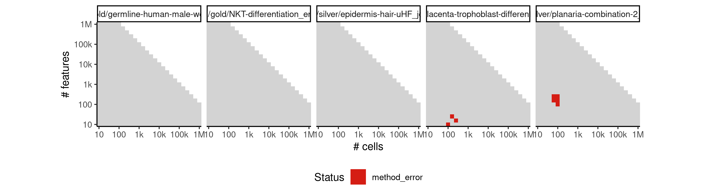

 * Number of instances: 8
 * Dataset ids: scaling_0099, scaling_0207, scaling_0223, scaling_0324, scaling_0325, scaling_0384, scaling_0385, scaling_0448

Last 10 lines of scaling_0099:
```
subset 45 
subset 46 
subset 47 
subset 48 
subset 49 
subset 50 
find outliers in cluster 1 
find outliers in cluster 2 
Error in apply(fdata, 1, function(x) { : 
  dim(X) must have a positive length
Calls: %>% ... withVisible -> <Anonymous> -> findoutliers -> t -> apply
Execution halted
```

### ERROR CLUSTER METHOD_ERROR -- 6
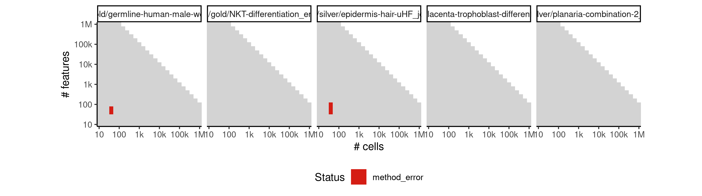

 * Number of instances: 5
 * Dataset ids: scaling_0109, scaling_0123, scaling_0153, scaling_0165, scaling_0197

Last 10 lines of scaling_0109:
```
subset 45 
subset 46 
subset 47 
subset 48 
subset 49 
subset 50 
find outliers in cluster 1 
find outliers in cluster 2 
find outliers in cluster 3 
find outliers in cluster 4 
find outliers in cluster 5 
find outliers in cluster 6 
Error in apply(fdata, 1, function(x) { : 
  dim(X) must have a positive length
Calls: %>% ... withVisible -> <Anonymous> -> findoutliers -> t -> apply
Execution halted
```

### ERROR CLUSTER METHOD_ERROR -- 7
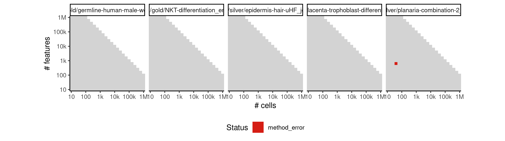

 * Number of instances: 1
 * Dataset ids: scaling_0446

Last 10 lines of scaling_0446:
```
subset 45 
subset 46 
subset 47 
subset 48 
subset 49 
subset 50 
find outliers in cluster 1 
find outliers in cluster 2 
find outliers in cluster 3 
Error in apply(fdata, 1, function(x) { : 
  dim(X) must have a positive length
Calls: %>% ... withVisible -> <Anonymous> -> findoutliers -> t -> apply
Execution halted
```

### ERROR CLUSTER METHOD_ERROR -- 8
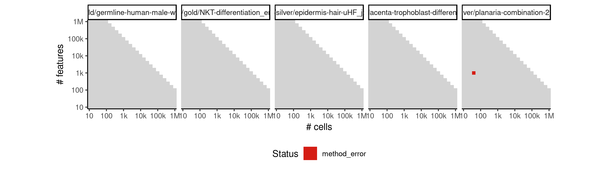

 * Number of instances: 1
 * Dataset ids: scaling_0498

Last 10 lines of scaling_0498:
```
subset 45 
subset 46 
subset 47 
subset 48 
subset 49 
subset 50 
find outliers in cluster 1 
find outliers in cluster 2 
find outliers in cluster 3 
find outliers in cluster 4 
find outliers in cluster 5 
find outliers in cluster 6 
find outliers in cluster 7 
Error in apply(fdata, 1, function(x) { : 
  dim(X) must have a positive length
Calls: %>% ... withVisible -> <Anonymous> -> findoutliers -> t -> apply
Execution halted
```

### ERROR CLUSTER METHOD_ERROR -- 9
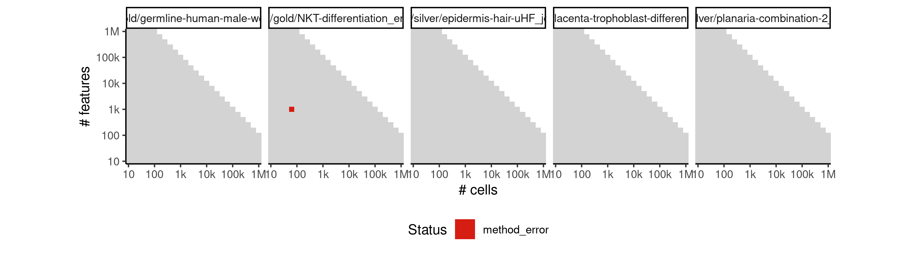

 * Number of instances: 1
 * Dataset ids: scaling_0533

Last 10 lines of scaling_0533:
```
subset 48 
subset 49 
subset 50 
find outliers in cluster 1 
find outliers in cluster 2 
find outliers in cluster 3 
find outliers in cluster 4 
find outliers in cluster 5 
find outliers in cluster 6 
find outliers in cluster 7 
find outliers in cluster 8 
find outliers in cluster 9 
find outliers in cluster 10 
find outliers in cluster 11 
find outliers in cluster 12 
find outliers in cluster 13 
find outliers in cluster 14 
find outliers in cluster 15 
find outliers in cluster 16 
find outliers in cluster 17 
find outliers in cluster 18 
find outliers in cluster 19 
find outliers in cluster 20 
find outliers in cluster 21 
find outliers in cluster 22 
find outliers in cluster 23 
find outliers in cluster 24 
find outliers in cluster 25 
find outliers in cluster 26 
find outliers in cluster 27 
find outliers in cluster 28 
find outliers in cluster 29 
find outliers in cluster 30 
merging outliers 1 
merging outliers 2 
determine final clustering partition 1 
determine final clustering partition 2 
determine final clustering partition 3 
determine final clustering partition 4 
determine final clustering partition 5 
determine final clustering partition 6 
determine final clustering partition 7 
determine final clustering partition 8 
determine final clustering partition 9 
determine final clustering partition 10 
determine final clustering partition 11 
determine final clustering partition 12 
determine final clustering partition 13 
determine final clustering partition 14 
determine final clustering partition 15 
determine final clustering partition 16 
determine final clustering partition 17 
determine final clustering partition 18 
determine final clustering partition 19 
determine final clustering partition 20 
determine final clustering partition 21 
determine final clustering partition 22 
determine final clustering partition 23 
determine final clustering partition 24 
determine final clustering partition 25 
determine final clustering partition 26 
determine final clustering partition 27 
determine final clustering partition 28 
determine final clustering partition 29 
determine final clustering partition 30 
determine final clustering partition 31 
determine final clustering partition 32 
Error in Rtsne.default(X, ..., is_distance = is_distance) : 
  Perplexity is too large.
Calls: %>% ... comptsne -> Rtsne -> Rtsne.dist -> Rtsne -> Rtsne.default
Execution halted
```

### ERROR CLUSTER METHOD_ERROR -- 10
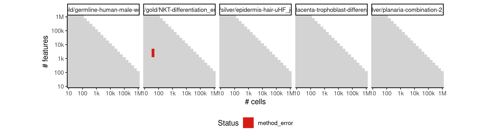

 * Number of instances: 3
 * Dataset ids: scaling_0567, scaling_0620, scaling_0701

Last 10 lines of scaling_0567:
```
subset 48 
subset 49 
subset 50 
find outliers in cluster 1 
find outliers in cluster 2 
find outliers in cluster 3 
find outliers in cluster 4 
find outliers in cluster 5 
find outliers in cluster 6 
find outliers in cluster 7 
find outliers in cluster 8 
find outliers in cluster 9 
find outliers in cluster 10 
find outliers in cluster 11 
find outliers in cluster 12 
find outliers in cluster 13 
find outliers in cluster 14 
find outliers in cluster 15 
find outliers in cluster 16 
find outliers in cluster 17 
find outliers in cluster 18 
find outliers in cluster 19 
find outliers in cluster 20 
find outliers in cluster 21 
find outliers in cluster 22 
find outliers in cluster 23 
find outliers in cluster 24 
find outliers in cluster 25 
find outliers in cluster 26 
find outliers in cluster 27 
find outliers in cluster 28 
find outliers in cluster 29 
find outliers in cluster 30 
merging outliers 1 
determine final clustering partition 1 
determine final clustering partition 2 
determine final clustering partition 3 
determine final clustering partition 4 
determine final clustering partition 5 
determine final clustering partition 6 
determine final clustering partition 7 
determine final clustering partition 8 
determine final clustering partition 9 
determine final clustering partition 10 
determine final clustering partition 11 
determine final clustering partition 12 
determine final clustering partition 13 
determine final clustering partition 14 
determine final clustering partition 15 
determine final clustering partition 16 
determine final clustering partition 17 
determine final clustering partition 18 
determine final clustering partition 19 
determine final clustering partition 20 
determine final clustering partition 21 
determine final clustering partition 22 
determine final clustering partition 23 
determine final clustering partition 24 
determine final clustering partition 25 
determine final clustering partition 26 
determine final clustering partition 27 
determine final clustering partition 28 
determine final clustering partition 29 
determine final clustering partition 30 
determine final clustering partition 31 
Error in Rtsne.default(X, ..., is_distance = is_distance) : 
  Perplexity is too large.
Calls: %>% ... comptsne -> Rtsne -> Rtsne.dist -> Rtsne -> Rtsne.default
Execution halted
```

### ERROR CLUSTER METHOD_ERROR -- 11
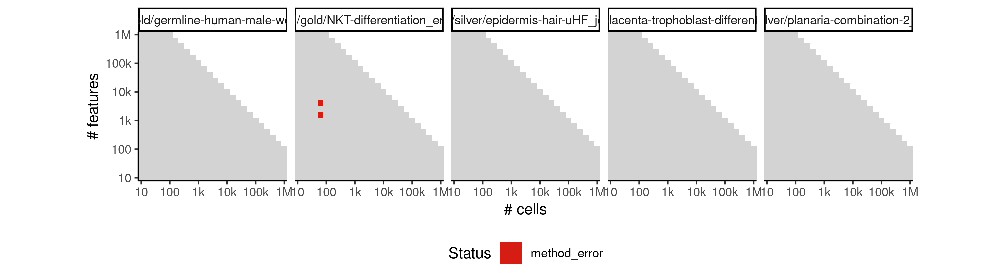

 * Number of instances: 2
 * Dataset ids: scaling_0621, scaling_0788

Last 10 lines of scaling_0621:
```
subset 48 
subset 49 
subset 50 
find outliers in cluster 1 
find outliers in cluster 2 
find outliers in cluster 3 
find outliers in cluster 4 
find outliers in cluster 5 
find outliers in cluster 6 
find outliers in cluster 7 
find outliers in cluster 8 
find outliers in cluster 9 
find outliers in cluster 10 
find outliers in cluster 11 
find outliers in cluster 12 
find outliers in cluster 13 
find outliers in cluster 14 
find outliers in cluster 15 
find outliers in cluster 16 
find outliers in cluster 17 
find outliers in cluster 18 
find outliers in cluster 19 
find outliers in cluster 20 
find outliers in cluster 21 
find outliers in cluster 22 
find outliers in cluster 23 
find outliers in cluster 24 
find outliers in cluster 25 
find outliers in cluster 26 
find outliers in cluster 27 
find outliers in cluster 28 
find outliers in cluster 29 
find outliers in cluster 30 
merging outliers 1 
merging outliers 2 
merging outliers 3 
merging outliers 4 
merging outliers 5 
determine final clustering partition 1 
determine final clustering partition 2 
determine final clustering partition 3 
determine final clustering partition 4 
determine final clustering partition 5 
determine final clustering partition 6 
determine final clustering partition 7 
determine final clustering partition 8 
determine final clustering partition 9 
determine final clustering partition 10 
determine final clustering partition 11 
determine final clustering partition 12 
determine final clustering partition 13 
determine final clustering partition 14 
determine final clustering partition 15 
determine final clustering partition 16 
determine final clustering partition 17 
determine final clustering partition 18 
determine final clustering partition 19 
determine final clustering partition 20 
determine final clustering partition 21 
determine final clustering partition 22 
determine final clustering partition 23 
determine final clustering partition 24 
determine final clustering partition 25 
determine final clustering partition 26 
determine final clustering partition 27 
determine final clustering partition 28 
determine final clustering partition 29 
determine final clustering partition 30 
determine final clustering partition 31 
determine final clustering partition 32 
determine final clustering partition 33 
determine final clustering partition 34 
determine final clustering partition 35 
Error in Rtsne.default(X, ..., is_distance = is_distance) : 
  Perplexity is too large.
Calls: %>% ... comptsne -> Rtsne -> Rtsne.dist -> Rtsne -> Rtsne.default
Execution halted
```

### ERROR CLUSTER METHOD_ERROR -- 12
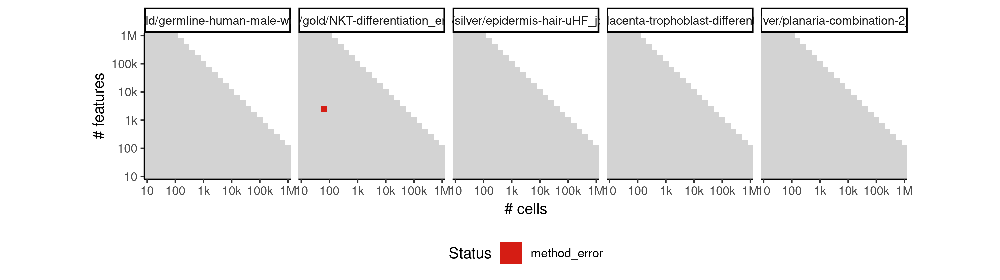

 * Number of instances: 1
 * Dataset ids: scaling_0702

Last 10 lines of scaling_0702:
```
subset 48 
subset 49 
subset 50 
find outliers in cluster 1 
find outliers in cluster 2 
find outliers in cluster 3 
find outliers in cluster 4 
find outliers in cluster 5 
find outliers in cluster 6 
find outliers in cluster 7 
find outliers in cluster 8 
find outliers in cluster 9 
find outliers in cluster 10 
find outliers in cluster 11 
find outliers in cluster 12 
find outliers in cluster 13 
find outliers in cluster 14 
find outliers in cluster 15 
find outliers in cluster 16 
find outliers in cluster 17 
find outliers in cluster 18 
find outliers in cluster 19 
find outliers in cluster 20 
find outliers in cluster 21 
find outliers in cluster 22 
find outliers in cluster 23 
find outliers in cluster 24 
find outliers in cluster 25 
find outliers in cluster 26 
find outliers in cluster 27 
find outliers in cluster 28 
find outliers in cluster 29 
find outliers in cluster 30 
merging outliers 1 
merging outliers 2 
merging outliers 3 
merging outliers 4 
merging outliers 5 
merging outliers 6 
determine final clustering partition 1 
determine final clustering partition 2 
determine final clustering partition 3 
determine final clustering partition 4 
determine final clustering partition 5 
determine final clustering partition 6 
determine final clustering partition 7 
determine final clustering partition 8 
determine final clustering partition 9 
determine final clustering partition 10 
determine final clustering partition 11 
determine final clustering partition 12 
determine final clustering partition 13 
determine final clustering partition 14 
determine final clustering partition 15 
determine final clustering partition 16 
determine final clustering partition 17 
determine final clustering partition 18 
determine final clustering partition 19 
determine final clustering partition 20 
determine final clustering partition 21 
determine final clustering partition 22 
determine final clustering partition 23 
determine final clustering partition 24 
determine final clustering partition 25 
determine final clustering partition 26 
determine final clustering partition 27 
determine final clustering partition 28 
determine final clustering partition 29 
determine final clustering partition 30 
determine final clustering partition 31 
determine final clustering partition 32 
determine final clustering partition 33 
determine final clustering partition 34 
determine final clustering partition 35 
determine final clustering partition 36 
Error in Rtsne.default(X, ..., is_distance = is_distance) : 
  Perplexity is too large.
Calls: %>% ... comptsne -> Rtsne -> Rtsne.dist -> Rtsne -> Rtsne.default
Execution halted
```

### ERROR CLUSTER METHOD_ERROR -- 13
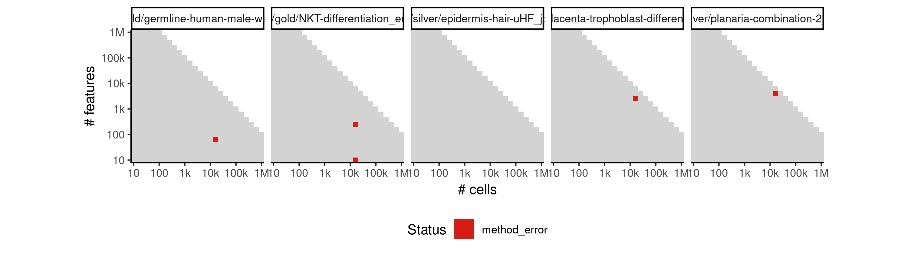

 * Number of instances: 3
 * Dataset ids: scaling_0714, scaling_1066, scaling_1460

Last 10 lines of scaling_0714:
```
 6: comptsne(., initial_cmd = params$initial_cmd, perplexity = params$perplexity)
 7: function_list[[k]](value)
 8: withVisible(function_list[[k]](value))
 9: freduce(value, `_function_list`)
10: `_fseq`(`_lhs`)
11: eval(quote(`_fseq`(`_lhs`)), env, env)
12: eval(quote(`_fseq`(`_lhs`)), env, env)
13: withVisible(eval(quote(`_fseq`(`_lhs`)), env, env))
14: sc %>% comptsne(initial_cmd = params$initial_cmd, perplexity = params$perplexity)
An irrecoverable exception occurred. R is aborting now ...
```

### ERROR CLUSTER METHOD_ERROR -- 14
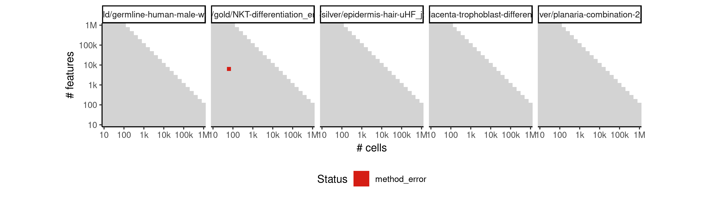

 * Number of instances: 1
 * Dataset ids: scaling_0920

Last 10 lines of scaling_0920:
```
subset 48 
subset 49 
subset 50 
find outliers in cluster 1 
find outliers in cluster 2 
find outliers in cluster 3 
find outliers in cluster 4 
find outliers in cluster 5 
find outliers in cluster 6 
find outliers in cluster 7 
find outliers in cluster 8 
find outliers in cluster 9 
find outliers in cluster 10 
find outliers in cluster 11 
find outliers in cluster 12 
find outliers in cluster 13 
find outliers in cluster 14 
find outliers in cluster 15 
find outliers in cluster 16 
find outliers in cluster 17 
find outliers in cluster 18 
find outliers in cluster 19 
find outliers in cluster 20 
find outliers in cluster 21 
find outliers in cluster 22 
find outliers in cluster 23 
find outliers in cluster 24 
find outliers in cluster 25 
find outliers in cluster 26 
find outliers in cluster 27 
find outliers in cluster 28 
find outliers in cluster 29 
find outliers in cluster 30 
merging outliers 1 
merging outliers 2 
merging outliers 3 
determine final clustering partition 1 
determine final clustering partition 2 
determine final clustering partition 3 
determine final clustering partition 4 
determine final clustering partition 5 
determine final clustering partition 6 
determine final clustering partition 7 
determine final clustering partition 8 
determine final clustering partition 9 
determine final clustering partition 10 
determine final clustering partition 11 
determine final clustering partition 12 
determine final clustering partition 13 
determine final clustering partition 14 
determine final clustering partition 15 
determine final clustering partition 16 
determine final clustering partition 17 
determine final clustering partition 18 
determine final clustering partition 19 
determine final clustering partition 20 
determine final clustering partition 21 
determine final clustering partition 22 
determine final clustering partition 23 
determine final clustering partition 24 
determine final clustering partition 25 
determine final clustering partition 26 
determine final clustering partition 27 
determine final clustering partition 28 
determine final clustering partition 29 
determine final clustering partition 30 
determine final clustering partition 31 
determine final clustering partition 32 
determine final clustering partition 33 
Error in Rtsne.default(X, ..., is_distance = is_distance) : 
  Perplexity is too large.
Calls: %>% ... comptsne -> Rtsne -> Rtsne.dist -> Rtsne -> Rtsne.default
Execution halted
```

## ERROR STATUS TIME_LIMIT

### ERROR CLUSTER TIME_LIMIT -- 1
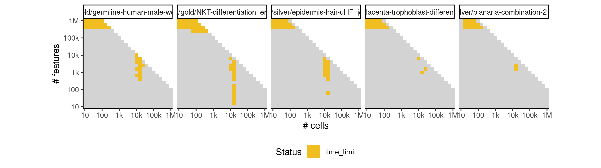

 * Number of instances: 38
 * Dataset ids: scaling_0800, scaling_0876, scaling_1006, scaling_1085, scaling_1104, scaling_1194, scaling_1312, scaling_1441, scaling_1453, scaling_1465, scaling_1477, scaling_1504, scaling_1516, scaling_1531, scaling_1532, scaling_1543, scaling_1550, scaling_1551, scaling_1562, scaling_1569, scaling_1570, scaling_1581, scaling_1588, scaling_1589, scaling_1608, scaling_1626, scaling_1627, scaling_1640, scaling_1648, scaling_1649, scaling_1662, scaling_1670, scaling_1671, scaling_1683, scaling_1684, scaling_1692, scaling_1693, scaling_1715

Last 10 lines of scaling_0800:
```
File: /home/rcannood/Workspace/dynverse/dynbenchmark//derived/05-scaling/suite/raceid_stemid/Cat2/r2gridengine/20181008_214957_raceid_stemid_Cat2_3kL0Uw0xX7/log/log.120.e.txt
```

## ERROR STATUS MEMORY_LIMIT

### ERROR CLUSTER MEMORY_LIMIT -- 1
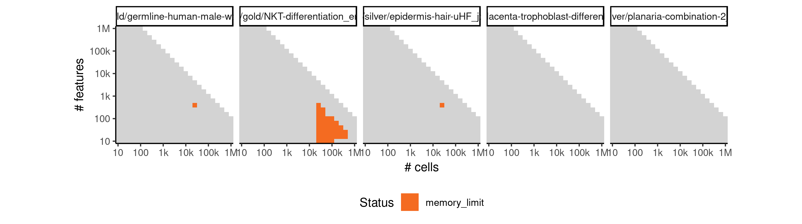

 * Number of instances: 40
 * Dataset ids: scaling_0801, scaling_0877, scaling_0926, scaling_0962, scaling_1007, scaling_1008, scaling_1086, scaling_1087, scaling_1088, scaling_1149, scaling_1159, scaling_1195, scaling_1196, scaling_1253, scaling_1269, scaling_1313, scaling_1314, scaling_1315, scaling_1316, scaling_1402, scaling_1403, scaling_1404, scaling_1461, scaling_1462, scaling_1463, scaling_1511, scaling_1512, scaling_1563, scaling_1564, scaling_1565, scaling_1566, scaling_1567, scaling_1641, scaling_1663, scaling_1664, scaling_1665, scaling_1666, scaling_1667, scaling_1668, scaling_1685

Last 10 lines of scaling_0801:
```
The following objects are masked from ‘package:base’:
    intersect, setdiff, setequal, union
Attaching package: ‘purrr’
The following object is masked from ‘package:jsonlite’:
    flatten
Warning messages:
1: In rgl.init(initValue, onlyNULL) : RGL: unable to open X11 display
2: 'rgl_init' failed, running with rgl.useNULL = TRUE 
Error: cannot allocate vector of size 2.4 Gb
Execution halted
```

### ERROR CLUSTER MEMORY_LIMIT -- 2


 * Number of instances: 2
 * Dataset ids: scaling_1387, scaling_1411

Last 10 lines of scaling_1387:
```
subset 46 
subset 47 
subset 48 
subset 49 
subset 50 
find outliers in cluster 1 
find outliers in cluster 2 
find outliers in cluster 3 
find outliers in cluster 4 
find outliers in cluster 5 
find outliers in cluster 6 
find outliers in cluster 7 
find outliers in cluster 8 
find outliers in cluster 9 
find outliers in cluster 10 
find outliers in cluster 11 
find outliers in cluster 12 
find outliers in cluster 13 
find outliers in cluster 14 
find outliers in cluster 15 
find outliers in cluster 16 
find outliers in cluster 17 
find outliers in cluster 18 
find outliers in cluster 19 
find outliers in cluster 20 
find outliers in cluster 21 
find outliers in cluster 22 
find outliers in cluster 23 
find outliers in cluster 24 
find outliers in cluster 25 
find outliers in cluster 26 
find outliers in cluster 27 
find outliers in cluster 28 
find outliers in cluster 29 
find outliers in cluster 30 
merging outliers 1 
merging outliers 2 
merging outliers 3 
merging outliers 4 
merging outliers 5 
merging outliers 6 
merging outliers 7 
merging outliers 8 
merging outliers 9 
merging outliers 10 
merging outliers 11 
merging outliers 12 
merging outliers 13 
merging outliers 14 
merging outliers 15 
merging outliers 16 
merging outliers 17 
merging outliers 18 
merging outliers 19 
merging outliers 20 
merging outliers 21 
merging outliers 22 
merging outliers 23 
merging outliers 24 
merging outliers 25 
merging outliers 26 
merging outliers 27 
merging outliers 28 
merging outliers 29 
merging outliers 30 
merging outliers 31 
merging outliers 32 
merging outliers 33 
merging outliers 34 
merging outliers 35 
merging outliers 36 
merging outliers 37 
merging outliers 38 
merging outliers 39 
merging outliers 40 
merging outliers 41 
merging outliers 42 
merging outliers 43 
merging outliers 44 
merging outliers 45 
merging outliers 46 
merging outliers 47 
merging outliers 48 
merging outliers 49 
merging outliers 50 
merging outliers 51 
merging outliers 52 
merging outliers 53 
merging outliers 54 
merging outliers 55 
merging outliers 56 
merging outliers 57 
merging outliers 58 
merging outliers 59 
merging outliers 60 
determine final clustering partition 1 
determine final clustering partition 2 
determine final clustering partition 3 
determine final clustering partition 4 
determine final clustering partition 5 
determine final clustering partition 6 
determine final clustering partition 7 
determine final clustering partition 8 
determine final clustering partition 9 
determine final clustering partition 10 
determine final clustering partition 11 
determine final clustering partition 12 
determine final clustering partition 13 
determine final clustering partition 14 
determine final clustering partition 15 
determine final clustering partition 16 
determine final clustering partition 17 
determine final clustering partition 18 
determine final clustering partition 19 
determine final clustering partition 20 
determine final clustering partition 21 
determine final clustering partition 22 
determine final clustering partition 23 
determine final clustering partition 24 
determine final clustering partition 25 
determine final clustering partition 26 
determine final clustering partition 27 
determine final clustering partition 28 
determine final clustering partition 29 
determine final clustering partition 30 
determine final clustering partition 31 
determine final clustering partition 32 
determine final clustering partition 33 
determine final clustering partition 34 
determine final clustering partition 35 
determine final clustering partition 36 
determine final clustering partition 37 
determine final clustering partition 38 
determine final clustering partition 39 
determine final clustering partition 40 
determine final clustering partition 41 
determine final clustering partition 42 
determine final clustering partition 43 
determine final clustering partition 44 
determine final clustering partition 45 
determine final clustering partition 46 
determine final clustering partition 47 
determine final clustering partition 48 
determine final clustering partition 49 
determine final clustering partition 50 
determine final clustering partition 51 
determine final clustering partition 52 
determine final clustering partition 53 
determine final clustering partition 54 
determine final clustering partition 55 
determine final clustering partition 56 
determine final clustering partition 57 
determine final clustering partition 58 
determine final clustering partition 59 
determine final clustering partition 60 
determine final clustering partition 61 
determine final clustering partition 62 
determine final clustering partition 63 
determine final clustering partition 64 
determine final clustering partition 65 
determine final clustering partition 66 
determine final clustering partition 67 
determine final clustering partition 68 
determine final clustering partition 69 
determine final clustering partition 70 
determine final clustering partition 71 
determine final clustering partition 72 
determine final clustering partition 73 
determine final clustering partition 74 
determine final clustering partition 75 
determine final clustering partition 76 
determine final clustering partition 77 
determine final clustering partition 78 
determine final clustering partition 79 
determine final clustering partition 80 
determine final clustering partition 81 
determine final clustering partition 82 
determine final clustering partition 83 
determine final clustering partition 84 
determine final clustering partition 85 
determine final clustering partition 86 
determine final clustering partition 87 
determine final clustering partition 88 
determine final clustering partition 89 
determine final clustering partition 90 
Error: cannot allocate vector of size 3.4 Gb
Execution halted
```

### ERROR CLUSTER MEMORY_LIMIT -- 3
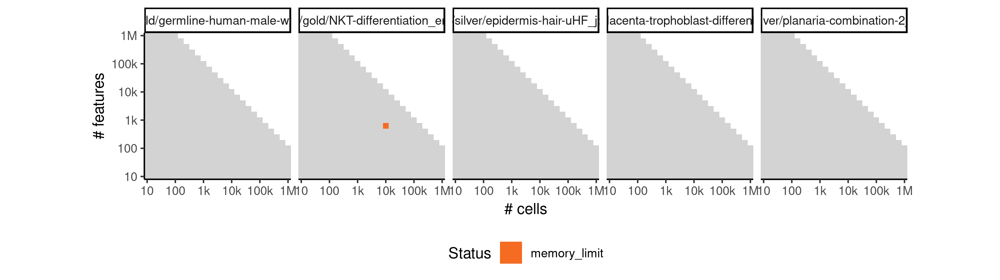

 * Number of instances: 1
 * Dataset ids: scaling_1510

Last 10 lines of scaling_1510:
```
subset 46 
subset 47 
subset 48 
subset 49 
subset 50 
find outliers in cluster 1 
find outliers in cluster 2 
find outliers in cluster 3 
find outliers in cluster 4 
find outliers in cluster 5 
find outliers in cluster 6 
find outliers in cluster 7 
find outliers in cluster 8 
find outliers in cluster 9 
find outliers in cluster 10 
find outliers in cluster 11 
find outliers in cluster 12 
find outliers in cluster 13 
find outliers in cluster 14 
find outliers in cluster 15 
find outliers in cluster 16 
find outliers in cluster 17 
find outliers in cluster 18 
find outliers in cluster 19 
find outliers in cluster 20 
find outliers in cluster 21 
find outliers in cluster 22 
find outliers in cluster 23 
find outliers in cluster 24 
find outliers in cluster 25 
find outliers in cluster 26 
find outliers in cluster 27 
find outliers in cluster 28 
find outliers in cluster 29 
find outliers in cluster 30 
merging outliers 1 
merging outliers 2 
determine final clustering partition 1 
determine final clustering partition 2 
determine final clustering partition 3 
determine final clustering partition 4 
determine final clustering partition 5 
determine final clustering partition 6 
determine final clustering partition 7 
determine final clustering partition 8 
determine final clustering partition 9 
determine final clustering partition 10 
determine final clustering partition 11 
determine final clustering partition 12 
determine final clustering partition 13 
determine final clustering partition 14 
determine final clustering partition 15 
determine final clustering partition 16 
determine final clustering partition 17 
determine final clustering partition 18 
determine final clustering partition 19 
determine final clustering partition 20 
determine final clustering partition 21 
determine final clustering partition 22 
determine final clustering partition 23 
determine final clustering partition 24 
determine final clustering partition 25 
determine final clustering partition 26 
determine final clustering partition 27 
determine final clustering partition 28 
determine final clustering partition 29 
determine final clustering partition 30 
determine final clustering partition 31 
determine final clustering partition 32 
Error: cannot allocate vector of size 2 Kb
Execution halted
```

### ERROR CLUSTER MEMORY_LIMIT -- 4
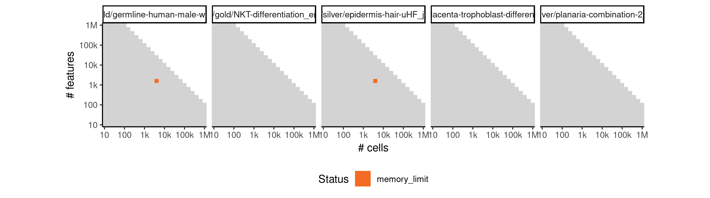

 * Number of instances: 2
 * Dataset ids: scaling_1541, scaling_1579

Last 10 lines of scaling_1541:
```
subset 46 
subset 47 
subset 48 
subset 49 
subset 50 
find outliers in cluster 1 
find outliers in cluster 2 
find outliers in cluster 3 
find outliers in cluster 4 
find outliers in cluster 5 
find outliers in cluster 6 
find outliers in cluster 7 
find outliers in cluster 8 
find outliers in cluster 9 
find outliers in cluster 10 
find outliers in cluster 11 
find outliers in cluster 12 
find outliers in cluster 13 
find outliers in cluster 14 
find outliers in cluster 15 
find outliers in cluster 16 
find outliers in cluster 17 
find outliers in cluster 18 
find outliers in cluster 19 
find outliers in cluster 20 
find outliers in cluster 21 
find outliers in cluster 22 
find outliers in cluster 23 
find outliers in cluster 24 
find outliers in cluster 25 
find outliers in cluster 26 
find outliers in cluster 27 
find outliers in cluster 28 
find outliers in cluster 29 
find outliers in cluster 30 
merging outliers 1 
merging outliers 2 
merging outliers 3 
merging outliers 4 
merging outliers 5 
merging outliers 6 
merging outliers 7 
merging outliers 8 
merging outliers 9 
merging outliers 10 
merging outliers 11 
merging outliers 12 
merging outliers 13 
merging outliers 14 
merging outliers 15 
merging outliers 16 
merging outliers 17 
merging outliers 18 
merging outliers 19 
merging outliers 20 
merging outliers 21 
merging outliers 22 
merging outliers 23 
merging outliers 24 
merging outliers 25 
merging outliers 26 
merging outliers 27 
merging outliers 28 
merging outliers 29 
merging outliers 30 
merging outliers 31 
merging outliers 32 
merging outliers 33 
merging outliers 34 
merging outliers 35 
merging outliers 36 
merging outliers 37 
merging outliers 38 
merging outliers 39 
determine final clustering partition 1 
determine final clustering partition 2 
determine final clustering partition 3 
determine final clustering partition 4 
determine final clustering partition 5 
determine final clustering partition 6 
determine final clustering partition 7 
determine final clustering partition 8 
determine final clustering partition 9 
determine final clustering partition 10 
determine final clustering partition 11 
determine final clustering partition 12 
determine final clustering partition 13 
determine final clustering partition 14 
determine final clustering partition 15 
determine final clustering partition 16 
determine final clustering partition 17 
determine final clustering partition 18 
determine final clustering partition 19 
determine final clustering partition 20 
determine final clustering partition 21 
determine final clustering partition 22 
determine final clustering partition 23 
determine final clustering partition 24 
determine final clustering partition 25 
determine final clustering partition 26 
determine final clustering partition 27 
determine final clustering partition 28 
determine final clustering partition 29 
determine final clustering partition 30 
determine final clustering partition 31 
determine final clustering partition 32 
determine final clustering partition 33 
determine final clustering partition 34 
determine final clustering partition 35 
determine final clustering partition 36 
determine final clustering partition 37 
determine final clustering partition 38 
determine final clustering partition 39 
determine final clustering partition 40 
determine final clustering partition 41 
determine final clustering partition 42 
determine final clustering partition 43 
determine final clustering partition 44 
determine final clustering partition 45 
determine final clustering partition 46 
determine final clustering partition 47 
determine final clustering partition 48 
determine final clustering partition 49 
determine final clustering partition 50 
determine final clustering partition 51 
determine final clustering partition 52 
determine final clustering partition 53 
determine final clustering partition 54 
determine final clustering partition 55 
determine final clustering partition 56 
determine final clustering partition 57 
determine final clustering partition 58 
determine final clustering partition 59 
determine final clustering partition 60 
determine final clustering partition 61 
determine final clustering partition 62 
determine final clustering partition 63 
determine final clustering partition 64 
determine final clustering partition 65 
determine final clustering partition 66 
determine final clustering partition 67 
determine final clustering partition 68 
determine final clustering partition 69 
Error: cannot allocate vector of size 3.2 Gb
Execution halted
```

### ERROR CLUSTER MEMORY_LIMIT -- 5


 * Number of instances: 2
 * Dataset ids: scaling_1542, scaling_1580

Last 10 lines of scaling_1542:
```
subset 46 
subset 47 
subset 48 
subset 49 
subset 50 
find outliers in cluster 1 
find outliers in cluster 2 
find outliers in cluster 3 
find outliers in cluster 4 
find outliers in cluster 5 
find outliers in cluster 6 
find outliers in cluster 7 
find outliers in cluster 8 
find outliers in cluster 9 
find outliers in cluster 10 
find outliers in cluster 11 
find outliers in cluster 12 
find outliers in cluster 13 
find outliers in cluster 14 
find outliers in cluster 15 
find outliers in cluster 16 
find outliers in cluster 17 
find outliers in cluster 18 
find outliers in cluster 19 
find outliers in cluster 20 
find outliers in cluster 21 
find outliers in cluster 22 
find outliers in cluster 23 
find outliers in cluster 24 
find outliers in cluster 25 
find outliers in cluster 26 
find outliers in cluster 27 
find outliers in cluster 28 
find outliers in cluster 29 
find outliers in cluster 30 
merging outliers 1 
merging outliers 2 
merging outliers 3 
merging outliers 4 
merging outliers 5 
merging outliers 6 
merging outliers 7 
merging outliers 8 
merging outliers 9 
merging outliers 10 
merging outliers 11 
merging outliers 12 
merging outliers 13 
merging outliers 14 
determine final clustering partition 1 
determine final clustering partition 2 
determine final clustering partition 3 
determine final clustering partition 4 
determine final clustering partition 5 
determine final clustering partition 6 
determine final clustering partition 7 
determine final clustering partition 8 
determine final clustering partition 9 
determine final clustering partition 10 
determine final clustering partition 11 
determine final clustering partition 12 
determine final clustering partition 13 
determine final clustering partition 14 
determine final clustering partition 15 
determine final clustering partition 16 
determine final clustering partition 17 
determine final clustering partition 18 
determine final clustering partition 19 
determine final clustering partition 20 
determine final clustering partition 21 
determine final clustering partition 22 
determine final clustering partition 23 
determine final clustering partition 24 
determine final clustering partition 25 
determine final clustering partition 26 
determine final clustering partition 27 
determine final clustering partition 28 
determine final clustering partition 29 
determine final clustering partition 30 
determine final clustering partition 31 
determine final clustering partition 32 
determine final clustering partition 33 
determine final clustering partition 34 
determine final clustering partition 35 
determine final clustering partition 36 
determine final clustering partition 37 
determine final clustering partition 38 
determine final clustering partition 39 
determine final clustering partition 40 
determine final clustering partition 41 
determine final clustering partition 42 
determine final clustering partition 43 
determine final clustering partition 44 
Error: cannot allocate vector of size 3.7 Gb
Execution halted
```

### ERROR CLUSTER MEMORY_LIMIT -- 6


 * Number of instances: 1
 * Dataset ids: scaling_1638

Last 10 lines of scaling_1638:
```
subset 46 
subset 47 
subset 48 
subset 49 
subset 50 
find outliers in cluster 1 
find outliers in cluster 2 
find outliers in cluster 3 
find outliers in cluster 4 
find outliers in cluster 5 
find outliers in cluster 6 
find outliers in cluster 7 
find outliers in cluster 8 
find outliers in cluster 9 
find outliers in cluster 10 
find outliers in cluster 11 
find outliers in cluster 12 
find outliers in cluster 13 
find outliers in cluster 14 
find outliers in cluster 15 
find outliers in cluster 16 
find outliers in cluster 17 
find outliers in cluster 18 
find outliers in cluster 19 
find outliers in cluster 20 
find outliers in cluster 21 
find outliers in cluster 22 
find outliers in cluster 23 
find outliers in cluster 24 
find outliers in cluster 25 
find outliers in cluster 26 
find outliers in cluster 27 
find outliers in cluster 28 
find outliers in cluster 29 
find outliers in cluster 30 
merging outliers 1 
merging outliers 2 
merging outliers 3 
merging outliers 4 
merging outliers 5 
merging outliers 6 
merging outliers 7 
merging outliers 8 
merging outliers 9 
merging outliers 10 
merging outliers 11 
merging outliers 12 
merging outliers 13 
merging outliers 14 
merging outliers 15 
merging outliers 16 
merging outliers 17 
merging outliers 18 
merging outliers 19 
merging outliers 20 
merging outliers 21 
merging outliers 22 
merging outliers 23 
merging outliers 24 
merging outliers 25 
merging outliers 26 
merging outliers 27 
merging outliers 28 
merging outliers 29 
merging outliers 30 
merging outliers 31 
merging outliers 32 
merging outliers 33 
merging outliers 34 
merging outliers 35 
merging outliers 36 
merging outliers 37 
merging outliers 38 
merging outliers 39 
merging outliers 40 
merging outliers 41 
merging outliers 42 
merging outliers 43 
merging outliers 44 
merging outliers 45 
merging outliers 46 
merging outliers 47 
merging outliers 48 
merging outliers 49 
merging outliers 50 
merging outliers 51 
merging outliers 52 
merging outliers 53 
merging outliers 54 
merging outliers 55 
merging outliers 56 
merging outliers 57 
merging outliers 58 
merging outliers 59 
merging outliers 60 
merging outliers 61 
merging outliers 62 
merging outliers 63 
merging outliers 64 
merging outliers 65 
merging outliers 66 
merging outliers 67 
merging outliers 68 
merging outliers 69 
merging outliers 70 
merging outliers 71 
merging outliers 72 
merging outliers 73 
merging outliers 74 
merging outliers 75 
merging outliers 76 
merging outliers 77 
merging outliers 78 
merging outliers 79 
merging outliers 80 
merging outliers 81 
merging outliers 82 
merging outliers 83 
merging outliers 84 
merging outliers 85 
merging outliers 86 
merging outliers 87 
merging outliers 88 
merging outliers 89 
merging outliers 90 
merging outliers 91 
merging outliers 92 
merging outliers 93 
merging outliers 94 
merging outliers 95 
merging outliers 96 
merging outliers 97 
merging outliers 98 
merging outliers 99 
merging outliers 100 
merging outliers 101 
merging outliers 102 
merging outliers 103 
merging outliers 104 
merging outliers 105 
merging outliers 106 
determine final clustering partition 1 
determine final clustering partition 2 
determine final clustering partition 3 
determine final clustering partition 4 
determine final clustering partition 5 
determine final clustering partition 6 
determine final clustering partition 7 
determine final clustering partition 8 
determine final clustering partition 9 
determine final clustering partition 10 
determine final clustering partition 11 
determine final clustering partition 12 
determine final clustering partition 13 
determine final clustering partition 14 
determine final clustering partition 15 
determine final clustering partition 16 
determine final clustering partition 17 
determine final clustering partition 18 
determine final clustering partition 19 
determine final clustering partition 20 
determine final clustering partition 21 
determine final clustering partition 22 
determine final clustering partition 23 
determine final clustering partition 24 
determine final clustering partition 25 
determine final clustering partition 26 
determine final clustering partition 27 
determine final clustering partition 28 
determine final clustering partition 29 
determine final clustering partition 30 
determine final clustering partition 31 
determine final clustering partition 32 
determine final clustering partition 33 
determine final clustering partition 34 
determine final clustering partition 35 
determine final clustering partition 36 
determine final clustering partition 37 
determine final clustering partition 38 
determine final clustering partition 39 
determine final clustering partition 40 
determine final clustering partition 41 
determine final clustering partition 42 
determine final clustering partition 43 
determine final clustering partition 44 
determine final clustering partition 45 
determine final clustering partition 46 
determine final clustering partition 47 
determine final clustering partition 48 
determine final clustering partition 49 
determine final clustering partition 50 
determine final clustering partition 51 
determine final clustering partition 52 
determine final clustering partition 53 
determine final clustering partition 54 
determine final clustering partition 55 
determine final clustering partition 56 
determine final clustering partition 57 
determine final clustering partition 58 
determine final clustering partition 59 
determine final clustering partition 60 
determine final clustering partition 61 
determine final clustering partition 62 
determine final clustering partition 63 
determine final clustering partition 64 
determine final clustering partition 65 
determine final clustering partition 66 
determine final clustering partition 67 
determine final clustering partition 68 
determine final clustering partition 69 
determine final clustering partition 70 
determine final clustering partition 71 
determine final clustering partition 72 
determine final clustering partition 73 
determine final clustering partition 74 
determine final clustering partition 75 
determine final clustering partition 76 
determine final clustering partition 77 
determine final clustering partition 78 
determine final clustering partition 79 
determine final clustering partition 80 
determine final clustering partition 81 
determine final clustering partition 82 
determine final clustering partition 83 
determine final clustering partition 84 
determine final clustering partition 85 
determine final clustering partition 86 
determine final clustering partition 87 
determine final clustering partition 88 
determine final clustering partition 89 
determine final clustering partition 90 
determine final clustering partition 91 
determine final clustering partition 92 
determine final clustering partition 93 
determine final clustering partition 94 
determine final clustering partition 95 
determine final clustering partition 96 
determine final clustering partition 97 
determine final clustering partition 98 
determine final clustering partition 99 
determine final clustering partition 100 
determine final clustering partition 101 
determine final clustering partition 102 
determine final clustering partition 103 
determine final clustering partition 104 
determine final clustering partition 105 
determine final clustering partition 106 
determine final clustering partition 107 
determine final clustering partition 108 
determine final clustering partition 109 
determine final clustering partition 110 
determine final clustering partition 111 
determine final clustering partition 112 
determine final clustering partition 113 
determine final clustering partition 114 
determine final clustering partition 115 
determine final clustering partition 116 
determine final clustering partition 117 
determine final clustering partition 118 
determine final clustering partition 119 
determine final clustering partition 120 
determine final clustering partition 121 
determine final clustering partition 122 
determine final clustering partition 123 
determine final clustering partition 124 
determine final clustering partition 125 
determine final clustering partition 126 
determine final clustering partition 127 
determine final clustering partition 128 
determine final clustering partition 129 
determine final clustering partition 130 
determine final clustering partition 131 
determine final clustering partition 132 
determine final clustering partition 133 
determine final clustering partition 134 
determine final clustering partition 135 
determine final clustering partition 136 
Error: cannot allocate vector of size 5.8 Gb
Execution halted
```

### ERROR CLUSTER MEMORY_LIMIT -- 7


 * Number of instances: 1
 * Dataset ids: scaling_1639

Last 10 lines of scaling_1639:
```
subset 46 
subset 47 
subset 48 
subset 49 
subset 50 
find outliers in cluster 1 
find outliers in cluster 2 
find outliers in cluster 3 
find outliers in cluster 4 
find outliers in cluster 5 
find outliers in cluster 6 
find outliers in cluster 7 
find outliers in cluster 8 
find outliers in cluster 9 
find outliers in cluster 10 
find outliers in cluster 11 
find outliers in cluster 12 
find outliers in cluster 13 
find outliers in cluster 14 
find outliers in cluster 15 
find outliers in cluster 16 
find outliers in cluster 17 
find outliers in cluster 18 
find outliers in cluster 19 
find outliers in cluster 20 
find outliers in cluster 21 
find outliers in cluster 22 
find outliers in cluster 23 
find outliers in cluster 24 
find outliers in cluster 25 
find outliers in cluster 26 
find outliers in cluster 27 
find outliers in cluster 28 
find outliers in cluster 29 
find outliers in cluster 30 
merging outliers 1 
merging outliers 2 
merging outliers 3 
merging outliers 4 
merging outliers 5 
determine final clustering partition 1 
determine final clustering partition 2 
determine final clustering partition 3 
determine final clustering partition 4 
determine final clustering partition 5 
determine final clustering partition 6 
determine final clustering partition 7 
determine final clustering partition 8 
determine final clustering partition 9 
determine final clustering partition 10 
determine final clustering partition 11 
determine final clustering partition 12 
determine final clustering partition 13 
determine final clustering partition 14 
determine final clustering partition 15 
determine final clustering partition 16 
determine final clustering partition 17 
determine final clustering partition 18 
determine final clustering partition 19 
determine final clustering partition 20 
determine final clustering partition 21 
determine final clustering partition 22 
determine final clustering partition 23 
determine final clustering partition 24 
determine final clustering partition 25 
determine final clustering partition 26 
determine final clustering partition 27 
determine final clustering partition 28 
determine final clustering partition 29 
determine final clustering partition 30 
determine final clustering partition 31 
determine final clustering partition 32 
determine final clustering partition 33 
determine final clustering partition 34 
determine final clustering partition 35 
Error: cannot allocate vector of size 4.0 Gb
Execution halted
```

### ERROR CLUSTER MEMORY_LIMIT -- 8


 * Number of instances: 1
 * Dataset ids: scaling_1661

Last 10 lines of scaling_1661:
```
subset 46 
subset 47 
subset 48 
subset 49 
subset 50 
find outliers in cluster 1 
find outliers in cluster 2 
find outliers in cluster 3 
find outliers in cluster 4 
find outliers in cluster 5 
find outliers in cluster 6 
find outliers in cluster 7 
find outliers in cluster 8 
find outliers in cluster 9 
find outliers in cluster 10 
find outliers in cluster 11 
find outliers in cluster 12 
find outliers in cluster 13 
find outliers in cluster 14 
find outliers in cluster 15 
find outliers in cluster 16 
find outliers in cluster 17 
find outliers in cluster 18 
find outliers in cluster 19 
find outliers in cluster 20 
find outliers in cluster 21 
find outliers in cluster 22 
find outliers in cluster 23 
find outliers in cluster 24 
find outliers in cluster 25 
find outliers in cluster 26 
find outliers in cluster 27 
find outliers in cluster 28 
find outliers in cluster 29 
find outliers in cluster 30 
merging outliers 1 
merging outliers 2 
merging outliers 3 
determine final clustering partition 1 
determine final clustering partition 2 
determine final clustering partition 3 
determine final clustering partition 4 
determine final clustering partition 5 
determine final clustering partition 6 
determine final clustering partition 7 
determine final clustering partition 8 
determine final clustering partition 9 
determine final clustering partition 10 
determine final clustering partition 11 
determine final clustering partition 12 
determine final clustering partition 13 
determine final clustering partition 14 
determine final clustering partition 15 
determine final clustering partition 16 
determine final clustering partition 17 
determine final clustering partition 18 
determine final clustering partition 19 
determine final clustering partition 20 
determine final clustering partition 21 
determine final clustering partition 22 
determine final clustering partition 23 
determine final clustering partition 24 
determine final clustering partition 25 
determine final clustering partition 26 
determine final clustering partition 27 
determine final clustering partition 28 
determine final clustering partition 29 
determine final clustering partition 30 
determine final clustering partition 31 
determine final clustering partition 32 
determine final clustering partition 33 
Error: cannot allocate vector of size 3.9 Gb
Execution halted
```

### ERROR CLUSTER MEMORY_LIMIT -- 9


 * Number of instances: 1
 * Dataset ids: scaling_1682

Last 10 lines of scaling_1682:
```
subset 46 
subset 47 
subset 48 
subset 49 
subset 50 
find outliers in cluster 1 
find outliers in cluster 2 
find outliers in cluster 3 
find outliers in cluster 4 
find outliers in cluster 5 
find outliers in cluster 6 
find outliers in cluster 7 
find outliers in cluster 8 
find outliers in cluster 9 
find outliers in cluster 10 
find outliers in cluster 11 
find outliers in cluster 12 
find outliers in cluster 13 
find outliers in cluster 14 
find outliers in cluster 15 
find outliers in cluster 16 
find outliers in cluster 17 
find outliers in cluster 18 
find outliers in cluster 19 
find outliers in cluster 20 
find outliers in cluster 21 
find outliers in cluster 22 
find outliers in cluster 23 
find outliers in cluster 24 
find outliers in cluster 25 
find outliers in cluster 26 
find outliers in cluster 27 
find outliers in cluster 28 
find outliers in cluster 29 
find outliers in cluster 30 
merging outliers 1 
merging outliers 2 
merging outliers 3 
merging outliers 4 
merging outliers 5 
merging outliers 6 
merging outliers 7 
merging outliers 8 
merging outliers 9 
merging outliers 10 
merging outliers 11 
merging outliers 12 
merging outliers 13 
merging outliers 14 
merging outliers 15 
merging outliers 16 
merging outliers 17 
merging outliers 18 
merging outliers 19 
merging outliers 20 
merging outliers 21 
merging outliers 22 
merging outliers 23 
merging outliers 24 
merging outliers 25 
merging outliers 26 
merging outliers 27 
merging outliers 28 
merging outliers 29 
merging outliers 30 
merging outliers 31 
merging outliers 32 
merging outliers 33 
merging outliers 34 
merging outliers 35 
merging outliers 36 
merging outliers 37 
merging outliers 38 
merging outliers 39 
merging outliers 40 
merging outliers 41 
merging outliers 42 
merging outliers 43 
merging outliers 44 
merging outliers 45 
merging outliers 46 
merging outliers 47 
merging outliers 48 
merging outliers 49 
merging outliers 50 
merging outliers 51 
merging outliers 52 
merging outliers 53 
merging outliers 54 
merging outliers 55 
merging outliers 56 
merging outliers 57 
merging outliers 58 
merging outliers 59 
merging outliers 60 
merging outliers 61 
merging outliers 62 
merging outliers 63 
merging outliers 64 
merging outliers 65 
merging outliers 66 
merging outliers 67 
merging outliers 68 
merging outliers 69 
merging outliers 70 
merging outliers 71 
merging outliers 72 
merging outliers 73 
merging outliers 74 
merging outliers 75 
merging outliers 76 
merging outliers 77 
merging outliers 78 
merging outliers 79 
merging outliers 80 
merging outliers 81 
merging outliers 82 
merging outliers 83 
merging outliers 84 
merging outliers 85 
merging outliers 86 
merging outliers 87 
merging outliers 88 
merging outliers 89 
merging outliers 90 
merging outliers 91 
merging outliers 92 
merging outliers 93 
merging outliers 94 
merging outliers 95 
merging outliers 96 
merging outliers 97 
merging outliers 98 
merging outliers 99 
merging outliers 100 
merging outliers 101 
merging outliers 102 
merging outliers 103 
merging outliers 104 
merging outliers 105 
merging outliers 106 
merging outliers 107 
merging outliers 108 
determine final clustering partition 1 
determine final clustering partition 2 
determine final clustering partition 3 
determine final clustering partition 4 
determine final clustering partition 5 
determine final clustering partition 6 
determine final clustering partition 7 
determine final clustering partition 8 
determine final clustering partition 9 
determine final clustering partition 10 
determine final clustering partition 11 
determine final clustering partition 12 
determine final clustering partition 13 
determine final clustering partition 14 
determine final clustering partition 15 
determine final clustering partition 16 
determine final clustering partition 17 
determine final clustering partition 18 
determine final clustering partition 19 
determine final clustering partition 20 
determine final clustering partition 21 
determine final clustering partition 22 
determine final clustering partition 23 
determine final clustering partition 24 
determine final clustering partition 25 
determine final clustering partition 26 
determine final clustering partition 27 
determine final clustering partition 28 
determine final clustering partition 29 
determine final clustering partition 30 
determine final clustering partition 31 
determine final clustering partition 32 
determine final clustering partition 33 
determine final clustering partition 34 
determine final clustering partition 35 
determine final clustering partition 36 
determine final clustering partition 37 
determine final clustering partition 38 
determine final clustering partition 39 
determine final clustering partition 40 
determine final clustering partition 41 
determine final clustering partition 42 
determine final clustering partition 43 
determine final clustering partition 44 
determine final clustering partition 45 
determine final clustering partition 46 
determine final clustering partition 47 
determine final clustering partition 48 
determine final clustering partition 49 
determine final clustering partition 50 
determine final clustering partition 51 
determine final clustering partition 52 
determine final clustering partition 53 
determine final clustering partition 54 
determine final clustering partition 55 
determine final clustering partition 56 
determine final clustering partition 57 
determine final clustering partition 58 
determine final clustering partition 59 
determine final clustering partition 60 
determine final clustering partition 61 
determine final clustering partition 62 
determine final clustering partition 63 
determine final clustering partition 64 
determine final clustering partition 65 
determine final clustering partition 66 
determine final clustering partition 67 
determine final clustering partition 68 
determine final clustering partition 69 
determine final clustering partition 70 
determine final clustering partition 71 
determine final clustering partition 72 
determine final clustering partition 73 
determine final clustering partition 74 
determine final clustering partition 75 
determine final clustering partition 76 
determine final clustering partition 77 
determine final clustering partition 78 
determine final clustering partition 79 
determine final clustering partition 80 
determine final clustering partition 81 
determine final clustering partition 82 
determine final clustering partition 83 
determine final clustering partition 84 
determine final clustering partition 85 
determine final clustering partition 86 
determine final clustering partition 87 
determine final clustering partition 88 
determine final clustering partition 89 
determine final clustering partition 90 
determine final clustering partition 91 
determine final clustering partition 92 
determine final clustering partition 93 
determine final clustering partition 94 
determine final clustering partition 95 
determine final clustering partition 96 
determine final clustering partition 97 
determine final clustering partition 98 
determine final clustering partition 99 
determine final clustering partition 100 
determine final clustering partition 101 
determine final clustering partition 102 
determine final clustering partition 103 
determine final clustering partition 104 
determine final clustering partition 105 
determine final clustering partition 106 
determine final clustering partition 107 
determine final clustering partition 108 
determine final clustering partition 109 
determine final clustering partition 110 
determine final clustering partition 111 
determine final clustering partition 112 
determine final clustering partition 113 
determine final clustering partition 114 
determine final clustering partition 115 
determine final clustering partition 116 
determine final clustering partition 117 
determine final clustering partition 118 
determine final clustering partition 119 
determine final clustering partition 120 
determine final clustering partition 121 
determine final clustering partition 122 
determine final clustering partition 123 
determine final clustering partition 124 
determine final clustering partition 125 
determine final clustering partition 126 
determine final clustering partition 127 
determine final clustering partition 128 
determine final clustering partition 129 
determine final clustering partition 130 
determine final clustering partition 131 
determine final clustering partition 132 
determine final clustering partition 133 
determine final clustering partition 134 
determine final clustering partition 135 
determine final clustering partition 136 
determine final clustering partition 137 
determine final clustering partition 138 
Error: cannot allocate vector of size 6.0 Gb
Execution halted
```


