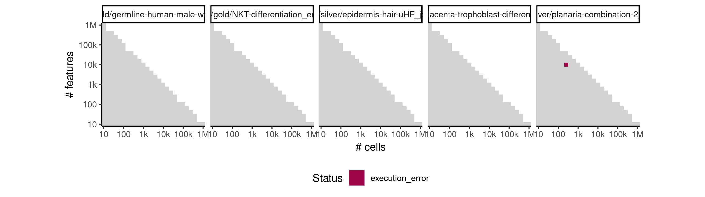
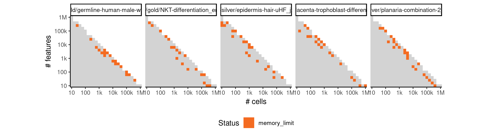
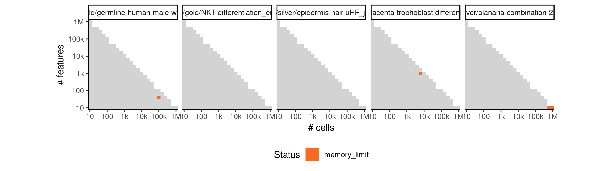

# random


## ERROR STATUS EXECUTION_ERROR

### ERROR CLUSTER EXECUTION_ERROR -- 1


 * Number of instances: 1
 * Dataset ids: scaling_1366

Last 10 lines of scaling_1366:
```
File: /home/rcannood/Workspace/dynverse/dynbenchmark//derived/05-scaling/suite/random/Cat3/r2gridengine/20181009_221416_random_Cat3_udGhrJtws5/log/log.221.e.txt
Execution halted
```

## ERROR STATUS MEMORY_LIMIT

### ERROR CLUSTER MEMORY_LIMIT -- 1


 * Number of instances: 101
 * Dataset ids: scaling_1190, scaling_1192, scaling_1193, scaling_1204, scaling_1205, scaling_1215, scaling_1270, scaling_1272, scaling_1316, scaling_1317, scaling_1318, scaling_1330, scaling_1333, scaling_1335, scaling_1365, scaling_1367, scaling_1374, scaling_1375, scaling_1385, scaling_1386, scaling_1397, scaling_1419, scaling_1420, scaling_1421, scaling_1427, scaling_1428, scaling_1435, scaling_1439, scaling_1440, scaling_1446, scaling_1447, scaling_1464, scaling_1465, scaling_1466, scaling_1481, scaling_1488, scaling_1498, scaling_1499, scaling_1500, scaling_1504, scaling_1506, scaling_1511, scaling_1512, scaling_1513, scaling_1527, scaling_1533, scaling_1536, scaling_1540, scaling_1543, scaling_1551, scaling_1552, scaling_1557, scaling_1558, scaling_1559, scaling_1575, scaling_1576, scaling_1582, scaling_1583, scaling_1597, scaling_1598, scaling_1600, scaling_1610, scaling_1613, scaling_1614, scaling_1616, scaling_1617, scaling_1636, scaling_1637, scaling_1638, scaling_1640, scaling_1641, scaling_1642, scaling_1643, scaling_1644, scaling_1646, scaling_1652, scaling_1653, scaling_1654, scaling_1660, scaling_1666, scaling_1671, scaling_1674, scaling_1675, scaling_1677, scaling_1678, scaling_1679, scaling_1689, scaling_1694, scaling_1695, scaling_1697, scaling_1698, scaling_1699, scaling_1700, scaling_1713, scaling_1717, scaling_1718, scaling_1719, scaling_1720, scaling_1724, scaling_1725, scaling_1729

Last 10 lines of scaling_1190:
```
error writing to connection
```

### ERROR CLUSTER MEMORY_LIMIT -- 2


 * Number of instances: 4
 * Dataset ids: scaling_1391, scaling_1599, scaling_1625, scaling_1735

Last 10 lines of scaling_1391:
```
The following objects are masked from ‘package:stats’:
    filter, lag
The following objects are masked from ‘package:base’:
    intersect, setdiff, setequal, union
Attaching package: ‘purrr’
The following object is masked from ‘package:jsonlite’:
    flatten
Error in saveRDS(x, con) : error writing to connection
Calls: write_rds -> saveRDS
Execution halted
```


