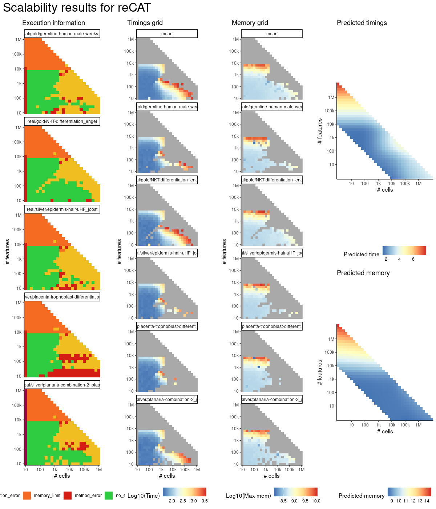
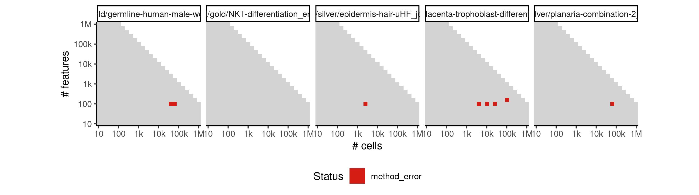
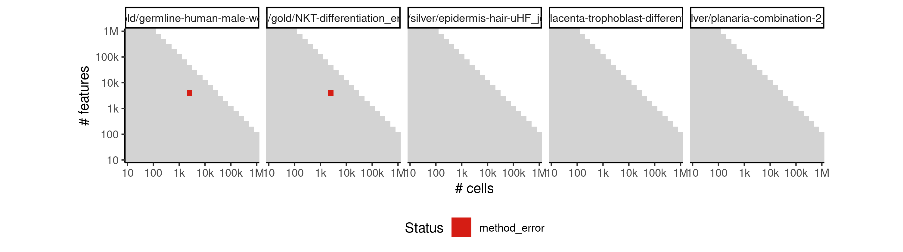
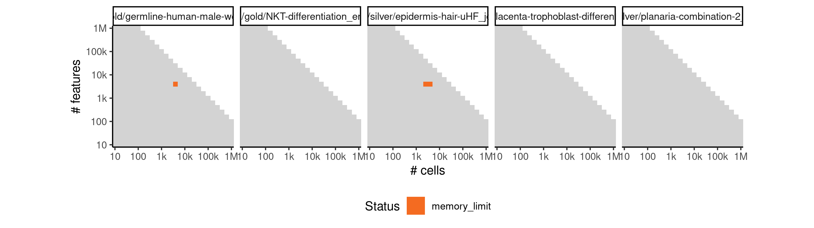

# recat


## ERROR STATUS METHOD_ERROR

### ERROR CLUSTER METHOD_ERROR -- 1


 * Number of instances: 89
 * Dataset ids: scaling_0001, scaling_0002, scaling_0003, scaling_0004, scaling_0006, scaling_0008, scaling_0010, scaling_0012, scaling_0016, scaling_0019, scaling_0022, scaling_0025, scaling_0041, scaling_0043, scaling_0045, scaling_0047, scaling_0051, scaling_0056, scaling_0061, scaling_0066, scaling_0076, scaling_0082, scaling_0088, scaling_0094, scaling_0106, scaling_0113, scaling_0120, scaling_0127, scaling_0151, scaling_0156, scaling_0157, scaling_0163, scaling_0169, scaling_0181, scaling_0188, scaling_0195, scaling_0202, scaling_0226, scaling_0231, scaling_0232, scaling_0237, scaling_0238, scaling_0243, scaling_0244, scaling_0248, scaling_0276, scaling_0286, scaling_0287, scaling_0298, scaling_0309, scaling_0341, scaling_0349, scaling_0351, scaling_0361, scaling_0371, scaling_0391, scaling_0402, scaling_0404, scaling_0417, scaling_0428, scaling_0430, scaling_0440, scaling_0441, scaling_0456, scaling_0465, scaling_0466, scaling_0476, scaling_0486, scaling_0531, scaling_0556, scaling_0565, scaling_0574, scaling_0582, scaling_0583, scaling_0601, scaling_0617, scaling_0632, scaling_0633, scaling_0649, scaling_0745, scaling_0818, scaling_0898, scaling_0934, scaling_1069, scaling_1197, scaling_1228, scaling_1257, scaling_1317, scaling_1604

Last 10 lines of scaling_0001:
```
Package 'mclust' version 5.4.1
Type 'citation("mclust")' for citing this R package in publications.
Attaching package: ‘mclust’
The following object is masked from ‘package:purrr’:
    map
Loading required package: TSP
[1] 1
Error in .solve_TSP(x, method, control, ...) : NAs not allowed!
Calls: <Anonymous> ... highCorFind -> solve_TSP -> solve_TSP.ATSP -> .solve_TSP
Execution halted
```

### ERROR CLUSTER METHOD_ERROR -- 2


 * Number of instances: 51
 * Dataset ids: scaling_0099, scaling_0133, scaling_0208, scaling_0249, scaling_0318, scaling_0319, scaling_0379, scaling_0380, scaling_0429, scaling_0442, scaling_0485, scaling_0494, scaling_0495, scaling_0521, scaling_0549, scaling_0590, scaling_0591, scaling_0647, scaling_0648, scaling_0662, scaling_0663, scaling_0664, scaling_0746, scaling_0747, scaling_0748, scaling_0819, scaling_0835, scaling_0836, scaling_0837, scaling_0899, scaling_0942, scaling_0974, scaling_1035, scaling_1036, scaling_1125, scaling_1126, scaling_1147, scaling_1153, scaling_1229, scaling_1261, scaling_1357, scaling_1358, scaling_1359, scaling_1428, scaling_1476, scaling_1487, scaling_1488, scaling_1605, scaling_1606, scaling_1712, scaling_1713

Last 10 lines of scaling_0099:
```
Package 'mclust' version 5.4.1
Type 'citation("mclust")' for citing this R package in publications.
Attaching package: ‘mclust’
The following object is masked from ‘package:purrr’:
    map
Loading required package: TSP
Error in if (minDistance < 0 | minDistance > tmp[1]) { : 
  missing value where TRUE/FALSE needed
Calls: <Anonymous> ... forceTSPNext -> forceTSPNext -> forceTSPNext -> forceTSPNext
Execution halted
```

### ERROR CLUSTER METHOD_ERROR -- 3


 * Number of instances: 12
 * Dataset ids: scaling_0727, scaling_0940, scaling_1032, scaling_1121, scaling_1241, scaling_1260, scaling_1264, scaling_1353, scaling_1438, scaling_1496, scaling_1601, scaling_1708

Last 10 lines of scaling_0727:
```
Loading required package: mclust
Package 'mclust' version 5.4.1
Type 'citation("mclust")' for citing this R package in publications.
Attaching package: ‘mclust’
The following object is masked from ‘package:purrr’:
    map
Error in unchol(cholSigma, upper = TRUE) : 
  NA/NaN/Inf in foreign function call (arg 2)
Calls: <Anonymous> ... mclustBIC -> mstep -> eval -> eval -> mstepEEE -> unchol
Execution halted
```

### ERROR CLUSTER METHOD_ERROR -- 4


 * Number of instances: 7
 * Dataset ids: scaling_0814, scaling_0896, scaling_1122, scaling_1355, scaling_1390, scaling_1545, scaling_1621

Last 10 lines of scaling_0814:
```
Package 'mclust' version 5.4.1
Type 'citation("mclust")' for citing this R package in publications.
Attaching package: ‘mclust’
The following object is masked from ‘package:purrr’:
    map
Loading required package: TSP
Error in if (any(c(mu, cholsigma) > signif(.Machine$double.xmax, 6))) { : 
  missing value where TRUE/FALSE needed
Calls: <Anonymous> ... eval -> mclustBIC -> mstep -> eval -> eval -> mstepVVV
Execution halted
```

### ERROR CLUSTER METHOD_ERROR -- 5


 * Number of instances: 5
 * Dataset ids: scaling_0863, scaling_0885, scaling_0955, scaling_1120, scaling_1709

Last 10 lines of scaling_0863:
```
Loading required package: mclust
Package 'mclust' version 5.4.1
Type 'citation("mclust")' for citing this R package in publications.
Attaching package: ‘mclust’
The following object is masked from ‘package:purrr’:
    map
Error in if (any(c(mu, cholsigma) > signif(.Machine$double.xmax, 6))) { : 
  missing value where TRUE/FALSE needed
Calls: <Anonymous> ... eval -> mclustBIC -> mstep -> eval -> eval -> mstepVVV
Execution halted
```

### ERROR CLUSTER METHOD_ERROR -- 6


 * Number of instances: 8
 * Dataset ids: scaling_0907, scaling_1031, scaling_1225, scaling_1242, scaling_1354, scaling_1485, scaling_1523, scaling_1731

Last 10 lines of scaling_0907:
```
Package 'mclust' version 5.4.1
Type 'citation("mclust")' for citing this R package in publications.
Attaching package: ‘mclust’
The following object is masked from ‘package:purrr’:
    map
Loading required package: TSP
Error in unchol(cholSigma, upper = TRUE) : 
  NA/NaN/Inf in foreign function call (arg 2)
Calls: <Anonymous> ... mclustBIC -> mstep -> eval -> eval -> mstepEEE -> unchol
Execution halted
```

### ERROR CLUSTER METHOD_ERROR -- 7


 * Number of instances: 2
 * Dataset ids: scaling_1636, scaling_1658

Last 10 lines of scaling_1636:
```
Attaching package: ‘mclust’
The following object is masked from ‘package:purrr’:
    map
Loading required package: TSP
Error: package or namespace load failed for ‘TSP’ in dyn.load(file, DLLpath = DLLpath, ...):
 unable to load shared object '/usr/local/lib/R/site-library/TSP/libs/TSP.so':
  /usr/local/lib/R/site-library/TSP/libs/TSP.so: failed to map segment from shared object
Loading required package: TSP
Error: memory exhausted (limit reached?)
Execution halted
```

## ERROR STATUS TIME_LIMIT

### ERROR CLUSTER TIME_LIMIT -- 1


 * Number of instances: 348
 * Dataset ids: scaling_0024, scaling_0110, scaling_0112, scaling_0126, scaling_0160, scaling_0180, scaling_0215, scaling_0235, scaling_0262, scaling_0275, scaling_0308, scaling_0329, scaling_0330, scaling_0340, scaling_0350, scaling_0356, scaling_0370, scaling_0390, scaling_0398, scaling_0403, scaling_0424, scaling_0454, scaling_0461, scaling_0481, scaling_0505, scaling_0509, scaling_0512, scaling_0517, scaling_0543, scaling_0547, scaling_0555, scaling_0563, scaling_0564, scaling_0570, scaling_0579, scaling_0581, scaling_0597, scaling_0599, scaling_0600, scaling_0610, scaling_0614, scaling_0615, scaling_0616, scaling_0625, scaling_0642, scaling_0645, scaling_0646, scaling_0675, scaling_0679, scaling_0691, scaling_0695, scaling_0696, scaling_0697, scaling_0707, scaling_0725, scaling_0729, scaling_0730, scaling_0731, scaling_0765, scaling_0777, scaling_0778, scaling_0781, scaling_0782, scaling_0783, scaling_0794, scaling_0813, scaling_0815, scaling_0817, scaling_0831, scaling_0833, scaling_0834, scaling_0850, scaling_0855, scaling_0864, scaling_0865, scaling_0866, scaling_0886, scaling_0888, scaling_0897, scaling_0906, scaling_0910, scaling_0916, scaling_0917, scaling_0918, scaling_0923, scaling_0933, scaling_0941, scaling_0948, scaling_0954, scaling_0956, scaling_0960, scaling_0966, scaling_0967, scaling_0968, scaling_0972, scaling_0973, scaling_0978, scaling_0988, scaling_0989, scaling_0990, scaling_0991, scaling_0993, scaling_0994, scaling_1002, scaling_1016, scaling_1017, scaling_1018, scaling_1019, scaling_1021, scaling_1022, scaling_1030, scaling_1033, scaling_1044, scaling_1045, scaling_1046, scaling_1047, scaling_1061, scaling_1062, scaling_1063, scaling_1064, scaling_1065, scaling_1066, scaling_1068, scaling_1080, scaling_1081, scaling_1083, scaling_1099, scaling_1100, scaling_1101, scaling_1102, scaling_1103, scaling_1106, scaling_1107, scaling_1118, scaling_1119, scaling_1123, scaling_1124, scaling_1137, scaling_1138, scaling_1139, scaling_1140, scaling_1145, scaling_1151, scaling_1163, scaling_1174, scaling_1175, scaling_1176, scaling_1177, scaling_1178, scaling_1179, scaling_1181, scaling_1190, scaling_1191, scaling_1192, scaling_1206, scaling_1207, scaling_1208, scaling_1209, scaling_1210, scaling_1211, scaling_1213, scaling_1222, scaling_1223, scaling_1224, scaling_1227, scaling_1238, scaling_1239, scaling_1240, scaling_1245, scaling_1248, scaling_1252, scaling_1256, scaling_1271, scaling_1273, scaling_1287, scaling_1288, scaling_1289, scaling_1290, scaling_1291, scaling_1292, scaling_1293, scaling_1296, scaling_1308, scaling_1309, scaling_1310, scaling_1311, scaling_1329, scaling_1330, scaling_1331, scaling_1332, scaling_1333, scaling_1334, scaling_1335, scaling_1336, scaling_1337, scaling_1338, scaling_1350, scaling_1351, scaling_1352, scaling_1356, scaling_1371, scaling_1372, scaling_1373, scaling_1374, scaling_1375, scaling_1376, scaling_1380, scaling_1387, scaling_1388, scaling_1389, scaling_1399, scaling_1400, scaling_1401, scaling_1402, scaling_1411, scaling_1412, scaling_1413, scaling_1414, scaling_1415, scaling_1423, scaling_1424, scaling_1425, scaling_1426, scaling_1427, scaling_1435, scaling_1436, scaling_1437, scaling_1447, scaling_1448, scaling_1449, scaling_1450, scaling_1451, scaling_1452, scaling_1459, scaling_1460, scaling_1471, scaling_1472, scaling_1473, scaling_1474, scaling_1475, scaling_1483, scaling_1484, scaling_1486, scaling_1495, scaling_1497, scaling_1500, scaling_1504, scaling_1505, scaling_1506, scaling_1510, scaling_1511, scaling_1512, scaling_1516, scaling_1517, scaling_1518, scaling_1522, scaling_1524, scaling_1528, scaling_1529, scaling_1530, scaling_1540, scaling_1541, scaling_1542, scaling_1543, scaling_1544, scaling_1546, scaling_1548, scaling_1549, scaling_1559, scaling_1560, scaling_1561, scaling_1562, scaling_1563, scaling_1564, scaling_1567, scaling_1568, scaling_1578, scaling_1579, scaling_1580, scaling_1581, scaling_1582, scaling_1583, scaling_1584, scaling_1585, scaling_1586, scaling_1587, scaling_1597, scaling_1598, scaling_1599, scaling_1600, scaling_1602, scaling_1603, scaling_1616, scaling_1617, scaling_1618, scaling_1619, scaling_1620, scaling_1622, scaling_1624, scaling_1625, scaling_1637, scaling_1638, scaling_1639, scaling_1640, scaling_1641, scaling_1642, scaling_1643, scaling_1644, scaling_1645, scaling_1647, scaling_1659, scaling_1660, scaling_1661, scaling_1662, scaling_1663, scaling_1664, scaling_1665, scaling_1666, scaling_1667, scaling_1668, scaling_1669, scaling_1681, scaling_1682, scaling_1683, scaling_1684, scaling_1685, scaling_1686, scaling_1687, scaling_1688, scaling_1689, scaling_1691, scaling_1703, scaling_1704, scaling_1705, scaling_1706, scaling_1707, scaling_1710, scaling_1711, scaling_1725, scaling_1726, scaling_1727, scaling_1728, scaling_1729, scaling_1730, scaling_1732, scaling_1733, scaling_1734, scaling_1735

Last 10 lines of scaling_0024:
```
File: /home/rcannood/Workspace/dynverse/dynbenchmark//derived/05-scaling/suite/recat/Cat1/r2gridengine/20181008_142114_recat_Cat1_aT71lVmOsH/log/log.24.e.txt
```

## ERROR STATUS MEMORY_LIMIT

### ERROR CLUSTER MEMORY_LIMIT -- 1


 * Number of instances: 255
 * Dataset ids: scaling_0681, scaling_0698, scaling_0715, scaling_0732, scaling_0766, scaling_0767, scaling_0784, scaling_0785, scaling_0802, scaling_0803, scaling_0820, scaling_0821, scaling_0839, scaling_0856, scaling_0857, scaling_0867, scaling_0868, scaling_0878, scaling_0879, scaling_0889, scaling_0890, scaling_0901, scaling_0911, scaling_0919, scaling_0927, scaling_0935, scaling_0943, scaling_0951, scaling_0957, scaling_0963, scaling_0969, scaling_0975, scaling_0981, scaling_0982, scaling_0983, scaling_0995, scaling_0996, scaling_0997, scaling_1009, scaling_1010, scaling_1011, scaling_1023, scaling_1024, scaling_1025, scaling_1038, scaling_1039, scaling_1051, scaling_1052, scaling_1053, scaling_1054, scaling_1070, scaling_1071, scaling_1072, scaling_1073, scaling_1089, scaling_1090, scaling_1091, scaling_1092, scaling_1108, scaling_1109, scaling_1110, scaling_1111, scaling_1128, scaling_1129, scaling_1130, scaling_1146, scaling_1148, scaling_1150, scaling_1152, scaling_1154, scaling_1156, scaling_1158, scaling_1160, scaling_1162, scaling_1164, scaling_1166, scaling_1167, scaling_1168, scaling_1169, scaling_1182, scaling_1183, scaling_1184, scaling_1185, scaling_1198, scaling_1199, scaling_1200, scaling_1201, scaling_1214, scaling_1215, scaling_1216, scaling_1217, scaling_1231, scaling_1232, scaling_1233, scaling_1246, scaling_1250, scaling_1254, scaling_1258, scaling_1262, scaling_1266, scaling_1268, scaling_1270, scaling_1272, scaling_1274, scaling_1276, scaling_1277, scaling_1278, scaling_1279, scaling_1280, scaling_1281, scaling_1297, scaling_1298, scaling_1299, scaling_1300, scaling_1301, scaling_1302, scaling_1318, scaling_1319, scaling_1320, scaling_1321, scaling_1322, scaling_1323, scaling_1339, scaling_1340, scaling_1341, scaling_1342, scaling_1343, scaling_1344, scaling_1361, scaling_1362, scaling_1363, scaling_1364, scaling_1365, scaling_1381, scaling_1382, scaling_1383, scaling_1393, scaling_1394, scaling_1395, scaling_1405, scaling_1406, scaling_1407, scaling_1417, scaling_1418, scaling_1419, scaling_1429, scaling_1430, scaling_1431, scaling_1441, scaling_1442, scaling_1443, scaling_1444, scaling_1445, scaling_1453, scaling_1454, scaling_1455, scaling_1456, scaling_1457, scaling_1465, scaling_1466, scaling_1467, scaling_1468, scaling_1469, scaling_1477, scaling_1478, scaling_1479, scaling_1480, scaling_1481, scaling_1490, scaling_1491, scaling_1492, scaling_1493, scaling_1501, scaling_1502, scaling_1507, scaling_1508, scaling_1513, scaling_1514, scaling_1519, scaling_1520, scaling_1525, scaling_1526, scaling_1531, scaling_1532, scaling_1533, scaling_1534, scaling_1535, scaling_1536, scaling_1537, scaling_1550, scaling_1551, scaling_1552, scaling_1553, scaling_1554, scaling_1555, scaling_1556, scaling_1569, scaling_1570, scaling_1571, scaling_1572, scaling_1573, scaling_1574, scaling_1575, scaling_1588, scaling_1589, scaling_1590, scaling_1591, scaling_1592, scaling_1593, scaling_1594, scaling_1608, scaling_1609, scaling_1610, scaling_1611, scaling_1612, scaling_1613, scaling_1626, scaling_1627, scaling_1628, scaling_1629, scaling_1630, scaling_1631, scaling_1632, scaling_1633, scaling_1648, scaling_1649, scaling_1650, scaling_1651, scaling_1652, scaling_1653, scaling_1654, scaling_1655, scaling_1670, scaling_1671, scaling_1672, scaling_1673, scaling_1674, scaling_1675, scaling_1676, scaling_1677, scaling_1692, scaling_1693, scaling_1694, scaling_1695, scaling_1696, scaling_1697, scaling_1698, scaling_1699, scaling_1715, scaling_1716, scaling_1717, scaling_1718, scaling_1719, scaling_1720, scaling_1721

Last 10 lines of scaling_0681:
```
Loading required package: iterators
Loading required package: parallel
Loading required package: mclust
Package 'mclust' version 5.4.1
Type 'citation("mclust")' for citing this R package in publications.
Attaching package: ‘mclust’
The following object is masked from ‘package:purrr’:
    map
Error: cannot allocate vector of size 5.6 Gb
Execution halted
```

### ERROR CLUSTER MEMORY_LIMIT -- 2


 * Number of instances: 48
 * Dataset ids: scaling_0682, scaling_0699, scaling_0716, scaling_0733, scaling_0750, scaling_0768, scaling_0786, scaling_0804, scaling_0822, scaling_0840, scaling_0858, scaling_0869, scaling_0880, scaling_0891, scaling_0902, scaling_0952, scaling_0958, scaling_0964, scaling_0970, scaling_0976, scaling_1055, scaling_1074, scaling_1093, scaling_1112, scaling_1131, scaling_1170, scaling_1186, scaling_1202, scaling_1218, scaling_1234, scaling_1282, scaling_1303, scaling_1324, scaling_1366, scaling_1384, scaling_1396, scaling_1408, scaling_1420, scaling_1432, scaling_1503, scaling_1509, scaling_1515, scaling_1521, scaling_1527, scaling_1634, scaling_1678, scaling_1700, scaling_1722

Last 10 lines of scaling_0682:
```
Loading required package: mclust
Package 'mclust' version 5.4.1
Type 'citation("mclust")' for citing this R package in publications.
Attaching package: ‘mclust’
The following object is masked from ‘package:purrr’:
    map
Loading required package: TSP
[1] 1
Error: cannot allocate vector of size 5.6 Gb
Execution halted
```

### ERROR CLUSTER MEMORY_LIMIT -- 3


 * Number of instances: 2
 * Dataset ids: scaling_1345, scaling_1656

Last 10 lines of scaling_1345:
```
Loading required package: parallel
Loading required package: mclust
Package 'mclust' version 5.4.1
Type 'citation("mclust")' for citing this R package in publications.
Attaching package: ‘mclust’
The following object is masked from ‘package:purrr’:
    map
Loading required package: TSP
Error: cannot allocate vector of size 762.9 Mb
Execution halted
```

### ERROR CLUSTER MEMORY_LIMIT -- 4


 * Number of instances: 1
 * Dataset ids: scaling_1680

Last 10 lines of scaling_1680:
```
Type 'citation("mclust")' for citing this R package in publications.
Attaching package: ‘mclust’
The following object is masked from ‘package:purrr’:
    map
Loading required package: TSP
Error: package or namespace load failed for ‘TSP’ in dyn.load(file, DLLpath = DLLpath, ...):
 unable to load shared object '/usr/local/lib/R/site-library/TSP/libs/TSP.so':
  /usr/local/lib/R/site-library/TSP/libs/TSP.so: failed to map segment from shared object
Error: cannot allocate vector of size 967.6 Mb
Execution halted
```

### ERROR CLUSTER MEMORY_LIMIT -- 5


 * Number of instances: 2
 * Dataset ids: scaling_1702, scaling_1724

Last 10 lines of scaling_1702:
```
Loading required package: TSP
Error: package or namespace load failed for ‘TSP’ in dyn.load(file, DLLpath = DLLpath, ...):
 unable to load shared object '/usr/local/lib/R/site-library/TSP/libs/TSP.so':
  /usr/local/lib/R/site-library/TSP/libs/TSP.so: failed to map segment from shared object
Error: cannot allocate vector of size 544.2 Mb
Execution halted
Error in dyn.load(file, DLLpath = DLLpath, ...) : 
  unable to load shared object '/usr/local/lib/R/library/tools/libs/tools.so':
  /usr/local/lib/R/library/tools/libs/tools.so: failed to map segment from shared object
Calls: <Anonymous> ... tryCatch -> tryCatchList -> tryCatchOne -> <Anonymous>
```


