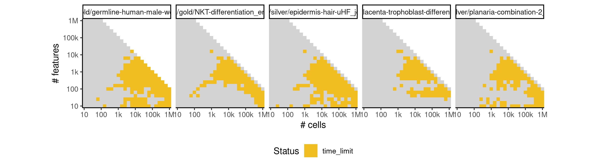

# recat


## ERROR STATUS METHOD_ERROR

### ERROR CLUSTER METHOD_ERROR -- 1


 * Number of instances: 79
 * Dataset ids: scaling_0001, scaling_0002, scaling_0003, scaling_0004, scaling_0006, scaling_0008, scaling_0010, scaling_0012, scaling_0016, scaling_0019, scaling_0022, scaling_0025, scaling_0041, scaling_0043, scaling_0045, scaling_0047, scaling_0051, scaling_0056, scaling_0061, scaling_0066, scaling_0076, scaling_0082, scaling_0088, scaling_0094, scaling_0106, scaling_0113, scaling_0120, scaling_0127, scaling_0151, scaling_0156, scaling_0157, scaling_0163, scaling_0169, scaling_0181, scaling_0188, scaling_0195, scaling_0202, scaling_0226, scaling_0231, scaling_0232, scaling_0237, scaling_0238, scaling_0243, scaling_0244, scaling_0248, scaling_0276, scaling_0286, scaling_0287, scaling_0298, scaling_0309, scaling_0341, scaling_0349, scaling_0351, scaling_0361, scaling_0371, scaling_0391, scaling_0402, scaling_0404, scaling_0417, scaling_0428, scaling_0429, scaling_0430, scaling_0440, scaling_0441, scaling_0456, scaling_0466, scaling_0476, scaling_0486, scaling_0531, scaling_0556, scaling_0565, scaling_0574, scaling_0582, scaling_0583, scaling_0714, scaling_0819, scaling_0877, scaling_0918, scaling_1034

Last 10 lines of scaling_0001:
```
Package 'mclust' version 5.4.1
Type 'citation("mclust")' for citing this R package in publications.
Attaching package: ‘mclust’
The following object is masked from ‘package:purrr’:
    map
Loading required package: TSP
[1] 1
Error in .solve_TSP(x, method, control, ...) : NAs not allowed!
Calls: <Anonymous> ... highCorFind -> solve_TSP -> solve_TSP.ATSP -> .solve_TSP
Execution halted
```

### ERROR CLUSTER METHOD_ERROR -- 2


 * Number of instances: 38
 * Dataset ids: scaling_0099, scaling_0133, scaling_0208, scaling_0249, scaling_0318, scaling_0319, scaling_0379, scaling_0380, scaling_0403, scaling_0442, scaling_0465, scaling_0494, scaling_0495, scaling_0521, scaling_0549, scaling_0590, scaling_0591, scaling_0616, scaling_0647, scaling_0662, scaling_0663, scaling_0664, scaling_0697, scaling_0746, scaling_0747, scaling_0748, scaling_0818, scaling_0835, scaling_0836, scaling_0837, scaling_0888, scaling_0897, scaling_0898, scaling_0899, scaling_0942, scaling_0974, scaling_1035, scaling_1036

Last 10 lines of scaling_0099:
```
Package 'mclust' version 5.4.1
Type 'citation("mclust")' for citing this R package in publications.
Attaching package: ‘mclust’
The following object is masked from ‘package:purrr’:
    map
Loading required package: TSP
Error in if (minDistance < 0 | minDistance > tmp[1]) { : 
  missing value where TRUE/FALSE needed
Calls: <Anonymous> ... forceTSPNext -> forceTSPNext -> forceTSPNext -> forceTSPNext
Execution halted
```

### ERROR CLUSTER METHOD_ERROR -- 3


 * Number of instances: 3
 * Dataset ids: scaling_0778, scaling_0815, scaling_0850

Last 10 lines of scaling_0778:
```
Package 'mclust' version 5.4.1
Type 'citation("mclust")' for citing this R package in publications.
Attaching package: ‘mclust’
The following object is masked from ‘package:purrr’:
    map
Loading required package: TSP
Error in if (any(c(mu, cholsigma) > signif(.Machine$double.xmax, 6))) { : 
  missing value where TRUE/FALSE needed
Calls: <Anonymous> ... eval -> mclustBIC -> mstep -> eval -> eval -> mstepVVV
Execution halted
```

### ERROR CLUSTER METHOD_ERROR -- 4


 * Number of instances: 2
 * Dataset ids: scaling_0907, scaling_1031

Last 10 lines of scaling_0907:
```
Loading required package: mclust
Package 'mclust' version 5.4.1
Type 'citation("mclust")' for citing this R package in publications.
Attaching package: ‘mclust’
The following object is masked from ‘package:purrr’:
    map
Error in unchol(cholSigma, upper = TRUE) : 
  NA/NaN/Inf in foreign function call (arg 2)
Calls: <Anonymous> ... mclustBIC -> mstep -> eval -> eval -> mstepEEE -> unchol
Execution halted
```

### ERROR CLUSTER METHOD_ERROR -- 5


 * Number of instances: 2
 * Dataset ids: scaling_0940, scaling_1047

Last 10 lines of scaling_0940:
```
Package 'mclust' version 5.4.1
Type 'citation("mclust")' for citing this R package in publications.
Attaching package: ‘mclust’
The following object is masked from ‘package:purrr’:
    map
Loading required package: TSP
Error in unchol(cholSigma, upper = TRUE) : 
  NA/NaN/Inf in foreign function call (arg 2)
Calls: <Anonymous> ... mclustBIC -> mstep -> eval -> eval -> mstepEEE -> unchol
Execution halted
```

### ERROR CLUSTER METHOD_ERROR -- 6


 * Number of instances: 2
 * Dataset ids: scaling_1032, scaling_1033

Last 10 lines of scaling_1032:
```
Loading required package: mclust
Package 'mclust' version 5.4.1
Type 'citation("mclust")' for citing this R package in publications.
Attaching package: ‘mclust’
The following object is masked from ‘package:purrr’:
    map
Error in if (any(c(mu, cholsigma) > signif(.Machine$double.xmax, 6))) { : 
  missing value where TRUE/FALSE needed
Calls: <Anonymous> ... eval -> mclustBIC -> mstep -> eval -> eval -> mstepVVV
Execution halted
```

## ERROR STATUS MEMORY_LIMIT

### ERROR CLUSTER MEMORY_LIMIT -- 1


 * Number of instances: 24
 * Dataset ids: scaling_0601, scaling_0617, scaling_0633, scaling_0649, scaling_0682, scaling_0699, scaling_0716, scaling_0733, scaling_0750, scaling_0768, scaling_0786, scaling_0804, scaling_0822, scaling_0840, scaling_0858, scaling_0869, scaling_0880, scaling_0891, scaling_0902, scaling_0952, scaling_0958, scaling_0964, scaling_0970, scaling_0976

Last 10 lines of scaling_0601:
```
Loading required package: parallel
Loading required package: mclust
Package 'mclust' version 5.4.1
Type 'citation("mclust")' for citing this R package in publications.
Attaching package: ‘mclust’
The following object is masked from ‘package:purrr’:
    map
Loading required package: TSP
Error: cannot allocate vector of size 3.0 Gb
Execution halted
```

### ERROR CLUSTER MEMORY_LIMIT -- 2


 * Number of instances: 46
 * Dataset ids: scaling_0681, scaling_0698, scaling_0715, scaling_0732, scaling_0766, scaling_0767, scaling_0784, scaling_0785, scaling_0802, scaling_0803, scaling_0820, scaling_0821, scaling_0839, scaling_0856, scaling_0857, scaling_0867, scaling_0868, scaling_0878, scaling_0879, scaling_0889, scaling_0890, scaling_0901, scaling_0911, scaling_0919, scaling_0927, scaling_0935, scaling_0943, scaling_0951, scaling_0957, scaling_0963, scaling_0969, scaling_0975, scaling_0981, scaling_0982, scaling_0983, scaling_0995, scaling_0996, scaling_0997, scaling_1009, scaling_1010, scaling_1011, scaling_1023, scaling_1024, scaling_1025, scaling_1038, scaling_1039

Last 10 lines of scaling_0681:
```
Loading required package: iterators
Loading required package: parallel
Loading required package: mclust
Package 'mclust' version 5.4.1
Type 'citation("mclust")' for citing this R package in publications.
Attaching package: ‘mclust’
The following object is masked from ‘package:purrr’:
    map
Error: cannot allocate vector of size 11.2 Gb
Execution halted
```

## ERROR STATUS TIME_LIMIT

### ERROR CLUSTER TIME_LIMIT -- 1


 * Number of instances: 107
 * Dataset ids: scaling_0024, scaling_0110, scaling_0112, scaling_0126, scaling_0160, scaling_0180, scaling_0215, scaling_0235, scaling_0262, scaling_0275, scaling_0308, scaling_0329, scaling_0330, scaling_0340, scaling_0350, scaling_0356, scaling_0370, scaling_0390, scaling_0398, scaling_0424, scaling_0454, scaling_0455, scaling_0461, scaling_0481, scaling_0485, scaling_0505, scaling_0512, scaling_0525, scaling_0543, scaling_0547, scaling_0555, scaling_0563, scaling_0564, scaling_0570, scaling_0579, scaling_0581, scaling_0597, scaling_0600, scaling_0610, scaling_0614, scaling_0615, scaling_0625, scaling_0642, scaling_0646, scaling_0648, scaling_0675, scaling_0678, scaling_0680, scaling_0691, scaling_0695, scaling_0696, scaling_0707, scaling_0725, scaling_0729, scaling_0731, scaling_0777, scaling_0781, scaling_0782, scaling_0783, scaling_0794, scaling_0813, scaling_0814, scaling_0817, scaling_0831, scaling_0834, scaling_0852, scaling_0855, scaling_0863, scaling_0865, scaling_0866, scaling_0887, scaling_0896, scaling_0906, scaling_0908, scaling_0917, scaling_0923, scaling_0932, scaling_0933, scaling_0934, scaling_0941, scaling_0948, scaling_0954, scaling_0955, scaling_0956, scaling_0960, scaling_0966, scaling_0967, scaling_0968, scaling_0972, scaling_0978, scaling_0988, scaling_0989, scaling_0990, scaling_0991, scaling_0994, scaling_1002, scaling_1003, scaling_1016, scaling_1017, scaling_1018, scaling_1019, scaling_1021, scaling_1022, scaling_1030, scaling_1044, scaling_1045, scaling_1046

Last 10 lines of scaling_0024:
```
File: /home/rcannood/Workspace/dynverse/dynbenchmark//derived/05-scaling/suite/recat/10/r2gridengine/20180924_185049_recat_10_trwdNPSWqI/log/log.24.e.txt
```


