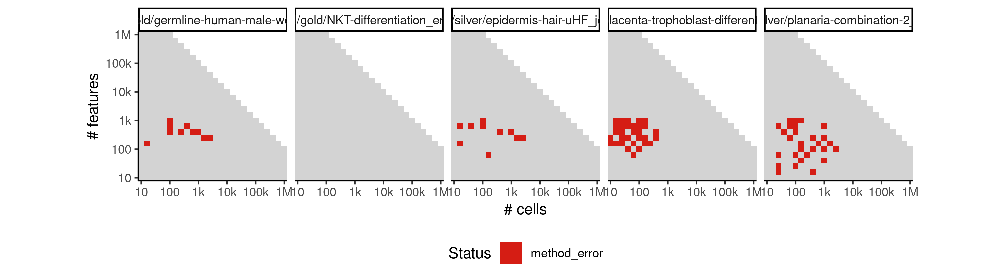
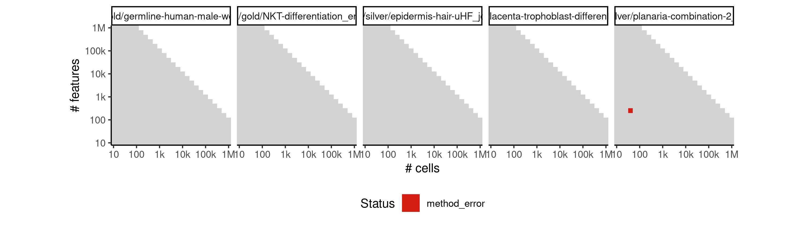

# scimitar


## ERROR STATUS METHOD_ERROR

### ERROR CLUSTER METHOD_ERROR -- 1


 * Number of instances: 61
 * Dataset ids: scaling_0002, scaling_0010, scaling_0023, scaling_0036, scaling_0040, scaling_0050, scaling_0053, scaling_0064, scaling_0082, scaling_0087, scaling_0090, scaling_0103, scaling_0113, scaling_0115, scaling_0121, scaling_0125, scaling_0137, scaling_0143, scaling_0157, scaling_0177, scaling_0188, scaling_0189, scaling_0190, scaling_0220, scaling_0232, scaling_0244, scaling_0260, scaling_0261, scaling_0273, scaling_0287, scaling_0288, scaling_0289, scaling_0290, scaling_0291, scaling_0309, scaling_0323, scaling_0331, scaling_0333, scaling_0351, scaling_0353, scaling_0354, scaling_0371, scaling_0372, scaling_0392, scaling_0404, scaling_0406, scaling_0407, scaling_0414, scaling_0415, scaling_0430, scaling_0431, scaling_0458, scaling_0464, scaling_0467, scaling_0506, scaling_0518, scaling_0566, scaling_0567, scaling_0596, scaling_0760, scaling_0790

Last 10 lines of scaling_0002:
```
  File "/usr/local/lib/python2.7/site-packages/scimitar/morphing_mixture.py", line 309, in morphing_mixture_from_pseudotime
    covariances.append(np.copy(corpcor.cov_shrink(data_array, weights=weights, **{'lambda':cov_reg})))
  File "/usr/local/lib/python2.7/site-packages/pyroconductor/corpcor.py", line 12, in cov_shrink
    **kwargs)
  File "/usr/local/lib/python2.7/site-packages/rpy2/robjects/functions.py", line 178, in __call__
    return super(SignatureTranslatedFunction, self).__call__(*args, **kwargs)
  File "/usr/local/lib/python2.7/site-packages/rpy2/robjects/functions.py", line 106, in __call__
    res = super(Function, self).__call__(*new_args, **new_kwargs)
rpy2.rinterface.RRuntimeError: Error in if (denominator == 0) lambda.var = 1 else lambda.var = max(0,  : 
  missing value where TRUE/FALSE needed
```

### ERROR CLUSTER METHOD_ERROR -- 2


 * Number of instances: 128
 * Dataset ids: scaling_0003, scaling_0008, scaling_0009, scaling_0016, scaling_0019, scaling_0022, scaling_0024, scaling_0029, scaling_0033, scaling_0039, scaling_0043, scaling_0045, scaling_0056, scaling_0061, scaling_0072, scaling_0083, scaling_0084, scaling_0088, scaling_0089, scaling_0092, scaling_0101, scaling_0105, scaling_0120, scaling_0135, scaling_0138, scaling_0139, scaling_0140, scaling_0141, scaling_0144, scaling_0158, scaling_0160, scaling_0163, scaling_0176, scaling_0179, scaling_0180, scaling_0181, scaling_0183, scaling_0195, scaling_0202, scaling_0211, scaling_0215, scaling_0216, scaling_0224, scaling_0226, scaling_0227, scaling_0229, scaling_0233, scaling_0235, scaling_0238, scaling_0239, scaling_0251, scaling_0253, scaling_0256, scaling_0257, scaling_0258, scaling_0275, scaling_0276, scaling_0277, scaling_0279, scaling_0280, scaling_0293, scaling_0298, scaling_0303, scaling_0310, scaling_0321, scaling_0322, scaling_0327, scaling_0329, scaling_0341, scaling_0342, scaling_0343, scaling_0344, scaling_0352, scaling_0361, scaling_0370, scaling_0382, scaling_0383, scaling_0386, scaling_0387, scaling_0393, scaling_0394, scaling_0395, scaling_0398, scaling_0399, scaling_0405, scaling_0408, scaling_0409, scaling_0417, scaling_0425, scaling_0432, scaling_0444, scaling_0452, scaling_0457, scaling_0459, scaling_0468, scaling_0469, scaling_0470, scaling_0485, scaling_0487, scaling_0497, scaling_0522, scaling_0527, scaling_0528, scaling_0533, scaling_0534, scaling_0537, scaling_0558, scaling_0560, scaling_0593, scaling_0605, scaling_0608, scaling_0609, scaling_0621, scaling_0622, scaling_0623, scaling_0624, scaling_0630, scaling_0645, scaling_0672, scaling_0688, scaling_0689, scaling_0703, scaling_0704, scaling_0757, scaling_0794, scaling_0795, scaling_0811, scaling_0848

Last 10 lines of scaling_0003:
```
    pseudotimes, cov_estimator=cov_estimator, **kwargs)
  File "/usr/local/lib/python2.7/site-packages/scimitar/morphing_mixture.py", line 325, in morphing_mixture_from_pseudotime
    timepoints=timepoints)
  File "/usr/local/lib/python2.7/site-packages/scimitar/morphing_mixture.py", line 202, in state_interpolation
    sorted_chols = np.array([np.linalg.cholesky(c).tolist() for c in sorted_covariances])
  File "/usr/local/lib/python2.7/site-packages/numpy/linalg/linalg.py", line 733, in cholesky
    r = gufunc(a, signature=signature, extobj=extobj)
  File "/usr/local/lib/python2.7/site-packages/numpy/linalg/linalg.py", line 92, in _raise_linalgerror_nonposdef
    raise LinAlgError("Matrix is not positive definite")
numpy.linalg.linalg.LinAlgError: Matrix is not positive definite
```

### ERROR CLUSTER METHOD_ERROR -- 3


 * Number of instances: 72
 * Dataset ids: scaling_0006, scaling_0030, scaling_0051, scaling_0073, scaling_0074, scaling_0080, scaling_0104, scaling_0122, scaling_0145, scaling_0149, scaling_0164, scaling_0165, scaling_0166, scaling_0197, scaling_0199, scaling_0201, scaling_0210, scaling_0214, scaling_0234, scaling_0240, scaling_0252, scaling_0254, scaling_0264, scaling_0265, scaling_0272, scaling_0278, scaling_0281, scaling_0299, scaling_0301, scaling_0302, scaling_0304, scaling_0306, scaling_0324, scaling_0325, scaling_0326, scaling_0339, scaling_0355, scaling_0364, scaling_0365, scaling_0366, scaling_0367, scaling_0384, scaling_0420, scaling_0421, scaling_0422, scaling_0423, scaling_0424, scaling_0448, scaling_0451, scaling_0461, scaling_0483, scaling_0501, scaling_0507, scaling_0515, scaling_0524, scaling_0554, scaling_0561, scaling_0577, scaling_0597, scaling_0598, scaling_0641, scaling_0643, scaling_0674, scaling_0676, scaling_0723, scaling_0726, scaling_0758, scaling_0775, scaling_0776, scaling_0810, scaling_0872, scaling_0905

Last 10 lines of scaling_0006:
```
    cov_reg=p["cov_reg"]
  File "/usr/local/lib/python2.7/site-packages/scimitar/morphing_mixture.py", line 125, in refine
    fit_type=self.fit_type, degree=self.degree, **kwargs)
  File "/usr/local/lib/python2.7/site-packages/scimitar/morphing_mixture.py", line 325, in morphing_mixture_from_pseudotime
    timepoints=timepoints)
  File "/usr/local/lib/python2.7/site-packages/scimitar/morphing_mixture.py", line 221, in state_interpolation
    spl = UnivariateSpline(timepoints, sorted_means[:, i], k=degree, w=sorted_covariances[:, i, i])
  File "/usr/local/lib/python2.7/site-packages/scipy/interpolate/fitpack2.py", line 185, in __init__
    xb=bbox[0],xe=bbox[1],s=s)
dfitpack.error: (m>k) failed for hidden m: fpcurf0:m=2
```

### ERROR CLUSTER METHOD_ERROR -- 4


 * Number of instances: 1
 * Dataset ids: scaling_0011

Last 10 lines of scaling_0011:
```
    covariances.append(np.copy(corpcor.cov_shrink(data_array, weights=weights, **{'lambda':cov_reg})))
  File "/usr/local/lib/python2.7/site-packages/pyroconductor/corpcor.py", line 12, in cov_shrink
    **kwargs)
  File "/usr/local/lib/python2.7/site-packages/rpy2/robjects/functions.py", line 178, in __call__
    return super(SignatureTranslatedFunction, self).__call__(*args, **kwargs)
  File "/usr/local/lib/python2.7/site-packages/rpy2/robjects/functions.py", line 106, in __call__
    res = super(Function, self).__call__(*new_args, **new_kwargs)
rpy2.rinterface.RRuntimeError: Error in if (denominator == 0) lambda.var = 1 else lambda.var = max(0,  : 
  missing value where TRUE/FALSE needed
ity lambda.var (variance vector): 
```

### ERROR CLUSTER METHOD_ERROR -- 5


 * Number of instances: 4
 * Dataset ids: scaling_0766, scaling_0784, scaling_0802, scaling_0820

Last 10 lines of scaling_0766:
```
    self._fit_transform(X)
  File "/usr/local/lib/python2.7/site-packages/sklearn/manifold/locally_linear.py", line 645, in _fit_transform
    random_state=random_state, reg=self.reg, n_jobs=self.n_jobs)
  File "/usr/local/lib/python2.7/site-packages/sklearn/manifold/locally_linear.py", line 511, in locally_linear_embedding
    tol=tol, max_iter=max_iter, random_state=random_state)
  File "/usr/local/lib/python2.7/site-packages/sklearn/manifold/locally_linear.py", line 179, in null_space
    M, eigvals=(k_skip, k + k_skip - 1), overwrite_a=True)
  File "/usr/local/lib/python2.7/site-packages/scipy/linalg/decomp.py", line 436, in eigh
    il=lo, iu=hi, overwrite_a=overwrite_a)
KeyboardInterrupt
```

## ERROR STATUS TIME_LIMIT

### ERROR CLUSTER TIME_LIMIT -- 1


 * Number of instances: 108
 * Dataset ids: scaling_0300, scaling_0335, scaling_0337, scaling_0362, scaling_0363, scaling_0419, scaling_0433, scaling_0445, scaling_0446, scaling_0447, scaling_0460, scaling_0478, scaling_0479, scaling_0480, scaling_0488, scaling_0489, scaling_0498, scaling_0499, scaling_0500, scaling_0539, scaling_0540, scaling_0545, scaling_0546, scaling_0551, scaling_0552, scaling_0559, scaling_0564, scaling_0568, scaling_0573, scaling_0582, scaling_0591, scaling_0595, scaling_0600, scaling_0606, scaling_0607, scaling_0615, scaling_0631, scaling_0638, scaling_0639, scaling_0640, scaling_0647, scaling_0654, scaling_0655, scaling_0663, scaling_0670, scaling_0671, scaling_0679, scaling_0694, scaling_0695, scaling_0705, scaling_0706, scaling_0711, scaling_0712, scaling_0722, scaling_0728, scaling_0729, scaling_0739, scaling_0745, scaling_0746, scaling_0756, scaling_0762, scaling_0763, scaling_0774, scaling_0778, scaling_0779, scaling_0792, scaling_0796, scaling_0797, scaling_0814, scaling_0815, scaling_0832, scaling_0833, scaling_0846, scaling_0850, scaling_0851, scaling_0861, scaling_0883, scaling_0894, scaling_0911, scaling_0915, scaling_0916, scaling_0919, scaling_0923, scaling_0924, scaling_0927, scaling_0931, scaling_0932, scaling_0935, scaling_0939, scaling_0940, scaling_0943, scaling_0947, scaling_0948, scaling_0954, scaling_0960, scaling_0966, scaling_0972, scaling_0978, scaling_0982, scaling_0988, scaling_0996, scaling_1002, scaling_1010, scaling_1016, scaling_1024, scaling_1030, scaling_1038, scaling_1044

Last 10 lines of scaling_0300:
```
File: /home/rcannood/Workspace/dynverse/dynbenchmark//derived/05-scaling/suite/scimitar/10/r2gridengine/20180825_051132_scimitar_10_ihbLMY4o3H/log/log.300.e.txt
```

## ERROR STATUS MEMORY_LIMIT

### ERROR CLUSTER MEMORY_LIMIT -- 1


 * Number of instances: 31
 * Dataset ids: scaling_0391, scaling_0510, scaling_0514, scaling_0557, scaling_0575, scaling_0584, scaling_0604, scaling_0620, scaling_0636, scaling_0652, scaling_0668, scaling_0685, scaling_0702, scaling_0719, scaling_0736, scaling_0753, scaling_0771, scaling_0789, scaling_0807, scaling_0825, scaling_0843, scaling_0913, scaling_0921, scaling_0929, scaling_0937, scaling_0945, scaling_0986, scaling_1000, scaling_1014, scaling_1028, scaling_1042

Last 10 lines of scaling_0391:
```
intensity lambda.var (variance vector): 1 
Specified shrinkage intensity lambda (correlation matrix): 0.05 
    cov_reg=p["cov_reg"]
  File "/usr/local/lib/python2.7/site-packages/scimitar/morphing_mixture.py", line 396, in morphing_gaussian_from_embedding
    pseudotimes, cov_estimator=cov_estimator, **kwargs)
  File "/usr/local/lib/python2.7/site-packages/scimitar/morphing_mixture.py", line 325, in morphing_mixture_from_pseudotime
    timepoints=timepoints)
  File "/usr/local/lib/python2.7/site-packages/scimitar/morphing_mixture.py", line 202, in state_interpolation
    sorted_chols = np.array([np.linalg.cholesky(c).tolist() for c in sorted_covariances])
MemoryError
```

### ERROR CLUSTER MEMORY_LIMIT -- 2


 * Number of instances: 3
 * Dataset ids: scaling_0418, scaling_0594, scaling_0930

Last 10 lines of scaling_0418:
```
Estimating optimal shrinkage intensity lambda.var (variance vector): 1 
Specified shrinkage intensity lambda (correlation matrix): 0.05 
Estimating optimal shrinkage intensity lambda.var (variance vector): 1 
Specified shrinkage intensity lambda (correlation matrix): 0.05 
Estimating optimal shrinkage intensity lambda.var (variance vector): 1 
Specified shrinkage intensity lambda (correlation matrix): 0.05 
Traceback (most recent call last):
  File "/usr/local/lib/python2.7/site-packages/scimitar/morphing_mixture.py", line 245, in state_interpolation
    spl = UnivariateSpline(timepoints, sorted_chols[:, j, i], k=degree)
MemoryError
```

### ERROR CLUSTER MEMORY_LIMIT -- 3


 * Number of instances: 51
 * Dataset ids: scaling_0456, scaling_0466, scaling_0476, scaling_0486, scaling_0526, scaling_0532, scaling_0538, scaling_0544, scaling_0550, scaling_0556, scaling_0565, scaling_0574, scaling_0583, scaling_0602, scaling_0603, scaling_0618, scaling_0619, scaling_0634, scaling_0635, scaling_0650, scaling_0651, scaling_0666, scaling_0667, scaling_0683, scaling_0684, scaling_0700, scaling_0701, scaling_0717, scaling_0718, scaling_0734, scaling_0735, scaling_0751, scaling_0752, scaling_0769, scaling_0787, scaling_0805, scaling_0823, scaling_0841, scaling_0912, scaling_0920, scaling_0928, scaling_0936, scaling_0944, scaling_0984, scaling_0985, scaling_0998, scaling_0999, scaling_1012, scaling_1013, scaling_1026, scaling_1040

Last 10 lines of scaling_0456:
```
Traceback (most recent call last):
  File "/code/run.sh", line 31, in <module>
    cov_reg=p["cov_reg"]
  File "/usr/local/lib/python2.7/site-packages/scimitar/morphing_mixture.py", line 396, in morphing_gaussian_from_embedding
    pseudotimes, cov_estimator=cov_estimator, **kwargs)
  File "/usr/local/lib/python2.7/site-packages/scimitar/morphing_mixture.py", line 309, in morphing_mixture_from_pseudotime
    covariances.append(np.copy(corpcor.cov_shrink(data_array, weights=weights, **{'lambda':cov_reg})))
  File "/usr/local/lib/python2.7/site-packages/numpy/lib/function_base.py", line 733, in copy
    return array(a, order=order, copy=True)
MemoryError
```

### ERROR CLUSTER MEMORY_LIMIT -- 4


 * Number of instances: 1
 * Dataset ids: scaling_0477

Last 10 lines of scaling_0477:
```
Estimating optimal shrinkage intensity lambda.var (variance vector): 1 
Specified shrinkage intensity lambda (correlation matrix): 0.05 
Estimating optimal shrinkage intensity lambda.var (variance vector): 1 
Specified shrinkage intensity lambda (correlation matrix): 0.05 
Estimating optimal shrinkage intensity lambda.var (variance vector): 1 
Specified shrinkage intensity lambda (correlation matrix): 0.05 
Traceback (most recent call last):
  File "/usr/local/lib/python2.7/site-packages/scipy/interpolate/fitpack2.py", line 185, in __init__
    xb=bbox[0],xe=bbox[1],s=s)
MemoryError
```

### ERROR CLUSTER MEMORY_LIMIT -- 5


 * Number of instances: 1
 * Dataset ids: scaling_0576

Last 10 lines of scaling_0576:
```
Estimating optimal shrinkage intensity lambda.var (variance vector): 1 
Specified shrinkage intensity lambda (correlation matrix): 0.05 
Estimating optimal shrinkage intensity lambda.var (variance vector): 1 
Specified shrinkage intensity lambda (correlation matrix): 0.05 
EstimTraceback (most recent call last):
  File "/usr/local/lib/python2.7/site-packages/numpy/core/numeric.py", line 553, in asanyarray
ating optimal shrinkage intensity lambda.var (variance vector): 1 
Specified shrinkage intensity lambda (correlation matrix): 0.05 
    return array(a, dtype, copy=False, order=order, subok=True)
MemoryError
```

### ERROR CLUSTER MEMORY_LIMIT -- 6


 * Number of instances: 4
 * Dataset ids: scaling_0585, scaling_0653, scaling_0844, scaling_0922

Last 10 lines of scaling_0585:
```
g optimal shrinkage intensity lambda.var (variance vector): 0.4081 
Specified shrinkage intensity lambda (correlation matrix): 0.05 
    pseudotimes, cov_estimator=cov_estimator, **kwargs)
  File "/usr/local/lib/python2.7/site-packages/scimitar/morphing_mixture.py", line 325, in morphing_mixture_from_pseudotime
    timepoints=timepoints)
  File "/usr/local/lib/python2.7/site-packages/scimitar/morphing_mixture.py", line 245, in state_interpolation
    spl = UnivariateSpline(timepoints, sorted_chols[:, j, i], k=degree)
  File "/usr/local/lib/python2.7/site-packages/scipy/interpolate/fitpack2.py", line 175, in __init__
    if not all(diff(x) > 0.0):
MemoryError
```

### ERROR CLUSTER MEMORY_LIMIT -- 7


 * Number of instances: 43
 * Dataset ids: scaling_0601, scaling_0617, scaling_0633, scaling_0649, scaling_0681, scaling_0682, scaling_0698, scaling_0699, scaling_0715, scaling_0716, scaling_0732, scaling_0733, scaling_0750, scaling_0767, scaling_0768, scaling_0785, scaling_0786, scaling_0803, scaling_0804, scaling_0821, scaling_0822, scaling_0839, scaling_0840, scaling_0857, scaling_0858, scaling_0868, scaling_0869, scaling_0879, scaling_0880, scaling_0890, scaling_0891, scaling_0901, scaling_0902, scaling_0952, scaling_0958, scaling_0964, scaling_0970, scaling_0976, scaling_0983, scaling_0997, scaling_1011, scaling_1025, scaling_1039

Last 10 lines of scaling_0601:
```
    pseudotimes, cov_estimator=cov_estimator, **kwargs)
  File "/usr/local/lib/python2.7/site-packages/scimitar/morphing_mixture.py", line 309, in morphing_mixture_from_pseudotime
    covariances.append(np.copy(corpcor.cov_shrink(data_array, weights=weights, **{'lambda':cov_reg})))
  File "/usr/local/lib/python2.7/site-packages/pyroconductor/corpcor.py", line 12, in cov_shrink
    **kwargs)
  File "/usr/local/lib/python2.7/site-packages/rpy2/robjects/functions.py", line 178, in __call__
    return super(SignatureTranslatedFunction, self).__call__(*args, **kwargs)
  File "/usr/local/lib/python2.7/site-packages/rpy2/robjects/functions.py", line 106, in __call__
    res = super(Function, self).__call__(*new_args, **new_kwargs)
rpy2.rinterface.RRuntimeError: Error: cannot allocate vector of size 762.9 Mb
```

### ERROR CLUSTER MEMORY_LIMIT -- 8


 * Number of instances: 5
 * Dataset ids: scaling_0616, scaling_0632, scaling_0648, scaling_0664, scaling_0680

Last 10 lines of scaling_0616:
```
    self._fit_transform(X)
  File "/usr/local/lib/python2.7/site-packages/sklearn/manifold/locally_linear.py", line 645, in _fit_transform
    random_state=random_state, reg=self.reg, n_jobs=self.n_jobs)
  File "/usr/local/lib/python2.7/site-packages/sklearn/manifold/locally_linear.py", line 310, in locally_linear_embedding
    nbrs, n_neighbors=n_neighbors, reg=reg, n_jobs=n_jobs)
  File "/usr/local/lib/python2.7/site-packages/sklearn/manifold/locally_linear.py", line 103, in barycenter_kneighbors_graph
    data = barycenter_weights(X, X[ind], reg=reg)
  File "/usr/local/lib/python2.7/site-packages/sklearn/manifold/locally_linear.py", line 48, in barycenter_weights
    B = np.empty((n_samples, n_neighbors), dtype=X.dtype)
MemoryError
```

### ERROR CLUSTER MEMORY_LIMIT -- 9


 * Number of instances: 4
 * Dataset ids: scaling_0637, scaling_0669, scaling_0808, scaling_1029

Last 10 lines of scaling_0637:
```
Estimating optimal shrinkage intensity lambda.var (variance vector): 1 
Specified shrinkage intensity lambda (correlation matrix): 0.05 
Estimating optimal shrinkage intensity lambda.var (variance vector): 1 
Specified shrinkage intensity lambda (correlation matrix): 0.05 
Traceback (most recent call last):
  File "/usr/local/lib/python2.7/site-packages/scimitar/morphing_mixture.py", line 245, in state_interpolation
    spl = UnivariateSpline(timepoints, sorted_chols[:, j, i], k=degree)
  File "/usr/local/lib/python2.7/site-packages/scipy/interpolate/fitpack2.py", line 185, in __init__
    xb=bbox[0],xe=bbox[1],s=s)
MemoryError
```

### ERROR CLUSTER MEMORY_LIMIT -- 10


 * Number of instances: 8
 * Dataset ids: scaling_0686, scaling_0720, scaling_0737, scaling_0754, scaling_0987, scaling_1001, scaling_1015, scaling_1043

Last 10 lines of scaling_0686:
```
Traceback (most recent call last):
  File "/code/run.sh", line 31, in <module>
    cov_reg=p["cov_reg"]
  File "/usr/local/lib/python2.7/site-packages/scimitar/morphing_mixture.py", line 396, in morphing_gaussian_from_embedding
    pseudotimes, cov_estimator=cov_estimator, **kwargs)
  File "/usr/local/lib/python2.7/site-packages/scimitar/morphing_mixture.py", line 325, in morphing_mixture_from_pseudotime
    timepoints=timepoints)
  File "/usr/local/lib/python2.7/site-packages/scimitar/morphing_mixture.py", line 213, in state_interpolation
    chol_coeffs = np.zeros([degree + 1, dim, dim])
MemoryError
```

### ERROR CLUSTER MEMORY_LIMIT -- 11


 * Number of instances: 3
 * Dataset ids: scaling_0687, scaling_0845, scaling_0882

Last 10 lines of scaling_0687:
```
  File "/usr/local/lib/python2.7/site-packages/scimitar/morphing_mixture.py", line 104, in map_samples_to_pseudotime
    covs = self.covariance(timepoints)
  File "/usr/local/lib/python2.7/site-packages/scimitar/morphing_mixture.py", line 64, in covariance
    cov_matrices.append(self._calculate_covariance(t))
  File "/usr/local/lib/python2.7/site-packages/scimitar/morphing_mixture.py", line 55, in _calculate_covariance
    return np.dot(chol_matrix, chol_matrix.T)
MemoryError
mating optimal shrinkage intensity lambda.var (variance vector): 0.1413 
Specified shrinkage intensity lambda (correlation matrix): 0.05 
Initializing
```

### ERROR CLUSTER MEMORY_LIMIT -- 12


 * Number of instances: 50
 * Dataset ids: scaling_0696, scaling_0713, scaling_0730, scaling_0747, scaling_0764, scaling_0780, scaling_0781, scaling_0798, scaling_0799, scaling_0816, scaling_0817, scaling_0834, scaling_0835, scaling_0852, scaling_0853, scaling_0863, scaling_0864, scaling_0874, scaling_0875, scaling_0885, scaling_0886, scaling_0896, scaling_0897, scaling_0907, scaling_0908, scaling_0917, scaling_0925, scaling_0933, scaling_0941, scaling_0949, scaling_0955, scaling_0961, scaling_0967, scaling_0973, scaling_0979, scaling_0989, scaling_0990, scaling_0991, scaling_1003, scaling_1004, scaling_1005, scaling_1017, scaling_1018, scaling_1019, scaling_1031, scaling_1032, scaling_1033, scaling_1045, scaling_1046, scaling_1047

Last 10 lines of scaling_0696:
```
    pseudotimes = embedding.fit_transform(denoised_data_array)
  File "/usr/local/lib/python2.7/site-packages/sklearn/manifold/locally_linear.py", line 678, in fit_transform
    self._fit_transform(X)
  File "/usr/local/lib/python2.7/site-packages/sklearn/manifold/locally_linear.py", line 645, in _fit_transform
    random_state=random_state, reg=self.reg, n_jobs=self.n_jobs)
  File "/usr/local/lib/python2.7/site-packages/sklearn/manifold/locally_linear.py", line 310, in locally_linear_embedding
    nbrs, n_neighbors=n_neighbors, reg=reg, n_jobs=n_jobs)
  File "/usr/local/lib/python2.7/site-packages/sklearn/manifold/locally_linear.py", line 103, in barycenter_kneighbors_graph
    data = barycenter_weights(X, X[ind], reg=reg)
MemoryError
```

### ERROR CLUSTER MEMORY_LIMIT -- 13


 * Number of instances: 20
 * Dataset ids: scaling_0697, scaling_0714, scaling_0731, scaling_0748, scaling_0765, scaling_0782, scaling_0800, scaling_0818, scaling_0836, scaling_0854, scaling_0865, scaling_0876, scaling_0887, scaling_0898, scaling_0909, scaling_0992, scaling_1006, scaling_1020, scaling_1034, scaling_1048

Last 10 lines of scaling_0697:
```
    nbrs, n_neighbors=n_neighbors, reg=reg, n_jobs=n_jobs)
  File "/usr/local/lib/python2.7/site-packages/sklearn/manifold/locally_linear.py", line 102, in barycenter_kneighbors_graph
    ind = knn.kneighbors(X, return_distance=False)[:, 1:]
  File "/usr/local/lib/python2.7/site-packages/sklearn/neighbors/base.py", line 363, in kneighbors
    neigh_ind = np.argpartition(dist, n_neighbors - 1, axis=1)
  File "/usr/local/lib/python2.7/site-packages/numpy/core/fromnumeric.py", line 757, in argpartition
    return _wrapfunc(a, 'argpartition', kth, axis=axis, kind=kind, order=order)
  File "/usr/local/lib/python2.7/site-packages/numpy/core/fromnumeric.py", line 51, in _wrapfunc
    return getattr(obj, method)(*args, **kwds)
MemoryError
```

### ERROR CLUSTER MEMORY_LIMIT -- 14


 * Number of instances: 16
 * Dataset ids: scaling_0721, scaling_0738, scaling_0755, scaling_0773, scaling_0791, scaling_0809, scaling_0827, scaling_0860, scaling_0871, scaling_0893, scaling_0904, scaling_0953, scaling_0959, scaling_0965, scaling_0971, scaling_0977

Last 10 lines of scaling_0721:
```
    cov_reg=p["cov_reg"]
  File "/usr/local/lib/python2.7/site-packages/scimitar/morphing_mixture.py", line 117, in refine
    prev_pseudotimes, prev_pt_probs = self.map_samples_to_pseudotime(data_array)
  File "/usr/local/lib/python2.7/site-packages/scimitar/morphing_mixture.py", line 104, in map_samples_to_pseudotime
    covs = self.covariance(timepoints)
  File "/usr/local/lib/python2.7/site-packages/scimitar/morphing_mixture.py", line 64, in covariance
    cov_matrices.append(self._calculate_covariance(t))
  File "/usr/local/lib/python2.7/site-packages/scimitar/morphing_mixture.py", line 55, in _calculate_covariance
    return np.dot(chol_matrix, chol_matrix.T)
MemoryError
```

### ERROR CLUSTER MEMORY_LIMIT -- 15


 * Number of instances: 12
 * Dataset ids: scaling_0770, scaling_0788, scaling_0806, scaling_0824, scaling_0842, scaling_0859, scaling_0870, scaling_0881, scaling_0892, scaling_0903, scaling_1027, scaling_1041

Last 10 lines of scaling_0770:
```
Traceback (most recent call last):
  File "/code/run.sh", line 31, in <module>
    cov_reg=p["cov_reg"]
  File "/usr/local/lib/python2.7/site-packages/scimitar/morphing_mixture.py", line 396, in morphing_gaussian_from_embedding
    pseudotimes, cov_estimator=cov_estimator, **kwargs)
  File "/usr/local/lib/python2.7/site-packages/scimitar/morphing_mixture.py", line 309, in morphing_mixture_from_pseudotime
    covariances.append(np.copy(corpcor.cov_shrink(data_array, weights=weights, **{'lambda':cov_reg})))
  File "/usr/local/lib/python2.7/site-packages/pyroconductor/corpcor.py", line 13, in cov_shrink
    return np.array(res)
MemoryError
```

### ERROR CLUSTER MEMORY_LIMIT -- 16


 * Number of instances: 1
 * Dataset ids: scaling_0772

Last 10 lines of scaling_0772:
```
Estimating optimal shrinkage intensity lambda.var (variance vector): 0.0445 
Specified shrinkage intensity lambda (correlation matrix): 0.05 
Estimating optimal shrinkage intensity lambda.var (variance vector): 0.0753 
Specified shrinkage intensity lambda (correlation matrix): 0.05 
EstiTraceback (most recent call last):
  File "/usr/local/lib/python2.7/site-packages/scipy/interpolate/fitpack2.py", line 185, in __init__
mating optimal shrinkage intensity lambda.var (variance vector): 0.1531 
Specified shrinkage intensity lambda (correlation matrix): 0.05 
    xb=bbox[0],xe=bbox[1],s=s)
MemoryError
```

### ERROR CLUSTER MEMORY_LIMIT -- 17


 * Number of instances: 15
 * Dataset ids: scaling_0783, scaling_0801, scaling_0819, scaling_0837, scaling_0855, scaling_0918, scaling_0926, scaling_0934, scaling_0942, scaling_0950, scaling_0993, scaling_1007, scaling_1021, scaling_1035, scaling_1049

Last 10 lines of scaling_0783:
```
    n_jobs=n_jobs, squared=True)
  File "/usr/local/lib/python2.7/site-packages/sklearn/metrics/pairwise.py", line 1247, in pairwise_distances
    return _parallel_pairwise(X, Y, func, n_jobs, **kwds)
  File "/usr/local/lib/python2.7/site-packages/sklearn/metrics/pairwise.py", line 1090, in _parallel_pairwise
    return func(X, Y, **kwds)
  File "/usr/local/lib/python2.7/site-packages/sklearn/metrics/pairwise.py", line 246, in euclidean_distances
    distances = safe_sparse_dot(X, Y.T, dense_output=True)
  File "/usr/local/lib/python2.7/site-packages/sklearn/utils/extmath.py", line 140, in safe_sparse_dot
    return np.dot(a, b)
MemoryError
```

### ERROR CLUSTER MEMORY_LIMIT -- 18


 * Number of instances: 1
 * Dataset ids: scaling_0826

Last 10 lines of scaling_0826:
```
Estimating optimal shrinkage intensity lambda.var (variance vector): 0.0589 
Specified shrinkage intensity lambda (correlation matrix): 0.05 
Estimating optimal shrinkage intensity lambda.var (variance vector): 0.0568 
Specified shrinkage intensity lambda (correlation matrix): 0.Traceback (most recent call last):
  File "/usr/local/lib/python2.7/site-packages/scimitar/morphing_mixture.py", line 245, in state_interpolation
05 
Estimating optimal shrinkage intensity lambda.var (variance vector): 0.0724 
Specified shrinkage intensity lambda (correlation matrix): 0.05 
    spl = UnivariateSpline(timepoints, sorted_chols[:, j, i], k=degree)
MemoryError
```

### ERROR CLUSTER MEMORY_LIMIT -- 19


 * Number of instances: 28
 * Dataset ids: scaling_0856, scaling_0866, scaling_0867, scaling_0877, scaling_0878, scaling_0888, scaling_0889, scaling_0899, scaling_0910, scaling_0951, scaling_0956, scaling_0957, scaling_0962, scaling_0963, scaling_0968, scaling_0969, scaling_0974, scaling_0975, scaling_0980, scaling_0981, scaling_0994, scaling_0995, scaling_1008, scaling_1009, scaling_1022, scaling_1023, scaling_1036, scaling_1050

Last 10 lines of scaling_0856:
```
Traceback (most recent call last):
  File "/code/run.sh", line 31, in <module>
    cov_reg=p["cov_reg"]
  File "/usr/local/lib/python2.7/site-packages/scimitar/morphing_mixture.py", line 394, in morphing_gaussian_from_embedding
    pseudotimes = pseudotimes_from_embedding(data_array, n_neighbors=n_neighbors)
  File "/usr/local/lib/python2.7/site-packages/scimitar/morphing_mixture.py", line 403, in pseudotimes_from_embedding
    u, s, v = np.linalg.svd(data_array, full_matrices=1)
  File "/usr/local/lib/python2.7/site-packages/numpy/linalg/linalg.py", line 1562, in svd
    u, s, vh = gufunc(a, signature=signature, extobj=extobj)
MemoryError
```

### ERROR CLUSTER MEMORY_LIMIT -- 20


 * Number of instances: 1
 * Dataset ids: scaling_0914

Last 10 lines of scaling_0914:
```
Estimating optimal shrinkage intensity lambda.var (variance vector): 0.0316 
Specified shrinkage intensity lambda (correlation matrix): 0.05 
Estimating optimal shrinkage intensity lambda.var (variance vector): 0.0464 
Specified shrinkage intensity lambda (correlation matrix): 0.05 
Estimating optimal shrinkTraceback (most recent call last):
  File "/usr/local/lib/python2.7/site-packages/scimitar/morphing_mixture.py", line 245, in state_interpolation
age intensity lambda.var (variance vector): 0.0831 
Specified shrinkage intensity lambda (correlation matrix): 0.05 
    spl = UnivariateSpline(timepoints, sorted_chols[:, j, i], k=degree)
MemoryError
```

### ERROR CLUSTER MEMORY_LIMIT -- 21


 * Number of instances: 1
 * Dataset ids: scaling_0938

Last 10 lines of scaling_0938:
```
Estimating optimal shrinkage intensity lambda.var (variance vector): 0.0352 
Specified shrinkage intensity lambda (correlation matrix): 0.05 
Traceback (most recent call last):
  File "/usr/local/lib/python2.7/site-packages/scimitar/morphing_mixture.py", line 245, in state_interpolation
Estimating optimal shrinkage intensity lambda.var (variance vector): 0.0446 
Specified shrinkage intensity lambda (correlation matrix): 0.05 
    spl = UnivariateSpline(timepoints, sorted_chols[:, j, i], k=degree)
  File "/usr/local/lib/python2.7/site-packages/scipy/interpolate/fitpack2.py", line 185, in __init__
    xb=bbox[0],xe=bbox[1],s=s)
MemoryError
```

### ERROR CLUSTER MEMORY_LIMIT -- 22


 * Number of instances: 1
 * Dataset ids: scaling_0946

Last 10 lines of scaling_0946:
```
Estimating oTraceback (most recent call last):
  File "/code/run.sh", line 31, in <module>
ptimal shrinkage intensity lambda.var (variance vector): 1 
Specified shrinkage intensity lambda (correlation matrix): 0.05 
    cov_reg=p["cov_reg"]
  File "/usr/local/lib/python2.7/site-packages/scimitar/morphing_mixture.py", line 396, in morphing_gaussian_from_embedding
    pseudotimes, cov_estimator=cov_estimator, **kwargs)
  File "/usr/local/lib/python2.7/site-packages/scimitar/morphing_mixture.py", line 325, in morphing_mixture_from_pseudotime
    timepoints=timepoints)
MemoryError
```


