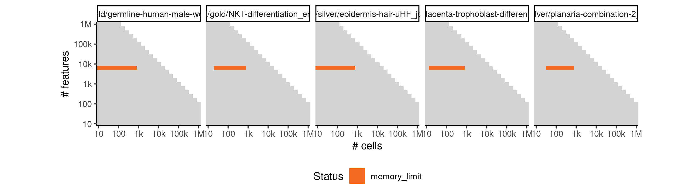
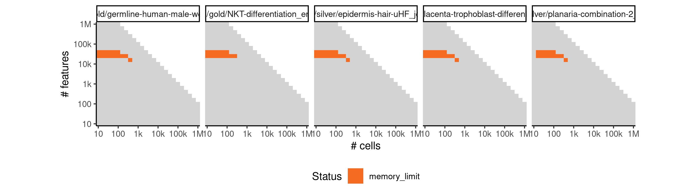
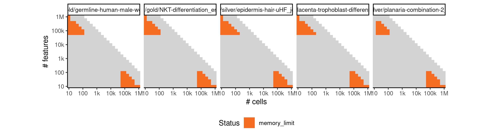
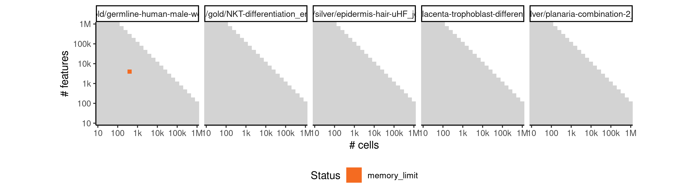
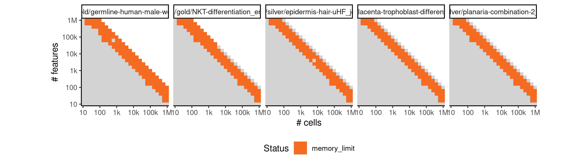

# scimitar


## ERROR STATUS EXECUTION_ERROR

### ERROR CLUSTER EXECUTION_ERROR -- 1


 * Number of instances: 3
 * Dataset ids: scaling_1767, scaling_1946, scaling_2045

Last 10 lines of scaling_1767:
```
File: /home/rcannood/Workspace/dynverse/dynbenchmark//derived/05-scaling/suite/scimitar/Cat4/r2gridengine/20181012_214342_scimitar_Cat4_ZqLOml9Va3/log/log.32.e.txt
Execution halted
```

## ERROR STATUS METHOD_ERROR

### ERROR CLUSTER METHOD_ERROR -- 1


 * Number of instances: 121
 * Dataset ids: scaling_0001, scaling_0003, scaling_0004, scaling_0006, scaling_0012, scaling_0016, scaling_0022, scaling_0025, scaling_0026, scaling_0027, scaling_0031, scaling_0035, scaling_0037, scaling_0038, scaling_0041, scaling_0045, scaling_0048, scaling_0051, scaling_0052, scaling_0053, scaling_0061, scaling_0062, scaling_0063, scaling_0067, scaling_0068, scaling_0070, scaling_0076, scaling_0077, scaling_0078, scaling_0079, scaling_0088, scaling_0089, scaling_0090, scaling_0091, scaling_0096, scaling_0098, scaling_0103, scaling_0105, scaling_0107, scaling_0108, scaling_0109, scaling_0121, scaling_0122, scaling_0123, scaling_0129, scaling_0130, scaling_0131, scaling_0132, scaling_0137, scaling_0141, scaling_0145, scaling_0148, scaling_0151, scaling_0153, scaling_0154, scaling_0165, scaling_0166, scaling_0171, scaling_0178, scaling_0180, scaling_0182, scaling_0183, scaling_0184, scaling_0185, scaling_0196, scaling_0197, scaling_0198, scaling_0199, scaling_0206, scaling_0212, scaling_0228, scaling_0229, scaling_0232, scaling_0241, scaling_0255, scaling_0256, scaling_0257, scaling_0264, scaling_0265, scaling_0270, scaling_0273, scaling_0278, scaling_0279, scaling_0287, scaling_0300, scaling_0301, scaling_0315, scaling_0316, scaling_0331, scaling_0335, scaling_0351, scaling_0377, scaling_0378, scaling_0395, scaling_0404, scaling_0421, scaling_0438, scaling_0439, scaling_0466, scaling_0491, scaling_0492, scaling_0495, scaling_0507, scaling_0547, scaling_0548, scaling_0565, scaling_0598, scaling_0618, scaling_0658, scaling_0659, scaling_0671, scaling_0672, scaling_0742, scaling_0758, scaling_0760, scaling_0830, scaling_0831, scaling_0847, scaling_0883, scaling_0905, scaling_1062

Last 10 lines of scaling_0001:
```
  File "/usr/local/lib/python2.7/site-packages/scimitar/morphing_mixture.py", line 309, in morphing_mixture_from_pseudotime
    covariances.append(np.copy(corpcor.cov_shrink(data_array, weights=weights, **{'lambda':cov_reg})))
  File "/usr/local/lib/python2.7/site-packages/pyroconductor/corpcor.py", line 12, in cov_shrink
    **kwargs)
  File "/usr/local/lib/python2.7/site-packages/rpy2/robjects/functions.py", line 178, in __call__
    return super(SignatureTranslatedFunction, self).__call__(*args, **kwargs)
  File "/usr/local/lib/python2.7/site-packages/rpy2/robjects/functions.py", line 106, in __call__
    res = super(Function, self).__call__(*new_args, **new_kwargs)
rpy2.rinterface.RRuntimeError: Error in if (denominator == 0) lambda.var = 1 else lambda.var = max(0,  : 
  missing value where TRUE/FALSE needed
```

### ERROR CLUSTER METHOD_ERROR -- 2


 * Number of instances: 120
 * Dataset ids: scaling_0010, scaling_0015, scaling_0030, scaling_0032, scaling_0036, scaling_0039, scaling_0047, scaling_0050, scaling_0064, scaling_0066, scaling_0069, scaling_0072, scaling_0074, scaling_0094, scaling_0095, scaling_0097, scaling_0101, scaling_0102, scaling_0106, scaling_0124, scaling_0128, scaling_0135, scaling_0138, scaling_0139, scaling_0140, scaling_0149, scaling_0172, scaling_0176, scaling_0179, scaling_0181, scaling_0195, scaling_0202, scaling_0210, scaling_0211, scaling_0213, scaling_0222, scaling_0224, scaling_0226, scaling_0238, scaling_0240, scaling_0247, scaling_0251, scaling_0272, scaling_0275, scaling_0280, scaling_0281, scaling_0302, scaling_0303, scaling_0321, scaling_0322, scaling_0324, scaling_0329, scaling_0343, scaling_0344, scaling_0345, scaling_0346, scaling_0363, scaling_0364, scaling_0365, scaling_0366, scaling_0376, scaling_0382, scaling_0385, scaling_0393, scaling_0394, scaling_0397, scaling_0417, scaling_0423, scaling_0430, scaling_0444, scaling_0445, scaling_0459, scaling_0461, scaling_0479, scaling_0486, scaling_0493, scaling_0497, scaling_0508, scaling_0516, scaling_0522, scaling_0527, scaling_0532, scaling_0539, scaling_0550, scaling_0555, scaling_0578, scaling_0583, scaling_0587, scaling_0588, scaling_0593, scaling_0595, scaling_0609, scaling_0635, scaling_0660, scaling_0666, scaling_0667, scaling_0719, scaling_0741, scaling_0743, scaling_0744, scaling_0751, scaling_0757, scaling_0832, scaling_0833, scaling_0846, scaling_0851, scaling_0895, scaling_0896, scaling_0906, scaling_0939, scaling_0940, scaling_1030, scaling_1031, scaling_1032, scaling_1044, scaling_1045, scaling_1099, scaling_1118, scaling_1119, scaling_1120

Last 10 lines of scaling_0010:
```
    pseudotimes, cov_estimator=cov_estimator, **kwargs)
  File "/usr/local/lib/python2.7/site-packages/scimitar/morphing_mixture.py", line 325, in morphing_mixture_from_pseudotime
    timepoints=timepoints)
  File "/usr/local/lib/python2.7/site-packages/scimitar/morphing_mixture.py", line 202, in state_interpolation
    sorted_chols = np.array([np.linalg.cholesky(c).tolist() for c in sorted_covariances])
  File "/usr/local/lib/python2.7/site-packages/numpy/linalg/linalg.py", line 733, in cholesky
    r = gufunc(a, signature=signature, extobj=extobj)
  File "/usr/local/lib/python2.7/site-packages/numpy/linalg/linalg.py", line 92, in _raise_linalgerror_nonposdef
    raise LinAlgError("Matrix is not positive definite")
numpy.linalg.linalg.LinAlgError: Matrix is not positive definite
```

### ERROR CLUSTER METHOD_ERROR -- 3


 * Number of instances: 79
 * Dataset ids: scaling_0040, scaling_0073, scaling_0127, scaling_0136, scaling_0150, scaling_0152, scaling_0164, scaling_0169, scaling_0170, scaling_0203, scaling_0204, scaling_0205, scaling_0245, scaling_0253, scaling_0254, scaling_0268, scaling_0274, scaling_0299, scaling_0304, scaling_0310, scaling_0311, scaling_0312, scaling_0313, scaling_0314, scaling_0337, scaling_0339, scaling_0372, scaling_0383, scaling_0384, scaling_0386, scaling_0387, scaling_0420, scaling_0432, scaling_0433, scaling_0434, scaling_0435, scaling_0436, scaling_0449, scaling_0460, scaling_0488, scaling_0489, scaling_0490, scaling_0499, scaling_0500, scaling_0501, scaling_0503, scaling_0519, scaling_0520, scaling_0528, scaling_0540, scaling_0546, scaling_0551, scaling_0552, scaling_0606, scaling_0608, scaling_0638, scaling_0654, scaling_0655, scaling_0657, scaling_0670, scaling_0673, scaling_0674, scaling_0675, scaling_0723, scaling_0738, scaling_0740, scaling_0755, scaling_0774, scaling_0775, scaling_0848, scaling_0849, scaling_0850, scaling_0862, scaling_0884, scaling_0915, scaling_0931, scaling_0978, scaling_0989, scaling_1017

Last 10 lines of scaling_0040:
```
    cov_reg=p["cov_reg"]
  File "/usr/local/lib/python2.7/site-packages/scimitar/morphing_mixture.py", line 125, in refine
    fit_type=self.fit_type, degree=self.degree, **kwargs)
  File "/usr/local/lib/python2.7/site-packages/scimitar/morphing_mixture.py", line 325, in morphing_mixture_from_pseudotime
    timepoints=timepoints)
  File "/usr/local/lib/python2.7/site-packages/scimitar/morphing_mixture.py", line 221, in state_interpolation
    spl = UnivariateSpline(timepoints, sorted_means[:, i], k=degree, w=sorted_covariances[:, i, i])
  File "/usr/local/lib/python2.7/site-packages/scipy/interpolate/fitpack2.py", line 185, in __init__
    xb=bbox[0],xe=bbox[1],s=s)
dfitpack.error: (m>k) failed for hidden m: fpcurf0:m=3
```

### ERROR CLUSTER METHOD_ERROR -- 4


 * Number of instances: 1
 * Dataset ids: scaling_0163

Last 10 lines of scaling_0163:
```
Initializing
Iteration 0
Estimating optimal shrinkage intensity lambda.var (variance vector): 0.8766 
Specified shrinkage intensity lambda (correlation matrix): 0.05 
Estimating optimal shrinkage intensity lambda.var (variance vector): 1 
Specified shrinkage intensity lambda (correlation matrix): 0.05 
Estimating optimal shrinkage intensity lambda.var (variance vector): 1 
Specified shrinkage intensity lambda (correlation matrix): 0.05 
    xb=bbox[0],xe=bbox[1],s=s)
dfitpack.error: (m>k) failed for hidden m: fpcurf0:m=3
```

### ERROR CLUSTER METHOD_ERROR -- 5


 * Number of instances: 1
 * Dataset ids: scaling_0323

Last 10 lines of scaling_0323:
```
Estimating optimal shrinkage intensity lambda.var (variance vector): 1 
Specified shrinkage in    fit_type=self.fit_type, degree=self.degree, **kwargs)
  File "/usr/local/lib/python2.7/site-packages/scimitar/morphing_mixture.py", line 325, in morphing_mixture_from_pseudotime
    timepoints=timepoints)
  File "/usr/local/lib/python2.7/site-packages/scimitar/morphing_mixture.py", line 221, in state_interpolation
    spl = UnivariateSpline(timepoints, sorted_means[:, i], k=degree, w=sorted_covariances[:, i, i])
  File "/usr/local/lib/python2.7/site-packages/scipy/interpolate/fitpack2.py", line 185, in __init__
    xb=bbox[0],xe=bbox[1],s=s)
dfitpack.error: (m>k) failed for hidden m: fpcurf0:m=2
tensity lambda (correlation matrix): 0.05 
```

### ERROR CLUSTER METHOD_ERROR -- 6


 * Number of instances: 1
 * Dataset ids: scaling_0894

Last 10 lines of scaling_0894:
```
Estimating optimal shrinkage intensity lambda.var (variance vect    fit_type=self.fit_type, degree=self.degree, **kwargs)
  File "/usr/local/lib/python2.7/site-packages/scimitar/morphing_mixture.py", line 325, in morphing_mixture_from_pseudotime
    timepoints=timepoints)
  File "/usr/local/lib/python2.7/site-packages/scimitar/morphing_mixture.py", line 221, in state_interpolation
    spl = UnivariateSpline(timepoints, sorted_means[:, i], k=degree, w=sorted_covariances[:, i, i])
  File "/usr/local/lib/python2.7/site-packages/scipy/interpolate/fitpack2.py", line 185, in __init__
    xb=bbox[0],xe=bbox[1],s=s)
dfitpack.error: (m>k) failed for hidden m: fpcurf0:m=3
or): 0.0432 
Specified shrinkage intensity lambda (correlation matrix): 0.05 
```

## ERROR STATUS TIME_LIMIT

### ERROR CLUSTER TIME_LIMIT -- 1


 * Number of instances: 221
 * Dataset ids: scaling_0244, scaling_0276, scaling_0277, scaling_0298, scaling_0309, scaling_0341, scaling_0342, scaling_0352, scaling_0361, scaling_0362, scaling_0371, scaling_0391, scaling_0392, scaling_0405, scaling_0406, scaling_0407, scaling_0418, scaling_0419, scaling_0431, scaling_0446, scaling_0457, scaling_0458, scaling_0467, scaling_0468, scaling_0477, scaling_0478, scaling_0487, scaling_0498, scaling_0506, scaling_0510, scaling_0514, scaling_0518, scaling_0533, scaling_0534, scaling_0545, scaling_0557, scaling_0558, scaling_0564, scaling_0566, scaling_0567, scaling_0573, scaling_0575, scaling_0576, scaling_0582, scaling_0584, scaling_0585, scaling_0591, scaling_0594, scaling_0600, scaling_0604, scaling_0605, scaling_0607, scaling_0615, scaling_0616, scaling_0620, scaling_0621, scaling_0622, scaling_0623, scaling_0631, scaling_0632, scaling_0636, scaling_0637, scaling_0639, scaling_0647, scaling_0648, scaling_0652, scaling_0653, scaling_0663, scaling_0664, scaling_0668, scaling_0669, scaling_0679, scaling_0680, scaling_0685, scaling_0686, scaling_0687, scaling_0688, scaling_0695, scaling_0696, scaling_0697, scaling_0702, scaling_0703, scaling_0704, scaling_0705, scaling_0712, scaling_0713, scaling_0714, scaling_0720, scaling_0721, scaling_0722, scaling_0729, scaling_0730, scaling_0731, scaling_0736, scaling_0737, scaling_0739, scaling_0746, scaling_0747, scaling_0748, scaling_0753, scaling_0754, scaling_0756, scaling_0763, scaling_0764, scaling_0765, scaling_0771, scaling_0772, scaling_0773, scaling_0780, scaling_0781, scaling_0789, scaling_0790, scaling_0791, scaling_0798, scaling_0799, scaling_0807, scaling_0808, scaling_0809, scaling_0810, scaling_0816, scaling_0817, scaling_0825, scaling_0826, scaling_0827, scaling_0828, scaling_0834, scaling_0835, scaling_0843, scaling_0844, scaling_0845, scaling_0852, scaling_0853, scaling_0860, scaling_0861, scaling_0871, scaling_0872, scaling_0882, scaling_0893, scaling_0904, scaling_0913, scaling_0914, scaling_0917, scaling_0921, scaling_0922, scaling_0925, scaling_0929, scaling_0930, scaling_0933, scaling_0937, scaling_0938, scaling_0941, scaling_0945, scaling_0946, scaling_0949, scaling_0953, scaling_0954, scaling_0959, scaling_0960, scaling_0965, scaling_0966, scaling_0971, scaling_0972, scaling_0977, scaling_0986, scaling_0987, scaling_1000, scaling_1001, scaling_1014, scaling_1015, scaling_1028, scaling_1029, scaling_1042, scaling_1043, scaling_1058, scaling_1059, scaling_1060, scaling_1061, scaling_1077, scaling_1078, scaling_1079, scaling_1080, scaling_1096, scaling_1097, scaling_1098, scaling_1115, scaling_1116, scaling_1117, scaling_1134, scaling_1135, scaling_1136, scaling_1137, scaling_1172, scaling_1173, scaling_1174, scaling_1175, scaling_1188, scaling_1189, scaling_1190, scaling_1191, scaling_1204, scaling_1205, scaling_1206, scaling_1207, scaling_1220, scaling_1221, scaling_1222, scaling_1223, scaling_1236, scaling_1237, scaling_1238, scaling_1239, scaling_1285, scaling_1286, scaling_1306, scaling_1307, scaling_1327, scaling_1328, scaling_1348, scaling_1349, scaling_1369, scaling_1370

Last 10 lines of scaling_0244:
```
File: /home/rcannood/Workspace/dynverse/dynbenchmark//derived/05-scaling/suite/scimitar/Cat1/r2gridengine/20181008_142132_scimitar_Cat1_eiguC91mXg/log/log.244.e.txt
```

## ERROR STATUS MEMORY_LIMIT

### ERROR CLUSTER MEMORY_LIMIT -- 1


 * Number of instances: 4
 * Dataset ids: scaling_0456, scaling_0881, scaling_1133, scaling_1368

Last 10 lines of scaling_0456:
```
Estimating optimal shrinkage intensity lambda.var (variance vector): 1 
Specified shrinkage intensity lambda (correlation matrix): 0.05 
Estimating optimal shrinkage intensity lambda.var (variance vector): 1 
Specified shrinkage intensity lambda (correlation matrix): 0.05 
Estimating optimal Traceback (most recent call last):
  File "/usr/local/lib/python2.7/site-packages/scimitar/morphing_mixture.py", line 245, in state_interpolation
shrinkage intensity lambda.var (variance vector): 1 
Specified shrinkage intensity lambda (correlation matrix): 0.05 
    spl = UnivariateSpline(timepoints, sorted_chols[:, j, i], k=degree)
MemoryError
```

### ERROR CLUSTER MEMORY_LIMIT -- 2


 * Number of instances: 8
 * Dataset ids: scaling_0476, scaling_0892, scaling_0985, scaling_0999, scaling_1203, scaling_1305, scaling_1326, scaling_1386

Last 10 lines of scaling_0476:
```
shrinkage intensity lambda.var (variance vector): 1 
Specified shrinkage intensity lambda (correlation matrix): 0.05 
    pseudotimes, cov_estimator=cov_estimator, **kwargs)
  File "/usr/local/lib/python2.7/site-packages/scimitar/morphing_mixture.py", line 325, in morphing_mixture_from_pseudotime
    timepoints=timepoints)
  File "/usr/local/lib/python2.7/site-packages/scimitar/morphing_mixture.py", line 245, in state_interpolation
    spl = UnivariateSpline(timepoints, sorted_chols[:, j, i], k=degree)
  File "/usr/local/lib/python2.7/site-packages/scipy/interpolate/fitpack2.py", line 185, in __init__
    xb=bbox[0],xe=bbox[1],s=s)
MemoryError
```

### ERROR CLUSTER MEMORY_LIMIT -- 3


 * Number of instances: 8
 * Dataset ids: scaling_0526, scaling_0538, scaling_0544, scaling_0770, scaling_0788, scaling_0806, scaling_0824, scaling_0842

Last 10 lines of scaling_0526:
```
    cov_reg=p["cov_reg"]
  File "/usr/local/lib/python2.7/site-packages/scimitar/morphing_mixture.py", line 396, in morphing_gaussian_from_embedding
g optimal shrinkage intensity lambda.var (variance vector): 1 
Specified shrinkage intensity lambda (correlation matrix): 0.05 
    pseudotimes, cov_estimator=cov_estimator, **kwargs)
  File "/usr/local/lib/python2.7/site-packages/scimitar/morphing_mixture.py", line 325, in morphing_mixture_from_pseudotime
    timepoints=timepoints)
  File "/usr/local/lib/python2.7/site-packages/scimitar/morphing_mixture.py", line 246, in state_interpolation
    chol_funs[(j, i)] = lambda t, fun=spl: fun(t)
MemoryError
```

### ERROR CLUSTER MEMORY_LIMIT -- 4


 * Number of instances: 44
 * Dataset ids: scaling_0556, scaling_0574, scaling_0602, scaling_0634, scaling_0650, scaling_0683, scaling_0700, scaling_0717, scaling_0734, scaling_0769, scaling_0787, scaling_0805, scaling_0823, scaling_0841, scaling_0912, scaling_0920, scaling_0928, scaling_0936, scaling_0944, scaling_0984, scaling_0998, scaling_1012, scaling_1026, scaling_1040, scaling_1056, scaling_1075, scaling_1094, scaling_1113, scaling_1132, scaling_1247, scaling_1251, scaling_1255, scaling_1259, scaling_1263, scaling_1283, scaling_1304, scaling_1325, scaling_1346, scaling_1367, scaling_1385, scaling_1397, scaling_1409, scaling_1421, scaling_1433

Last 10 lines of scaling_0556:
```
rinkage intensity lambda.var (variance vector): 1 
Specified shrinkage intensity lambda (correlation matrix): 0.05 
    cov_reg=p["cov_reg"]
  File "/usr/local/lib/python2.7/site-packages/scimitar/morphing_mixture.py", line 396, in morphing_gaussian_from_embedding
    pseudotimes, cov_estimator=cov_estimator, **kwargs)
  File "/usr/local/lib/python2.7/site-packages/scimitar/morphing_mixture.py", line 325, in morphing_mixture_from_pseudotime
    timepoints=timepoints)
  File "/usr/local/lib/python2.7/site-packages/scimitar/morphing_mixture.py", line 202, in state_interpolation
    sorted_chols = np.array([np.linalg.cholesky(c).tolist() for c in sorted_covariances])
MemoryError
```

### ERROR CLUSTER MEMORY_LIMIT -- 5


 * Number of instances: 64
 * Dataset ids: scaling_0601, scaling_0617, scaling_0633, scaling_0649, scaling_0681, scaling_0682, scaling_0698, scaling_0699, scaling_0715, scaling_0716, scaling_0732, scaling_0733, scaling_0750, scaling_0767, scaling_0768, scaling_0785, scaling_0786, scaling_0803, scaling_0804, scaling_0821, scaling_0822, scaling_0839, scaling_0840, scaling_0857, scaling_0858, scaling_0868, scaling_0869, scaling_0879, scaling_0880, scaling_0890, scaling_0891, scaling_0901, scaling_0902, scaling_0983, scaling_0997, scaling_1011, scaling_1025, scaling_1039, scaling_1054, scaling_1073, scaling_1092, scaling_1111, scaling_1130, scaling_1169, scaling_1185, scaling_1201, scaling_1217, scaling_1233, scaling_1281, scaling_1282, scaling_1302, scaling_1303, scaling_1323, scaling_1324, scaling_1344, scaling_1345, scaling_1365, scaling_1366, scaling_1445, scaling_1457, scaling_1469, scaling_1481, scaling_1493, scaling_1556

Last 10 lines of scaling_0601:
```
Traceback (most recent call last):
  File "/code/run.py", line 29, in <module>
    cov_reg=p["cov_reg"]
  File "/usr/local/lib/python2.7/site-packages/scimitar/morphing_mixture.py", line 396, in morphing_gaussian_from_embedding
    pseudotimes, cov_estimator=cov_estimator, **kwargs)
  File "/usr/local/lib/python2.7/site-packages/scimitar/morphing_mixture.py", line 309, in morphing_mixture_from_pseudotime
    covariances.append(np.copy(corpcor.cov_shrink(data_array, weights=weights, **{'lambda':cov_reg})))
  File "/usr/local/lib/python2.7/site-packages/pyroconductor/corpcor.py", line 13, in cov_shrink
    return np.array(res)
MemoryError
```

### ERROR CLUSTER MEMORY_LIMIT -- 6


 * Number of instances: 5
 * Dataset ids: scaling_0603, scaling_1041, scaling_1076, scaling_1095, scaling_1235

Last 10 lines of scaling_0603:
```
Estimating optimal shrinkage intensity lambda.var (variance vector): 1 
Specified shrinkage intensity lambda (correlation matrix): 0.05 
Traceback (most recent call last):
  File "/code/run.py", line 29, in <module>
    cov_reg=p["cov_reg"]
  File "/usr/local/lib/python2.7/site-packages/scimitar/morphing_mixture.py", line 396, in morphing_gaussian_from_embedding
    pseudotimes, cov_estimator=cov_estimator, **kwargs)
  File "/usr/local/lib/python2.7/site-packages/scimitar/morphing_mixture.py", line 325, in morphing_mixture_from_pseudotime
    timepoints=timepoints)
MemoryError
```

### ERROR CLUSTER MEMORY_LIMIT -- 7


 * Number of instances: 2
 * Dataset ids: scaling_0619, scaling_0718

Last 10 lines of scaling_0619:
```
Estimating optimal shrinkage intensity lambda.var (variance vector): 1 
Specified shrinkage intensity lambda (correlation matrix): 0.05 
EstiTraceback (most recent call last):
  File "/usr/local/lib/python2.7/site-packages/scimitar/morphing_mixture.py", line 245, in state_interpolation
mating optimal shrinkage intensity lambda.var (variance vector): 1 
Specified shrinkage intensity lambda (correlation matrix): 0.05 
    spl = UnivariateSpline(timepoints, sorted_chols[:, j, i], k=degree)
  File "/usr/local/lib/python2.7/site-packages/scipy/interpolate/fitpack2.py", line 175, in __init__
    if not all(diff(x) > 0.0):
MemoryError
```

### ERROR CLUSTER MEMORY_LIMIT -- 8


 * Number of instances: 1
 * Dataset ids: scaling_0651

Last 10 lines of scaling_0651:
```
EstiTraceback (most recent call last):
  File "/usr/local/lib/python2.7/site-packages/scimitar/morphing_mixture.py", line 325, in morphing_mixture_from_pseudotime
    timepoints=timepoints)
  File "/usr/local/lib/python2.7/site-packages/scimitar/morphing_mixture.py", line 245, in state_interpolation
    spl = UnivariateSpline(timepoints, sorted_chols[:, j, i], k=degree)
  File "/usr/local/lib/python2.7/site-packages/scipy/interpolate/fitpack2.py", line 175, in __init__
mating optimal shrinkage intensity lambda.var (variance vector): 1 
Specified shrinkage intensity lambda (correlation matrix): 0.05 
    if not all(diff(x) > 0.0):
MemoryError
```

### ERROR CLUSTER MEMORY_LIMIT -- 9


 * Number of instances: 1
 * Dataset ids: scaling_0684

Last 10 lines of scaling_0684:
```
Estimating optimal shrinkage intensity lambda.var (variance vector): 0.2428 
Specified shrinkage intensity lambda (correlation matrix): 0.05 
EstiTraceback (most recent call last):
  File "/usr/local/lib/python2.7/site-packages/scimitar/morphing_mixture.py", line 245, in state_interpolation
mating optimal shrinkage intensity lambda.var (variance vector): 0.2749 
Specified shrinkage intensity lambda (correlation matrix): 0.05 
    spl = UnivariateSpline(timepoints, sorted_chols[:, j, i], k=degree)
  File "/usr/local/lib/python2.7/site-packages/scipy/interpolate/fitpack2.py", line 185, in __init__
    xb=bbox[0],xe=bbox[1],s=s)
MemoryError
```

### ERROR CLUSTER MEMORY_LIMIT -- 10


 * Number of instances: 1
 * Dataset ids: scaling_0701

Last 10 lines of scaling_0701:
```
Estimating optimal shrinkage intensity lambda.var (variance vector): 0.1494 
Specified shrinkage intensity lambda (correlation matrix): 0.05Traceback (most recent call last):
  File "/usr/local/lib/python2.7/site-packages/scimitar/morphing_mixture.py", line 245, in state_interpolation
    spl = UnivariateSpline(timepoints, sorted_chols[:, j, i], k=degree)
  File "/usr/local/lib/python2.7/site-packages/scipy/interpolate/fitpack2.py", line 175, in __init__
 
Estimating optimal shrinkage intensity lambda.var (variance vector): 0.1378 
Specified shrinkage intensity lambda (correlation matrix): 0.05 
    if not all(diff(x) > 0.0):
MemoryError
```

### ERROR CLUSTER MEMORY_LIMIT -- 11


 * Number of instances: 4
 * Dataset ids: scaling_0735, scaling_1027, scaling_1114, scaling_1434

Last 10 lines of scaling_0735:
```
Estimating optimal shrinkage intensity lambda.var (variance vector): 1 
Specified shrinkage intensity lambda (correlation matrix): 0.05 
Estimating optimal shrinkage intensity lambda.var (variance vector): 1 
Specified shrinkage intensity lambda (correlation matrix): 0.05 
EstimTraceback (most recent call last):
  File "/usr/local/lib/python2.7/site-packages/scipy/interpolate/fitpack2.py", line 185, in __init__
ating optimal shrinkage intensity lambda.var (variance vector): 1 
Specified shrinkage intensity lambda (correlation matrix): 0.05 
    xb=bbox[0],xe=bbox[1],s=s)
MemoryError
```

### ERROR CLUSTER MEMORY_LIMIT -- 12


 * Number of instances: 1
 * Dataset ids: scaling_0752

Last 10 lines of scaling_0752:
```
Estimating optimal shrinkage intensity lambda.var (variance vector): 1 
Specified shrinkage intensity lambda (correlation matrix): 0.05 
Estimating optimal shrinkage intensity lambda.var (variance vector): 1 
Specified shrinkage intensity lambda (correlation matrix): 0.05 
EstimaTraceback (most recent call last):
  File "/usr/local/lib/python2.7/site-packages/scimitar/morphing_mixture.py", line 245, in state_interpolation
ting optimal shrinkage intensity lambda.var (variance vector): 1 
Specified shrinkage intensity lambda (correlation matrix): 0.05 
    spl = UnivariateSpline(timepoints, sorted_chols[:, j, i], k=degree)
MemoryError
```

### ERROR CLUSTER MEMORY_LIMIT -- 13


 * Number of instances: 72
 * Dataset ids: scaling_0766, scaling_0784, scaling_0802, scaling_0820, scaling_0856, scaling_0867, scaling_0878, scaling_0889, scaling_0911, scaling_0919, scaling_0927, scaling_0935, scaling_0943, scaling_0951, scaling_0957, scaling_0963, scaling_0969, scaling_0975, scaling_0982, scaling_0996, scaling_1010, scaling_1024, scaling_1038, scaling_1052, scaling_1053, scaling_1071, scaling_1072, scaling_1090, scaling_1091, scaling_1109, scaling_1110, scaling_1128, scaling_1129, scaling_1156, scaling_1158, scaling_1160, scaling_1162, scaling_1164, scaling_1168, scaling_1184, scaling_1200, scaling_1216, scaling_1232, scaling_1266, scaling_1268, scaling_1270, scaling_1272, scaling_1274, scaling_1280, scaling_1301, scaling_1322, scaling_1343, scaling_1364, scaling_1383, scaling_1395, scaling_1407, scaling_1419, scaling_1431, scaling_1444, scaling_1456, scaling_1468, scaling_1480, scaling_1492, scaling_1536, scaling_1537, scaling_1555, scaling_1574, scaling_1575, scaling_1593, scaling_1594, scaling_1612, scaling_1613

Last 10 lines of scaling_0766:
```
    pseudotimes, cov_estimator=cov_estimator, **kwargs)
  File "/usr/local/lib/python2.7/site-packages/scimitar/morphing_mixture.py", line 309, in morphing_mixture_from_pseudotime
    covariances.append(np.copy(corpcor.cov_shrink(data_array, weights=weights, **{'lambda':cov_reg})))
  File "/usr/local/lib/python2.7/site-packages/pyroconductor/corpcor.py", line 12, in cov_shrink
    **kwargs)
  File "/usr/local/lib/python2.7/site-packages/rpy2/robjects/functions.py", line 178, in __call__
    return super(SignatureTranslatedFunction, self).__call__(*args, **kwargs)
  File "/usr/local/lib/python2.7/site-packages/rpy2/robjects/functions.py", line 106, in __call__
    res = super(Function, self).__call__(*new_args, **new_kwargs)
rpy2.rinterface.RRuntimeError: Error: cannot allocate vector of size 4.7 Gb
```

### ERROR CLUSTER MEMORY_LIMIT -- 14


 * Number of instances: 210
 * Dataset ids: scaling_0782, scaling_0800, scaling_0818, scaling_0836, scaling_0854, scaling_0864, scaling_0865, scaling_0875, scaling_0876, scaling_0886, scaling_0887, scaling_0897, scaling_0898, scaling_0908, scaling_0909, scaling_0955, scaling_0961, scaling_0967, scaling_0973, scaling_0979, scaling_0992, scaling_1006, scaling_1020, scaling_1034, scaling_1048, scaling_1064, scaling_1065, scaling_1066, scaling_1083, scaling_1084, scaling_1085, scaling_1102, scaling_1103, scaling_1104, scaling_1121, scaling_1122, scaling_1123, scaling_1140, scaling_1141, scaling_1142, scaling_1176, scaling_1177, scaling_1178, scaling_1192, scaling_1193, scaling_1194, scaling_1208, scaling_1209, scaling_1210, scaling_1224, scaling_1225, scaling_1226, scaling_1240, scaling_1241, scaling_1242, scaling_1248, scaling_1252, scaling_1256, scaling_1260, scaling_1264, scaling_1287, scaling_1288, scaling_1289, scaling_1290, scaling_1291, scaling_1308, scaling_1309, scaling_1310, scaling_1311, scaling_1312, scaling_1329, scaling_1330, scaling_1331, scaling_1332, scaling_1333, scaling_1350, scaling_1351, scaling_1352, scaling_1353, scaling_1354, scaling_1371, scaling_1372, scaling_1373, scaling_1374, scaling_1375, scaling_1387, scaling_1388, scaling_1389, scaling_1399, scaling_1400, scaling_1401, scaling_1411, scaling_1412, scaling_1413, scaling_1423, scaling_1424, scaling_1425, scaling_1435, scaling_1436, scaling_1437, scaling_1446, scaling_1447, scaling_1448, scaling_1458, scaling_1459, scaling_1460, scaling_1470, scaling_1471, scaling_1472, scaling_1482, scaling_1483, scaling_1484, scaling_1494, scaling_1495, scaling_1496, scaling_1502, scaling_1503, scaling_1504, scaling_1508, scaling_1509, scaling_1510, scaling_1514, scaling_1515, scaling_1516, scaling_1520, scaling_1521, scaling_1522, scaling_1526, scaling_1527, scaling_1528, scaling_1538, scaling_1539, scaling_1540, scaling_1541, scaling_1542, scaling_1543, scaling_1557, scaling_1558, scaling_1559, scaling_1560, scaling_1561, scaling_1562, scaling_1576, scaling_1577, scaling_1578, scaling_1579, scaling_1580, scaling_1581, scaling_1595, scaling_1596, scaling_1597, scaling_1598, scaling_1599, scaling_1600, scaling_1614, scaling_1615, scaling_1616, scaling_1617, scaling_1618, scaling_1619, scaling_1631, scaling_1632, scaling_1633, scaling_1634, scaling_1635, scaling_1636, scaling_1637, scaling_1638, scaling_1639, scaling_1640, scaling_1653, scaling_1654, scaling_1655, scaling_1656, scaling_1657, scaling_1658, scaling_1659, scaling_1660, scaling_1661, scaling_1662, scaling_1675, scaling_1676, scaling_1677, scaling_1678, scaling_1679, scaling_1680, scaling_1681, scaling_1682, scaling_1683, scaling_1684, scaling_1697, scaling_1698, scaling_1699, scaling_1700, scaling_1701, scaling_1702, scaling_1703, scaling_1704, scaling_1705, scaling_1706, scaling_1719, scaling_1720, scaling_1721, scaling_1722, scaling_1723, scaling_1724, scaling_1725, scaling_1726, scaling_1727, scaling_1728

Last 10 lines of scaling_0782:
```
    pseudotimes = embedding.fit_transform(denoised_data_array)
  File "/usr/local/lib/python2.7/site-packages/sklearn/manifold/locally_linear.py", line 678, in fit_transform
    self._fit_transform(X)
  File "/usr/local/lib/python2.7/site-packages/sklearn/manifold/locally_linear.py", line 645, in _fit_transform
    random_state=random_state, reg=self.reg, n_jobs=self.n_jobs)
  File "/usr/local/lib/python2.7/site-packages/sklearn/manifold/locally_linear.py", line 310, in locally_linear_embedding
    nbrs, n_neighbors=n_neighbors, reg=reg, n_jobs=n_jobs)
  File "/usr/local/lib/python2.7/site-packages/sklearn/manifold/locally_linear.py", line 103, in barycenter_kneighbors_graph
    data = barycenter_weights(X, X[ind], reg=reg)
MemoryError
```

### ERROR CLUSTER MEMORY_LIMIT -- 15


 * Number of instances: 45
 * Dataset ids: scaling_0783, scaling_0801, scaling_0819, scaling_0837, scaling_0855, scaling_0918, scaling_0926, scaling_0934, scaling_0942, scaling_0950, scaling_0993, scaling_1007, scaling_1021, scaling_1035, scaling_1049, scaling_1067, scaling_1086, scaling_1105, scaling_1124, scaling_1143, scaling_1179, scaling_1195, scaling_1211, scaling_1227, scaling_1243, scaling_1292, scaling_1313, scaling_1334, scaling_1355, scaling_1376, scaling_1449, scaling_1461, scaling_1473, scaling_1485, scaling_1497, scaling_1544, scaling_1563, scaling_1582, scaling_1601, scaling_1620, scaling_1641, scaling_1663, scaling_1685, scaling_1707, scaling_1729

Last 10 lines of scaling_0783:
```
    self._fit_transform(X)
  File "/usr/local/lib/python2.7/site-packages/sklearn/manifold/locally_linear.py", line 645, in _fit_transform
    random_state=random_state, reg=self.reg, n_jobs=self.n_jobs)
  File "/usr/local/lib/python2.7/site-packages/sklearn/manifold/locally_linear.py", line 310, in locally_linear_embedding
    nbrs, n_neighbors=n_neighbors, reg=reg, n_jobs=n_jobs)
  File "/usr/local/lib/python2.7/site-packages/sklearn/manifold/locally_linear.py", line 102, in barycenter_kneighbors_graph
    ind = knn.kneighbors(X, return_distance=False)[:, 1:]
  File "/usr/local/lib/python2.7/site-packages/sklearn/neighbors/base.py", line 367, in kneighbors
    sample_range, np.argsort(dist[sample_range, neigh_ind])]
MemoryError
```

### ERROR CLUSTER MEMORY_LIMIT -- 16


 * Number of instances: 1
 * Dataset ids: scaling_0859

Last 10 lines of scaling_0859:
```
Estimating optimal shrinkage intensity lambda.var (variance vector): 1 
Specified shrinkage intensity lambda (correlation matrix): 0.05 
EstimatingTraceback (most recent call last):
  File "/usr/local/lib/python2.7/site-packages/scipy/interpolate/fitpack2.py", line 175, in __init__
    if not all(diff(x) > 0.0):
  File "/usr/local/lib/python2.7/site-packages/numpy/lib/function_base.py", line 1174, in diff
 optimal shrinkage intensity lambda.var (variance vector): 1 
Specified shrinkage intensity lambda (correlation matrix): 0.05 
    a = op(a[slice1], a[slice2])
MemoryError
```

### ERROR CLUSTER MEMORY_LIMIT -- 17


 * Number of instances: 40
 * Dataset ids: scaling_0866, scaling_0877, scaling_0888, scaling_0899, scaling_0910, scaling_0956, scaling_0962, scaling_0968, scaling_0974, scaling_0980, scaling_1068, scaling_1087, scaling_1106, scaling_1125, scaling_1144, scaling_1157, scaling_1159, scaling_1161, scaling_1163, scaling_1165, scaling_1267, scaling_1269, scaling_1271, scaling_1273, scaling_1275, scaling_1390, scaling_1402, scaling_1414, scaling_1426, scaling_1438, scaling_1505, scaling_1511, scaling_1517, scaling_1523, scaling_1529, scaling_1642, scaling_1664, scaling_1686, scaling_1708, scaling_1730

Last 10 lines of scaling_0866:
```
    n_jobs=n_jobs, squared=True)
  File "/usr/local/lib/python2.7/site-packages/sklearn/metrics/pairwise.py", line 1247, in pairwise_distances
    return _parallel_pairwise(X, Y, func, n_jobs, **kwds)
  File "/usr/local/lib/python2.7/site-packages/sklearn/metrics/pairwise.py", line 1090, in _parallel_pairwise
    return func(X, Y, **kwds)
  File "/usr/local/lib/python2.7/site-packages/sklearn/metrics/pairwise.py", line 246, in euclidean_distances
    distances = safe_sparse_dot(X, Y.T, dense_output=True)
  File "/usr/local/lib/python2.7/site-packages/sklearn/utils/extmath.py", line 140, in safe_sparse_dot
    return np.dot(a, b)
MemoryError
```

### ERROR CLUSTER MEMORY_LIMIT -- 18


 * Number of instances: 1
 * Dataset ids: scaling_0870

Last 10 lines of scaling_0870:
```
Estimating optimal shrinkage intensity lambda.var (variance vector): 0.0656 
Specified shrinkage intensity lambda (correlation matrix): 0.05 
Estimating optimal shrinkage intensity lambda.var (variance vector): 0.0582 
Specified shrinkage intensity lambda (correlation Traceback (most recent call last):
  File "/usr/local/lib/python2.7/site-packages/scimitar/morphing_mixture.py", line 245, in state_interpolation
matrix): 0.05 
Estimating optimal shrinkage intensity lambda.var (variance vector): 0.0667 
Specified shrinkage intensity lambda (correlation matrix): 0.05 
    spl = UnivariateSpline(timepoints, sorted_chols[:, j, i], k=degree)
MemoryError
```

### ERROR CLUSTER MEMORY_LIMIT -- 19


 * Number of instances: 2
 * Dataset ids: scaling_0903, scaling_1057

Last 10 lines of scaling_0903:
```
Estimating optimal shrinkage intensity lambda.var (variance vector): 0.2613 
Specified shrinkage intensity lambda (correlation matrix): 0.05 
Estimating optimal shrinkage intensity lambda.var (variance vector): 0.309 
Specified shrinkage intensity lambda (correlation matrix): 0.05 
Estimating optimTraceback (most recent call last):
  File "/usr/local/lib/python2.7/site-packages/numpy/core/numeric.py", line 553, in asanyarray
al shrinkage intensity lambda.var (variance vector): 0.375 
Specified shrinkage intensity lambda (correlation matrix): 0.05 
    return array(a, dtype, copy=False, order=order, subok=True)
MemoryError
```

### ERROR CLUSTER MEMORY_LIMIT -- 20


 * Number of instances: 20
 * Dataset ids: scaling_0952, scaling_0958, scaling_0964, scaling_0970, scaling_0976, scaling_1055, scaling_1074, scaling_1093, scaling_1112, scaling_1131, scaling_1170, scaling_1186, scaling_1202, scaling_1218, scaling_1234, scaling_1384, scaling_1396, scaling_1408, scaling_1420, scaling_1432

Last 10 lines of scaling_0952:
```
Traceback (most recent call last):
  File "/code/run.py", line 29, in <module>
    cov_reg=p["cov_reg"]
  File "/usr/local/lib/python2.7/site-packages/scimitar/morphing_mixture.py", line 396, in morphing_gaussian_from_embedding
    pseudotimes, cov_estimator=cov_estimator, **kwargs)
  File "/usr/local/lib/python2.7/site-packages/scimitar/morphing_mixture.py", line 309, in morphing_mixture_from_pseudotime
    covariances.append(np.copy(corpcor.cov_shrink(data_array, weights=weights, **{'lambda':cov_reg})))
  File "/usr/local/lib/python2.7/site-packages/numpy/lib/function_base.py", line 733, in copy
    return array(a, order=order, copy=True)
MemoryError
```

### ERROR CLUSTER MEMORY_LIMIT -- 21


 * Number of instances: 255
 * Dataset ids: scaling_0981, scaling_0994, scaling_0995, scaling_1008, scaling_1009, scaling_1022, scaling_1023, scaling_1036, scaling_1050, scaling_1051, scaling_1069, scaling_1070, scaling_1088, scaling_1089, scaling_1107, scaling_1108, scaling_1126, scaling_1145, scaling_1146, scaling_1147, scaling_1148, scaling_1149, scaling_1150, scaling_1151, scaling_1152, scaling_1153, scaling_1154, scaling_1155, scaling_1166, scaling_1167, scaling_1180, scaling_1181, scaling_1182, scaling_1183, scaling_1196, scaling_1197, scaling_1198, scaling_1199, scaling_1212, scaling_1213, scaling_1214, scaling_1215, scaling_1228, scaling_1229, scaling_1231, scaling_1244, scaling_1245, scaling_1246, scaling_1249, scaling_1250, scaling_1253, scaling_1254, scaling_1257, scaling_1258, scaling_1261, scaling_1262, scaling_1265, scaling_1276, scaling_1277, scaling_1278, scaling_1279, scaling_1293, scaling_1294, scaling_1295, scaling_1296, scaling_1297, scaling_1298, scaling_1299, scaling_1300, scaling_1314, scaling_1315, scaling_1316, scaling_1317, scaling_1318, scaling_1319, scaling_1320, scaling_1321, scaling_1335, scaling_1336, scaling_1337, scaling_1338, scaling_1339, scaling_1340, scaling_1341, scaling_1342, scaling_1356, scaling_1357, scaling_1358, scaling_1359, scaling_1361, scaling_1362, scaling_1363, scaling_1377, scaling_1378, scaling_1379, scaling_1380, scaling_1381, scaling_1382, scaling_1391, scaling_1392, scaling_1393, scaling_1394, scaling_1403, scaling_1404, scaling_1405, scaling_1406, scaling_1415, scaling_1416, scaling_1417, scaling_1418, scaling_1427, scaling_1428, scaling_1429, scaling_1430, scaling_1439, scaling_1440, scaling_1441, scaling_1442, scaling_1443, scaling_1450, scaling_1451, scaling_1452, scaling_1453, scaling_1454, scaling_1455, scaling_1462, scaling_1463, scaling_1464, scaling_1465, scaling_1466, scaling_1467, scaling_1474, scaling_1475, scaling_1476, scaling_1477, scaling_1478, scaling_1479, scaling_1486, scaling_1487, scaling_1488, scaling_1490, scaling_1491, scaling_1498, scaling_1499, scaling_1500, scaling_1501, scaling_1506, scaling_1507, scaling_1512, scaling_1513, scaling_1518, scaling_1519, scaling_1524, scaling_1525, scaling_1530, scaling_1531, scaling_1532, scaling_1533, scaling_1534, scaling_1535, scaling_1545, scaling_1546, scaling_1547, scaling_1548, scaling_1549, scaling_1550, scaling_1551, scaling_1552, scaling_1553, scaling_1554, scaling_1564, scaling_1565, scaling_1566, scaling_1567, scaling_1568, scaling_1569, scaling_1570, scaling_1571, scaling_1572, scaling_1573, scaling_1583, scaling_1584, scaling_1585, scaling_1586, scaling_1587, scaling_1588, scaling_1589, scaling_1590, scaling_1591, scaling_1592, scaling_1602, scaling_1603, scaling_1604, scaling_1605, scaling_1606, scaling_1608, scaling_1609, scaling_1610, scaling_1611, scaling_1621, scaling_1622, scaling_1623, scaling_1624, scaling_1625, scaling_1626, scaling_1627, scaling_1628, scaling_1629, scaling_1630, scaling_1643, scaling_1644, scaling_1645, scaling_1646, scaling_1647, scaling_1648, scaling_1649, scaling_1650, scaling_1651, scaling_1652, scaling_1665, scaling_1666, scaling_1667, scaling_1668, scaling_1669, scaling_1670, scaling_1671, scaling_1672, scaling_1673, scaling_1674, scaling_1687, scaling_1688, scaling_1689, scaling_1690, scaling_1691, scaling_1692, scaling_1693, scaling_1694, scaling_1695, scaling_1696, scaling_1709, scaling_1710, scaling_1711, scaling_1712, scaling_1713, scaling_1715, scaling_1716, scaling_1717, scaling_1718, scaling_1731, scaling_1732, scaling_1733, scaling_1734, scaling_1735, scaling_1745, scaling_1749

Last 10 lines of scaling_0981:
```
Traceback (most recent call last):
  File "/code/run.py", line 29, in <module>
    cov_reg=p["cov_reg"]
  File "/usr/local/lib/python2.7/site-packages/scimitar/morphing_mixture.py", line 394, in morphing_gaussian_from_embedding
    pseudotimes = pseudotimes_from_embedding(data_array, n_neighbors=n_neighbors)
  File "/usr/local/lib/python2.7/site-packages/scimitar/morphing_mixture.py", line 403, in pseudotimes_from_embedding
    u, s, v = np.linalg.svd(data_array, full_matrices=1)
  File "/usr/local/lib/python2.7/site-packages/numpy/linalg/linalg.py", line 1562, in svd
    u, s, vh = gufunc(a, signature=signature, extobj=extobj)
MemoryError
```

### ERROR CLUSTER MEMORY_LIMIT -- 22


 * Number of instances: 5
 * Dataset ids: scaling_0991, scaling_1005, scaling_1019, scaling_1033, scaling_1047

Last 10 lines of scaling_0991:
```
    self._fit_transform(X)
  File "/usr/local/lib/python2.7/site-packages/sklearn/manifold/locally_linear.py", line 645, in _fit_transform
    random_state=random_state, reg=self.reg, n_jobs=self.n_jobs)
  File "/usr/local/lib/python2.7/site-packages/sklearn/manifold/locally_linear.py", line 310, in locally_linear_embedding
    nbrs, n_neighbors=n_neighbors, reg=reg, n_jobs=n_jobs)
  File "/usr/local/lib/python2.7/site-packages/sklearn/manifold/locally_linear.py", line 103, in barycenter_kneighbors_graph
    data = barycenter_weights(X, X[ind], reg=reg)
  File "/usr/local/lib/python2.7/site-packages/sklearn/manifold/locally_linear.py", line 48, in barycenter_weights
    B = np.empty((n_samples, n_neighbors), dtype=X.dtype)
MemoryError
```

### ERROR CLUSTER MEMORY_LIMIT -- 23


 * Number of instances: 1
 * Dataset ids: scaling_1013

Last 10 lines of scaling_1013:
```
Estimating optimal shrinkage intensity lambda.var (variance vector): 0.0808 
Specified shrinkage intensity lambda (correlation matrix): 0.05 
Estimating optimal shrinkage intensity lambda.var (variance vector): 0.1017 
Specified shrinkage intensity lambda (correlation matrix): 0.05 
Estimating optimal Traceback (most recent call last):
  File "/usr/local/lib/python2.7/site-packages/scipy/interpolate/fitpack2.py", line 185, in __init__
shrinkage intensity lambda.var (variance vector): 0.1621 
Specified shrinkage intensity lambda (correlation matrix): 0.05 
    xb=bbox[0],xe=bbox[1],s=s)
MemoryError
```

### ERROR CLUSTER MEMORY_LIMIT -- 24


 * Number of instances: 1
 * Dataset ids: scaling_1171

Last 10 lines of scaling_1171:
```
Estimating optimal shrinkage intensity lambda.var (variance vector): 0.0386 
Specified shrinkage intensity lambda (correlation matrix): 0.05 
EstimatingTraceback (most recent call last):
  File "/usr/local/lib/python2.7/site-packages/scipy/interpolate/fitpack2.py", line 175, in __init__
 optimal shrinkage intensity lambda.var (variance vector): 0.0616 
Specified shrinkage intensity lambda (correlation matrix): 0.05 
    if not all(diff(x) > 0.0):
  File "/usr/local/lib/python2.7/site-packages/numpy/lib/function_base.py", line 1174, in diff
    a = op(a[slice1], a[slice2])
MemoryError
```

### ERROR CLUSTER MEMORY_LIMIT -- 25


 * Number of instances: 5
 * Dataset ids: scaling_1187, scaling_1219, scaling_1284, scaling_1347, scaling_1398

Last 10 lines of scaling_1187:
```
Estimating optimal shrinkage intensity lambda.var (variance vector): 0.014 
Specified shrinkage intensity lambda (correlation matriTraceback (most recent call last):
  File "/usr/local/lib/python2.7/site-packages/scipy/interpolate/fitpack2.py", line 190, in __init__
x): 0.05 
Estimating optimal shrinkage intensity lambda.var (variance vector): 0.0161 
Specified shrinkage intensity lambda (correlation matrix): 0.05 
    self._reset_class()
  File "/usr/local/lib/python2.7/site-packages/scipy/interpolate/fitpack2.py", line 207, in _reset_class
    self._eval_args = t[:n],c[:n],k
MemoryError
```

### ERROR CLUSTER MEMORY_LIMIT -- 26


 * Number of instances: 2
 * Dataset ids: scaling_1410, scaling_1422

Last 10 lines of scaling_1410:
```
Estimating optimal shrinkage intensity lambda.var (variance vector): 0.1251 
Specified shrinkage intensity lambda (correlation matrix): 0.05 
    pseudotimes, cov_estimator=cov_estimator, **kwargs)
  File "/usr/local/lib/python2.7/site-packages/scimitar/morphing_mixture.py", line 325, in morphing_mixture_from_pseudotime
    timepoints=timepoints)
  File "/usr/local/lib/python2.7/site-packages/scimitar/morphing_mixture.py", line 245, in state_interpolation
    spl = UnivariateSpline(timepoints, sorted_chols[:, j, i], k=degree)
  File "/usr/local/lib/python2.7/site-packages/scipy/interpolate/fitpack2.py", line 175, in __init__
    if not all(diff(x) > 0.0):
MemoryError
```

### ERROR CLUSTER MEMORY_LIMIT -- 27


 * Number of instances: 514
 * Dataset ids: scaling_1736, scaling_1737, scaling_1738, scaling_1739, scaling_1740, scaling_1741, scaling_1742, scaling_1743, scaling_1744, scaling_1746, scaling_1747, scaling_1748, scaling_1750, scaling_1751, scaling_1752, scaling_1753, scaling_1754, scaling_1755, scaling_1756, scaling_1757, scaling_1758, scaling_1759, scaling_1760, scaling_1761, scaling_1762, scaling_1763, scaling_1764, scaling_1765, scaling_1766, scaling_1768, scaling_1769, scaling_1770, scaling_1771, scaling_1772, scaling_1773, scaling_1774, scaling_1775, scaling_1776, scaling_1777, scaling_1778, scaling_1779, scaling_1780, scaling_1781, scaling_1782, scaling_1783, scaling_1784, scaling_1785, scaling_1786, scaling_1787, scaling_1788, scaling_1789, scaling_1790, scaling_1791, scaling_1792, scaling_1793, scaling_1794, scaling_1795, scaling_1796, scaling_1797, scaling_1798, scaling_1799, scaling_1800, scaling_1801, scaling_1802, scaling_1803, scaling_1804, scaling_1805, scaling_1806, scaling_1807, scaling_1808, scaling_1809, scaling_1810, scaling_1811, scaling_1812, scaling_1813, scaling_1814, scaling_1815, scaling_1816, scaling_1817, scaling_1818, scaling_1819, scaling_1820, scaling_1821, scaling_1822, scaling_1823, scaling_1824, scaling_1825, scaling_1826, scaling_1827, scaling_1828, scaling_1829, scaling_1830, scaling_1831, scaling_1832, scaling_1833, scaling_1834, scaling_1835, scaling_1836, scaling_1837, scaling_1838, scaling_1839, scaling_1840, scaling_1841, scaling_1842, scaling_1843, scaling_1844, scaling_1845, scaling_1846, scaling_1847, scaling_1848, scaling_1849, scaling_1850, scaling_1851, scaling_1852, scaling_1853, scaling_1854, scaling_1855, scaling_1856, scaling_1857, scaling_1858, scaling_1859, scaling_1860, scaling_1861, scaling_1862, scaling_1863, scaling_1864, scaling_1865, scaling_1866, scaling_1867, scaling_1868, scaling_1869, scaling_1870, scaling_1871, scaling_1872, scaling_1873, scaling_1874, scaling_1875, scaling_1876, scaling_1877, scaling_1878, scaling_1879, scaling_1880, scaling_1881, scaling_1882, scaling_1883, scaling_1884, scaling_1885, scaling_1886, scaling_1887, scaling_1888, scaling_1889, scaling_1890, scaling_1891, scaling_1892, scaling_1893, scaling_1894, scaling_1895, scaling_1896, scaling_1897, scaling_1898, scaling_1899, scaling_1900, scaling_1901, scaling_1902, scaling_1903, scaling_1904, scaling_1905, scaling_1906, scaling_1907, scaling_1908, scaling_1909, scaling_1910, scaling_1911, scaling_1912, scaling_1913, scaling_1914, scaling_1915, scaling_1916, scaling_1917, scaling_1918, scaling_1919, scaling_1920, scaling_1921, scaling_1922, scaling_1923, scaling_1924, scaling_1925, scaling_1926, scaling_1927, scaling_1928, scaling_1929, scaling_1930, scaling_1931, scaling_1932, scaling_1933, scaling_1934, scaling_1935, scaling_1936, scaling_1937, scaling_1938, scaling_1939, scaling_1940, scaling_1941, scaling_1942, scaling_1943, scaling_1944, scaling_1945, scaling_1947, scaling_1948, scaling_1949, scaling_1950, scaling_1951, scaling_1952, scaling_1953, scaling_1954, scaling_1955, scaling_1956, scaling_1957, scaling_1958, scaling_1959, scaling_1960, scaling_1961, scaling_1962, scaling_1963, scaling_1964, scaling_1965, scaling_1966, scaling_1967, scaling_1968, scaling_1969, scaling_1970, scaling_1971, scaling_1972, scaling_1973, scaling_1974, scaling_1975, scaling_1976, scaling_1977, scaling_1978, scaling_1979, scaling_1980, scaling_1981, scaling_1982, scaling_1983, scaling_1984, scaling_1985, scaling_1986, scaling_1987, scaling_1988, scaling_1989, scaling_1990, scaling_1991, scaling_1992, scaling_1993, scaling_1994, scaling_1995, scaling_1996, scaling_1997, scaling_1998, scaling_1999, scaling_2000, scaling_2001, scaling_2002, scaling_2003, scaling_2004, scaling_2005, scaling_2006, scaling_2007, scaling_2008, scaling_2009, scaling_2010, scaling_2011, scaling_2012, scaling_2013, scaling_2014, scaling_2015, scaling_2016, scaling_2017, scaling_2018, scaling_2019, scaling_2020, scaling_2021, scaling_2022, scaling_2023, scaling_2024, scaling_2025, scaling_2026, scaling_2027, scaling_2028, scaling_2029, scaling_2030, scaling_2031, scaling_2032, scaling_2033, scaling_2034, scaling_2035, scaling_2036, scaling_2037, scaling_2038, scaling_2039, scaling_2040, scaling_2041, scaling_2042, scaling_2043, scaling_2044, scaling_2046, scaling_2047, scaling_2048, scaling_2049, scaling_2050, scaling_2051, scaling_2052, scaling_2053, scaling_2054, scaling_2055, scaling_2056, scaling_2057, scaling_2058, scaling_2059, scaling_2060, scaling_2061, scaling_2062, scaling_2063, scaling_2064, scaling_2065, scaling_2066, scaling_2067, scaling_2068, scaling_2069, scaling_2070, scaling_2071, scaling_2072, scaling_2073, scaling_2074, scaling_2075, scaling_2076, scaling_2077, scaling_2078, scaling_2079, scaling_2080, scaling_2081, scaling_2082, scaling_2083, scaling_2084, scaling_2085, scaling_2086, scaling_2087, scaling_2088, scaling_2089, scaling_2090, scaling_2091, scaling_2092, scaling_2093, scaling_2094, scaling_2095, scaling_2096, scaling_2097, scaling_2098, scaling_2099, scaling_2100, scaling_2101, scaling_2102, scaling_2103, scaling_2104, scaling_2105, scaling_2106, scaling_2107, scaling_2108, scaling_2109, scaling_2110, scaling_2111, scaling_2112, scaling_2113, scaling_2114, scaling_2115, scaling_2116, scaling_2117, scaling_2118, scaling_2119, scaling_2120, scaling_2121, scaling_2122, scaling_2123, scaling_2124, scaling_2125, scaling_2126, scaling_2127, scaling_2128, scaling_2129, scaling_2130, scaling_2131, scaling_2132, scaling_2133, scaling_2134, scaling_2135, scaling_2136, scaling_2137, scaling_2138, scaling_2139, scaling_2140, scaling_2141, scaling_2142, scaling_2143, scaling_2144, scaling_2145, scaling_2146, scaling_2147, scaling_2148, scaling_2149, scaling_2150, scaling_2151, scaling_2152, scaling_2153, scaling_2154, scaling_2155, scaling_2156, scaling_2157, scaling_2158, scaling_2159, scaling_2160, scaling_2161, scaling_2162, scaling_2163, scaling_2164, scaling_2165, scaling_2166, scaling_2167, scaling_2168, scaling_2169, scaling_2170, scaling_2171, scaling_2172, scaling_2173, scaling_2174, scaling_2175, scaling_2176, scaling_2177, scaling_2178, scaling_2179, scaling_2180, scaling_2181, scaling_2182, scaling_2183, scaling_2184, scaling_2185, scaling_2186, scaling_2187, scaling_2188, scaling_2189, scaling_2190, scaling_2191, scaling_2192, scaling_2193, scaling_2194, scaling_2195, scaling_2196, scaling_2197, scaling_2198, scaling_2199, scaling_2200, scaling_2201, scaling_2202, scaling_2203, scaling_2204, scaling_2205, scaling_2206, scaling_2207, scaling_2208, scaling_2209, scaling_2210, scaling_2211, scaling_2212, scaling_2213, scaling_2214, scaling_2215, scaling_2216, scaling_2217, scaling_2218, scaling_2219, scaling_2220, scaling_2221, scaling_2222, scaling_2223, scaling_2224, scaling_2225, scaling_2226, scaling_2227, scaling_2228, scaling_2229, scaling_2230, scaling_2231, scaling_2232, scaling_2233, scaling_2234, scaling_2235, scaling_2236, scaling_2237, scaling_2238, scaling_2239, scaling_2240, scaling_2241, scaling_2242, scaling_2243, scaling_2244, scaling_2245, scaling_2246, scaling_2247, scaling_2248, scaling_2249, scaling_2250, scaling_2251, scaling_2252, scaling_2253, scaling_2254

Last 10 lines of scaling_1736:
```
Error writing to connection:  No space left on device
```


