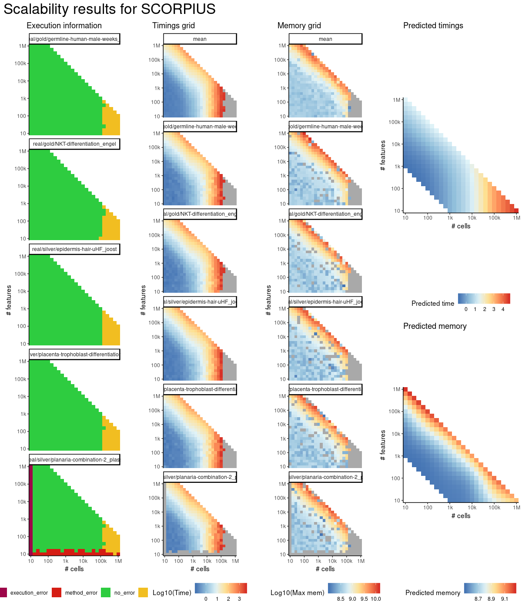
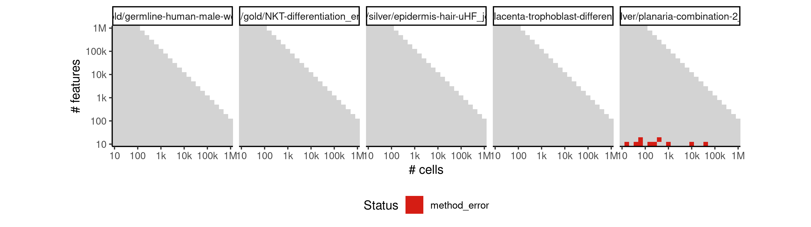
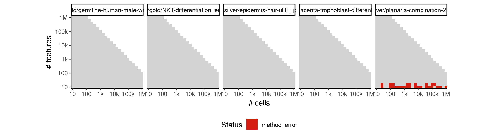

# scorpius


## ERROR STATUS METHOD_ERROR

### ERROR CLUSTER METHOD_ERROR -- 1


 * Number of instances: 12
 * Dataset ids: scaling_0015, scaling_0050, scaling_0075, scaling_0105, scaling_0140, scaling_0179, scaling_0215, scaling_0254, scaling_0330, scaling_0389, scaling_0980, scaling_1050

Last 10 lines of scaling_0015:
```
    filter, lag
The following objects are masked from ‘package:base’:
    intersect, setdiff, setequal, union
Attaching package: ‘purrr’
The following object is masked from ‘package:jsonlite’:
    flatten
Error in stats::smooth.spline(lambda, xj, ..., df = df, keep.data = FALSE) : 
  smoothing parameter value too small
Calls: <Anonymous> -> <Anonymous> -> smoother_function -> <Anonymous>
Execution halted
```

### ERROR CLUSTER METHOD_ERROR -- 2


 * Number of instances: 18
 * Dataset ids: scaling_0030, scaling_0040, scaling_0104, scaling_0139, scaling_0180, scaling_0255, scaling_0390, scaling_0455, scaling_0505, scaling_0600, scaling_0679, scaling_0680, scaling_0764, scaling_0765, scaling_0854, scaling_0855, scaling_0910, scaling_0950

Last 10 lines of scaling_0030:
```
    filter, lag
The following objects are masked from ‘package:base’:
    intersect, setdiff, setequal, union
Attaching package: ‘purrr’
The following object is masked from ‘package:jsonlite’:
    flatten
Error in stats::smooth.spline(lambda, xj, ..., df = df, keep.data = FALSE) : 
  'tol' must be strictly positive and finite
Calls: <Anonymous> -> <Anonymous> -> smoother_function -> <Anonymous>
Execution halted
```


