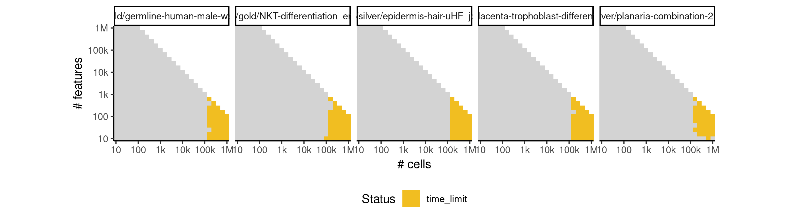

# scorpius


## ERROR STATUS METHOD_ERROR

### ERROR CLUSTER METHOD_ERROR -- 1


 * Number of instances: 10
 * Dataset ids: scaling_0015, scaling_0050, scaling_0075, scaling_0225, scaling_0254, scaling_0389, scaling_0505, scaling_0764, scaling_0855, scaling_1245

Last 10 lines of scaling_0015:
```
    filter, lag
The following objects are masked from ‘package:base’:
    intersect, setdiff, setequal, union
Attaching package: ‘purrr’
The following object is masked from ‘package:jsonlite’:
    flatten
Error in stats::smooth.spline(lambda, xj, ..., df = df, keep.data = FALSE) : 
  smoothing parameter value too small
Calls: <Anonymous> -> <Anonymous> -> smoother_function -> <Anonymous>
Execution halted
```

### ERROR CLUSTER METHOD_ERROR -- 2


 * Number of instances: 27
 * Dataset ids: scaling_0030, scaling_0040, scaling_0105, scaling_0139, scaling_0140, scaling_0179, scaling_0180, scaling_0215, scaling_0255, scaling_0330, scaling_0390, scaling_0454, scaling_0455, scaling_0525, scaling_0600, scaling_0679, scaling_0680, scaling_0765, scaling_0910, scaling_0980, scaling_1050, scaling_1145, scaling_1244, scaling_1379, scaling_1380, scaling_1500, scaling_1735

Last 10 lines of scaling_0030:
```
    filter, lag
The following objects are masked from ‘package:base’:
    intersect, setdiff, setequal, union
Attaching package: ‘purrr’
The following object is masked from ‘package:jsonlite’:
    flatten
Error in stats::smooth.spline(lambda, xj, ..., df = df, keep.data = FALSE) : 
  'tol' must be strictly positive and finite
Calls: <Anonymous> -> <Anonymous> -> smoother_function -> <Anonymous>
Execution halted
```

## ERROR STATUS TIME_LIMIT

### ERROR CLUSTER TIME_LIMIT -- 1


 * Number of instances: 189
 * Dataset ids: scaling_1088, scaling_1181, scaling_1197, scaling_1213, scaling_1229, scaling_1295, scaling_1296, scaling_1316, scaling_1317, scaling_1337, scaling_1338, scaling_1358, scaling_1359, scaling_1404, scaling_1416, scaling_1428, scaling_1440, scaling_1451, scaling_1452, scaling_1463, scaling_1464, scaling_1475, scaling_1476, scaling_1487, scaling_1488, scaling_1499, scaling_1546, scaling_1547, scaling_1548, scaling_1549, scaling_1565, scaling_1566, scaling_1567, scaling_1568, scaling_1584, scaling_1585, scaling_1586, scaling_1587, scaling_1603, scaling_1604, scaling_1605, scaling_1606, scaling_1623, scaling_1624, scaling_1625, scaling_1644, scaling_1645, scaling_1646, scaling_1647, scaling_1666, scaling_1667, scaling_1668, scaling_1669, scaling_1688, scaling_1689, scaling_1690, scaling_1691, scaling_1710, scaling_1711, scaling_1712, scaling_1713, scaling_1732, scaling_1733, scaling_1734, scaling_1739, scaling_1743, scaling_1747, scaling_1751, scaling_1755, scaling_1778, scaling_1779, scaling_1780, scaling_1793, scaling_1794, scaling_1795, scaling_1808, scaling_1809, scaling_1810, scaling_1823, scaling_1824, scaling_1825, scaling_1838, scaling_1839, scaling_1840, scaling_1847, scaling_1848, scaling_1855, scaling_1856, scaling_1863, scaling_1864, scaling_1871, scaling_1872, scaling_1879, scaling_1880, scaling_1908, scaling_1909, scaling_1910, scaling_1911, scaling_1912, scaling_1930, scaling_1931, scaling_1932, scaling_1933, scaling_1934, scaling_1952, scaling_1953, scaling_1954, scaling_1955, scaling_1956, scaling_1975, scaling_1976, scaling_1977, scaling_1978, scaling_1996, scaling_1997, scaling_1998, scaling_1999, scaling_2000, scaling_2008, scaling_2016, scaling_2024, scaling_2032, scaling_2040, scaling_2052, scaling_2053, scaling_2054, scaling_2055, scaling_2068, scaling_2069, scaling_2070, scaling_2082, scaling_2083, scaling_2084, scaling_2085, scaling_2097, scaling_2098, scaling_2099, scaling_2100, scaling_2112, scaling_2113, scaling_2114, scaling_2115, scaling_2121, scaling_2127, scaling_2133, scaling_2139, scaling_2145, scaling_2159, scaling_2160, scaling_2161, scaling_2175, scaling_2176, scaling_2177, scaling_2190, scaling_2191, scaling_2192, scaling_2193, scaling_2206, scaling_2207, scaling_2208, scaling_2209, scaling_2223, scaling_2224, scaling_2225, scaling_2242, scaling_2243, scaling_2244, scaling_2245, scaling_2246, scaling_2263, scaling_2264, scaling_2265, scaling_2266, scaling_2267, scaling_2284, scaling_2285, scaling_2286, scaling_2287, scaling_2288, scaling_2305, scaling_2306, scaling_2307, scaling_2308, scaling_2309, scaling_2326, scaling_2327, scaling_2328, scaling_2329, scaling_2330

Last 10 lines of scaling_1088:
```
File: /home/rcannood/Workspace/dynverse/dynbenchmark//derived/05-scaling/suite/scorpius/Cat2/r2gridengine/20181008_214854_scorpius_Cat2_P4mlq7IUrz/log/log.408.e.txt
```


