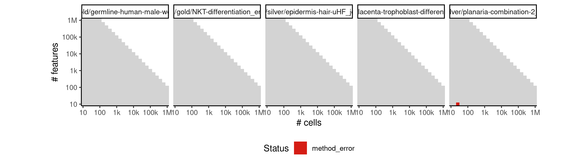

# scorpius


## ERROR STATUS METHOD_ERROR

### ERROR CLUSTER METHOD_ERROR -- 1


 * Number of instances: 9
 * Dataset ids: scaling_0015, scaling_0050, scaling_0075, scaling_0225, scaling_0254, scaling_0389, scaling_0505, scaling_0764, scaling_0855

Last 10 lines of scaling_0015:
```
    filter, lag
The following objects are masked from ‘package:base’:
    intersect, setdiff, setequal, union
Attaching package: ‘purrr’
The following object is masked from ‘package:jsonlite’:
    flatten
Error in stats::smooth.spline(lambda, xj, ..., df = df, keep.data = FALSE) : 
  smoothing parameter value too small
Calls: <Anonymous> -> <Anonymous> -> smoother_function -> <Anonymous>
Execution halted
```

### ERROR CLUSTER METHOD_ERROR -- 2


 * Number of instances: 22
 * Dataset ids: scaling_0030, scaling_0040, scaling_0105, scaling_0139, scaling_0140, scaling_0179, scaling_0180, scaling_0215, scaling_0255, scaling_0330, scaling_0390, scaling_0454, scaling_0455, scaling_0525, scaling_0600, scaling_0679, scaling_0680, scaling_0765, scaling_0910, scaling_0980, scaling_1050, scaling_1145

Last 10 lines of scaling_0030:
```
    filter, lag
The following objects are masked from ‘package:base’:
    intersect, setdiff, setequal, union
Attaching package: ‘purrr’
The following object is masked from ‘package:jsonlite’:
    flatten
Error in stats::smooth.spline(lambda, xj, ..., df = df, keep.data = FALSE) : 
  'tol' must be strictly positive and finite
Calls: <Anonymous> -> <Anonymous> -> smoother_function -> <Anonymous>
Execution halted
```

## ERROR STATUS TIME_LIMIT

### ERROR CLUSTER TIME_LIMIT -- 1


 * Number of instances: 1
 * Dataset ids: scaling_1088

Last 10 lines of scaling_1088:
```
File: /home/rcannood/Workspace/dynverse/dynbenchmark//derived/05-scaling/suite/scorpius/Cat2/r2gridengine/20181008_214854_scorpius_Cat2_P4mlq7IUrz/log/log.408.e.txt
```


