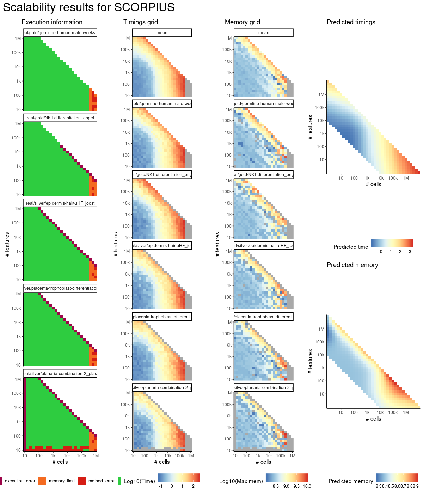

# scorpius


## ERROR STATUS METHOD_ERROR

### ERROR CLUSTER METHOD_ERROR -- 1


 * Number of instances: 10
 * Dataset ids: scaling_0015, scaling_0050, scaling_0075, scaling_0104, scaling_0140, scaling_0180, scaling_0254, scaling_0330, scaling_0680, scaling_0910

Last 10 lines of scaling_0015:
```
Executing 'scorpius' on 'scaling_1.2_1'
With parameters: list(distance_method = "spearman", ndim = 3L, k = 4L, thresh = 0.001,     maxit = 10L, stretch = 0, smoother = "smooth_spline"),
inputs: expression, and
priors : 
smoothing parameter value too small
```

### ERROR CLUSTER METHOD_ERROR -- 2


 * Number of instances: 1
 * Dataset ids: scaling_0030

Last 10 lines of scaling_0030:
```
Executing 'scorpius' on 'scaling_1.4_1'
With parameters: list(distance_method = "spearman", ndim = 3L, k = 4L, thresh = 0.001,     maxit = 10L, stretch = 0, smoother = "smooth_spline"),
inputs: expression, and
priors : 
length of 'dimnames' [2] not equal to array extent
```

### ERROR CLUSTER METHOD_ERROR -- 3


 * Number of instances: 22
 * Dataset ids: scaling_0040, scaling_0105, scaling_0139, scaling_0179, scaling_0215, scaling_0255, scaling_0329, scaling_0390, scaling_0455, scaling_0505, scaling_0600, scaling_0679, scaling_0764, scaling_0765, scaling_0854, scaling_0855, scaling_0980, scaling_1050, scaling_1145, scaling_1244, scaling_1379, scaling_1499

Last 10 lines of scaling_0040:
```
Executing 'scorpius' on 'scaling_1.4_1.2'
With parameters: list(distance_method = "spearman", ndim = 3L, k = 4L, thresh = 0.001,     maxit = 10L, stretch = 0, smoother = "smooth_spline"),
inputs: expression, and
priors : 
'tol' must be strictly positive and finite
```

### ERROR CLUSTER METHOD_ERROR -- 4


 * Number of instances: 23
 * Dataset ids: scaling_1549, scaling_1568, scaling_1606, scaling_1735, scaling_1739, scaling_1780, scaling_1810, scaling_1856, scaling_1864, scaling_1872, scaling_1911, scaling_1978, scaling_1999, scaling_2008, scaling_2055, scaling_2100, scaling_2121, scaling_2133, scaling_2139, scaling_2145, scaling_2161, scaling_2177, scaling_2245

Last 10 lines of scaling_1549:
```
Executing 'scorpius' on 'scaling_5.8_1'
With parameters: list(distance_method = "spearman", ndim = 3L, k = 4L, thresh = 0.001,     maxit = 10L, stretch = 0, smoother = "smooth_spline"),
inputs: expression, and
priors : 
bad allocation in previous or concurrent attempt
```

## ERROR STATUS MEMORY_LIMIT

### ERROR CLUSTER MEMORY_LIMIT -- 1


 * Number of instances: 36
 * Dataset ids: scaling_1452, scaling_1464, scaling_1476, scaling_1488, scaling_1500, scaling_1548, scaling_1567, scaling_1586, scaling_1605, scaling_1624, scaling_1646, scaling_1668, scaling_1690, scaling_1712, scaling_1734, scaling_1847, scaling_1855, scaling_1863, scaling_1871, scaling_1879, scaling_1910, scaling_1932, scaling_1954, scaling_1976, scaling_1998, scaling_2054, scaling_2069, scaling_2084, scaling_2099, scaling_2114, scaling_2160, scaling_2176, scaling_2192, scaling_2208, scaling_2224, scaling_2244

Last 10 lines of scaling_1452:
```
Executing 'scorpius' on 'scaling_5.6_1'
With parameters: list(distance_method = "spearman", ndim = 3L, k = 4L, thresh = 0.001,     maxit = 10L, stretch = 0, smoother = "smooth_spline"),
inputs: expression, and
priors : 
cannot allocate vector of size 3.0 Gb
```

### ERROR CLUSTER MEMORY_LIMIT -- 2


 * Number of instances: 34
 * Dataset ids: scaling_1587, scaling_1625, scaling_1647, scaling_1669, scaling_1691, scaling_1713, scaling_1743, scaling_1747, scaling_1751, scaling_1755, scaling_1795, scaling_1825, scaling_1840, scaling_1848, scaling_1880, scaling_1912, scaling_1933, scaling_1934, scaling_1955, scaling_1956, scaling_1977, scaling_2000, scaling_2016, scaling_2024, scaling_2032, scaling_2040, scaling_2070, scaling_2085, scaling_2115, scaling_2127, scaling_2193, scaling_2209, scaling_2225, scaling_2246

Last 10 lines of scaling_1587:
```
Executing 'scorpius' on 'scaling_5.8_1'
With parameters: list(distance_method = "spearman", ndim = 3L, k = 4L, thresh = 0.001,     maxit = 10L, stretch = 0, smoother = "smooth_spline"),
inputs: expression, and
priors : 
std::bad_alloc
```


