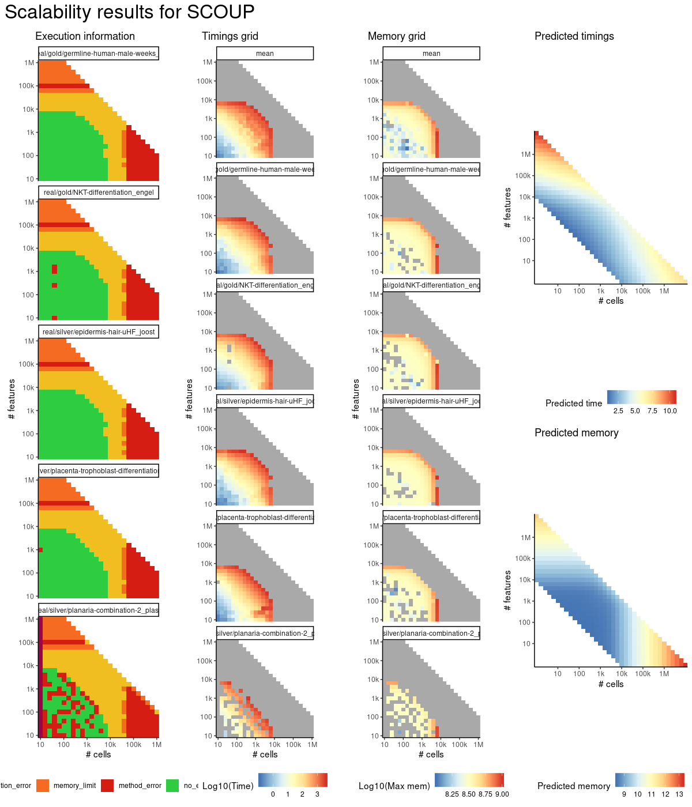
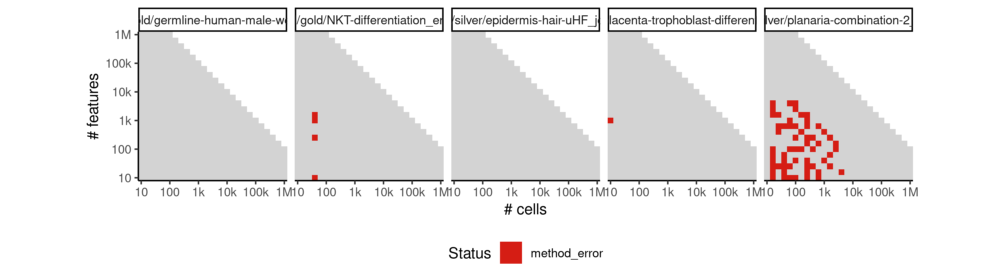
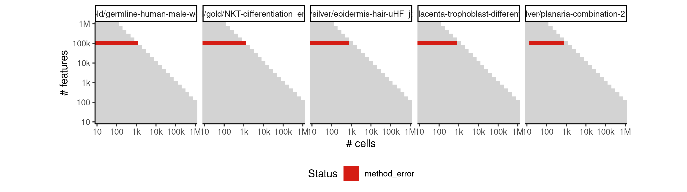

# scoup


## ERROR STATUS METHOD_ERROR

### ERROR CLUSTER METHOD_ERROR -- 1


 * Number of instances: 64
 * Dataset ids: scaling_0015, scaling_0029, scaling_0039, scaling_0044, scaling_0050, scaling_0072, scaling_0073, scaling_0074, scaling_0075, scaling_0101, scaling_0103, scaling_0105, scaling_0135, scaling_0137, scaling_0138, scaling_0177, scaling_0180, scaling_0213, scaling_0225, scaling_0252, scaling_0255, scaling_0275, scaling_0290, scaling_0309, scaling_0322, scaling_0325, scaling_0327, scaling_0328, scaling_0329, scaling_0339, scaling_0386, scaling_0444, scaling_0446, scaling_0448, scaling_0468, scaling_0497, scaling_0499, scaling_0501, scaling_0503, scaling_0504, scaling_0522, scaling_0524, scaling_0550, scaling_0551, scaling_0552, scaling_0555, scaling_0567, scaling_0595, scaling_0596, scaling_0673, scaling_0674, scaling_0676, scaling_0756, scaling_0842, scaling_0843, scaling_0844, scaling_0845, scaling_0850, scaling_0903, scaling_0905, scaling_0906, scaling_0946, scaling_0947, scaling_0948

Last 10 lines of scaling_0015:
```
The following object is masked from ‘package:jsonlite’:
    flatten
/SCOUP/sp data init time_sp dimred 10 16 2
/SCOUP/scoup data init time_sp gpara cpara ll 10 16 -k 10 -m 100 -M 100 -a 0.1 -A 100 -t 0.001 -T 2 -s 0.1 -e 0.01
0-th iteration in first EM
log-likelihood: -nan
0-th iteration in second EM
log-likelihood: nan
Error: SCOUP returned NaNs
Execution halted
```

### ERROR CLUSTER METHOD_ERROR -- 2


 * Number of instances: 10
 * Dataset ids: scaling_0994, scaling_1008, scaling_1022, scaling_1036, scaling_1050, scaling_1069, scaling_1088, scaling_1107, scaling_1126, scaling_1145

Last 10 lines of scaling_0994:
```
Attaching package: ‘purrr’
The following object is masked from ‘package:jsonlite’:
    flatten
/SCOUP/sp data init time_sp dimred 10 63096 2
Segmentation fault (core dumped)
/SCOUP/scoup data init time_sp gpara cpara ll 10 63096 -k 1 -m 100 -M 100 -a 0.1 -A 100 -t 0.001 -T 2 -s 0.1 -e 0.01
Segmentation fault (core dumped)
Error in `.rowNamesDF<-`(x, value = value) : invalid 'row.names' length
Calls: rownames<- ... row.names<- -> row.names<-.data.frame -> .rowNamesDF<-
Execution halted
```

### ERROR CLUSTER METHOD_ERROR -- 3


 * Number of instances: 4
 * Dataset ids: scaling_1051, scaling_1070, scaling_1089, scaling_1108

Last 10 lines of scaling_1051:
```
Attaching package: ‘purrr’
The following object is masked from ‘package:jsonlite’:
    flatten
/SCOUP/sp data init time_sp dimred 100000 10 2
Segmentation fault (core dumped)
/SCOUP/scoup data init time_sp gpara cpara ll 100000 10 -k 1 -m 100 -M 100 -a 0.1 -A 100 -t 0.001 -T 2 -s 0.1 -e 0.01
error at reading initial parameter
Error in `.rowNamesDF<-`(x, value = value) : invalid 'row.names' length
Calls: rownames<- ... row.names<- -> row.names<-.data.frame -> .rowNamesDF<-
Execution halted
```

## ERROR STATUS TIME_LIMIT

### ERROR CLUSTER TIME_LIMIT -- 1


 * Number of instances: 198
 * Dataset ids: scaling_0601, scaling_0616, scaling_0617, scaling_0632, scaling_0633, scaling_0648, scaling_0649, scaling_0664, scaling_0680, scaling_0681, scaling_0682, scaling_0696, scaling_0697, scaling_0698, scaling_0699, scaling_0713, scaling_0714, scaling_0715, scaling_0716, scaling_0730, scaling_0731, scaling_0732, scaling_0733, scaling_0747, scaling_0748, scaling_0750, scaling_0764, scaling_0765, scaling_0766, scaling_0767, scaling_0768, scaling_0781, scaling_0782, scaling_0783, scaling_0784, scaling_0785, scaling_0786, scaling_0799, scaling_0800, scaling_0801, scaling_0802, scaling_0803, scaling_0804, scaling_0817, scaling_0818, scaling_0819, scaling_0820, scaling_0821, scaling_0822, scaling_0835, scaling_0836, scaling_0837, scaling_0839, scaling_0840, scaling_0852, scaling_0853, scaling_0854, scaling_0855, scaling_0856, scaling_0857, scaling_0858, scaling_0864, scaling_0865, scaling_0866, scaling_0867, scaling_0868, scaling_0869, scaling_0875, scaling_0876, scaling_0877, scaling_0878, scaling_0879, scaling_0880, scaling_0886, scaling_0887, scaling_0888, scaling_0889, scaling_0890, scaling_0891, scaling_0897, scaling_0898, scaling_0899, scaling_0901, scaling_0902, scaling_0907, scaling_0908, scaling_0909, scaling_0910, scaling_0911, scaling_0918, scaling_0919, scaling_0926, scaling_0927, scaling_0934, scaling_0935, scaling_0942, scaling_0943, scaling_0944, scaling_0949, scaling_0950, scaling_0951, scaling_0952, scaling_0955, scaling_0956, scaling_0957, scaling_0958, scaling_0961, scaling_0963, scaling_0964, scaling_0967, scaling_0969, scaling_0970, scaling_0973, scaling_0975, scaling_0976, scaling_0977, scaling_0978, scaling_0979, scaling_0982, scaling_0983, scaling_0991, scaling_0992, scaling_0993, scaling_0996, scaling_0997, scaling_1006, scaling_1007, scaling_1010, scaling_1011, scaling_1019, scaling_1020, scaling_1021, scaling_1024, scaling_1025, scaling_1034, scaling_1035, scaling_1038, scaling_1039, scaling_1040, scaling_1041, scaling_1042, scaling_1043, scaling_1044, scaling_1045, scaling_1046, scaling_1047, scaling_1048, scaling_1049, scaling_1052, scaling_1053, scaling_1054, scaling_1055, scaling_1064, scaling_1065, scaling_1066, scaling_1067, scaling_1068, scaling_1071, scaling_1072, scaling_1073, scaling_1074, scaling_1084, scaling_1085, scaling_1086, scaling_1090, scaling_1091, scaling_1092, scaling_1093, scaling_1102, scaling_1103, scaling_1104, scaling_1105, scaling_1106, scaling_1109, scaling_1110, scaling_1111, scaling_1112, scaling_1113, scaling_1121, scaling_1122, scaling_1123, scaling_1124, scaling_1128, scaling_1129, scaling_1130, scaling_1131, scaling_1132, scaling_1133, scaling_1134, scaling_1135, scaling_1136, scaling_1137, scaling_1138, scaling_1139, scaling_1140, scaling_1141, scaling_1142, scaling_1143

Last 10 lines of scaling_0601:
```
File: /home/rcannood/Workspace/dynverse/dynbenchmark//derived/05-scaling/suite/scoup/Cat1/r2gridengine/20181008_142134_scoup_Cat1_27Ir8ImEHq/log/log.601.e.txt
```

## ERROR STATUS MEMORY_LIMIT

### ERROR CLUSTER MEMORY_LIMIT -- 1


 * Number of instances: 11
 * Dataset ids: scaling_0962, scaling_0968, scaling_0974, scaling_0980, scaling_0981, scaling_0995, scaling_1009, scaling_1023, scaling_1087, scaling_1125, scaling_1144

Last 10 lines of scaling_0962:
```
    flatten
/SCOUP/sp data init time_sp dimred 16 39811 2
terminate called after throwing an instance of 'std::bad_alloc'
  what():  std::bad_alloc
Aborted (core dumped)
/SCOUP/scoup data init time_sp gpara cpara ll 16 39811 -k 1 -m 100 -M 100 -a 0.1 -A 100 -t 0.001 -T 2 -s 0.1 -e 0.01
error at reading initial parameter
Error in `.rowNamesDF<-`(x, value = value) : invalid 'row.names' length
Calls: rownames<- ... row.names<- -> row.names<-.data.frame -> .rowNamesDF<-
Execution halted
```


