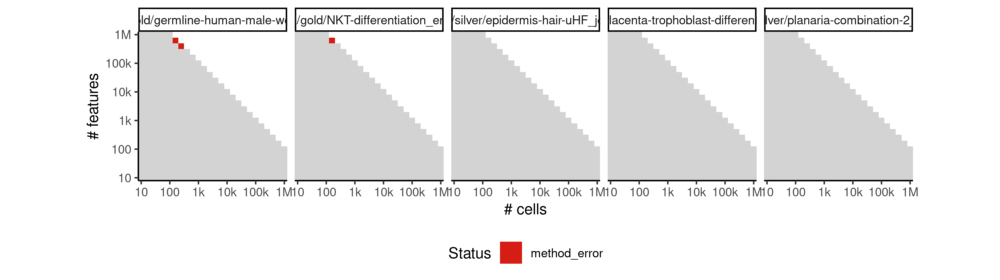
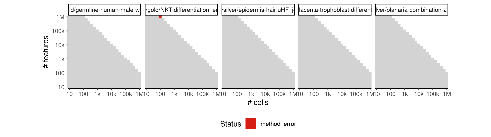

# scuba


## ERROR STATUS METHOD_ERROR

### ERROR CLUSTER METHOD_ERROR -- 1


 * Number of instances: 3
 * Dataset ids: scaling_2227, scaling_2228, scaling_2248

Last 10 lines of scaling_2227:
```
Input saved to /data/tmp//RtmpkyywhV/file1736e29ac0101/ti/input: 
	expression.csv
	params.json
Running /bin/singularity run --pwd /ti/workspace -B \
  '/data/tmp//RtmpkyywhV/file1736e29ac0101/ti:/ti,/data/tmp//RtmpkyywhV/file1736e7fb3fb47/tmp:/tmp2' \
  /group/irc/shared/dynverse/dynbenchmark/derived/singularity_images/dynverse/ti_scuba.simg
```

### ERROR CLUSTER METHOD_ERROR -- 2


 * Number of instances: 1
 * Dataset ids: scaling_2247

Last 10 lines of scaling_2247:
```
  File "/usr/local/lib/python3.6/site-packages/pandas/io/parsers.py", line 446, in _read
    data = parser.read(nrows)
  File "/usr/local/lib/python3.6/site-packages/pandas/io/parsers.py", line 1036, in read
    ret = self._engine.read(nrows)
  File "/usr/local/lib/python3.6/site-packages/pandas/io/parsers.py", line 1848, in read
    data = self._reader.read(nrows)
  File "pandas/_libs/parsers.pyx", line 876, in pandas._libs.parsers.TextReader.read
  File "pandas/_libs/parsers.pyx", line 891, in pandas._libs.parsers.TextReader._read_low_memory
  File "pandas/_libs/parsers.pyx", line 968, in pandas._libs.parsers.TextReader._read_rows
SystemError: <built-in method _convert_column_data of pandas._libs.parsers.TextReader object at 0x7f5ef9f5d328> returned NULL without setting an error
```

## ERROR STATUS TIME_LIMIT

### ERROR CLUSTER TIME_LIMIT -- 1


 * Number of instances: 676
 * Dataset ids: scaling_0564, scaling_0573, scaling_0582, scaling_0591, scaling_0600, scaling_0615, scaling_0616, scaling_0631, scaling_0632, scaling_0647, scaling_0648, scaling_0664, scaling_0680, scaling_0695, scaling_0696, scaling_0697, scaling_0711, scaling_0712, scaling_0713, scaling_0714, scaling_0729, scaling_0730, scaling_0731, scaling_0746, scaling_0747, scaling_0748, scaling_0764, scaling_0765, scaling_0779, scaling_0780, scaling_0781, scaling_0782, scaling_0783, scaling_0798, scaling_0799, scaling_0800, scaling_0801, scaling_0816, scaling_0817, scaling_0818, scaling_0819, scaling_0834, scaling_0835, scaling_0836, scaling_0837, scaling_0852, scaling_0853, scaling_0854, scaling_0855, scaling_0864, scaling_0865, scaling_0866, scaling_0875, scaling_0876, scaling_0877, scaling_0886, scaling_0887, scaling_0888, scaling_0897, scaling_0898, scaling_0899, scaling_0908, scaling_0909, scaling_0910, scaling_0917, scaling_0918, scaling_0925, scaling_0926, scaling_0933, scaling_0934, scaling_0941, scaling_0942, scaling_0949, scaling_0950, scaling_0955, scaling_0956, scaling_0961, scaling_0962, scaling_0967, scaling_0968, scaling_0973, scaling_0974, scaling_0979, scaling_0980, scaling_0991, scaling_0992, scaling_0993, scaling_0994, scaling_1005, scaling_1006, scaling_1007, scaling_1008, scaling_1019, scaling_1020, scaling_1021, scaling_1022, scaling_1033, scaling_1034, scaling_1035, scaling_1036, scaling_1047, scaling_1049, scaling_1050, scaling_1064, scaling_1065, scaling_1066, scaling_1067, scaling_1068, scaling_1069, scaling_1082, scaling_1083, scaling_1084, scaling_1085, scaling_1086, scaling_1087, scaling_1088, scaling_1102, scaling_1103, scaling_1104, scaling_1105, scaling_1106, scaling_1107, scaling_1121, scaling_1122, scaling_1123, scaling_1124, scaling_1125, scaling_1126, scaling_1140, scaling_1141, scaling_1142, scaling_1143, scaling_1144, scaling_1145, scaling_1147, scaling_1149, scaling_1151, scaling_1153, scaling_1155, scaling_1157, scaling_1159, scaling_1161, scaling_1163, scaling_1165, scaling_1176, scaling_1177, scaling_1178, scaling_1179, scaling_1180, scaling_1181, scaling_1192, scaling_1193, scaling_1194, scaling_1195, scaling_1196, scaling_1197, scaling_1209, scaling_1210, scaling_1211, scaling_1212, scaling_1213, scaling_1225, scaling_1226, scaling_1227, scaling_1228, scaling_1229, scaling_1241, scaling_1242, scaling_1243, scaling_1244, scaling_1245, scaling_1248, scaling_1249, scaling_1252, scaling_1253, scaling_1256, scaling_1257, scaling_1260, scaling_1261, scaling_1264, scaling_1265, scaling_1267, scaling_1269, scaling_1271, scaling_1273, scaling_1275, scaling_1288, scaling_1289, scaling_1290, scaling_1291, scaling_1292, scaling_1293, scaling_1294, scaling_1295, scaling_1296, scaling_1310, scaling_1311, scaling_1312, scaling_1313, scaling_1314, scaling_1315, scaling_1316, scaling_1317, scaling_1330, scaling_1331, scaling_1332, scaling_1333, scaling_1334, scaling_1335, scaling_1336, scaling_1337, scaling_1338, scaling_1351, scaling_1352, scaling_1353, scaling_1354, scaling_1355, scaling_1356, scaling_1357, scaling_1358, scaling_1359, scaling_1373, scaling_1374, scaling_1375, scaling_1376, scaling_1377, scaling_1378, scaling_1379, scaling_1380, scaling_1387, scaling_1388, scaling_1389, scaling_1390, scaling_1391, scaling_1392, scaling_1399, scaling_1400, scaling_1401, scaling_1402, scaling_1403, scaling_1404, scaling_1411, scaling_1412, scaling_1413, scaling_1414, scaling_1415, scaling_1416, scaling_1424, scaling_1425, scaling_1426, scaling_1427, scaling_1428, scaling_1435, scaling_1436, scaling_1437, scaling_1438, scaling_1439, scaling_1440, scaling_1448, scaling_1449, scaling_1450, scaling_1451, scaling_1452, scaling_1460, scaling_1461, scaling_1462, scaling_1463, scaling_1464, scaling_1472, scaling_1473, scaling_1474, scaling_1475, scaling_1476, scaling_1484, scaling_1485, scaling_1486, scaling_1487, scaling_1488, scaling_1496, scaling_1497, scaling_1498, scaling_1499, scaling_1500, scaling_1504, scaling_1505, scaling_1506, scaling_1510, scaling_1511, scaling_1512, scaling_1516, scaling_1517, scaling_1518, scaling_1522, scaling_1523, scaling_1524, scaling_1528, scaling_1529, scaling_1530, scaling_1541, scaling_1542, scaling_1543, scaling_1544, scaling_1545, scaling_1546, scaling_1547, scaling_1548, scaling_1549, scaling_1560, scaling_1561, scaling_1562, scaling_1563, scaling_1564, scaling_1565, scaling_1566, scaling_1567, scaling_1568, scaling_1579, scaling_1580, scaling_1581, scaling_1582, scaling_1583, scaling_1584, scaling_1585, scaling_1586, scaling_1587, scaling_1598, scaling_1599, scaling_1600, scaling_1601, scaling_1602, scaling_1603, scaling_1604, scaling_1605, scaling_1606, scaling_1618, scaling_1619, scaling_1620, scaling_1621, scaling_1622, scaling_1623, scaling_1624, scaling_1625, scaling_1637, scaling_1638, scaling_1639, scaling_1640, scaling_1641, scaling_1642, scaling_1643, scaling_1644, scaling_1645, scaling_1646, scaling_1647, scaling_1659, scaling_1660, scaling_1661, scaling_1662, scaling_1663, scaling_1664, scaling_1665, scaling_1666, scaling_1667, scaling_1668, scaling_1669, scaling_1681, scaling_1682, scaling_1683, scaling_1684, scaling_1685, scaling_1686, scaling_1687, scaling_1688, scaling_1689, scaling_1690, scaling_1691, scaling_1703, scaling_1704, scaling_1705, scaling_1706, scaling_1707, scaling_1708, scaling_1709, scaling_1710, scaling_1711, scaling_1712, scaling_1713, scaling_1726, scaling_1727, scaling_1728, scaling_1729, scaling_1730, scaling_1731, scaling_1732, scaling_1733, scaling_1734, scaling_1735, scaling_1738, scaling_1739, scaling_1742, scaling_1743, scaling_1746, scaling_1747, scaling_1750, scaling_1751, scaling_1754, scaling_1755, scaling_1757, scaling_1759, scaling_1761, scaling_1763, scaling_1765, scaling_1773, scaling_1774, scaling_1775, scaling_1776, scaling_1777, scaling_1778, scaling_1779, scaling_1780, scaling_1788, scaling_1789, scaling_1790, scaling_1791, scaling_1792, scaling_1793, scaling_1794, scaling_1795, scaling_1803, scaling_1804, scaling_1805, scaling_1806, scaling_1807, scaling_1808, scaling_1809, scaling_1810, scaling_1819, scaling_1820, scaling_1821, scaling_1822, scaling_1823, scaling_1824, scaling_1825, scaling_1834, scaling_1835, scaling_1836, scaling_1837, scaling_1838, scaling_1839, scaling_1840, scaling_1845, scaling_1846, scaling_1847, scaling_1848, scaling_1853, scaling_1854, scaling_1855, scaling_1856, scaling_1861, scaling_1862, scaling_1863, scaling_1864, scaling_1869, scaling_1870, scaling_1871, scaling_1872, scaling_1877, scaling_1878, scaling_1879, scaling_1880, scaling_1882, scaling_1884, scaling_1886, scaling_1888, scaling_1890, scaling_1901, scaling_1902, scaling_1903, scaling_1904, scaling_1905, scaling_1906, scaling_1907, scaling_1908, scaling_1909, scaling_1910, scaling_1911, scaling_1912, scaling_1923, scaling_1924, scaling_1925, scaling_1926, scaling_1927, scaling_1928, scaling_1929, scaling_1930, scaling_1931, scaling_1932, scaling_1933, scaling_1934, scaling_1945, scaling_1946, scaling_1947, scaling_1948, scaling_1949, scaling_1950, scaling_1951, scaling_1952, scaling_1953, scaling_1954, scaling_1955, scaling_1956, scaling_1967, scaling_1968, scaling_1969, scaling_1970, scaling_1971, scaling_1972, scaling_1973, scaling_1974, scaling_1975, scaling_1976, scaling_1977, scaling_1978, scaling_1990, scaling_1991, scaling_1992, scaling_1993, scaling_1994, scaling_1995, scaling_1996, scaling_1997, scaling_1998, scaling_1999, scaling_2000, scaling_2004, scaling_2005, scaling_2006, scaling_2007, scaling_2008, scaling_2012, scaling_2013, scaling_2014, scaling_2015, scaling_2016, scaling_2020, scaling_2021, scaling_2022, scaling_2023, scaling_2024, scaling_2028, scaling_2029, scaling_2030, scaling_2031, scaling_2032, scaling_2037, scaling_2038, scaling_2039, scaling_2040, scaling_2048, scaling_2049, scaling_2050, scaling_2051, scaling_2052, scaling_2053, scaling_2054, scaling_2055, scaling_2063, scaling_2064, scaling_2065, scaling_2066, scaling_2067, scaling_2068, scaling_2069, scaling_2070, scaling_2078, scaling_2079, scaling_2080, scaling_2081, scaling_2082, scaling_2083, scaling_2084, scaling_2085, scaling_2093, scaling_2094, scaling_2095, scaling_2096, scaling_2097, scaling_2098, scaling_2099, scaling_2100, scaling_2108, scaling_2109, scaling_2110, scaling_2111, scaling_2112, scaling_2113, scaling_2114, scaling_2115, scaling_2119, scaling_2120, scaling_2121, scaling_2125, scaling_2126, scaling_2127, scaling_2131, scaling_2132, scaling_2133, scaling_2137, scaling_2138, scaling_2139, scaling_2143, scaling_2144, scaling_2145, scaling_2152, scaling_2153, scaling_2154, scaling_2155, scaling_2156, scaling_2157, scaling_2158, scaling_2159, scaling_2160, scaling_2161, scaling_2168, scaling_2169, scaling_2170, scaling_2171, scaling_2172, scaling_2173, scaling_2174, scaling_2175, scaling_2176, scaling_2177, scaling_2184, scaling_2185, scaling_2186, scaling_2187, scaling_2188, scaling_2189, scaling_2190, scaling_2191, scaling_2192, scaling_2193, scaling_2200, scaling_2201, scaling_2202, scaling_2203, scaling_2204, scaling_2205, scaling_2206, scaling_2207, scaling_2208, scaling_2209, scaling_2216, scaling_2217, scaling_2218, scaling_2219, scaling_2220, scaling_2221, scaling_2222, scaling_2223, scaling_2224, scaling_2225, scaling_2234, scaling_2235, scaling_2236, scaling_2237, scaling_2238, scaling_2239, scaling_2240, scaling_2241, scaling_2242, scaling_2243, scaling_2244, scaling_2245, scaling_2246, scaling_2254

Last 10 lines of scaling_0564:
```
File: /home/rcannood/Workspace/dynverse/dynbenchmark//derived/05-scaling/suite/scuba/Cat1/r2gridengine/20181008_142110_scuba_Cat1_VleUYDgAwV/log/log.564.e.txt
```

## ERROR STATUS MEMORY_LIMIT


