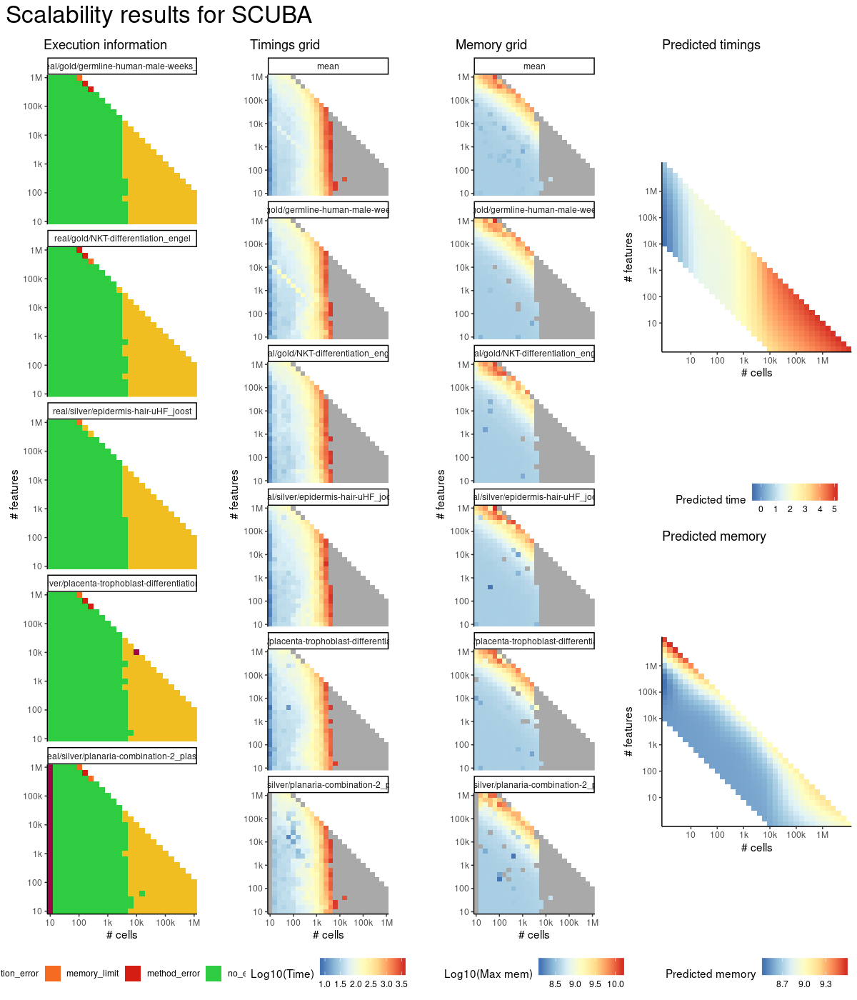

# scuba


## ERROR STATUS TIME_LIMIT

### ERROR CLUSTER TIME_LIMIT -- 1


 * Number of instances: 226
 * Dataset ids: scaling_0564, scaling_0573, scaling_0582, scaling_0591, scaling_0600, scaling_0615, scaling_0616, scaling_0631, scaling_0632, scaling_0647, scaling_0648, scaling_0662, scaling_0663, scaling_0664, scaling_0679, scaling_0680, scaling_0694, scaling_0695, scaling_0696, scaling_0697, scaling_0711, scaling_0712, scaling_0713, scaling_0714, scaling_0729, scaling_0730, scaling_0731, scaling_0746, scaling_0747, scaling_0748, scaling_0763, scaling_0764, scaling_0765, scaling_0780, scaling_0781, scaling_0782, scaling_0783, scaling_0797, scaling_0798, scaling_0799, scaling_0800, scaling_0801, scaling_0815, scaling_0816, scaling_0817, scaling_0818, scaling_0819, scaling_0834, scaling_0835, scaling_0836, scaling_0837, scaling_0852, scaling_0853, scaling_0854, scaling_0855, scaling_0864, scaling_0865, scaling_0866, scaling_0874, scaling_0875, scaling_0876, scaling_0877, scaling_0885, scaling_0886, scaling_0887, scaling_0888, scaling_0897, scaling_0898, scaling_0899, scaling_0908, scaling_0909, scaling_0910, scaling_0917, scaling_0918, scaling_0925, scaling_0926, scaling_0933, scaling_0934, scaling_0941, scaling_0942, scaling_0949, scaling_0950, scaling_0955, scaling_0956, scaling_0961, scaling_0962, scaling_0967, scaling_0968, scaling_0973, scaling_0974, scaling_0979, scaling_0980, scaling_0991, scaling_0992, scaling_0993, scaling_0994, scaling_1004, scaling_1005, scaling_1006, scaling_1007, scaling_1008, scaling_1019, scaling_1020, scaling_1021, scaling_1022, scaling_1033, scaling_1034, scaling_1035, scaling_1036, scaling_1047, scaling_1048, scaling_1049, scaling_1050, scaling_0564, scaling_0573, scaling_0582, scaling_0591, scaling_0600, scaling_0615, scaling_0616, scaling_0631, scaling_0632, scaling_0647, scaling_0648, scaling_0662, scaling_0663, scaling_0664, scaling_0679, scaling_0680, scaling_0694, scaling_0695, scaling_0696, scaling_0697, scaling_0711, scaling_0712, scaling_0713, scaling_0714, scaling_0729, scaling_0730, scaling_0731, scaling_0746, scaling_0747, scaling_0748, scaling_0763, scaling_0764, scaling_0765, scaling_0780, scaling_0781, scaling_0782, scaling_0783, scaling_0797, scaling_0798, scaling_0799, scaling_0800, scaling_0801, scaling_0815, scaling_0816, scaling_0817, scaling_0818, scaling_0819, scaling_0834, scaling_0835, scaling_0836, scaling_0837, scaling_0852, scaling_0853, scaling_0854, scaling_0855, scaling_0864, scaling_0865, scaling_0866, scaling_0874, scaling_0875, scaling_0876, scaling_0877, scaling_0885, scaling_0886, scaling_0887, scaling_0888, scaling_0897, scaling_0898, scaling_0899, scaling_0908, scaling_0909, scaling_0910, scaling_0917, scaling_0918, scaling_0925, scaling_0926, scaling_0933, scaling_0934, scaling_0941, scaling_0942, scaling_0949, scaling_0950, scaling_0955, scaling_0956, scaling_0961, scaling_0962, scaling_0967, scaling_0968, scaling_0973, scaling_0974, scaling_0979, scaling_0980, scaling_0991, scaling_0992, scaling_0993, scaling_0994, scaling_1004, scaling_1005, scaling_1006, scaling_1007, scaling_1008, scaling_1019, scaling_1020, scaling_1021, scaling_1022, scaling_1033, scaling_1034, scaling_1035, scaling_1036, scaling_1047, scaling_1048, scaling_1049, scaling_1050

Last 10 lines of scaling_0564:
```
File: /home/rcannood/Workspace/dynverse/dynbenchmark//derived/05-scaling/suite/scuba/10/r2gridengine/20180924_185047_scuba_10_6aVehtmXpV/log/log.564.e.txt
```


