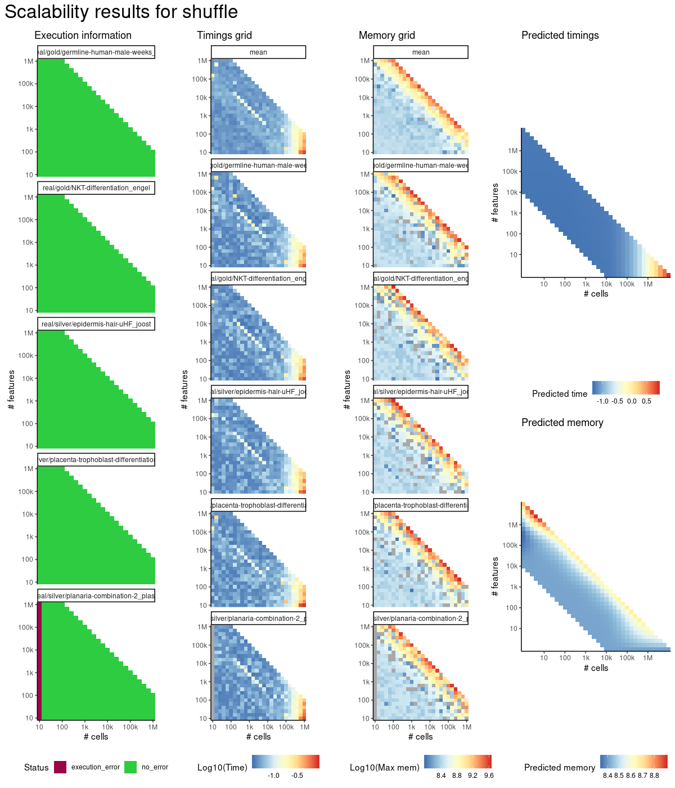
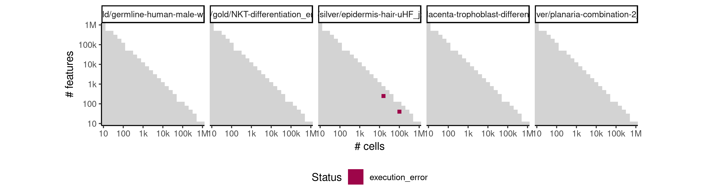
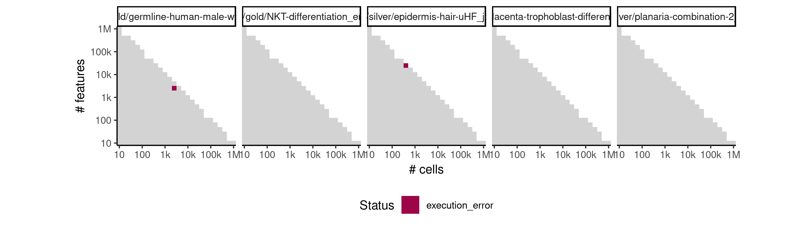
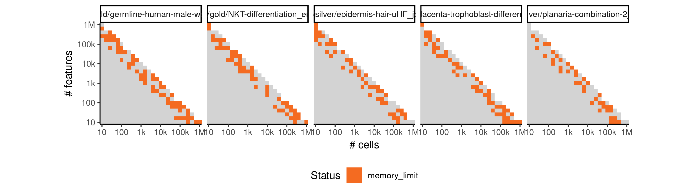
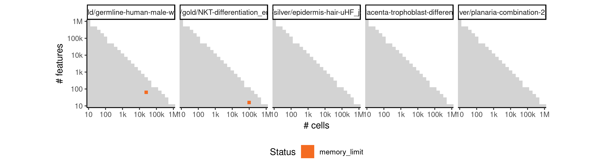

# shuffle


## ERROR STATUS EXECUTION_ERROR

### ERROR CLUSTER EXECUTION_ERROR -- 1


 * Number of instances: 2
 * Dataset ids: scaling_1415, scaling_1472

Last 10 lines of scaling_1415:
```
File: /home/rcannood/Workspace/dynverse/dynbenchmark//derived/05-scaling/suite/shuffle/Cat3/r2gridengine/20181009_221413_shuffle_Cat3_mWtcLsHj7U/log/log.270.e.txt
Execution halted
```

### ERROR CLUSTER EXECUTION_ERROR -- 2


 * Number of instances: 2
 * Dataset ids: scaling_1540, scaling_1676

Last 10 lines of scaling_1540:
```
File: /home/rcannood/Workspace/dynverse/dynbenchmark//derived/05-scaling/suite/shuffle/Cat3/r2gridengine/20181009_221413_shuffle_Cat3_mWtcLsHj7U/log/log.395.e.txt
  System command error
Calls: lapply ... create_ti_method_with_container -> <Anonymous> -> <Anonymous>
In addition: There were 47 warnings (use warnings() to see them)
Execution halted
```

## ERROR STATUS MEMORY_LIMIT

### ERROR CLUSTER MEMORY_LIMIT -- 1


 * Number of instances: 261
 * Dataset ids: scaling_1147, scaling_1159, scaling_1160, scaling_1162, scaling_1163, scaling_1165, scaling_1169, scaling_1173, scaling_1174, scaling_1176, scaling_1180, scaling_1185, scaling_1187, scaling_1191, scaling_1195, scaling_1198, scaling_1199, scaling_1200, scaling_1207, scaling_1212, scaling_1213, scaling_1215, scaling_1216, scaling_1219, scaling_1220, scaling_1229, scaling_1232, scaling_1234, scaling_1235, scaling_1242, scaling_1245, scaling_1246, scaling_1247, scaling_1250, scaling_1255, scaling_1256, scaling_1257, scaling_1261, scaling_1262, scaling_1266, scaling_1267, scaling_1276, scaling_1277, scaling_1282, scaling_1284, scaling_1285, scaling_1286, scaling_1288, scaling_1289, scaling_1290, scaling_1292, scaling_1295, scaling_1296, scaling_1298, scaling_1300, scaling_1302, scaling_1303, scaling_1304, scaling_1305, scaling_1307, scaling_1311, scaling_1314, scaling_1315, scaling_1316, scaling_1317, scaling_1318, scaling_1326, scaling_1333, scaling_1334, scaling_1336, scaling_1337, scaling_1342, scaling_1343, scaling_1351, scaling_1352, scaling_1355, scaling_1357, scaling_1358, scaling_1359, scaling_1365, scaling_1367, scaling_1371, scaling_1373, scaling_1379, scaling_1380, scaling_1381, scaling_1383, scaling_1384, scaling_1390, scaling_1391, scaling_1393, scaling_1394, scaling_1396, scaling_1397, scaling_1398, scaling_1401, scaling_1406, scaling_1407, scaling_1411, scaling_1412, scaling_1414, scaling_1417, scaling_1418, scaling_1420, scaling_1421, scaling_1424, scaling_1425, scaling_1426, scaling_1428, scaling_1429, scaling_1434, scaling_1435, scaling_1436, scaling_1438, scaling_1439, scaling_1442, scaling_1443, scaling_1446, scaling_1448, scaling_1449, scaling_1450, scaling_1451, scaling_1454, scaling_1455, scaling_1456, scaling_1458, scaling_1459, scaling_1463, scaling_1465, scaling_1466, scaling_1470, scaling_1471, scaling_1473, scaling_1478, scaling_1479, scaling_1480, scaling_1481, scaling_1482, scaling_1484, scaling_1485, scaling_1486, scaling_1487, scaling_1488, scaling_1490, scaling_1497, scaling_1498, scaling_1499, scaling_1500, scaling_1501, scaling_1502, scaling_1504, scaling_1506, scaling_1508, scaling_1510, scaling_1511, scaling_1512, scaling_1513, scaling_1515, scaling_1516, scaling_1520, scaling_1521, scaling_1524, scaling_1525, scaling_1526, scaling_1530, scaling_1531, scaling_1533, scaling_1534, scaling_1535, scaling_1537, scaling_1539, scaling_1541, scaling_1545, scaling_1547, scaling_1548, scaling_1549, scaling_1550, scaling_1553, scaling_1554, scaling_1555, scaling_1556, scaling_1558, scaling_1564, scaling_1565, scaling_1566, scaling_1567, scaling_1569, scaling_1570, scaling_1571, scaling_1575, scaling_1576, scaling_1577, scaling_1581, scaling_1584, scaling_1585, scaling_1586, scaling_1589, scaling_1590, scaling_1595, scaling_1601, scaling_1603, scaling_1606, scaling_1612, scaling_1613, scaling_1616, scaling_1621, scaling_1622, scaling_1627, scaling_1628, scaling_1629, scaling_1632, scaling_1633, scaling_1637, scaling_1638, scaling_1639, scaling_1640, scaling_1642, scaling_1643, scaling_1644, scaling_1645, scaling_1647, scaling_1648, scaling_1651, scaling_1653, scaling_1654, scaling_1657, scaling_1665, scaling_1666, scaling_1667, scaling_1668, scaling_1669, scaling_1670, scaling_1673, scaling_1674, scaling_1675, scaling_1677, scaling_1681, scaling_1684, scaling_1685, scaling_1686, scaling_1689, scaling_1690, scaling_1692, scaling_1693, scaling_1695, scaling_1703, scaling_1704, scaling_1705, scaling_1707, scaling_1710, scaling_1711, scaling_1712, scaling_1713, scaling_1718, scaling_1722, scaling_1723, scaling_1724, scaling_1726, scaling_1727, scaling_1730, scaling_1732

Last 10 lines of scaling_1147:
```
error writing to connection
```

### ERROR CLUSTER MEMORY_LIMIT -- 2


 * Number of instances: 2
 * Dataset ids: scaling_1179, scaling_1196

Last 10 lines of scaling_1179:
```
The following objects are masked from ‘package:stats’:
    filter, lag
The following objects are masked from ‘package:base’:
    intersect, setdiff, setequal, union
Attaching package: ‘purrr’
The following object is masked from ‘package:jsonlite’:
    flatten
Error in saveRDS(x, con) : error writing to connection
Calls: write_rds -> saveRDS
Execution halted
```


