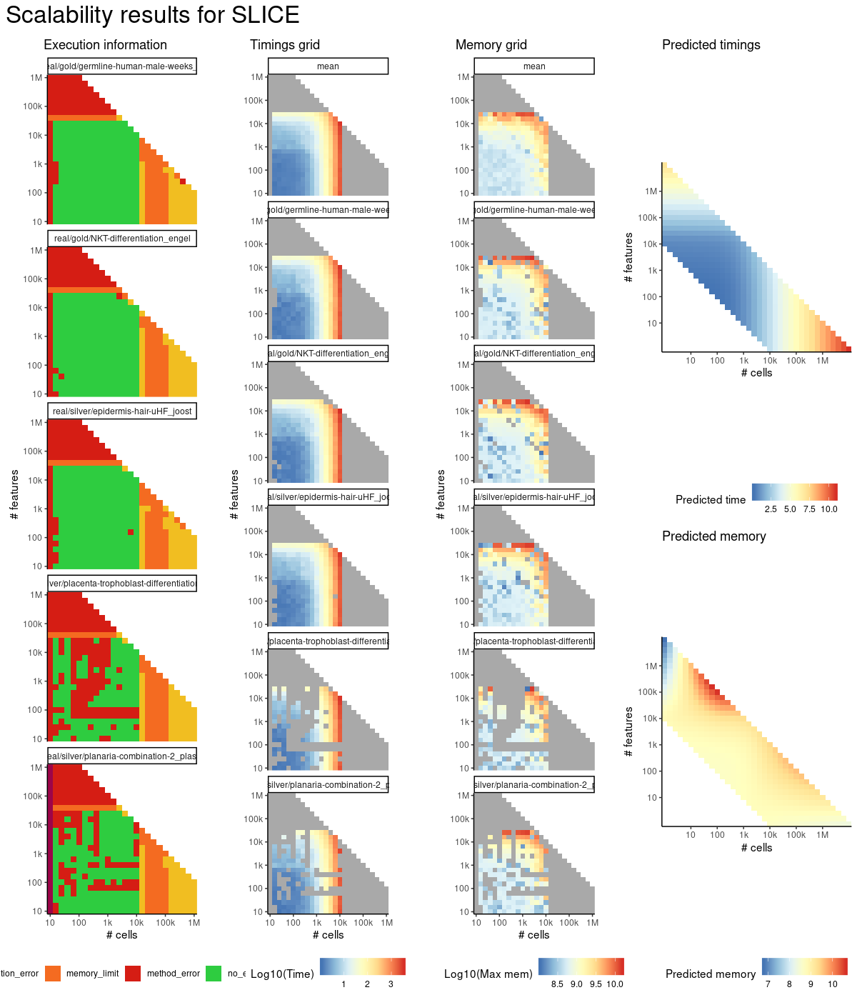
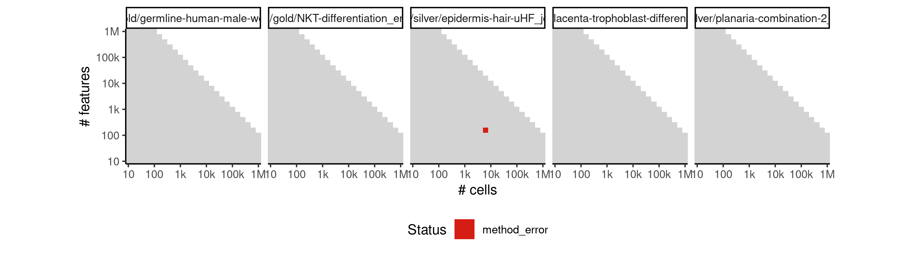
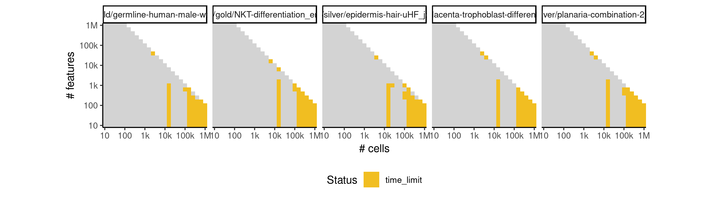

# slice


## ERROR STATUS MEMORY_LIMIT

### ERROR CLUSTER MEMORY_LIMIT -- 1


 * Number of instances: 45
 * Dataset ids: scaling_0783, scaling_0801, scaling_0819, scaling_0837, scaling_0855, scaling_0866, scaling_0877, scaling_0888, scaling_0899, scaling_0910, scaling_0918, scaling_0926, scaling_0934, scaling_0942, scaling_0950, scaling_0956, scaling_0962, scaling_0968, scaling_0974, scaling_0980, scaling_0993, scaling_0994, scaling_1007, scaling_1008, scaling_1021, scaling_1022, scaling_1035, scaling_1036, scaling_1049, scaling_1050, scaling_1067, scaling_1068, scaling_1069, scaling_1086, scaling_1087, scaling_1088, scaling_1105, scaling_1106, scaling_1107, scaling_1124, scaling_1125, scaling_1126, scaling_1143, scaling_1144, scaling_1145

Last 10 lines of scaling_0783:
```
    as_data_frame, groups, union
The following objects are masked from ‘package:stats’:
    decompose, spectrum
The following object is masked from ‘package:base’:
    union
Performing bootstrap calculation of scEntropy

Iteration:1
Performing dimension reduction
Error: cannot allocate vector of size 4.7 Gb
Execution halted
```

### ERROR CLUSTER MEMORY_LIMIT -- 2


 * Number of instances: 14
 * Dataset ids: scaling_0856, scaling_0867, scaling_0878, scaling_0889, scaling_0951, scaling_0957, scaling_0963, scaling_0969, scaling_0975, scaling_1052, scaling_1071, scaling_1090, scaling_1109, scaling_1128

Last 10 lines of scaling_0856:
```
The following objects are masked from ‘package:purrr’:
    compose, simplify
The following objects are masked from ‘package:dplyr’:
    as_data_frame, groups, union
The following objects are masked from ‘package:stats’:
    decompose, spectrum
The following object is masked from ‘package:base’:
    union
Error: cannot allocate vector of size 11.8 Gb
Execution halted
```

## ERROR STATUS METHOD_ERROR

### ERROR CLUSTER METHOD_ERROR -- 1


 * Number of instances: 62
 * Dataset ids: scaling_0001, scaling_0002, scaling_0003, scaling_0004, scaling_0006, scaling_0008, scaling_0010, scaling_0012, scaling_0016, scaling_0019, scaling_0022, scaling_0025, scaling_0041, scaling_0043, scaling_0045, scaling_0047, scaling_0051, scaling_0056, scaling_0061, scaling_0066, scaling_0076, scaling_0082, scaling_0088, scaling_0094, scaling_0106, scaling_0113, scaling_0120, scaling_0127, scaling_0151, scaling_0157, scaling_0163, scaling_0169, scaling_0181, scaling_0188, scaling_0195, scaling_0202, scaling_0226, scaling_0232, scaling_0244, scaling_0276, scaling_0287, scaling_0309, scaling_0351, scaling_0361, scaling_0371, scaling_0391, scaling_0404, scaling_0417, scaling_0430, scaling_0456, scaling_0466, scaling_0476, scaling_0574, scaling_0583, scaling_0601, scaling_0633, scaling_0649, scaling_0681, scaling_0715, scaling_0732, scaling_0766, scaling_0820

Last 10 lines of scaling_0001:
```
The following objects are masked from ‘package:stats’:
    decompose, spectrum
The following object is masked from ‘package:base’:
    union
Performing bootstrap calculation of scEntropy

Iteration:1
Performing dimension reduction
Inferring lineage model using clustering-based method
Error: number of cluster centres must lie between 1 and nrow(x)
Execution halted
```

### ERROR CLUSTER METHOD_ERROR -- 2


 * Number of instances: 132
 * Dataset ids: scaling_0009, scaling_0023, scaling_0026, scaling_0029, scaling_0035, scaling_0037, scaling_0068, scaling_0070, scaling_0089, scaling_0096, scaling_0097, scaling_0102, scaling_0128, scaling_0136, scaling_0147, scaling_0164, scaling_0178, scaling_0205, scaling_0210, scaling_0211, scaling_0212, scaling_0216, scaling_0220, scaling_0227, scaling_0239, scaling_0246, scaling_0247, scaling_0249, scaling_0252, scaling_0271, scaling_0272, scaling_0273, scaling_0277, scaling_0313, scaling_0314, scaling_0315, scaling_0319, scaling_0322, scaling_0323, scaling_0342, scaling_0374, scaling_0375, scaling_0376, scaling_0377, scaling_0384, scaling_0387, scaling_0432, scaling_0434, scaling_0435, scaling_0436, scaling_0437, scaling_0438, scaling_0449, scaling_0451, scaling_0487, scaling_0490, scaling_0491, scaling_0492, scaling_0494, scaling_0499, scaling_0501, scaling_0502, scaling_0519, scaling_0545, scaling_0546, scaling_0548, scaling_0553, scaling_0554, scaling_0586, scaling_0587, scaling_0593, scaling_0653, scaling_0654, scaling_0655, scaling_0656, scaling_0667, scaling_0672, scaling_0676, scaling_0736, scaling_0738, scaling_0739, scaling_0740, scaling_0743, scaling_0744, scaling_0751, scaling_0752, scaling_0757, scaling_0760, scaling_0761, scaling_0822, scaling_0824, scaling_0827, scaling_0828, scaling_0833, scaling_0840, scaling_0843, scaling_0851, scaling_0890, scaling_0893, scaling_0894, scaling_0901, scaling_0902, scaling_0903, scaling_0904, scaling_0906, scaling_0936, scaling_0938, scaling_0941, scaling_0946, scaling_0949, scaling_0970, scaling_0971, scaling_0976, scaling_0978, scaling_1024, scaling_1026, scaling_1028, scaling_1029, scaling_1033, scaling_1038, scaling_1040, scaling_1043, scaling_1111, scaling_1112, scaling_1114, scaling_1116, scaling_1117, scaling_1129, scaling_1130, scaling_1131, scaling_1134, scaling_1138

Last 10 lines of scaling_0009:
```
The following object is masked from ‘package:base’:
    union
Performing bootstrap calculation of scEntropy

Iteration:1
Performing dimension reduction
Inferring lineage model using clustering-based method
Error in `$<-.data.frame`(`*tmp*`, "include", value = 1) : 
  replacement has 1 row, data has 0
Calls: <Anonymous> ... <Anonymous> -> getLM.clustering -> $<- -> $<-.data.frame
Execution halted
```

### ERROR CLUSTER METHOD_ERROR -- 3


 * Number of instances: 7
 * Dataset ids: scaling_0015, scaling_0083, scaling_0084, scaling_0310, scaling_0750, scaling_0839, scaling_0943

Last 10 lines of scaling_0015:
```
The following object is masked from ‘package:base’:
    union
Performing bootstrap calculation of scEntropy

Iteration:1
Performing dimension reduction
Inferring lineage model using clustering-based method
Error in stats::smooth.spline(lambda, xj, ..., df = df, keep.data = FALSE) : 
  need at least four unique 'x' values
Calls: map_df ... principal_curve -> smoother_function -> <Anonymous>
Execution halted
```

### ERROR CLUSTER METHOD_ERROR -- 4


 * Number of instances: 10
 * Dataset ids: scaling_0238, scaling_0298, scaling_0341, scaling_0486, scaling_0556, scaling_0565, scaling_0617, scaling_0698, scaling_0784, scaling_0802

Last 10 lines of scaling_0238:
```
The following object is masked from ‘package:base’:
    union
Performing bootstrap calculation of scEntropy

Iteration:1
Warning message:
did not converge in 10 iterations 
Performing dimension reduction
Inferring lineage model using clustering-based method
Error: number of cluster centres must lie between 1 and nrow(x)
Execution halted
```

### ERROR CLUSTER METHOD_ERROR -- 5


 * Number of instances: 7
 * Dataset ids: scaling_0547, scaling_0659, scaling_0660, scaling_0832, scaling_0896, scaling_0907, scaling_1044

Last 10 lines of scaling_0547:
```
Performing bootstrap calculation of scEntropy

Iteration:1
Performing dimension reduction
Inferring lineage model using clustering-based method
Error in `$<-.data.frame`(`*tmp*`, "include", value = 1) : 
  replacement has 1 row, data has 0
Calls: <Anonymous> ... <Anonymous> -> getLM.clustering -> $<- -> $<-.data.frame
In addition: Warning message:
did not converge in 10 iterations 
Execution halted
```

### ERROR CLUSTER METHOD_ERROR -- 6


 * Number of instances: 1
 * Dataset ids: scaling_0835

Last 10 lines of scaling_0835:
```
Error in `$<-.data.frame`(`*tmp*`, "include", value = 1) : 
  replacement has 1 row, data has 0
Calls: <Anonymous> ... <Anonymous> -> getLM.clustering -> $<- -> $<-.data.frame
In addition: Warning messages:
1: Quick-TRANSfer stage steps exceeded maximum (= 500000) 
2: Quick-TRANSfer stage steps exceeded maximum (= 500000) 
3: did not converge in 10 iterations 
4: Quick-TRANSfer stage steps exceeded maximum (= 500000) 
5: did not converge in 10 iterations 
Execution halted
```

### ERROR CLUSTER METHOD_ERROR -- 7


 * Number of instances: 1
 * Dataset ids: scaling_0973

Last 10 lines of scaling_0973:
```

Iteration:1
Performing dimension reduction
Inferring lineage model using clustering-based method
Error in `$<-.data.frame`(`*tmp*`, "include", value = 1) : 
  replacement has 1 row, data has 0
Calls: <Anonymous> ... <Anonymous> -> getLM.clustering -> $<- -> $<-.data.frame
In addition: Warning messages:
1: did not converge in 10 iterations 
2: did not converge in 10 iterations 
Execution halted
```

### ERROR CLUSTER METHOD_ERROR -- 8


 * Number of instances: 1
 * Dataset ids: scaling_0979

Last 10 lines of scaling_0979:
```
Error in `$<-.data.frame`(`*tmp*`, "include", value = 1) : 
  replacement has 1 row, data has 0
Calls: <Anonymous> ... <Anonymous> -> getLM.clustering -> $<- -> $<-.data.frame
In addition: Warning messages:
1: did not converge in 10 iterations 
2: did not converge in 10 iterations 
3: Quick-TRANSfer stage steps exceeded maximum (= 500000) 
4: did not converge in 10 iterations 
5: Quick-TRANSfer stage steps exceeded maximum (= 500000) 
Execution halted
```

### ERROR CLUSTER METHOD_ERROR -- 9


 * Number of instances: 8
 * Dataset ids: scaling_0981, scaling_0995, scaling_1009, scaling_1023, scaling_1051, scaling_1070, scaling_1089, scaling_1108

Last 10 lines of scaling_0981:
```
    as_data_frame, groups, union
The following objects are masked from ‘package:stats’:
    decompose, spectrum
The following object is masked from ‘package:base’:
    union
Error in runif(num_genes * num_genes) : invalid arguments
Calls: matrix -> runif
In addition: Warning message:
In num_genes * num_genes : NAs produced by integer overflow
Execution halted
```

### ERROR CLUSTER METHOD_ERROR -- 10


 * Number of instances: 1
 * Dataset ids: scaling_1047

Last 10 lines of scaling_1047:
```

Iteration:1
Performing dimension reduction
Inferring lineage model using clustering-based method
Error in `$<-.data.frame`(`*tmp*`, "include", value = 1) : 
  replacement has 1 row, data has 0
Calls: <Anonymous> ... <Anonymous> -> getLM.clustering -> $<- -> $<-.data.frame
In addition: Warning messages:
1: did not converge in 10 iterations 
2: Quick-TRANSfer stage steps exceeded maximum (= 315500) 
Execution halted
```

### ERROR CLUSTER METHOD_ERROR -- 11


 * Number of instances: 1
 * Dataset ids: scaling_1102

Last 10 lines of scaling_1102:
```
The following objects are masked from ‘package:stats’:
    decompose, spectrum
The following object is masked from ‘package:base’:
    union
Performing bootstrap calculation of scEntropy

Iteration:1
Performing dimension reduction
Error in La.svd(x, nu, nv) : error code 1 from Lapack routine 'dgesdd'
Calls: <Anonymous> ... reduceExpressionSpace -> <Anonymous> -> prcomp.default -> svd -> La.svd
Execution halted
```

### ERROR CLUSTER METHOD_ERROR -- 12


 * Number of instances: 1
 * Dataset ids: scaling_1122

Last 10 lines of scaling_1122:
```
  replacement has 1 row, data has 0
Calls: <Anonymous> ... <Anonymous> -> getLM.clustering -> $<- -> $<-.data.frame
In addition: Warning messages:
1: Quick-TRANSfer stage steps exceeded maximum (= 500000) 
2: did not converge in 10 iterations 
3: Quick-TRANSfer stage steps exceeded maximum (= 500000) 
4: did not converge in 10 iterations 
5: did not converge in 10 iterations 
6: Quick-TRANSfer stage steps exceeded maximum (= 500000) 
Execution halted
```

### ERROR CLUSTER METHOD_ERROR -- 13


 * Number of instances: 1
 * Dataset ids: scaling_1141

Last 10 lines of scaling_1141:
```
1: Quick-TRANSfer stage steps exceeded maximum (= 500000) 
2: did not converge in 10 iterations 
3: did not converge in 10 iterations 
4: did not converge in 10 iterations 
5: did not converge in 10 iterations 
6: did not converge in 10 iterations 
7: did not converge in 10 iterations 
8: did not converge in 10 iterations 
9: did not converge in 10 iterations 
Execution halted
```

## ERROR STATUS TIME_LIMIT

### ERROR CLUSTER TIME_LIMIT -- 1


 * Number of instances: 25
 * Dataset ids: scaling_0697, scaling_0714, scaling_0731, scaling_0748, scaling_0765, scaling_0782, scaling_0800, scaling_0818, scaling_0836, scaling_0854, scaling_0865, scaling_0876, scaling_0887, scaling_0898, scaling_0909, scaling_0992, scaling_1006, scaling_1020, scaling_1034, scaling_1048, scaling_1066, scaling_1085, scaling_1104, scaling_1123, scaling_1142

Last 10 lines of scaling_0697:
```
File: /home/rcannood/Workspace/dynverse/dynbenchmark//derived/05-scaling/suite/slice/Cat2/r2gridengine/20181008_214916_slice_Cat2_0wvNiLJyTq/log/log.17.e.txt
```


