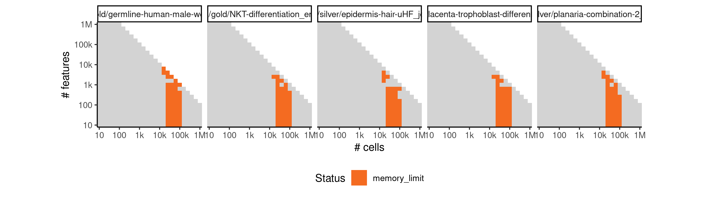

# slice


## ERROR STATUS EXECUTION_ERROR

### ERROR CLUSTER EXECUTION_ERROR -- 1


 * Number of instances: 64
 * Dataset ids: scaling_0009, scaling_0011, scaling_0015, scaling_0035, scaling_0036, scaling_0039, scaling_0040, scaling_0046, scaling_0050, scaling_0059, scaling_0062, scaling_0065, scaling_0072, scaling_0073, scaling_0074, scaling_0075, scaling_0093, scaling_0102, scaling_0103, scaling_0104, scaling_0105, scaling_0126, scaling_0136, scaling_0137, scaling_0138, scaling_0139, scaling_0140, scaling_0146, scaling_0162, scaling_0167, scaling_0168, scaling_0179, scaling_0180, scaling_0201, scaling_0211, scaling_0212, scaling_0215, scaling_0225, scaling_0242, scaling_0254, scaling_0255, scaling_0308, scaling_0326, scaling_0328, scaling_0330, scaling_0370, scaling_0388, scaling_0389, scaling_0390, scaling_0428, scaling_0429, scaling_0453, scaling_0454, scaling_0455, scaling_0485, scaling_0504, scaling_0505, scaling_0525, scaling_0555, scaling_0599, scaling_0600, scaling_0679, scaling_0680, scaling_0764

Last 10 lines of scaling_0009:
```
File: /home/rcannood/Workspace/dynverse/dynbenchmark//derived/05-scaling/suite/slice/10/r2gridengine/20180825_051023_slice_10_xBITahpyxq/log/log.9.e.txt
Execution halted
```

### ERROR CLUSTER EXECUTION_ERROR -- 2


 * Number of instances: 82
 * Dataset ids: scaling_0013, scaling_0023, scaling_0033, scaling_0034, scaling_0060, scaling_0064, scaling_0097, scaling_0119, scaling_0194, scaling_0216, scaling_0237, scaling_0258, scaling_0296, scaling_0297, scaling_0312, scaling_0329, scaling_0348, scaling_0416, scaling_0437, scaling_0438, scaling_0473, scaling_0475, scaling_0484, scaling_0503, scaling_0512, scaling_0516, scaling_0517, scaling_0536, scaling_0547, scaling_0559, scaling_0567, scaling_0571, scaling_0577, scaling_0582, scaling_0596, scaling_0598, scaling_0607, scaling_0619, scaling_0620, scaling_0627, scaling_0628, scaling_0631, scaling_0632, scaling_0646, scaling_0653, scaling_0677, scaling_0685, scaling_0695, scaling_0705, scaling_0722, scaling_0728, scaling_0729, scaling_0737, scaling_0742, scaling_0762, scaling_0763, scaling_0773, scaling_0786, scaling_0792, scaling_0797, scaling_0812, scaling_0816, scaling_0825, scaling_0827, scaling_0833, scaling_0847, scaling_0868, scaling_0890, scaling_0892, scaling_0893, scaling_0894, scaling_0908, scaling_0914, scaling_0921, scaling_0923, scaling_0925, scaling_0941, scaling_0976, scaling_0986, scaling_1003, scaling_1004, scaling_1026

Last 10 lines of scaling_0013:
```
File: /home/rcannood/Workspace/dynverse/dynbenchmark//derived/05-scaling/suite/slice/10/r2gridengine/20180825_051023_slice_10_xBITahpyxq/log/log.13.e.txt
All progressions (from, to) edges need to be part of the milestone network
Execution halted
```

## ERROR STATUS METHOD_ERROR

### ERROR CLUSTER METHOD_ERROR -- 1


 * Number of instances: 60
 * Dataset ids: scaling_0001, scaling_0002, scaling_0003, scaling_0004, scaling_0006, scaling_0008, scaling_0010, scaling_0012, scaling_0016, scaling_0019, scaling_0022, scaling_0025, scaling_0041, scaling_0043, scaling_0045, scaling_0047, scaling_0051, scaling_0056, scaling_0061, scaling_0066, scaling_0076, scaling_0082, scaling_0088, scaling_0094, scaling_0106, scaling_0113, scaling_0120, scaling_0127, scaling_0151, scaling_0157, scaling_0163, scaling_0169, scaling_0181, scaling_0188, scaling_0195, scaling_0202, scaling_0226, scaling_0232, scaling_0238, scaling_0244, scaling_0276, scaling_0298, scaling_0341, scaling_0351, scaling_0361, scaling_0371, scaling_0417, scaling_0430, scaling_0456, scaling_0466, scaling_0476, scaling_0486, scaling_0556, scaling_0574, scaling_0601, scaling_0617, scaling_0681, scaling_0698, scaling_0715, scaling_0732

Last 10 lines of scaling_0001:
```
The following objects are masked from 'package:stats':
    decompose, spectrum
The following object is masked from 'package:base':
    union
Performing bootstrap calculation of scEntropy

Iteration:1
Performing dimension reduction
Inferring lineage model using clustering-based method
Error: number of cluster centres must lie between 1 and nrow(x)
Execution halted
```

### ERROR CLUSTER METHOD_ERROR -- 2


 * Number of instances: 127
 * Dataset ids: scaling_0007, scaling_0017, scaling_0026, scaling_0037, scaling_0038, scaling_0042, scaling_0048, scaling_0052, scaling_0054, scaling_0057, scaling_0067, scaling_0068, scaling_0069, scaling_0077, scaling_0078, scaling_0079, scaling_0080, scaling_0083, scaling_0089, scaling_0096, scaling_0099, scaling_0101, scaling_0107, scaling_0108, scaling_0114, scaling_0124, scaling_0131, scaling_0145, scaling_0149, scaling_0152, scaling_0154, scaling_0155, scaling_0158, scaling_0164, scaling_0176, scaling_0177, scaling_0178, scaling_0182, scaling_0186, scaling_0196, scaling_0197, scaling_0198, scaling_0199, scaling_0208, scaling_0210, scaling_0220, scaling_0234, scaling_0241, scaling_0251, scaling_0252, scaling_0256, scaling_0257, scaling_0273, scaling_0280, scaling_0299, scaling_0302, scaling_0303, scaling_0321, scaling_0322, scaling_0323, scaling_0339, scaling_0342, scaling_0343, scaling_0365, scaling_0380, scaling_0387, scaling_0395, scaling_0396, scaling_0397, scaling_0398, scaling_0444, scaling_0445, scaling_0449, scaling_0451, scaling_0482, scaling_0499, scaling_0501, scaling_0502, scaling_0506, scaling_0522, scaling_0526, scaling_0540, scaling_0541, scaling_0550, scaling_0553, scaling_0554, scaling_0560, scaling_0602, scaling_0608, scaling_0642, scaling_0644, scaling_0666, scaling_0668, scaling_0672, scaling_0676, scaling_0682, scaling_0688, scaling_0750, scaling_0751, scaling_0752, scaling_0753, scaling_0754, scaling_0757, scaling_0760, scaling_0761, scaling_0767, scaling_0839, scaling_0841, scaling_0842, scaling_0843, scaling_0851, scaling_0884, scaling_0901, scaling_0902, scaling_0903, scaling_0904, scaling_0906, scaling_0916, scaling_0944, scaling_0946, scaling_0949, scaling_0978, scaling_1016, scaling_1039, scaling_1040, scaling_1042, scaling_1043

Last 10 lines of scaling_0007:
```
The following object is masked from 'package:base':
    union
Performing bootstrap calculation of scEntropy

Iteration:1
Performing dimension reduction
Inferring lineage model using clustering-based method
Error in `$<-.data.frame`(`*tmp*`, "include", value = 1) : 
  replacement has 1 row, data has 0
Calls: <Anonymous> ... <Anonymous> -> getLM.clustering -> $<- -> $<-.data.frame
Execution halted
```

### ERROR CLUSTER METHOD_ERROR -- 3


 * Number of instances: 1
 * Dataset ids: scaling_0024

Last 10 lines of scaling_0024:
```
The following object is masked from 'package:base':
    union
Performing bootstrap calculation of scEntropy

Iteration:1
Performing dimension reduction
Inferring lineage model using clustering-based method
Error in stats::smooth.spline(lambda, xj, ..., df = df, keep.data = FALSE) : 
  some weights should be positive
Calls: map_df ... principal_curve -> smoother_function -> <Anonymous>
Execution halted
```

### ERROR CLUSTER METHOD_ERROR -- 4


 * Number of instances: 4
 * Dataset ids: scaling_0029, scaling_0030, scaling_0224, scaling_0288

Last 10 lines of scaling_0029:
```
The following object is masked from 'package:base':
    union
Performing bootstrap calculation of scEntropy

Iteration:1
Performing dimension reduction
Inferring lineage model using clustering-based method
Error in stats::smooth.spline(lambda, xj, ..., df = df, keep.data = FALSE) : 
  need at least four unique 'x' values
Calls: map_df ... principal_curve -> smoother_function -> <Anonymous>
Execution halted
```

### ERROR CLUSTER METHOD_ERROR -- 5


 * Number of instances: 8
 * Dataset ids: scaling_0287, scaling_0309, scaling_0391, scaling_0404, scaling_0565, scaling_0583, scaling_0633, scaling_0649

Last 10 lines of scaling_0287:
```
The following object is masked from 'package:base':
    union
Performing bootstrap calculation of scEntropy

Iteration:1
Warning message:
did not converge in 10 iterations 
Performing dimension reduction
Inferring lineage model using clustering-based method
Error: number of cluster centres must lie between 1 and nrow(x)
Execution halted
```

### ERROR CLUSTER METHOD_ERROR -- 6


 * Number of instances: 1
 * Dataset ids: scaling_0864

Last 10 lines of scaling_0864:
```
Calls: <Anonymous> ... <Anonymous> -> getLM.clustering -> $<- -> $<-.data.frame
In addition: Warning messages:
1: Quick-TRANSfer stage steps exceeded maximum (= 500000) 
2: Quick-TRANSfer stage steps exceeded maximum (= 500000) 
3: Quick-TRANSfer stage steps exceeded maximum (= 500000) 
4: did not converge in 10 iterations 
5: did not converge in 10 iterations 
6: Quick-TRANSfer stage steps exceeded maximum (= 500000) 
7: did not converge in 10 iterations 
Execution halted
```

### ERROR CLUSTER METHOD_ERROR -- 7


 * Number of instances: 3
 * Dataset ids: scaling_0907, scaling_1044, scaling_1047

Last 10 lines of scaling_0907:
```
Performing bootstrap calculation of scEntropy

Iteration:1
Performing dimension reduction
Inferring lineage model using clustering-based method
Error in `$<-.data.frame`(`*tmp*`, "include", value = 1) : 
  replacement has 1 row, data has 0
Calls: <Anonymous> ... <Anonymous> -> getLM.clustering -> $<- -> $<-.data.frame
In addition: Warning message:
did not converge in 10 iterations 
Execution halted
```

### ERROR CLUSTER METHOD_ERROR -- 8


 * Number of instances: 1
 * Dataset ids: scaling_0955

Last 10 lines of scaling_0955:
```
Error in `$<-.data.frame`(`*tmp*`, "include", value = 1) : 
  replacement has 1 row, data has 0
Calls: <Anonymous> ... <Anonymous> -> getLM.clustering -> $<- -> $<-.data.frame
In addition: Warning messages:
1: Quick-TRANSfer stage steps exceeded maximum (= 500000) 
2: Quick-TRANSfer stage steps exceeded maximum (= 500000) 
3: Quick-TRANSfer stage steps exceeded maximum (= 500000) 
4: Quick-TRANSfer stage steps exceeded maximum (= 500000) 
5: did not converge in 10 iterations 
Execution halted
```

### ERROR CLUSTER METHOD_ERROR -- 9


 * Number of instances: 1
 * Dataset ids: scaling_0979

Last 10 lines of scaling_0979:
```
Error in `$<-.data.frame`(`*tmp*`, "include", value = 1) : 
  replacement has 1 row, data has 0
Calls: <Anonymous> ... <Anonymous> -> getLM.clustering -> $<- -> $<-.data.frame
In addition: Warning messages:
1: did not converge in 10 iterations 
2: did not converge in 10 iterations 
3: Quick-TRANSfer stage steps exceeded maximum (= 500000) 
4: did not converge in 10 iterations 
5: Quick-TRANSfer stage steps exceeded maximum (= 500000) 
Execution halted
```

### ERROR CLUSTER METHOD_ERROR -- 10


 * Number of instances: 4
 * Dataset ids: scaling_0981, scaling_0995, scaling_1009, scaling_1023

Last 10 lines of scaling_0981:
```
    as_data_frame, groups, union
The following objects are masked from 'package:stats':
    decompose, spectrum
The following object is masked from 'package:base':
    union
Error in runif(num_genes * num_genes) : invalid arguments
Calls: matrix -> runif
In addition: Warning message:
In num_genes * num_genes : NAs produced by integer overflow
Execution halted
```

## ERROR STATUS MEMORY_LIMIT

### ERROR CLUSTER MEMORY_LIMIT -- 1


 * Number of instances: 50
 * Dataset ids: scaling_0697, scaling_0714, scaling_0731, scaling_0748, scaling_0765, scaling_0782, scaling_0783, scaling_0800, scaling_0801, scaling_0818, scaling_0819, scaling_0836, scaling_0837, scaling_0854, scaling_0855, scaling_0865, scaling_0866, scaling_0876, scaling_0877, scaling_0887, scaling_0888, scaling_0898, scaling_0899, scaling_0909, scaling_0910, scaling_0918, scaling_0926, scaling_0934, scaling_0942, scaling_0950, scaling_0956, scaling_0962, scaling_0968, scaling_0974, scaling_0980, scaling_0992, scaling_0993, scaling_0994, scaling_1006, scaling_1007, scaling_1008, scaling_1020, scaling_1021, scaling_1022, scaling_1034, scaling_1035, scaling_1036, scaling_1048, scaling_1049, scaling_1050

Last 10 lines of scaling_0697:
```
    as_data_frame, groups, union
The following objects are masked from 'package:stats':
    decompose, spectrum
The following object is masked from 'package:base':
    union
Performing bootstrap calculation of scEntropy

Iteration:1
Performing dimension reduction
Error: cannot allocate vector of size 1.9 Gb
Execution halted
```

### ERROR CLUSTER MEMORY_LIMIT -- 2


 * Number of instances: 23
 * Dataset ids: scaling_0766, scaling_0784, scaling_0802, scaling_0820, scaling_0856, scaling_0867, scaling_0878, scaling_0889, scaling_0911, scaling_0919, scaling_0927, scaling_0935, scaling_0943, scaling_0951, scaling_0957, scaling_0963, scaling_0969, scaling_0975, scaling_0982, scaling_0996, scaling_1010, scaling_1024, scaling_1038

Last 10 lines of scaling_0766:
```
The following objects are masked from 'package:purrr':
    compose, simplify
The following objects are masked from 'package:dplyr':
    as_data_frame, groups, union
The following objects are masked from 'package:stats':
    decompose, spectrum
The following object is masked from 'package:base':
    union
Error: cannot allocate vector of size 4.7 Gb
Execution halted
```


