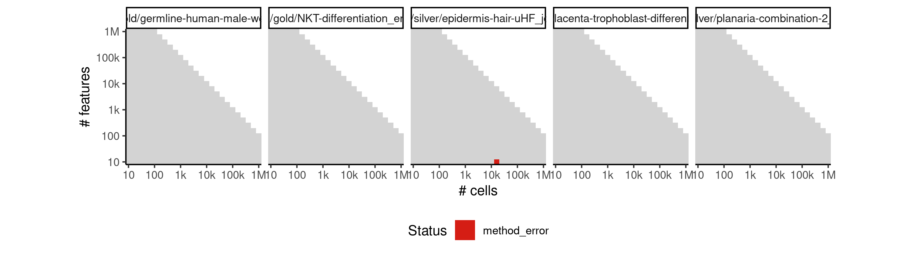
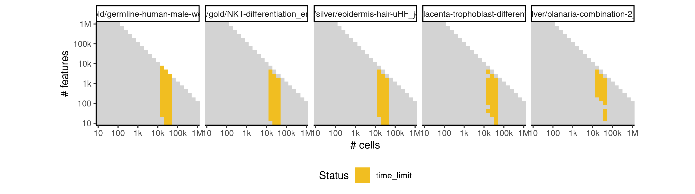
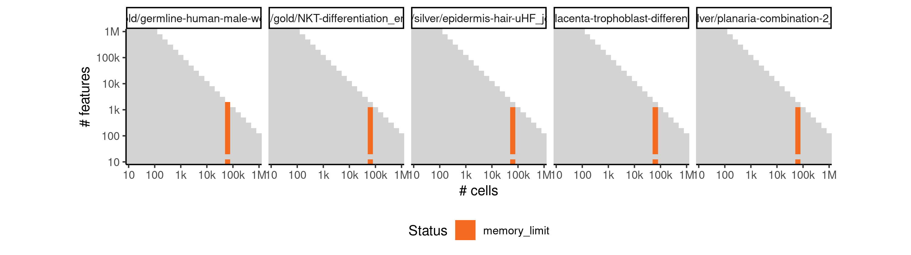

# slingshot


## ERROR STATUS METHOD_ERROR

### ERROR CLUSTER METHOD_ERROR -- 1


 * Number of instances: 104
 * Dataset ids: scaling_0004, scaling_0007, scaling_0011, scaling_0012, scaling_0013, scaling_0015, scaling_0018, scaling_0024, scaling_0026, scaling_0027, scaling_0029, scaling_0030, scaling_0037, scaling_0038, scaling_0039, scaling_0040, scaling_0046, scaling_0048, scaling_0050, scaling_0055, scaling_0065, scaling_0069, scaling_0070, scaling_0072, scaling_0073, scaling_0074, scaling_0075, scaling_0081, scaling_0093, scaling_0096, scaling_0098, scaling_0099, scaling_0102, scaling_0103, scaling_0104, scaling_0105, scaling_0131, scaling_0132, scaling_0133, scaling_0136, scaling_0137, scaling_0138, scaling_0139, scaling_0140, scaling_0148, scaling_0150, scaling_0173, scaling_0174, scaling_0178, scaling_0179, scaling_0180, scaling_0207, scaling_0208, scaling_0213, scaling_0214, scaling_0215, scaling_0223, scaling_0225, scaling_0248, scaling_0249, scaling_0254, scaling_0255, scaling_0274, scaling_0275, scaling_0318, scaling_0319, scaling_0327, scaling_0328, scaling_0329, scaling_0330, scaling_0340, scaling_0379, scaling_0380, scaling_0388, scaling_0389, scaling_0390, scaling_0441, scaling_0442, scaling_0452, scaling_0453, scaling_0454, scaling_0455, scaling_0495, scaling_0503, scaling_0504, scaling_0505, scaling_0525, scaling_0555, scaling_0591, scaling_0598, scaling_0600, scaling_0664, scaling_0677, scaling_0679, scaling_0680, scaling_0748, scaling_0762, scaling_0764, scaling_0765, scaling_0837, scaling_0851, scaling_0854, scaling_0855, scaling_0950

Last 10 lines of scaling_0004:
```
The following object is masked from ‘package:jsonlite’:
    flatten
Warning messages:
1: In rgl.init(initValue, onlyNULL) : RGL: unable to open X11 display
2: 'rgl_init' failed, running with rgl.useNULL = TRUE 
Using diagonal covariance matrix
Error in solve.default(s1 + s2) : 
  Lapack routine dgesv: system is exactly singular: U[1,1] = 0
Calls: slingshot ... dist.fun -> .dist_clusters_diag -> solve -> solve.default
Execution halted
```

### ERROR CLUSTER METHOD_ERROR -- 2


 * Number of instances: 1
 * Dataset ids: scaling_0062

Last 10 lines of scaling_0062:
```
  longer object length is not a multiple of shorter object length
8: In lm(pca$sdev[1:20] ~ x + x2)$residuals^2 * rep(1:2, each = 10) :
  longer object length is not a multiple of shorter object length
9: In lm(pca$sdev[1:20] ~ x + x2)$residuals^2 * rep(1:2, each = 10) :
  longer object length is not a multiple of shorter object length
Using diagonal covariance matrix
Error in if (box.vals[1] == box.vals[5]) { : 
  missing value where TRUE/FALSE needed
Calls: slingshot ... getCurves -> .local -> lapply -> FUN -> .percent_shrinkage
Execution halted
```

### ERROR CLUSTER METHOD_ERROR -- 3


 * Number of instances: 1
 * Dataset ids: scaling_0077

Last 10 lines of scaling_0077:
```
  longer object length is not a multiple of shorter object length
8: In lm(pca$sdev[1:20] ~ x + x2)$residuals^2 * rep(1:2, each = 10) :
  longer object length is not a multiple of shorter object length
9: In lm(pca$sdev[1:20] ~ x + x2)$residuals^2 * rep(1:2, each = 10) :
  longer object length is not a multiple of shorter object length
Using diagonal covariance matrix
Curves for Lineage3 and Lineage4 appear to be going in opposite directions. No longer forcing them to share an initial point. To manually override this, set allow.breaks = FALSE.
Error in labels[[start_cell]] : 
  attempt to select less than one element in get1index
Execution halted
```

### ERROR CLUSTER METHOD_ERROR -- 4


 * Number of instances: 2
 * Dataset ids: scaling_0135, scaling_0599

Last 10 lines of scaling_0135:
```
  longer object length is not a multiple of shorter object length
8: In lm(pca$sdev[1:20] ~ x + x2)$residuals^2 * rep(1:2, each = 10) :
  longer object length is not a multiple of shorter object length
9: In lm(pca$sdev[1:20] ~ x + x2)$residuals^2 * rep(1:2, each = 10) :
  longer object length is not a multiple of shorter object length
Using diagonal covariance matrix
Error in solve.default(s1 + s2) : 
  system is computationally singular: reciprocal condition number = 7.52545e-30
Calls: slingshot ... dist.fun -> .dist_clusters_diag -> solve -> solve.default
Execution halted
```

### ERROR CLUSTER METHOD_ERROR -- 5


 * Number of instances: 1
 * Dataset ids: scaling_0187

Last 10 lines of scaling_0187:
```
Warning messages:
1: In rgl.init(initValue, onlyNULL) : RGL: unable to open X11 display
2: 'rgl_init' failed, running with rgl.useNULL = TRUE 
Using full covariance matrix
Curves for Lineage3 and average1 appear to be going in opposite directions. No longer forcing them to share an initial point. To manually override this, set allow.breaks = FALSE.
Curves for Lineage3 and average1 appear to be going in opposite directions. No longer forcing them to share an initial point. To manually override this, set allow.breaks = FALSE.
Curves for Lineage3 and average1 appear to be going in opposite directions. No longer forcing them to share an initial point. To manually override this, set allow.breaks = FALSE.
Error in labels[[start_cell]] : 
  attempt to select less than one element in get1index
Execution halted
```

### ERROR CLUSTER METHOD_ERROR -- 6


 * Number of instances: 11
 * Dataset ids: scaling_0201, scaling_0350, scaling_0370, scaling_0678, scaling_0763, scaling_0852, scaling_0853, scaling_0908, scaling_0909, scaling_1048, scaling_1049

Last 10 lines of scaling_0201:
```
The following object is masked from ‘package:jsonlite’:
    flatten
Warning messages:
1: In rgl.init(initValue, onlyNULL) : RGL: unable to open X11 display
2: 'rgl_init' failed, running with rgl.useNULL = TRUE 
Using full covariance matrix
Error in solve.default(s1 + s2) : 
  system is computationally singular: reciprocal condition number = 8.74368e-17
Calls: slingshot ... dist.fun -> .dist_clusters_full -> solve -> solve.default
Execution halted
```

### ERROR CLUSTER METHOD_ERROR -- 7


 * Number of instances: 2
 * Dataset ids: scaling_0252, scaling_0309

Last 10 lines of scaling_0252:
```
The following object is masked from ‘package:jsonlite’:
    flatten
Warning messages:
1: In rgl.init(initValue, onlyNULL) : RGL: unable to open X11 display
2: 'rgl_init' failed, running with rgl.useNULL = TRUE 
Using diagonal covariance matrix
Error in smooth.spline(lambda, xj, w = w, ..., df = df, tol = tol, keep.data = FALSE,  : 
  need at least four unique 'x' values
Calls: slingshot ... tryCatchList -> tryCatchOne -> <Anonymous> -> smooth.spline
Execution halted
```

### ERROR CLUSTER METHOD_ERROR -- 8


 * Number of instances: 9
 * Dataset ids: scaling_0521, scaling_0549, scaling_0663, scaling_0676, scaling_0747, scaling_0836, scaling_0942, scaling_0949, scaling_0979

Last 10 lines of scaling_0521:
```
  longer object length is not a multiple of shorter object length
8: In lm(pca$sdev[1:20] ~ x + x2)$residuals^2 * rep(1:2, each = 10) :
  longer object length is not a multiple of shorter object length
9: In lm(pca$sdev[1:20] ~ x + x2)$residuals^2 * rep(1:2, each = 10) :
  longer object length is not a multiple of shorter object length
Using full covariance matrix
Error in solve.default(s1 + s2) : 
  Lapack routine dgesv: system is exactly singular: U[2,2] = 0
Calls: slingshot ... dist.fun -> .dist_clusters_full -> solve -> solve.default
Execution halted
```

### ERROR CLUSTER METHOD_ERROR -- 9


 * Number of instances: 1
 * Dataset ids: scaling_0731

Last 10 lines of scaling_0731:
```
The following object is masked from ‘package:jsonlite’:
    flatten
Warning messages:
1: In rgl.init(initValue, onlyNULL) : RGL: unable to open X11 display
2: 'rgl_init' failed, running with rgl.useNULL = TRUE 
Using full covariance matrix
Curves for average1 and average2 appear to be going in opposite directions. No longer forcing them to share an initial point. To manually override this, set allow.breaks = FALSE.
Error in labels[[start_cell]] : 
  attempt to select less than one element in get1index
Execution halted
```

## ERROR STATUS TIME_LIMIT

### ERROR CLUSTER TIME_LIMIT -- 1


 * Number of instances: 28
 * Dataset ids: scaling_0783, scaling_0800, scaling_0801, scaling_0819, scaling_0865, scaling_0866, scaling_0876, scaling_0877, scaling_0887, scaling_0888, scaling_0899, scaling_0910, scaling_0918, scaling_0926, scaling_0934, scaling_0956, scaling_0962, scaling_0968, scaling_0974, scaling_0980, scaling_0992, scaling_0993, scaling_1006, scaling_1007, scaling_1020, scaling_1021, scaling_1034, scaling_1035

Last 10 lines of scaling_0783:
```
File: /home/rcannood/Workspace/dynverse/dynbenchmark//derived/05-scaling/suite/slingshot/10/r2gridengine/20180924_184944_slingshot_10_wtBaXZPnrs/log/log.783.e.txt
```

## ERROR STATUS MEMORY_LIMIT

### ERROR CLUSTER MEMORY_LIMIT -- 1


 * Number of instances: 5
 * Dataset ids: scaling_0994, scaling_1008, scaling_1022, scaling_1036, scaling_1050

Last 10 lines of scaling_0994:
```
The following objects are masked from ‘package:base’:
    intersect, setdiff, setequal, union
Attaching package: ‘purrr’
The following object is masked from ‘package:jsonlite’:
    flatten
Warning messages:
1: In rgl.init(initValue, onlyNULL) : RGL: unable to open X11 display
2: 'rgl_init' failed, running with rgl.useNULL = TRUE 
Error: cannot allocate vector of size 14.8 Gb
Execution halted
```


