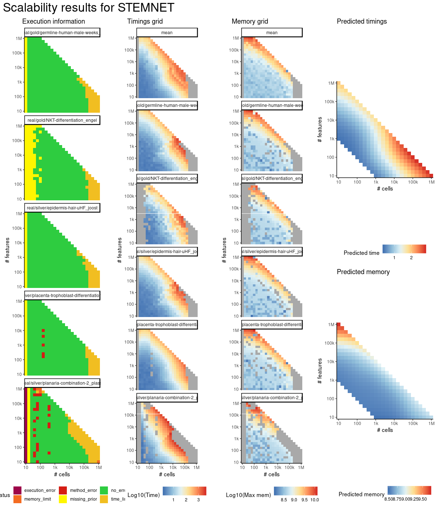
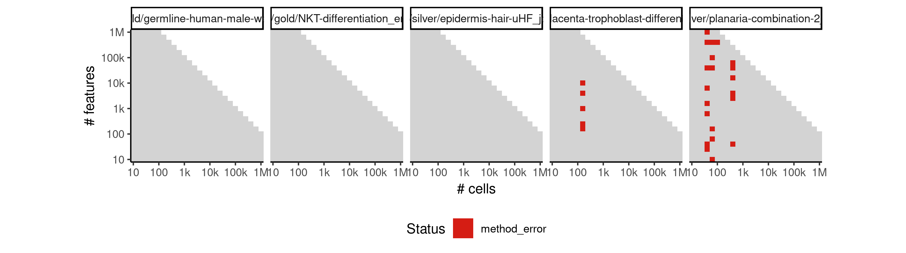
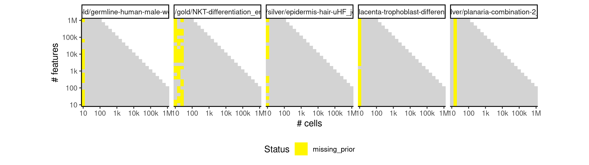
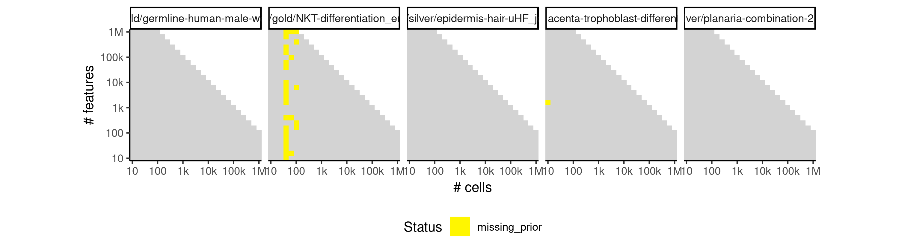
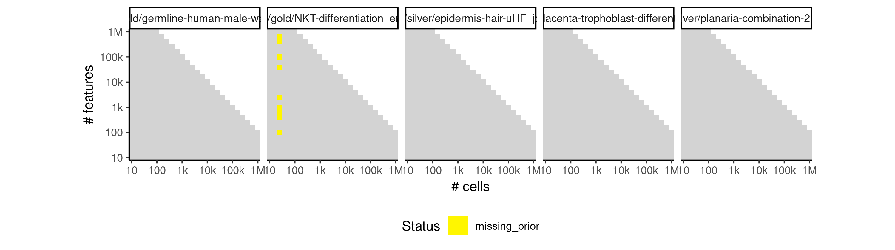

# stemnet


## ERROR STATUS METHOD_ERROR

### ERROR CLUSTER METHOD_ERROR -- 1


 * Number of instances: 16
 * Dataset ids: scaling_0050, scaling_0104, scaling_0173, scaling_0177, scaling_0178, scaling_0212, scaling_0215, scaling_0253, scaling_0738, scaling_0757, scaling_0826, scaling_0904, scaling_0938, scaling_0944, scaling_1027, scaling_1040

Last 10 lines of scaling_0050:
```
  one multinomial or binomial class has fewer than 8  observations; dangerous ground
2: In lognet(x, is.sparse, ix, jx, y, weights, offset, alpha, nobs,  :
  one multinomial or binomial class has fewer than 8  observations; dangerous ground
3: In lognet(x, is.sparse, ix, jx, y, weights, offset, alpha, nobs,  :
  one multinomial or binomial class has fewer than 8  observations; dangerous ground
4: In lognet(x, is.sparse, ix, jx, y, weights, offset, alpha, nobs,  :
  one multinomial or binomial class has fewer than 8  observations; dangerous ground
5: In lognet(x, is.sparse, ix, jx, y, weights, offset, alpha, nobs,  :
  one multinomial or binomial class has fewer than 8  observations; dangerous ground
Execution halted
```

## ERROR STATUS MISSING_PRIOR

### ERROR CLUSTER MISSING_PRIOR -- 1


 * Number of instances: 95
 * Dataset ids: scaling_0001, scaling_0002, scaling_0008, scaling_0009, scaling_0010, scaling_0012, scaling_0015, scaling_0016, scaling_0020, scaling_0025, scaling_0029, scaling_0034, scaling_0039, scaling_0043, scaling_0045, scaling_0047, scaling_0061, scaling_0066, scaling_0072, scaling_0082, scaling_0083, scaling_0088, scaling_0094, scaling_0101, scaling_0106, scaling_0113, scaling_0114, scaling_0115, scaling_0120, scaling_0127, scaling_0135, scaling_0143, scaling_0157, scaling_0158, scaling_0163, scaling_0169, scaling_0176, scaling_0181, scaling_0189, scaling_0202, scaling_0218, scaling_0224, scaling_0232, scaling_0244, scaling_0251, scaling_0260, scaling_0287, scaling_0288, scaling_0289, scaling_0309, scaling_0321, scaling_0341, scaling_0382, scaling_0391, scaling_0404, scaling_0405, scaling_0406, scaling_0417, scaling_0430, scaling_0444, scaling_0456, scaling_0466, scaling_0467, scaling_0476, scaling_0486, scaling_0522, scaling_0556, scaling_0574, scaling_0583, scaling_0601, scaling_0617, scaling_0619, scaling_0649, scaling_0666, scaling_0681, scaling_0699, scaling_0715, scaling_0732, scaling_0750, scaling_0766, scaling_0784, scaling_0785, scaling_0820, scaling_0839, scaling_0867, scaling_0868, scaling_0889, scaling_0943, scaling_0957, scaling_0975, scaling_0981, scaling_0995, scaling_0996, scaling_1009, scaling_1023

Last 10 lines of scaling_0001:
```
Attaching package: ‘purrr’
The following object is masked from ‘package:jsonlite’:
    flatten
Warning message:
STEMNET requires at least two end cell populations, but according to the prior information there are only 1 end populations!
Forced to invent some end populations in order to at least generate a trajectory 
Error in lognet(x, is.sparse, ix, jx, y, weights, offset, alpha, nobs,  : 
  one multinomial or binomial class has 1 or 0 observations; not allowed
Calls: <Anonymous> -> <Anonymous> -> lognet
Execution halted
```

### ERROR CLUSTER MISSING_PRIOR -- 2


 * Number of instances: 31
 * Dataset ids: scaling_0003, scaling_0006, scaling_0019, scaling_0022, scaling_0033, scaling_0041, scaling_0051, scaling_0056, scaling_0057, scaling_0076, scaling_0151, scaling_0188, scaling_0195, scaling_0226, scaling_0233, scaling_0238, scaling_0276, scaling_0298, scaling_0351, scaling_0352, scaling_0361, scaling_0510, scaling_0532, scaling_0565, scaling_0618, scaling_0633, scaling_0698, scaling_0802, scaling_0856, scaling_0878, scaling_0919

Last 10 lines of scaling_0003:
```
    flatten
Warning message:
STEMNET requires at least two end cell populations, but according to the prior information there are only 1 end populations!
Forced to invent some end populations in order to at least generate a trajectory 
At an optimal value of lambda, the misclassification rate for mature populations is 33.33%.
There were 13 warnings (use warnings() to see them)
Error in apply(object@posteriors[is.na(object@populations), ], 2, mean) : 
  dim(X) must have a positive length
Calls: <Anonymous> -> <Anonymous> -> apply
Execution halted
```

### ERROR CLUSTER MISSING_PRIOR -- 3


 * Number of instances: 14
 * Dataset ids: scaling_0004, scaling_0059, scaling_0159, scaling_0190, scaling_0290, scaling_0353, scaling_0371, scaling_0407, scaling_0468, scaling_0550, scaling_0567, scaling_0701, scaling_0702, scaling_0869

Last 10 lines of scaling_0004:
```
  one multinomial or binomial class has 1 or 0 observations; not allowed
Calls: <Anonymous> -> <Anonymous> -> glmnet -> lognet
In addition: Warning messages:
1: In lognet(x, is.sparse, ix, jx, y, weights, offset, alpha, nobs,  :
  one multinomial or binomial class has fewer than 8  observations; dangerous ground
2: In lognet(x, is.sparse, ix, jx, y, weights, offset, alpha, nobs,  :
  one multinomial or binomial class has fewer than 8  observations; dangerous ground
3: In lognet(x, is.sparse, ix, jx, y, weights, offset, alpha, nobs,  :
  one multinomial or binomial class has fewer than 8  observations; dangerous ground
Execution halted
```

### ERROR CLUSTER MISSING_PRIOR -- 4


 * Number of instances: 7
 * Dataset ids: scaling_0021, scaling_0058, scaling_0084, scaling_0333, scaling_0566, scaling_0700, scaling_0786

Last 10 lines of scaling_0021:
```
Warning message:
STEMNET requires at least two end cell populations, but according to the prior information there are only 1 end populations!
Forced to invent some end populations in order to at least generate a trajectory 
At an optimal value of lambda, the misclassification rate for mature populations is 0%.
Warning message:
Option grouped=FALSE enforced in cv.glmnet, since < 3 observations per fold 
Error in apply(object@posteriors[is.na(object@populations), ], 2, mean) : 
  dim(X) must have a positive length
Calls: <Anonymous> -> <Anonymous> -> apply
Execution halted
```


