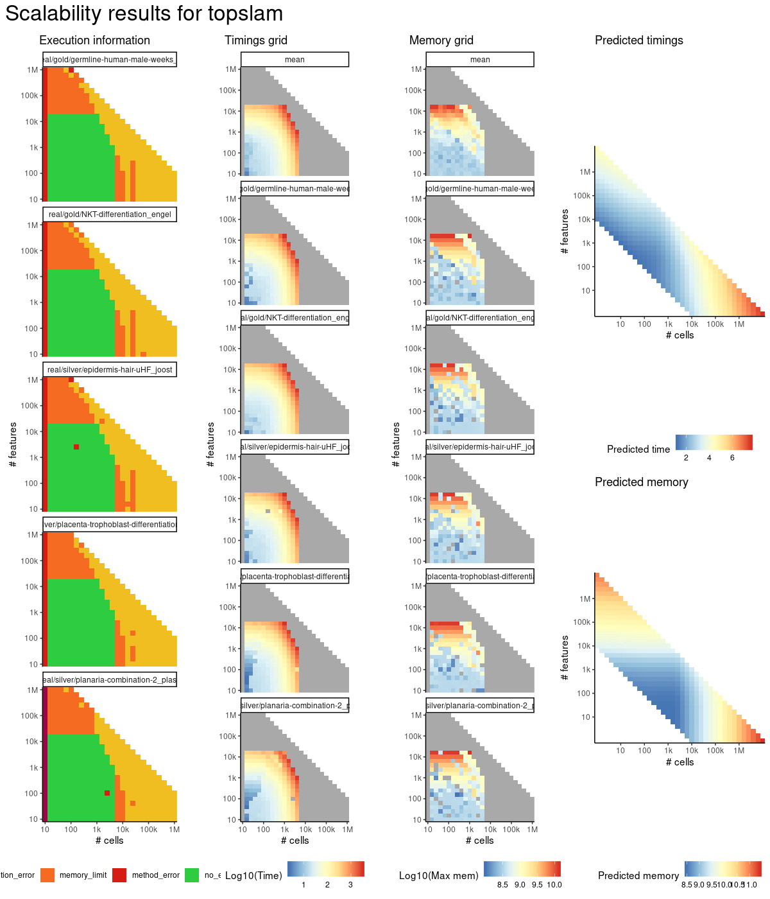
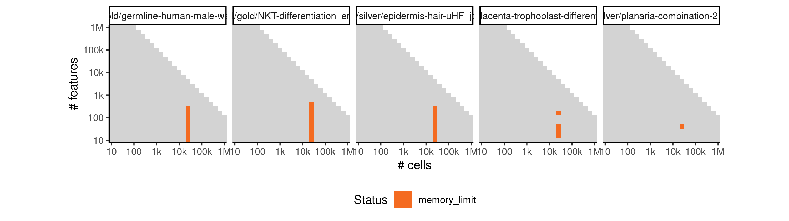
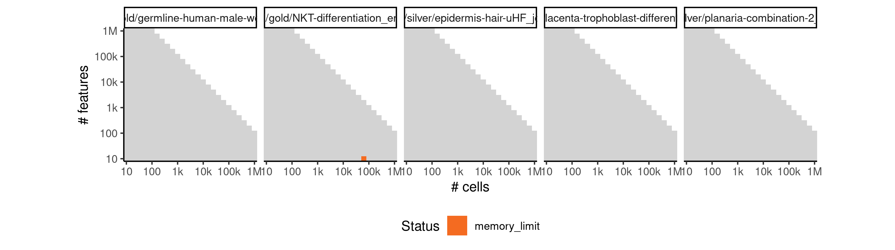
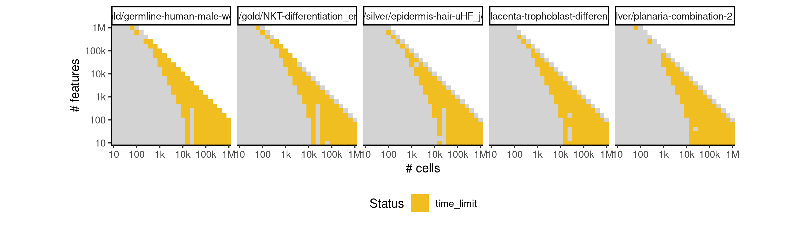

# topslam


## ERROR STATUS METHOD_ERROR

### ERROR CLUSTER METHOD_ERROR -- 1


 * Number of instances: 80
 * Dataset ids: scaling_0001, scaling_0002, scaling_0003, scaling_0004, scaling_0006, scaling_0008, scaling_0010, scaling_0012, scaling_0016, scaling_0019, scaling_0022, scaling_0025, scaling_0041, scaling_0043, scaling_0045, scaling_0047, scaling_0051, scaling_0056, scaling_0061, scaling_0066, scaling_0076, scaling_0082, scaling_0088, scaling_0094, scaling_0106, scaling_0113, scaling_0120, scaling_0127, scaling_0151, scaling_0157, scaling_0163, scaling_0169, scaling_0181, scaling_0188, scaling_0195, scaling_0202, scaling_0226, scaling_0232, scaling_0238, scaling_0244, scaling_0276, scaling_0287, scaling_0298, scaling_0309, scaling_0341, scaling_0351, scaling_0361, scaling_0371, scaling_0391, scaling_0404, scaling_0417, scaling_0430, scaling_0456, scaling_0466, scaling_0476, scaling_0486, scaling_0556, scaling_0565, scaling_0574, scaling_0583, scaling_0601, scaling_0617, scaling_0633, scaling_0649, scaling_0681, scaling_0698, scaling_0715, scaling_0732, scaling_0766, scaling_0784, scaling_0802, scaling_0820, scaling_0856, scaling_0867, scaling_0878, scaling_0889, scaling_0981, scaling_0995, scaling_1009, scaling_1023

Last 10 lines of scaling_0001:
```
    self._fit_transform(X)
  File "/usr/local/lib/python2.7/site-packages/sklearn/manifold/isomap.py", line 116, in _fit_transform
    mode='distance', n_jobs=self.n_jobs)
  File "/usr/local/lib/python2.7/site-packages/sklearn/neighbors/graph.py", line 103, in kneighbors_graph
    return X.kneighbors_graph(X=query, n_neighbors=n_neighbors, mode=mode)
  File "/usr/local/lib/python2.7/site-packages/sklearn/neighbors/base.py", line 489, in kneighbors_graph
    X, n_neighbors, return_distance=True)
  File "/usr/local/lib/python2.7/site-packages/sklearn/neighbors/base.py", line 347, in kneighbors
    (train_size, n_neighbors)
ValueError: Expected n_neighbors <= n_samples,  but n_samples = 10, n_neighbors = 11
```

## ERROR STATUS MEMORY_LIMIT

### ERROR CLUSTER MEMORY_LIMIT -- 1


 * Number of instances: 86
 * Dataset ids: scaling_0465, scaling_0475, scaling_0485, scaling_0495, scaling_0505, scaling_0531, scaling_0537, scaling_0543, scaling_0549, scaling_0555, scaling_0564, scaling_0573, scaling_0582, scaling_0591, scaling_0600, scaling_0614, scaling_0615, scaling_0616, scaling_0630, scaling_0631, scaling_0632, scaling_0646, scaling_0647, scaling_0648, scaling_0662, scaling_0663, scaling_0664, scaling_0678, scaling_0679, scaling_0680, scaling_0694, scaling_0695, scaling_0696, scaling_0711, scaling_0712, scaling_0713, scaling_0728, scaling_0729, scaling_0730, scaling_0745, scaling_0746, scaling_0747, scaling_0762, scaling_0763, scaling_0764, scaling_0779, scaling_0780, scaling_0781, scaling_0797, scaling_0798, scaling_0799, scaling_0815, scaling_0816, scaling_0817, scaling_0833, scaling_0834, scaling_0835, scaling_0851, scaling_0852, scaling_0853, scaling_0863, scaling_0864, scaling_0874, scaling_0875, scaling_0885, scaling_0886, scaling_0896, scaling_0897, scaling_0907, scaling_0908, scaling_0917, scaling_0925, scaling_0933, scaling_0941, scaling_0949, scaling_0961, scaling_0990, scaling_0991, scaling_1004, scaling_1005, scaling_1018, scaling_1019, scaling_1032, scaling_1033, scaling_1046, scaling_1047

Last 10 lines of scaling_0465:
```
    self._graph_distances, self._predecessors = dijkstra(self.graph, directed=False, return_predecessors=True)
  File "/topslam/topslam/pseudo_time/tree_correction.py", line 61, in graph
    return self.minimal_spanning_tree
  File "/topslam/topslam/pseudo_time/distance_correction.py", line 120, in minimal_spanning_tree
    self._mst = minimum_spanning_tree(self.manifold_corrected_distance_matrix)
  File "/topslam/topslam/pseudo_time/distance_correction.py", line 109, in manifold_corrected_distance_matrix
    self._M = lil_matrix(self.distance(self.Xgplvm, self.G))
  File "/topslam/topslam/pseudo_time/distances.py", line 74, in mean_embedding_dist
    mean_geometry = (G[:, None, :, :] + G[None, :, :, :])/2.
MemoryError
```

### ERROR CLUSTER MEMORY_LIMIT -- 2


 * Number of instances: 20
 * Dataset ids: scaling_0697, scaling_0714, scaling_0731, scaling_0748, scaling_0765, scaling_0782, scaling_0800, scaling_0818, scaling_0836, scaling_0854, scaling_0865, scaling_0876, scaling_0887, scaling_0898, scaling_0909, scaling_0992, scaling_1006, scaling_1020, scaling_1034, scaling_1048

Last 10 lines of scaling_0697:
```
    self._fit_transform(K)
  File "/usr/local/lib/python2.7/site-packages/sklearn/decomposition/kernel_pca.py", line 171, in _fit_transform
    K = self._centerer.fit_transform(K)
  File "/usr/local/lib/python2.7/site-packages/sklearn/base.py", line 517, in fit_transform
    return self.fit(X, **fit_params).transform(X)
  File "/usr/local/lib/python2.7/site-packages/sklearn/preprocessing/data.py", line 1713, in transform
    K = check_array(K, copy=copy, dtype=FLOAT_DTYPES)
  File "/usr/local/lib/python2.7/site-packages/sklearn/utils/validation.py", line 444, in check_array
    array = np.array(array, dtype=dtype, order=order, copy=copy)
MemoryError
```

### ERROR CLUSTER MEMORY_LIMIT -- 3


 * Number of instances: 30
 * Dataset ids: scaling_0767, scaling_0785, scaling_0803, scaling_0821, scaling_0839, scaling_0857, scaling_0868, scaling_0879, scaling_0890, scaling_0901, scaling_0911, scaling_0919, scaling_0927, scaling_0935, scaling_0943, scaling_0951, scaling_0957, scaling_0963, scaling_0969, scaling_0975, scaling_0982, scaling_0983, scaling_0996, scaling_0997, scaling_1010, scaling_1011, scaling_1024, scaling_1025, scaling_1038, scaling_1039

Last 10 lines of scaling_0767:
```
    landscape = topslam.landscape.waddington_landscape(m, resolution=100, xmargin=(0.5, 0.5), ymargin=(0.5, 0.5))
  File "/topslam/topslam/landscape.py", line 44, in waddington_landscape
    G = m.predict_magnification(Xpred, dimensions=msi)
  File "/usr/local/lib/python2.7/site-packages/GPy/core/gp.py", line 568, in predict_magnification
    G = self.predict_wishart_embedding(Xnew, kern, mean, covariance)
  File "/usr/local/lib/python2.7/site-packages/GPy/core/gp.py", line 537, in predict_wishart_embedding
    mu_jac, var_jac = self.predict_jacobian(Xnew, kern, full_cov=False)
  File "/usr/local/lib/python2.7/site-packages/GPy/core/gp.py", line 483, in predict_jacobian
    mean_jac = np.empty((Xnew.shape[0],Xnew.shape[1],self.output_dim))
MemoryError
```

### ERROR CLUSTER MEMORY_LIMIT -- 4


 * Number of instances: 9
 * Dataset ids: scaling_0783, scaling_0801, scaling_0819, scaling_0918, scaling_0926, scaling_0934, scaling_0942, scaling_1007, scaling_1021

Last 10 lines of scaling_0783:
```
Traceback (most recent call last):
  File "/code/run.py", line 50, in <module>
    X_init, dims = run_methods(expression, methods)
  File "/topslam/topslam/optimization.py", line 57, in run_methods
    _lat = method.fit_transform(Y)
  File "/usr/local/lib/python2.7/site-packages/sklearn/manifold/isomap.py", line 184, in fit_transform
    self._fit_transform(X)
  File "/usr/local/lib/python2.7/site-packages/sklearn/manifold/isomap.py", line 121, in _fit_transform
    G = self.dist_matrix_ ** 2
MemoryError
```

### ERROR CLUSTER MEMORY_LIMIT -- 5


 * Number of instances: 2
 * Dataset ids: scaling_0877, scaling_0962

Last 10 lines of scaling_0877:
```
  File "/code/run.py", line 50, in <module>
    X_init, dims = run_methods(expression, methods)
  File "/topslam/topslam/optimization.py", line 57, in run_methods
    _lat = method.fit_transform(Y)
  File "/usr/local/lib/python2.7/site-packages/sklearn/manifold/isomap.py", line 184, in fit_transform
    self._fit_transform(X)
  File "/usr/local/lib/python2.7/site-packages/sklearn/manifold/isomap.py", line 120, in _fit_transform
    directed=False)
  File "sklearn/utils/graph_shortest_path.pyx", line 87, in sklearn.utils.graph_shortest_path.graph_shortest_path
MemoryError
```

## ERROR STATUS TIME_LIMIT

### ERROR CLUSTER TIME_LIMIT -- 1


 * Number of instances: 23
 * Dataset ids: scaling_0837, scaling_0855, scaling_0866, scaling_0888, scaling_0899, scaling_0910, scaling_0950, scaling_0955, scaling_0956, scaling_0967, scaling_0968, scaling_0973, scaling_0974, scaling_0979, scaling_0980, scaling_0993, scaling_0994, scaling_1008, scaling_1022, scaling_1035, scaling_1036, scaling_1049, scaling_1050

Last 10 lines of scaling_0837:
```
File: /home/rcannood/Workspace/dynverse/dynbenchmark//derived/05-scaling/suite/topslam/10/r2gridengine/20180924_185052_topslam_10_NznXcCPVNA/log/log.837.e.txt
```


