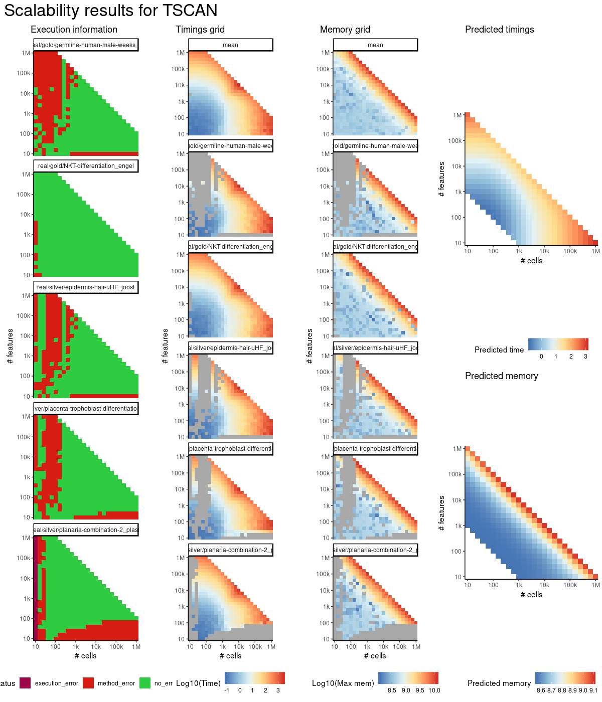
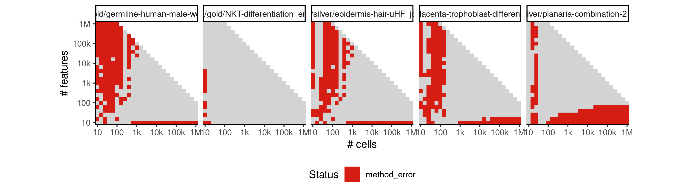

# tscan


## ERROR STATUS METHOD_ERROR

### ERROR CLUSTER METHOD_ERROR -- 1


 * Number of instances: 359
 * Dataset ids: scaling_0002, scaling_0006, scaling_0009, scaling_0011, scaling_0015, scaling_0018, scaling_0019, scaling_0022, scaling_0027, scaling_0029, scaling_0030, scaling_0031, scaling_0032, scaling_0035, scaling_0036, scaling_0037, scaling_0038, scaling_0039, scaling_0040, scaling_0045, scaling_0046, scaling_0048, scaling_0051, scaling_0056, scaling_0062, scaling_0063, scaling_0066, scaling_0067, scaling_0068, scaling_0073, scaling_0078, scaling_0082, scaling_0090, scaling_0094, scaling_0095, scaling_0096, scaling_0101, scaling_0105, scaling_0106, scaling_0107, scaling_0108, scaling_0109, scaling_0111, scaling_0122, scaling_0123, scaling_0125, scaling_0129, scaling_0135, scaling_0140, scaling_0147, scaling_0149, scaling_0153, scaling_0154, scaling_0165, scaling_0166, scaling_0170, scaling_0171, scaling_0172, scaling_0176, scaling_0179, scaling_0180, scaling_0181, scaling_0182, scaling_0183, scaling_0184, scaling_0188, scaling_0196, scaling_0197, scaling_0202, scaling_0203, scaling_0204, scaling_0205, scaling_0207, scaling_0210, scaling_0215, scaling_0225, scaling_0227, scaling_0228, scaling_0231, scaling_0232, scaling_0238, scaling_0240, scaling_0243, scaling_0247, scaling_0251, scaling_0254, scaling_0255, scaling_0256, scaling_0257, scaling_0264, scaling_0265, scaling_0268, scaling_0269, scaling_0270, scaling_0272, scaling_0276, scaling_0277, scaling_0278, scaling_0279, scaling_0280, scaling_0286, scaling_0287, scaling_0298, scaling_0300, scaling_0301, scaling_0302, scaling_0308, scaling_0311, scaling_0312, scaling_0313, scaling_0314, scaling_0319, scaling_0321, scaling_0322, scaling_0328, scaling_0329, scaling_0330, scaling_0331, scaling_0335, scaling_0337, scaling_0339, scaling_0340, scaling_0341, scaling_0342, scaling_0343, scaling_0344, scaling_0346, scaling_0350, scaling_0351, scaling_0361, scaling_0363, scaling_0364, scaling_0366, scaling_0370, scaling_0373, scaling_0374, scaling_0375, scaling_0380, scaling_0389, scaling_0390, scaling_0391, scaling_0392, scaling_0393, scaling_0394, scaling_0395, scaling_0396, scaling_0397, scaling_0403, scaling_0404, scaling_0417, scaling_0419, scaling_0420, scaling_0422, scaling_0429, scaling_0430, scaling_0433, scaling_0434, scaling_0435, scaling_0442, scaling_0445, scaling_0453, scaling_0454, scaling_0455, scaling_0456, scaling_0457, scaling_0458, scaling_0459, scaling_0465, scaling_0466, scaling_0477, scaling_0478, scaling_0479, scaling_0480, scaling_0485, scaling_0486, scaling_0488, scaling_0489, scaling_0490, scaling_0495, scaling_0497, scaling_0504, scaling_0505, scaling_0508, scaling_0515, scaling_0516, scaling_0518, scaling_0519, scaling_0525, scaling_0526, scaling_0527, scaling_0539, scaling_0540, scaling_0545, scaling_0546, scaling_0555, scaling_0556, scaling_0557, scaling_0558, scaling_0564, scaling_0574, scaling_0576, scaling_0582, scaling_0583, scaling_0584, scaling_0585, scaling_0591, scaling_0593, scaling_0599, scaling_0600, scaling_0603, scaling_0604, scaling_0605, scaling_0606, scaling_0607, scaling_0609, scaling_0616, scaling_0633, scaling_0636, scaling_0637, scaling_0638, scaling_0639, scaling_0641, scaling_0648, scaling_0649, scaling_0651, scaling_0652, scaling_0653, scaling_0654, scaling_0664, scaling_0667, scaling_0678, scaling_0679, scaling_0680, scaling_0682, scaling_0683, scaling_0684, scaling_0685, scaling_0686, scaling_0687, scaling_0697, scaling_0715, scaling_0718, scaling_0719, scaling_0720, scaling_0721, scaling_0731, scaling_0732, scaling_0735, scaling_0736, scaling_0737, scaling_0738, scaling_0748, scaling_0751, scaling_0762, scaling_0763, scaling_0764, scaling_0765, scaling_0766, scaling_0767, scaling_0768, scaling_0769, scaling_0770, scaling_0771, scaling_0772, scaling_0774, scaling_0783, scaling_0802, scaling_0805, scaling_0806, scaling_0807, scaling_0808, scaling_0810, scaling_0819, scaling_0820, scaling_0823, scaling_0824, scaling_0825, scaling_0826, scaling_0836, scaling_0837, scaling_0840, scaling_0852, scaling_0853, scaling_0854, scaling_0855, scaling_0856, scaling_0857, scaling_0858, scaling_0859, scaling_0866, scaling_0878, scaling_0880, scaling_0881, scaling_0888, scaling_0889, scaling_0891, scaling_0892, scaling_0899, scaling_0901, scaling_0908, scaling_0909, scaling_0910, scaling_0911, scaling_0912, scaling_0913, scaling_0928, scaling_0929, scaling_0936, scaling_0937, scaling_0950, scaling_0951, scaling_0952, scaling_0964, scaling_0970, scaling_0974, scaling_0980, scaling_0981, scaling_0982, scaling_0983, scaling_0984, scaling_0985, scaling_0987, scaling_0994, scaling_1009, scaling_1011, scaling_1013, scaling_1015, scaling_1022, scaling_1023, scaling_1025, scaling_1026, scaling_1027, scaling_1036, scaling_1038, scaling_1048, scaling_1049, scaling_1050, scaling_1051, scaling_1052, scaling_1053, scaling_1055, scaling_1056, scaling_1069, scaling_1089, scaling_1091, scaling_1092, scaling_1093, scaling_1094, scaling_1096, scaling_1107, scaling_1108, scaling_1109, scaling_1110, scaling_1111, scaling_1112, scaling_1126, scaling_1143, scaling_1144, scaling_1145

Last 10 lines of scaling_0002:
```
The following objects are masked from ‘package:stats’:
    filter, lag
The following objects are masked from ‘package:base’:
    intersect, setdiff, setequal, union
Attaching package: ‘purrr’
The following object is masked from ‘package:jsonlite’:
    flatten
Error in apply(res$z, 1, which.max) : dim(X) must have a positive length
Calls: <Anonymous> -> apply
Execution halted
```


