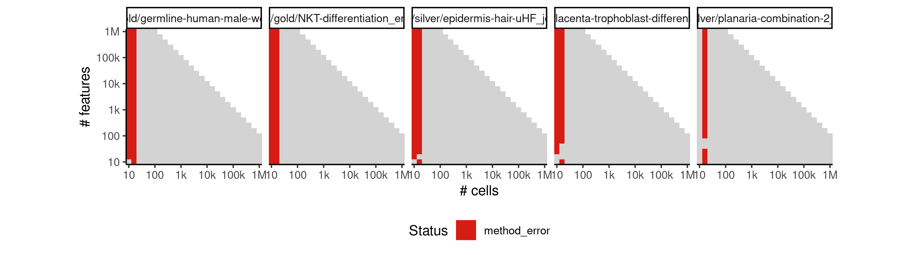
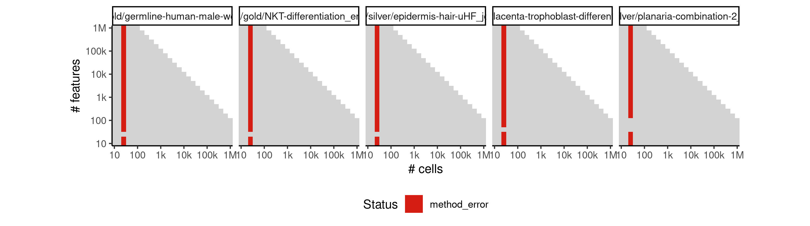
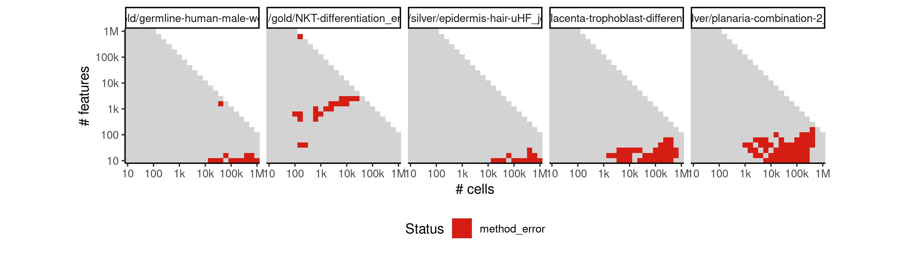
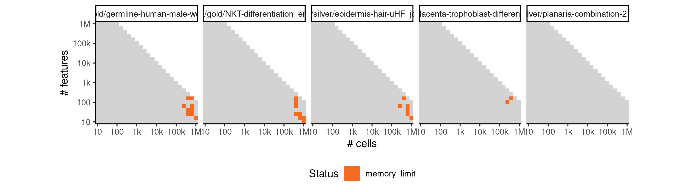

# wanderlust


## ERROR STATUS EXECUTION_ERROR

## ERROR STATUS METHOD_ERROR

### ERROR CLUSTER METHOD_ERROR -- 1


 * Number of instances: 17
 * Dataset ids: scaling_0001, scaling_0003, scaling_0004, scaling_0012, scaling_0023, scaling_0026, scaling_0037, scaling_0053, scaling_0058, scaling_0063, scaling_0067, scaling_0072, scaling_0096, scaling_0101, scaling_0102, scaling_0136, scaling_0149

Last 10 lines of scaling_0001:
```
    nbrs = NearestNeighbors(n_neighbors=knn).fit(data)
  File "/usr/local/lib/python3.6/site-packages/sklearn/neighbors/base.py", line 803, in fit
    return self._fit(X)
  File "/usr/local/lib/python3.6/site-packages/sklearn/neighbors/base.py", line 204, in _fit
    X = check_array(X, accept_sparse='csr')
  File "/usr/local/lib/python3.6/site-packages/sklearn/utils/validation.py", line 453, in check_array
    _assert_all_finite(array)
  File "/usr/local/lib/python3.6/site-packages/sklearn/utils/validation.py", line 44, in _assert_all_finite
    " or a value too large for %r." % X.dtype)
ValueError: Input contains NaN, infinity or a value too large for dtype('float32').
```

### ERROR CLUSTER METHOD_ERROR -- 2


 * Number of instances: 215
 * Dataset ids: scaling_0002, scaling_0006, scaling_0007, scaling_0008, scaling_0009, scaling_0010, scaling_0011, scaling_0013, scaling_0015, scaling_0016, scaling_0017, scaling_0019, scaling_0020, scaling_0022, scaling_0025, scaling_0029, scaling_0031, scaling_0033, scaling_0035, scaling_0039, scaling_0041, scaling_0043, scaling_0045, scaling_0047, scaling_0051, scaling_0052, scaling_0056, scaling_0057, scaling_0061, scaling_0062, scaling_0066, scaling_0076, scaling_0077, scaling_0082, scaling_0083, scaling_0088, scaling_0089, scaling_0094, scaling_0095, scaling_0106, scaling_0107, scaling_0113, scaling_0114, scaling_0120, scaling_0121, scaling_0127, scaling_0128, scaling_0135, scaling_0151, scaling_0152, scaling_0157, scaling_0158, scaling_0163, scaling_0164, scaling_0169, scaling_0170, scaling_0176, scaling_0181, scaling_0188, scaling_0195, scaling_0202, scaling_0216, scaling_0218, scaling_0220, scaling_0222, scaling_0224, scaling_0226, scaling_0227, scaling_0232, scaling_0233, scaling_0238, scaling_0239, scaling_0244, scaling_0245, scaling_0251, scaling_0276, scaling_0277, scaling_0287, scaling_0288, scaling_0298, scaling_0299, scaling_0309, scaling_0310, scaling_0321, scaling_0341, scaling_0342, scaling_0351, scaling_0352, scaling_0361, scaling_0362, scaling_0371, scaling_0372, scaling_0382, scaling_0391, scaling_0392, scaling_0404, scaling_0405, scaling_0417, scaling_0418, scaling_0430, scaling_0431, scaling_0444, scaling_0456, scaling_0466, scaling_0476, scaling_0486, scaling_0506, scaling_0510, scaling_0514, scaling_0518, scaling_0522, scaling_0526, scaling_0532, scaling_0538, scaling_0544, scaling_0550, scaling_0556, scaling_0565, scaling_0574, scaling_0583, scaling_0601, scaling_0602, scaling_0617, scaling_0618, scaling_0633, scaling_0634, scaling_0649, scaling_0650, scaling_0666, scaling_0681, scaling_0682, scaling_0698, scaling_0699, scaling_0715, scaling_0716, scaling_0732, scaling_0733, scaling_0750, scaling_0766, scaling_0767, scaling_0784, scaling_0785, scaling_0802, scaling_0803, scaling_0820, scaling_0821, scaling_0839, scaling_0856, scaling_0867, scaling_0878, scaling_0889, scaling_0911, scaling_0919, scaling_0927, scaling_0935, scaling_0943, scaling_0951, scaling_0957, scaling_0963, scaling_0969, scaling_0975, scaling_0981, scaling_0995, scaling_1009, scaling_1023, scaling_1051, scaling_1070, scaling_1089, scaling_1108, scaling_1146, scaling_1148, scaling_1150, scaling_1152, scaling_1154, scaling_1166, scaling_1167, scaling_1182, scaling_1183, scaling_1198, scaling_1199, scaling_1214, scaling_1215, scaling_1231, scaling_1276, scaling_1277, scaling_1297, scaling_1298, scaling_1318, scaling_1319, scaling_1339, scaling_1340, scaling_1361, scaling_1441, scaling_1442, scaling_1453, scaling_1454, scaling_1465, scaling_1466, scaling_1477, scaling_1478, scaling_1490, scaling_1531, scaling_1532, scaling_1550, scaling_1551, scaling_1569, scaling_1570, scaling_1588, scaling_1589, scaling_1608, scaling_1626, scaling_1648, scaling_1670, scaling_1692, scaling_1736

Last 10 lines of scaling_0002:
```
  /group/irc/shared/dynverse/dynbenchmark/derived/singularity_images/dynverse/ti_wanderlust.simg
Target dimensionality reduced to 10.
Traceback (most recent call last):
  File "/code/run.py", line 32, in <module>
    scdata.run_diffusion_map(knn=p["knn"], epsilon=p["epsilon"], n_diffusion_components=p["n_diffusion_components"], n_pca_components=p["n_pca_components"], markers=markers)
  File "/usr/local/lib/python3.6/site-packages/wishbone/wb.py", line 601, in run_diffusion_map
    distances, indices = nbrs.kneighbors(data)
  File "/usr/local/lib/python3.6/site-packages/sklearn/neighbors/base.py", line 347, in kneighbors
    (train_size, n_neighbors)
ValueError: Expected n_neighbors <= n_samples,  but n_samples = 10, n_neighbors = 25
```

### ERROR CLUSTER METHOD_ERROR -- 3


 * Number of instances: 114
 * Dataset ids: scaling_0018, scaling_0021, scaling_0024, scaling_0027, scaling_0030, scaling_0032, scaling_0034, scaling_0036, scaling_0038, scaling_0040, scaling_0068, scaling_0073, scaling_0078, scaling_0084, scaling_0090, scaling_0108, scaling_0115, scaling_0122, scaling_0129, scaling_0141, scaling_0143, scaling_0145, scaling_0147, scaling_0182, scaling_0189, scaling_0196, scaling_0203, scaling_0210, scaling_0256, scaling_0260, scaling_0264, scaling_0268, scaling_0272, scaling_0278, scaling_0289, scaling_0300, scaling_0311, scaling_0322, scaling_0331, scaling_0333, scaling_0335, scaling_0337, scaling_0339, scaling_0393, scaling_0406, scaling_0419, scaling_0432, scaling_0445, scaling_0457, scaling_0467, scaling_0477, scaling_0487, scaling_0497, scaling_0557, scaling_0566, scaling_0575, scaling_0584, scaling_0593, scaling_0603, scaling_0619, scaling_0635, scaling_0651, scaling_0667, scaling_0683, scaling_0700, scaling_0717, scaling_0734, scaling_0751, scaling_0768, scaling_0786, scaling_0804, scaling_0822, scaling_0840, scaling_0857, scaling_0868, scaling_0879, scaling_0890, scaling_0901, scaling_0982, scaling_0996, scaling_1010, scaling_1024, scaling_1038, scaling_1052, scaling_1071, scaling_1090, scaling_1109, scaling_1128, scaling_1246, scaling_1250, scaling_1254, scaling_1258, scaling_1262, scaling_1278, scaling_1299, scaling_1320, scaling_1341, scaling_1362, scaling_1381, scaling_1393, scaling_1405, scaling_1417, scaling_1429, scaling_1533, scaling_1552, scaling_1571, scaling_1590, scaling_1609, scaling_1627, scaling_1649, scaling_1671, scaling_1693, scaling_1715, scaling_1935

Last 10 lines of scaling_0018:
```
    wb.run_wishbone(start_cell=start_cell, components_list=list(range(p["n_diffusion_components"])), num_waypoints=int(p["num_waypoints"]), branch=False, k=p["k"])
  File "/usr/local/lib/python3.6/site-packages/wishbone/wb.py", line 1068, in run_wishbone
    s=s, k=k, l=k, num_waypoints=num_waypoints, branch=branch)
  File "/usr/local/lib/python3.6/site-packages/wishbone/core.py", line 27, in wishbone
    lnn = nbrs.kneighbors_graph(data, mode='distance' ) 
  File "/usr/local/lib/python3.6/site-packages/sklearn/neighbors/base.py", line 489, in kneighbors_graph
    X, n_neighbors, return_distance=True)
  File "/usr/local/lib/python3.6/site-packages/sklearn/neighbors/base.py", line 347, in kneighbors
    (train_size, n_neighbors)
ValueError: Expected n_neighbors <= n_samples,  but n_samples = 25, n_neighbors = 26
```

### ERROR CLUSTER METHOD_ERROR -- 4


 * Number of instances: 8
 * Dataset ids: scaling_0050, scaling_0075, scaling_1342, scaling_1418, scaling_1591, scaling_1694, scaling_2009, scaling_2194

Last 10 lines of scaling_0050:
```
  return umr_maximum(a, axis, None, out, keepdims, initial)
/usr/local/lib/python3.6/site-packages/numpy/core/fromnumeric.py:83: RuntimeWarning: invalid value encountered in reduce
  return ufunc.reduce(obj, axis, dtype, out, **passkwargs)
output saved in /data/tmp//RtmpoUsVs8/file1769e3acd9f9b/ti/output: 
	cell_ids.csv
	dimred.csv
	pseudotime.csv
	timings.json
all(pg_check >= 0 & pg_check < (1 + 1e-06)) isn't true.
Sum of progressions per cell_id should be exactly one
```

### ERROR CLUSTER METHOD_ERROR -- 5


 * Number of instances: 117
 * Dataset ids: scaling_0262, scaling_0294, scaling_0441, scaling_0495, scaling_0503, scaling_0504, scaling_0521, scaling_0525, scaling_0534, scaling_0549, scaling_0555, scaling_0568, scaling_0591, scaling_0598, scaling_0599, scaling_0600, scaling_0623, scaling_0662, scaling_0663, scaling_0664, scaling_0680, scaling_0697, scaling_0731, scaling_0746, scaling_0747, scaling_0761, scaling_0762, scaling_0763, scaling_0764, scaling_0765, scaling_0783, scaling_0793, scaling_0819, scaling_0835, scaling_0837, scaling_0851, scaling_0852, scaling_0854, scaling_0855, scaling_0866, scaling_0872, scaling_0888, scaling_0898, scaling_0899, scaling_0908, scaling_0909, scaling_0910, scaling_0949, scaling_0950, scaling_0959, scaling_0960, scaling_0974, scaling_0980, scaling_1035, scaling_1036, scaling_1049, scaling_1050, scaling_1069, scaling_1107, scaling_1126, scaling_1143, scaling_1144, scaling_1145, scaling_1147, scaling_1151, scaling_1153, scaling_1155, scaling_1165, scaling_1181, scaling_1190, scaling_1213, scaling_1228, scaling_1229, scaling_1242, scaling_1243, scaling_1244, scaling_1245, scaling_1265, scaling_1296, scaling_1308, scaling_1338, scaling_1357, scaling_1358, scaling_1359, scaling_1377, scaling_1378, scaling_1379, scaling_1380, scaling_1428, scaling_1439, scaling_1440, scaling_1452, scaling_1459, scaling_1476, scaling_1487, scaling_1488, scaling_1499, scaling_1530, scaling_1548, scaling_1549, scaling_1560, scaling_1586, scaling_1587, scaling_1603, scaling_1604, scaling_1605, scaling_1622, scaling_1623, scaling_1647, scaling_1660, scaling_1690, scaling_1691, scaling_1711, scaling_1712, scaling_1732, scaling_1733, scaling_1871

Last 10 lines of scaling_0262:
```
    wb.run_wishbone(start_cell=start_cell, components_list=list(range(p["n_diffusion_components"])), num_waypoints=int(p["num_waypoints"]), branch=False, k=p["k"])
  File "/usr/local/lib/python3.6/site-packages/wishbone/wb.py", line 1068, in run_wishbone
    s=s, k=k, l=k, num_waypoints=num_waypoints, branch=branch)
  File "/usr/local/lib/python3.6/site-packages/wishbone/core.py", line 50, in wishbone
    traj, dist, iter_l, paths_l2l = _trajectory_landmarks( klnn, data, [s], num_waypoints, partial_order, verbose, metric, flock_waypoints, band_sample, branch)
  File "/usr/local/lib/python3.6/site-packages/wishbone/core.py", line 263, in _trajectory_landmarks
    paths_l2l.append( [paths[li] for li in l] )
  File "/usr/local/lib/python3.6/site-packages/wishbone/core.py", line 263, in <listcomp>
    paths_l2l.append( [paths[li] for li in l] )
KeyError: 29
```

### ERROR CLUSTER METHOD_ERROR -- 6


 * Number of instances: 1
 * Dataset ids: scaling_2088

Last 10 lines of scaling_2088:
```
Correlation with previous iteration:  1.0000
7 realignment iterations
Traceback (most recent call last):
  File "/code/run.py", line 54, in <module>
    dimred.reset_index().to_csv("/ti/output/dimred.csv", index=False)
  File "/usr/local/lib/python3.6/site-packages/pandas/core/frame.py", line 1745, in to_csv
    formatter.save()
  File "/usr/local/lib/python3.6/site-packages/pandas/io/formats/csvs.py", line 186, in save
    f.close()
OSError: [Errno 28] No space left on device
```

## ERROR STATUS TIME_LIMIT

### ERROR CLUSTER TIME_LIMIT -- 1


 * Number of instances: 81
 * Dataset ids: scaling_0994, scaling_1008, scaling_1022, scaling_1088, scaling_1149, scaling_1180, scaling_1196, scaling_1197, scaling_1212, scaling_1249, scaling_1253, scaling_1257, scaling_1261, scaling_1293, scaling_1294, scaling_1295, scaling_1314, scaling_1315, scaling_1316, scaling_1317, scaling_1335, scaling_1336, scaling_1337, scaling_1356, scaling_1391, scaling_1392, scaling_1403, scaling_1404, scaling_1415, scaling_1416, scaling_1427, scaling_1450, scaling_1451, scaling_1462, scaling_1463, scaling_1464, scaling_1474, scaling_1475, scaling_1486, scaling_1498, scaling_1500, scaling_1506, scaling_1512, scaling_1518, scaling_1524, scaling_1545, scaling_1546, scaling_1547, scaling_1564, scaling_1565, scaling_1566, scaling_1567, scaling_1583, scaling_1584, scaling_1585, scaling_1602, scaling_1606, scaling_1621, scaling_1624, scaling_1625, scaling_1643, scaling_1644, scaling_1645, scaling_1665, scaling_1666, scaling_1667, scaling_1687, scaling_1688, scaling_1689, scaling_1709, scaling_1710, scaling_1713, scaling_1731, scaling_1734, scaling_1735, scaling_1746, scaling_1750, scaling_1807, scaling_2113, scaling_2158, scaling_2193

Last 10 lines of scaling_0994:
```
File: /home/rcannood/Workspace/dynverse/dynbenchmark//derived/05-scaling/suite/wanderlust/Cat2/r2gridengine/20181008_214919_wanderlust_Cat2_Gmd54V72Fx/log/log.314.e.txt
```

## ERROR STATUS MEMORY_LIMIT

### ERROR CLUSTER MEMORY_LIMIT -- 1


 * Number of instances: 1
 * Dataset ids: scaling_1568

Last 10 lines of scaling_1568:
```
.Traceback (most recent call last):
  File "/code/run.py", line 40, in <module>
    wb.run_wishbone(start_cell=start_cell, components_list=list(range(p["n_diffusion_components"])), num_waypoints=int(p["num_waypoints"]), branch=False, k=p["k"])
  File "/usr/local/lib/python3.6/site-packages/wishbone/wb.py", line 1068, in run_wishbone
  File "/usr/local/lib/python3.6/site-packages/wishbone/core.py", line 50, in wishbone
  File "/usr/local/lib/python3.6/site-packages/wishbone/core.py", line 260, in _trajectory_landmarks
  File "/usr/local/lib/python3.6/site-packages/networkx/algorithms/shortest_paths/weighted.py", line 452, in single_source_dijkstra
  File "/usr/local/lib/python3.6/site-packages/networkx/algorithms/shortest_paths/weighted.py", line 706, in multi_source_dijkstra
  File "/usr/local/lib/python3.6/site-packages/networkx/algorithms/shortest_paths/weighted.py", line 810, in _dijkstra_multisource
MemoryError
```

### ERROR CLUSTER MEMORY_LIMIT -- 2


 * Number of instances: 3
 * Dataset ids: scaling_1646, scaling_1668, scaling_1669

Last 10 lines of scaling_1646:
```
    traj, dist, iter_l, paths_l2l = _trajectory_landmarks( klnn, data, [s], num_waypoints, partial_order, verbose, metric, flock_waypoints, band_sample, branch)
  File "/usr/local/lib/python3.6/site-packages/wishbone/core.py", line 260, in _trajectory_landmarks
    temp = nx.single_source_dijkstra(graph, l[i])
  File "/usr/local/lib/python3.6/site-packages/networkx/algorithms/shortest_paths/weighted.py", line 452, in single_source_dijkstra
    weight=weight)
  File "/usr/local/lib/python3.6/site-packages/networkx/algorithms/shortest_paths/weighted.py", line 706, in multi_source_dijkstra
    cutoff=cutoff, target=target)
  File "/usr/local/lib/python3.6/site-packages/networkx/algorithms/shortest_paths/weighted.py", line 810, in _dijkstra_multisource
    paths[u] = paths[v] + [u]
MemoryError
```

### ERROR CLUSTER MEMORY_LIMIT -- 3


 * Number of instances: 563
 * Dataset ids: scaling_1737, scaling_1738, scaling_1739, scaling_1740, scaling_1741, scaling_1742, scaling_1743, scaling_1744, scaling_1747, scaling_1748, scaling_1751, scaling_1752, scaling_1753, scaling_1754, scaling_1755, scaling_1756, scaling_1757, scaling_1758, scaling_1759, scaling_1760, scaling_1761, scaling_1762, scaling_1763, scaling_1764, scaling_1765, scaling_1766, scaling_1767, scaling_1768, scaling_1769, scaling_1770, scaling_1771, scaling_1772, scaling_1773, scaling_1774, scaling_1775, scaling_1776, scaling_1777, scaling_1778, scaling_1779, scaling_1780, scaling_1781, scaling_1782, scaling_1784, scaling_1785, scaling_1786, scaling_1787, scaling_1788, scaling_1789, scaling_1790, scaling_1791, scaling_1792, scaling_1793, scaling_1794, scaling_1795, scaling_1796, scaling_1797, scaling_1798, scaling_1799, scaling_1800, scaling_1801, scaling_1802, scaling_1803, scaling_1804, scaling_1805, scaling_1806, scaling_1808, scaling_1809, scaling_1810, scaling_1811, scaling_1812, scaling_1813, scaling_1814, scaling_1815, scaling_1816, scaling_1817, scaling_1818, scaling_1819, scaling_1820, scaling_1822, scaling_1823, scaling_1824, scaling_1825, scaling_1826, scaling_1827, scaling_1828, scaling_1829, scaling_1830, scaling_1832, scaling_1833, scaling_1834, scaling_1835, scaling_1836, scaling_1837, scaling_1838, scaling_1839, scaling_1840, scaling_1841, scaling_1842, scaling_1843, scaling_1844, scaling_1846, scaling_1847, scaling_1848, scaling_1849, scaling_1850, scaling_1851, scaling_1852, scaling_1853, scaling_1854, scaling_1855, scaling_1856, scaling_1857, scaling_1858, scaling_1859, scaling_1860, scaling_1861, scaling_1862, scaling_1863, scaling_1864, scaling_1865, scaling_1866, scaling_1867, scaling_1868, scaling_1869, scaling_1870, scaling_1872, scaling_1873, scaling_1874, scaling_1875, scaling_1876, scaling_1877, scaling_1878, scaling_1879, scaling_1880, scaling_1881, scaling_1882, scaling_1883, scaling_1885, scaling_1886, scaling_1887, scaling_1888, scaling_1889, scaling_1890, scaling_1891, scaling_1892, scaling_1893, scaling_1894, scaling_1895, scaling_1896, scaling_1897, scaling_1898, scaling_1901, scaling_1902, scaling_1903, scaling_1904, scaling_1905, scaling_1906, scaling_1907, scaling_1908, scaling_1909, scaling_1910, scaling_1911, scaling_1912, scaling_1913, scaling_1914, scaling_1915, scaling_1916, scaling_1917, scaling_1918, scaling_1919, scaling_1920, scaling_1921, scaling_1922, scaling_1923, scaling_1924, scaling_1925, scaling_1926, scaling_1927, scaling_1928, scaling_1929, scaling_1930, scaling_1931, scaling_1932, scaling_1933, scaling_1934, scaling_1936, scaling_1937, scaling_1938, scaling_1939, scaling_1940, scaling_1941, scaling_1942, scaling_1943, scaling_1944, scaling_1945, scaling_1947, scaling_1948, scaling_1949, scaling_1950, scaling_1951, scaling_1952, scaling_1953, scaling_1954, scaling_1955, scaling_1956, scaling_1957, scaling_1958, scaling_1959, scaling_1960, scaling_1961, scaling_1962, scaling_1963, scaling_1964, scaling_1965, scaling_1966, scaling_1967, scaling_1968, scaling_1969, scaling_1970, scaling_1971, scaling_1972, scaling_1973, scaling_1974, scaling_1975, scaling_1976, scaling_1977, scaling_1978, scaling_1979, scaling_1980, scaling_1981, scaling_1982, scaling_1983, scaling_1984, scaling_1985, scaling_1986, scaling_1987, scaling_1988, scaling_1989, scaling_1990, scaling_1991, scaling_1992, scaling_1993, scaling_1994, scaling_1995, scaling_1996, scaling_1997, scaling_1998, scaling_1999, scaling_2000, scaling_2001, scaling_2002, scaling_2003, scaling_2004, scaling_2005, scaling_2006, scaling_2007, scaling_2008, scaling_2010, scaling_2011, scaling_2012, scaling_2013, scaling_2014, scaling_2015, scaling_2016, scaling_2017, scaling_2018, scaling_2019, scaling_2020, scaling_2021, scaling_2023, scaling_2024, scaling_2025, scaling_2027, scaling_2028, scaling_2029, scaling_2030, scaling_2031, scaling_2032, scaling_2033, scaling_2034, scaling_2035, scaling_2036, scaling_2037, scaling_2038, scaling_2039, scaling_2040, scaling_2041, scaling_2042, scaling_2043, scaling_2044, scaling_2045, scaling_2046, scaling_2047, scaling_2048, scaling_2049, scaling_2050, scaling_2051, scaling_2052, scaling_2053, scaling_2054, scaling_2055, scaling_2056, scaling_2057, scaling_2058, scaling_2059, scaling_2060, scaling_2061, scaling_2062, scaling_2063, scaling_2064, scaling_2065, scaling_2066, scaling_2067, scaling_2068, scaling_2069, scaling_2070, scaling_2071, scaling_2072, scaling_2073, scaling_2074, scaling_2075, scaling_2076, scaling_2077, scaling_2078, scaling_2079, scaling_2080, scaling_2081, scaling_2082, scaling_2083, scaling_2084, scaling_2085, scaling_2086, scaling_2087, scaling_2089, scaling_2090, scaling_2092, scaling_2093, scaling_2094, scaling_2095, scaling_2096, scaling_2097, scaling_2098, scaling_2099, scaling_2100, scaling_2101, scaling_2102, scaling_2103, scaling_2104, scaling_2105, scaling_2106, scaling_2107, scaling_2109, scaling_2110, scaling_2111, scaling_2112, scaling_2114, scaling_2115, scaling_2116, scaling_2117, scaling_2118, scaling_2120, scaling_2121, scaling_2122, scaling_2123, scaling_2124, scaling_2125, scaling_2126, scaling_2127, scaling_2128, scaling_2129, scaling_2130, scaling_2131, scaling_2132, scaling_2133, scaling_2134, scaling_2135, scaling_2136, scaling_2137, scaling_2138, scaling_2139, scaling_2140, scaling_2141, scaling_2142, scaling_2143, scaling_2144, scaling_2145, scaling_2146, scaling_2147, scaling_2148, scaling_2149, scaling_2150, scaling_2151, scaling_2152, scaling_2153, scaling_2154, scaling_2155, scaling_2156, scaling_2157, scaling_2159, scaling_2160, scaling_2161, scaling_2163, scaling_2164, scaling_2165, scaling_2166, scaling_2167, scaling_2168, scaling_2169, scaling_2170, scaling_2171, scaling_2172, scaling_2173, scaling_2174, scaling_2175, scaling_2176, scaling_2177, scaling_2178, scaling_2179, scaling_2181, scaling_2182, scaling_2183, scaling_2184, scaling_2185, scaling_2186, scaling_2187, scaling_2188, scaling_2189, scaling_2190, scaling_2191, scaling_2192, scaling_2195, scaling_2197, scaling_2199, scaling_2200, scaling_2201, scaling_2202, scaling_2203, scaling_2204, scaling_2205, scaling_2206, scaling_2207, scaling_2208, scaling_2209, scaling_2210, scaling_2211, scaling_2212, scaling_2213, scaling_2214, scaling_2215, scaling_2216, scaling_2217, scaling_2218, scaling_2219, scaling_2220, scaling_2221, scaling_2222, scaling_2223, scaling_2224, scaling_2225, scaling_2226, scaling_2227, scaling_2228, scaling_2229, scaling_2230, scaling_2231, scaling_2232, scaling_2233, scaling_2234, scaling_2235, scaling_2236, scaling_2237, scaling_2238, scaling_2239, scaling_2240, scaling_2241, scaling_2242, scaling_2243, scaling_2244, scaling_2245, scaling_2246, scaling_2247, scaling_2248, scaling_2249, scaling_2250, scaling_2251, scaling_2252, scaling_2253, scaling_2254, scaling_2255, scaling_2256, scaling_2257, scaling_2258, scaling_2260, scaling_2261, scaling_2262, scaling_2263, scaling_2264, scaling_2265, scaling_2266, scaling_2267, scaling_2268, scaling_2269, scaling_2270, scaling_2271, scaling_2272, scaling_2273, scaling_2274, scaling_2275, scaling_2276, scaling_2277, scaling_2278, scaling_2279, scaling_2280, scaling_2281, scaling_2282, scaling_2283, scaling_2284, scaling_2285, scaling_2286, scaling_2287, scaling_2288, scaling_2289, scaling_2290, scaling_2291, scaling_2292, scaling_2293, scaling_2294, scaling_2295, scaling_2296, scaling_2297, scaling_2298, scaling_2299, scaling_2300, scaling_2301, scaling_2302, scaling_2303, scaling_2304, scaling_2305, scaling_2306, scaling_2307, scaling_2308, scaling_2309, scaling_2310, scaling_2311, scaling_2312, scaling_2313, scaling_2314, scaling_2315, scaling_2316, scaling_2317, scaling_2318, scaling_2319, scaling_2320, scaling_2321, scaling_2322, scaling_2323, scaling_2324, scaling_2325, scaling_2326, scaling_2327, scaling_2328, scaling_2329, scaling_2330

Last 10 lines of scaling_1737:
```
Error writing to connection:  No space left on device
```


