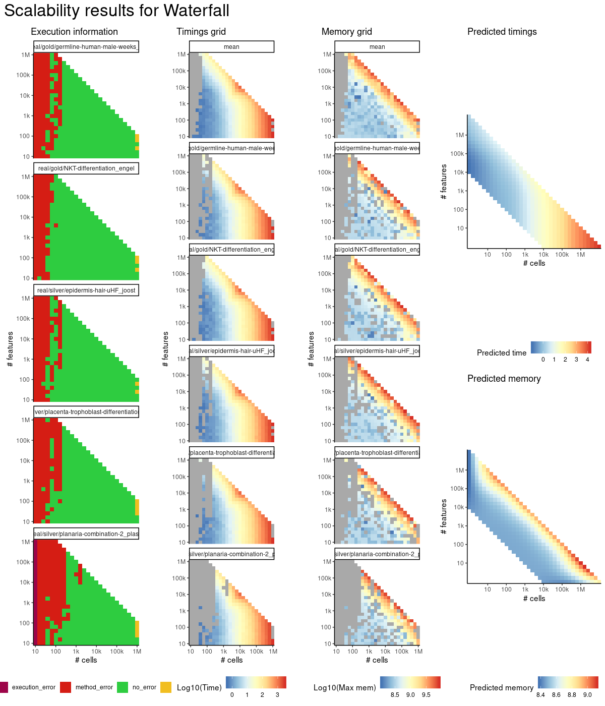
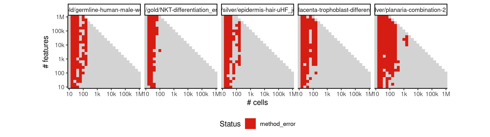

# waterfall


## ERROR STATUS METHOD_ERROR

### ERROR CLUSTER METHOD_ERROR -- 1


 * Number of instances: 104
 * Dataset ids: scaling_0001, scaling_0002, scaling_0003, scaling_0004, scaling_0006, scaling_0008, scaling_0010, scaling_0012, scaling_0016, scaling_0019, scaling_0022, scaling_0025, scaling_0041, scaling_0043, scaling_0045, scaling_0047, scaling_0051, scaling_0056, scaling_0061, scaling_0066, scaling_0076, scaling_0082, scaling_0088, scaling_0094, scaling_0106, scaling_0113, scaling_0120, scaling_0127, scaling_0151, scaling_0157, scaling_0163, scaling_0169, scaling_0181, scaling_0188, scaling_0195, scaling_0202, scaling_0226, scaling_0232, scaling_0238, scaling_0244, scaling_0276, scaling_0287, scaling_0298, scaling_0309, scaling_0341, scaling_0351, scaling_0361, scaling_0371, scaling_0391, scaling_0404, scaling_0417, scaling_0430, scaling_0456, scaling_0466, scaling_0476, scaling_0486, scaling_0556, scaling_0565, scaling_0574, scaling_0583, scaling_0601, scaling_0617, scaling_0633, scaling_0649, scaling_0681, scaling_0698, scaling_0715, scaling_0732, scaling_0766, scaling_0784, scaling_0802, scaling_0820, scaling_0856, scaling_0867, scaling_0878, scaling_0889, scaling_0981, scaling_0995, scaling_1009, scaling_1023, scaling_1051, scaling_1070, scaling_1089, scaling_1108, scaling_1166, scaling_1182, scaling_1198, scaling_1214, scaling_1276, scaling_1297, scaling_1318, scaling_1339, scaling_1441, scaling_1453, scaling_1465, scaling_1477, scaling_1531, scaling_1550, scaling_1569, scaling_1588, scaling_1626, scaling_1648, scaling_1670, scaling_1692

Last 10 lines of scaling_0001:
```
    select
Loading required package: nlme
Attaching package: ‘nlme’
The following object is masked from ‘package:dplyr’:
    collapse
Warning messages:
1: In rgl.init(initValue, onlyNULL) : RGL: unable to open X11 display
2: 'rgl_init' failed, running with rgl.useNULL = TRUE 
Error: number of cluster centres must lie between 1 and nrow(x)
Execution halted
```

### ERROR CLUSTER METHOD_ERROR -- 2


 * Number of instances: 475
 * Dataset ids: scaling_0007, scaling_0011, scaling_0013, scaling_0015, scaling_0017, scaling_0018, scaling_0020, scaling_0021, scaling_0023, scaling_0024, scaling_0026, scaling_0029, scaling_0030, scaling_0031, scaling_0032, scaling_0033, scaling_0034, scaling_0035, scaling_0036, scaling_0037, scaling_0038, scaling_0039, scaling_0040, scaling_0042, scaling_0044, scaling_0046, scaling_0048, scaling_0052, scaling_0057, scaling_0058, scaling_0059, scaling_0062, scaling_0063, scaling_0067, scaling_0068, scaling_0072, scaling_0073, scaling_0075, scaling_0077, scaling_0078, scaling_0079, scaling_0083, scaling_0084, scaling_0089, scaling_0090, scaling_0091, scaling_0095, scaling_0096, scaling_0097, scaling_0101, scaling_0102, scaling_0104, scaling_0107, scaling_0108, scaling_0109, scaling_0110, scaling_0114, scaling_0115, scaling_0121, scaling_0128, scaling_0129, scaling_0135, scaling_0136, scaling_0138, scaling_0141, scaling_0143, scaling_0145, scaling_0147, scaling_0149, scaling_0152, scaling_0154, scaling_0158, scaling_0164, scaling_0166, scaling_0170, scaling_0172, scaling_0176, scaling_0177, scaling_0178, scaling_0179, scaling_0182, scaling_0184, scaling_0189, scaling_0196, scaling_0203, scaling_0204, scaling_0210, scaling_0211, scaling_0213, scaling_0216, scaling_0218, scaling_0220, scaling_0222, scaling_0224, scaling_0227, scaling_0228, scaling_0233, scaling_0239, scaling_0240, scaling_0245, scaling_0251, scaling_0256, scaling_0260, scaling_0261, scaling_0264, scaling_0268, scaling_0269, scaling_0272, scaling_0277, scaling_0278, scaling_0279, scaling_0280, scaling_0281, scaling_0288, scaling_0289, scaling_0290, scaling_0299, scaling_0300, scaling_0302, scaling_0310, scaling_0312, scaling_0321, scaling_0322, scaling_0323, scaling_0324, scaling_0325, scaling_0326, scaling_0331, scaling_0333, scaling_0335, scaling_0337, scaling_0339, scaling_0342, scaling_0343, scaling_0344, scaling_0352, scaling_0362, scaling_0364, scaling_0372, scaling_0373, scaling_0376, scaling_0382, scaling_0383, scaling_0384, scaling_0385, scaling_0386, scaling_0392, scaling_0393, scaling_0394, scaling_0395, scaling_0396, scaling_0405, scaling_0406, scaling_0407, scaling_0418, scaling_0419, scaling_0420, scaling_0421, scaling_0431, scaling_0432, scaling_0433, scaling_0444, scaling_0445, scaling_0446, scaling_0447, scaling_0448, scaling_0449, scaling_0457, scaling_0467, scaling_0477, scaling_0487, scaling_0488, scaling_0490, scaling_0497, scaling_0498, scaling_0499, scaling_0500, scaling_0506, scaling_0510, scaling_0514, scaling_0518, scaling_0522, scaling_0523, scaling_0524, scaling_0526, scaling_0527, scaling_0532, scaling_0538, scaling_0540, scaling_0544, scaling_0546, scaling_0550, scaling_0551, scaling_0552, scaling_0557, scaling_0558, scaling_0559, scaling_0566, scaling_0567, scaling_0575, scaling_0576, scaling_0577, scaling_0584, scaling_0585, scaling_0586, scaling_0593, scaling_0595, scaling_0597, scaling_0602, scaling_0603, scaling_0604, scaling_0606, scaling_0607, scaling_0618, scaling_0619, scaling_0620, scaling_0634, scaling_0635, scaling_0636, scaling_0639, scaling_0650, scaling_0651, scaling_0652, scaling_0653, scaling_0654, scaling_0655, scaling_0666, scaling_0667, scaling_0668, scaling_0669, scaling_0670, scaling_0671, scaling_0673, scaling_0682, scaling_0683, scaling_0684, scaling_0686, scaling_0687, scaling_0699, scaling_0700, scaling_0716, scaling_0717, scaling_0718, scaling_0721, scaling_0733, scaling_0734, scaling_0735, scaling_0736, scaling_0737, scaling_0738, scaling_0750, scaling_0751, scaling_0752, scaling_0753, scaling_0754, scaling_0755, scaling_0756, scaling_0767, scaling_0768, scaling_0769, scaling_0771, scaling_0772, scaling_0785, scaling_0786, scaling_0787, scaling_0803, scaling_0804, scaling_0805, scaling_0808, scaling_0821, scaling_0822, scaling_0823, scaling_0825, scaling_0826, scaling_0839, scaling_0840, scaling_0841, scaling_0842, scaling_0843, scaling_0844, scaling_0845, scaling_0846, scaling_0857, scaling_0858, scaling_0868, scaling_0869, scaling_0870, scaling_0879, scaling_0880, scaling_0890, scaling_0891, scaling_0892, scaling_0901, scaling_0902, scaling_0903, scaling_0911, scaling_0919, scaling_0927, scaling_0935, scaling_0936, scaling_0937, scaling_0943, scaling_0944, scaling_0945, scaling_0946, scaling_0951, scaling_0957, scaling_0963, scaling_0969, scaling_0970, scaling_0975, scaling_0976, scaling_0982, scaling_0983, scaling_0984, scaling_0985, scaling_0996, scaling_0997, scaling_1010, scaling_1011, scaling_1013, scaling_1024, scaling_1025, scaling_1026, scaling_1027, scaling_1038, scaling_1039, scaling_1040, scaling_1041, scaling_1042, scaling_1052, scaling_1053, scaling_1054, scaling_1056, scaling_1071, scaling_1072, scaling_1090, scaling_1091, scaling_1093, scaling_1094, scaling_1109, scaling_1110, scaling_1112, scaling_1113, scaling_1128, scaling_1129, scaling_1130, scaling_1131, scaling_1132, scaling_1133, scaling_1146, scaling_1148, scaling_1150, scaling_1152, scaling_1154, scaling_1156, scaling_1158, scaling_1160, scaling_1162, scaling_1164, scaling_1167, scaling_1169, scaling_1170, scaling_1183, scaling_1199, scaling_1200, scaling_1202, scaling_1215, scaling_1217, scaling_1218, scaling_1231, scaling_1232, scaling_1233, scaling_1234, scaling_1246, scaling_1250, scaling_1254, scaling_1258, scaling_1262, scaling_1263, scaling_1270, scaling_1274, scaling_1277, scaling_1278, scaling_1279, scaling_1280, scaling_1281, scaling_1298, scaling_1299, scaling_1300, scaling_1319, scaling_1320, scaling_1321, scaling_1323, scaling_1340, scaling_1341, scaling_1342, scaling_1343, scaling_1344, scaling_1361, scaling_1362, scaling_1363, scaling_1364, scaling_1365, scaling_1366, scaling_1381, scaling_1382, scaling_1383, scaling_1393, scaling_1394, scaling_1405, scaling_1406, scaling_1417, scaling_1418, scaling_1419, scaling_1429, scaling_1430, scaling_1431, scaling_1442, scaling_1443, scaling_1444, scaling_1454, scaling_1455, scaling_1466, scaling_1468, scaling_1478, scaling_1480, scaling_1490, scaling_1491, scaling_1492, scaling_1493, scaling_1502, scaling_1507, scaling_1513, scaling_1514, scaling_1520, scaling_1525, scaling_1526, scaling_1532, scaling_1533, scaling_1534, scaling_1551, scaling_1552, scaling_1553, scaling_1570, scaling_1571, scaling_1572, scaling_1573, scaling_1589, scaling_1590, scaling_1591, scaling_1592, scaling_1608, scaling_1609, scaling_1610, scaling_1611, scaling_1612, scaling_1627, scaling_1628, scaling_1629, scaling_1649, scaling_1650, scaling_1651, scaling_1671, scaling_1672, scaling_1674, scaling_1693, scaling_1694, scaling_1695, scaling_1696, scaling_1715, scaling_1716, scaling_1717, scaling_1718, scaling_1719

Last 10 lines of scaling_0007:
```
Attaching package: ‘nlme’
The following object is masked from ‘package:dplyr’:
    collapse
Warning messages:
1: In rgl.init(initValue, onlyNULL) : RGL: unable to open X11 display
2: 'rgl_init' failed, running with rgl.useNULL = TRUE 
Error in apply(intersect.i[which(update.idx == 2), ], 1, function(X) { : 
  dim(X) must have a positive length
Calls: pseudotimeprog.foo -> t -> apply
Execution halted
```


