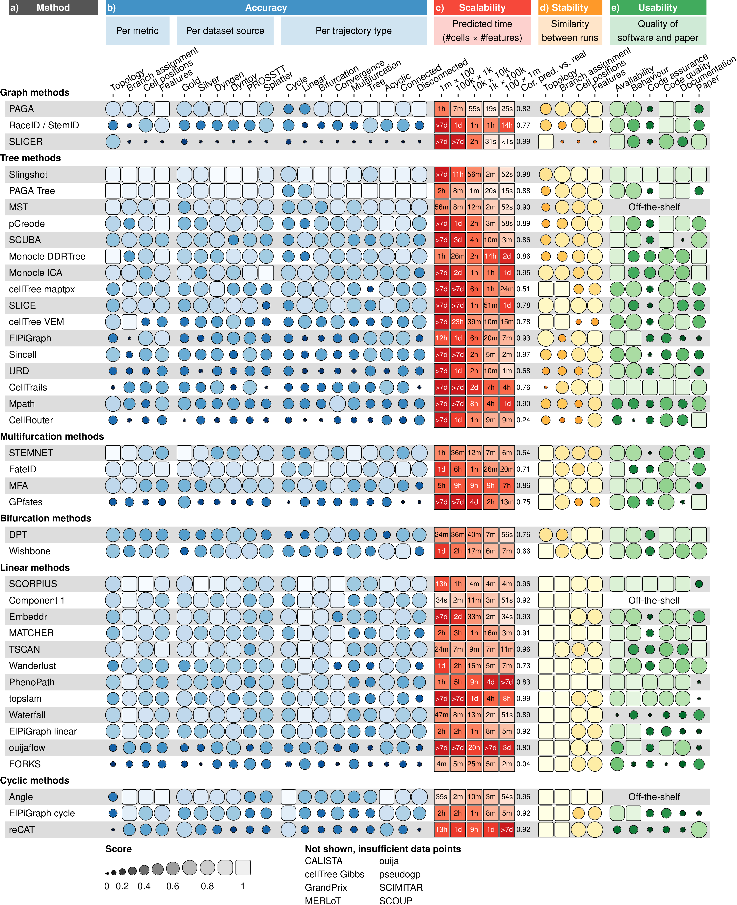
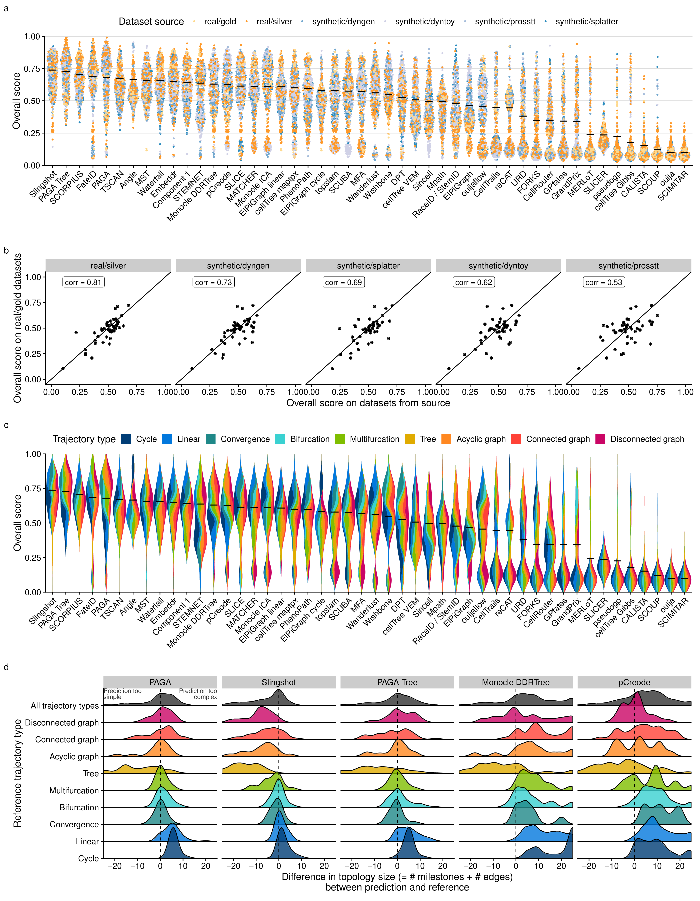

# Accuracy of TI methods on real and synthetic data

<!-- Accuracy methods -->

We defined several metrics to compare a prediction to a reference
trajectory. Based on an analysis of their robustness and conformity to a
set of rules, we chose four metrics each assessing a different aspect of
a trajectory ([**Figure 1b**](#fig_results_detailed)): the topology
(Hamming-Ipsen-Mikhailov, HIM), the quality of the assignment of cells
to branches (F1branches), the cell positions
(cordist) and the accuracy of the differentially expressed
features along the trajectory (wcorfeatures). The data
compendium consisted of both synthetic datasets, which offer the most
exact reference trajectory, and real datasets, which provide the highest
biological relevance. These real datasets come from a variety of
single-cell technologies, organisms, and dynamic processes, and contain
several types of trajectory topologies. Real datasets were classified as
“gold standard” if the reference trajectory was not extracted from the
expression data itself, such as via cellular sorting or cell
mixing[1](#ref-tian_scrnaseqmixologybetter_2018). All other
real datasets were classified as “silver standard”. For synthetic
datasets we used several data simulators, including a simulator of gene
regulatory networks using a thermodynamic model of gene
regulation[2](#ref-schaffter_genenetweaversilicobenchmark_2011).
For each simulation, we used a real dataset as a reference, to match its
dimensions, number of differentially expressed genes, drop-out rates and
other statistical
properties[3](#ref-zappia_splattersimulationsinglecell_2017).

<strong>[**Figure 1**](#fig_results_detailed): Detailed results of the
four main evaluation criteria: accuracy, scalability, stability and
usability.</strong> (a) The names of the methods, ordered as in
[**Figure 2**](#fig_results_summary). (b) Accuracy of trajectory
inference methods across metrics, dataset sources and dataset trajectory
types. The performance of a method is generally more stable across
dataset sources, but very variable depending on the metric and
trajectory type. (c) Predicted execution times for varying numbers of
cells and features (\# cells × \# features). Predictions were made by
training a regression model after running each method on bootstrapped
datasets with varying numbers of cells and features. (d) Stability
results by calculating the average pairwise similarity between models
inferred across multiple runs of the same method. (e) Usability scores
of the tool and corresponding manuscript, grouped per category.
Off-the-shelf methods were directly implemented in R and thus do not
have a usability score.

-----

<!-- Accuracy overview -->

We found that method performance was very variable across datasets,
indicating that there is no “one-size-fits-all” method that works well
on every dataset ([**Figure 3a**](#fig_benchmark_interpretation)). Even
methods which can detect most of the trajectory types, such as PAGA,
RaceID/StemID and SLICER were not the best methods across all trajectory
types ([**Figure 1b**](#fig_results_detailed)). The overall score
between the different dataset sources was moderately to highly
correlated (0.5 - 0.9) with the scores on real datasets containing a
gold standard ([**Figure 3b**](#fig_benchmark_interpretation)),
confirming both the accuracy of the gold standard trajectories and the
relevance of the synthetic data. On the other hand, the different
metrics frequently disagreed with each other, with Monocle and PAGA Tree
scoring better on the topology scores, while other methods, such as
Slingshot, were better at ordering the cells and placing them into the
correct branches ([**Figure 1b**](#fig_results_detailed)).

<!-- Topologies-->

The performance of a method was strongly dependent on the type of
trajectory present in the data ([**Figure 1b**](#fig_results_detailed)).
Slingshot typically performed better on datasets containing more simple
topologies, while PAGA, pCreode and RaceID/StemID had higher scores on
datasets with trees or more complex trajectories ([**Figure
3c**](#fig_benchmark_interpretation)). This was reflected in the types
of topologies detected by every method, as those predicted by Slingshot
tended to contain less branches, while those detected by PAGA, pCreode
and Monocle DDRTree gravitated towards more complex topologies
([**Figure 3d**](#fig_benchmark_interpretation)). This analysis
therefore indicates that detecting the right topology is still a
difficult task for most of these methods, because methods tend to be
either too optimistic or too pessimistic regarding the complexity of the
topology in the data.

<strong>[**Figure 3**](#fig_benchmark_interpretation): Accuracy of
trajectory inference methods.</strong> (a) Overall score for all methods
and datasets, colored by the source of the datasets. (c) Similarity
between the overall scores of all dataset sources, compared to real
datasets with a gold standard. (b) Bias in the overall score towards
trajectory types. (d) Distributions of the difference in size between
predicted and reference topologies. A positive difference means that the
topology predicted by the method is more complex than the one in the
reference.

-----

# References

1\. Tian, L. *et al.* scRNA-seq mixology: Towards better benchmarking of
single cell RNA-seq protocols and analysis methods. *bioRxiv* 433102
(2018). doi:[10.1101/433102](https://doi.org/10.1101/433102)

2\. Schaffter, T., Marbach, D. & Floreano, D. GeneNetWeaver: In silico
benchmark generation and performance profiling of network inference
methods. *Bioinformatics (Oxford, England)* **27**, 2263–2270 (2011).

3\. Zappia, L., Phipson, B. & Oshlack, A. Splatter: Simulation of
single-cell RNA sequencing data. *Genome Biology* **18**, 174 (2017).

