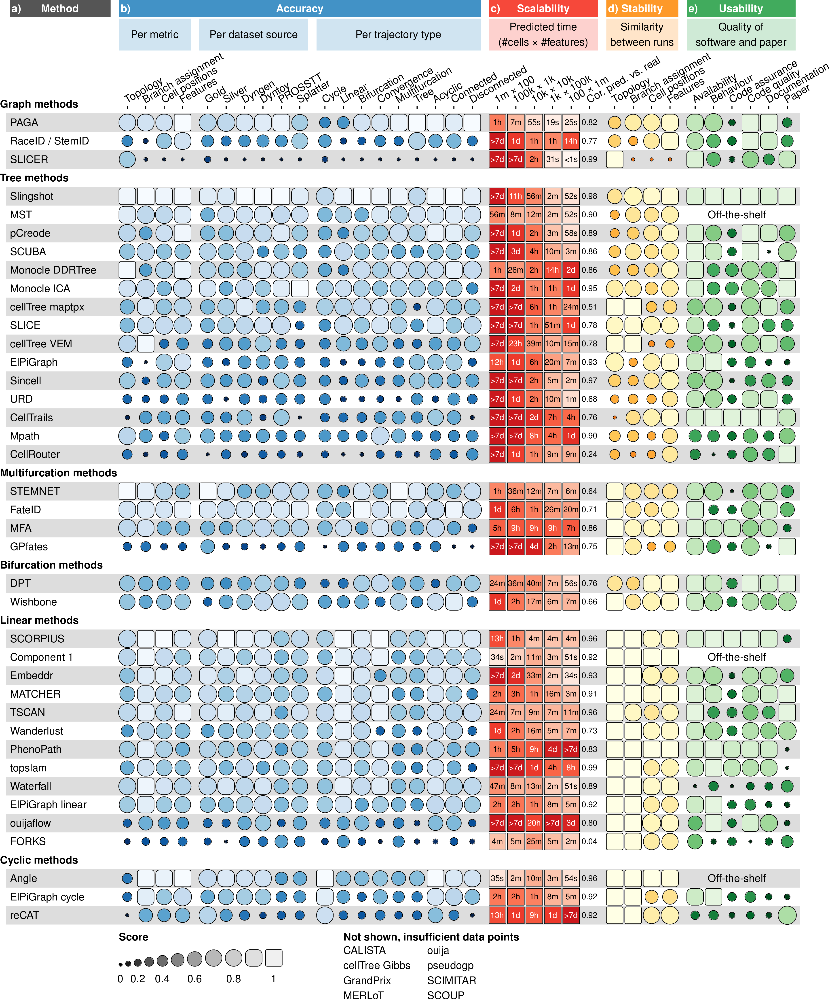

# Stability of the inferred trajectory

It is not only important that a method is able to infer an accurate
model in a reasonable time frame, but also that it produces a similar
model when given very similar input data. In order to test the stability
of each method, we executed each method on 10 different subsamples of
the datasets (95% of the cells, 95% of the features), and calculated the
average similarity between each pair of models using the same scores
used to assess the accuracy of a trajectory ([**Figure
1d**](#fig_results_detailed)).

Given that the trajectories of methods which fix the topology either
algorithmically or through a parameter is already very constrained, it
is to be expected that such methods tend to generate very stable
results. Nonetheless, some fixed topology methods still produced
slightly more stable results, such as SCORPIUS and MATCHER for linear
methods, and MFA for multifurcating methods. Stability was much more
diverse among methods with a free topology. Slingshot produced more
stable models than PAGA (Tree), which in turn produced more stable
results than pCreode and Monocle DDRTree.

<strong>[**Figure 1**](#fig_results_detailed): Detailed results of the
four main evaluation criteria: accuracy, scalability, stability and
usability.</strong> (a) The names of the methods. (b) Accuracy of
trajectory inference methods across metrics, dataset sources and dataset
trajectory types. The performance of a method is generally more stable
across dataset sources, but very variable depending on the metric and
trajectory type. (c) Predicted execution times for varying numbers of
cells and features (\# cells × \# features). Predictions were made by
training a regression model after running each method on bootstrapped
datasets with varying numbers of cells and features. (d) Stability
results by calculating the average pairwise similarity between models
inferred across multiple runs of the same method. (e) Usability scores
of the tool and corresponding manuscript, grouped per category.
Off-the-shelf methods were directly implemented in R and thus do not
have a usability score.

-----
