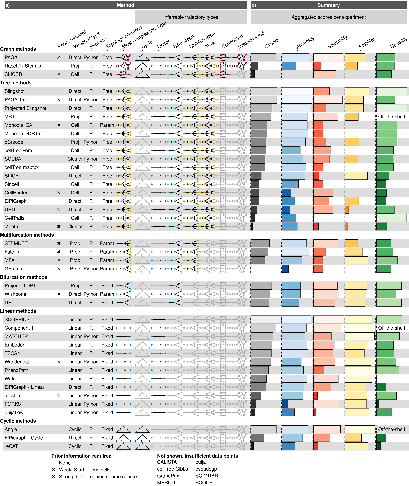
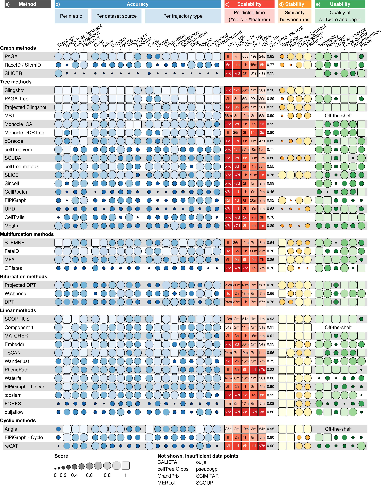

# Summarising the results into *funky heatmaps*

To make the main results from the different experiments (accuracy,
scalability, stability and usability) interpretable, we used an
aggregation procedure as discussed in
[/02-metrics/03-aggregation](/02-metrics/03-aggregation).

We summarised this aggregation in two “funky heatmaps”: an average
scores for each experiment with also more qualitative information on
each method ([**Figure 1**](#fig_results_summary)), but also looked at
different intersections of the experiments, such as dataset types,
dataset sizes, or specific usability features ([**Figure
2**](#fig_results_detailed)). For the true enthusiasts, we also provide
a funky heatmap containing nearly all relevant information on the
benchmark results ([**Figure 3**](#fig_results)), although either an 8K
monitor or a poster printer is recommended for proper viewing.

<strong>[**Figure 1**](#fig_results_summary): A characterisation of the
methods evaluated in this study, and their overall evaluation
results.</strong> (a) We characterised the methods according to the
wrapper type, their required priors, whether the inferred topology is
constrained by the algorithm (fixed) or a parameter (param), and the
types of inferable topologies. The methods are grouped vertically based
on the most complex trajectory type they can infer. (b) The overall
results of the evaluation on four criteria: accuracy using a reference
trajectory on real and synthetic data, scalability with increasing
number of cells and features, stability across dataset subsamples, and
quality of the implementation. Methods which errored on more than 50% of
the datasets were removed from this figure, and are shown in
{ref(‘sfig’, ‘results’)} instead.

-----

<strong>[**Figure 2**](#fig_results_detailed): Detailed results of the
four main evaluation criteria: accuracy, scalability, stability and
usability.</strong> (a) The names of the methods, ordered as in
[**Figure 1**](#fig_results_summary). (b) Accuracy of trajectory
inference methods across metrics, dataset sources and dataset trajectory
types. The performance of a method is generally more stable across
dataset sources, but very variable depending on the metric and
trajectory type. (c) Predicted execution times for varying numbers of
cells and features (\# cells × \# features). Predictions were made by
training a regression model after running each method on bootstrapped
datasets with varying numbers of cells and features. (d) Stability
results by calculating the average pairwise similarity between models
inferred across multiple runs of the same method. (e) Usability scores
of the tool and corresponding manuscript, grouped per category.
Off-the-shelf methods were directly implemented in R and thus do not
have a usability score.

-----

<strong>[**Figure 3**](#fig_results): Results from the evaluation, for
all methods and across all evaluation criteria.</strong> (a) We
characterised the methods according to the wrapper type, their required
priors, whether the inferred topology is constrained by the algorithm
(fixed) or a parameter (param), and the types of inferable topologies.
The methods are grouped vertically based on the most complex trajectory
type they can infer. (b) The overall results of the evaluation on four
criteria: benchmarking using a reference trajectory on real and
synthetic data, scalability with increasing number of cells and
features, stability across dataset subsamples, and quality of the
implementation. (c) Accuracy of trajectory inference methods across
metrics, dataset sources and dataset trajectory types. The performance
of a method is generally more stable across dataset sources, but very
variable depending on the metric and trajectory type. (d) Predicted
execution times and memory usage for varying numbers of cells and
features (\# cells × \# features). Predictions were made by training a
regression model after running each method on bootstrapped datasets with
varying numbers of cells and features. (e) Stability results by
calculating the average pairwise similarity between models inferred
across multiple runs of the same method. (f) Usability scores of the
tool and corresponding manuscript, grouped per category.

-----
